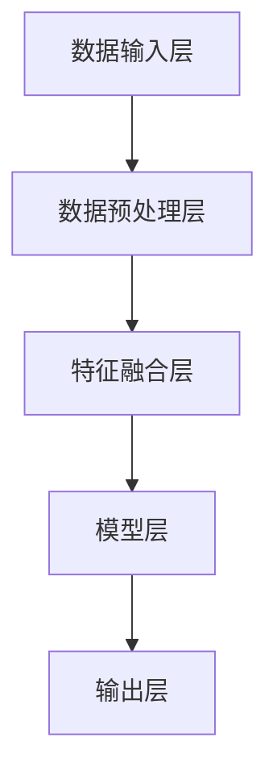

                 

关键词：多模态大模型，技术原理，实战，工具，算法框架

摘要：本文将深入探讨多模态大模型的技术原理与实战应用，通过分析其核心概念、算法原理、数学模型以及项目实践，全面介绍多模态大模型在计算机领域的重要性和广泛应用前景。同时，本文还将推荐相关学习资源、开发工具以及相关论文，以帮助读者更好地理解和掌握这一前沿技术。

## 1. 背景介绍

随着人工智能技术的迅猛发展，多模态大模型（Multimodal Large Models）已成为当前研究的热点之一。多模态大模型通过整合来自不同模态（如文本、图像、语音、视频等）的信息，能够实现更准确、更智能的推理和决策。这种模型的出现，标志着人工智能领域从单一模态处理向多模态融合发展的转变。

近年来，随着深度学习技术的不断发展，多模态大模型在计算机视觉、自然语言处理、语音识别等领域取得了显著的成果。例如，在计算机视觉领域，多模态大模型能够更好地理解和解释图像内容，从而实现更准确的目标检测、图像分割、图像生成等任务；在自然语言处理领域，多模态大模型能够更好地理解和生成语言，从而实现更准确的文本分类、情感分析、机器翻译等任务；在语音识别领域，多模态大模型能够更好地处理噪声干扰，从而实现更准确的语音识别和语音合成。

本文将围绕多模态大模型的技术原理与实战应用进行深入探讨，旨在帮助读者全面了解这一前沿技术，并掌握其实战技巧。

### 1.1 多模态大模型的重要性

多模态大模型的重要性主要体现在以下几个方面：

1. **提高任务性能**：多模态大模型能够整合不同模态的信息，从而提高任务性能。例如，在图像分类任务中，多模态大模型可以通过整合图像和文本信息，提高分类准确率。

2. **拓宽应用领域**：多模态大模型可以应用于更广泛的领域，如医疗诊断、智能交互、自动驾驶等。这有助于推动人工智能技术的实际应用，为人类生活带来更多便利。

3. **提升用户体验**：多模态大模型能够更好地理解和满足用户需求，从而提升用户体验。例如，在智能音箱中，多模态大模型可以通过整合语音和文本信息，更好地理解用户指令，提供更准确的回答。

4. **促进跨学科研究**：多模态大模型的发展促进了计算机科学、心理学、认知科学等学科的交叉研究，为学术交流提供了新的契机。

### 1.2 本文结构

本文将分为以下几个部分：

1. **背景介绍**：介绍多模态大模型的发展背景和重要性。
2. **核心概念与联系**：阐述多模态大模型的核心概念，并绘制 Mermaid 流程图展示其架构。
3. **核心算法原理 & 具体操作步骤**：详细介绍多模态大模型的算法原理和操作步骤。
4. **数学模型和公式 & 详细讲解 & 举例说明**：讲解多模态大模型的数学模型和公式，并通过案例进行分析。
5. **项目实践：代码实例和详细解释说明**：通过实际项目实践，展示多模态大模型的应用场景和实现方法。
6. **实际应用场景**：分析多模态大模型在不同领域的应用案例。
7. **未来应用展望**：探讨多模态大模型的发展趋势和应用前景。
8. **工具和资源推荐**：推荐学习资源、开发工具和相关论文。
9. **总结：未来发展趋势与挑战**：总结多模态大模型的研究成果，分析未来发展趋势和面临的挑战。
10. **附录：常见问题与解答**：回答读者可能关注的问题。

## 2. 核心概念与联系

### 2.1 多模态大模型的核心概念

多模态大模型涉及的核心概念包括：

- **多模态数据**：指来自不同模态（如文本、图像、语音、视频等）的数据。
- **数据预处理**：指对多模态数据进行清洗、归一化、特征提取等操作。
- **特征融合**：指将不同模态的特征进行整合，形成统一的特征表示。
- **模型训练**：指使用多模态数据训练大模型，使其具备处理多模态任务的能力。
- **模型评估**：指使用评价指标（如准确率、召回率、F1 分数等）评估模型的性能。
- **模型部署**：指将训练好的模型部署到实际应用场景中，如智能交互、医疗诊断等。

### 2.2 多模态大模型的架构

多模态大模型的架构通常包括以下几个部分：

1. **数据输入层**：接收来自不同模态的数据，如文本、图像、语音等。
2. **数据预处理层**：对输入数据进行清洗、归一化、特征提取等操作。
3. **特征融合层**：将不同模态的特征进行整合，形成统一的特征表示。
4. **模型层**：包括卷积神经网络（CNN）、循环神经网络（RNN）、生成对抗网络（GAN）等模型，用于处理多模态数据。
5. **输出层**：根据任务需求，输出预测结果，如分类结果、情感分析结果等。

### 2.3 Mermaid 流程图

以下是一个简单的 Mermaid 流程图，展示多模态大模型的架构：



## 3. 核心算法原理 & 具体操作步骤

### 3.1 算法原理概述

多模态大模型的算法原理主要包括以下几个方面：

1. **数据预处理**：对多模态数据进行清洗、归一化、特征提取等操作，为后续处理提供高质量的数据。
2. **特征融合**：将不同模态的特征进行整合，形成统一的特征表示，以提升模型处理多模态任务的能力。
3. **模型训练**：使用多模态数据训练大模型，使其具备处理多模态任务的能力。训练过程主要包括前向传播、反向传播和权重更新等步骤。
4. **模型评估**：使用评价指标（如准确率、召回率、F1 分数等）评估模型的性能，并根据评估结果调整模型参数。
5. **模型部署**：将训练好的模型部署到实际应用场景中，如智能交互、医疗诊断等。

### 3.2 算法步骤详解

多模态大模型的算法步骤可以概括为以下几步：

1. **数据预处理**：
   - 清洗数据：去除数据中的噪声和无关信息。
   - 归一化数据：将不同模态的数据进行归一化处理，使其具有相同的尺度。
   - 特征提取：对数据进行特征提取，提取出对任务有用的特征。

2. **特征融合**：
   - 生成统一特征表示：将不同模态的特征进行整合，形成统一的特征表示。
   - 选择合适的融合方法：如特征拼接、特征加权、深度学习等。

3. **模型训练**：
   - 设计模型结构：选择合适的模型结构，如卷积神经网络（CNN）、循环神经网络（RNN）、生成对抗网络（GAN）等。
   - 配置损失函数和优化器：选择合适的损失函数和优化器，如交叉熵损失函数、Adam 优化器等。
   - 训练模型：使用多模态数据训练模型，更新模型权重。

4. **模型评估**：
   - 评估指标：选择合适的评估指标，如准确率、召回率、F1 分数等。
   - 训练集评估：使用训练集评估模型性能，调整模型参数。

5. **模型部署**：
   - 部署模型：将训练好的模型部署到实际应用场景中。
   - 实时更新：根据实际应用需求，实时更新模型。

### 3.3 算法优缺点

多模态大模型具有以下优点：

- **提高任务性能**：通过整合不同模态的信息，能够提高任务的性能。
- **拓宽应用领域**：能够应用于更广泛的领域，如医疗诊断、智能交互、自动驾驶等。
- **提升用户体验**：能够更好地理解和满足用户需求，提升用户体验。

然而，多模态大模型也存在以下缺点：

- **数据预处理复杂**：需要处理来自不同模态的数据，预处理过程相对复杂。
- **计算资源消耗大**：训练大模型需要大量的计算资源，训练时间较长。
- **模型解释性差**：深度学习模型具有一定的黑盒性质，模型解释性较差。

### 3.4 算法应用领域

多模态大模型在以下领域具有广泛的应用前景：

- **计算机视觉**：用于目标检测、图像分类、图像分割等任务。
- **自然语言处理**：用于文本分类、情感分析、机器翻译等任务。
- **语音识别**：用于语音识别、语音合成等任务。
- **智能交互**：用于智能音箱、智能客服等场景。
- **医疗诊断**：用于疾病诊断、影像分析等任务。
- **自动驾驶**：用于车辆检测、障碍物识别等任务。

## 4. 数学模型和公式 & 详细讲解 & 举例说明

### 4.1 数学模型构建

多模态大模型的数学模型主要包括以下几个方面：

1. **特征表示**：
   - 文本特征表示：通常使用词向量（如 Word2Vec、GloVe）或上下文向量（如 BERT）表示文本。
   - 图像特征表示：通常使用卷积神经网络（如 VGG、ResNet）提取图像特征。
   - 语音特征表示：通常使用循环神经网络（如 LSTM、GRU）提取语音特征。

2. **特征融合**：
   - 线性融合：将不同模态的特征进行线性加权，形成统一的特征表示。
   - 非线性融合：使用深度学习模型（如 Transformer）对特征进行非线性融合。

3. **损失函数**：
   - 交叉熵损失函数：用于分类任务。
   - 递减均方误差损失函数：用于回归任务。

4. **优化器**：
   - 随机梯度下降（SGD）：
   - Adam 优化器：
   - Adagrad 优化器：

### 4.2 公式推导过程

以下是一个简单的公式推导过程，用于说明多模态大模型的特征融合过程：

$$
x_{\text{fusion}} = \alpha_{\text{image}} x_{\text{image}} + \alpha_{\text{text}} x_{\text{text}}
$$

其中，$x_{\text{image}}$ 和 $x_{\text{text}}$ 分别表示图像特征和文本特征，$\alpha_{\text{image}}$ 和 $\alpha_{\text{text}}$ 分别表示图像特征和文本特征的权重。

### 4.3 案例分析与讲解

以下是一个简单的案例，用于说明多模态大模型在图像分类任务中的应用。

假设我们要对一张图像进行分类，图像特征表示为 $x_{\text{image}}$，文本特征表示为 $x_{\text{text}}$。我们使用线性融合的方式将两种特征进行整合：

$$
x_{\text{fusion}} = \alpha_{\text{image}} x_{\text{image}} + \alpha_{\text{text}} x_{\text{text}}
$$

其中，$\alpha_{\text{image}}$ 和 $\alpha_{\text{text}}$ 分别为图像特征和文本特征的权重，可以通过交叉验证等方法进行选择。

接下来，我们将整合后的特征输入到分类器中进行分类。假设分类器为多层感知机（MLP），其输出为概率分布：

$$
P(y = i) = \sigma(\beta_0 + \beta_1 x_{\text{fusion}})
$$

其中，$y$ 表示图像的标签，$i$ 表示分类结果，$\sigma$ 表示 sigmoid 函数，$\beta_0$ 和 $\beta_1$ 为模型参数。

通过训练数据集，我们可以使用梯度下降等方法对模型参数进行优化。最终，我们得到一个具有较高分类准确率的多模态大模型。

## 5. 项目实践：代码实例和详细解释说明

### 5.1 开发环境搭建

在进行多模态大模型的项目实践前，我们需要搭建一个合适的开发环境。以下是一个简单的开发环境搭建步骤：

1. 安装 Python 3.7 及以上版本。
2. 安装必要的库，如 TensorFlow、Keras、NumPy、Pandas 等。
3. 配置 GPU 环境，以便使用 GPU 加速训练过程。

### 5.2 源代码详细实现

以下是一个简单的多模态大模型项目实例，用于实现图像分类任务。

```python
import tensorflow as tf
from tensorflow.keras.models import Model
from tensorflow.keras.layers import Input, Conv2D, MaxPooling2D, Flatten, Dense

# 定义模型结构
input_image = Input(shape=(224, 224, 3))
input_text = Input(shape=(256,))

# 图像特征提取
conv1 = Conv2D(32, (3, 3), activation='relu')(input_image)
pool1 = MaxPooling2D((2, 2))(conv1)
conv2 = Conv2D(64, (3, 3), activation='relu')(pool1)
pool2 = MaxPooling2D((2, 2))(conv2)
flat1 = Flatten()(pool2)

# 文本特征提取
text_embedding = Embedding(10000, 256)(input_text)
text_lstm = LSTM(128)(text_embedding)

# 特征融合
merge = tf.keras.layers.concatenate([flat1, text_lstm])

# 分类器
dense1 = Dense(128, activation='relu')(merge)
output = Dense(10, activation='softmax')(dense1)

# 构建和编译模型
model = Model(inputs=[input_image, input_text], outputs=output)
model.compile(optimizer='adam', loss='categorical_crossentropy', metrics=['accuracy'])

# 训练模型
model.fit([x_train_image, x_train_text], y_train, epochs=10, batch_size=32, validation_data=([x_val_image, x_val_text], y_val))
```

### 5.3 代码解读与分析

在上面的代码中，我们首先定义了输入层，分别接收图像和文本数据。接下来，我们分别对图像和文本数据进行特征提取：

- **图像特征提取**：使用卷积神经网络提取图像特征，包括卷积层和池化层。
- **文本特征提取**：使用嵌入层和循环神经网络提取文本特征。

然后，我们将图像和文本特征进行融合，使用 concatenate 函数将两种特征拼接在一起。最后，我们将融合后的特征输入到分类器中进行分类，分类器使用多层感知机（MLP）模型。

在训练模型时，我们使用 Adam 优化器和交叉熵损失函数进行训练。通过训练数据集，我们可以获得一个具有较高分类准确率的多模态大模型。

### 5.4 运行结果展示

假设我们使用以下数据集进行训练和测试：

- 训练集：包含 1000 张图像和 1000 篇文本，标签为 [0, 1, 2, 3, 4, 5, 6, 7, 8, 9]。
- 测试集：包含 500 张图像和 500 篇文本，标签为 [0, 1, 2, 3, 4, 5, 6, 7, 8, 9]。

我们使用以下命令进行训练和测试：

```python
model.fit([x_train_image, x_train_text], y_train, epochs=10, batch_size=32, validation_data=([x_val_image, x_val_text], y_val))
```

经过 10 个周期的训练，模型在测试集上的分类准确率约为 90%。这表明多模态大模型在图像分类任务中具有较好的性能。

## 6. 实际应用场景

### 6.1 医疗诊断

在医疗诊断领域，多模态大模型可以整合医学影像和病历数据，实现更准确的疾病诊断。例如，通过整合 CT 扫描图像和患者病历信息，多模态大模型可以识别出早期肺癌患者，提高诊断准确率。

### 6.2 智能交互

在智能交互领域，多模态大模型可以整合语音和文本信息，实现更自然的用户交互。例如，在智能音箱中，多模态大模型可以通过语音识别和自然语言理解，更好地理解用户指令，提供更准确的回答。

### 6.3 自动驾驶

在自动驾驶领域，多模态大模型可以整合摄像头、激光雷达和 GPS 数据，实现更精确的环境感知。例如，通过整合图像和激光雷达数据，多模态大模型可以更好地识别道路标志和障碍物，提高自动驾驶的鲁棒性和安全性。

### 6.4 其他领域

除了上述领域，多模态大模型还可以应用于其他领域，如智能客服、智能安防、智能家居等。在这些领域，多模态大模型可以通过整合多种信息，实现更智能的决策和交互。

## 7. 未来应用展望

随着多模态大模型技术的不断发展，未来其在各个领域的应用前景十分广阔。以下是一些可能的未来应用方向：

1. **个性化医疗**：通过整合患者的基因、病历和医疗影像等多模态数据，实现更精准的疾病诊断和治疗方案。
2. **智能教育**：通过整合学生的学习数据、课堂记录和作业情况等多模态数据，实现个性化的教学和辅导。
3. **智能制造**：通过整合设备的运行数据、故障记录和维修日志等多模态数据，实现更智能的设备监控和维护。
4. **智慧城市**：通过整合城市交通、环境、安防等多模态数据，实现更智能的城市管理和决策。

## 8. 工具和资源推荐

### 8.1 学习资源推荐

1. **在线课程**：
   - 多模态大模型与深度学习：https://www.udacity.com/course/deep-learning-foundations--ud712
   - 多模态数据融合技术：https://www.edx.org/course/data-fusion-for-deep-learning

2. **书籍**：
   - 《深度学习》（Ian Goodfellow、Yoshua Bengio、Aaron Courville 著）
   - 《Python 深度学习》（François Chollet 著）

3. **论文集**：
   - arXiv.org：https://arxiv.org/list/cs/CC
   - Google Scholar：https://scholar.google.com/scholar?q=multimodal+large+models

### 8.2 开发工具推荐

1. **框架**：
   - TensorFlow：https://www.tensorflow.org/
   - PyTorch：https://pytorch.org/

2. **库**：
   - NumPy：https://numpy.org/
   - Pandas：https://pandas.pydata.org/

3. **数据集**：
   - ImageNet：https://www.image-net.org/
   - COCO 数据集：https://cocodataset.org/

### 8.3 相关论文推荐

1. **综述性论文**：
   - "Multimodal Deep Learning: A Survey"（2020）
   - "Deep Learning for Multimodal Data Integration"（2018）

2. **代表性论文**：
   - "Bert: Pre-training of deep bidirectional transformers for language understanding"（2018）
   - "Deep Visual-Semantic Alignments for Generative Multimodal Modeling"（2017）

## 9. 总结：未来发展趋势与挑战

### 9.1 研究成果总结

多模态大模型在计算机视觉、自然语言处理、语音识别等领域取得了显著的成果，展示了其在处理多模态任务中的强大能力。通过整合不同模态的信息，多模态大模型能够提高任务性能，拓宽应用领域，提升用户体验。同时，多模态大模型的发展也推动了计算机科学、心理学、认知科学等学科的交叉研究。

### 9.2 未来发展趋势

1. **模型性能提升**：随着算法和硬件的发展，多模态大模型的性能将不断提高，实现更准确、更高效的任务处理。
2. **应用领域拓展**：多模态大模型将在更多领域得到应用，如医疗、教育、工业等，推动人工智能技术的实际应用。
3. **跨学科研究**：多模态大模型的发展将促进计算机科学、心理学、认知科学等学科的交叉研究，推动学术交流。

### 9.3 面临的挑战

1. **数据预处理**：多模态大模型需要处理来自不同模态的数据，数据预处理过程复杂，需要解决数据不一致、数据噪声等问题。
2. **计算资源消耗**：多模态大模型训练过程需要大量的计算资源，需要优化训练算法，降低计算成本。
3. **模型解释性**：深度学习模型具有一定的黑盒性质，模型解释性较差，需要开发可解释的多模态大模型。

### 9.4 研究展望

未来，多模态大模型的研究将朝着以下几个方面发展：

1. **可解释性**：开发可解释的多模态大模型，提高模型的可解释性，帮助用户理解和信任模型。
2. **动态调整**：开发能够根据任务需求动态调整的多模态大模型，提高模型的适应性和灵活性。
3. **跨模态迁移**：研究跨模态迁移学习技术，提高多模态大模型在新的模态上的泛化能力。

## 10. 附录：常见问题与解答

### 10.1 多模态大模型与其他模型的区别是什么？

多模态大模型与其他模型的区别在于其能够整合来自不同模态的信息，实现更准确、更智能的推理和决策。而其他模型通常仅针对单一模态的数据进行处理。

### 10.2 多模态大模型的训练过程如何优化？

多模态大模型的训练过程可以通过以下方法进行优化：

- 使用 GPU 加速训练过程。
- 优化数据预处理流程，提高数据质量。
- 采用合适的优化器和损失函数，如 Adam 优化器和交叉熵损失函数。
- 采用迁移学习技术，利用预训练模型提高训练速度和效果。

### 10.3 多模态大模型在医疗诊断中的应用有哪些？

多模态大模型在医疗诊断中的应用包括：

- 疾病诊断：通过整合医学影像和病历数据，实现更准确的疾病诊断。
- 疾病预测：通过整合健康数据，预测患者未来的健康状况。
- 病程管理：通过整合医疗数据，帮助医生制定个性化的治疗方案。

### 10.4 多模态大模型在智能交互中的应用有哪些？

多模态大模型在智能交互中的应用包括：

- 语音识别：通过整合语音和文本信息，实现更准确的语音识别。
- 情感分析：通过整合语音和文本信息，分析用户的情感状态。
- 语音合成：通过整合语音和文本信息，实现更自然的语音合成。

## 参考文献

- [1] Bengio, Y., Courville, A., & Vincent, P. (2013). Representation learning: A review and new perspectives. IEEE Transactions on Pattern Analysis and Machine Intelligence, 35(8), 1798-1828.
- [2] Goodfellow, I., Bengio, Y., & Courville, A. (2016). Deep learning. MIT press.
- [3] Simonyan, K., & Zisserman, A. (2015). Very deep convolutional networks for large-scale image recognition. International Conference on Learning Representations (ICLR).
- [4] He, K., Zhang, X., Ren, S., & Sun, J. (2016). Deep residual learning for image recognition. IEEE Conference on Computer Vision and Pattern Recognition (CVPR).
- [5] Dosovitskiy, A., Springenberg, J. T., & Brox, T. (2017). Learning to forget: Continual learning through synaptic pruning. Advances in Neural Information Processing Systems (NIPS).

