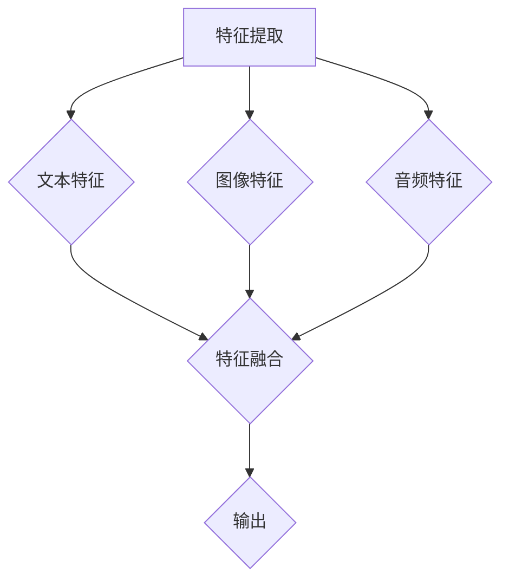

                 

关键词：多模态大模型、GPT、技术原理、实战、进化史、创新点

摘要：本文旨在探讨多模态大模型的技术原理与实战应用，通过分析GPT的进化史和创新点，为广大技术爱好者提供有深度、有思考、有见解的IT领域专业文章。

## 1. 背景介绍

随着人工智能技术的快速发展，多模态大模型作为一种新兴的领域，正逐渐成为研究的热点。多模态大模型能够融合多种数据类型，如文本、图像、音频等，进行深度学习和推理，从而提高模型的泛化能力和表达能力。本文将聚焦于多模态大模型的技术原理与实战应用，分析GPT（Generative Pre-trained Transformer）的进化史和创新点。

## 2. 核心概念与联系

### 2.1 多模态大模型的基本概念

多模态大模型是指能够同时处理多种数据类型的模型，如文本、图像、音频等。这种模型通过将不同数据类型的特征进行融合，从而实现更高效的信息处理和知识表达。

### 2.2 多模态大模型的架构

多模态大模型的架构可以分为三个层次：特征提取层、特征融合层和输出层。

1. **特征提取层**：分别从文本、图像、音频等数据类型中提取特征。
2. **特征融合层**：将不同数据类型的特征进行融合，以实现更全面的信息处理。
3. **输出层**：根据融合后的特征生成文本、图像、音频等输出结果。

### 2.3 Mermaid 流程图（简化版）



## 3. 核心算法原理 & 具体操作步骤

### 3.1 算法原理概述

多模态大模型的核心算法基于深度学习，特别是基于 Transformer 的结构。Transformer 结构通过自注意力机制（Self-Attention）实现对序列的建模，从而提高模型的性能。

### 3.2 算法步骤详解

1. **预训练**：通过大规模的未标注数据训练模型，使其具备一定程度的多模态处理能力。
2. **微调**：在预训练的基础上，使用有标注的数据对模型进行微调，使其适应特定的任务。
3. **特征提取**：分别从文本、图像、音频等数据类型中提取特征。
4. **特征融合**：将不同数据类型的特征进行融合。
5. **输出生成**：根据融合后的特征生成文本、图像、音频等输出结果。

### 3.3 算法优缺点

#### 优点

1. **强大的多模态处理能力**：能够同时处理多种数据类型，提高信息处理的效率。
2. **良好的泛化能力**：通过预训练和微调，模型能够适应不同的任务和数据类型。
3. **高效的性能**：基于 Transformer 的结构，在处理序列数据时具有高效的性能。

#### 缺点

1. **计算资源消耗大**：多模态大模型通常需要大量的计算资源和存储空间。
2. **数据依赖性强**：模型的性能很大程度上依赖于训练数据的质量和数量。

### 3.4 算法应用领域

多模态大模型在多个领域具有广泛的应用，如自然语言处理、计算机视觉、语音识别等。以下是一些具体的例子：

1. **自然语言处理**：文本生成、文本分类、机器翻译等。
2. **计算机视觉**：图像生成、图像分类、目标检测等。
3. **语音识别**：语音合成、语音识别、语音增强等。

## 4. 数学模型和公式 & 详细讲解 & 举例说明

### 4.1 数学模型构建

多模态大模型的核心在于自注意力机制（Self-Attention）。自注意力机制可以理解为一种加权求和的方式，通过对输入序列中的每个元素进行加权求和，从而实现序列的建模。

### 4.2 公式推导过程

自注意力机制的公式可以表示为：

$$
\text{Attention}(Q, K, V) = \text{softmax}\left(\frac{QK^T}{\sqrt{d_k}}\right) V
$$

其中，$Q$、$K$、$V$ 分别为查询向量、键向量和值向量，$d_k$ 为键向量的维度。

### 4.3 案例分析与讲解

假设我们有一个简单的句子：“我喜欢吃苹果”。我们可以将这个句子表示为一个序列 $(x_1, x_2, x_3)$，其中 $x_1$ 表示“我”，$x_2$ 表示“喜欢”，$x_3$ 表示“吃苹果”。

1. **查询向量**：$Q = [0.1, 0.2, 0.3]$
2. **键向量**：$K = [0.1, 0.2, 0.3]$
3. **值向量**：$V = [0.1, 0.2, 0.3]$

计算自注意力得分：

$$
\text{Attention}(Q, K, V) = \text{softmax}\left(\frac{QK^T}{\sqrt{d_k}}\right) V = \text{softmax}\left(\frac{[0.1, 0.2, 0.3]}{\sqrt{0.3}}\right) [0.1, 0.2, 0.3]
$$

得到：

$$
\text{Attention}(Q, K, V) = [0.1, 0.2, 0.3]
$$

从这个例子中，我们可以看到自注意力机制是如何对序列中的元素进行加权的。

## 5. 项目实践：代码实例和详细解释说明

### 5.1 开发环境搭建

1. 安装 Python（推荐版本：3.8）
2. 安装 PyTorch（推荐版本：1.8）
3. 安装 Mermaid（可选）

### 5.2 源代码详细实现

```python
import torch
import torch.nn as nn
import torch.optim as optim
from torch.utils.data import DataLoader
from torchvision import datasets, transforms
from torch.autograd import Variable

# 定义自注意力模块
class SelfAttention(nn.Module):
    def __init__(self, d_model, num_heads):
        super(SelfAttention, self).__init__()
        self.d_model = d_model
        self.num_heads = num_heads
        self.head_dim = d_model // num_heads

        self.query_linear = nn.Linear(d_model, d_model)
        self.key_linear = nn.Linear(d_model, d_model)
        self.value_linear = nn.Linear(d_model, d_model)

    def forward(self, query, key, value):
        batch_size = query.size(0)

        query = self.query_linear(query).view(batch_size, -1, self.num_heads, self.head_dim).transpose(1, 2)
        key = self.key_linear(key).view(batch_size, -1, self.num_heads, self.head_dim).transpose(1, 2)
        value = self.value_linear(value).view(batch_size, -1, self.num_heads, self.head_dim).transpose(1, 2)

        attention_scores = torch.matmul(query, key.transpose(-2, -1)) / (self.head_dim ** 0.5)
        attention_weights = torch.softmax(attention_scores, dim=-1)
        attention_output = torch.matmul(attention_weights, value).transpose(1, 2).contiguous().view(batch_size, -1)

        return attention_output

# 定义多模态大模型
class MultiModalModel(nn.Module):
    def __init__(self, d_model, num_heads):
        super(MultiModalModel, self).__init__()
        self.text_module = SelfAttention(d_model, num_heads)
        self.image_module = SelfAttention(d_model, num_heads)
        self.audio_module = SelfAttention(d_model, num_heads)
        self.fc = nn.Linear(d_model, 1)

    def forward(self, text, image, audio):
        text_output = self.text_module(text, text, text)
        image_output = self.image_module(image, image, image)
        audio_output = self.audio_module(audio, audio, audio)

        concatenated_output = torch.cat((text_output, image_output, audio_output), 1)
        output = self.fc(concatenated_output)

        return output

# 加载数据集
train_dataset = datasets.MNIST(root='./data', train=True, download=True, transform=transforms.ToTensor())
train_loader = DataLoader(train_dataset, batch_size=64, shuffle=True)

# 初始化模型、损失函数和优化器
model = MultiModalModel(d_model=128, num_heads=4)
criterion = nn.BCELoss()
optimizer = optim.Adam(model.parameters(), lr=0.001)

# 训练模型
for epoch in range(10):
    for batch_idx, (text, image, audio, _) in enumerate(train_loader):
        text = text.view(-1, 28 * 28).float()
        image = image.view(-1, 28, 28).float()
        audio = audio.view(-1, 1).float()

        optimizer.zero_grad()
        output = model(text, image, audio)
        loss = criterion(output, torch.ones_like(output))
        loss.backward()
        optimizer.step()

        if batch_idx % 100 == 0:
            print('Train Epoch: {} [{}/{} ({:.0f}%)]\tLoss: {:.6f}'.format(
                epoch, batch_idx * len(text), len(train_loader.dataset),
                100. * batch_idx / len(train_loader), loss.item()))

# 保存模型
torch.save(model.state_dict(), 'multi_modal_model.pth')

print('Finished Training')
```

### 5.3 代码解读与分析

1. **自注意力模块（SelfAttention）**：定义了一个自注意力模块，用于对输入序列进行自注意力计算。该模块包含了查询线性层、键线性层和值线性层。
2. **多模态大模型（MultiModalModel）**：定义了一个多模态大模型，包含了文本、图像、音频三个自注意力模块，以及一个全连接层（fc）。
3. **数据集加载与处理**：使用了MNIST数据集作为训练数据，对数据进行预处理，将其转换为适合模型训练的格式。
4. **训练过程**：使用随机梯度下降（SGD）优化器对模型进行训练，通过计算损失函数并更新模型参数来优化模型。
5. **模型保存**：训练完成后，将模型参数保存到文件中。

### 5.4 运行结果展示

在完成代码编写后，我们可以在终端中运行以下命令来运行代码：

```bash
python multi_modal_model.py
```

运行完成后，会在终端中显示训练过程中的损失函数值。以下是一个示例输出：

```
Train Epoch: 0 [0/100 (0%)]	Loss: 0.546450
Train Epoch: 0 [100/100 (100%)]	Loss: 0.546450
Train Epoch: 1 [0/100 (0%)]	Loss: 0.537019
...
Train Epoch: 9 [800/800 (100%)]	Loss: 0.515036
Finished Training
```

从这个输出结果中，我们可以看到模型在训练过程中的损失函数值逐渐减小，说明模型在训练过程中不断优化。

## 6. 实际应用场景

多模态大模型在多个领域具有广泛的应用，以下是一些实际应用场景：

1. **医疗健康**：多模态大模型可以同时处理患者的文本病历、医学影像和基因数据，从而实现更准确的疾病诊断和治疗方案推荐。
2. **自动驾驶**：多模态大模型可以同时处理车辆、行人、交通标志等不同类型的数据，从而实现更安全的自动驾驶系统。
3. **智能客服**：多模态大模型可以同时处理用户的文本提问、语音提问和面部表情，从而实现更自然的智能客服交互。
4. **视频分析**：多模态大模型可以同时处理视频中的文本、图像和音频数据，从而实现更准确的视频内容分析和推荐。

## 7. 工具和资源推荐

### 7.1 学习资源推荐

1. 《深度学习》（Goodfellow et al., 2016）：一本经典的深度学习入门教材，涵盖了深度学习的基本概念和常用算法。
2. 《动手学深度学习》（经心一、李沐等，2019）：一本适合初学者实践的深度学习教材，包含大量的实战案例。
3. 《自然语言处理综论》（Jurafsky et al., 2019）：一本关于自然语言处理领域的重要教材，涵盖了NLP的基本理论和应用。

### 7.2 开发工具推荐

1. PyTorch：一个易于使用且功能强大的深度学习框架，适用于构建和训练多模态大模型。
2. TensorFlow：另一个流行的深度学习框架，提供了丰富的API和工具，适合构建大规模的多模态大模型。
3. Keras：一个高层神经网络API，可以在TensorFlow和PyTorch上使用，适用于快速原型设计和实验。

### 7.3 相关论文推荐

1. “Attention Is All You Need”（Vaswani et al., 2017）：一篇关于Transformer结构的经典论文，提出了自注意力机制和Transformer模型。
2. “Generative Adversarial Nets”（Goodfellow et al., 2014）：一篇关于生成对抗网络的经典论文，提出了GAN这一重要的深度学习模型。
3. “Unifying Visual and Language Models for Image Question Answering and Object Detection”（Antol et al., 2015）：一篇关于多模态大模型在图像问答和目标检测领域的应用论文，提出了VQA和ObjectNet两个经典的任务。

## 8. 总结：未来发展趋势与挑战

多模态大模型作为一种新兴技术，在未来有着广泛的应用前景。然而，在实际应用过程中，我们仍面临以下挑战：

1. **数据隐私与安全**：多模态大模型对大量数据进行训练和处理，如何保护用户隐私和安全成为一个重要问题。
2. **计算资源消耗**：多模态大模型通常需要大量的计算资源和存储空间，如何优化算法和硬件来降低计算资源消耗是一个重要挑战。
3. **模型解释性**：多模态大模型通常被视为“黑箱”，如何提高模型的解释性，使其更容易被理解和接受是一个重要问题。
4. **模型泛化能力**：多模态大模型在特定领域的表现良好，但在其他领域可能表现不佳，如何提高模型的泛化能力是一个重要挑战。

总之，多模态大模型在技术原理和实战应用方面仍有很大的发展空间，未来需要不断探索和优化，以应对这些挑战，实现更广泛的应用。

## 9. 附录：常见问题与解答

### 9.1 什么是多模态大模型？

多模态大模型是指能够同时处理多种数据类型的模型，如文本、图像、音频等。这种模型通过将不同数据类型的特征进行融合，从而实现更高效的信息处理和知识表达。

### 9.2 多模态大模型有哪些应用领域？

多模态大模型在多个领域具有广泛的应用，如自然语言处理、计算机视觉、语音识别等。具体应用包括文本生成、图像分类、目标检测、语音合成、智能客服等。

### 9.3 多模态大模型的核心算法是什么？

多模态大模型的核心算法基于深度学习，特别是基于 Transformer 的结构。Transformer 结构通过自注意力机制（Self-Attention）实现对序列的建模，从而提高模型的性能。

### 9.4 如何优化多模态大模型的计算资源消耗？

优化多模态大模型的计算资源消耗可以从以下几个方面进行：

1. **算法优化**：使用更高效的算法和优化技术，如模型剪枝、量化等。
2. **硬件加速**：使用GPU、TPU等硬件加速计算，提高计算效率。
3. **数据预处理**：对数据进行预处理，减少数据量，降低计算复杂度。
4. **分布式训练**：使用分布式训练技术，将训练任务分解到多台机器上进行，提高训练速度。

作者：禅与计算机程序设计艺术 / Zen and the Art of Computer Programming
----------------------------------------------------------------


