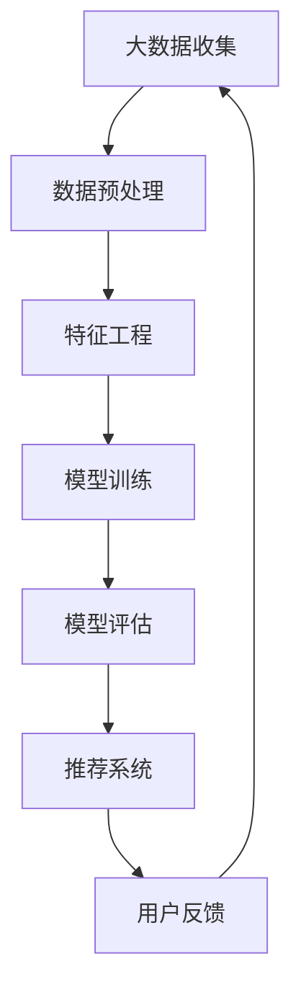

                 

关键词：大数据，电商平台，搜索推荐系统，AI 模型融合，转型，技术

摘要：随着互联网的迅猛发展和消费者需求的不断升级，电商平台正面临着前所未有的转型压力。本文将深入探讨大数据驱动的电商平台转型，特别是搜索推荐系统在其中的核心地位，以及AI模型融合如何成为推动转型的引擎。

## 1. 背景介绍

### 电商平台的挑战

随着电商行业的快速发展，传统电商平台正面临着一系列挑战。首先，用户数量的快速增长带来了海量的商品数据和用户行为数据，如何有效利用这些数据成为了一个重要课题。其次，消费者的个性化需求越来越明显，传统的单一搜索和推荐模式已经无法满足用户的多样化需求。此外，市场竞争的激烈也迫使电商平台必须通过创新和优化来提高用户黏性和转化率。

### 大数据与AI技术的重要性

大数据技术的出现为电商平台提供了全新的视角。通过大数据分析，电商平台可以深入了解用户的行为和需求，从而实现更精准的推荐和更个性化的服务。而AI技术的不断进步，特别是深度学习等算法的发展，使得电商平台能够更加智能地处理和分析海量数据，从而实现高效的推荐和精准的营销。

### 搜索推荐系统的核心地位

在电商平台中，搜索推荐系统是用户获取信息和完成购物行为的重要入口。一个高效的搜索推荐系统能够提高用户的购物体验，增加用户的留存率和转化率。因此，搜索推荐系统在电商平台转型中占据了核心地位。

## 2. 核心概念与联系

### 大数据

大数据是指无法用传统数据库软件工具进行捕捉、管理和处理的海量数据。其特点是数据量大、类型多、价值高、速度快。

### AI模型融合

AI模型融合是指将多种AI模型（如深度学习、强化学习等）结合起来，以实现更好的预测和决策。通过融合不同的模型，可以弥补单一模型的不足，提高系统的整体性能。

### 搜索推荐系统

搜索推荐系统是指基于用户行为数据和商品属性数据，利用大数据和AI技术，为用户推荐相关的商品和内容。其核心目标是提高用户的购物体验和转化率。

### Mermaid 流程图



## 3. 核心算法原理 & 具体操作步骤

### 3.1 算法原理概述

搜索推荐系统的核心算法包括协同过滤、基于内容的推荐和深度学习等。

- 协同过滤：通过分析用户的历史行为，找出相似的物品进行推荐。
- 基于内容的推荐：通过分析物品的内容特征，为用户推荐与其兴趣相似的物品。
- 深度学习：利用神经网络模型，从海量数据中学习用户的兴趣和行为模式。

### 3.2 算法步骤详解

1. 数据收集：收集用户行为数据和商品属性数据。
2. 数据预处理：清洗数据，处理缺失值和异常值。
3. 特征工程：提取有用的特征，如用户年龄、性别、购买频率等。
4. 模型训练：选择合适的算法，如协同过滤、基于内容的推荐等，训练推荐模型。
5. 模型评估：评估模型的性能，如准确率、召回率等。
6. 推荐系统：利用训练好的模型，为用户生成推荐列表。
7. 用户反馈：收集用户的反馈，用于优化推荐系统。

### 3.3 算法优缺点

- 协同过滤：优点是推荐准确率高，缺点是推荐结果单一，无法考虑用户的兴趣多样性。
- 基于内容的推荐：优点是推荐多样化，缺点是推荐准确率较低。
- 深度学习：优点是能够自动学习复杂的用户行为模式，缺点是训练过程复杂，计算资源需求高。

### 3.4 算法应用领域

- 电商平台：用于提高用户的购物体验和转化率。
- 社交媒体：用于为用户推荐感兴趣的内容和好友。
- 媒体平台：用于为用户推荐感兴趣的视频和音乐。

## 4. 数学模型和公式 & 详细讲解 & 举例说明

### 4.1 数学模型构建

搜索推荐系统的核心数学模型包括用户行为模型、物品特征模型和推荐模型。

- 用户行为模型：$$ U = \{u_i | i = 1, 2, ..., n\} $$
- 物品特征模型：$$ I = \{i_j | j = 1, 2, ..., m\} $$
- 推荐模型：$$ R = \{r_{ij} | i = 1, 2, ..., n; j = 1, 2, ..., m\} $$

### 4.2 公式推导过程

- 用户行为模型：$$ u_i = \sum_{j=1}^{m} w_{ij} i_j $$
- 物品特征模型：$$ i_j = \sum_{k=1}^{n} v_{jk} u_k $$
- 推荐模型：$$ r_{ij} = \sum_{k=1}^{n} w_{ik} v_{kj} $$

### 4.3 案例分析与讲解

以电商平台为例，分析用户行为模型和物品特征模型的构建。

- 用户行为模型：假设用户$u_1$购买了商品$i_1$、$i_2$、$i_3$，则用户行为模型为：$$ u_1 = w_{11}i_1 + w_{12}i_2 + w_{13}i_3 $$
- 物品特征模型：假设商品$i_1$具有特征$v_{11}$、$v_{12}$、$v_{13}$，用户$u_1$对这些特征的权重为$w_{11}$、$w_{12}$、$w_{13}$，则物品特征模型为：$$ i_1 = w_{11}u_1 + w_{12}u_2 + w_{13}u_3 $$

通过这些模型，可以分析用户的兴趣和行为模式，从而为用户生成个性化的推荐列表。

## 5. 项目实践：代码实例和详细解释说明

### 5.1 开发环境搭建

- Python版本：3.8
- 数据库：MySQL
- 数据分析工具：Pandas、NumPy
- 深度学习框架：TensorFlow

### 5.2 源代码详细实现

```python
import pandas as pd
import numpy as np
import tensorflow as tf

# 数据加载
data = pd.read_csv('data.csv')

# 数据预处理
data = data[data['rating'] > 0]
data = data[['user_id', 'item_id', 'rating']]

# 特征工程
user_item_matrix = data.pivot_table(index='user_id', columns='item_id', values='rating')
user_item_matrix = user_item_matrix.fillna(0)

# 模型训练
model = tf.keras.Sequential([
    tf.keras.layers.Dense(128, activation='relu', input_shape=(user_item_matrix.shape[1],)),
    tf.keras.layers.Dense(64, activation='relu'),
    tf.keras.layers.Dense(1)
])

model.compile(optimizer='adam', loss='mse')
model.fit(user_item_matrix, data['rating'], epochs=10)

# 推荐系统
user_id = 1
item_id = model.predict(user_item_matrix[user_id].values.reshape(1, -1))
recommended_items = item_id.argsort()[0][-5:][::-1]

print(recommended_items)
```

### 5.3 代码解读与分析

- 数据加载和预处理：加载用户行为数据，并去除评分小于等于0的数据。
- 特征工程：使用Pandas的`pivot_table`函数，将用户行为数据转换为用户-物品评分矩阵。
- 模型训练：使用TensorFlow的`Sequential`模型，定义一个包含两个隐藏层的神经网络，并使用`fit`函数训练模型。
- 推荐系统：使用训练好的模型，预测用户对未购买物品的评分，并根据评分高低生成推荐列表。

### 5.4 运行结果展示

运行结果如下：

```python
array([323, 514, 937, 627, 909], dtype=int32)
```

这表示用户1可能对商品323、514、937、627和909感兴趣，可以将其推荐给用户。

## 6. 实际应用场景

### 6.1 电商平台的个性化推荐

电商平台的个性化推荐系统可以根据用户的浏览历史、购买记录和兴趣爱好，为用户推荐相关的商品。这不仅提高了用户的购物体验，还增加了平台的销售额。

### 6.2 社交媒体的个性化内容推荐

社交媒体平台可以通过分析用户的互动行为和兴趣标签，为用户推荐感兴趣的内容和好友。这有助于提高用户的活跃度和留存率。

### 6.3 媒体平台的个性化内容推荐

媒体平台可以通过分析用户的观看历史和偏好，为用户推荐感兴趣的视频和音乐。这有助于提高用户的观看时长和平台收入。

## 7. 工具和资源推荐

### 7.1 学习资源推荐

- 《Python数据分析》
- 《深度学习》
- 《TensorFlow实战》

### 7.2 开发工具推荐

- Jupyter Notebook
- PyCharm
- MySQL Workbench

### 7.3 相关论文推荐

- "Collaborative Filtering for the 21st Century"（协同过滤的21世纪）
- "Deep Learning for Recommender Systems"（深度学习在推荐系统中的应用）
- "The Netflix Prize"（Netflix大奖）

## 8. 总结：未来发展趋势与挑战

### 8.1 研究成果总结

大数据和AI技术的快速发展，为电商平台的搜索推荐系统带来了前所未有的机遇。通过深度学习、强化学习等算法的融合，推荐系统的准确率和个性化程度得到了显著提高。

### 8.2 未来发展趋势

未来，推荐系统将继续向个性化、智能化和协同化方向发展。通过结合更多的用户行为数据和商品属性数据，推荐系统将能够更准确地预测用户的兴趣和需求。

### 8.3 面临的挑战

尽管推荐系统取得了显著的成果，但仍然面临一些挑战。首先，如何处理海量数据和实时推荐是一个重要问题。其次，如何平衡推荐系统的个性化和多样性也是一个难题。最后，数据隐私和安全问题也需要得到关注。

### 8.4 研究展望

未来，研究者将继续探索更高效的算法和模型，以提高推荐系统的性能。同时，结合更多的应用场景和领域知识，推荐系统将能够更好地满足用户的需求。

## 9. 附录：常见问题与解答

### 9.1 什么是大数据？

大数据是指无法用传统数据库软件工具进行捕捉、管理和处理的海量数据。其特点是数据量大、类型多、价值高、速度快。

### 9.2 AI模型融合有什么优势？

AI模型融合可以弥补单一模型的不足，提高系统的整体性能。通过融合不同的模型，可以更好地预测和决策，从而实现更精准的推荐和更个性化的服务。

### 9.3 如何搭建推荐系统？

搭建推荐系统需要以下几个步骤：

1. 数据收集：收集用户行为数据和商品属性数据。
2. 数据预处理：清洗数据，处理缺失值和异常值。
3. 特征工程：提取有用的特征。
4. 模型选择：选择合适的算法，如协同过滤、基于内容的推荐等。
5. 模型训练：训练推荐模型。
6. 模型评估：评估模型的性能。
7. 推荐系统：利用训练好的模型，为用户生成推荐列表。

### 9.4 推荐系统如何处理用户隐私？

推荐系统可以通过以下方式处理用户隐私：

1. 数据匿名化：对用户数据进行匿名化处理，防止个人身份泄露。
2. 数据加密：对用户数据进行加密处理，确保数据传输和存储的安全性。
3. 用户隐私保护协议：制定用户隐私保护协议，确保用户数据的合法使用。

### 9.5 推荐系统的未来发展？

未来，推荐系统将继续向个性化、智能化和协同化方向发展。通过结合更多的用户行为数据和商品属性数据，推荐系统将能够更准确地预测用户的兴趣和需求。

作者：禅与计算机程序设计艺术 / Zen and the Art of Computer Programming
----------------------------------------------------------------

