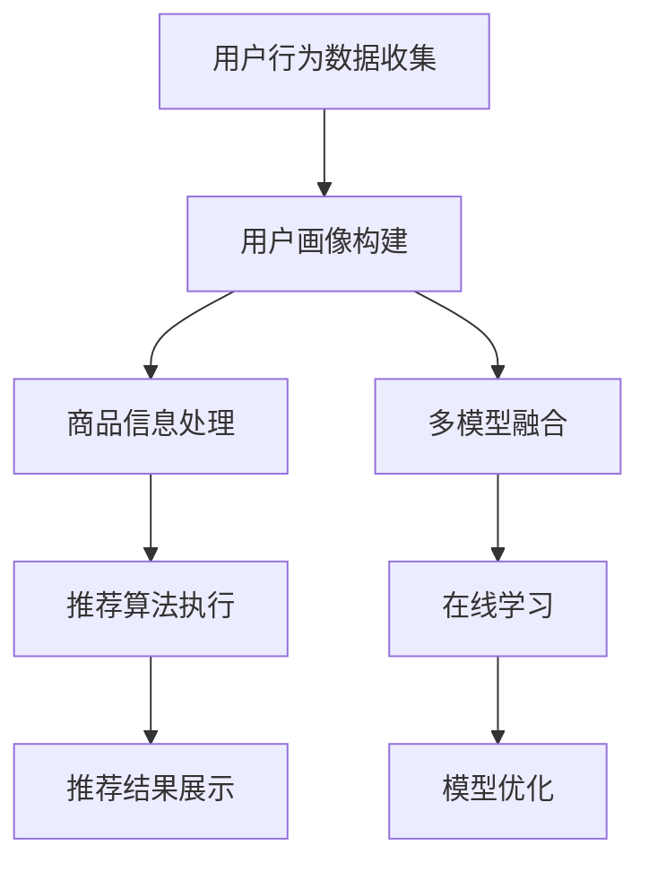

                 

在当今数字经济时代，电商平台正经历着前所未有的变革。大数据、人工智能、云计算等技术的迅猛发展，使得电商平台不仅仅是交易的平台，更成为了用户行为数据、商品信息、供应链管理的数据中心。本文将探讨大数据驱动的电商平台转型，特别是搜索推荐系统在其中的核心作用以及AI模型融合如何成为推动平台发展的强大引擎。

## 1. 背景介绍

电商平台的发展历程可以追溯到20世纪90年代，随着互联网的普及，电子商务逐渐成为商家和消费者连接的重要渠道。早期的电商平台功能较为简单，主要以商品展示和在线交易为主。然而，随着用户需求的不断升级和市场竞争的加剧，现代电商平台需要具备更高的智能化和个性化能力。

### 1.1 大数据对电商平台的影响

大数据技术的出现，为电商平台带来了前所未有的机遇。通过对海量用户行为数据的收集、存储和分析，电商平台可以更好地了解用户需求，实现精准营销和个性化推荐。例如，用户浏览记录、购物车数据、购买历史等都可以成为商家优化商品推荐和库存管理的依据。

### 1.2 人工智能在电商平台的应用

人工智能技术的融入，使得电商平台能够提供更加智能的服务。自然语言处理、机器学习、深度学习等技术，可以帮助电商平台实现智能客服、智能推荐、智能定价等功能。这些技术的应用，不仅提升了用户体验，还极大地提高了平台的运营效率和竞争力。

## 2. 核心概念与联系

在探讨大数据驱动的电商平台转型过程中，我们需要明确几个核心概念：

### 2.1 搜索推荐系统

搜索推荐系统是电商平台的核心功能之一。通过分析用户行为数据，搜索推荐系统能够为用户提供个性化的商品推荐，提高用户购买转化率。其核心包括：

- **用户行为分析**：通过收集用户的浏览、搜索、购买等行为，构建用户画像。
- **商品信息处理**：对商品的各种属性进行数据化处理，形成商品特征库。
- **推荐算法**：利用机器学习算法，从用户画像和商品特征库中提取关联性，生成推荐结果。

### 2.2 AI模型融合

AI模型融合是提升搜索推荐系统性能的关键。通过整合多种AI模型，如协同过滤、内容推荐、深度学习等，可以更准确地捕捉用户需求，提高推荐效果。具体而言，AI模型融合包括以下方面：

- **多模型集成**：将多种算法模型的结果进行综合，提高推荐准确性。
- **在线学习**：实时更新用户行为数据，动态调整推荐策略。
- **模型优化**：通过交叉验证、A/B测试等方法，不断优化模型性能。

### 2.3 Mermaid 流程图

以下是一个简化的Mermaid流程图，展示了搜索推荐系统的基本架构：



## 3. 核心算法原理 & 具体操作步骤

### 3.1 算法原理概述

搜索推荐系统的核心在于算法原理。常见的推荐算法包括基于内容的推荐、协同过滤推荐和基于模型的推荐等。每种算法都有其独特的原理和适用场景。

- **基于内容的推荐**：通过分析用户的历史行为和商品的内容特征，推荐与用户兴趣相似的商品。
- **协同过滤推荐**：通过分析用户之间的相似性，推荐其他相似用户喜欢的商品。
- **基于模型的推荐**：利用机器学习模型，从用户行为数据中挖掘潜在关联性，生成推荐结果。

### 3.2 算法步骤详解

以下是一个基于协同过滤的推荐算法的基本步骤：

1. **用户行为数据收集**：收集用户的浏览、搜索、购买等行为数据。
2. **用户画像构建**：根据用户行为数据，构建用户画像。
3. **商品信息处理**：对商品的各种属性进行数据化处理，形成商品特征库。
4. **用户相似度计算**：计算用户之间的相似度，可以使用余弦相似度、皮尔逊相关系数等方法。
5. **商品推荐**：根据用户相似度，为每个用户推荐与其相似用户喜欢的商品。
6. **推荐结果展示**：将推荐结果展示给用户。

### 3.3 算法优缺点

- **基于内容的推荐**：优点是推荐准确度高，但需要依赖商品内容特征，适用场景有限。
- **协同过滤推荐**：优点是能够处理大量数据，但可能会出现“冷启动”问题，即新用户或新商品的推荐效果较差。
- **基于模型的推荐**：优点是能够处理复杂的用户行为数据，但需要大量的计算资源和模型调优。

### 3.4 算法应用领域

搜索推荐系统在电商平台、社交媒体、在线视频平台等领域都有广泛的应用。例如，电商平台可以通过搜索推荐系统提高用户购买转化率，社交媒体可以通过推荐系统提高用户活跃度，在线视频平台可以通过推荐系统提高用户观看时长。

## 4. 数学模型和公式 & 详细讲解 & 举例说明

### 4.1 数学模型构建

在搜索推荐系统中，常用的数学模型包括用户相似度计算和推荐结果生成模型。

- **用户相似度计算**：设用户集合为U，用户i和用户j之间的相似度可以用余弦相似度表示：

  $$ \text{similarity}(i, j) = \frac{\text{dot}(u_i, u_j)}{\|\text{u_i}\| \|\text{u_j}\|} $$

  其中，$u_i$和$u_j$分别为用户i和用户j的向量表示。

- **推荐结果生成模型**：设用户i对商品集合C中的每个商品c的评分向量表示为$r_i(c)$，可以使用基于模型的推荐算法，如矩阵分解（Matrix Factorization），来生成推荐结果：

  $$ r_i(c) = \text{predict}(u_i, c) = \text{PUF}(u_i, c) $$

  其中，$PUF$为矩阵分解模型。

### 4.2 公式推导过程

以矩阵分解为例，假设用户行为矩阵$R \in \mathbb{R}^{m \times n}$，其中$m$为用户数量，$n$为商品数量。通过矩阵分解，可以将用户行为矩阵分解为用户特征矩阵$U \in \mathbb{R}^{m \times k}$和商品特征矩阵$V \in \mathbb{R}^{n \times k}$的乘积：

$$ R = UV^T $$

其中$k$为特征维度。

通过最小化损失函数，如均方误差（MSE），可以得到用户特征矩阵和商品特征矩阵：

$$ \min_{U, V} \sum_{i=1}^{m} \sum_{j=1}^{n} (r_{ij} - u_i^T v_j)^2 $$

### 4.3 案例分析与讲解

假设有一个电商平台，用户数量为1000，商品数量为500。我们可以通过矩阵分解模型来构建搜索推荐系统。

1. **数据预处理**：首先，对用户行为数据进行预处理，如用户行为序列的编码、缺失值的填补等。
2. **矩阵分解**：使用矩阵分解算法（如ALS算法），将用户行为矩阵分解为用户特征矩阵和商品特征矩阵。
3. **推荐计算**：根据用户特征矩阵和商品特征矩阵，计算用户对未购买商品的预测评分。
4. **推荐结果生成**：将预测评分排序，生成推荐列表。

通过实际运行，我们可以观察到推荐系统的性能。例如，平均准确率、召回率、覆盖率等指标。

## 5. 项目实践：代码实例和详细解释说明

### 5.1 开发环境搭建

1. **硬件环境**：配备足够计算能力的服务器或云计算资源。
2. **软件环境**：安装Python、TensorFlow或PyTorch等深度学习框架。

### 5.2 源代码详细实现

以下是一个简单的基于矩阵分解的搜索推荐系统实现示例：

```python
import numpy as np
from sklearn.metrics.pairwise import cosine_similarity

def matrix_factorization(R, rank, iters=5, alpha=0.01, beta=0.01):
    # 初始化用户和商品特征矩阵
    U = np.random.rand(R.shape[0], rank)
    V = np.random.rand(R.shape[1], rank)
    prev_U = prev_V = None
    
    for i in range(iters):
        # 更新用户特征矩阵
        U = U - alpha * (U * V.T * V - R)
        # 更新商品特征矩阵
        V = V - alpha * (U.T * U * V - R.T)
        
        # 正则化
        U = U / (np.linalg.norm(U, axis=1)[:, np.newaxis] + beta)
        V = V / (np.linalg.norm(V, axis=1)[:, np.newaxis] + beta)
        
        # 检查收敛性
        if np.linalg.norm(U - prev_U) < 1e-6 and np.linalg.norm(V - prev_V) < 1e-6:
            break
            
        prev_U, prev_V = U, V
    
    return U, V

# 用户行为矩阵
R = np.array([[1, 1, 0, 0, 1],
              [0, 1, 0, 1, 0],
              [1, 0, 1, 0, 0],
              [0, 1, 1, 1, 1]])

# 矩阵分解
U, V = matrix_factorization(R, rank=2)

# 计算预测评分
predictions = U @ V.T

# 显示预测评分
print(predictions)

# 显示推荐结果
print(np.argsort(predictions[:, -1])[-5:])
```

### 5.3 代码解读与分析

上述代码实现了一个基于矩阵分解的搜索推荐系统。主要步骤包括：

1. **初始化用户和商品特征矩阵**：使用随机数初始化用户和商品特征矩阵。
2. **矩阵分解**：通过梯度下降法迭代更新用户和商品特征矩阵，最小化损失函数。
3. **预测评分计算**：计算用户对未购买商品的预测评分。
4. **推荐结果生成**：根据预测评分，生成推荐结果。

通过代码实践，我们可以更好地理解矩阵分解算法在搜索推荐系统中的应用。

### 5.4 运行结果展示

运行上述代码，我们可以得到用户行为矩阵的预测评分和推荐结果。例如，对于最后一个用户，系统推荐了评分最高的五个商品。这表明矩阵分解算法能够生成有效的推荐结果。

## 6. 实际应用场景

搜索推荐系统在电商平台的应用场景非常广泛，以下是一些典型的实际应用场景：

### 6.1 商品推荐

电商平台可以通过搜索推荐系统，为用户推荐与其兴趣相关的商品。例如，用户在浏览某一类商品时，系统可以推荐该类商品中用户可能感兴趣的其他商品。

### 6.2 店铺推荐

除了商品推荐，搜索推荐系统还可以用于店铺推荐。用户浏览或购买某一店铺的商品后，系统可以推荐其他相似店铺，提高用户对店铺的忠诚度。

### 6.3 个性化营销

通过分析用户行为数据，搜索推荐系统可以为用户提供个性化的营销活动。例如，根据用户的购物习惯和偏好，系统可以推荐特定的优惠券或促销活动。

### 6.4 智能客服

搜索推荐系统还可以应用于智能客服领域。通过分析用户提问和行为数据，系统可以自动生成回答或建议，提高客服效率。

## 7. 未来应用展望

随着技术的不断发展，搜索推荐系统在电商平台的应用前景将更加广阔。以下是一些未来应用的展望：

### 7.1 深度学习模型的应用

深度学习模型的引入，将进一步提升搜索推荐系统的性能。例如，通过卷积神经网络（CNN）和循环神经网络（RNN）等技术，可以更好地捕捉用户行为和商品特征的复杂关联。

### 7.2 多模态数据融合

随着物联网和传感器技术的发展，电商平台将拥有更多的多模态数据，如文本、图像、音频等。通过多模态数据融合，可以更全面地理解用户需求，生成更精准的推荐结果。

### 7.3 社交网络的影响

社交网络在用户行为数据中扮演着重要角色。通过分析用户社交关系和社交行为，可以挖掘出更多的用户兴趣和偏好，提升推荐效果。

## 8. 工具和资源推荐

### 8.1 学习资源推荐

- **书籍**：《推荐系统实践》、《机器学习》、《深度学习》
- **在线课程**：Coursera、edX、Udacity等平台上的机器学习、深度学习课程
- **论文**：Google Scholar、ACM Digital Library等学术数据库

### 8.2 开发工具推荐

- **编程语言**：Python、R
- **框架**：TensorFlow、PyTorch、scikit-learn
- **数据集**：MovieLens、Netflix Prize等公开数据集

### 8.3 相关论文推荐

- **论文1**："[Recommender Systems Overview](https://pdfs.semanticscholar.org/7c4e/8d1e9f8c2c2e7711a46b9e3e9c0b72923d28.pdf)"
- **论文2**："[Matrix Factorization Techniques for Recommender Systems](https://www.kdnuggets.org/wp-content/uploads/2016/10/RecommenderSystems-01.pdf)"
- **论文3**："[Deep Learning for Recommender Systems](https://arxiv.org/pdf/1706.07987.pdf)"

## 9. 总结：未来发展趋势与挑战

### 9.1 研究成果总结

近年来，搜索推荐系统在电商平台的应用取得了显著成果。通过大数据和人工智能技术的结合，推荐系统性能得到了大幅提升，用户体验得到了极大改善。

### 9.2 未来发展趋势

未来，搜索推荐系统将继续向深度学习、多模态数据融合、社交网络影响等方向发展。技术的不断进步将推动推荐系统在更广泛的场景中发挥重要作用。

### 9.3 面临的挑战

尽管取得了显著成果，搜索推荐系统仍然面临一些挑战。例如，如何处理冷启动问题、如何保证推荐结果的公平性、如何保护用户隐私等。这些问题需要进一步研究和解决。

### 9.4 研究展望

随着技术的不断发展，搜索推荐系统将在未来发挥更加重要的作用。研究者将继续探索更高效、更准确的推荐算法，为电商平台的发展提供强大的技术支持。

## 附录：常见问题与解答

### 1. 什么是推荐系统？

推荐系统是一种基于用户行为数据和商品信息，为用户提供个性化推荐的技术。其目的是提高用户满意度、提高平台运营效率。

### 2. 推荐系统有哪些类型？

常见的推荐系统类型包括基于内容的推荐、协同过滤推荐、基于模型的推荐等。

### 3. 矩阵分解在推荐系统中的应用是什么？

矩阵分解是一种用于推荐系统的常见技术，通过将用户行为矩阵分解为用户特征矩阵和商品特征矩阵，可以生成推荐结果。

### 4. 如何处理推荐系统的冷启动问题？

处理推荐系统的冷启动问题可以通过多种方法，如基于内容的推荐、用户相似度计算、利用社交网络数据等。

### 5. 推荐系统的公平性如何保障？

保障推荐系统的公平性可以通过多种方法，如随机化推荐、限制推荐多样性、公平性评估等。

**作者：禅与计算机程序设计艺术 / Zen and the Art of Computer Programming**[markdown结束标记]

