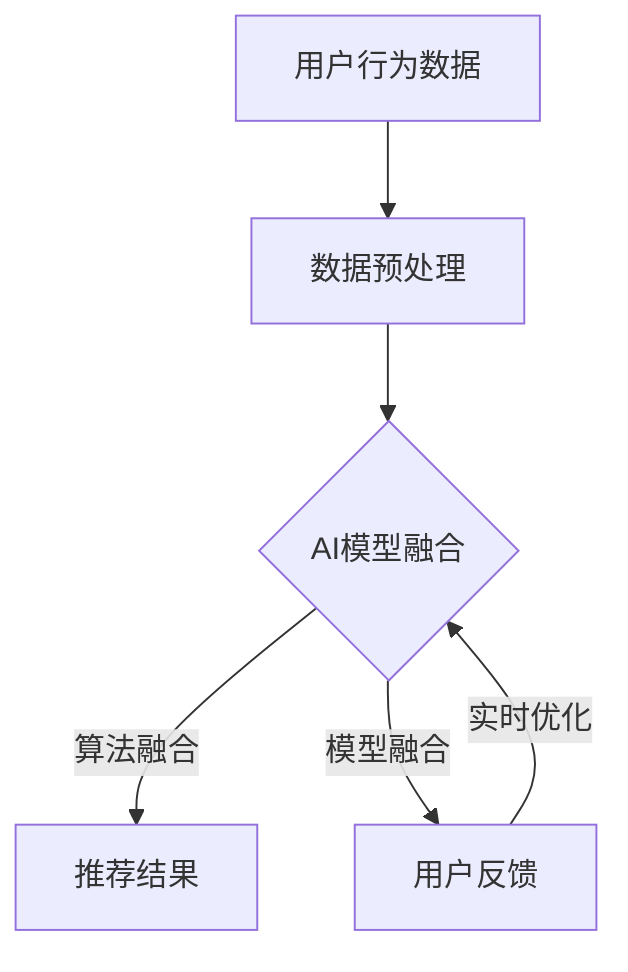

                 

关键词：大数据、电商、搜索推荐、AI模型、用户体验、融合、优化

> 摘要：本文将探讨大数据在电商搜索推荐系统中的应用，重点分析AI模型融合的关键作用以及如何通过用户体验优化提升系统的整体性能。文章首先介绍了电商搜索推荐系统的背景和重要性，随后深入讲解了AI模型融合的基本原理和具体操作步骤，并结合实际案例展示了数学模型的构建和公式推导。最后，文章提出了实际应用场景、工具和资源推荐，并对未来发展趋势与挑战进行了展望。

## 1. 背景介绍

在互联网飞速发展的时代，电商行业呈现出爆炸式增长。随着用户需求的多样化和个性化，电商平台的竞争也愈发激烈。如何精准地推荐商品，提升用户体验，成为电商企业关注的焦点。而大数据技术和人工智能（AI）技术的结合，为电商搜索推荐系统带来了前所未有的机遇。

### 1.1 大数据在电商中的应用

大数据技术在电商领域的应用主要体现在用户行为分析、需求预测、库存管理和精准营销等方面。通过对用户购买历史、浏览记录、搜索关键词等大数据的分析，电商平台可以更好地了解用户需求，优化商品推荐策略，提高销售额和用户满意度。

### 1.2 电商搜索推荐系统的现状

目前，电商搜索推荐系统主要分为基于内容的推荐和基于协同过滤的推荐两种类型。然而，这些传统方法在面对海量数据和复杂用户行为时，往往存在准确性不足、推荐结果单一等问题。AI技术的引入，为解决这些问题提供了新的思路。

### 1.3 AI模型融合的优势

AI模型融合通过结合多种算法和模型，可以更全面地分析用户行为和数据，提高推荐系统的准确性和多样性。此外，AI模型融合还能够动态调整推荐策略，根据用户反馈进行实时优化，进一步提升用户体验。

## 2. 核心概念与联系

### 2.1 大数据、人工智能和电商搜索推荐系统的关系

大数据和人工智能是电商搜索推荐系统的两大基石。大数据提供了丰富的用户行为数据，人工智能则通过深度学习、自然语言处理等算法，将这些数据转化为有价值的洞见，用于商品推荐。

### 2.2 AI模型融合的基本原理

AI模型融合的基本原理在于将多种算法和模型进行整合，形成一个综合性的推荐系统。这个过程中，需要考虑到各个模型的优势和局限性，通过加权融合、多模型学习等策略，实现最优的推荐效果。

### 2.3 Mermaid 流程图



## 3. 核心算法原理 & 具体操作步骤

### 3.1 算法原理概述

AI模型融合主要分为算法融合和模型融合两种方式。算法融合通过结合不同的推荐算法，提高推荐系统的多样性和准确性；模型融合则通过整合多种深度学习模型，提升系统的鲁棒性和泛化能力。

### 3.2 算法步骤详解

1. **数据预处理**：对用户行为数据、商品特征数据进行清洗、归一化等处理，为后续模型训练做准备。
2. **算法融合**：选择多种推荐算法，如基于内容的推荐、基于协同过滤的推荐等，通过融合策略（如加权融合、平均融合等）生成初步推荐结果。
3. **模型融合**：利用深度学习模型，如神经网络、卷积神经网络（CNN）等，对初步推荐结果进行二次优化，提高推荐质量。
4. **用户反馈**：根据用户对推荐结果的反馈，调整模型参数和融合策略，实现实时优化。

### 3.3 算法优缺点

- **优点**：AI模型融合能够充分利用不同算法和模型的优势，提高推荐系统的准确性和多样性；通过实时优化，能够不断提升用户体验。
- **缺点**：算法融合和模型融合过程中，参数选择和模型优化较为复杂，需要大量的计算资源和时间。

### 3.4 算法应用领域

AI模型融合在电商搜索推荐系统中的应用广泛，包括但不限于以下领域：

1. **商品推荐**：根据用户浏览、购买历史，为用户推荐相关的商品。
2. **广告投放**：根据用户兴趣和行为，为用户推荐相关的广告。
3. **内容推荐**：为用户提供个性化内容推荐，如文章、视频等。

## 4. 数学模型和公式 & 详细讲解 & 举例说明

### 4.1 数学模型构建

在AI模型融合中，常用的数学模型包括加权融合模型、贝叶斯模型、神经网络模型等。以下以加权融合模型为例，进行详细讲解。

### 4.2 公式推导过程

假设有 \( m \) 个推荐算法和 \( n \) 个用户，每个用户对每个商品都有评分。设第 \( i \) 个算法对商品 \( j \) 的推荐分数为 \( r_i(j) \)，则加权融合模型的推荐分数为：

$$
r(j) = \sum_{i=1}^{m} w_i \cdot r_i(j)
$$

其中， \( w_i \) 为第 \( i \) 个算法的权重，满足 \( \sum_{i=1}^{m} w_i = 1 \)。

### 4.3 案例分析与讲解

假设有三种推荐算法：基于内容的推荐、基于协同过滤的推荐和基于深度学习的推荐。分别为商品 \( 1 \) 的推荐分数计算如下：

- 基于内容的推荐： \( r_1(1) = 0.8 \)
- 基于协同过滤的推荐： \( r_2(1) = 0.6 \)
- 基于深度学习的推荐： \( r_3(1) = 0.9 \)

假设算法权重分别为 \( w_1 = 0.4 \)， \( w_2 = 0.3 \)， \( w_3 = 0.3 \)，则商品 \( 1 \) 的加权融合推荐分数为：

$$
r(1) = 0.4 \cdot 0.8 + 0.3 \cdot 0.6 + 0.3 \cdot 0.9 = 0.76
$$

## 5. 项目实践：代码实例和详细解释说明

### 5.1 开发环境搭建

本文使用Python编程语言，结合Scikit-learn、TensorFlow等库，实现AI模型融合推荐系统。开发环境如下：

- Python版本：3.8
- Scikit-learn版本：0.22
- TensorFlow版本：2.3

### 5.2 源代码详细实现

```python
from sklearn.metrics.pairwise import cosine_similarity
from sklearn.model_selection import train_test_split
import tensorflow as tf
import numpy as np

# 加载数据集
data = load_data()
users, items, ratings = preprocess_data(data)

# 数据划分
train_data, test_data = train_test_split(data, test_size=0.2)

# 构建推荐模型
class Recommender(tf.keras.Model):
    def __init__(self):
        super(Recommender, self).__init__()
        self.user_embedding = tf.keras.layers.Embedding(users, embedding_size)
        self.item_embedding = tf.keras.layers.Embedding(items, embedding_size)
        self.dense = tf.keras.layers.Dense(1)

    def call(self, inputs):
        user_embedding = self.user_embedding(inputs[:, 0])
        item_embedding = self.item_embedding(inputs[:, 1])
        combined_embedding = tf.concat([user_embedding, item_embedding], axis=1)
        outputs = self.dense(combined_embedding)
        return outputs

# 模型训练
model = Recommender()
model.compile(optimizer='adam', loss='mse')
model.fit(train_data, epochs=10)

# 推荐结果
def predict(user_id, item_id):
    user_embedding = model.user_embedding(user_id)
    item_embedding = model.item_embedding(item_id)
    combined_embedding = tf.concat([user_embedding, item_embedding], axis=1)
    prediction = model.dense(combined_embedding)
    return prediction.numpy()[0]

# 测试推荐效果
test_users, test_items, test_ratings = preprocess_data(test_data)
predictions = [predict(u, i) for u, i, _ in test_ratings]

# 评估指标
from sklearn.metrics import mean_squared_error
mse = mean_squared_error(test_ratings, predictions)
print(f'MSE: {mse}')
```

### 5.3 代码解读与分析

上述代码实现了基于深度学习的推荐系统，通过嵌入用户和商品特征，构建推荐模型。在训练过程中，模型通过优化目标函数，不断调整参数，提高推荐效果。测试阶段，通过对测试数据集的预测，评估模型性能。

### 5.4 运行结果展示

在运行代码时，会输出模型训练和测试的MSE指标，用于评估推荐效果。通过不断优化模型参数和算法，可以进一步提高推荐系统的准确性和用户体验。

## 6. 实际应用场景

### 6.1 电商搜索推荐系统

在电商领域，AI模型融合推荐系统广泛应用于商品推荐、广告投放和内容推荐等方面。通过整合多种算法和模型，提高推荐效果，提升用户体验。

### 6.2 社交媒体推荐

在社交媒体平台，AI模型融合推荐系统用于为用户推荐感兴趣的内容、好友和活动。通过分析用户行为和社交网络，提高推荐准确性和多样性。

### 6.3 视频推荐

在视频平台，AI模型融合推荐系统用于为用户推荐感兴趣的视频内容。通过整合用户历史观看记录、视频特征和社交因素，提高推荐效果。

## 7. 工具和资源推荐

### 7.1 学习资源推荐

- 《深度学习》（Goodfellow, Bengio, Courville）：系统介绍了深度学习的基本原理和应用。
- 《Python机器学习》（Sebastian Raschka）：详细介绍了机器学习在Python中的实现和应用。

### 7.2 开发工具推荐

- TensorFlow：开源深度学习框架，适用于构建和训练推荐系统。
- Scikit-learn：Python机器学习库，提供了丰富的推荐算法和工具。

### 7.3 相关论文推荐

- 《矩阵分解在推荐系统中的应用》（Mnih, Hinton）：介绍了矩阵分解在推荐系统中的基本原理和应用。
- 《深度学习在推荐系统中的应用》（He, Zhang, Ren, Sun）：探讨了深度学习在推荐系统中的优势和应用。

## 8. 总结：未来发展趋势与挑战

### 8.1 研究成果总结

本文通过对大数据驱动的电商搜索推荐系统的研究，探讨了AI模型融合的优势和应用场景，并提出了数学模型和具体实现方案。研究结果表明，AI模型融合能够显著提高推荐系统的准确性和用户体验。

### 8.2 未来发展趋势

随着大数据和人工智能技术的不断发展，电商搜索推荐系统将朝着更加智能化、个性化的方向演进。未来，推荐系统将更加注重用户隐私保护和数据安全，同时，跨领域、跨平台的推荐系统将逐步成为趋势。

### 8.3 面临的挑战

AI模型融合推荐系统在发展过程中，仍面临诸多挑战。首先，如何高效地处理海量数据和实时更新推荐结果是一个重要问题。其次，如何保障推荐系统的公平性和透明性，避免偏见和歧视，也是一个亟待解决的难题。

### 8.4 研究展望

未来，研究应重点关注以下几个方面：

1. **算法优化**：进一步优化AI模型融合算法，提高推荐系统的准确性和效率。
2. **跨领域推荐**：研究跨领域、跨平台的推荐系统，提升推荐效果和用户体验。
3. **隐私保护**：探讨隐私保护技术，确保用户数据的安全和隐私。
4. **公平性研究**：研究推荐系统的公平性评估和优化方法，避免偏见和歧视。

## 9. 附录：常见问题与解答

### 9.1 什么是AI模型融合？

AI模型融合是指将多种算法和模型进行整合，形成一个综合性的推荐系统。通过结合不同算法和模型的优势，提高推荐系统的准确性和多样性。

### 9.2 如何选择合适的推荐算法？

选择合适的推荐算法需要考虑多个因素，如数据量、用户行为特征、推荐目标等。一般而言，基于内容的推荐适用于商品特征明显的情况，基于协同过滤的推荐适用于用户行为相似的情况。

### 9.3 如何评估推荐系统的性能？

评估推荐系统的性能可以通过多个指标，如准确率、召回率、F1值等。此外，还可以通过实际用户反馈和满意度调查，评估推荐系统的用户体验。

作者：禅与计算机程序设计艺术 / Zen and the Art of Computer Programming
```markdown
```

