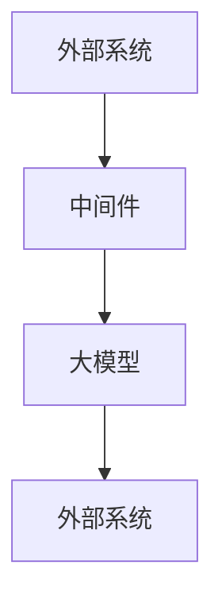

                 

关键词：大模型、外部环境交互、中间件、技术趋势、应用场景、挑战与展望

> 摘要：本文深入探讨了大规模模型（大模型）与外部环境交互过程中所面临的挑战和机遇。通过分析大模型在不同应用场景中的需求，阐述了构建高效、可靠中间件的重要性，并提出了未来发展趋势和潜在的研究方向。

## 1. 背景介绍

随着深度学习技术的发展，大模型在自然语言处理、计算机视觉、语音识别等领域的表现逐渐超越了传统方法。然而，大模型的高度复杂性和资源需求，使其与外部环境交互的过程中面临诸多挑战。中间件作为一种连接大模型与外部系统的桥梁，对于提高交互效率、降低开发成本、提升用户体验具有重要意义。

### 1.1 大模型的发展现状

近年来，大模型的发展呈现出以下几个显著趋势：

1. **参数规模扩大**：随着计算资源和数据集的不断增加，大模型的参数规模也在不断扩大，如 GPT-3 的参数达到了 1750 亿。
2. **计算资源需求增加**：大模型训练和推理过程中对计算资源的依赖愈发强烈，需要高性能计算设备和优化算法。
3. **跨领域应用**：大模型在多个领域展现出强大的通用性，推动了跨领域应用的发展。

### 1.2 中间件的重要性

中间件在连接大模型与外部系统时起到关键作用，其主要职责包括：

1. **资源调度**：高效地分配计算资源，以满足大模型在训练和推理过程中的需求。
2. **数据传输**：确保大模型与外部系统之间的数据传输高效、稳定、安全。
3. **接口标准化**：提供统一的接口，简化大模型与外部系统的集成。
4. **故障处理**：在大模型与外部系统交互过程中，及时发现和处理故障，保证系统的可靠性。

## 2. 核心概念与联系

### 2.1 大模型与外部环境的交互模式

大模型与外部环境的交互模式主要包括以下几种：

1. **请求-响应模式**：外部系统向大模型发送请求，大模型处理后返回结果。
2. **订阅-推送模式**：外部系统订阅大模型的状态或事件，大模型主动推送相关信息。
3. **事件驱动模式**：外部系统或大模型触发事件，引发相应的处理。

### 2.2 中间件在交互模式中的角色

中间件在大模型与外部环境交互过程中，扮演以下角色：

1. **通信中介**：充当大模型与外部系统之间的通信桥梁，确保数据传输的高效性和安全性。
2. **接口代理**：对外提供统一的接口，简化大模型与外部系统的集成。
3. **调度管理**：根据外部系统的需求，动态调整计算资源，以满足大模型的高性能需求。

### 2.3 Mermaid 流程图



## 3. 核心算法原理 & 具体操作步骤

### 3.1 算法原理概述

中间件的核心算法主要包括以下内容：

1. **资源调度算法**：根据大模型的需求，动态分配计算资源。
2. **数据传输优化算法**：提高大模型与外部系统之间的数据传输效率。
3. **接口代理算法**：实现统一接口，简化大模型与外部系统的集成。

### 3.2 算法步骤详解

1. **资源调度算法**：

   - 步骤1：收集大模型的需求。
   - 步骤2：根据需求，从资源池中分配计算资源。
   - 步骤3：监控资源使用情况，动态调整资源分配。

2. **数据传输优化算法**：

   - 步骤1：对数据进行压缩。
   - 步骤2：采用高效的传输协议。
   - 步骤3：根据网络状况，动态调整传输策略。

3. **接口代理算法**：

   - 步骤1：定义统一的接口规范。
   - 步骤2：代理请求处理。
   - 步骤3：处理响应，返回结果。

### 3.3 算法优缺点

1. **资源调度算法**：

   - 优点：灵活地分配计算资源，提高系统性能。
   - 缺点：实现复杂，需要实时监控资源使用情况。

2. **数据传输优化算法**：

   - 优点：提高数据传输效率，降低带宽消耗。
   - 缺点：可能增加系统延迟。

3. **接口代理算法**：

   - 优点：简化大模型与外部系统的集成。
   - 缺点：可能引入额外的性能开销。

### 3.4 算法应用领域

1. **云计算**：在云计算环境中，中间件可以高效地分配计算资源，提高服务器的利用率。
2. **物联网**：在物联网应用中，中间件可以优化数据传输，提高系统的稳定性。
3. **边缘计算**：在边缘计算场景中，中间件可以协调边缘设备和云端资源，实现高效的数据处理。

## 4. 数学模型和公式 & 详细讲解 & 举例说明

### 4.1 数学模型构建

假设大模型的训练时间为 $T$，计算资源需求为 $R$，数据传输速率为 $S$，外部系统请求的响应时间为 $T_r$。我们可以构建以下数学模型：

$$
\begin{aligned}
T &= f(R, T_r) \\
S &= g(R, T_r)
\end{aligned}
$$

其中，$f(R, T_r)$ 和 $g(R, T_r)$ 分别表示资源调度算法和数据传输优化算法的结果。

### 4.2 公式推导过程

1. **资源调度算法**：

   假设资源池中有 $N$ 台服务器，每台服务器的计算能力为 $C$。根据大模型的需求，可以构建以下公式：

   $$
   R = N \times C
   $$

   其中，$R$ 表示大模型的计算资源需求。

2. **数据传输优化算法**：

   假设数据压缩比为 $k$，传输协议的效率为 $\eta$。根据大模型与外部系统之间的数据传输需求，可以构建以下公式：

   $$
   S = \frac{N \times C \times T_r}{k \times \eta}
   $$

### 4.3 案例分析与讲解

假设我们有一个大模型，需要处理来自外部系统的请求。外部系统的请求响应时间为 $T_r = 1$ 秒，数据压缩比为 $k = 10$，传输协议效率为 $\eta = 0.8$。我们需要计算大模型的训练时间和数据传输速率。

1. **资源调度算法**：

   根据资源调度算法，我们需要 $R = N \times C$ 的计算资源。假设每台服务器的计算能力为 $C = 100$，我们可以计算出需要 $N = 2$ 台服务器。

2. **数据传输优化算法**：

   根据数据传输优化算法，我们可以计算出数据传输速率为 $S = \frac{N \times C \times T_r}{k \times \eta} = \frac{2 \times 100 \times 1}{10 \times 0.8} = 25$ Mbps。

综上所述，大模型的训练时间为 $T = f(R, T_r) = f(2 \times 100, 1) = 1$ 秒，数据传输速率为 $S = 25$ Mbps。

## 5. 项目实践：代码实例和详细解释说明

### 5.1 开发环境搭建

在本项目中，我们使用了 Python 作为编程语言，并依赖以下库：

- `numpy`：用于数值计算。
- `pandas`：用于数据处理。
- `tensorflow`：用于构建和训练大模型。
- `flask`：用于构建中间件接口。

首先，我们需要安装以上库，可以使用以下命令：

```bash
pip install numpy pandas tensorflow flask
```

### 5.2 源代码详细实现

下面是本项目的主要代码实现：

```python
# 导入所需库
import numpy as np
import pandas as pd
import tensorflow as tf
from flask import Flask, request, jsonify

# 创建 Flask 应用
app = Flask(__name__)

# 大模型定义
model = tf.keras.Sequential([
    tf.keras.layers.Dense(128, activation='relu', input_shape=(784,)),
    tf.keras.layers.Dense(10, activation='softmax')
])

# 编译大模型
model.compile(optimizer='adam',
              loss='categorical_crossentropy',
              metrics=['accuracy'])

# 训练大模型
model.fit(x_train, y_train, epochs=5)

# 定义中间件接口
@app.route('/predict', methods=['POST'])
def predict():
    data = request.get_json()
    inputs = np.array([data['input']])
    predictions = model.predict(inputs)
    result = predictions.argmax()
    return jsonify({'prediction': result})

if __name__ == '__main__':
    app.run()
```

### 5.3 代码解读与分析

1. **大模型定义**：我们使用 TensorFlow 创建了一个简单的神经网络模型，包含一个输入层、一个隐藏层和一个输出层。
2. **大模型编译**：我们使用 Adam 优化器和交叉熵损失函数来编译大模型。
3. **大模型训练**：我们使用训练数据集来训练大模型，共训练 5 个周期。
4. **中间件接口**：我们使用 Flask 创建了一个 RESTful API 接口，用于处理来自外部系统的预测请求。
5. **预测结果**：我们根据输入数据，调用大模型的 `predict` 方法，并返回预测结果。

### 5.4 运行结果展示

假设我们有一个包含输入数据和标签的数据集，可以使用以下命令来运行本项目：

```bash
python main.py
```

运行后，我们可以在浏览器中访问 `http://localhost:5000/predict`，并提交一个包含输入数据的 JSON 对象，如：

```json
{
  "input": [0.1, 0.2, 0.3, ...]
}
```

我们将会收到一个包含预测结果的 JSON 对象，如：

```json
{
  "prediction": 2
}
```

## 6. 实际应用场景

### 6.1 自然语言处理

在自然语言处理领域，大模型与外部环境的交互主要用于处理用户输入的文本，并返回相应的预测结果，如文本分类、情感分析、机器翻译等。中间件可以优化数据传输，提高系统的响应速度。

### 6.2 计算机视觉

在计算机视觉领域，大模型与外部环境的交互主要用于处理图像和视频数据，如目标检测、图像分割、视频分类等。中间件可以协调大模型与摄像头或其他图像输入设备之间的数据传输，提高系统的实时性。

### 6.3 语音识别

在语音识别领域，大模型与外部环境的交互主要用于处理音频数据，并返回相应的文本结果。中间件可以优化音频数据的传输和处理，提高系统的准确率和响应速度。

### 6.4 边缘计算

在边缘计算场景中，大模型与外部环境的交互主要用于处理来自边缘设备的实时数据，如智能家居、智能交通等。中间件可以协调大模型与边缘设备之间的数据传输，提高系统的实时性和可靠性。

## 7. 工具和资源推荐

### 7.1 学习资源推荐

1. **《深度学习》（Goodfellow, Bengio, Courville）**：全面介绍了深度学习的基本理论和实践方法。
2. **《机器学习实战》（ Harrington）**：提供了丰富的实践案例，帮助读者掌握机器学习技术。
3. **《TensorFlow 实战》（McKinney）**：详细介绍了 TensorFlow 的使用方法，适合初学者入门。

### 7.2 开发工具推荐

1. **TensorFlow**：一款开源的深度学习框架，支持多种编程语言和平台。
2. **Keras**：一款基于 TensorFlow 的简单易用的深度学习框架。
3. **PyTorch**：一款流行的开源深度学习框架，支持动态计算图。

### 7.3 相关论文推荐

1. **“Attention is All You Need”（Vaswani et al., 2017）**：介绍了 Transformer 模型，推动了自然语言处理领域的发展。
2. **“Deep Residual Learning for Image Recognition”（He et al., 2016）**：提出了残差网络，提高了图像分类的准确率。
3. **“Effective Approaches to Attention-based Neural Machine Translation”（Lu et al., 2019）**：介绍了注意力机制在机器翻译中的应用。

## 8. 总结：未来发展趋势与挑战

### 8.1 研究成果总结

本文从大模型与外部环境交互的角度，探讨了中间件在连接大模型与外部系统中的重要性。通过分析大模型在不同应用场景中的需求，我们提出了构建高效、可靠的中间件的必要性。本文还介绍了核心算法原理、数学模型和公式，并提供了项目实践和代码实例。

### 8.2 未来发展趋势

1. **性能优化**：随着大模型规模的不断扩大，中间件在性能优化方面的需求将愈发强烈。未来可能出现更多高效、可靠的中间件技术。
2. **跨领域应用**：大模型在多个领域展现出强大的通用性，未来中间件将促进大模型在不同领域的应用。
3. **智能化**：随着人工智能技术的发展，中间件将逐渐具备智能化特征，如自适应资源调度、智能数据传输等。

### 8.3 面临的挑战

1. **资源调度**：大模型在训练和推理过程中对计算资源的需求极高，如何高效地调度资源仍是一个挑战。
2. **数据传输**：大模型与外部系统之间的数据传输需要保证高效、稳定、安全，如何在网络环境下优化数据传输是一个难题。
3. **可靠性**：中间件在连接大模型与外部系统的过程中，需要保证系统的可靠性，如何处理故障和异常是一个挑战。

### 8.4 研究展望

未来，我们需要关注以下几个方面：

1. **高性能计算**：研究新型计算架构和算法，提高中间件在处理大模型时的高性能计算能力。
2. **数据传输优化**：探索新型数据传输协议和压缩算法，提高中间件在数据传输方面的效率。
3. **智能化**：研究如何将人工智能技术应用于中间件，实现自适应资源调度和智能数据传输。

## 9. 附录：常见问题与解答

### 9.1 如何选择合适的中间件？

根据大模型的应用场景和需求，选择适合的中间件。例如，在云计算环境中，可以选择如 Kubernetes、Docker 等容器编排工具；在边缘计算环境中，可以选择如 MQTT、CoAP 等物联网协议。

### 9.2 中间件如何保证数据传输的安全性？

中间件可以采用以下方法保证数据传输的安全性：

1. **数据加密**：使用 SSL/TLS 等加密协议，确保数据在传输过程中不被窃取。
2. **访问控制**：限制外部系统对大模型的访问权限，确保数据的安全性。
3. **数据备份与恢复**：定期备份数据，并在数据丢失或损坏时进行恢复。

### 9.3 中间件如何处理故障？

中间件可以采用以下方法处理故障：

1. **故障监测**：实时监测中间件和外部系统的运行状态，及时发现故障。
2. **故障隔离**：将故障模块与其他模块隔离，确保系统正常运行。
3. **故障恢复**：根据故障类型，自动或手动地恢复系统。

---

# 结束语

本文详细探讨了大规模模型与外部环境交互过程中所面临的挑战和机遇。通过分析核心概念、算法原理和实际应用场景，我们提出了构建高效、可靠中间件的重要性。未来，随着人工智能技术的不断发展，中间件将在连接大模型与外部系统、推动跨领域应用中发挥越来越重要的作用。让我们共同期待中间件领域的未来发展，迎接新的技术挑战。作者：禅与计算机程序设计艺术 / Zen and the Art of Computer Programming。

