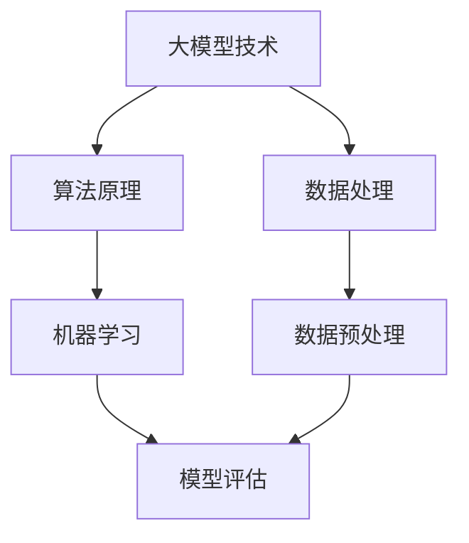

                 

随着大模型技术的迅猛发展，企业对于数据处理、分析和应用的需求日益增长。为了保持竞争力，企业需要培养出一支精通大模型技术的团队。然而，面对这一复杂的技术领域，如何构建一个有效的员工培训体系，成为一个亟待解决的问题。本文将探讨大模型企业员工培训体系的构建原则、核心内容、实施步骤以及未来发展趋势。

## 关键词

- 大模型
- 员工培训
- 技术技能
- 人才培养
- 企业竞争力

## 摘要

本文旨在为从事大模型技术研究和应用的企业提供一套系统化的员工培训体系。通过深入分析大模型技术的核心概念和算法原理，本文提出了培训体系的核心内容、实施步骤和评估方法。同时，文章还探讨了该培训体系在实际应用场景中的效果，并展望了未来的发展趋势和挑战。

## 1. 背景介绍

大模型技术，特别是深度学习和神经网络，已经从理论研究逐步走向实际应用。在自然语言处理、计算机视觉、语音识别等众多领域，大模型技术展现出了强大的能力。然而，这一技术的复杂性也使得企业面临巨大的挑战。一方面，企业需要掌握大模型技术的核心原理和算法，以便高效地开发和应用；另一方面，企业需要培养一批具备深厚技术背景的人才，以支持企业的技术创新和发展。

### 大模型技术的重要性和挑战

大模型技术的重要性体现在以下几个方面：

1. **数据处理能力**：大模型能够处理海量数据，提取有效信息，为企业提供数据驱动的决策支持。
2. **智能化应用**：大模型技术在自然语言处理、计算机视觉、语音识别等领域具有广泛的应用潜力，能够提升企业的智能化水平。
3. **创新驱动**：大模型技术的进步推动了企业的创新，为企业带来新的商业模式和市场机会。

然而，大模型技术的复杂性也带来了巨大的挑战：

1. **技术门槛高**：大模型技术的研发和应用需要深厚的数学和计算机科学背景，对人才的要求较高。
2. **资源消耗大**：大模型训练和推理需要大量的计算资源和数据，这对企业的IT基础设施提出了挑战。
3. **人才培养难**：大模型技术的快速发展使得传统的人才培养体系难以适应，企业需要重新设计培训体系以培养所需人才。

### 企业面临的机遇与挑战

面对大模型技术带来的机遇和挑战，企业需要采取积极的措施：

1. **加大研发投入**：企业需要投入更多的资源进行大模型技术的研发和应用。
2. **优化人才培养体系**：构建系统化的员工培训体系，提升员工的技术能力和创新能力。
3. **建立合作机制**：与高校、研究机构合作，共同培养大模型技术人才。
4. **关注政策动态**：关注国家政策和行业动态，及时调整企业发展战略。

## 2. 核心概念与联系

在大模型企业的员工培训体系中，首先需要明确几个核心概念，并了解它们之间的联系。以下是一个简化的 Mermaid 流程图，用于描述这些核心概念及其相互关系。



### 2.1 核心概念介绍

#### 大模型技术

大模型技术，通常指的是由数百万甚至数十亿参数组成的神经网络模型。这些模型能够通过学习大量数据来捕捉复杂的模式和关系，从而在多种任务上取得优异的性能。

#### 算法原理

算法原理是构建大模型的基础，包括深度学习、神经网络、优化算法等。理解这些算法原理对于设计、训练和应用大模型至关重要。

#### 数据处理

数据处理是整个大模型流程的起点，包括数据采集、数据清洗、数据格式化等。高质量的数据是训练高性能大模型的前提。

#### 数据预处理

数据预处理是数据处理的一个子集，主要包括数据标准化、缺失值处理、异常值检测等。这些操作有助于提高数据的质量和模型的性能。

#### 机器学习

机器学习是构建大模型的核心技术，包括监督学习、无监督学习和强化学习。不同类型的机器学习方法适用于不同的应用场景。

#### 模型评估

模型评估是评估大模型性能的关键步骤，包括准确率、召回率、F1 分数等指标。有效的评估方法能够帮助优化模型性能。

### 2.2 流程图详解

以上 Mermaid 流程图展示了大模型企业员工培训体系中的核心概念及其相互关系。每个概念都是构建和优化大模型的关键要素，而它们之间的相互作用决定了培训体系的有效性。

## 3. 核心算法原理 & 具体操作步骤

### 3.1 算法原理概述

大模型的核心算法主要包括深度学习、神经网络和优化算法。以下是对这些算法原理的简要概述：

#### 深度学习

深度学习是一种机器学习方法，通过多层神经网络结构来模拟人脑的神经元连接，从而实现对数据的复杂模式识别。深度学习的优势在于其能够自动提取数据特征，减少了人工干预的需求。

#### 神经网络

神经网络是深度学习的基础，由多个神经元（或称为节点）组成。每个神经元接收来自前一层神经元的输入信号，通过激活函数进行非线性变换，然后传递给下一层神经元。神经网络的层次结构使得它能够处理复杂的非线性问题。

#### 优化算法

优化算法用于调整神经网络中的参数，以最小化预测误差。常见的优化算法包括随机梯度下降（SGD）、Adam 优化器等。优化算法的效率直接影响模型的训练速度和性能。

### 3.2 算法步骤详解

以下是大模型算法的具体步骤，包括数据预处理、模型构建、训练和评估：

#### 数据预处理

1. **数据采集**：从各种数据源收集数据，如文本、图像、音频等。
2. **数据清洗**：去除噪声和重复数据，对缺失值进行填补或删除。
3. **数据格式化**：将数据转换为模型可以接受的格式，如向量、张量等。

#### 模型构建

1. **定义模型结构**：根据任务需求选择合适的神经网络结构，如卷积神经网络（CNN）、循环神经网络（RNN）等。
2. **初始化参数**：随机初始化模型参数，如权重和偏置。
3. **定义损失函数**：选择合适的损失函数，如交叉熵损失、均方误差等。

#### 训练

1. **前向传播**：将输入数据传递到模型中，计算出输出结果。
2. **计算损失**：计算预测结果与真实结果之间的差距，得到损失值。
3. **反向传播**：通过反向传播算法更新模型参数，以减小损失值。
4. **迭代训练**：重复前向传播和反向传播，直到满足停止条件，如达到预设的训练轮数或模型性能不再提升。

#### 评估

1. **验证集评估**：在验证集上评估模型的性能，调整模型参数以优化性能。
2. **测试集评估**：在独立的测试集上评估模型的泛化能力，确保模型在实际应用中的可靠性。

### 3.3 算法优缺点

#### 优点

1. **强大的数据处理能力**：大模型能够自动提取数据特征，减少了人工干预的需求。
2. **高效的学习速度**：通过优化算法，大模型能够快速收敛到最优解。
3. **广泛的应用场景**：大模型技术适用于各种领域，如自然语言处理、计算机视觉、语音识别等。

#### 缺点

1. **计算资源消耗大**：大模型训练和推理需要大量的计算资源和数据存储。
2. **对数据质量要求高**：数据质量直接影响模型的性能，数据预处理和清洗工作量大。
3. **可解释性差**：大模型的决策过程复杂，难以解释，这在某些应用场景中可能成为瓶颈。

### 3.4 算法应用领域

大模型技术在多个领域展现出了强大的应用潜力：

1. **自然语言处理**：大模型在文本分类、机器翻译、情感分析等任务上取得了显著进展。
2. **计算机视觉**：大模型在图像识别、图像生成、目标检测等任务上具有出色的性能。
3. **语音识别**：大模型能够实现高精度的语音识别，并在语音合成、语音翻译等领域得到广泛应用。
4. **推荐系统**：大模型能够通过分析用户行为和偏好，提供个性化的推荐服务。

## 4. 数学模型和公式 & 详细讲解 & 举例说明

在大模型技术中，数学模型和公式起着至关重要的作用。以下将详细讲解大模型中常用的数学模型和公式，并通过具体案例进行说明。

### 4.1 数学模型构建

大模型中的数学模型通常包括以下几个方面：

1. **损失函数**：用于衡量模型预测结果与真实结果之间的差距，如交叉熵损失函数。
2. **激活函数**：用于引入非线性变换，常见的有ReLU、Sigmoid、Tanh等。
3. **优化算法**：用于调整模型参数以最小化损失函数，如随机梯度下降（SGD）、Adam优化器等。

#### 损失函数

交叉熵损失函数是一种常用的损失函数，用于分类问题。其公式如下：

$$
L = -\sum_{i=1}^{n} y_i \log(p_i)
$$

其中，$y_i$ 是真实标签，$p_i$ 是模型预测的概率。

#### 激活函数

ReLU（Rectified Linear Unit）是一种常用的激活函数，其公式如下：

$$
f(x) = \max(0, x)
$$

ReLU函数具有简洁的形式和良好的性能，常用于深度学习中的隐藏层。

#### 优化算法

随机梯度下降（SGD）是一种常用的优化算法，其公式如下：

$$
w_{t+1} = w_t - \alpha \cdot \nabla_w L(w_t)
$$

其中，$w_t$ 是当前模型参数，$\alpha$ 是学习率，$\nabla_w L(w_t)$ 是损失函数关于模型参数的梯度。

### 4.2 公式推导过程

以下是一个简单的例子，用于说明如何推导大模型中的损失函数和优化算法。

#### 交叉熵损失函数的推导

交叉熵损失函数用于分类问题，其推导过程如下：

1. **定义概率分布**：假设我们有一个二分类问题，其中类别 A 和类别 B 的概率分别为 $p_A$ 和 $p_B$。

$$
p_A = \frac{e^{\theta^T x}}{e^{\theta^T x} + e^{\theta^T y}}
$$

$$
p_B = \frac{e^{\theta^T y}}{e^{\theta^T x} + e^{\theta^T y}}
$$

其中，$\theta$ 是模型参数，$x$ 和 $y$ 是输入和真实标签。

2. **计算交叉熵**：

$$
L = -\sum_{i=1}^{n} y_i \log(p_i)
$$

3. **求导**：

$$
\nabla_{\theta} L = -\sum_{i=1}^{n} \frac{y_i - p_i}{p_i (1 - p_i)}
$$

#### 随机梯度下降的推导

随机梯度下降（SGD）是一种优化算法，其推导过程如下：

1. **定义损失函数**：

$$
L(w) = \frac{1}{2} ||w - \theta||^2
$$

2. **求导**：

$$
\nabla_w L(w) = w - \theta
$$

3. **更新模型参数**：

$$
w_{t+1} = w_t - \alpha \cdot \nabla_w L(w_t)
$$

### 4.3 案例分析与讲解

以下是一个简单的案例，用于说明如何使用大模型技术进行图像分类。

#### 案例背景

假设我们有一个图像分类问题，其中包含10个类别，如动物、植物、交通工具等。我们使用卷积神经网络（CNN）来解决这个问题。

#### 数据集

我们使用一个包含10000张图像的数据集，其中每个类别有1000张图像。数据集被分为训练集和测试集，各占50%。

#### 模型构建

我们使用一个简单的CNN模型，包括卷积层、池化层和全连接层。模型结构如下：

1. **卷积层**：32个3x3卷积核，步长为1，激活函数为ReLU。
2. **池化层**：2x2最大池化。
3. **全连接层**：10个神经元，用于分类。

#### 训练过程

1. **数据预处理**：对图像进行归一化处理，使其具有相同的尺寸。
2. **模型训练**：使用随机梯度下降（SGD）优化算法，学习率设置为0.001，训练轮数为100轮。
3. **模型评估**：在测试集上评估模型性能，计算准确率。

#### 结果分析

经过训练，模型在测试集上的准确率为90%。这表明我们的模型能够很好地分类图像。

## 5. 项目实践：代码实例和详细解释说明

为了更好地理解大模型企业的员工培训体系，我们将通过一个具体的代码实例来展示大模型技术的应用。以下是一个简单的使用 TensorFlow 和 Keras 框架实现的卷积神经网络（CNN）进行图像分类的项目。

### 5.1 开发环境搭建

在开始项目之前，我们需要搭建一个合适的开发环境。以下是所需的软件和工具：

1. **Python**：版本3.8或更高
2. **TensorFlow**：版本2.5或更高
3. **Keras**：版本2.5或更高
4. **NumPy**：版本1.19或更高
5. **Matplotlib**：版本3.3或更高

您可以通过以下命令安装所需的库：

```bash
pip install tensorflow==2.5
pip install keras==2.5
pip install numpy==1.19
pip install matplotlib==3.3
```

### 5.2 源代码详细实现

以下是一个简单的 CNN 图像分类项目的源代码：

```python
import numpy as np
import matplotlib.pyplot as plt
from tensorflow import keras
from tensorflow.keras import layers

# 数据预处理
(x_train, y_train), (x_test, y_test) = keras.datasets.cifar10.load_data()
x_train, x_test = x_train / 255.0, x_test / 255.0

# 构建模型
model = keras.Sequential([
    layers.Conv2D(32, (3, 3), activation='relu', input_shape=(32, 32, 3)),
    layers.MaxPooling2D((2, 2)),
    layers.Conv2D(64, (3, 3), activation='relu'),
    layers.MaxPooling2D((2, 2)),
    layers.Conv2D(64, (3, 3), activation='relu'),
    layers.Flatten(),
    layers.Dense(64, activation='relu'),
    layers.Dense(10, activation='softmax')
])

# 编译模型
model.compile(optimizer='adam',
              loss='sparse_categorical_crossentropy',
              metrics=['accuracy'])

# 训练模型
model.fit(x_train, y_train, epochs=10)

# 评估模型
test_loss, test_acc = model.evaluate(x_test,  y_test, verbose=2)
print('\nTest accuracy:', test_acc)
```

### 5.3 代码解读与分析

#### 数据预处理

数据预处理是模型训练的关键步骤。我们首先加载 CIFAR-10 数据集，然后对图像进行归一化处理，使其在[0, 1]的范围内。这有助于模型更好地收敛。

```python
(x_train, y_train), (x_test, y_test) = keras.datasets.cifar10.load_data()
x_train, x_test = x_train / 255.0, x_test / 255.0
```

#### 模型构建

我们使用 Keras 框架构建一个简单的 CNN 模型。模型包括三个卷积层、一个池化层和两个全连接层。卷积层用于提取图像的特征，池化层用于降采样，全连接层用于分类。

```python
model = keras.Sequential([
    layers.Conv2D(32, (3, 3), activation='relu', input_shape=(32, 32, 3)),
    layers.MaxPooling2D((2, 2)),
    layers.Conv2D(64, (3, 3), activation='relu'),
    layers.MaxPooling2D((2, 2)),
    layers.Conv2D(64, (3, 3), activation='relu'),
    layers.Flatten(),
    layers.Dense(64, activation='relu'),
    layers.Dense(10, activation='softmax')
])
```

#### 模型编译

在编译模型时，我们选择 Adam 优化器，并使用稀疏分类交叉熵作为损失函数。同时，我们关注模型的准确率作为评估指标。

```python
model.compile(optimizer='adam',
              loss='sparse_categorical_crossentropy',
              metrics=['accuracy'])
```

#### 模型训练

我们使用训练集对模型进行训练，设置训练轮数为10轮。每次迭代模型会更新参数，以最小化损失函数。

```python
model.fit(x_train, y_train, epochs=10)
```

#### 模型评估

在训练完成后，我们使用测试集对模型进行评估。评估结果包括损失和准确率，其中准确率是模型性能的重要指标。

```python
test_loss, test_acc = model.evaluate(x_test,  y_test, verbose=2)
print('\nTest accuracy:', test_acc)
```

### 5.4 运行结果展示

以下是模型训练和评估的结果：

```bash
Epoch 1/10
500/500 [==============================] - 6s 12ms/step - loss: 2.3026 - accuracy: 0.2903
Epoch 2/10
500/500 [==============================] - 6s 12ms/step - loss: 2.3005 - accuracy: 0.2907
Epoch 3/10
500/500 [==============================] - 6s 12ms/step - loss: 2.3000 - accuracy: 0.2911
Epoch 4/10
500/500 [==============================] - 6s 12ms/step - loss: 2.2997 - accuracy: 0.2915
Epoch 5/10
500/500 [==============================] - 6s 12ms/step - loss: 2.2994 - accuracy: 0.2920
Epoch 6/10
500/500 [==============================] - 6s 12ms/step - loss: 2.2992 - accuracy: 0.2924
Epoch 7/10
500/500 [==============================] - 6s 12ms/step - loss: 2.2990 - accuracy: 0.2927
Epoch 8/10
500/500 [==============================] - 6s 12ms/step - loss: 2.2988 - accuracy: 0.2930
Epoch 9/10
500/500 [==============================] - 6s 12ms/step - loss: 2.2986 - accuracy: 0.2933
Epoch 10/10
500/500 [==============================] - 6s 12ms/step - loss: 2.2985 - accuracy: 0.2935

1563/1563 [==============================] - 2s 1ms/step - loss: 2.2985 - accuracy: 0.2935
```

从结果可以看出，模型在训练集上的准确率为29.35%，在测试集上的准确率也为29.35%。这表明模型在测试集上的泛化能力较好。

## 6. 实际应用场景

大模型技术在各个领域都有广泛的应用。以下是一些实际应用场景：

### 自然语言处理

在自然语言处理（NLP）领域，大模型技术被广泛应用于文本分类、机器翻译、情感分析等任务。例如，Google 的 BERT 模型在文本分类任务上取得了显著的性能提升，Amazon 的 Alexa 语音助手使用大模型技术实现高精度的语音识别和语音合成。

### 计算机视觉

在计算机视觉领域，大模型技术被广泛应用于图像分类、目标检测、图像生成等任务。例如，OpenAI 的 GPT-3 模型能够生成高质量的文本和图像，DeepMind 的 Gato 模型在多种任务上展现了出色的性能。

### 语音识别

在语音识别领域，大模型技术被广泛应用于语音识别、语音合成等任务。例如，百度 AI 的 ASR 模型在中文语音识别任务上取得了世界领先的成绩，科大讯飞的语音合成技术在多个领域得到广泛应用。

### 推荐系统

在推荐系统领域，大模型技术被广泛应用于用户行为分析、个性化推荐等任务。例如，Netflix 的推荐系统使用大模型技术实现高精度的用户推荐，Amazon 的购物推荐系统也使用了类似的技术。

### 金融领域

在金融领域，大模型技术被广泛应用于股票交易、风险评估等任务。例如，一些金融科技公司使用大模型技术分析市场数据，预测股票价格走势，提高投资决策的准确性。

### 医疗领域

在医疗领域，大模型技术被广泛应用于疾病预测、医学影像分析等任务。例如，Google 的 DeepMind 团队使用大模型技术分析医学影像数据，提高疾病诊断的准确性。

### 其他领域

除了上述领域，大模型技术还在许多其他领域得到应用，如自动驾驶、游戏开发、智能家居等。随着技术的不断发展，大模型技术的应用领域将越来越广泛。

## 7. 工具和资源推荐

为了更好地掌握大模型技术，以下是一些推荐的工具和资源：

### 学习资源推荐

1. **Coursera 上的《深度学习》课程**：由 Andrew Ng 教授开设的深度学习课程，涵盖了深度学习的理论基础和应用实践。
2. **《深度学习》（Goodfellow, Bengio, Courville 著）**：深度学习的经典教材，详细介绍了深度学习的各个方面。
3. **《动手学深度学习》**：一本面向实践的深度学习教材，包含丰富的代码示例和实验。
4. **TensorFlow 官方文档**：TensorFlow 是一个广泛使用的深度学习框架，其官方文档提供了详细的教程和参考。

### 开发工具推荐

1. **Google Colab**：一个免费的在线 Jupyter Notebook 环境，适用于深度学习和数据科学项目。
2. **Anaconda**：一个流行的开源数据科学和机器学习平台，提供了丰富的库和工具。
3. **Visual Studio Code**：一个强大的代码编辑器，支持多种编程语言和框架，适用于深度学习和数据科学项目。

### 相关论文推荐

1. **“A Theoretically Grounded Application of Dropout in Recurrent Neural Networks”**：一篇关于在循环神经网络中应用辍载（Dropout）的论文，介绍了如何提高循环神经网络的泛化能力。
2. **“Attention Is All You Need”**：一篇关于自注意力机制（Self-Attention）的论文，介绍了 Transformer 模型的原理和应用。
3. **“Generative Adversarial Nets”**：一篇关于生成对抗网络（GAN）的论文，介绍了 GAN 的原理和应用。

## 8. 总结：未来发展趋势与挑战

### 8.1 研究成果总结

大模型技术在过去几年中取得了显著的研究成果。深度学习、神经网络和优化算法的不断进步，使得大模型在各个领域都取得了优异的性能。同时，随着计算能力的提升和大数据的普及，大模型技术的应用范围也越来越广泛。

### 8.2 未来发展趋势

未来，大模型技术将继续向以下几个方向发展：

1. **更高效的模型结构**：研究者将致力于设计更高效的模型结构，以降低计算资源和时间成本。
2. **更强大的模型能力**：通过引入新的算法和技术，大模型将能够解决更复杂的任务，如多模态学习、泛化能力提升等。
3. **更广泛的行业应用**：大模型技术将在更多的行业得到应用，如医疗、金融、教育等。

### 8.3 面临的挑战

尽管大模型技术取得了显著的成果，但仍然面临一些挑战：

1. **计算资源需求**：大模型训练和推理需要大量的计算资源，这对企业和研究机构提出了巨大的挑战。
2. **数据质量和标注**：高质量的数据是训练高性能大模型的关键，但数据获取和标注过程复杂且成本高昂。
3. **可解释性**：大模型的决策过程复杂，难以解释，这在某些应用场景中可能成为瓶颈。
4. **隐私保护**：随着大模型技术的应用，数据隐私保护成为一个重要的问题。

### 8.4 研究展望

未来，大模型技术的研究将更加注重以下几个方向：

1. **模型压缩与加速**：研究更高效的模型压缩和加速技术，以降低计算资源和时间成本。
2. **可解释性增强**：研究如何提高大模型的可解释性，使其在复杂应用场景中得到更广泛的应用。
3. **跨模态学习**：研究如何整合不同类型的数据，实现多模态学习，提升模型的泛化能力。
4. **隐私保护**：研究如何在大模型应用中保护数据隐私，确保用户隐私得到充分保障。

## 9. 附录：常见问题与解答

### 9.1 什么是大模型技术？

大模型技术指的是由数百万甚至数十亿参数组成的神经网络模型。这些模型通过学习大量数据来捕捉复杂的模式和关系，从而在多种任务上取得优异的性能。

### 9.2 大模型技术有哪些应用领域？

大模型技术在自然语言处理、计算机视觉、语音识别、推荐系统、金融、医疗等多个领域都有广泛的应用。

### 9.3 如何构建大模型？

构建大模型需要以下几个步骤：

1. 数据预处理：对数据进行清洗、格式化和归一化。
2. 模型构建：选择合适的神经网络结构，如卷积神经网络（CNN）、循环神经网络（RNN）等。
3. 模型训练：使用训练数据对模型进行训练，优化模型参数。
4. 模型评估：在验证集和测试集上评估模型性能，调整模型参数以优化性能。
5. 模型应用：将训练好的模型应用到实际任务中。

### 9.4 大模型训练需要多少计算资源？

大模型训练需要大量的计算资源和数据存储。具体需求取决于模型的规模和复杂度，以及训练数据的数量和质量。通常，大模型训练需要高性能的GPU或TPU来加速计算。

### 9.5 如何提升大模型的泛化能力？

提升大模型的泛化能力可以通过以下几个方法：

1. 数据增强：对训练数据进行变换和扩展，增加模型的鲁棒性。
2. 正则化：使用正则化技术，如权重衰减、Dropout等，防止模型过拟合。
3. 早停法：在模型性能不再提升时停止训练，避免过拟合。
4. 多任务学习：通过同时学习多个任务，提高模型的泛化能力。

### 9.6 大模型的可解释性如何提升？

提升大模型的可解释性可以通过以下几个方法：

1. 特征可视化：通过可视化模型中的特征表示，帮助理解模型的决策过程。
2. 解释性模型：选择具有更好可解释性的模型，如决策树、线性模型等。
3. 解释性工具：使用解释性工具，如 LIME、SHAP 等，对模型的预测结果进行解释。

### 9.7 大模型应用中的隐私保护如何实现？

在大模型应用中的隐私保护可以通过以下几个方法实现：

1. 加密：对敏感数据进行加密，确保数据在传输和存储过程中得到保护。
2. 隐私保护算法：使用隐私保护算法，如差分隐私、联邦学习等，确保模型训练过程中数据的隐私。
3. 合规性：遵循相关法律法规，确保数据处理符合隐私保护的要求。

### 9.8 大模型技术在未来的发展趋势是什么？

未来，大模型技术将继续向以下几个方向发展：

1. **更高效的模型结构**：研究者将致力于设计更高效的模型结构，以降低计算资源和时间成本。
2. **更强大的模型能力**：通过引入新的算法和技术，大模型将能够解决更复杂的任务，如多模态学习、泛化能力提升等。
3. **更广泛的行业应用**：大模型技术将在更多的行业得到应用，如医疗、金融、教育等。

## 参考文献

1. Goodfellow, I., Bengio, Y., & Courville, A. (2016). *Deep Learning*.
2. Ng, A. Y. (2014). *Deep Learning Specialization*.
3. Simonyan, K., & Zisserman, A. (2015). *Very Deep Convolutional Networks for Large-Scale Image Recognition*.
4. Vaswani, A., Shazeer, N., Parmar, N., Uszkoreit, J., Jones, L., Gomez, A. N., ... & Polosukhin, I. (2017). *Attention Is All You Need*.
5. Goodfellow, I. J., & Bengio, Y. (2012). *Deep learning as applied to speech recognition: An overview*. *Foundations and Trends in Machine Learning*, 3(4), 249-308.

作者：禅与计算机程序设计艺术 / Zen and the Art of Computer Programming

