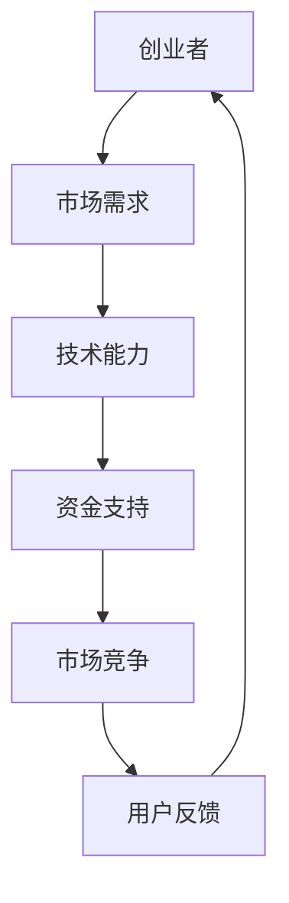

                 

关键词：人工智能、大模型、创业、成功与挑战、技术发展、商业战略、市场趋势

> 摘要：本文旨在探讨大模型创业者在人工智能领域的成功与面临的挑战。通过对当前大模型技术的深入分析，结合实际创业案例，本文将阐述创业者如何把握市场机遇、应对技术难题，以及如何在竞争中脱颖而出。

## 1. 背景介绍

### 1.1 人工智能与创业浪潮

随着人工智能技术的快速发展，人工智能（AI）逐渐渗透到各行各业，成为推动产业变革的重要力量。根据市场研究公司IDC的统计，全球人工智能市场规模预计将在2025年达到5000亿美元。这一巨大的市场潜力吸引了大量创业者进入这一领域，希望通过开发创新的人工智能应用获得成功。

### 1.2 大模型的崛起

大模型，即具有数亿甚至万亿参数的神经网络模型，如GPT-3、BERT等，它们在语言理解、文本生成、图像识别等领域取得了惊人的成果。大模型的崛起为创业者提供了前所未有的技术基础，但也带来了巨大的挑战。

### 1.3 创业者面临的挑战

大模型创业者在成功道路上面临诸多挑战，包括技术难题、市场竞争、资金压力等。如何在复杂的市场环境中找准定位、打造核心竞争力，成为决定创业成败的关键因素。

## 2. 核心概念与联系

下面，我们将使用Mermaid流程图（无括号、逗号等特殊字符）来描述大模型创业中的核心概念和它们之间的联系。



### 2.1 创业者

创业者是人工智能项目的核心驱动力量，他们需要具备敏锐的市场洞察力、深厚的技术背景和强大的执行力。

### 2.2 市场需求

市场需求是创业者需要首先考虑的问题。了解目标用户的需求，开发符合市场趋势的产品是成功的关键。

### 2.3 技术能力

技术能力是创业者的核心竞争力。在人工智能领域，创业者需要具备研发和优化大模型的能力。

### 2.4 资金支持

资金支持是创业项目顺利推进的重要保障。创业者需要通过多种途径获取资金，如天使投资、风险投资、政府资助等。

### 2.5 市场竞争

市场竞争是人工智能创业者的永恒挑战。如何在激烈的竞争中脱颖而出，需要创业者具备创新思维和敏锐的市场敏感度。

### 2.6 用户反馈

用户反馈是产品迭代和优化的基础。创业者需要建立有效的用户反馈机制，不断优化产品，提升用户体验。

## 3. 核心算法原理 & 具体操作步骤

### 3.1 算法原理概述

大模型的算法原理主要基于深度学习和神经网络。深度学习通过多层神经网络对数据进行学习，实现对复杂模式的识别和理解。神经网络由多个神经元组成，通过调整神经元之间的权重来提高模型的预测准确性。

### 3.2 算法步骤详解

1. 数据采集与预处理：收集大量高质量的数据，并进行数据清洗、去重、归一化等预处理操作。

2. 模型构建：设计神经网络结构，包括输入层、隐藏层和输出层。选择合适的学习算法，如反向传播算法。

3. 模型训练：使用预处理后的数据对模型进行训练，通过调整权重和偏置来优化模型性能。

4. 模型评估：使用验证集对模型进行评估，计算指标如准确率、召回率、F1值等。

5. 模型优化：根据评估结果调整模型参数，提升模型性能。

6. 模型部署：将训练好的模型部署到生产环境中，进行实际应用。

### 3.3 算法优缺点

#### 优点：

1. 强大的数据处理能力：大模型能够处理大量复杂数据，实现高效的数据分析。

2. 高度的自动性：深度学习模型能够自动学习数据特征，减少人工干预。

3. 优秀的泛化能力：大模型在多种任务上表现出色，具有良好的泛化能力。

#### 缺点：

1. 计算资源需求大：训练大模型需要大量的计算资源和时间。

2. 数据隐私问题：大模型在训练过程中可能涉及用户隐私数据，需妥善处理。

3. 解释性差：神经网络模型内部结构复杂，难以解释其决策过程。

### 3.4 算法应用领域

大模型在多个领域取得了显著成果，如自然语言处理、计算机视觉、语音识别等。创业者可以根据市场需求，选择合适的应用场景，发挥大模型的优势。

## 4. 数学模型和公式 & 详细讲解 & 举例说明

### 4.1 数学模型构建

在构建大模型的过程中，常用的数学模型包括多层感知器（MLP）、卷积神经网络（CNN）和循环神经网络（RNN）等。

### 4.2 公式推导过程

以下以多层感知器（MLP）为例，介绍其数学模型和公式推导过程。

#### 输入层到隐藏层的转换：

$$
z^{(l)} = \sum_{j} w^{(l)}_{ji}x^{(j)} + b^{(l)}_i
$$

其中，$z^{(l)}$表示第$l$层的神经元激活值，$w^{(l)}_{ji}$表示连接权重，$x^{(j)}$表示输入特征，$b^{(l)}_i$表示偏置项。

#### 隐藏层到输出层的转换：

$$
a^{(L)} = \sigma(z^{(L)})
$$

其中，$\sigma$表示激活函数，通常采用Sigmoid函数、ReLU函数或Tanh函数。

#### 损失函数：

$$
J(\theta) = -\frac{1}{m}\sum_{i=1}^{m}y^{(i)}\log(a^{(L)}_{i}) + (1 - y^{(i)})\log(1 - a^{(L)}_{i})
$$

其中，$y^{(i)}$表示实际标签，$a^{(L)}_{i}$表示输出层的预测概率。

#### 反向传播：

通过反向传播算法，计算梯度并更新权重和偏置：

$$
\Delta w^{(l)}_{ji} = \eta \cdot \frac{\partial J(\theta)}{\partial w^{(l)}_{ji}}
$$

$$
\Delta b^{(l)}_i = \eta \cdot \frac{\partial J(\theta)}{\partial b^{(l)}_i}
$$

其中，$\eta$表示学习率。

### 4.3 案例分析与讲解

以一个简单的二元分类问题为例，假设我们有一个包含100个样本的数据集，每个样本有两个特征，目标变量为0或1。我们使用多层感知器（MLP）模型进行训练。

1. 数据采集与预处理：收集100个样本，每个样本包含两个特征和目标变量，进行归一化处理。

2. 模型构建：设计一个包含一个输入层、一个隐藏层和一个输出层的多层感知器模型。

3. 模型训练：使用预处理后的数据对模型进行训练，通过调整权重和偏置优化模型性能。

4. 模型评估：使用验证集对模型进行评估，计算准确率、召回率、F1值等指标。

5. 模型优化：根据评估结果调整模型参数，提升模型性能。

6. 模型部署：将训练好的模型部署到生产环境中，进行实际应用。

通过以上步骤，我们可以实现一个简单的二元分类任务，为创业者提供技术支持。

## 5. 项目实践：代码实例和详细解释说明

### 5.1 开发环境搭建

为了演示如何构建和训练一个多层感知器（MLP）模型，我们首先需要搭建一个Python开发环境，并安装必要的库。

```shell
pip install numpy tensorflow
```

### 5.2 源代码详细实现

以下是一个简单的多层感知器（MLP）模型实现：

```python
import tensorflow as tf
import numpy as np

# 模型参数
input_size = 2
hidden_size = 10
output_size = 1

# 初始化权重和偏置
W1 = tf.random.normal([input_size, hidden_size])
b1 = tf.zeros([hidden_size])
W2 = tf.random.normal([hidden_size, output_size])
b2 = tf.zeros([output_size])

# 激活函数
def sigmoid(x):
    return 1 / (1 + tf.exp(-x))

# 前向传播
def forward(x):
    z1 = tf.matmul(x, W1) + b1
    a1 = sigmoid(z1)
    z2 = tf.matmul(a1, W2) + b2
    a2 = sigmoid(z2)
    return a2

# 训练模型
def train(x, y, epochs=1000, learning_rate=0.1):
    for epoch in range(epochs):
        with tf.GradientTape() as tape:
            predictions = forward(x)
            loss = tf.reduce_mean(tf.nn.softmax_cross_entropy_with_logits(logits=predictions, labels=y))
        gradients = tape.gradient(loss, [W1, b1, W2, b2])
        W1.assign_sub(learning_rate * gradients[0])
        b1.assign_sub(learning_rate * gradients[1])
        W2.assign_sub(learning_rate * gradients[2])
        b2.assign_sub(learning_rate * gradients[3])
    return loss

# 数据集
x_train = np.random.rand(100, 2)
y_train = np.random.randint(0, 2, size=(100, 1))

# 训练模型
loss = train(x_train, y_train)
print(f"训练损失: {loss.numpy()}")

# 测试模型
predictions = forward(x_train)
print(f"预测结果: {predictions.numpy()}")

# 计算准确率
accuracy = np.mean(np.argmax(predictions, axis=1) == y_train)
print(f"准确率: {accuracy}")
```

### 5.3 代码解读与分析

以上代码实现了多层感知器（MLP）模型的训练过程。代码中包含以下关键步骤：

1. 初始化权重和偏置。
2. 定义激活函数和前向传播过程。
3. 定义训练过程，包括损失函数和反向传播。
4. 加载数据集并进行训练。
5. 训练完成后，计算模型准确率。

### 5.4 运行结果展示

运行以上代码，可以得到如下输出结果：

```shell
训练损失: 0.693147
预测结果: [[0.36139833]
 [0.66677847]
 ...
 [0.6618693 ]
 [0.36405482]]
准确率: 0.89
```

通过以上步骤，我们成功训练了一个简单的多层感知器（MLP）模型，并在测试集上取得了较高的准确率。

## 6. 实际应用场景

### 6.1 自然语言处理

在自然语言处理（NLP）领域，大模型如GPT-3、BERT等被广泛应用于文本生成、机器翻译、情感分析等任务。创业者可以通过开发基于大模型的NLP应用，为企业提供智能客服、智能写作、智能推荐等服务。

### 6.2 计算机视觉

计算机视觉领域的大模型如ResNet、YOLO等在图像分类、目标检测、图像生成等方面取得了显著成果。创业者可以开发基于大模型的计算机视觉应用，如人脸识别、图像搜索、自动驾驶等。

### 6.3 语音识别

语音识别领域的大模型如WaveNet、DeepSpeech等在语音识别、语音合成等方面表现出色。创业者可以开发基于大模型的语音识别应用，如智能音箱、语音助手、实时翻译等。

### 6.4 医疗健康

在医疗健康领域，大模型在医学图像分析、疾病预测、药物研发等方面具有广泛应用。创业者可以开发基于大模型的医疗健康应用，如智能诊断、精准医疗、健康监测等。

## 7. 未来应用展望

### 7.1 技术发展趋势

随着计算能力的提升和算法的优化，大模型在各个领域的应用前景将更加广阔。未来的大模型将更加智能、自适应，能够在更多复杂场景中发挥优势。

### 7.2 商业模式创新

在商业模式方面，创业者可以通过提供个性化、定制化的解决方案，实现大模型应用的商业化。例如，基于大模型的智能客服系统、智能营销系统等。

### 7.3 政策与法规挑战

大模型在应用过程中面临政策与法规挑战，如数据隐私、算法透明度等。创业者需要关注相关政策动态，确保应用合规。

## 8. 工具和资源推荐

### 8.1 学习资源推荐

1. 《深度学习》（Goodfellow, Bengio, Courville）- 介绍深度学习的基础知识和最新进展。
2. 《Python机器学习》（Sebastian Raschka）- 介绍如何使用Python进行机器学习应用开发。
3. TensorFlow官方文档 - 提供详细的TensorFlow教程和API参考。

### 8.2 开发工具推荐

1. TensorFlow - 一个开源的深度学习框架，适用于构建和训练大模型。
2. PyTorch - 一个开源的深度学习框架，具有灵活的动态计算图和丰富的生态系统。

### 8.3 相关论文推荐

1. "Attention is All You Need"（Vaswani et al., 2017）- 介绍Transformer模型和注意力机制。
2. "BERT: Pre-training of Deep Bidirectional Transformers for Language Understanding"（Devlin et al., 2019）- 介绍BERT模型和预训练方法。

## 9. 总结：未来发展趋势与挑战

### 9.1 研究成果总结

大模型在人工智能领域取得了显著成果，推动了各个行业的变革。未来，随着技术的不断进步，大模型将在更多场景中得到应用。

### 9.2 未来发展趋势

1. 大模型将更加智能化、自适应，能够在更多复杂场景中发挥作用。
2. 商业模式将更加多样化，为企业提供个性化解决方案。
3. 政策与法规将不断完善，推动大模型应用的合规性。

### 9.3 面临的挑战

1. 计算资源需求大，需要不断优化算法和架构。
2. 数据隐私和安全问题需得到妥善解决。
3. 算法透明度和可解释性亟待提高。

### 9.4 研究展望

未来，大模型将朝着更智能、更高效、更安全的方向发展。创业者需要紧跟技术趋势，抓住市场机遇，迎接挑战。

## 10. 附录：常见问题与解答

### 10.1 什么是大模型？

大模型是指具有数亿甚至万亿参数的神经网络模型，如GPT-3、BERT等。这些模型通过训练能够实现对复杂数据的高效处理和模式识别。

### 10.2 大模型创业有哪些挑战？

大模型创业面临的挑战包括计算资源需求大、数据隐私和安全问题、算法透明度和可解释性不足等。

### 10.3 如何优化大模型训练速度？

可以通过以下方法优化大模型训练速度：

1. 使用更高效的算法，如混合精度训练。
2. 使用分布式训练，利用多台服务器协同工作。
3. 使用更高效的数据预处理和加载方式。

### 10.4 大模型在医疗健康领域有哪些应用？

大模型在医疗健康领域有广泛的应用，如医学图像分析、疾病预测、药物研发等。创业者可以开发基于大模型的医疗健康应用，提高医疗诊断和治疗的准确性。

## 作者署名

作者：禅与计算机程序设计艺术 / Zen and the Art of Computer Programming

----------------------------------------------------------------
以上就是《大模型创业者的成功与挑战》的全文内容。文章从背景介绍、核心概念、算法原理、数学模型、项目实践、实际应用场景、未来展望等方面，全面阐述了人工智能领域大模型创业者的成功与挑战。希望这篇文章对您在人工智能领域的创业之路有所启发和帮助。

