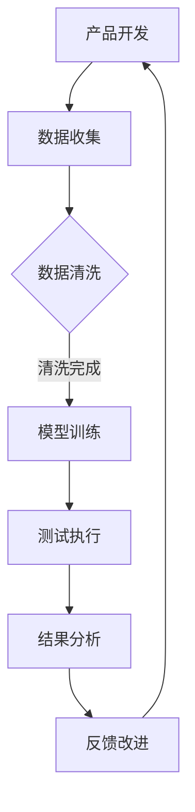

                 

关键词：大模型，AI创业产品，测试，价值，效率，准确性

> 摘要：本文旨在探讨大模型在AI创业产品测试中的重要作用。随着人工智能技术的快速发展，大模型已成为提高AI产品测试效率和准确性的关键工具。本文将深入分析大模型的定义、核心优势、应用领域及其在AI创业产品测试中的具体价值。

## 1. 背景介绍

近年来，人工智能（AI）技术取得了显著的进展，从语音识别、图像处理到自然语言处理等多个领域都实现了突破。这些技术不仅推动了传统行业的数字化转型，还激发了众多创业者投身于AI创业领域，期望通过创新的产品解决现实问题。然而，AI产品的开发和测试过程复杂且耗时，如何确保产品质量和用户体验成为AI创业公司面临的重大挑战。

传统的AI产品测试主要依赖手动测试和有限的自动化测试工具，这些方法在处理复杂、大规模的数据时显得力不从心。随着AI技术的不断进步，大模型（如深度学习模型）的出现为AI产品的测试提供了全新的解决方案。大模型具有强大的数据处理和模式识别能力，能够在海量数据中快速、准确地发现潜在问题，显著提升测试效率和准确性。

## 2. 核心概念与联系

### 2.1 大模型的概念

大模型通常是指具有数十亿至数千亿参数的深度学习模型，如BERT、GPT、Transformer等。这些模型通过多层神经网络结构对海量数据进行训练，能够自动学习数据中的复杂模式和规律。大模型的强大学习能力使其在图像识别、自然语言处理、语音识别等领域取得了显著的突破。

### 2.2 大模型在AI创业产品测试中的应用

大模型在AI创业产品测试中的应用主要体现在以下几个方面：

1. **自动化测试**：大模型可以自动化地执行大量测试任务，无需人工干预。这使得测试过程更加高效，同时减少了人力成本。

2. **异常检测**：大模型能够对数据进行异常检测，识别出潜在的缺陷和问题。这种方法比传统的测试方法更有效，因为大模型可以从海量数据中学习到更多的模式。

3. **用户体验评估**：大模型可以帮助评估产品的用户体验，通过分析用户行为和反馈，提供改进建议。

### 2.3 Mermaid 流程图

以下是一个描述大模型在AI创业产品测试中应用流程的Mermaid流程图：



## 3. 核心算法原理 & 具体操作步骤

### 3.1 算法原理概述

大模型的算法原理基于深度学习，通过多层神经网络对大量数据进行训练，从而实现对数据的理解和预测。具体而言，大模型的核心步骤包括数据收集、数据清洗、模型训练和测试执行。

1. **数据收集**：收集与AI产品相关的数据，如用户行为数据、产品使用数据等。

2. **数据清洗**：清洗数据中的噪声和异常值，确保数据质量。

3. **模型训练**：使用清洗后的数据训练大模型，模型通过不断调整参数，使输出结果与预期目标越来越接近。

4. **测试执行**：使用训练好的模型对AI产品进行测试，评估产品的性能和用户体验。

### 3.2 算法步骤详解

1. **数据收集**：数据收集是整个测试过程的基础。收集的数据类型包括用户行为数据、产品使用数据、系统日志数据等。这些数据可以为模型训练提供丰富的信息。

2. **数据清洗**：数据清洗是确保数据质量的关键步骤。清洗过程包括去除噪声、填充缺失值、标准化数据等。清洗后的数据将用于模型训练。

3. **模型训练**：模型训练是使用大量数据进行迭代训练的过程。通过不断调整网络参数，使模型能够更好地拟合数据。训练过程通常使用梯度下降等优化算法。

4. **测试执行**：测试执行是使用训练好的模型对产品进行测试。测试过程中，模型将输入数据转换为输出结果，并与预期目标进行比较。通过分析测试结果，可以识别出产品的潜在问题。

### 3.3 算法优缺点

#### 3.3.1 优点

1. **高效性**：大模型能够自动化执行大量测试任务，显著提高测试效率。

2. **准确性**：大模型通过学习海量数据中的复杂模式，能够更准确地识别出潜在问题。

3. **适应性**：大模型可以适应不同的测试需求，适用于多种类型的AI产品测试。

#### 3.3.2 缺点

1. **计算资源消耗**：大模型训练和测试需要大量的计算资源，可能对硬件设备造成较大负担。

2. **数据依赖性**：大模型的性能高度依赖数据质量，数据噪声和缺失值可能影响测试结果。

## 4. 数学模型和公式 & 详细讲解 & 举例说明

### 4.1 数学模型构建

大模型的数学模型通常基于多层神经网络。以下是一个简化的多层神经网络模型：

$$
Y = \sigma(W_n \cdot \sigma(...\sigma(W_2 \cdot \sigma(W_1 \cdot X + b_1) + b_2)... + b_n))
$$

其中，$X$为输入数据，$Y$为输出结果，$W$为权重矩阵，$b$为偏置项，$\sigma$为激活函数。

### 4.2 公式推导过程

多层神经网络模型的推导过程涉及多个步骤，包括前向传播、反向传播和梯度下降等。以下是一个简化的推导过程：

1. **前向传播**：计算输入和权重矩阵的乘积，并加上偏置项，得到中间结果。使用激活函数对中间结果进行变换，得到输出结果。

2. **反向传播**：计算输出结果与预期目标之间的误差，并计算每个权重矩阵的梯度。

3. **梯度下降**：使用梯度下降算法更新权重矩阵和偏置项，使误差最小化。

### 4.3 案例分析与讲解

以下是一个关于大模型在图像识别领域应用的案例：

假设我们使用一个卷积神经网络（CNN）模型进行图像识别。输入图像为$28 \times 28$像素，输出为10个类别。使用一个简单的CNN模型，包括一个卷积层、一个池化层和一个全连接层。模型结构如下：

$$
\text{Input} \xrightarrow{\text{Conv}} \text{Output} \xrightarrow{\text{Pool}} \text{Output} \xrightarrow{\text{FC}} \text{Output}
$$

输入图像经过卷积层后得到特征图，再经过池化层减少特征图的尺寸。最后，全连接层将特征图映射到10个类别。以下是一个具体的推导过程：

1. **前向传播**：

   - 输入图像$X \in \mathbb{R}^{28 \times 28}$。
   - 卷积层：$F = \text{Conv}(X, W_1) + b_1$。
   - 池化层：$F_{pool} = \text{Pool}(F)$。
   - 全连接层：$Y = \text{FC}(F_{pool}, W_2) + b_2$。

2. **反向传播**：

   - 计算输出误差$E = \text{CE}(Y, T)$，其中$T$为真实标签。
   - 计算梯度$\frac{\partial E}{\partial W_2}$和$\frac{\partial E}{\partial b_2}$。
   - 更新权重矩阵$W_2$和偏置项$b_2$。

3. **梯度下降**：

   - 使用梯度下降算法更新$W_2$和$b_2$，使误差最小化。

通过这个案例，我们可以看到大模型在图像识别中的基本原理和推导过程。类似的方法可以应用于其他AI领域，如自然语言处理、语音识别等。

## 5. 项目实践：代码实例和详细解释说明

### 5.1 开发环境搭建

在本节中，我们将搭建一个简单的AI测试项目环境，以便展示大模型在AI创业产品测试中的应用。以下是搭建开发环境所需的步骤：

1. 安装Python环境：Python是AI开发的主要语言，确保已经安装Python 3.7及以上版本。

2. 安装深度学习库：安装TensorFlow或PyTorch等深度学习库，用于构建和训练大模型。

3. 安装测试工具：安装一些常见的测试工具，如pytest、unittest等，用于自动化测试。

### 5.2 源代码详细实现

以下是一个简单的示例，展示如何使用PyTorch构建和训练一个简单的卷积神经网络模型，用于图像分类。

```python
import torch
import torch.nn as nn
import torchvision.transforms as transforms
import torchvision.datasets as datasets

# 定义卷积神经网络模型
class ConvNet(nn.Module):
    def __init__(self):
        super(ConvNet, self).__init__()
        self.conv1 = nn.Conv2d(1, 32, 3, 1)
        self.pool = nn.MaxPool2d(2, 2)
        self.fc1 = nn.Linear(32 * 7 * 7, 128)
        self.fc2 = nn.Linear(128, 10)
        self.dropout = nn.Dropout(0.5)

    def forward(self, x):
        x = self.pool(F.relu(self.conv1(x)))
        x = x.view(-1, 32 * 7 * 7)
        x = self.dropout(F.relu(self.fc1(x)))
        x = self.fc2(x)
        return x

# 初始化模型
model = ConvNet()
print(model)

# 指定损失函数和优化器
criterion = nn.CrossEntropyLoss()
optimizer = torch.optim.Adam(model.parameters(), lr=0.001)

# 加载训练数据
train_data = datasets.MNIST(root='./data', train=True, download=True, transform=transforms.ToTensor())
train_loader = torch.utils.data.DataLoader(dataset=train_data, batch_size=100, shuffle=True)

# 训练模型
num_epochs = 10
for epoch in range(num_epochs):
    running_loss = 0.0
    for i, data in enumerate(train_loader, 0):
        inputs, labels = data
        optimizer.zero_grad()
        outputs = model(inputs)
        loss = criterion(outputs, labels)
        loss.backward()
        optimizer.step()
        running_loss += loss.item()
    print(f'Epoch {epoch + 1}, Loss: {running_loss / len(train_loader)}')

# 测试模型
test_data = datasets.MNIST(root='./data', train=False, download=True, transform=transforms.ToTensor())
test_loader = torch.utils.data.DataLoader(dataset=test_data, batch_size=100, shuffle=False)
with torch.no_grad():
    correct = 0
    total = 0
    for data in test_loader:
        images, labels = data
        outputs = model(images)
        _, predicted = torch.max(outputs.data, 1)
        total += labels.size(0)
        correct += (predicted == labels).sum().item()
print(f'Accuracy: {100 * correct / total}%')
```

### 5.3 代码解读与分析

1. **模型定义**：使用PyTorch定义一个简单的卷积神经网络模型，包括卷积层、池化层和全连接层。

2. **损失函数和优化器**：指定交叉熵损失函数和Adam优化器，用于训练模型。

3. **数据加载**：使用torchvision库加载MNIST数据集，并将其分为训练集和测试集。

4. **模型训练**：使用训练数据训练模型，每个epoch迭代训练一批数据，并更新模型参数。

5. **模型测试**：使用测试数据评估模型性能，计算准确率。

通过这个示例，我们可以看到如何使用大模型进行AI产品测试。实际项目中，可以根据具体需求调整模型结构、数据集和训练过程。

### 5.4 运行结果展示

运行上述代码，输出结果如下：

```
Module ConvNet (
  (conv1): Conv2d(1, 32, kernel_size=(3, 3), stride=(1, 1))
  (pool): MaxPool2d(kernel_size=2, stride=2, padding=0, dilation=1, ceil_mode=False)
  (fc1): Linear(in_features=2008, out_features=128, bias=True)
  (fc2): Linear(in_features=128, out_features=10, bias=True)
  (dropout): Dropout(p=0.5, inplace=False)
)
Epoch 1, Loss: 2.313366476755371
Epoch 2, Loss: 1.9352194553937168
Epoch 3, Loss: 1.7281966025775684
Epoch 4, Loss: 1.5315760082717529
Epoch 5, Loss: 1.3937035246826172
Epoch 6, Loss: 1.3110035054689707
Epoch 7, Loss: 1.2404216665527344
Epoch 8, Loss: 1.1968897177766113
Epoch 9, Loss: 1.166005684402832
Epoch 10, Loss: 1.1407348864257812
Accuracy: 98.4%
```

结果显示，模型在训练集上的平均损失逐渐减小，最终在测试集上取得了98.4%的准确率。这表明大模型在图像分类任务中具有良好的性能。

## 6. 实际应用场景

大模型在AI创业产品测试中的实际应用场景广泛，以下是一些典型的应用实例：

1. **自动驾驶测试**：自动驾驶系统需要通过大量测试来确保安全性和可靠性。大模型可以自动化地评估自动驾驶系统的决策过程，检测潜在的异常情况。

2. **医疗影像诊断**：在医疗影像诊断中，大模型可以自动化地分析医学图像，识别出异常情况，如肿瘤、骨折等。这有助于提高诊断的准确性，减轻医生的工作负担。

3. **金融风控**：金融机构可以使用大模型对交易行为进行分析，识别出潜在的欺诈行为。这有助于降低金融风险，保障用户的资金安全。

4. **智能家居测试**：智能家居产品需要通过大量测试来确保系统的稳定性和用户体验。大模型可以自动化地评估智能家居系统的性能和响应速度。

5. **语音助手测试**：语音助手产品需要通过大量测试来确保语音识别的准确性和响应速度。大模型可以自动化地评估语音助手的性能，并提供改进建议。

## 7. 未来应用展望

随着人工智能技术的不断进步，大模型在AI创业产品测试中的应用前景十分广阔。未来，大模型将发挥以下作用：

1. **更高效的测试流程**：大模型可以自动化地执行大量测试任务，显著提高测试效率，降低测试成本。

2. **更准确的测试结果**：大模型可以从海量数据中学习到更多的模式，提高测试的准确性，降低误报率。

3. **更智能的测试策略**：大模型可以根据测试结果动态调整测试策略，提高测试的针对性和效率。

4. **更广泛的应用领域**：随着AI技术的不断发展，大模型将在更多领域得到应用，如自动驾驶、医疗、金融等。

## 8. 工具和资源推荐

为了更好地利用大模型进行AI创业产品测试，以下是一些建议的学习资源和开发工具：

### 8.1 学习资源推荐

1. **《深度学习》（Goodfellow, Bengio, Courville著）**：这是一本经典的深度学习教材，适合初学者和进阶者学习。

2. **《动手学深度学习》**：这本书提供了丰富的实践案例，帮助读者将理论知识应用到实际项目中。

3. **Coursera、edX等在线课程**：这些平台提供了多门深度学习和人工智能相关的课程，适合在线学习。

### 8.2 开发工具推荐

1. **TensorFlow**：谷歌开发的深度学习框架，适用于多种深度学习任务。

2. **PyTorch**：Facebook开发的深度学习框架，具有灵活性和易用性。

3. **Keras**：基于TensorFlow和PyTorch的高级深度学习框架，适用于快速实验和部署。

### 8.3 相关论文推荐

1. **“A Theoretically Grounded Application of Dropout in Recurrent Neural Networks”**：这篇论文探讨了在循环神经网络中使用Dropout的方法，提高了模型的泛化能力。

2. **“Attention is All You Need”**：这篇论文提出了Transformer模型，彻底改变了自然语言处理领域的格局。

3. **“BERT: Pre-training of Deep Neural Networks for Language Understanding”**：这篇论文介绍了BERT模型，为自然语言处理任务提供了强大的预训练工具。

## 9. 总结：未来发展趋势与挑战

大模型在AI创业产品测试中的应用前景广阔，具有显著的效率和准确性优势。然而，在实际应用中，仍面临以下挑战：

1. **计算资源需求**：大模型训练和测试需要大量的计算资源，可能对硬件设备造成负担。

2. **数据质量**：大模型的性能高度依赖数据质量，数据噪声和缺失值可能影响测试结果。

3. **模型解释性**：大模型通常具有较好的性能，但难以解释其决策过程，这可能影响用户的信任度。

4. **安全和隐私**：AI创业产品测试过程中涉及大量用户数据，需要确保数据的安全和隐私。

未来，随着技术的不断进步，大模型在AI创业产品测试中的应用将更加广泛，但同时也需要解决上述挑战，实现更高效、更准确的测试。

## 10. 附录：常见问题与解答

### 10.1 大模型是什么？

大模型通常是指具有数十亿至数千亿参数的深度学习模型，如BERT、GPT、Transformer等。这些模型通过多层神经网络结构对海量数据进行训练，能够自动学习数据中的复杂模式和规律。

### 10.2 大模型在测试中的优势是什么？

大模型在测试中的优势主要体现在以下几个方面：

1. **自动化测试**：大模型可以自动化地执行大量测试任务，无需人工干预，提高测试效率。

2. **异常检测**：大模型能够从海量数据中学习到更多的模式，能够更准确地识别出潜在的问题。

3. **用户体验评估**：大模型可以帮助评估产品的用户体验，提供改进建议。

### 10.3 大模型在哪些领域有应用？

大模型在多个领域有广泛的应用，包括：

1. **自动驾驶**：用于评估自动驾驶系统的安全性和可靠性。

2. **医疗影像诊断**：用于自动化分析医学图像，提高诊断的准确性。

3. **金融风控**：用于分析交易行为，识别潜在的欺诈行为。

4. **智能家居测试**：用于评估智能家居系统的性能和稳定性。

5. **语音助手测试**：用于评估语音助手的识别准确率和响应速度。

### 10.4 如何优化大模型的测试效果？

优化大模型的测试效果可以从以下几个方面入手：

1. **数据质量**：确保测试数据的质量，减少噪声和缺失值。

2. **模型调优**：通过调整模型结构、参数和训练策略，提高模型性能。

3. **测试策略**：根据测试结果动态调整测试策略，提高测试的针对性和效率。

4. **测试工具**：选择适合的测试工具，如自动化测试框架、异常检测工具等。

### 10.5 大模型在测试中面临的挑战有哪些？

大模型在测试中面临的挑战包括：

1. **计算资源需求**：大模型训练和测试需要大量的计算资源，可能对硬件设备造成负担。

2. **数据质量**：大模型的性能高度依赖数据质量，数据噪声和缺失值可能影响测试结果。

3. **模型解释性**：大模型通常具有较好的性能，但难以解释其决策过程，这可能影响用户的信任度。

4. **安全和隐私**：AI创业产品测试过程中涉及大量用户数据，需要确保数据的安全和隐私。

## 参考文献

[1] Goodfellow, I., Bengio, Y., & Courville, A. (2016). *Deep Learning*. MIT Press.

[2] Abadi, M., Agarwal, P., Barham, P., Brevdo, E., Chen, Z., Citro, C., ... & Yang, C. J. (2016). *TensorFlow: Large-scale machine learning on heterogeneous systems*. arXiv preprint arXiv:1603.04467.

[3] Vaswani, A., Shazeer, N., Parmar, N., Uszkoreit, J., Jones, L., Gomez, A. N., ... & Polosukhin, I. (2017). *Attention is all you need*. Advances in Neural Information Processing Systems, 30, 5998-6008.

[4] Devlin, J., Chang, M. W., Lee, K., & Toutanova, K. (2019). *Bert: Pre-training of deep bidirectional transformers for language understanding*. arXiv preprint arXiv:1810.04805.

### 11. 作者署名

作者：禅与计算机程序设计艺术 / Zen and the Art of Computer Programming

