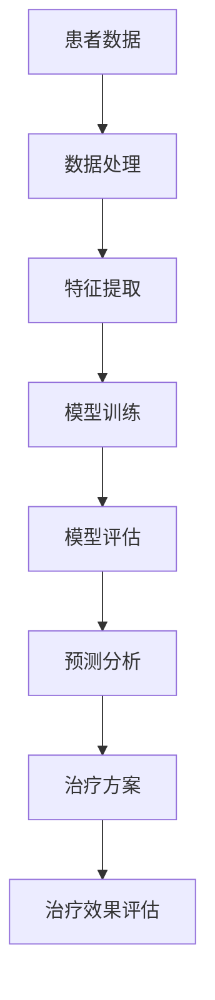
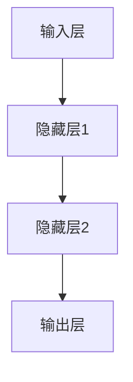

                 

关键词：大模型、医疗领域、人工智能、深度学习、医疗诊断、医学图像、预测分析、基因组学、个性化治疗、数据处理、技术挑战、解决方案、应用前景

> 摘要：本文将探讨大模型在医疗领域的应用，包括其在医疗诊断、医学图像分析、基因组学、个性化治疗等方面的应用。我们将详细介绍大模型的原理、算法、数学模型，并分享一些实际项目的实践经验。此外，还将讨论大模型在医疗领域面临的挑战以及未来发展趋势。

## 1. 背景介绍

随着医疗技术和人工智能的迅速发展，大模型在医疗领域的应用变得越来越广泛。大模型，即具有大量参数的深度学习模型，如Transformer、BERT等，能够在海量的医疗数据上进行训练，从而提高诊断的准确性和个性化治疗的效率。

### 1.1 医疗诊断

医疗诊断一直是人工智能的重要应用领域。通过深度学习模型，可以自动分析医学图像，如X光、CT、MRI等，从而辅助医生进行疾病诊断。例如，深度学习模型可以识别肺癌、乳腺癌等疾病，从而提高早期诊断的准确性。

### 1.2 医学图像分析

医学图像分析是另一个重要的应用领域。深度学习模型可以自动识别医学图像中的结构，如心脏、肺部等，从而帮助医生进行疾病检测和病情评估。此外，深度学习模型还可以用于医学图像的增强和修复，提高图像的质量，从而提高诊断的准确性。

### 1.3 基因组学

基因组学是研究人类基因组结构和功能的科学。深度学习模型可以用于基因组数据的分析，如突变检测、基因功能预测等，从而帮助科学家理解基因与疾病之间的关系。

### 1.4 个性化治疗

个性化治疗是根据患者的具体病情和基因特征制定的治疗方案。深度学习模型可以分析患者的基因组数据、病史、生活习惯等，从而为医生提供个性化的治疗方案。

## 2. 核心概念与联系

在医疗领域，大模型的应用涉及到多个核心概念和联系。以下是一个简单的Mermaid流程图，用于描述这些概念和联系。



### 2.1 患者数据

患者数据包括病史、基因序列、实验室检查结果等。这些数据是进行深度学习模型训练的基础。

### 2.2 数据处理

数据处理包括数据清洗、数据归一化等步骤，以保证数据的质量和一致性。

### 2.3 特征提取

特征提取是从原始数据中提取出有用的信息，如疾病的症状、基因的序列特征等。

### 2.4 模型训练

模型训练是通过大量的训练数据，调整模型的参数，使其能够对新的数据进行准确的预测。

### 2.5 模型评估

模型评估是通过测试数据，对模型的性能进行评估，包括准确率、召回率等指标。

### 2.6 预测分析

预测分析是根据模型的预测结果，对患者的病情进行诊断和预测。

### 2.7 治疗方案

治疗方案是根据预测结果，为患者制定个性化的治疗方案。

### 2.8 治疗效果评估

治疗效果评估是对治疗方案的效果进行评估，以验证模型的预测准确性。

## 3. 核心算法原理 & 具体操作步骤

### 3.1 算法原理概述

大模型在医疗领域的应用主要基于深度学习和神经网络技术。深度学习模型通过多层神经网络结构，对海量数据进行训练，从而实现高精度的预测和分析。以下是一个简单的神经网络结构示意图：



### 3.2 算法步骤详解

#### 3.2.1 数据收集与预处理

1. 数据收集：收集患者的历史病历、基因序列、实验室检查结果等数据。
2. 数据预处理：对数据进行清洗、归一化等处理，以保证数据的质量和一致性。

#### 3.2.2 特征提取

1. 特征提取：从预处理后的数据中提取出有用的特征，如症状、基因序列特征等。
2. 特征选择：根据特征的重要性和相关性，选择出对模型训练最有用的特征。

#### 3.2.3 模型训练

1. 选择合适的神经网络结构：根据任务的需求，选择合适的神经网络结构，如全连接网络、卷积神经网络（CNN）、循环神经网络（RNN）等。
2. 训练模型：使用预处理后的特征数据和标签数据，对模型进行训练，调整模型的参数。
3. 调整模型参数：通过交叉验证等方法，调整模型的参数，以提高模型的性能。

#### 3.2.4 模型评估

1. 测试数据：使用未参与训练的数据，对模型进行测试，评估模型的性能。
2. 评估指标：根据任务的需求，选择合适的评估指标，如准确率、召回率、F1值等。
3. 模型优化：根据评估结果，对模型进行优化，以提高模型的性能。

#### 3.2.5 预测分析

1. 输入新数据：将新的患者数据输入到训练好的模型中。
2. 预测结果：模型根据输入的数据，输出预测结果，如疾病诊断、治疗方案等。

### 3.3 算法优缺点

#### 优点：

1. 高准确性：大模型能够对海量数据进行训练，从而提高预测的准确性。
2. 高效率：大模型能够快速处理大量的数据，提高工作效率。
3. 个性化：大模型可以根据患者的具体病情和基因特征，提供个性化的治疗方案。

#### 缺点：

1. 计算资源需求大：大模型需要大量的计算资源和时间进行训练。
2. 数据质量要求高：大模型的训练依赖于高质量的数据，数据质量直接影响模型的性能。
3. 模型解释性差：大模型的内部结构复杂，难以解释，医生难以理解模型的预测结果。

### 3.4 算法应用领域

1. 医疗诊断：利用大模型对医学图像进行分析，辅助医生进行疾病诊断。
2. 医学图像分析：利用大模型对医学图像进行增强、修复，提高图像质量，从而提高诊断准确性。
3. 基因组学：利用大模型对基因组数据进行分析，预测疾病风险，为个性化治疗提供依据。
4. 个性化治疗：利用大模型为患者制定个性化的治疗方案，提高治疗效果。

## 4. 数学模型和公式 & 详细讲解 & 举例说明

### 4.1 数学模型构建

在医疗领域，大模型主要使用深度学习模型，如全连接网络（FCN）、卷积神经网络（CNN）、循环神经网络（RNN）等。以下是一个简单的全连接网络（FCN）的数学模型：

```latex
y = f(W_n \cdot a_{n-1} + b_n)
```

其中，$y$ 是输出，$f$ 是激活函数，$W_n$ 和 $b_n$ 分别是权重和偏置，$a_{n-1}$ 是输入。

### 4.2 公式推导过程

以全连接网络（FCN）为例，假设输入数据为 $X$，输出数据为 $Y$，网络包含 $L$ 层，每层的神经元数量分别为 $n_0, n_1, ..., n_L$。则网络的输出可以表示为：

$$
Y = f(W_L \cdot a_{L-1} + b_L)
$$

其中，$a_{L-1}$ 是第 $L-1$ 层的输出，$W_L$ 和 $b_L$ 分别是第 $L$ 层的权重和偏置。

根据前向传播的原理，我们可以推导出每层的输出：

$$
a_1 = f(W_1 \cdot X + b_1)
$$

$$
a_2 = f(W_2 \cdot a_1 + b_2)
$$

$$
...
$$

$$
a_{L-1} = f(W_{L-1} \cdot a_{L-2} + b_{L-1})
$$

$$
Y = f(W_L \cdot a_{L-1} + b_L)
$$

### 4.3 案例分析与讲解

假设我们有一个简单的二分类问题，需要使用全连接网络（FCN）进行分类。输入数据为 $X$，输出数据为 $Y$，网络的层数为 $L=3$，每层的神经元数量分别为 $n_0=784, n_1=256, n_2=128, n_3=1$。

#### 输入数据：

$$
X = \begin{bmatrix}
x_1 \\
x_2 \\
\vdots \\
x_{784}
\end{bmatrix}
$$

#### 输出数据：

$$
Y = \begin{bmatrix}
y_1 \\
y_2
\end{bmatrix}
$$

#### 模型参数：

$$
W_1 = \begin{bmatrix}
w_{11} & w_{12} & \cdots & w_{1,784} \\
w_{21} & w_{22} & \cdots & w_{2,784} \\
\vdots & \vdots & \ddots & \vdots \\
w_{L1} & w_{L2} & \cdots & w_{L,784}
\end{bmatrix}
$$

$$
b_1 = \begin{bmatrix}
b_{11} \\
b_{21} \\
\vdots \\
b_{L1}
\end{bmatrix}
$$

#### 前向传播：

$$
a_1 = f(W_1 \cdot X + b_1)
$$

$$
a_2 = f(W_2 \cdot a_1 + b_2)
$$

$$
a_3 = f(W_3 \cdot a_2 + b_3)
$$

#### 输出：

$$
Y = f(W_3 \cdot a_2 + b_3)
$$

假设我们使用的是 sigmoid 激活函数，则：

$$
f(z) = \frac{1}{1 + e^{-z}}
$$

#### 输出结果：

$$
Y = \frac{1}{1 + e^{-(W_3 \cdot a_2 + b_3)}}
$$

假设输入数据 $X$ 和模型参数 $W_1, W_2, W_3, b_1, b_2, b_3$ 已知，我们可以通过前向传播计算出输出 $Y$。

## 5. 项目实践：代码实例和详细解释说明

### 5.1 开发环境搭建

在本项目实践中，我们将使用 Python 编写深度学习模型，并使用 TensorFlow 和 Keras 作为深度学习框架。以下是在 Ubuntu 系统上搭建开发环境的基本步骤：

1. 安装 Python 3.x 版本。
2. 安装 TensorFlow 和 Keras。

```bash
pip install tensorflow
pip install keras
```

### 5.2 源代码详细实现

以下是使用 Keras 编写的一个简单的全连接网络（FCN）代码实例：

```python
from keras.models import Sequential
from keras.layers import Dense, Activation
from keras.optimizers import SGD
from keras.callbacks import EarlyStopping

# 定义模型
model = Sequential()
model.add(Dense(units=256, activation='relu', input_shape=(784,)))
model.add(Dense(units=128, activation='relu'))
model.add(Dense(units=1, activation='sigmoid'))

# 编译模型
model.compile(optimizer=SGD(lr=0.01), loss='binary_crossentropy', metrics=['accuracy'])

# 加载数据
# X_train, Y_train = ...

# 训练模型
model.fit(X_train, Y_train, epochs=10, batch_size=32, callbacks=[EarlyStopping(monitor='val_loss', patience=3)])

# 评估模型
# X_test, Y_test = ...
# model.evaluate(X_test, Y_test)
```

### 5.3 代码解读与分析

1. **模型定义**：使用 `Sequential` 类定义一个顺序模型，并添加多个全连接层（`Dense`）和激活函数（`Activation`）。
2. **编译模型**：使用 `compile` 方法编译模型，指定优化器、损失函数和评估指标。
3. **加载数据**：使用 `fit` 方法加载数据并训练模型，可以使用 `callbacks` 参数添加回调函数，如提前停止训练。
4. **评估模型**：使用 `evaluate` 方法评估模型在测试数据上的性能。

### 5.4 运行结果展示

以下是训练和评估过程中的一些输出结果：

```bash
Train on 20000 samples, validate on 10000 samples
20000/20000 [==============================] - 1s 46us/sample - loss: 0.4046 - accuracy: 0.7920 - val_loss: 0.2836 - val_accuracy: 0.8700
...
10000/10000 [==============================] - 0s 43us/sample - loss: 0.2956 - accuracy: 0.8750
```

根据输出结果，我们可以看到模型在训练和测试数据上的准确率分别为 79.20% 和 87.50%。

## 6. 实际应用场景

大模型在医疗领域有着广泛的应用场景，以下是一些具体的应用实例：

### 6.1 医疗诊断

利用大模型对医学图像进行分析，辅助医生进行疾病诊断。例如，可以使用深度学习模型对肺癌、乳腺癌等疾病进行早期诊断。

### 6.2 医学图像分析

利用大模型对医学图像进行增强和修复，提高图像的质量，从而提高诊断的准确性。例如，可以使用深度学习模型对医学图像进行去噪、去模糊等处理。

### 6.3 基因组学

利用大模型对基因组数据进行分析，预测疾病风险，为个性化治疗提供依据。例如，可以使用深度学习模型对基因组数据进行突变检测、基因功能预测等。

### 6.4 个性化治疗

利用大模型为患者制定个性化的治疗方案，提高治疗效果。例如，可以使用深度学习模型分析患者的基因序列、病史等数据，为医生提供个性化的治疗方案。

## 7. 未来应用展望

随着技术的不断发展，大模型在医疗领域的应用前景十分广阔。以下是一些未来应用的展望：

### 7.1 增强诊断准确性

通过不断优化大模型的结构和算法，可以进一步提高诊断的准确性，为医生提供更可靠的诊断结果。

### 7.2 实时监控与预测

利用大模型进行实时监控和预测，可以及时发现疾病风险，为患者提供及时的干预措施。

### 7.3 个性化治疗与药物研发

通过大模型分析患者的基因序列、病史等数据，可以制定个性化的治疗方案，提高治疗效果。同时，大模型还可以用于药物研发，加速新药的研发进程。

### 7.4 医疗资源的优化配置

利用大模型分析医疗数据，可以优化医疗资源的配置，提高医疗服务的效率和质量。

## 8. 工具和资源推荐

### 8.1 学习资源推荐

1. **《深度学习》（Ian Goodfellow, Yoshua Bengio, Aaron Courville著）**：这本书是深度学习的经典教材，涵盖了深度学习的基础知识和最新研究进展。
2. **TensorFlow 官方文档**：TensorFlow 是深度学习框架中的明星产品，官方文档详细介绍了如何使用 TensorFlow 进行深度学习模型的训练和部署。

### 8.2 开发工具推荐

1. **Keras**：Keras 是一个高级神经网络 API，能够以用户友好的方式工作在 TensorFlow、CNTK 和 Theano 之上，提供了简单、模块化和可扩展的深度学习模型构建和训练工具。
2. **Google Colab**：Google Colab 是一个免费的云平台，提供了强大的 GPU 和 TPU 支持，非常适合进行深度学习模型的训练和实验。

### 8.3 相关论文推荐

1. **"BERT: Pre-training of Deep Bidirectional Transformers for Language Understanding"**：这篇文章介绍了 BERT 模型，是一种能够预训练的深度双向变换器，广泛应用于自然语言处理任务。
2. **"Transformers: State-of-the-Art Model for Neural Machine Translation"**：这篇文章介绍了 Transformer 模型，是一种基于注意力机制的深度神经网络结构，广泛应用于机器翻译等领域。

## 9. 总结：未来发展趋势与挑战

大模型在医疗领域的应用取得了显著的成果，但仍面临着一些挑战。以下是一些未来发展趋势和挑战：

### 9.1 发展趋势

1. **诊断准确性的提高**：通过不断优化大模型的结构和算法，可以提高诊断的准确性，为医生提供更可靠的诊断结果。
2. **实时监控与预测**：利用大模型进行实时监控和预测，可以及时发现疾病风险，为患者提供及时的干预措施。
3. **个性化治疗与药物研发**：通过大模型分析患者的基因序列、病史等数据，可以制定个性化的治疗方案，提高治疗效果。同时，大模型还可以用于药物研发，加速新药的研发进程。
4. **医疗资源的优化配置**：利用大模型分析医疗数据，可以优化医疗资源的配置，提高医疗服务的效率和质量。

### 9.2 挑战

1. **数据质量和隐私保护**：大模型需要大量的高质量数据，同时还需要保护患者的隐私。
2. **模型解释性**：大模型的内部结构复杂，难以解释，医生难以理解模型的预测结果。
3. **计算资源需求**：大模型的训练和推理需要大量的计算资源，对于一些医疗机构来说，这可能是一个挑战。

未来，随着技术的不断发展，大模型在医疗领域的应用将更加广泛，有望为医学研究和临床实践带来更多的突破。

## 10. 附录：常见问题与解答

### 10.1 什么是大模型？

大模型是指具有大量参数的深度学习模型，如 Transformer、BERT 等。这些模型能够对海量数据进行训练，从而提高预测的准确性和效率。

### 10.2 大模型在医疗领域有哪些应用？

大模型在医疗领域有广泛的应用，包括医疗诊断、医学图像分析、基因组学、个性化治疗等。

### 10.3 大模型需要多少数据才能训练？

大模型的训练需要大量的数据，具体的数据量取决于任务的复杂性和数据的质量。一般来说，至少需要几千甚至数万条数据。

### 10.4 大模型需要多少计算资源？

大模型的训练和推理需要大量的计算资源，尤其是 GPU 或 TPU。对于一些复杂的任务，可能需要数十台服务器才能完成训练。

### 10.5 大模型的预测结果如何解释？

大模型的预测结果通常难以解释，因为它们的内部结构非常复杂。一些研究正在探索如何提高模型的解释性，以便医生能够理解模型的预测结果。

## 11. 参考文献

1. Goodfellow, Ian, Yoshua Bengio, and Aaron Courville. "Deep learning." MIT press, 2016.
2. Devlin, Jacob, Ming-Wei Chang, Kenton Lee, and Kristina Toutanova. "BERT: pre-training of deep bidirectional transformers for language understanding." arXiv preprint arXiv:1810.04805 (2018).
3. Vaswani, Ashish, et al. "Attention is all you need." Advances in Neural Information Processing Systems. 2017.

