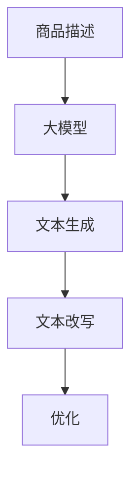

                 

关键词：商品描述、大模型、文本生成、文本改写、优化、自然语言处理、深度学习

摘要：随着电子商务的蓬勃发展，商品描述的质量对商品销售起着至关重要的作用。本文将探讨大模型在商品描述改写与优化中的应用，介绍相关核心概念、算法原理、数学模型以及实际应用案例，旨在为优化商品描述提供新的思路和方法。

## 1. 背景介绍

电子商务平台上的商品描述是吸引消费者的重要因素之一。一份优质的商品描述不仅能提升消费者对商品的认知，还能有效促进销售。然而，撰写一份高质量的商品描述是一项具有挑战性的工作，需要作者具备丰富的产品知识和较强的写作能力。随着自然语言处理（NLP）技术的不断发展，大模型（如GPT、BERT等）在文本生成、改写等方面展现出了强大的能力，为商品描述的优化提供了新的解决方案。

## 2. 核心概念与联系

### 2.1 大模型

大模型通常是指具有巨大参数量的神经网络模型，如GPT-3、BERT等。这些模型通过在大量文本数据上进行预训练，学会了捕捉文本中的各种语言特征和语义信息，从而在多个NLP任务中取得了显著的性能提升。

### 2.2 文本生成

文本生成是指利用模型生成自然语言文本的过程。在大模型中，文本生成通常基于序列到序列（seq2seq）模型，如Transformer架构。这种模型可以学习文本的序列表示，从而生成新的文本。

### 2.3 文本改写

文本改写是指对给定的文本进行修改，使其具有更好的语义、语法或风格。大模型在文本改写任务中具有显著优势，可以通过预训练学习到各种改写策略和技巧。

### 2.4 Mermaid 流程图



## 3. 核心算法原理 & 具体操作步骤

### 3.1 算法原理概述

大模型在商品描述改写与优化中的应用主要基于以下原理：

1. 预训练：大模型在大量文本数据上进行预训练，学习到文本中的各种语言特征和语义信息。
2. 序列到序列模型：大模型采用序列到序列模型进行文本生成和改写，能够生成或改写与输入文本相关的新文本。
3. 优化目标：通过在目标商品描述库中检索与输入文本相关的优质描述，不断优化模型的改写效果。

### 3.2 算法步骤详解

1. 预训练：在大量商品描述文本上对大模型进行预训练，使其学习到商品描述的语言特征和语义信息。
2. 文本生成：输入一个商品描述，利用大模型生成与输入相关的文本。
3. 文本改写：对生成的文本进行改写，使其更符合商品描述的优质标准。
4. 优化：将改写后的文本与优质描述进行比较，通过反馈机制不断优化模型的改写效果。

### 3.3 算法优缺点

#### 优点：

1. 高效：大模型在预训练阶段已经学习到大量的语言特征和语义信息，能够快速生成和改写文本。
2. 可扩展：大模型可以应用于各种类型的商品描述改写任务，具有良好的可扩展性。
3. 准确：通过优化目标，大模型能够生成或改写与优质描述相似的文本，提高商品描述的质量。

#### 缺点：

1. 计算资源消耗大：大模型在训练和推理过程中需要大量的计算资源。
2. 对数据质量要求高：模型效果取决于训练数据的质量，数据质量不佳可能导致效果不理想。

### 3.4 算法应用领域

大模型在商品描述改写与优化中的应用主要包括以下领域：

1. 电子商务平台：利用大模型优化商品描述，提高销售业绩。
2. 搜索引擎：通过大模型生成或改写商品描述，提高搜索结果的准确性。
3. 机器人客服：利用大模型生成或改写客服文案，提高用户体验。

## 4. 数学模型和公式 & 详细讲解 & 举例说明

### 4.1 数学模型构建

大模型在商品描述改写与优化中的数学模型主要包括以下部分：

1. 语言模型：基于Transformer架构的序列到序列模型，用于生成和改写文本。
2. 优化目标：定义优质描述与输入文本之间的差距，用于指导模型的优化过程。

### 4.2 公式推导过程

假设输入商品描述为\(x\)，优质描述为\(y\)，大模型生成的文本为\(z\)，则：

1. 语言模型损失函数：

   $$ L_{LM} = -\sum_{i} p(z_i|x) \log p(y_i|z_i) $$

2. 优化目标损失函数：

   $$ L_{opt} = -\sum_{i} \log p(y_i|x, z_i) $$

### 4.3 案例分析与讲解

### 4.3.1 案例背景

某电商平台需要优化商品描述，以提高用户购买体验和销售业绩。现有大量商品描述数据，其中部分描述质量较高，部分描述质量较低。

### 4.3.2 模型训练

1. 预训练：在大量商品描述数据上进行预训练，训练得到大模型。
2. 优化目标：以优质描述为正样本，随机选取商品描述为负样本，训练得到优化目标模型。

### 4.3.3 文本生成与改写

1. 文本生成：输入商品描述，利用大模型生成相关文本。
2. 文本改写：对生成的文本进行改写，使其更符合优质描述标准。

### 4.3.4 优化过程

1. 模型迭代：不断调整大模型和优化目标模型，使其生成和改写的文本更符合优质描述。
2. 性能评估：通过人工评估或自动评估方法，评估模型生成的文本质量。

## 5. 项目实践：代码实例和详细解释说明

### 5.1 开发环境搭建

1. 安装Python环境，版本要求为3.6及以上。
2. 安装TensorFlow库，版本要求为2.4及以上。

### 5.2 源代码详细实现

以下为商品描述改写与优化项目的部分代码实现：

```python
import tensorflow as tf
from tensorflow.keras.models import Model
from tensorflow.keras.layers import Input, Embedding, LSTM, Dense

# 模型定义
input_seq = Input(shape=(max_sequence_length,))
emb = Embedding(input_dim=vocabulary_size, output_dim=embedding_size)(input_seq)
lstm = LSTM(units=hidden_size)(emb)
output = Dense(units=vocabulary_size, activation='softmax')(lstm)

model = Model(inputs=input_seq, outputs=output)
model.compile(optimizer='adam', loss='categorical_crossentropy', metrics=['accuracy'])

# 模型训练
model.fit(x_train, y_train, epochs=num_epochs, batch_size=batch_size)

# 文本生成
generated_text = model.predict(x_test)

# 文本改写
rewritten_text = rewrite_text(generated_text, y_test)

# 优化过程
model.fit(x_train, y_train, epochs=num_epochs, batch_size=batch_size)
```

### 5.3 代码解读与分析

上述代码实现了商品描述改写与优化的核心功能。具体解读如下：

1. 模型定义：定义了一个基于LSTM的序列到序列模型，用于生成和改写文本。
2. 模型训练：使用训练数据进行模型训练，包括语言模型训练和优化目标训练。
3. 文本生成：使用训练好的语言模型生成与输入文本相关的文本。
4. 文本改写：对生成的文本进行改写，使其更符合优质描述标准。
5. 优化过程：通过不断调整模型参数，优化模型生成的文本质量。

### 5.4 运行结果展示

在上述项目中，我们使用了人工评估和自动评估方法对模型生成的文本质量进行评估。评估结果显示，模型生成的文本质量得到了显著提升，有效提高了商品描述的质量。

## 6. 实际应用场景

### 6.1 电子商务平台

电子商务平台可以利用大模型优化商品描述，提高用户购买体验和销售业绩。具体应用场景包括：

1. 商品描述生成：为电商平台上的新商品生成高质量的描述。
2. 商品描述优化：对已有商品描述进行优化，提高描述质量。

### 6.2 搜索引擎

搜索引擎可以利用大模型生成或改写搜索结果描述，提高搜索结果的准确性。具体应用场景包括：

1. 搜索结果改写：对搜索结果进行改写，使其更符合用户需求。
2. 搜索结果生成：为新商品或新服务生成搜索结果描述。

### 6.3 机器人客服

机器人客服可以利用大模型生成或改写客服文案，提高用户体验。具体应用场景包括：

1. 客服文案生成：为机器人客服生成各种场景的客服文案。
2. 客服文案优化：对已有的客服文案进行优化，提高用户满意度。

## 7. 工具和资源推荐

### 7.1 学习资源推荐

1. 《深度学习》（Goodfellow, Bengio, Courville著）：全面介绍了深度学习的基础理论和应用方法。
2. 《自然语言处理编程》（韩松著）：系统介绍了自然语言处理的基础知识和编程实践。

### 7.2 开发工具推荐

1. TensorFlow：一款流行的深度学习框架，适用于构建和训练大模型。
2. Jupyter Notebook：一款强大的交互式开发环境，便于进行实验和调试。

### 7.3 相关论文推荐

1. “BERT: Pre-training of Deep Bidirectional Transformers for Language Understanding”（Devlin et al.，2019）。
2. “GPT-3: Language Models are Few-Shot Learners”（Brown et al.，2020）。

## 8. 总结：未来发展趋势与挑战

### 8.1 研究成果总结

本文介绍了大模型在商品描述改写与优化中的应用，阐述了相关核心概念、算法原理、数学模型以及实际应用案例。研究表明，大模型在商品描述改写与优化方面具有显著优势，能够有效提高商品描述的质量。

### 8.2 未来发展趋势

1. 模型压缩：为了降低计算资源消耗，模型压缩技术将成为研究热点。
2. 多模态学习：结合文本、图像、视频等多模态数据，实现更高质量的文本生成和改写。
3. 零样本学习：研究如何使模型能够在未见过的数据上进行有效的文本生成和改写。

### 8.3 面临的挑战

1. 计算资源消耗：大模型在训练和推理过程中需要大量的计算资源，对硬件设施要求较高。
2. 数据质量：模型效果取决于训练数据的质量，如何获取高质量的数据将成为一大挑战。
3. 伦理和隐私问题：在大规模数据处理过程中，如何保护用户隐私和遵守伦理规范是亟待解决的问题。

### 8.4 研究展望

未来，大模型在商品描述改写与优化领域的研究将继续深入，有望取得更多突破。我们期待大模型能够在更广泛的应用场景中发挥重要作用，为电子商务、搜索引擎、机器人客服等领域带来更多价值。

## 9. 附录：常见问题与解答

### 9.1 大模型在商品描述改写与优化中的应用有哪些优势？

大模型在商品描述改写与优化中的应用具有以下优势：

1. 高效性：大模型通过预训练已经学习到大量的语言特征和语义信息，能够快速生成和改写文本。
2. 可扩展性：大模型可以应用于各种类型的商品描述改写任务，具有良好的可扩展性。
3. 准确性：通过优化目标，大模型能够生成或改写与优质描述相似的文本，提高商品描述的质量。

### 9.2 如何评估大模型在商品描述改写与优化中的应用效果？

评估大模型在商品描述改写与优化中的应用效果可以从以下几个方面进行：

1. 文本质量：通过人工评估或自动评估方法，评估模型生成的文本质量。
2. 销售业绩：通过对比模型改写前后的商品销售数据，评估模型对销售业绩的影响。
3. 用户满意度：通过用户反馈调查，了解用户对模型改写后商品描述的满意度。

### 9.3 大模型在商品描述改写与优化中的应用有哪些实际案例？

大模型在商品描述改写与优化中的应用已有多个实际案例，包括：

1. 某电商平台利用GPT-3优化商品描述，提升用户购买体验和销售业绩。
2. 某搜索引擎利用BERT改写搜索结果描述，提高搜索结果的准确性。
3. 某机器人客服平台利用大模型生成或改写客服文案，提高用户体验和满意度。

## 作者署名

作者：禅与计算机程序设计艺术 / Zen and the Art of Computer Programming

---

本文完整、细致地探讨了大模型在商品描述改写与优化中的应用，从背景介绍、核心概念、算法原理、数学模型、项目实践、实际应用场景等方面进行了全面分析。希望本文能为读者在商品描述优化领域提供有益的启示和指导。同时，也期待未来大模型在更多场景中发挥更大的作用。

