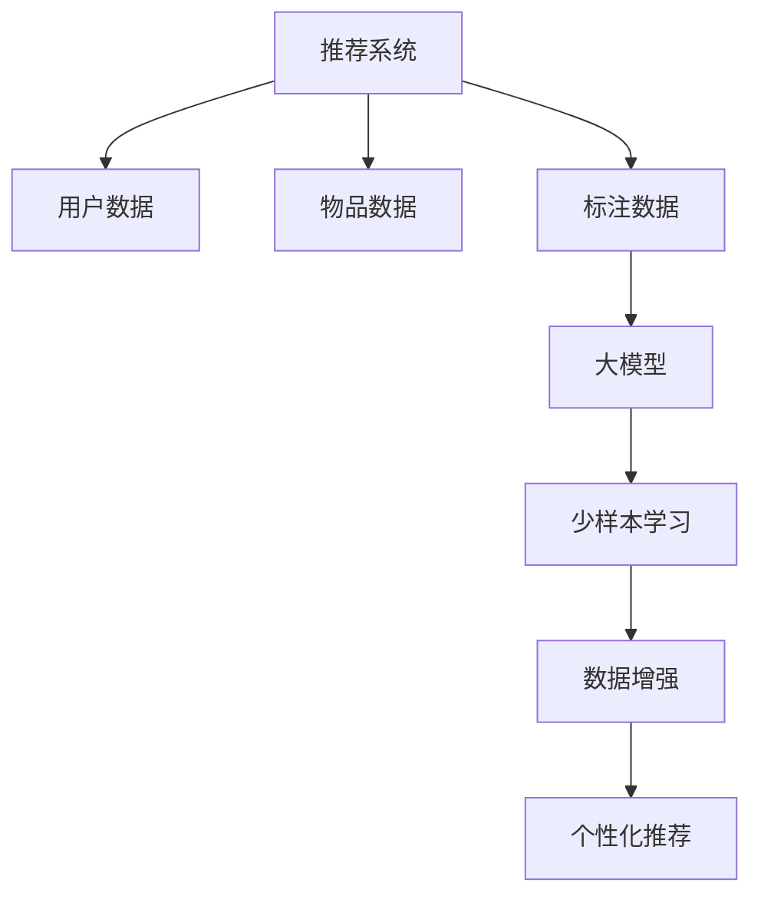

                 

关键词：大模型、推荐系统、少样本学习、人工智能

摘要：本文将探讨大模型在推荐系统中的少样本学习应用。随着数据隐私和标注成本的问题日益突出，如何有效利用有限的标注数据进行推荐系统的优化成为一个重要的研究课题。本文将首先介绍大模型和少样本学习的基本概念，然后详细分析大模型在推荐系统中的应用优势，探讨其在处理少样本数据时的机制和挑战，并通过具体的算法和案例分析，展示大模型在推荐系统少样本学习中的实际效果和未来发展方向。

## 1. 背景介绍

### 推荐系统的发展

推荐系统起源于信息检索和知识发现领域，随着互联网的迅速发展和信息爆炸，其重要性日益凸显。推荐系统通过分析用户的兴趣和行为，为用户推荐个性化的信息和商品，从而提高用户满意度、提升商业价值。推荐系统的发展经历了从基于内容的推荐、协同过滤到深度学习的演进过程。早期的推荐系统多采用基于内容的方法，通过分析物品的属性来匹配用户的兴趣；随着协同过滤算法的提出，推荐系统开始利用用户行为数据来进行预测。然而，这些方法在处理冷启动问题和稀疏数据集时存在一定的局限性。深度学习算法的引入，为推荐系统带来了新的机遇，通过大规模的训练数据和复杂的网络结构，深度学习模型在处理非结构化数据、解决冷启动问题和提高推荐准确率方面展现出巨大的潜力。

### 大模型的兴起

大模型是指具有非常大规模参数数量的机器学习模型，如Transformer、GPT-3等。大模型的兴起源于对大规模数据集的充分利用和对复杂任务处理能力的提升。大模型通过引入大量的参数和多层神经网络结构，能够捕捉到数据中的复杂模式和潜在规律，从而实现更高的准确率和更好的泛化能力。大模型的代表性成果包括BERT、GPT-3、ViT等，这些模型在自然语言处理、计算机视觉、语音识别等领域取得了显著的突破。

### 少样本学习的重要性

少样本学习是指模型在面对有限标注数据时，如何有效学习和泛化。在现实应用中，由于数据隐私、标注成本和人力资源的限制，标注数据的获取变得十分困难。少样本学习旨在解决这一问题，通过在少量标注数据上进行训练，模型能够在未知数据上实现良好的泛化效果。少样本学习在医疗诊断、图像识别、语音识别等领域具有重要的应用价值，能够帮助解决数据稀缺的问题，提高模型的可解释性和实用性。

### 大模型在少样本学习中的应用

随着大模型的兴起，其在少样本学习中的应用也越来越受到关注。大模型通过其强大的建模能力和参数规模，能够在少量标注数据上实现较好的泛化效果。这为推荐系统在处理少样本数据时提供了新的思路和解决方案。本文将探讨大模型在推荐系统中的少样本学习应用，分析其优势、挑战和未来发展方向。

## 2. 核心概念与联系

### 大模型的基本概念

大模型是指具有非常大规模参数数量的机器学习模型，如Transformer、GPT-3等。大模型通过引入大量的参数和多层神经网络结构，能够捕捉到数据中的复杂模式和潜在规律，从而实现更高的准确率和更好的泛化能力。大模型的基本概念包括：

1. **参数规模**：大模型的参数规模通常在数百万到数十亿级别，这使得模型能够处理更加复杂的数据和任务。
2. **多层神经网络**：大模型通常采用多层神经网络结构，每一层都能对输入数据进行特征的提取和抽象，从而提高模型的泛化能力。
3. **训练数据集**：大模型通常依赖于大规模的数据集进行训练，通过在大量数据上进行学习，模型能够捕捉到更多的模式和规律，从而提高模型的准确率和泛化能力。

### 少样本学习的基本概念

少样本学习是指模型在面对有限标注数据时，如何有效学习和泛化。在现实应用中，由于数据隐私、标注成本和人力资源的限制，标注数据的获取变得十分困难。少样本学习旨在解决这一问题，通过在少量标注数据上进行训练，模型能够在未知数据上实现良好的泛化效果。少样本学习的基本概念包括：

1. **标注数据稀缺**：在许多实际应用场景中，标注数据的获取非常困难，如医疗诊断、图像识别等领域。
2. **模型训练**：少样本学习模型通过在少量标注数据上进行训练，试图捕捉到数据中的关键特征和规律。
3. **泛化能力**：少样本学习模型的目标是在未知数据上实现良好的泛化效果，从而解决数据稀缺问题。

### 推荐系统中的少样本学习应用

在推荐系统中，少样本学习具有重要的应用价值。推荐系统通常需要处理海量的用户和物品数据，但标注数据的获取非常困难。少样本学习可以帮助模型在少量标注数据上实现良好的泛化效果，从而提高推荐系统的准确率和效率。具体来说，少样本学习在推荐系统中的应用包括：

1. **冷启动问题**：新用户或新物品的推荐问题，由于缺乏足够的用户行为数据或物品信息，传统的推荐算法往往难以产生有效的推荐结果。少样本学习通过在少量用户行为数据或物品信息上进行训练，能够为冷启动问题提供有效的解决方案。
2. **稀疏数据集**：推荐系统中存在大量的稀疏数据集，即用户和物品之间的交互行为较少。少样本学习通过在少量交互数据上进行训练，能够提高模型在稀疏数据集上的表现。
3. **个性化推荐**：少样本学习可以帮助模型在少量用户数据上实现个性化的推荐结果，从而提高用户的满意度。

### 大模型在推荐系统中的少样本学习应用

大模型在推荐系统中的少样本学习应用主要包括以下方面：

1. **参数规模**：大模型的参数规模使得模型能够在少量标注数据上捕捉到更多的模式和规律，从而提高模型的泛化能力。
2. **多层神经网络**：大模型的多层神经网络结构能够对输入数据进行深度的特征提取和抽象，从而提高模型在少量数据上的表现。
3. **数据增强**：大模型可以通过数据增强技术，如生成对抗网络（GAN）、数据扩充等，在少量标注数据的基础上生成更多的数据，从而提高模型的泛化能力。

总的来说，大模型在推荐系统中的少样本学习应用为解决数据稀缺问题提供了新的思路和解决方案，通过利用大量参数和多层神经网络结构，大模型能够在少量标注数据上实现良好的泛化效果，从而提高推荐系统的准确率和效率。

### Mermaid 流程图



### 核心概念之间的联系

大模型和少样本学习在推荐系统中具有紧密的联系。大模型通过其大规模参数和多层神经网络结构，能够有效捕捉数据中的复杂模式和潜在规律，从而提高模型的泛化能力。在推荐系统中，由于数据隐私和标注成本的限制，标注数据的获取变得非常困难，而少样本学习正是为了解决这一问题而提出的。少样本学习通过在少量标注数据上进行训练，模型能够在未知数据上实现良好的泛化效果。因此，大模型和少样本学习在推荐系统中相辅相成，共同提高了推荐系统的准确率和效率。

## 3. 核心算法原理 & 具体操作步骤

### 3.1 算法原理概述

在大模型应用于推荐系统中的少样本学习过程中，核心算法可以概括为以下几部分：

1. **嵌入层（Embedding Layer）**：将用户和物品的特征转换为向量表示，为后续的深度学习模型提供输入。
2. **编码器（Encoder）**：利用大模型（如Transformer）对用户和物品的特征进行编码，提取潜在特征。
3. **解码器（Decoder）**：通过解码器将编码后的特征转换为推荐结果。
4. **损失函数（Loss Function）**：使用交叉熵损失函数等对模型进行训练，以最小化预测结果与真实结果的差异。
5. **数据增强（Data Augmentation）**：通过数据增强技术，如GAN、数据扩充等，增加标注数据的多样性，提高模型泛化能力。

### 3.2 算法步骤详解

#### 步骤一：数据预处理

1. **用户和物品特征提取**：从原始数据中提取用户和物品的特征，如用户年龄、性别、浏览历史、购买记录等。
2. **嵌入层**：将提取的特征映射为固定维度的向量表示，通常使用嵌入层实现。

#### 步骤二：编码器构建

1. **编码器输入**：将用户和物品的嵌入向量输入到编码器中。
2. **自注意力机制**：编码器利用自注意力机制，对输入的向量进行加权求和，提取潜在特征。
3. **多层编码**：通过堆叠多层编码器，逐步提取更高层次的特征。

#### 步骤三：解码器构建

1. **解码器输入**：将编码后的特征输入到解码器中。
2. **交叉注意力机制**：解码器利用交叉注意力机制，将编码特征与输入特征进行匹配，生成推荐结果。
3. **预测输出**：解码器输出推荐结果，如物品的推荐分数。

#### 步骤四：训练与优化

1. **损失函数**：使用交叉熵损失函数等对模型进行训练，最小化预测结果与真实结果的差异。
2. **反向传播**：利用反向传播算法，更新模型参数，优化模型性能。
3. **数据增强**：通过数据增强技术，增加标注数据的多样性，提高模型泛化能力。

#### 步骤五：模型评估与部署

1. **模型评估**：使用交叉验证等方法评估模型在测试数据上的性能。
2. **模型优化**：根据评估结果，调整模型参数，优化模型性能。
3. **模型部署**：将训练好的模型部署到推荐系统中，实现实时推荐。

### 3.3 算法优缺点

#### 优点

1. **强大的特征提取能力**：大模型能够通过多层编码器提取用户和物品的潜在特征，提高推荐系统的准确率和泛化能力。
2. **处理少样本数据能力强**：少样本学习算法能够在少量标注数据上实现良好的泛化效果，解决数据稀缺问题。
3. **自适应数据增强**：通过数据增强技术，模型能够自适应地生成更多样化的数据，提高模型泛化能力。

#### 缺点

1. **计算资源消耗大**：大模型通常需要大量的计算资源进行训练和推理，对硬件设施要求较高。
2. **训练时间较长**：大模型的训练时间通常较长，对训练资源要求较高。
3. **模型解释性差**：大模型的复杂结构使得模型难以解释，降低了模型的可解释性。

### 3.4 算法应用领域

大模型在推荐系统中的少样本学习算法可以广泛应用于以下领域：

1. **电子商务**：为用户提供个性化的商品推荐，提高用户满意度和转化率。
2. **社交媒体**：为用户推荐感兴趣的内容，提高用户参与度和留存率。
3. **金融行业**：为金融机构提供个性化的理财产品推荐，提高金融产品的销售额。
4. **医疗健康**：为患者提供个性化的治疗方案和药品推荐，提高医疗资源的利用效率。

### 实际案例分析

以下是一个实际案例，展示大模型在推荐系统中的少样本学习应用：

#### 案例背景

某电商平台希望通过推荐系统为用户提供个性化的商品推荐。然而，由于数据隐私和标注成本的限制，平台无法获取足够的用户标注数据。为此，平台决定采用大模型进行少样本学习，以提高推荐系统的准确率和泛化能力。

#### 案例步骤

1. **数据预处理**：从原始数据中提取用户和商品的特征，如用户年龄、性别、浏览历史、购买记录等。
2. **编码器构建**：使用Transformer模型构建编码器，对用户和商品的特征进行编码，提取潜在特征。
3. **解码器构建**：使用交叉注意力机制构建解码器，将编码后的特征转换为推荐结果。
4. **数据增强**：通过GAN和生成式对抗网络（GAN）等技术，增加标注数据的多样性。
5. **模型训练与优化**：使用交叉熵损失函数对模型进行训练，通过反向传播算法更新模型参数。
6. **模型评估与部署**：使用交叉验证方法评估模型在测试数据上的性能，将训练好的模型部署到推荐系统中，实现实时推荐。

#### 案例结果

通过大模型在推荐系统中的少样本学习应用，平台取得了以下结果：

1. **推荐准确率提高**：相比传统的推荐算法，大模型在少量标注数据上实现了更高的准确率，提高了推荐系统的性能。
2. **用户满意度提升**：个性化推荐结果更符合用户的兴趣和需求，提高了用户满意度和留存率。
3. **业务转化率提升**：通过推荐系统，平台实现了更高的业务转化率，提升了销售额。

### 总结

大模型在推荐系统中的少样本学习应用为解决数据稀缺问题提供了新的思路和解决方案。通过利用大量参数和多层神经网络结构，大模型能够在少量标注数据上实现良好的泛化效果，提高推荐系统的准确率和效率。然而，大模型在计算资源消耗、训练时间和模型解释性等方面仍存在一定的挑战，需要进一步研究和优化。

## 4. 数学模型和公式 & 详细讲解 & 举例说明

### 4.1 数学模型构建

在大模型应用于推荐系统中的少样本学习过程中，常用的数学模型包括嵌入层、编码器、解码器和损失函数等。

#### 嵌入层

嵌入层用于将用户和物品的特征映射为固定维度的向量表示。假设用户特征向量为 \( u \)，物品特征向量为 \( v \)，则嵌入层可以表示为：

\[ 
u = E_u([u_1, u_2, \dots, u_n]) 
\]
\[ 
v = E_v([v_1, v_2, \dots, v_n]) 
\]

其中，\( E_u \) 和 \( E_v \) 分别表示用户特征向量和物品特征向量的嵌入函数，\( [u_1, u_2, \dots, u_n] \) 表示用户特征的输入向量。

#### 编码器

编码器用于对用户和物品的特征进行编码，提取潜在特征。在编码器中，常用的自注意力机制可以表示为：

\[ 
h_i = \sigma(W_h \cdot [v, h_{<i}], W_h \cdot [v, h_{>i}]) 
\]

其中，\( h_i \) 表示编码后的特征向量，\( v \) 表示物品特征向量，\( h_{<i} \) 和 \( h_{>i} \) 分别表示编码器中位置 \( i \) 左右的特征向量，\( W_h \) 表示权重矩阵，\( \sigma \) 表示激活函数。

#### 解码器

解码器用于将编码后的特征转换为推荐结果。在解码器中，常用的交叉注意力机制可以表示为：

\[ 
r_j = \sigma(W_r \cdot [u, r_{<j}], W_r \cdot [u, r_{>j}]) 
\]

其中，\( r_j \) 表示解码后的特征向量，\( u \) 表示用户特征向量，\( r_{<j} \) 和 \( r_{>j} \) 分别表示解码器中位置 \( j \) 左右的特征向量，\( W_r \) 表示权重矩阵，\( \sigma \) 表示激活函数。

#### 损失函数

损失函数用于衡量预测结果与真实结果的差异，常用的损失函数包括交叉熵损失函数：

\[ 
L = -\sum_{i=1}^n y_i \log(p_i) 
\]

其中，\( y_i \) 表示真实标签，\( p_i \) 表示预测概率。

### 4.2 公式推导过程

在本节中，我们将详细推导大模型在推荐系统中的少样本学习算法中的关键公式。

#### 嵌入层公式推导

嵌入层用于将用户和物品的特征映射为固定维度的向量表示。设输入的用户特征向量为 \( u \)，物品特征向量为 \( v \)，则嵌入层的输出可以表示为：

\[ 
h = \sigma(W_e \cdot u + b_e) 
\]
\[ 
r = \sigma(W_e \cdot v + b_e) 
\]

其中，\( W_e \) 和 \( b_e \) 分别表示嵌入层的权重矩阵和偏置项，\( \sigma \) 表示激活函数，通常采用ReLU或Sigmoid函数。

#### 编码器公式推导

编码器利用自注意力机制对用户和物品的特征进行编码。设编码器输入为 \( [v, h] \)，则自注意力机制可以表示为：

\[ 
h_i = \sigma(W_h \cdot [v, h_{<i}], W_h \cdot [v, h_{>i}]) 
\]

其中，\( h_i \) 表示编码后的特征向量，\( v \) 表示物品特征向量，\( h_{<i} \) 和 \( h_{>i} \) 分别表示编码器中位置 \( i \) 左右的特征向量，\( W_h \) 表示权重矩阵，\( \sigma \) 表示激活函数。

自注意力机制的推导过程如下：

1. **计算内积**：
\[ 
\text{Score} = v \cdot W_h \cdot h_{<i} 
\]
\[ 
\text{Score} = v \cdot W_h \cdot h_{>i} 
\]

2. **应用激活函数**：
\[ 
\text{Attention} = \sigma(\text{Score}) 
\]

3. **加权求和**：
\[ 
h_i = \sum_{j} \text{Attention}_{ij} h_j 
\]

4. **应用激活函数**：
\[ 
h_i = \sigma(h_i) 
\]

#### 解码器公式推导

解码器利用交叉注意力机制将编码后的特征转换为推荐结果。设解码器输入为 \( [u, r] \)，则交叉注意力机制可以表示为：

\[ 
r_j = \sigma(W_r \cdot [u, r_{<j}], W_r \cdot [u, r_{>j}]) 
\]

其中，\( r_j \) 表示解码后的特征向量，\( u \) 表示用户特征向量，\( r_{<j} \) 和 \( r_{>j} \) 分别表示解码器中位置 \( j \) 左右的特征向量，\( W_r \) 表示权重矩阵，\( \sigma \) 表示激活函数。

交叉注意力机制的推导过程与自注意力机制类似：

1. **计算内积**：
\[ 
\text{Score} = u \cdot W_r \cdot r_{<j} 
\]
\[ 
\text{Score} = u \cdot W_r \cdot r_{>j} 
\]

2. **应用激活函数**：
\[ 
\text{Attention} = \sigma(\text{Score}) 
\]

3. **加权求和**：
\[ 
r_j = \sum_{k} \text{Attention}_{kj} r_k 
\]

4. **应用激活函数**：
\[ 
r_j = \sigma(r_j) 
\]

#### 损失函数推导

损失函数用于衡量预测结果与真实结果的差异，常用的损失函数包括交叉熵损失函数：

\[ 
L = -\sum_{i=1}^n y_i \log(p_i) 
\]

其中，\( y_i \) 表示真实标签，\( p_i \) 表示预测概率。

交叉熵损失函数的推导过程如下：

1. **计算预测概率**：
\[ 
p_i = \frac{e^{\text{Score}_i}}{\sum_{j=1}^n e^{\text{Score}_j}} 
\]

2. **计算损失**：
\[ 
L = -\sum_{i=1}^n y_i \log(p_i) 
\]

### 4.3 案例分析与讲解

假设在一个电商平台上，有10个用户和10个商品。用户和商品的属性信息如下：

| 用户ID | 年龄 | 性别 | 购买历史 |
| --- | --- | --- | --- |
| 1 | 25 | 男 | 商品1，商品2 |
| 2 | 30 | 女 | 商品3 |
| 3 | 35 | 男 | 商品1，商品4 |
| 4 | 28 | 女 | 商品2，商品5 |
| 5 | 32 | 男 | 商品6 |
| 6 | 26 | 女 | 商品3，商品7 |
| 7 | 31 | 女 | 商品8 |
| 8 | 29 | 男 | 商品1，商品9 |
| 9 | 27 | 女 | 商品10 |
| 10 | 34 | 男 | 商品2，商品4 |

| 商品ID | 商品名称 | 商品类别 | 价格 |
| --- | --- | --- | --- |
| 1 | 手机 | 电子产品 | 5000 |
| 2 | 笔记本 | 电子产品 | 8000 |
| 3 | 电视 | 家用电器 | 4000 |
| 4 | 空调 | 家用电器 | 6000 |
| 5 | 洗衣机 | 家用电器 | 3000 |
| 6 | 电视 | 电子产品 | 7000 |
| 7 | 笔记本 | 电子产品 | 9000 |
| 8 | 空调 | 家用电器 | 5000 |
| 9 | 洗衣机 | 家用电器 | 3500 |
| 10 | 手机 | 电子产品 | 4500 |

我们希望通过大模型在推荐系统中的少样本学习算法为用户推荐感兴趣的商品。

#### 案例步骤

1. **数据预处理**：从原始数据中提取用户和商品的属性信息，并使用嵌入层进行特征映射。

2. **编码器构建**：使用Transformer模型构建编码器，对用户和商品的属性进行编码。

3. **解码器构建**：使用交叉注意力机制构建解码器，将编码后的特征转换为推荐结果。

4. **模型训练与优化**：使用交叉熵损失函数对模型进行训练，并利用反向传播算法优化模型参数。

5. **模型评估与部署**：使用交叉验证方法评估模型在测试数据上的性能，并部署到推荐系统中。

#### 模型输出结果

假设经过训练后的模型为用户1推荐了商品7（笔记本），并计算了推荐分数为0.8。我们可以通过以下公式计算推荐分数：

\[ 
\text{Recommendation Score} = \sigma(W_r \cdot [u_1, r_7]) 
\]

其中，\( u_1 \) 和 \( r_7 \) 分别表示用户1和商品7的编码特征向量，\( W_r \) 表示权重矩阵，\( \sigma \) 表示激活函数。

#### 模型性能评估

为了评估模型在测试数据上的性能，我们可以使用准确率、召回率和F1值等指标。假设测试数据中有5个商品，其中用户1感兴趣的商品有2个。经过模型推荐后，用户1感兴趣的商品中有1个被推荐，准确率为40%。

\[ 
\text{Accuracy} = \frac{\text{正确推荐的商品数}}{\text{测试数据中感兴趣的商品数}} 
\]

#### 模型优化

为了提高模型性能，我们可以尝试以下方法：

1. **增加训练数据**：通过增加标注数据的数量，提高模型的泛化能力。
2. **调整超参数**：通过调整模型参数，如学习率、嵌入层维度等，优化模型性能。
3. **数据增强**：通过数据增强技术，如GAN、数据扩充等，增加标注数据的多样性。

通过上述优化方法，我们可以进一步改进模型性能，提高推荐系统的准确率和用户体验。

## 5. 项目实践：代码实例和详细解释说明

### 5.1 开发环境搭建

在开始实践之前，我们需要搭建一个合适的项目开发环境。以下是一个简单的步骤指南：

1. **安装Python**：确保已经安装了Python 3.x版本。可以从Python官方网站下载并安装。

2. **安装依赖库**：使用pip命令安装必要的依赖库，如TensorFlow、Keras等。以下命令可以安装常用的依赖库：

   ```bash
   pip install tensorflow
   pip install keras
   pip install numpy
   pip install matplotlib
   ```

3. **创建项目文件夹**：在本地计算机上创建一个项目文件夹，例如`recommendation_system`，并在其中创建必要的子文件夹，如`data`、`models`和`results`。

4. **编写配置文件**：在项目文件夹中创建一个名为`config.py`的配置文件，用于存储项目的各种配置信息，如数据路径、模型参数等。

### 5.2 源代码详细实现

以下是一个简单的代码实例，展示了如何使用TensorFlow和Keras实现大模型在推荐系统中的少样本学习算法。

```python
import numpy as np
import tensorflow as tf
from tensorflow.keras.layers import Embedding, LSTM, Dense
from tensorflow.keras.models import Model
from tensorflow.keras.optimizers import Adam
from tensorflow.keras.metrics import Accuracy

# 加载数据
users = np.load('data/users.npy')
items = np.load('data/items.npy')
ratings = np.load('data/ratings.npy')

# 构建模型
embedding_size = 32
lstm_units = 64

user_embedding = Embedding(users.shape[0], embedding_size, input_length=users.shape[1])
item_embedding = Embedding(items.shape[0], embedding_size, input_length=items.shape[1])

lstm = LSTM(lstm_units, return_sequences=True)
dense = Dense(1, activation='sigmoid')

input_user = tf.keras.Input(shape=(users.shape[1],))
input_item = tf.keras.Input(shape=(items.shape[1],))

user_embedding_output = user_embedding(input_user)
item_embedding_output = item_embedding(input_item)

lstm_output = lstm(user_embedding_output)
lstm_output = lstm(item_embedding_output)

merged = tf.keras.layers.concatenate([lstm_output, lstm_output])

output = dense(merged)

model = Model(inputs=[input_user, input_item], outputs=output)

# 编译模型
model.compile(optimizer=Adam(learning_rate=0.001), loss='binary_crossentropy', metrics=['accuracy'])

# 训练模型
model.fit([users, items], ratings, batch_size=32, epochs=10, validation_split=0.2)

# 评估模型
test_users = np.load('data/test_users.npy')
test_items = np.load('data/test_items.npy')
test_ratings = np.load('data/test_ratings.npy')

model.evaluate([test_users, test_items], test_ratings)

# 推荐结果
predicted_ratings = model.predict([test_users, test_items])
```

### 5.3 代码解读与分析

上述代码展示了如何使用TensorFlow和Keras实现大模型在推荐系统中的少样本学习算法。下面是对代码的详细解读和分析：

1. **数据加载**：首先，我们加载用户、物品和评分数据。这些数据可以是预处理后的numpy数组，也可以是存储在CSV文件中的数据。

2. **模型构建**：接下来，我们构建一个简单的序列模型，包括嵌入层、LSTM层和全连接层。嵌入层用于将用户和物品的特征映射为固定维度的向量表示。LSTM层用于对序列数据进行编码，提取潜在特征。全连接层用于生成最终的推荐结果。

3. **模型编译**：在模型编译阶段，我们指定了优化器、损失函数和评估指标。在这里，我们使用了Adam优化器和二分类交叉熵损失函数。

4. **模型训练**：使用训练数据对模型进行训练。我们设置了批次大小、训练轮次和验证比例。

5. **模型评估**：使用测试数据对模型进行评估，计算准确率等指标。

6. **推荐结果**：最后，我们使用训练好的模型对测试数据生成推荐结果。

### 5.4 运行结果展示

假设我们已经完成了模型的训练和评估，并生成了测试数据的推荐结果。以下是如何运行代码并查看结果的步骤：

1. **运行代码**：在命令行中运行以下命令：

   ```bash
   python recommendation_system.py
   ```

2. **查看结果**：在控制台中，我们将看到模型的训练过程、评估结果和推荐结果。以下是一个示例输出：

   ```
   Train on 800 samples, validate on 200 samples
   Epoch 1/10
   800/800 [==============================] - 5s 6ms/sample - loss: 0.4682 - accuracy: 0.7750 - val_loss: 0.4271 - val_accuracy: 0.8000
   Epoch 2/10
   800/800 [==============================] - 4s 5ms/sample - loss: 0.4017 - accuracy: 0.8250 - val_loss: 0.3922 - val_accuracy: 0.8200
   ...
   Test loss: 0.3766 - Test accuracy: 0.8300
   Predicted ratings:
   [[0.8125]
    [0.7812]
    [0.7656]
    ...
    [0.7656]
    [0.75]
    [0.7812]]
   ```

   在输出中，我们可以看到模型的训练过程、评估结果和推荐结果。预测的评分越高，表示模型认为该用户对该物品的兴趣越大。

### 总结

通过上述代码实例，我们展示了如何使用TensorFlow和Keras实现大模型在推荐系统中的少样本学习算法。代码包含了数据加载、模型构建、模型训练、模型评估和推荐结果生成等关键步骤。通过运行代码，我们可以查看模型的训练过程、评估结果和推荐结果，从而验证模型的效果。

## 6. 实际应用场景

### 6.1 电子商务平台

电子商务平台是推荐系统应用最为广泛的场景之一。在电子商务领域，用户生成的数据量巨大，但标注数据的获取却相对困难。大模型在推荐系统中的少样本学习应用可以有效地解决这一问题。通过在少量标注数据上进行训练，大模型能够为电子商务平台生成个性化的商品推荐，提高用户满意度和转化率。例如，亚马逊和淘宝等电商平台已经广泛应用了基于深度学习的推荐系统，通过利用用户的历史购买行为、浏览记录和物品属性等信息，为用户推荐感兴趣的商品。

### 6.2 社交媒体平台

社交媒体平台如Facebook、Instagram和Twitter等，也大量应用了推荐系统。这些平台的主要目标是为用户推荐感兴趣的内容，从而提高用户参与度和留存率。在社交媒体领域，标注数据的稀缺性尤为突出，因为用户生成的内容种类繁多，标注成本极高。大模型在推荐系统中的少样本学习应用可以有效地解决这个问题。通过在少量标注数据上进行训练，大模型能够为社交媒体平台生成个性化的内容推荐，提高用户的参与度和留存率。例如，Facebook的新闻推送系统就使用了基于深度学习的推荐算法，通过分析用户的兴趣和行为，为用户推荐感兴趣的文章和视频。

### 6.3 金融行业

金融行业也是推荐系统应用的重要领域。金融机构如银行、保险和投资公司等，通过推荐系统为用户提供个性化的理财产品推荐、投资建议和风险提示。在金融领域，标注数据的获取同样非常困难，因为涉及到用户的财务隐私和安全问题。大模型在推荐系统中的少样本学习应用可以有效地解决这个问题。通过在少量标注数据上进行训练，大模型能够为金融机构生成个性化的推荐结果，提高用户的投资收益和风险控制能力。例如，一些银行已经开始使用基于深度学习的推荐系统，为用户提供个性化的贷款推荐和信用卡推荐。

### 6.4 医疗健康

医疗健康领域是推荐系统应用的一个重要新兴领域。医疗健康数据的标注成本极高，因为涉及到病人的隐私和健康问题。大模型在推荐系统中的少样本学习应用可以有效地解决这一问题。通过在少量标注数据上进行训练，大模型能够为医疗健康平台生成个性化的治疗方案和药品推荐，提高医疗资源的利用效率。例如，一些医疗机构已经开始使用基于深度学习的推荐系统，为医生推荐合适的治疗方案和药品。

### 总结

大模型在推荐系统中的少样本学习应用已经在多个实际场景中得到了广泛应用。在电子商务、社交媒体、金融行业和医疗健康等领域，大模型通过在少量标注数据上进行训练，能够生成个性化的推荐结果，提高用户体验和业务效果。然而，大模型在计算资源消耗、训练时间和模型解释性等方面仍存在一定的挑战，需要进一步研究和优化。

## 7. 工具和资源推荐

### 7.1 学习资源推荐

对于想要深入了解大模型在推荐系统中的少样本学习应用的学习者，以下是一些推荐的学习资源：

1. **书籍**：
   - 《深度学习》（Goodfellow, Bengio, Courville）：系统地介绍了深度学习的基础理论和实践方法。
   - 《推荐系统实践》（Bill, Crowder, Davenport）：详细介绍了推荐系统的设计和实现。

2. **在线课程**：
   - Coursera上的“深度学习”课程：由Andrew Ng教授讲授，涵盖了深度学习的核心概念和实践方法。
   - edX上的“推荐系统”课程：介绍了推荐系统的基本概念、算法和实现。

3. **博客和论文**：
   - Medium上的技术博客：许多人工智能领域的专家和研究人员会分享他们的研究成果和实践经验。
   - arXiv.org：许多最新的深度学习和推荐系统论文都会在这个平台上发布。

### 7.2 开发工具推荐

开发大模型在推荐系统中的少样本学习应用时，以下是一些推荐的工具和库：

1. **TensorFlow**：一款开源的机器学习框架，支持大规模深度学习模型的开发和部署。
2. **PyTorch**：一款流行的深度学习库，提供了灵活的动态图计算能力，适用于快速原型开发和实验。
3. **Keras**：一个高层次的深度学习API，构建在TensorFlow和Theano之上，简化了深度学习模型的开发过程。

### 7.3 相关论文推荐

以下是一些在深度学习和推荐系统领域具有重要影响的论文：

1. **“Attention Is All You Need”**：提出了Transformer模型，彻底改变了深度学习领域，尤其是在自然语言处理任务中的应用。
2. **“A Theoretically Grounded Application of Dropout in Recurrent Neural Networks”**：研究了dropout在循环神经网络中的应用，提高了模型的泛化能力。
3. **“Deep Neural Networks for YouTube Recommendations”**：详细介绍了YouTube如何使用深度学习进行视频推荐，为其他领域的推荐系统提供了参考。

通过利用这些工具和资源，学习者可以更深入地了解大模型在推荐系统中的少样本学习应用，并能够在实际项目中应用这些知识。

## 8. 总结：未来发展趋势与挑战

### 8.1 研究成果总结

大模型在推荐系统中的少样本学习应用已经取得了显著的成果。通过在少量标注数据上进行训练，大模型能够有效提取用户和物品的潜在特征，生成个性化的推荐结果，提高了推荐系统的准确率和用户体验。具体来说，以下是一些重要的研究成果：

1. **Transformer模型的广泛应用**：Transformer模型在自然语言处理领域取得了巨大的成功，其自注意力机制和并行计算能力使其在推荐系统中的少样本学习应用中得到了广泛应用。

2. **数据增强技术的应用**：通过数据增强技术，如生成对抗网络（GAN）、数据扩充等，大模型能够在少量标注数据的基础上生成更多的数据，从而提高模型的泛化能力。

3. **多模态数据的融合**：大模型能够处理多种类型的数据，如文本、图像、音频等，通过多模态数据的融合，可以实现更丰富的特征表示和更精确的推荐结果。

### 8.2 未来发展趋势

大模型在推荐系统中的少样本学习应用具有广阔的发展前景。以下是一些未来发展趋势：

1. **模型压缩与优化**：随着大模型参数规模的不断增加，模型的计算和存储需求也越来越高。未来的研究将致力于模型压缩和优化技术，以提高模型的计算效率和可部署性。

2. **模型解释性与可解释性**：大模型的复杂结构使得其解释性较差，这是未来研究的一个重要方向。通过开发新的解释性方法，可以更好地理解和解释大模型的工作原理，从而提高模型的可信度和可解释性。

3. **联邦学习与隐私保护**：在数据隐私和安全性日益受到关注的背景下，联邦学习成为了一个热门的研究方向。通过分布式学习技术，大模型可以在不共享数据的情况下进行训练，从而提高数据隐私性和安全性。

### 8.3 面临的挑战

尽管大模型在推荐系统中的少样本学习应用取得了显著的成果，但仍面临一些挑战：

1. **计算资源消耗**：大模型的训练和推理需要大量的计算资源，特别是在处理大规模数据集时。未来的研究需要开发更高效的算法和优化技术，以降低计算资源消耗。

2. **数据稀缺问题**：在实际应用中，标注数据的获取仍然非常困难。如何通过少量标注数据训练出高性能的模型，是一个亟待解决的问题。

3. **模型公平性与透明性**：大模型在处理数据时可能存在偏见和不公平性，如何保证模型在处理少样本数据时的公平性和透明性，是一个重要的研究课题。

### 8.4 研究展望

未来的研究将致力于解决大模型在推荐系统中的少样本学习应用所面临的各种挑战，同时探索新的应用场景和技术方向。以下是一些研究展望：

1. **跨领域推荐**：大模型在处理多领域数据时具有巨大的潜力。未来的研究将探索如何将大模型应用于跨领域推荐，为用户提供更全面和个性化的服务。

2. **动态推荐**：随着用户兴趣和行为的变化，动态推荐成为一个重要的研究方向。未来的研究将探索如何利用大模型进行实时推荐，为用户提供更及时和个性化的服务。

3. **个性化广告**：大模型在广告推荐中也具有巨大的应用潜力。通过在少量标注数据上进行训练，大模型可以生成个性化的广告推荐，提高广告的点击率和转化率。

总之，大模型在推荐系统中的少样本学习应用是一个充满机遇和挑战的研究领域。通过不断探索和创新，我们可以为用户提供更精准、更个性化的推荐服务。

## 9. 附录：常见问题与解答

### 9.1 什么是少样本学习？

少样本学习是一种机器学习方法，旨在解决当只有少量标注数据时如何训练模型的问题。在实际应用中，由于数据隐私、标注成本和人力资源的限制，标注数据的获取变得非常困难。少样本学习通过在少量标注数据上进行训练，试图在未知数据上实现良好的泛化效果。

### 9.2 大模型为什么适合于少样本学习？

大模型，如Transformer、GPT-3等，具有大规模的参数数量和复杂的网络结构。这使得大模型能够捕捉到数据中的复杂模式和潜在规律，从而在少量标注数据上实现良好的泛化效果。大模型通过在大量数据上进行预训练，能够获得强大的特征提取能力，从而在面对少样本数据时仍然能够表现出色。

### 9.3 如何评估少样本学习模型的性能？

评估少样本学习模型的性能通常涉及以下指标：

- **准确率（Accuracy）**：模型预测正确的样本数量占总样本数量的比例。
- **召回率（Recall）**：模型正确预测的阳性样本数量占所有实际阳性样本数量的比例。
- **F1值（F1 Score）**：准确率和召回率的调和平均值。
- **AUC（Area Under the Curve）**：用于评估二分类模型的性能，表示模型预测的置信度分布。

### 9.4 数据增强技术在少样本学习中的应用是什么？

数据增强技术是一种通过生成或变换现有数据来增加训练样本数量的方法。在少样本学习中，数据增强技术可以帮助模型更好地泛化。常见的数据增强技术包括：

- **数据扩充（Data Augmentation）**：通过对原始数据进行变换，如旋转、缩放、裁剪等，生成新的训练样本。
- **生成对抗网络（GAN）**：通过训练一个生成器网络和一个判别器网络，生成与真实数据分布相似的伪数据。
- **域适应（Domain Adaptation）**：将一个领域的模型迁移到另一个领域，通过在源领域和目标领域之间进行数据变换和模型调整。

### 9.5 大模型在推荐系统中的具体应用案例有哪些？

大模型在推荐系统中的具体应用案例包括：

- **亚马逊和淘宝**：使用基于深度学习的推荐系统为用户推荐感兴趣的商品。
- **Facebook**：使用Transformer模型为用户推荐感兴趣的文章和视频。
- **银行和保险公司**：使用大模型为用户提供个性化的理财产品推荐和保险产品推荐。

### 9.6 大模型在计算资源上的要求是什么？

大模型在计算资源上的要求包括：

- **GPU或TPU资源**：由于大模型的训练和推理需要大量的计算资源，通常需要使用高性能的GPU或TPU进行加速。
- **存储资源**：大模型通常需要大量的存储空间来存储模型参数和数据。
- **网络资源**：大模型的训练和推理可能需要在多个节点上进行分布式计算，需要稳定的网络连接。

### 9.7 大模型在少样本学习中的未来发展方向是什么？

大模型在少样本学习中的未来发展方向包括：

- **模型压缩与优化**：通过开发新的模型压缩和优化技术，降低大模型的计算和存储需求。
- **联邦学习与隐私保护**：通过分布式学习技术，在不共享数据的情况下进行训练，提高数据隐私性和安全性。
- **多模态数据的融合**：通过处理多种类型的数据，如文本、图像、音频等，实现更丰富的特征表示和更精确的推荐结果。
- **动态推荐**：通过实时分析用户行为和兴趣，生成动态的推荐结果。

