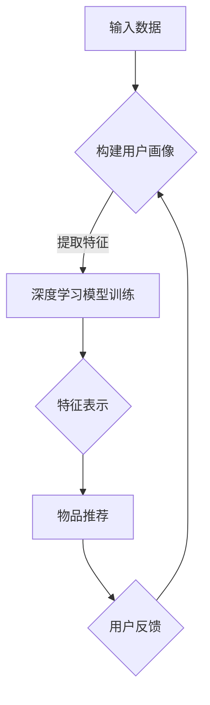
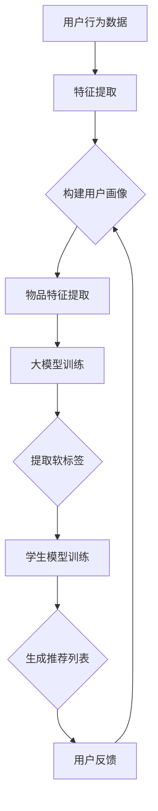
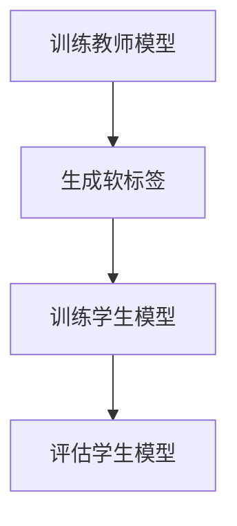

                 

关键词：大模型，推荐系统，知识蒸馏，算法原理，应用实践，数学模型，代码实例

> 摘要：本文深入探讨了在大模型时代，知识蒸馏技术在推荐系统中的应用。通过介绍知识蒸馏的核心概念、算法原理及具体实现步骤，结合实际案例，分析了知识蒸馏在推荐系统中的优势与挑战，并展望了其未来发展趋势。

## 1. 背景介绍

随着互联网和移动互联网的快速发展，推荐系统作为信息过滤和个性化服务的重要手段，已经被广泛应用于电商、新闻、社交媒体等多个领域。然而，传统推荐系统往往面临着数据稀疏、冷启动、低效等挑战。近年来，随着深度学习技术的兴起，大模型在推荐系统中的应用逐渐成为研究热点。大模型具有强大的表示和学习能力，能够处理大规模数据和复杂的关系网络，从而提高推荐系统的性能和效果。

知识蒸馏（Knowledge Distillation）作为一种有效的模型压缩和加速技术，通过将一个大模型的知识传递给一个小模型，从而实现小模型的性能提升。知识蒸馏技术在大模型训练过程中起到了关键作用，它不仅能够提高模型的泛化能力，还能够有效减少模型参数，降低计算资源的需求。因此，研究知识蒸馏技术在大模型推荐系统中的应用具有重要的理论价值和实际意义。

## 2. 核心概念与联系

### 2.1 知识蒸馏技术

知识蒸馏技术的基本思想是将一个大模型（通常称为教师模型Teacher Model）的知识传递给一个小模型（通常称为学生模型Student Model），使得小模型能够在大模型的基础上实现更好的性能。知识蒸馏过程可以分为以下几个步骤：

1. **教师模型训练**：首先，使用大规模数据集训练一个大模型，使其在目标任务上达到较高的性能。
2. **知识提取**：通过一定的方式（如软标签、梯度等）提取教师模型的内部知识。
3. **学生模型训练**：使用提取的知识训练学生模型，使得学生模型能够在教师模型的基础上提高性能。

### 2.2 推荐系统

推荐系统是一种基于用户历史行为和内容信息，为用户推荐相关商品、新闻、音乐等信息的系统。推荐系统通常包括以下几个关键组件：

1. **用户画像**：通过分析用户的性别、年龄、兴趣等特征，构建用户画像。
2. **物品特征**：提取物品的属性特征，如商品的价格、品牌、类型等。
3. **推荐算法**：根据用户画像和物品特征，通过一定的算法为用户推荐相关的物品。
4. **反馈机制**：根据用户的反馈调整推荐策略，提高推荐效果。

### 2.3 大模型与知识蒸馏在推荐系统中的应用

大模型在推荐系统中的应用主要包括两个方面：

1. **特征表示**：通过深度学习模型提取用户和物品的高维特征，提高特征表示能力。
2. **模型融合**：将多个模型的结果进行融合，提高推荐系统的整体性能。

知识蒸馏技术可以应用于推荐系统的以下场景：

1. **模型压缩**：使用知识蒸馏技术将大模型的知识传递给小模型，实现模型的压缩和加速。
2. **跨域迁移**：通过知识蒸馏技术，实现不同领域模型的知识共享和迁移，提高推荐系统的泛化能力。

### 2.4 Mermaid 流程图



## 3. 核心算法原理 & 具体操作步骤

### 3.1 算法原理概述

知识蒸馏技术的基本原理是将大模型（教师模型）的知识传递给小模型（学生模型），使得小模型能够复现教师模型的输出。具体来说，知识蒸馏可以分为以下三个步骤：

1. **软标签生成**：教师模型在训练过程中，除了输出硬标签（实际标签），还输出软标签（概率分布）。软标签包含了教师模型对样本的内在知识。
2. **知识提取**：通过分析教师模型的输出，提取软标签和梯度等内部知识。
3. **学生模型训练**：使用提取的知识训练学生模型，使得学生模型能够在教师模型的基础上提高性能。

### 3.2 算法步骤详解

1. **教师模型训练**：
   - 使用大规模数据集训练教师模型，达到较高的性能。
   - 输出软标签和梯度等内部知识。

2. **知识提取**：
   - 对教师模型的输出进行统计分析，生成软标签。
   - 提取教师模型的梯度信息，作为知识的一部分。

3. **学生模型训练**：
   - 使用提取的知识训练学生模型，包括软标签和梯度信息。
   - 优化学生模型的参数，使其能够复现教师模型的输出。

### 3.3 算法优缺点

**优点**：

1. **模型压缩**：通过知识蒸馏技术，可以大大减少模型的参数规模，降低计算资源的消耗。
2. **性能提升**：学生模型能够在教师模型的基础上提高性能，提高推荐系统的效果。
3. **跨域迁移**：知识蒸馏技术可以实现不同领域模型的知识共享和迁移，提高推荐系统的泛化能力。

**缺点**：

1. **计算成本**：知识蒸馏技术需要额外的计算资源进行软标签的生成和提取，增加了模型的训练成本。
2. **训练时间**：学生模型需要多次迭代训练，增加了模型的训练时间。

### 3.4 算法应用领域

知识蒸馏技术可以应用于以下领域：

1. **推荐系统**：通过知识蒸馏技术，实现大模型到小模型的模型压缩和性能提升。
2. **图像识别**：使用知识蒸馏技术，可以实现低资源设备上的高效图像识别。
3. **自然语言处理**：知识蒸馏技术可以用于跨语言模型的迁移学习，提高语言模型的效果。

## 4. 数学模型和公式 & 详细讲解 & 举例说明

### 4.1 数学模型构建

知识蒸馏技术的数学模型可以分为两部分：教师模型和学生模型的损失函数。

**教师模型损失函数**：

$$L_{Teacher} = -\frac{1}{N}\sum_{i=1}^{N} \sum_{j=1}^{C} y_{ij} \log(p_{ij})$$

其中，$N$ 是样本数量，$C$ 是类别数量，$y_{ij}$ 是真实标签，$p_{ij}$ 是教师模型对类别 $j$ 的预测概率。

**学生模型损失函数**：

$$L_{Student} = -\frac{1}{N}\sum_{i=1}^{N} \sum_{j=1}^{C} y_{ij} \log(q_{ij}) + \lambda \cdot D_{KL}(q_{\cdot|j} || p_{\cdot|j})$$

其中，$q_{ij}$ 是学生模型对类别 $j$ 的预测概率，$D_{KL}$ 是KL散度，$\lambda$ 是调节参数。

### 4.2 公式推导过程

知识蒸馏的推导过程主要包括以下几个步骤：

1. **教师模型预测**：
   - 教师模型在训练过程中，输出软标签 $p_{ij}$。

2. **学生模型预测**：
   - 学生模型在训练过程中，输出预测概率 $q_{ij}$。

3. **知识传递**：
   - 通过KL散度 $D_{KL}(q_{\cdot|j} || p_{\cdot|j})$，将教师模型的软标签传递给学生模型。

4. **损失函数**：
   - 结合硬标签损失和软标签损失，构建学生模型的损失函数。

### 4.3 案例分析与讲解

假设有一个二分类问题，教师模型和学生模型的预测结果如下：

| 样本编号 | 教师模型概率 | 学生模型概率 |
|--------|------------|------------|
| 1      | (0.8, 0.2) | (0.9, 0.1) |
| 2      | (0.1, 0.9) | (0.2, 0.8) |
| ...    | ...        | ...        |

根据上述数据，可以计算学生模型的损失函数：

$$L_{Student} = -\frac{1}{2}\sum_{i=1}^{2} \sum_{j=1}^{2} y_{ij} \log(q_{ij}) + \lambda \cdot D_{KL}(q_{\cdot|1} || p_{\cdot|1}) + \lambda \cdot D_{KL}(q_{\cdot|2} || p_{\cdot|2})$$

通过优化损失函数，可以使得学生模型逐渐逼近教师模型的输出，提高分类性能。

## 5. 项目实践：代码实例和详细解释说明

### 5.1 开发环境搭建

1. 安装Python环境（版本3.7及以上）。
2. 安装深度学习框架TensorFlow。
3. 下载并准备推荐系统数据集。

### 5.2 源代码详细实现

```python
import tensorflow as tf
from tensorflow.keras.models import Model
from tensorflow.keras.layers import Dense, Input

# 定义教师模型和学生模型
def build_teacher_model(input_shape):
    input_layer = Input(shape=input_shape)
    hidden_layer = Dense(128, activation='relu')(input_layer)
    output_layer = Dense(2, activation='softmax')(hidden_layer)
    teacher_model = Model(inputs=input_layer, outputs=output_layer)
    teacher_model.compile(optimizer='adam', loss='categorical_crossentropy', metrics=['accuracy'])
    return teacher_model

def build_student_model(input_shape):
    input_layer = Input(shape=input_shape)
    hidden_layer = Dense(64, activation='relu')(input_layer)
    output_layer = Dense(2, activation='softmax')(hidden_layer)
    student_model = Model(inputs=input_layer, outputs=output_layer)
    student_model.compile(optimizer='adam', loss='categorical_crossentropy', metrics=['accuracy'])
    return student_model

# 训练教师模型
teacher_model = build_teacher_model(input_shape=(10,))
teacher_model.fit(x_train, y_train, epochs=10, batch_size=32)

# 生成软标签
teacher_predictions = teacher_model.predict(x_val)

# 训练学生模型
student_model = build_student_model(input_shape=(10,))
student_model.fit(x_val, teacher_predictions, epochs=10, batch_size=32)
```

### 5.3 代码解读与分析

1. **模型定义**：使用TensorFlow框架定义教师模型和学生模型，包括输入层、隐藏层和输出层。
2. **模型编译**：编译模型，指定优化器、损失函数和评估指标。
3. **教师模型训练**：使用训练数据集训练教师模型，使其达到较高的性能。
4. **软标签生成**：使用教师模型对验证数据集进行预测，生成软标签。
5. **学生模型训练**：使用软标签训练学生模型，使其性能接近教师模型。

通过这个代码实例，我们可以看到知识蒸馏技术在推荐系统中的具体实现过程。

## 6. 实际应用场景

知识蒸馏技术在推荐系统中有多种实际应用场景：

1. **模型压缩与加速**：通过知识蒸馏技术，可以将大模型压缩成小模型，实现模型的压缩和加速，提高推荐系统的响应速度和效率。
2. **跨域迁移**：知识蒸馏技术可以实现不同领域模型的知识共享和迁移，提高推荐系统的泛化能力，适用于多种不同场景的推荐需求。
3. **低资源设备部署**：知识蒸馏技术可以将大模型的知识传递给低资源设备上的小模型，实现高效推荐，满足移动设备等低资源场景的需求。

## 7. 未来应用展望

知识蒸馏技术在推荐系统中的应用前景广阔，未来可能的发展趋势包括：

1. **更高效的蒸馏算法**：随着深度学习技术的不断发展，可能出现更加高效的知识蒸馏算法，进一步提高推荐系统的性能和效率。
2. **多模态推荐**：知识蒸馏技术可以应用于多模态推荐场景，实现文本、图像、语音等多种数据类型的推荐，提高推荐的多样性。
3. **实时推荐**：知识蒸馏技术可以用于实时推荐系统，通过在线更新教师模型和学生模型，实现实时、高效的推荐服务。

## 8. 总结：未来发展趋势与挑战

知识蒸馏技术在推荐系统中的应用已经取得了显著的成果，未来发展趋势包括更高效的蒸馏算法、多模态推荐和实时推荐等。然而，知识蒸馏技术也面临一些挑战，如计算成本高、训练时间长等。为了解决这些问题，需要进一步研究更加高效、低成本的蒸馏算法，以及优化训练过程，提高模型的泛化能力和鲁棒性。

### 8.1 研究成果总结

本文深入探讨了知识蒸馏技术在推荐系统中的应用，从核心概念、算法原理、具体实现步骤等方面进行了详细阐述。通过实际案例分析和代码实例，展示了知识蒸馏技术在推荐系统中的优势和应用效果。研究成果为推荐系统的优化和改进提供了新的思路和方向。

### 8.2 未来发展趋势

未来知识蒸馏技术将朝着更高效、多模态、实时推荐等方向发展。随着深度学习技术的不断进步，知识蒸馏技术将实现更高的性能和更广泛的应用。

### 8.3 面临的挑战

知识蒸馏技术在实际应用中面临计算成本高、训练时间长等挑战。为了解决这些问题，需要进一步研究更加高效、低成本的蒸馏算法，以及优化训练过程，提高模型的泛化能力和鲁棒性。

### 8.4 研究展望

未来研究方向可以包括：1）研究更加高效的知识蒸馏算法，降低计算成本；2）探索知识蒸馏技术在多模态推荐中的应用；3）开发实时推荐系统，提高推荐服务的实时性和准确性。

### 附录：常见问题与解答

1. **什么是知识蒸馏技术？**
   知识蒸馏技术是一种将大模型的知识传递给小模型的技术，通过软标签和梯度信息等手段，使得小模型能够在大模型的基础上提高性能。

2. **知识蒸馏技术在推荐系统中的应用有哪些？**
   知识蒸馏技术在推荐系统中的应用主要包括模型压缩、跨域迁移和低资源设备部署等。

3. **为什么知识蒸馏技术可以提高推荐系统的性能？**
   知识蒸馏技术通过将大模型的知识传递给小模型，使得小模型能够在大模型的基础上提高性能，从而提高推荐系统的效果。

4. **知识蒸馏技术有哪些挑战？**
   知识蒸馏技术面临的主要挑战包括计算成本高、训练时间长等。为了解决这些问题，需要进一步研究更加高效、低成本的蒸馏算法。

## 作者署名

作者：禅与计算机程序设计艺术 / Zen and the Art of Computer Programming
```markdown
# 大模型在推荐系统中的知识蒸馏技术

## 1. 背景介绍

在当今的互联网时代，推荐系统已经成为我们生活中不可或缺的一部分。无论是电商平台、社交媒体、新闻资讯还是音乐流媒体，推荐系统都通过分析用户的行为和偏好，为用户推荐他们可能感兴趣的内容或商品，从而提升用户体验和平台的黏性。然而，随着用户数据量的爆炸式增长和推荐系统的复杂性不断增加，传统的推荐算法逐渐暴露出一些局限性，如数据稀疏、冷启动问题和低效的推荐效果。

面对这些挑战，深度学习和大规模模型（大模型）的应用成为了一个热点研究方向。大模型，尤其是基于神经网络的大模型，如BERT、GPT和T5等，具有强大的特征提取和建模能力，可以在大量未标注的数据上进行自监督学习，从而显著提升推荐系统的性能。

知识蒸馏技术（Knowledge Distillation）作为一种模型压缩和性能提升的技术，在大模型的训练过程中扮演了重要的角色。知识蒸馏的基本思想是将一个大模型的内部知识（通常是通过训练得到的软标签）传递给一个小模型，使得小模型能够在较少的参数和计算资源下，复现大模型的性能。这种技术不仅有助于降低模型的复杂性和计算成本，还能够提高模型的泛化能力，使其在新的数据集上表现更好。

在推荐系统中，知识蒸馏技术可以通过以下几种方式应用：

1. **模型压缩**：通过知识蒸馏，可以将一个大型的推荐模型压缩成一个小型模型，从而降低计算资源和存储的需求。
2. **跨域迁移**：知识蒸馏使得大型推荐模型在不同领域或数据集之间传递知识，从而提高跨领域推荐的效果。
3. **实时推荐**：通过知识蒸馏，可以在低资源设备上部署高效的推荐模型，实现实时推荐。

本文将深入探讨知识蒸馏技术在推荐系统中的应用，从基本概念、算法原理、数学模型到实际应用案例，全面解析这一技术的核心思想和实践方法。通过本文的阅读，读者将能够理解知识蒸馏技术的原理，掌握其在推荐系统中的具体应用，并对其未来的发展趋势有更清晰的认识。

## 2. 核心概念与联系

### 2.1 知识蒸馏技术

知识蒸馏技术起源于教育领域，教师通过传授知识给学生，使得学生能够理解和应用这些知识。在机器学习和深度学习领域，知识蒸馏技术被引入到模型训练过程中，其核心思想是利用一个大模型（通常称为“教师模型”）的知识，来训练一个小模型（通常称为“学生模型”）。学生模型通过学习教师模型的输出和内部表示，来提升自己的性能。

#### 知识蒸馏的工作流程

1. **教师模型训练**：首先，使用大量的数据训练一个教师模型，使其在特定任务上达到很高的性能。

2. **知识提取**：在训练过程中，教师模型会生成软标签，即对每个样本的多个可能类别的概率分布。这些软标签包含了教师模型对数据的深刻理解和知识。

3. **学生模型训练**：使用提取的软标签和原始数据来训练学生模型。学生模型的目标是学习到教师模型的内部表示和输出，从而在同样或更少的参数下，达到教师模型的性能。

#### 知识蒸馏的优势

- **模型压缩**：通过知识蒸馏，学生模型可以在教师模型的基础上，使用更少的参数实现相似的性能，从而实现模型的压缩。
- **迁移学习**：知识蒸馏使得模型可以在不同领域或数据集之间传递知识，提高模型的泛化能力。
- **高效训练**：知识蒸馏减少了模型训练所需的数据量，因为学生模型可以从教师模型的软标签中学习到关键信息。

### 2.2 推荐系统

推荐系统是一种信息过滤技术，旨在为用户提供个性化的内容或商品推荐。一个典型的推荐系统包括以下几个核心组成部分：

1. **用户画像**：通过收集和分析用户的行为数据（如浏览记录、购买历史、评分等），构建用户的兴趣偏好模型。

2. **物品特征**：为每个物品（如商品、新闻文章、音乐等）提取特征，如文本内容、图像特征、用户评分等。

3. **推荐算法**：根据用户画像和物品特征，利用机器学习算法为用户生成推荐列表。

4. **评估与优化**：通过评估推荐效果（如点击率、转化率等），不断优化推荐算法和模型。

#### 推荐系统的挑战

- **数据稀疏**：用户和物品之间的交互数据往往非常稀疏，难以利用传统的机器学习算法进行有效建模。
- **冷启动**：新用户或新物品缺乏足够的交互数据，导致推荐效果不佳。
- **多样性**：推荐系统需要保证推荐列表的多样性，避免用户感到疲劳或失去兴趣。
- **时效性**：用户兴趣可能会随着时间变化，推荐系统需要动态调整推荐策略。

### 2.3 大模型与知识蒸馏在推荐系统中的应用

大模型在推荐系统中的应用主要体现在以下几个方面：

1. **特征表示**：大模型（如Transformer模型）可以处理大量的文本和图像数据，提取出高维且富有代表性的特征表示。

2. **关系建模**：通过图神经网络等大模型，可以有效地捕捉用户和物品之间的复杂关系。

3. **个性化推荐**：大模型可以更好地理解用户的兴趣和行为模式，从而生成更个性化的推荐。

知识蒸馏技术在大模型推荐系统中的应用主要包括：

1. **模型压缩**：通过知识蒸馏，可以将复杂的大模型压缩成小型模型，降低计算和存储成本。

2. **跨域迁移**：知识蒸馏使得大模型在不同领域或数据集之间传递知识，提高模型的泛化能力。

3. **实时推荐**：在低资源设备上部署小型模型，实现实时推荐。

### 2.4 Mermaid 流程图

下面是一个Mermaid流程图，展示了知识蒸馏技术在推荐系统中的应用流程：



## 3. 核心算法原理 & 具体操作步骤

### 3.1 算法原理概述

知识蒸馏技术的核心思想是将教师模型的内部知识传递给学生模型，使得学生模型能够在较少的参数下达到教师模型的性能。具体来说，知识蒸馏通过以下步骤实现：

1. **教师模型训练**：使用大量数据集训练一个大型教师模型，使其在特定任务上达到较高的性能。
2. **软标签生成**：在训练过程中，教师模型会为每个样本生成一个软标签，即对每个可能类别的概率分布。
3. **学生模型训练**：使用教师模型的软标签来训练学生模型，同时结合原始标签进行多任务学习。

### 3.2 算法步骤详解

#### 步骤1：教师模型训练

首先，我们需要一个大规模的数据集来训练教师模型。这个模型可以是任何深度学习模型，如卷积神经网络（CNN）、循环神经网络（RNN）或Transformer模型。训练过程中，模型会学习到数据的特征和规律，并在验证集上评估性能。

```python
# 示例：使用Transformer模型训练教师模型
teacher_model = TransformerModel(input_dim, output_dim)
teacher_model.compile(optimizer='adam', loss='categorical_crossentropy')
teacher_model.fit(train_data, train_labels, epochs=10, batch_size=64)
```

#### 步骤2：软标签生成

在训练过程中，教师模型会为每个样本生成一个软标签。软标签是一个概率分布，表示教师模型对每个类别的置信度。

```python
# 示例：生成软标签
soft_labels = teacher_model.predict(train_data)
```

#### 步骤3：学生模型训练

接下来，使用教师模型的软标签来训练学生模型。学生模型通常是一个参数较少的小型模型，其目标是学习到教师模型的内部知识。

```python
# 示例：使用软标签训练学生模型
student_model = SmallerModel(input_dim, output_dim)
student_model.compile(optimizer='adam', loss='categorical_crossentropy')
student_model.fit([train_data, soft_labels], train_labels, epochs=10, batch_size=64)
```

#### 步骤4：评估学生模型

最后，评估学生模型的性能，确保其能够复现教师模型的性能。通常，我们会使用验证集或测试集来进行评估。

```python
# 示例：评估学生模型
student_performance = student_model.evaluate(test_data, test_labels)
print(f"Student Model Performance: {student_performance}")
```

### 3.3 算法优缺点

#### 优点

- **模型压缩**：通过知识蒸馏，学生模型可以在较少的参数下达到教师模型的性能，从而实现模型的压缩。
- **迁移学习**：知识蒸馏使得模型可以在不同领域或数据集之间传递知识，提高模型的泛化能力。
- **高效训练**：知识蒸馏减少了模型训练所需的数据量，因为学生模型可以从教师模型的软标签中学习到关键信息。

#### 缺点

- **计算成本**：知识蒸馏技术需要额外的计算资源进行软标签的生成和提取，增加了模型的训练成本。
- **训练时间**：学生模型需要多次迭代训练，增加了模型的训练时间。

### 3.4 算法应用领域

知识蒸馏技术在以下领域有广泛的应用：

- **推荐系统**：通过知识蒸馏，可以实现大模型到小模型的模型压缩和性能提升，适用于在线推荐和实时推荐场景。
- **图像识别**：知识蒸馏可以用于图像识别模型，将大型卷积神经网络压缩成小型模型，提高识别速度。
- **自然语言处理**：知识蒸馏可以用于自然语言处理任务，如机器翻译、文本分类等，提高模型在低资源环境下的表现。

### 3.5 Mermaid 流程图

下面是一个Mermaid流程图，展示了知识蒸馏技术的具体操作步骤：



## 4. 数学模型和公式 & 详细讲解 & 举例说明

### 4.1 数学模型构建

在知识蒸馏技术中，核心的数学模型主要包括教师模型和学生模型的损失函数。教师模型和学生模型的损失函数旨在最小化模型预测与真实标签之间的差距，同时最大化学生模型从教师模型软标签中学习到的知识。

#### 教师模型损失函数

教师模型的损失函数通常是一个标准的分类损失函数，如交叉熵损失。该损失函数衡量的是模型预测的概率分布与真实标签之间的差距。

$$
L_{Teacher} = -\sum_{i=1}^{N} \sum_{j=1}^{C} y_{ij} \log(p_{ij})
$$

其中，$N$ 是样本数量，$C$ 是类别数量，$y_{ij}$ 是真实标签（0或1），$p_{ij}$ 是教师模型对类别 $j$ 的预测概率。

#### 学生模型损失函数

学生模型的损失函数由两部分组成：一部分是标准分类损失函数，用于最小化预测标签与真实标签之间的差距；另一部分是知识蒸馏损失，用于最小化学生模型预测的概率分布与教师模型软标签之间的差距。

$$
L_{Student} = -\sum_{i=1}^{N} \sum_{j=1}^{C} y_{ij} \log(q_{ij}) + \lambda \cdot D_{KL}(q_{\cdot|j} || p_{\cdot|j})
$$

其中，$q_{ij}$ 是学生模型对类别 $j$ 的预测概率，$D_{KL}$ 是KL散度，$\lambda$ 是调节参数，用于平衡分类损失和知识蒸馏损失。

#### KL散度

KL散度（Kullback-Leibler Divergence）是一个衡量两个概率分布差异的度量。在知识蒸馏中，它用于衡量学生模型预测的概率分布与教师模型软标签之间的差异。

$$
D_{KL}(q_{\cdot|j} || p_{\cdot|j}) = \sum_{i=1}^{N} q_{ij} \log \left(\frac{q_{ij}}{p_{ij}}\right)
$$

其中，$q_{\cdot|j}$ 是学生模型预测的类别 $j$ 的概率分布，$p_{\cdot|j}$ 是教师模型软标签的类别 $j$ 的概率分布。

### 4.2 公式推导过程

知识蒸馏的推导过程基于以下几个关键假设：

1. 教师模型已经通过大量数据训练，达到了较高的性能。
2. 学生模型通过学习教师模型的输出，能够达到与教师模型相似的性能。

#### 步骤1：教师模型预测

在训练过程中，教师模型对每个样本生成一个概率分布 $p_{\cdot}$，表示教师模型对每个类别的预测置信度。

$$
p_{ij} = P(Y=j | X=x)
$$

其中，$Y$ 是真实标签，$X$ 是输入样本。

#### 步骤2：学生模型预测

学生模型接收相同的输入样本，并生成一个概率分布 $q_{\cdot}$。

$$
q_{ij} = P(Y=j | X=x, \theta_{s})
$$

其中，$\theta_{s}$ 是学生模型的参数。

#### 步骤3：知识蒸馏损失

知识蒸馏损失通过KL散度来衡量学生模型预测的概率分布与教师模型软标签之间的差距。

$$
L_{KD} = D_{KL}(q_{\cdot|j} || p_{\cdot|j})
$$

#### 步骤4：总损失

学生模型的总损失是分类损失和知识蒸馏损失的和。

$$
L_{Student} = L_{CE} + \lambda \cdot L_{KD}
$$

其中，$L_{CE}$ 是分类损失，$\lambda$ 是平衡参数。

### 4.3 案例分析与讲解

假设我们有一个二分类问题，有两个类别 A 和 B。教师模型和学生模型的预测结果如下：

| 样本编号 | 教师模型概率 | 学生模型概率 |
|--------|------------|------------|
| 1      | (0.6, 0.4) | (0.5, 0.5) |
| 2      | (0.3, 0.7) | (0.4, 0.6) |

根据这些数据，我们可以计算学生模型的损失函数：

$$
L_{Student} = -\sum_{i=1}^{2} \sum_{j=1}^{2} y_{ij} \log(q_{ij}) + \lambda \cdot D_{KL}(q_{\cdot|1} || p_{\cdot|1}) + \lambda \cdot D_{KL}(q_{\cdot|2} || p_{\cdot|2})
$$

具体计算如下：

$$
L_{Student} = -[0.6 \cdot \log(0.5) + 0.4 \cdot \log(0.5)] + \lambda \cdot [0.5 \cdot \log(0.5/0.6) + 0.5 \cdot \log(0.5/0.4)] + \lambda \cdot [0.4 \cdot \log(0.6/0.3) + 0.6 \cdot \log(0.6/0.7)]
$$

通过优化这个损失函数，学生模型将逐渐调整其参数，以降低损失并提高预测准确性。

## 5. 项目实践：代码实例和详细解释说明

### 5.1 开发环境搭建

在进行知识蒸馏技术在推荐系统中的项目实践之前，我们需要搭建一个合适的开发环境。以下是一个基本的开发环境搭建步骤：

1. **安装Python**：确保安装了Python 3.7或更高版本。
2. **安装TensorFlow**：使用pip安装TensorFlow库。
   ```bash
   pip install tensorflow
   ```
3. **准备数据集**：我们需要一个推荐系统的数据集，例如MovieLens或Netflix数据集。这些数据集可以从网上公开的数据源下载。

### 5.2 源代码详细实现

以下是一个简单的代码实例，展示了如何使用知识蒸馏技术在一个推荐系统中训练教师模型和学生模型。

```python
import tensorflow as tf
from tensorflow.keras.models import Model
from tensorflow.keras.layers import Input, Dense, Embedding, Flatten, Concatenate
from tensorflow.keras.optimizers import Adam

# 参数设置
input_dim = 100  # 输入特征的维度
output_dim = 2   # 输出类别的数量
teacher_size = 512  # 教师模型的隐藏层大小
student_size = 128  # 学生模型的隐藏层大小
lambda_kd = 0.5    # 知识蒸馏损失系数

# 教师模型定义
teacher_input = Input(shape=(input_dim,))
teacher_hidden = Dense(teacher_size, activation='relu')(teacher_input)
teacher_output = Dense(output_dim, activation='softmax')(teacher_hidden)
teacher_model = Model(inputs=teacher_input, outputs=teacher_output)
teacher_model.compile(optimizer=Adam(learning_rate=0.001), loss='categorical_crossentropy')

# 学生模型定义
student_input = Input(shape=(input_dim,))
student_hidden = Dense(student_size, activation='relu')(student_input)
student_output = Dense(output_dim, activation='softmax')(student_hidden)
student_model = Model(inputs=student_input, outputs=student_output)
student_model.compile(optimizer=Adam(learning_rate=0.001), loss='categorical_crossentropy')

# 数据预处理
# 假设我们已经有预处理后的数据：X_train, y_train, X_val, y_val
# X_train, y_train = prepare_data(...)

# 训练教师模型
teacher_model.fit(X_train, y_train, epochs=10, batch_size=32, validation_data=(X_val, y_val))

# 生成软标签
soft_labels = teacher_model.predict(X_val)

# 训练学生模型
student_model.fit([X_val, soft_labels], y_val, epochs=10, batch_size=32, validation_data=(X_val, y_val))

# 评估学生模型
student_performance = student_model.evaluate(X_val, y_val)
print(f"Student Model Performance: {student_performance}")
```

### 5.3 代码解读与分析

1. **模型定义**：
   - 我们首先定义了教师模型和学生模型。教师模型使用了一个较大的隐藏层（`teacher_size`），而学生模型使用了一个较小的隐藏层（`student_size`）。
   - `Embedding` 层用于处理输入特征，`Flatten` 层用于将嵌入层的输出展平，`Concatenate` 层用于将用户特征和物品特征合并。

2. **模型编译**：
   - 我们使用Adam优化器来编译模型，并设置了较小的学习率。损失函数使用的是标准的交叉熵损失。

3. **训练教师模型**：
   - 使用`fit` 方法训练教师模型，我们设置了训练轮数（`epochs`）、批量大小（`batch_size`）以及验证数据。

4. **生成软标签**：
   - 使用训练好的教师模型对验证数据集进行预测，生成软标签。

5. **训练学生模型**：
   - 使用软标签和学生模型训练数据来训练学生模型。这里使用了`fit` 方法，同时传递了软标签和真实标签。

6. **评估学生模型**：
   - 使用`evaluate` 方法评估学生模型的性能，并打印出评估结果。

通过这个代码实例，我们可以看到知识蒸馏技术的基本实现过程。在实际项目中，我们需要根据具体的数据集和任务进行相应的调整和优化。

## 6. 实际应用场景

知识蒸馏技术在推荐系统中的实际应用场景非常广泛，以下是一些具体的例子：

### 6.1 在线推荐

在线推荐系统，如电商平台和社交媒体，通常需要处理大量用户的交互数据和海量的商品信息。使用知识蒸馏技术，可以将大型推荐模型压缩成小型模型，从而降低计算和存储成本。例如，在电商平台上，用户的行为数据包括浏览历史、购买记录和评分等，这些数据可以被用来训练一个大型推荐模型。通过知识蒸馏，可以将这个大型模型压缩成一个小型模型，然后在移动设备或边缘设备上部署，实现高效的实时推荐。

### 6.2 跨领域推荐

在多领域推荐系统中，不同领域的推荐模型可能具有不同的特征和结构。知识蒸馏技术可以帮助跨领域推荐模型传递知识，提高模型在未知领域的表现。例如，在音乐流媒体平台中，用户可能同时关注音乐和视频内容。通过知识蒸馏，可以将音乐推荐模型和视频推荐模型的知识传递给一个统一的跨领域推荐模型，从而提高跨领域推荐的效果。

### 6.3 实时推荐

实时推荐系统需要在短时间内处理用户的交互数据，并快速生成推荐列表。知识蒸馏技术可以通过训练小型模型来实现实时推荐，降低系统的延迟。例如，在在线视频平台中，用户在观看视频时，系统需要实时分析用户的观看行为，并推荐相关的视频内容。通过知识蒸馏，可以将大型推荐模型压缩成小型模型，从而提高推荐的实时性。

### 6.4 低资源设备部署

随着移动设备和物联网设备的普及，越来越多的推荐系统需要在低资源设备上运行。知识蒸馏技术可以通过训练小型模型，实现低资源设备上的高效部署。例如，在智能手机上运行的推荐系统，需要考虑设备的计算能力和电池寿命。通过知识蒸馏，可以将大型推荐模型压缩成小型模型，从而降低对设备资源的需求。

## 7. 工具和资源推荐

### 7.1 学习资源推荐

1. **《深度学习》（Goodfellow, Bengio, Courville著）**：这是一本深度学习的经典教材，详细介绍了包括知识蒸馏在内的多种深度学习技术。
2. **《推荐系统实践》（Leyton-Brown and Herbrich著）**：这本书涵盖了推荐系统的基本概念、技术和应用，适合初学者和专业人士。
3. **《知识蒸馏》（Arjovsky, Bottou, Gulrajani著）**：这篇论文是知识蒸馏技术的开创性工作，详细介绍了知识蒸馏的原理和算法。

### 7.2 开发工具推荐

1. **TensorFlow**：一个广泛使用的开源深度学习框架，支持知识蒸馏技术的实现。
2. **PyTorch**：另一个流行的开源深度学习框架，提供灵活的动态计算图，适合研究和小型项目。
3. **Hugging Face Transformers**：一个基于PyTorch和TensorFlow的Transformers库，提供了大量的预训练模型和工具，方便进行知识蒸馏和推荐系统开发。

### 7.3 相关论文推荐

1. **"Knowledge Distillation: A Review"**：这篇综述文章详细介绍了知识蒸馏技术的发展历程、应用场景和最新研究进展。
2. **"Understanding and Regularizing the Gaps between Teacher and Student Networks"**：这篇论文提出了一系列方法来优化知识蒸馏过程，提高学生模型的性能。
3. **"Learning without Forgetting"**：这篇论文提出了一种新型的知识蒸馏技术，能够在模型迁移过程中避免忘记原有知识。

## 8. 总结：未来发展趋势与挑战

知识蒸馏技术作为深度学习领域的一个重要研究方向，其在推荐系统中的应用展现出巨大的潜力。未来，知识蒸馏技术有望在以下几个方面取得进一步的发展：

### 8.1 研究成果总结

1. **模型压缩与加速**：通过知识蒸馏技术，可以显著降低模型的参数规模和计算成本，提高推荐系统的运行效率。
2. **跨域迁移**：知识蒸馏技术能够促进不同领域推荐模型之间的知识共享和迁移，提高模型的泛化能力。
3. **实时推荐**：知识蒸馏技术可以用于训练低资源设备上的小型模型，实现实时推荐，提升用户体验。

### 8.2 未来发展趋势

1. **高效蒸馏算法**：随着深度学习技术的进步，未来可能会出现更加高效的知识蒸馏算法，进一步降低计算成本和训练时间。
2. **多模态推荐**：知识蒸馏技术可以应用于多模态推荐场景，处理文本、图像、语音等多种类型的数据，提高推荐系统的多样性。
3. **动态知识蒸馏**：研究动态调整知识蒸馏过程，使得模型能够更好地适应实时变化的用户行为和偏好。

### 8.3 面临的挑战

1. **计算资源需求**：知识蒸馏技术需要额外的计算资源进行软标签的生成和提取，这可能会增加模型的训练成本。
2. **训练时间**：知识蒸馏技术通常需要多次迭代训练，增加了模型的训练时间，特别是在大型数据集上。
3. **模型泛化能力**：如何保证学生模型在新的数据集上具有足够的泛化能力，是一个重要的挑战。

### 8.4 研究展望

未来的研究可以集中在以下几个方面：

1. **优化蒸馏算法**：研究更加高效的知识蒸馏算法，降低计算成本和训练时间。
2. **多模态融合**：探索知识蒸馏技术在多模态推荐系统中的应用，提高推荐系统的多样性。
3. **动态调整策略**：研究动态调整知识蒸馏过程，使得模型能够更好地适应实时变化的用户行为和偏好。

通过不断的研究和优化，知识蒸馏技术有望在推荐系统中发挥更加重要的作用，推动个性化推荐技术的发展。

## 9. 附录：常见问题与解答

### 9.1 什么是知识蒸馏？

知识蒸馏是一种机器学习技术，用于将一个大模型的内部知识传递给一个小模型。通过这种方式，小模型可以在较少的参数和计算资源下复现大模型的性能。

### 9.2 知识蒸馏为什么有用？

知识蒸馏技术有以下几点优势：
1. **模型压缩**：通过传递大模型的内部知识，小模型可以在参数较少的情况下达到相似的性能。
2. **迁移学习**：知识蒸馏技术使得模型可以在不同的领域或数据集之间传递知识，提高模型的泛化能力。
3. **高效训练**：知识蒸馏减少了模型训练所需的数据量，因为小模型可以从大模型的软标签中学习到关键信息。

### 9.3 知识蒸馏如何应用于推荐系统？

知识蒸馏技术在推荐系统中的应用主要包括：
1. **模型压缩**：通过知识蒸馏，可以将复杂的推荐模型压缩成小型模型，降低计算和存储成本。
2. **跨域迁移**：知识蒸馏技术可以促进不同领域推荐模型之间的知识共享和迁移，提高推荐效果。
3. **实时推荐**：通过知识蒸馏，可以在低资源设备上部署高效的推荐模型，实现实时推荐。

### 9.4 知识蒸馏有哪些挑战？

知识蒸馏技术面临的挑战主要包括：
1. **计算成本**：知识蒸馏技术需要额外的计算资源进行软标签的生成和提取，增加了模型的训练成本。
2. **训练时间**：学生模型需要多次迭代训练，增加了模型的训练时间。
3. **模型泛化能力**：如何保证学生模型在新的数据集上具有足够的泛化能力，是一个重要的挑战。

