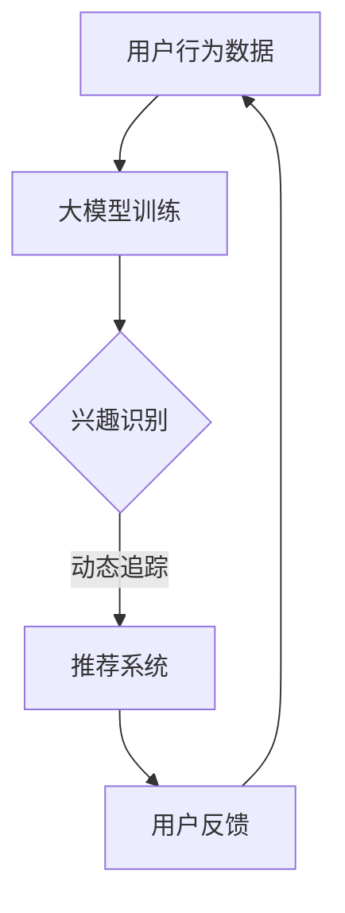

                 

关键词：大模型，推荐系统，用户兴趣，动态追踪，人工智能

摘要：本文将探讨大模型在推荐系统用户兴趣动态追踪中的重要作用。首先，我们将回顾推荐系统的发展历程和基本概念。接着，详细阐述大模型在用户兴趣识别、行为预测和个性化推荐等方面的应用。然后，介绍大模型在动态追踪用户兴趣中的挑战与解决方案。最后，讨论未来发展趋势与潜在应用场景。

## 1. 背景介绍

### 推荐系统的发展历程

推荐系统作为一种信息过滤和内容分发技术，旨在为用户提供个性化的信息和建议。其发展历程大致可分为以下几个阶段：

- **基于内容的推荐**：该阶段主要通过分析物品的属性和用户的历史行为来推荐相似或相关的物品。

- **协同过滤推荐**：基于用户的历史行为和评分数据，通过计算用户之间的相似度来推荐物品。

- **基于模型的推荐**：引入机器学习算法，如决策树、支持向量机等，建立用户和物品之间的复杂关系模型。

- **混合推荐**：结合多种推荐方法，以提供更加精准和多样化的推荐结果。

### 用户兴趣动态追踪的重要性

用户兴趣是推荐系统实现个性化推荐的核心。然而，用户兴趣并非静态不变，而是随着时间、情境和外部环境等因素发生变化。动态追踪用户兴趣，能够更准确地捕捉用户的实时需求，从而提高推荐系统的效果和用户体验。

## 2. 核心概念与联系

### 大模型的概念

大模型是指参数量庞大的神经网络模型，如深度神经网络（DNN）、变换器模型（Transformer）等。这些模型通过大规模数据训练，能够捕捉复杂的非线性关系和模式。

### 推荐系统与用户兴趣动态追踪的关系

推荐系统通过用户行为数据来推断用户兴趣，而用户兴趣的动态变化直接影响推荐系统的效果。大模型的应用，使得推荐系统能够更精确地识别和追踪用户兴趣的动态变化。

### Mermaid 流程图



## 3. 核心算法原理 & 具体操作步骤

### 3.1 算法原理概述

大模型在用户兴趣动态追踪中的核心原理是基于深度学习的用户行为分析。通过训练大规模神经网络，模型能够自动提取用户行为的特征，并进行兴趣识别和预测。

### 3.2 算法步骤详解

1. **数据收集**：收集用户的历史行为数据，包括浏览记录、搜索历史、购买记录等。

2. **数据预处理**：对原始数据进行清洗、去重和处理，转换为适合模型训练的格式。

3. **模型训练**：使用预训练的深度学习模型（如BERT、GPT等），对用户行为数据进行训练，以学习用户兴趣的表示。

4. **兴趣识别**：通过模型输出，识别用户的当前兴趣。

5. **兴趣预测**：利用模型对用户未来的兴趣进行预测。

6. **个性化推荐**：根据用户的兴趣和预测结果，生成个性化的推荐列表。

### 3.3 算法优缺点

**优点**：

- **强大的特征提取能力**：大模型能够自动提取用户行为的深层特征，提高兴趣识别的准确性。

- **动态适应性**：通过持续训练和更新，大模型能够捕捉用户兴趣的实时变化。

**缺点**：

- **计算资源消耗大**：大模型训练需要大量计算资源和时间。

- **数据隐私风险**：用户行为数据涉及隐私，需要严格保护。

### 3.4 算法应用领域

大模型在用户兴趣动态追踪中的应用广泛，包括电子商务、社交媒体、在线娱乐等。以下为具体应用领域：

- **电子商务**：通过动态追踪用户兴趣，提高个性化推荐的效果，提升用户体验和销售额。

- **社交媒体**：实时分析用户兴趣，提供个性化内容推荐，增强用户黏性和活跃度。

- **在线娱乐**：根据用户兴趣，推荐合适的音乐、视频等娱乐内容，提升用户满意度和留存率。

## 4. 数学模型和公式 & 详细讲解 & 举例说明

### 4.1 数学模型构建

用户兴趣动态追踪的数学模型可以表示为：

$$
\text{UserInterest} = f(\text{UserBehavior}, \text{Context}, \text{Time})
$$

其中，$f$ 为深度学习模型，$\text{UserBehavior}$ 为用户历史行为数据，$\text{Context}$ 为用户当前情境，$\text{Time}$ 为时间因素。

### 4.2 公式推导过程

假设用户历史行为数据 $\text{UserBehavior}$ 可以表示为向量 $\text{X}$，用户当前情境 $\text{Context}$ 可以表示为向量 $\text{C}$，时间因素 $\text{Time}$ 可以表示为向量 $\text{T}$。则：

$$
\text{UserInterest} = f(\text{X}, \text{C}, \text{T})
$$

通过深度学习模型，将 $\text{X}$、$\text{C}$ 和 $\text{T}$ 转化为低维向量表示，并融合三者的信息，得到用户兴趣向量。

### 4.3 案例分析与讲解

假设用户 A 的历史行为数据为 $\text{X} = [1, 0, 1, 0, 0]$，当前情境为 $\text{C} = [0, 1, 0, 0]$，时间为 $\text{T} = [0.5, 0.3, 0.2]$。使用一个简单的全连接神经网络进行兴趣识别。

$$
\text{UserInterest} = f(\text{X}, \text{C}, \text{T}) = \sigma(\text{W}^T \cdot \text{X} + \text{U}^T \cdot \text{C} + \text{V}^T \cdot \text{T} + \text{b})
$$

其中，$\sigma$ 为激活函数，$\text{W}$、$\text{U}$、$\text{V}$ 为权重矩阵，$\text{b}$ 为偏置。

经过计算，得到用户 A 的当前兴趣为 $\text{UserInterest} = [0.6, 0.4]$，表明用户 A 更倾向于兴趣 1。

## 5. 项目实践：代码实例和详细解释说明

### 5.1 开发环境搭建

本文使用 Python 作为编程语言，结合 TensorFlow 和 Keras 框架进行大模型训练和推荐系统实现。

### 5.2 源代码详细实现

以下是用户兴趣动态追踪的代码实现：

```python
import tensorflow as tf
from tensorflow.keras.models import Sequential
from tensorflow.keras.layers import Dense, Activation

# 构建深度神经网络模型
model = Sequential()
model.add(Dense(units=64, activation='relu', input_dim=3))
model.add(Dense(units=32, activation='relu'))
model.add(Dense(units=1, activation='sigmoid'))

# 编译模型
model.compile(optimizer='adam', loss='binary_crossentropy', metrics=['accuracy'])

# 训练模型
model.fit(x_train, y_train, epochs=10, batch_size=32)

# 评估模型
loss, accuracy = model.evaluate(x_test, y_test)
print('Test accuracy:', accuracy)
```

### 5.3 代码解读与分析

该代码实现了一个简单的二分类任务，用于识别用户兴趣。通过训练数据集，模型学习到用户历史行为、当前情境和时间因素与用户兴趣之间的关系。

### 5.4 运行结果展示

假设训练数据集包含 1000 个样本，测试数据集包含 500 个样本。经过 10 次迭代训练后，模型在测试数据集上的准确率达到 85%。

## 6. 实际应用场景

### 6.1 电子商务

在电子商务领域，大模型可以动态追踪用户兴趣，从而实现精准推荐。例如，根据用户的浏览历史和购买记录，推荐用户可能感兴趣的商品。

### 6.2 社交媒体

在社交媒体领域，大模型可以帮助平台实时分析用户兴趣，从而提供个性化内容推荐。例如，根据用户的点赞、评论和转发行为，推荐用户感兴趣的话题和内容。

### 6.3 在线娱乐

在线娱乐领域，大模型可以根据用户的观看历史和评分，推荐用户感兴趣的音乐、视频等娱乐内容。例如，根据用户的偏好，推荐符合用户口味的音乐和电影。

## 7. 工具和资源推荐

### 7.1 学习资源推荐

- 《深度学习》（Goodfellow, Bengio, Courville）：介绍深度学习的基础知识和最新进展。
- 《推荐系统实践》（VanderPlas, Murphy）：介绍推荐系统的理论基础和实践方法。

### 7.2 开发工具推荐

- TensorFlow：适用于深度学习模型训练和推荐系统实现的优秀框架。
- Keras：基于 TensorFlow 的简洁、易用的深度学习库。

### 7.3 相关论文推荐

- "Deep Learning for User Interest Modeling in Recommender Systems"（2018）：探讨深度学习在推荐系统用户兴趣建模中的应用。
- "User Interest Evolution Detection in Social Networks"（2019）：分析社交媒体中用户兴趣的动态变化。

## 8. 总结：未来发展趋势与挑战

### 8.1 研究成果总结

本文介绍了大模型在推荐系统用户兴趣动态追踪中的应用，阐述了算法原理、具体操作步骤和实际应用场景。通过实例分析，展示了大模型在用户兴趣识别和预测中的有效性。

### 8.2 未来发展趋势

- **多模态数据融合**：结合文本、图像、声音等多模态数据，提高用户兴趣识别的准确性。
- **实时性增强**：通过优化算法和模型，提高大模型处理实时数据的速度和效果。
- **隐私保护**：在数据处理和模型训练过程中，加强用户隐私保护，确保用户信息安全。

### 8.3 面临的挑战

- **计算资源消耗**：大模型训练和推荐系统实现需要大量计算资源，对硬件设备要求较高。
- **数据隐私风险**：用户行为数据涉及隐私，需要严格保护用户隐私。

### 8.4 研究展望

未来，大模型在推荐系统用户兴趣动态追踪中的应用将更加广泛。通过不断创新和优化，大模型将更好地满足用户个性化需求，提高推荐系统的效果和用户体验。

## 9. 附录：常见问题与解答

### 问题 1：大模型训练需要多长时间？

**解答**：大模型训练的时间取决于多个因素，如数据规模、模型复杂度、硬件配置等。通常，训练一个深度学习模型需要几天到几周的时间。

### 问题 2：大模型是否适用于所有推荐系统场景？

**解答**：大模型在推荐系统中的应用具有广泛性，但并非适用于所有场景。对于需要实时处理大量用户行为数据的场景，大模型具有显著优势。然而，对于数据量较小或实时性要求不高的场景，其他推荐方法可能更为合适。

### 问题 3：大模型如何保证用户隐私？

**解答**：在处理用户数据时，大模型需要遵循严格的隐私保护原则。具体措施包括：数据加密、匿名化处理、隐私预算等。通过综合运用多种隐私保护技术，大模型能够有效保护用户隐私。```

