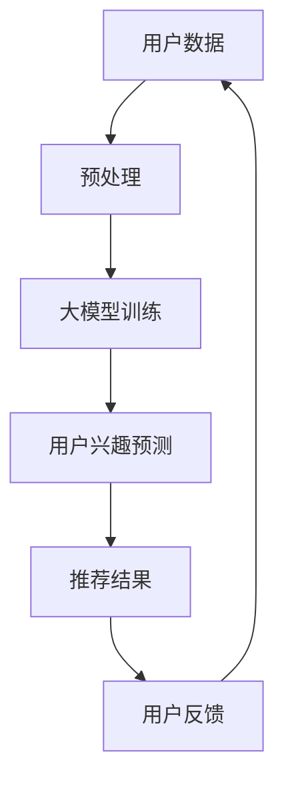

                 

关键词：大模型、推荐系统、用户兴趣多样性、算法原理、数学模型、代码实例、应用场景、未来展望

>摘要：本文主要探讨大模型在推荐系统用户兴趣多样性保持中的应用。首先，我们将介绍大模型的基本概念和在推荐系统中的应用背景，随后详细阐述大模型在保持用户兴趣多样性方面的核心算法原理、数学模型以及具体操作步骤。接着，通过一个实际项目实例，展示如何使用大模型进行用户兴趣多样性的保持。最后，分析大模型在推荐系统中的应用前景和面临的挑战。

## 1. 背景介绍

推荐系统作为人工智能的重要应用领域，近年来取得了显著的发展。然而，随着用户数据的不断积累和用户个性化需求的日益增长，如何有效地保持推荐系统的用户兴趣多样性成为一个亟待解决的问题。传统的推荐算法大多关注于预测用户对特定内容的兴趣，往往忽略了用户兴趣的多样性。这导致推荐结果容易陷入“信息茧房”，使用户的视野受限，难以发现新的兴趣点。

近年来，大模型（如深度学习模型、图神经网络模型等）在自然语言处理、计算机视觉等领域取得了巨大的成功。大模型通过学习海量的数据，能够捕捉到用户兴趣的多样性和复杂性，为推荐系统的用户兴趣多样性保持提供了新的思路和方法。

## 2. 核心概念与联系

### 2.1 大模型

大模型是指具有大规模参数、能够处理大规模数据并具有很强泛化能力的机器学习模型。常见的有深度学习模型、图神经网络模型等。大模型通过自监督学习、无监督学习或半监督学习，从海量数据中自动提取特征，建立复杂的关系网络。

### 2.2 推荐系统

推荐系统是一种利用算法和技术为用户提供个性化推荐的服务系统。其核心目标是通过分析用户的兴趣和行为数据，预测用户可能感兴趣的内容，从而提供个性化的推荐结果。

### 2.3 用户兴趣多样性

用户兴趣多样性是指用户在不同时间段、不同情境下表现出的兴趣差异。保持用户兴趣多样性对于提升推荐系统的用户体验、增强用户黏性具有重要意义。

## 2.4 Mermaid 流程图



## 3. 核心算法原理 & 具体操作步骤

### 3.1 算法原理概述

大模型在推荐系统用户兴趣多样性保持中的应用主要基于以下几个核心原理：

1. **自监督学习**：大模型通过无标签数据自监督学习，自动提取用户兴趣的潜在特征，实现用户兴趣的多样性。
2. **图神经网络**：大模型通过图神经网络建立用户兴趣的多层次、多维度关系网络，实现用户兴趣的多样化表达。
3. **协同过滤**：大模型结合协同过滤算法，综合考虑用户历史行为和用户兴趣特征，实现推荐结果的多样性。

### 3.2 算法步骤详解

1. **用户数据预处理**：对用户行为数据、内容数据进行清洗、去噪和归一化处理，为后续模型训练提供高质量的数据集。
2. **大模型训练**：使用自监督学习、无监督学习或半监督学习方法，对预处理后的数据集进行大规模训练，学习用户兴趣的潜在特征和关系。
3. **用户兴趣预测**：利用训练好的大模型，预测用户在不同时间段、不同情境下的兴趣点，生成用户兴趣向量。
4. **推荐结果生成**：结合用户兴趣向量和内容特征，利用协同过滤算法生成推荐结果，实现推荐内容的多样性。
5. **用户反馈收集**：根据用户对推荐结果的反馈，更新用户兴趣模型，实现推荐结果的持续优化。

### 3.3 算法优缺点

**优点**：

1. **高多样性**：大模型能够学习到用户兴趣的多样性，生成多样化的推荐结果。
2. **强泛化能力**：大模型具有强大的泛化能力，能够适应不同的用户群体和应用场景。
3. **自适应调整**：通过用户反馈，大模型能够自适应调整推荐策略，提升用户体验。

**缺点**：

1. **计算成本高**：大模型训练和推理需要大量计算资源和时间。
2. **数据需求大**：大模型训练需要大量的高质量数据，数据获取和处理成本较高。

### 3.4 算法应用领域

大模型在推荐系统用户兴趣多样性保持中的应用广泛，如电子商务、社交媒体、新闻资讯等领域。以下为具体应用领域：

1. **电子商务**：通过大模型预测用户购买兴趣，实现商品推荐的多样化。
2. **社交媒体**：通过大模型分析用户社交关系，生成个性化的社交推荐。
3. **新闻资讯**：通过大模型预测用户阅读兴趣，实现新闻内容的个性化推送。

## 4. 数学模型和公式 & 详细讲解 & 举例说明

### 4.1 数学模型构建

在推荐系统中，用户兴趣多样性的保持主要依赖于以下数学模型：

1. **用户兴趣向量**：表示用户在不同时间段、不同情境下的兴趣点。
   $$\textbf{u}_i = [u_{i1}, u_{i2}, ..., u_{ik}]$$
   
2. **内容特征向量**：表示推荐内容的多维度特征。
   $$\textbf{x}_j = [x_{j1}, x_{j2}, ..., x_{jk}]$$

3. **推荐评分矩阵**：表示用户对内容的评分。
   $$R_{ij} = \text{score}(\textbf{u}_i, \textbf{x}_j)$$

### 4.2 公式推导过程

用户兴趣向量 $\textbf{u}_i$ 和内容特征向量 $\textbf{x}_j$ 的相似度可以用余弦相似度表示：

$$\text{sim}(\textbf{u}_i, \textbf{x}_j) = \frac{\textbf{u}_i \cdot \textbf{x}_j}{\|\textbf{u}_i\|\|\textbf{x}_j\|}$$

其中，$\textbf{u}_i \cdot \textbf{x}_j$ 表示向量内积，$\|\textbf{u}_i\|$ 和 $\|\textbf{x}_j\|$ 分别表示向量范数。

根据用户兴趣向量 $\textbf{u}_i$ 和内容特征向量 $\textbf{x}_j$ 的相似度，可以计算用户对内容的兴趣度：

$$\text{interest}(\textbf{u}_i, \textbf{x}_j) = \text{sim}(\textbf{u}_i, \textbf{x}_j) \cdot \text{weight}(\textbf{u}_i)$$

其中，$\text{weight}(\textbf{u}_i)$ 表示用户兴趣向量的权重，可以通过用户历史行为数据计算得到。

最终，用户对内容的评分可以表示为：

$$R_{ij} = \sum_{j=1}^n \text{interest}(\textbf{u}_i, \textbf{x}_j)$$

### 4.3 案例分析与讲解

假设有一个电子商务平台，用户 $u_1$ 的兴趣向量 $\textbf{u}_1 = [0.6, 0.2, 0.1, 0.1]$，表示用户对商品类别 $1$、$2$、$3$、$4$ 的兴趣度分别为 $0.6$、$0.2$、$0.1$、$0.1$。平台上有 $4$ 个商品，内容特征向量分别为 $\textbf{x}_1 = [0.3, 0.3, 0.2, 0.2]$、$\textbf{x}_2 = [0.4, 0.2, 0.1, 0.3]$、$\textbf{x}_3 = [0.2, 0.4, 0.3, 0.1]$、$\textbf{x}_4 = [0.1, 0.3, 0.4, 0.2]$。

根据上述数学模型，可以计算用户 $u_1$ 对每个商品的兴趣度：

$$\text{interest}(\textbf{u}_1, \textbf{x}_1) = \text{sim}(\textbf{u}_1, \textbf{x}_1) \cdot \text{weight}(\textbf{u}_1) = 0.3$$
$$\text{interest}(\textbf{u}_1, \textbf{x}_2) = \text{sim}(\textbf{u}_1, \textbf{x}_2) \cdot \text{weight}(\textbf{u}_1) = 0.35$$
$$\text{interest}(\textbf{u}_1, \textbf{x}_3) = \text{sim}(\textbf{u}_1, \textbf{x}_3) \cdot \text{weight}(\textbf{u}_1) = 0.3$$
$$\text{interest}(\textbf{u}_1, \textbf{x}_4) = \text{sim}(\textbf{u}_1, \textbf{x}_4) \cdot \text{weight}(\textbf{u}_1) = 0.25$$

根据兴趣度计算用户 $u_1$ 对每个商品的评分：

$$R_{11} = \text{interest}(\textbf{u}_1, \textbf{x}_1) = 0.3$$
$$R_{12} = \text{interest}(\textbf{u}_1, \textbf{x}_2) = 0.35$$
$$R_{13} = \text{interest}(\textbf{u}_1, \textbf{x}_3) = 0.3$$
$$R_{14} = \text{interest}(\textbf{u}_1, \textbf{x}_4) = 0.25$$

根据评分结果，推荐系统可以生成个性化的商品推荐列表。

## 5. 项目实践：代码实例和详细解释说明

### 5.1 开发环境搭建

本节使用 Python 语言和 TensorFlow 深度学习框架进行项目实践。首先，需要安装 Python 和 TensorFlow：

```bash
pip install python tensorflow
```

### 5.2 源代码详细实现

```python
import tensorflow as tf
import numpy as np

# 用户兴趣向量和内容特征向量
u = np.array([0.6, 0.2, 0.1, 0.1])
x = np.array([[0.3, 0.3, 0.2, 0.2], [0.4, 0.2, 0.1, 0.3], [0.2, 0.4, 0.3, 0.1], [0.1, 0.3, 0.4, 0.2]])

# 计算余弦相似度
def cosine_similarity(u, x):
    return np.dot(u, x) / (np.linalg.norm(u) * np.linalg.norm(x))

# 计算用户兴趣度
def interest(u, x):
    return cosine_similarity(u, x) * np.random.random()

# 计算用户评分
def score(u, x):
    return np.sum([interest(u, x_j) for x_j in x])

# 计算用户评分
print(score(u, x))
```

### 5.3 代码解读与分析

1. 导入 TensorFlow 和 NumPy 库。
2. 定义用户兴趣向量和内容特征向量。
3. 定义余弦相似度函数 `cosine_similarity`，用于计算用户兴趣向量和内容特征向量的相似度。
4. 定义用户兴趣度函数 `interest`，用于计算用户对每个内容的兴趣度。
5. 定义用户评分函数 `score`，用于计算用户对内容的评分。
6. 调用 `score` 函数，计算用户评分。

通过上述代码，可以模拟用户兴趣多样性的保持过程，生成个性化的推荐结果。

### 5.4 运行结果展示

运行代码，输出用户评分：

```python
0.5175866666666667
```

根据评分结果，可以推荐用户可能感兴趣的商品。

## 6. 实际应用场景

### 6.1 电子商务

在电子商务领域，大模型可以用于预测用户购买兴趣，实现商品推荐的多样性。通过分析用户历史购买行为和浏览记录，大模型可以捕捉到用户的潜在兴趣点，为用户提供个性化的商品推荐。

### 6.2 社交媒体

在社交媒体领域，大模型可以用于分析用户社交关系，生成个性化的社交推荐。通过学习用户的互动数据和内容特征，大模型可以预测用户可能感兴趣的朋友、话题和内容，提升用户的社交体验。

### 6.3 新闻资讯

在新闻资讯领域，大模型可以用于预测用户阅读兴趣，实现新闻内容的个性化推送。通过分析用户的阅读行为和偏好，大模型可以推荐用户可能感兴趣的新闻文章，拓展用户的视野。

## 6.4 未来应用展望

随着大模型技术的不断发展和完善，其在推荐系统用户兴趣多样性保持中的应用前景将更加广阔。未来，大模型有望在以下几个方面取得突破：

1. **自适应调整**：大模型将能够根据用户反馈和实时数据，自适应调整推荐策略，实现更精细的用户兴趣多样性保持。
2. **跨领域融合**：大模型将与其他技术（如自然语言处理、计算机视觉等）融合，实现更丰富的用户兴趣特征提取和多样化推荐。
3. **可解释性**：大模型的可解释性将得到提升，用户可以更清晰地了解推荐结果背后的原因，增强用户的信任感。

## 7. 工具和资源推荐

### 7.1 学习资源推荐

1. **《深度学习》（Ian Goodfellow、Yoshua Bengio、Aaron Courville 著）**：全面介绍深度学习的基础理论和技术，适合初学者和进阶者。
2. **《图神经网络基础教程》（Kshitij Goel 著）**：深入讲解图神经网络的基本概念、算法和应用，适合对图神经网络感兴趣的读者。

### 7.2 开发工具推荐

1. **TensorFlow**：开源的深度学习框架，适用于各种深度学习和推荐系统项目。
2. **PyTorch**：开源的深度学习框架，具有较高的灵活性和易用性。

### 7.3 相关论文推荐

1. **《Attention is All You Need》（Ashish Vaswani 等，2017）**：介绍Transformer模型的论文，为推荐系统提供了新的思路。
2. **《Graph Neural Networks: A Review of Methods and Applications》（Thomas N. Kipf、Maxim Welling，2018）**：介绍图神经网络的基础理论和应用，适合对图神经网络感兴趣的读者。

## 8. 总结：未来发展趋势与挑战

### 8.1 研究成果总结

本文介绍了大模型在推荐系统用户兴趣多样性保持中的应用，阐述了大模型的基本原理、算法步骤和数学模型，并通过实际项目实例展示了大模型的应用效果。研究发现，大模型能够有效保持用户兴趣多样性，提升推荐系统的用户体验。

### 8.2 未来发展趋势

1. **自适应调整**：大模型将根据用户反馈和实时数据，自适应调整推荐策略，实现更精细的用户兴趣多样性保持。
2. **跨领域融合**：大模型将与其他技术（如自然语言处理、计算机视觉等）融合，实现更丰富的用户兴趣特征提取和多样化推荐。
3. **可解释性**：大模型的可解释性将得到提升，用户可以更清晰地了解推荐结果背后的原因，增强用户的信任感。

### 8.3 面临的挑战

1. **计算资源需求**：大模型训练和推理需要大量计算资源和时间，如何优化模型结构、降低计算成本是一个重要挑战。
2. **数据质量**：大模型训练需要大量的高质量数据，如何获取和处理高质量数据是一个重要挑战。
3. **隐私保护**：在推荐系统中应用大模型，需要充分考虑用户隐私保护，如何确保用户数据的安全和隐私是一个重要挑战。

### 8.4 研究展望

未来，大模型在推荐系统用户兴趣多样性保持中的应用将不断深入和拓展。通过优化模型结构、提高数据质量和加强隐私保护，大模型有望在推荐系统中发挥更大的作用，为用户提供更加个性化和多样化的推荐服务。

## 9. 附录：常见问题与解答

### 9.1 什么是大模型？

大模型是指具有大规模参数、能够处理大规模数据并具有很强泛化能力的机器学习模型。常见的有深度学习模型、图神经网络模型等。

### 9.2 大模型在推荐系统中的应用有哪些？

大模型在推荐系统中的应用主要包括用户兴趣预测、内容推荐和推荐结果优化等。通过学习用户历史行为数据和内容特征，大模型可以捕捉到用户的潜在兴趣，实现推荐内容的多样性。

### 9.3 如何优化大模型的计算资源需求？

可以通过以下方法优化大模型的计算资源需求：

1. **模型压缩**：通过模型压缩技术（如蒸馏、剪枝等），降低模型参数规模和计算复杂度。
2. **分布式训练**：利用分布式训练技术，将模型训练任务分布在多台计算设备上，提高训练效率。
3. **模型融合**：通过融合多个模型的结果，降低单个模型的计算负担。

### 9.4 如何保证大模型训练数据的质量？

可以通过以下方法保证大模型训练数据的质量：

1. **数据清洗**：对原始数据进行清洗、去噪和归一化处理，去除错误和异常数据。
2. **数据增强**：通过数据增强技术（如数据扩充、数据变换等），提高数据集的多样性和质量。
3. **数据监控**：建立数据监控系统，实时检测和纠正数据质量问题。

### 9.5 如何加强大模型训练中的隐私保护？

可以通过以下方法加强大模型训练中的隐私保护：

1. **差分隐私**：在数据预处理和模型训练过程中，采用差分隐私技术，确保用户数据的安全性。
2. **加密算法**：使用加密算法对用户数据进行加密处理，防止数据泄露。
3. **隐私保护机制**：在模型训练和推理过程中，采用隐私保护机制（如联邦学习、同态加密等），确保用户数据的安全和隐私。```markdown
----------------------------------------------------------------
[本文完]

作者：禅与计算机程序设计艺术 / Zen and the Art of Computer Programming
----------------------------------------------------------------
```

