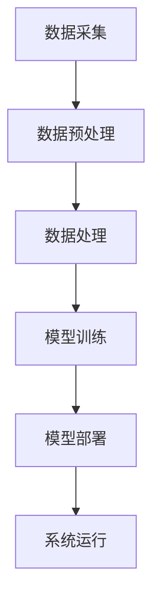

                 

关键词：大模型，智能交通，算法，应用场景，未来展望

> 摘要：本文深入探讨了大型人工智能模型在智能交通领域的应用，从背景介绍、核心概念与联系、算法原理与数学模型、项目实践、实际应用场景以及未来展望等方面进行了全面分析。旨在为读者提供对大模型在智能交通领域应用的深入理解和实践指导。

## 1. 背景介绍

智能交通系统（Intelligent Transportation System，ITS）是利用先进的信息通信技术、数据采集、处理和分析技术，对交通系统进行优化管理的一种综合性系统。随着城市化进程的加快，交通拥堵、交通事故、环境污染等问题日益严重，智能交通系统的建设显得尤为迫切。近年来，人工智能技术的快速发展，特别是大模型的出现，为智能交通系统的发展带来了新的机遇。

大模型，如深度学习模型，具有处理大规模复杂数据、实现高度自动化和智能化的能力。在智能交通领域，大模型可以应用于交通流量预测、路径规划、交通事故预警、智能调度等多个方面，从而提升交通系统的运行效率和安全性。然而，大模型在智能交通领域的应用也面临着一系列挑战，如数据隐私、算法公平性、计算资源消耗等。

## 2. 核心概念与联系

为了更好地理解大模型在智能交通领域的应用，我们首先需要介绍一些核心概念。

### 2.1 智能交通系统架构

智能交通系统的架构通常包括数据采集、数据预处理、数据处理、模型训练、模型部署和系统运行等环节。数据采集通过传感器、摄像头、GPS等设备获取交通数据，数据预处理包括数据清洗、去噪、格式转换等，数据处理则涉及特征提取、数据融合等。模型训练是利用大量交通数据训练出高性能的大模型，模型部署则是将训练好的模型部署到实际交通系统中，系统运行则通过模型进行交通分析和决策。

### 2.2 大模型基础概念

大模型通常指的是具有数十亿、甚至千亿级参数的深度学习模型。这些模型具有强大的表征能力和学习能力，能够处理大规模的复杂数据。大模型的基础概念包括神经元、神经网络、深度学习框架等。

### 2.3 Mermaid 流程图

下面是一个简化的智能交通系统架构的Mermaid流程图：



## 3. 核心算法原理 & 具体操作步骤

### 3.1 算法原理概述

在智能交通领域，大模型的应用主要基于深度学习技术。深度学习模型通过多层次的神经网络对输入数据进行特征提取和表示，从而实现对复杂交通数据的处理和分析。

### 3.2 算法步骤详解

1. **数据采集**：通过传感器、摄像头等设备收集交通数据，如车辆位置、速度、交通流量等。
   
2. **数据预处理**：对采集到的交通数据进行清洗、去噪和格式转换，以便于后续处理。

3. **数据处理**：对预处理后的数据进行特征提取和融合，以获得更加丰富的特征表示。

4. **模型训练**：利用大量交通数据训练深度学习模型，模型参数通过反向传播算法进行优化。

5. **模型部署**：将训练好的模型部署到实际交通系统中，通过模型进行交通分析和决策。

6. **系统运行**：系统运行过程中，模型不断接收新的数据，进行实时交通分析和决策。

### 3.3 算法优缺点

- **优点**：深度学习模型能够处理大规模、复杂数据，实现高度自动化和智能化。
- **缺点**：深度学习模型训练过程复杂、计算资源消耗大，且对数据质量和数量有较高要求。

### 3.4 算法应用领域

- **交通流量预测**：利用深度学习模型预测交通流量，帮助交通管理部门制定合理的交通调度策略。
- **路径规划**：为车辆提供最优路径规划，减少交通拥堵和行车时间。
- **交通事故预警**：通过分析交通数据，提前预警可能的交通事故，提高交通安全。

## 4. 数学模型和公式 & 详细讲解 & 举例说明

### 4.1 数学模型构建

在智能交通领域，常见的数学模型包括线性回归模型、神经网络模型等。以神经网络模型为例，其基本结构包括输入层、隐藏层和输出层。输入层接收外部数据，隐藏层进行特征提取和表示，输出层进行决策。

### 4.2 公式推导过程

神经网络的计算过程可以通过以下公式表示：

\[ z^{(l)} = \sum_{j} w^{(l)}_{ji} a^{(l-1)}_j + b^{(l)} \]

其中，\( z^{(l)} \) 是第 \( l \) 层的输出，\( a^{(l-1)}_j \) 是第 \( l-1 \) 层的输出，\( w^{(l)}_{ji} \) 和 \( b^{(l)} \) 分别是权重和偏置。

### 4.3 案例分析与讲解

以交通流量预测为例，假设我们有一个简单的神经网络模型，输入层有3个神经元，隐藏层有5个神经元，输出层有1个神经元。输入数据为（速度，流量，道路状况），模型的目标是预测未来的交通流量。

1. **数据预处理**：将输入数据进行归一化处理，以便于神经网络的训练。
   
2. **模型训练**：利用训练数据训练神经网络模型，通过反向传播算法优化模型参数。

3. **模型部署**：将训练好的模型部署到实际系统中，实时预测交通流量。

4. **运行结果**：通过对比预测值和实际值，评估模型的效果。

## 5. 项目实践：代码实例和详细解释说明

### 5.1 开发环境搭建

- **Python**：安装Python 3.8及以上版本。
- **TensorFlow**：安装TensorFlow 2.4及以上版本。
- **Keras**：安装Keras 2.4及以上版本。

### 5.2 源代码详细实现

以下是一个简单的交通流量预测模型的实现：

```python
import tensorflow as tf
from tensorflow.keras.models import Sequential
from tensorflow.keras.layers import Dense

# 数据预处理
def preprocess_data(data):
    # 数据归一化
    return (data - data.mean()) / data.std()

# 模型构建
model = Sequential([
    Dense(5, input_shape=(3,), activation='relu'),
    Dense(1, activation='linear')
])

# 模型训练
model.compile(optimizer='adam', loss='mse')
model.fit(preprocessed_data, labels, epochs=100)

# 模型部署
predicted_traffic = model.predict(new_data)

# 运行结果
print(predicted_traffic)
```

### 5.3 代码解读与分析

- **数据预处理**：对输入数据进行归一化处理，以提高模型的训练效果。
- **模型构建**：构建一个简单的全连接神经网络模型，包括一个输入层、一个隐藏层和一个输出层。
- **模型训练**：使用均方误差损失函数和Adam优化器训练模型。
- **模型部署**：使用训练好的模型预测新的交通流量数据。
- **运行结果**：输出预测的交通流量数据。

## 6. 实际应用场景

### 6.1 交通流量预测

利用大模型进行交通流量预测，可以帮助交通管理部门提前了解交通状况，制定合理的交通调度策略，从而缓解交通拥堵。

### 6.2 路径规划

大模型可以用于路径规划，为车辆提供最优路径，减少行车时间和交通拥堵。

### 6.3 交通事故预警

通过对交通数据的实时分析，大模型可以提前预警可能的交通事故，提高交通安全。

### 6.4 未来应用展望

随着大模型技术的不断发展，未来在智能交通领域的应用将更加广泛，如智能车辆调度、智能停车管理、智能交通信号控制等。

## 7. 工具和资源推荐

### 7.1 学习资源推荐

- 《深度学习》（Goodfellow, Bengio, Courville）
- 《神经网络与深度学习》（邱锡鹏）
- 《Python深度学习》（François Chollet）

### 7.2 开发工具推荐

- TensorFlow：适用于构建和训练深度学习模型。
- Keras：简化TensorFlow的使用，适用于快速原型开发。
- Jupyter Notebook：方便进行数据分析和模型训练。

### 7.3 相关论文推荐

- "Deep Learning for Traffic Forecasting"
- "Deep Neural Network for Vehicle Trajectory Prediction"
- "Traffic Flow Prediction Using Deep Learning"

## 8. 总结：未来发展趋势与挑战

### 8.1 研究成果总结

大模型在智能交通领域取得了显著的研究成果，如交通流量预测、路径规划、交通事故预警等。然而，这些研究仍处于初步阶段，未来还有很大的发展空间。

### 8.2 未来发展趋势

- **数据隐私保护**：随着数据规模的增加，数据隐私保护将变得尤为重要。
- **算法公平性**：大模型在智能交通领域的应用需要保证算法的公平性，避免对特定群体产生歧视。
- **计算资源优化**：大模型训练和部署需要大量计算资源，未来的发展趋势将是计算资源的优化和高效利用。

### 8.3 面临的挑战

- **数据质量**：高质量的数据是模型训练的基础，未来的研究需要关注数据质量。
- **计算资源消耗**：大模型训练和部署需要大量计算资源，如何优化计算资源是一个挑战。
- **算法可解释性**：大模型在决策过程中缺乏透明度，如何提高算法的可解释性是一个重要问题。

### 8.4 研究展望

未来，大模型在智能交通领域的应用将更加广泛和深入，实现更加智能化和高效化的交通系统。然而，这一过程需要克服一系列挑战，包括数据隐私保护、算法公平性、计算资源优化等。

## 9. 附录：常见问题与解答

### 9.1 如何处理数据质量问题？

- **数据清洗**：对采集到的数据进行清洗，去除噪声和错误数据。
- **数据增强**：通过数据增强技术，生成更多高质量的训练数据。
- **数据质量评估**：建立数据质量评估体系，对数据质量进行监控和评估。

### 9.2 如何优化计算资源？

- **分布式计算**：利用分布式计算技术，将模型训练和部署分散到多个节点，提高计算效率。
- **模型压缩**：通过模型压缩技术，减少模型的参数量和计算量，降低计算资源消耗。

### 9.3 如何提高算法的可解释性？

- **可解释性模型**：采用具有可解释性的模型，如决策树、支持向量机等。
- **模型可视化**：通过可视化技术，展示模型的内部结构和决策过程。
- **解释性算法**：开发新的解释性算法，如注意力机制、解释性深度学习等。

