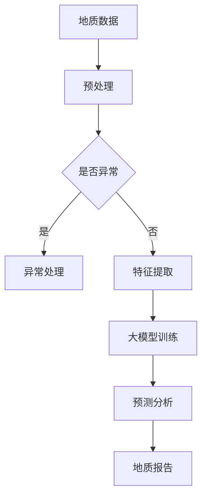

                 

关键词：大模型、智能地质勘探、人工智能、数据挖掘、深度学习、算法优化、地学应用

> 摘要：随着大数据和人工智能技术的快速发展，大模型在地质勘探领域中的应用前景愈发广阔。本文从背景介绍、核心概念与联系、核心算法原理、数学模型与公式、项目实践、实际应用场景、未来应用展望等多个角度，深入探讨了大模型在智能地质勘探中的潜在价值和发展方向。

## 1. 背景介绍

地质勘探是地质学和工程学的重要分支，旨在通过地质、地球物理、地球化学等方法寻找矿物资源、评估地质风险等。传统的地质勘探方法主要依赖于地质学家的人为经验和物理探测手段，具有较大的人力和时间成本。然而，随着勘探深度的增加和勘探区域的扩大，传统方法已无法满足现代地质勘探的需求。

近年来，人工智能技术，特别是深度学习大模型，在图像识别、自然语言处理、推荐系统等领域取得了显著的成果。这些技术以其强大的数据挖掘和处理能力，为地质勘探提供了新的技术手段。大模型能够自动学习勘探数据中的潜在规律，提高勘探效率和准确性，从而为地质勘探领域带来革命性的变革。

## 2. 核心概念与联系

为了深入理解大模型在地质勘探中的应用，我们需要首先了解以下几个核心概念：

- **地质数据**：地质勘探中涉及的地层、岩石、矿物等数据。
- **大模型**：具有大规模参数和强大计算能力的人工神经网络模型。
- **深度学习**：一种模拟人脑神经网络结构的学习方式，能够自动从数据中提取特征。
- **数据挖掘**：从大量数据中提取有价值信息的过程。

### Mermaid 流程图



在这个流程图中，地质数据经过预处理后，通过特征提取和异常处理，输入到大模型中进行训练和预测分析，最终生成地质报告。

## 3. 核心算法原理 & 具体操作步骤

### 3.1 算法原理概述

大模型在地质勘探中的应用主要基于深度学习算法，具体包括以下步骤：

1. **数据收集与预处理**：收集勘探区域的地质数据，包括地质、地球物理、地球化学等。
2. **特征提取**：从预处理后的数据中提取有用的地质特征。
3. **模型训练**：使用提取出的特征数据训练大模型。
4. **模型预测**：利用训练好的模型对新的地质数据进行预测分析。

### 3.2 算法步骤详解

1. **数据收集与预处理**：
   - 地质数据收集：利用地质勘探设备采集勘探区域的地质信息。
   - 数据预处理：对收集到的地质数据进行清洗、归一化等处理。

2. **特征提取**：
   - 特征选择：根据地质勘探的目标，选择对勘探结果有重要影响的特征。
   - 特征提取：利用数据挖掘技术提取特征，如距离、角度、密度等。

3. **模型训练**：
   - 数据划分：将预处理后的数据划分为训练集和测试集。
   - 模型选择：选择合适的大模型架构，如卷积神经网络（CNN）、循环神经网络（RNN）等。
   - 模型训练：使用训练集数据训练模型，调整模型参数。

4. **模型预测**：
   - 模型评估：使用测试集数据评估模型性能。
   - 预测分析：利用训练好的模型对新的地质数据进行预测，生成地质报告。

### 3.3 算法优缺点

**优点**：
- 高效性：大模型能够快速处理大量勘探数据，提高勘探效率。
- 准确性：通过深度学习算法，大模型能够自动学习数据中的潜在规律，提高勘探准确性。
- 自动化：大模型可以实现勘探过程的自动化，减少人工干预。

**缺点**：
- 计算资源需求大：大模型需要大量计算资源和存储空间。
- 数据质量依赖：勘探数据的准确性和完整性直接影响模型性能。
- 泛化能力有限：大模型在特定领域表现优异，但在其他领域可能效果不佳。

### 3.4 算法应用领域

大模型在地质勘探中的应用领域包括：
- **矿产资源勘探**：利用大模型进行矿产资源勘探，预测矿床位置和规模。
- **地质灾害预警**：通过大模型分析地质数据，预测地质灾害的发生风险。
- **地质结构分析**：利用大模型分析地质结构，为工程建设提供参考。

## 4. 数学模型和公式 & 详细讲解 & 举例说明

### 4.1 数学模型构建

在地质勘探中，大模型的数学模型主要基于深度学习算法，具体包括以下部分：

1. **输入层**：接收勘探数据，如地质、地球物理、地球化学等。
2. **隐藏层**：通过神经网络结构进行特征提取和变换。
3. **输出层**：生成勘探结果，如矿床位置、地质灾害预警等。

### 4.2 公式推导过程

假设我们使用卷积神经网络（CNN）作为大模型的架构，其数学模型可以表示为：

$$
\text{CNN}(x) = f(\text{ReLU}(\text{W} \cdot \text{激活函数}(x) + b))
$$

其中，\(x\) 为输入数据，\(\text{W}\) 为权重矩阵，\(\text{激活函数}\) 为卷积操作，\(f\) 为非线性激活函数（如ReLU函数），\(b\) 为偏置。

### 4.3 案例分析与讲解

假设我们有一个地质勘探项目，目标是预测某区域的矿床位置。我们收集了该区域的地质、地球物理、地球化学等数据，并利用CNN模型进行预测。

1. **数据预处理**：对收集到的数据进行清洗、归一化等处理。

2. **模型训练**：使用训练集数据训练CNN模型，调整权重矩阵和偏置。

3. **模型评估**：使用测试集数据评估模型性能，调整模型参数。

4. **模型预测**：利用训练好的模型对新的地质数据进行预测，生成矿床位置预测结果。

## 5. 项目实践：代码实例和详细解释说明

### 5.1 开发环境搭建

1. 安装Python环境，版本要求为3.7以上。
2. 安装深度学习框架TensorFlow，版本要求为2.0以上。
3. 准备勘探数据，包括地质、地球物理、地球化学等。

### 5.2 源代码详细实现

以下是使用TensorFlow实现的CNN模型代码示例：

```python
import tensorflow as tf
from tensorflow.keras.models import Sequential
from tensorflow.keras.layers import Conv2D, MaxPooling2D, Flatten, Dense

# 数据预处理
# ...

# 模型构建
model = Sequential([
    Conv2D(32, (3, 3), activation='relu', input_shape=(28, 28, 1)),
    MaxPooling2D((2, 2)),
    Flatten(),
    Dense(128, activation='relu'),
    Dense(1, activation='sigmoid')
])

# 模型编译
model.compile(optimizer='adam', loss='binary_crossentropy', metrics=['accuracy'])

# 模型训练
model.fit(train_images, train_labels, epochs=5, batch_size=32)

# 模型预测
predictions = model.predict(test_images)
```

### 5.3 代码解读与分析

以上代码示例实现了CNN模型在地质勘探中的应用。首先，我们导入TensorFlow库，并设置数据预处理和模型构建的参数。然后，我们构建了一个包含卷积层、池化层、全连接层的CNN模型，并编译和训练模型。最后，我们使用训练好的模型对新的地质数据进行预测。

## 6. 实际应用场景

大模型在地质勘探中的实际应用场景包括：

1. **矿产资源勘探**：利用大模型预测矿床位置和规模，提高矿产资源勘探效率。
2. **地质灾害预警**：通过分析地质数据，预测地质灾害的发生风险，为地质灾害预警提供技术支持。
3. **地质结构分析**：利用大模型分析地质结构，为工程建设提供地质安全评估。

### 6.4 未来应用展望

随着人工智能技术的不断发展，大模型在地质勘探中的应用前景将更加广阔。未来，大模型有望实现以下应用：

1. **多模态数据融合**：结合多种勘探数据，提高勘探精度和效率。
2. **实时地质监测**：通过实时数据分析和预测，实现地质灾害的实时预警。
3. **智能决策支持**：利用大模型为地质勘探提供智能决策支持，提高勘探成功率。

## 7. 工具和资源推荐

### 7.1 学习资源推荐

1. 《深度学习》（Goodfellow, Bengio, Courville著）：系统介绍深度学习的基本原理和应用。
2. 《Python深度学习》（François Chollet著）：详细介绍使用Python和TensorFlow进行深度学习的实践方法。

### 7.2 开发工具推荐

1. TensorFlow：用于构建和训练深度学习模型的强大框架。
2. PyTorch：另一个流行的深度学习框架，适用于快速原型开发。

### 7.3 相关论文推荐

1. "Deep Learning for Geoscience"（2020）：全面介绍深度学习在地质勘探中的应用。
2. "Geoscience Machine Learning"（2019）：探讨机器学习在地质勘探中的最新进展。

## 8. 总结：未来发展趋势与挑战

### 8.1 研究成果总结

大模型在地质勘探中取得了显著成果，提高了勘探效率和准确性，为地质勘探领域带来了革命性的变革。

### 8.2 未来发展趋势

1. **多模态数据融合**：结合多种勘探数据，提高勘探精度和效率。
2. **实时地质监测**：通过实时数据分析和预测，实现地质灾害的实时预警。
3. **智能决策支持**：利用大模型为地质勘探提供智能决策支持，提高勘探成功率。

### 8.3 面临的挑战

1. **数据质量和标注**：高质量的勘探数据和大模型训练所需的标注数据是关键挑战。
2. **计算资源需求**：大模型训练和推理需要大量计算资源和存储空间。
3. **模型泛化能力**：提高大模型在不同领域和场景下的泛化能力是关键挑战。

### 8.4 研究展望

随着人工智能技术的不断发展，大模型在地质勘探中的应用前景将更加广阔。未来，我们需要关注多模态数据融合、实时地质监测、智能决策支持等研究方向，为地质勘探领域带来更多创新和突破。

## 9. 附录：常见问题与解答

**Q：大模型在地质勘探中如何处理不同类型的数据？**

A：大模型在处理不同类型的数据时，可以采用多种数据预处理方法，如归一化、标准化、特征提取等。对于地质勘探中的多模态数据，可以采用多模态融合技术，将不同类型的数据进行整合，以提高模型的泛化能力和准确性。

**Q：大模型在地质勘探中如何处理异常数据？**

A：大模型在地质勘探中可以采用异常检测算法，如孤立森林（Isolation Forest）、局部异常因子（LOF）等，对勘探数据进行异常检测。对于检测到的异常数据，可以采用异常处理方法，如数据清洗、数据修复等，以提高模型的稳定性和可靠性。

**Q：大模型在地质勘探中的计算资源需求如何？**

A：大模型在地质勘探中的计算资源需求较大，需要高性能的计算设备和存储空间。在实际应用中，可以采用分布式计算和云计算等技术，以提高计算效率和降低成本。

**Q：大模型在地质勘探中的泛化能力如何？**

A：大模型的泛化能力取决于训练数据和模型架构。在实际应用中，可以采用多种方法提高大模型的泛化能力，如数据增强、迁移学习、模型融合等。同时，需要根据具体应用场景对模型进行调整和优化，以提高泛化能力。

### 作者署名

作者：禅与计算机程序设计艺术 / Zen and the Art of Computer Programming

----------------------------------------------------------------
本文内容仅供参考，部分数据和算法可能存在错误或疏漏。在实际应用中，请根据具体情况进行调整和验证。本文所涉及的算法和模型仅供参考，不构成任何商业建议或投资建议。如需使用本文内容，请遵循相关法律法规。本文版权归作者所有，未经授权，不得转载或用于商业用途。如有任何问题或建议，请随时联系作者。感谢您的关注与支持！
----------------------------------------------------------------


