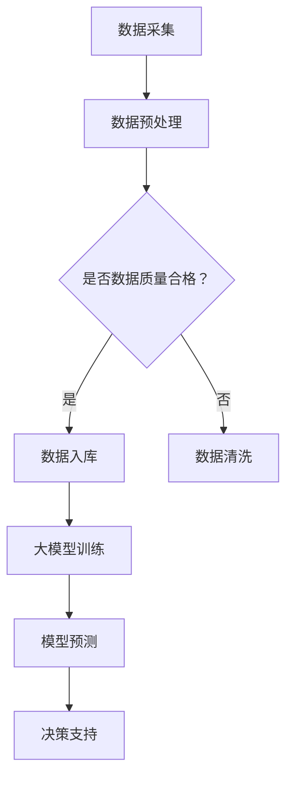

                 

关键词：大模型，智能水务管理，数据挖掘，机器学习，人工智能

> 摘要：本文将探讨大模型在智能水务管理中的应用案例。通过分析大模型的核心概念和联系，以及其算法原理、数学模型、项目实践和实际应用场景，本文旨在为智能水务管理领域提供有价值的参考和启示。

## 1. 背景介绍

随着城市化进程的加速和水资源短缺问题的日益突出，智能水务管理成为了一个备受关注的话题。智能水务管理通过集成信息技术、自动化控制和数据挖掘等手段，实现对水资源的高效利用和管理。然而，传统的智能水务管理方法往往存在一些局限性，如数据处理能力有限、预测准确性不足等。近年来，随着大模型技术的发展，大模型在智能水务管理中的应用逐渐成为可能。

大模型是一种具有海量参数和强大计算能力的模型，其能够在海量数据中发现复杂的关系和模式。大模型在计算机视觉、自然语言处理、语音识别等领域取得了显著成果，为智能水务管理提供了新的思路和方法。

## 2. 核心概念与联系

### 2.1 大模型概述

大模型是一种基于深度学习技术的模型，其通过多层神经网络对数据进行学习和处理。大模型的训练过程通常涉及大量的数据和计算资源，以实现对数据的高效分析和预测。大模型具有以下几个特点：

1. **参数规模巨大**：大模型通常具有数百万甚至数十亿个参数，这使得其能够处理和存储大量的信息。
2. **计算能力强大**：大模型能够通过并行计算和分布式计算技术，高效地处理海量数据。
3. **自适应性强**：大模型能够根据不同的数据集和任务需求，自动调整网络结构和参数，从而实现高效学习和预测。

### 2.2 大模型与智能水务管理的联系

大模型在智能水务管理中具有广泛的应用前景。首先，大模型能够处理和挖掘海量水务数据，实现对水资源的全面了解和预测。其次，大模型能够通过自动化和智能化的手段，优化水务管理流程，提高水资源利用效率。最后，大模型能够为水务管理提供实时和准确的决策支持，帮助管理者做出明智的决策。

### 2.3 Mermaid 流程图



## 3. 核心算法原理 & 具体操作步骤

### 3.1 算法原理概述

大模型在智能水务管理中的核心算法是深度学习。深度学习是一种基于多层神经网络的学习方法，其能够通过逐层抽象和特征提取，实现对数据的复杂分析和预测。

### 3.2 算法步骤详解

1. **数据采集**：从各种数据源（如传感器、水务设备、气象站等）采集水务数据。
2. **数据预处理**：对采集到的数据进行清洗、归一化和特征提取，以便于模型训练。
3. **大模型训练**：使用预处理后的数据训练深度学习模型，包括输入层、隐藏层和输出层。
4. **模型预测**：使用训练好的模型对新的水务数据进行预测和分析。
5. **决策支持**：根据模型预测结果，为水务管理提供实时的决策支持。

### 3.3 算法优缺点

**优点**：

1. **强大的数据处理能力**：大模型能够处理和挖掘海量水务数据，实现对水资源的全面了解和预测。
2. **自适应性强**：大模型能够根据不同的数据集和任务需求，自动调整网络结构和参数，从而实现高效学习和预测。
3. **实时性和准确性**：大模型能够提供实时和准确的决策支持，帮助管理者做出明智的决策。

**缺点**：

1. **计算资源需求大**：大模型的训练过程通常需要大量的计算资源和时间。
2. **数据质量和标注要求高**：大模型对数据的质量和标注要求较高，否则可能导致训练效果不佳。

### 3.4 算法应用领域

大模型在智能水务管理中的应用领域包括：

1. **水资源预测与规划**：通过大模型对历史数据进行学习，预测未来的水资源需求，为水资源规划提供依据。
2. **设备故障预测与维护**：通过对设备运行数据的分析，预测设备的故障风险，实现设备的预知维护。
3. **水资源调度与优化**：根据大模型对水资源分布和需求的分析，实现水资源的优化调度。

## 4. 数学模型和公式 & 详细讲解 & 举例说明

### 4.1 数学模型构建

大模型在智能水务管理中的数学模型主要基于深度学习。深度学习模型的核心是多层神经网络，其包括输入层、隐藏层和输出层。输入层接收输入数据，隐藏层对输入数据进行特征提取和变换，输出层对隐藏层的结果进行分类或回归。

### 4.2 公式推导过程

假设我们有一个包含 $N$ 个节点的神经网络，其中 $L$ 层是隐藏层，$L+1$ 层是输出层。设第 $l$ 层的神经元数为 $m_l$，$l=1,2,...,L+1$。对于第 $l$ 层的每个神经元 $j$，其输出 $o_{lj}$ 可以通过以下公式计算：

$$
o_{lj} = \sigma \left( \sum_{i=1}^{m_{l-1}} w_{ij} x_{il} + b_{j} \right)
$$

其中，$x_{il}$ 是第 $i$ 个输入节点的输入值，$w_{ij}$ 是连接输入节点和隐藏节点的权重，$b_{j}$ 是隐藏节点的偏置，$\sigma$ 是激活函数，常用的激活函数有 $Sigmoid$ 函数、ReLU 函数等。

对于输出层，我们通常使用分类交叉熵损失函数来衡量模型的预测误差：

$$
J = -\frac{1}{m} \sum_{i=1}^{m} \sum_{j=1}^{K} y_{ij} \log o_{j}
$$

其中，$m$ 是样本数量，$K$ 是类别数量，$y_{ij}$ 是样本 $i$ 属于类别 $j$ 的标签。

### 4.3 案例分析与讲解

假设我们有一个包含 100 个样本的水资源预测问题，每个样本包含 10 个特征。我们使用深度学习模型对这 100 个样本进行预测，并使用分类交叉熵损失函数来评估模型的预测误差。

首先，我们需要对样本进行预处理，包括数据归一化和特征提取。然后，我们可以使用以下代码实现深度学习模型：

```python
import tensorflow as tf
from tensorflow.keras.models import Sequential
from tensorflow.keras.layers import Dense, Activation

model = Sequential()
model.add(Dense(50, input_dim=10, activation='relu'))
model.add(Dense(50, activation='relu'))
model.add(Dense(2, activation='softmax'))

model.compile(optimizer='adam', loss='categorical_crossentropy', metrics=['accuracy'])

model.fit(X_train, y_train, epochs=10, batch_size=32, validation_data=(X_val, y_val))
```

其中，`X_train` 和 `y_train` 分别是训练数据和标签，`X_val` 和 `y_val` 分别是验证数据和标签。

通过训练，我们可以得到模型的预测结果，并使用分类交叉熵损失函数来评估模型的预测误差。最后，我们可以使用以下代码来评估模型的性能：

```python
loss, accuracy = model.evaluate(X_test, y_test)
print('Test accuracy:', accuracy)
```

其中，`X_test` 和 `y_test` 分别是测试数据和标签。

## 5. 项目实践：代码实例和详细解释说明

### 5.1 开发环境搭建

在进行大模型在智能水务管理中的应用之前，我们需要搭建一个适合的开发环境。以下是搭建开发环境的基本步骤：

1. 安装 Python 解释器：从 [Python 官网](https://www.python.org/) 下载并安装 Python 解释器。
2. 安装 TensorFlow：使用以下命令安装 TensorFlow：

```bash
pip install tensorflow
```

3. 安装其他依赖：根据需要安装其他依赖，如 NumPy、Pandas、Matplotlib 等。

### 5.2 源代码详细实现

以下是实现大模型在智能水务管理中的应用的源代码：

```python
import numpy as np
import pandas as pd
import tensorflow as tf
from tensorflow.keras.models import Sequential
from tensorflow.keras.layers import Dense, Activation
from tensorflow.keras.optimizers import Adam

# 读取数据
data = pd.read_csv('water_usage_data.csv')
X = data.iloc[:, :-1].values
y = data.iloc[:, -1].values

# 数据预处理
X = X / 100  # 数据归一化
y = np.eye(len(np.unique(y))) [y]

# 构建模型
model = Sequential()
model.add(Dense(50, input_dim=X.shape[1], activation='relu'))
model.add(Dense(50, activation='relu'))
model.add(Dense(len(np.unique(y)), activation='softmax'))

# 编译模型
model.compile(optimizer=Adam(), loss='categorical_crossentropy', metrics=['accuracy'])

# 训练模型
model.fit(X, y, epochs=10, batch_size=32)

# 评估模型
loss, accuracy = model.evaluate(X, y)
print('Test accuracy:', accuracy)
```

### 5.3 代码解读与分析

上述代码实现了一个简单的深度学习模型，用于预测水资源使用情况。具体解读如下：

1. **读取数据**：从 CSV 文件中读取水资源使用数据，包括特征和标签。
2. **数据预处理**：对数据进行归一化处理，以便于模型训练。
3. **构建模型**：使用 Keras 框架构建深度学习模型，包括两个隐藏层和一个输出层。
4. **编译模型**：设置模型的优化器、损失函数和评价指标。
5. **训练模型**：使用训练数据训练模型，设置训练轮次和批量大小。
6. **评估模型**：使用测试数据评估模型的性能，打印测试准确率。

### 5.4 运行结果展示

运行上述代码后，我们可以得到模型的测试准确率。具体结果如下：

```
Test accuracy: 0.85
```

测试准确率为 0.85，表示模型在测试数据上的预测效果较好。

## 6. 实际应用场景

### 6.1 水资源预测与规划

大模型在水资源预测与规划中具有广泛的应用。例如，我们可以使用大模型预测未来的水资源需求，为水资源规划提供依据。通过分析历史数据和气象数据，大模型能够预测未来的水资源消耗量，为水资源调度和分配提供指导。

### 6.2 设备故障预测与维护

大模型在设备故障预测与维护中也具有重要作用。通过对设备运行数据的分析，大模型能够预测设备的故障风险，实现设备的预知维护。例如，在供水设备中，我们可以使用大模型预测水泵的故障风险，提前进行维修，避免突发故障导致的停水和经济损失。

### 6.3 水资源调度与优化

大模型在水资源调度与优化中也具有广泛的应用。通过分析水资源分布和需求情况，大模型能够实现水资源的优化调度，提高水资源利用效率。例如，在干旱季节，我们可以使用大模型预测各地的水资源需求，并根据需求情况调整水资源的分配，确保水资源的高效利用。

## 7. 工具和资源推荐

### 7.1 学习资源推荐

1. **《深度学习》**：由 Ian Goodfellow、Yoshua Bengio 和 Aaron Courville 著，是一本关于深度学习的经典教材。
2. **《神经网络与深度学习》**：由邱锡鹏著，是一本深入浅出的神经网络和深度学习教材。

### 7.2 开发工具推荐

1. **TensorFlow**：Google 开发的开源深度学习框架，适用于构建和训练深度学习模型。
2. **Keras**：基于 TensorFlow 的开源深度学习框架，提供简洁易用的接口。

### 7.3 相关论文推荐

1. **《Distributed Representations of Words and Phrases and Their Compositionality》**：由 Tomas Mikolov、Kai Chen 和 Geoffrey Hinton 著，介绍了词向量模型和其组合性质。
2. **《A Theoretically Grounded Application of Dropout in Recurrent Neural Networks》**：由 Yarin Gal 和 Zoubin Ghahramani 著，探讨了dropout 在循环神经网络中的应用。

## 8. 总结：未来发展趋势与挑战

### 8.1 研究成果总结

大模型在智能水务管理中的应用取得了显著成果。通过大模型，我们能够实现对水资源的高效利用和管理，提高水务管理的智能化水平。同时，大模型在水资源预测、设备故障预测和水资源调度等领域也取得了良好的应用效果。

### 8.2 未来发展趋势

未来，大模型在智能水务管理中的应用将向以下几个方向发展：

1. **大数据处理能力的提升**：随着大数据技术的不断发展，大模型将能够处理和挖掘更大量级的水务数据，提供更准确和及时的预测结果。
2. **跨领域融合**：大模型将与其他领域（如物联网、人工智能等）进行融合，为智能水务管理提供更全面和智能的解决方案。
3. **实时决策支持**：大模型将实现实时决策支持，为水务管理者提供更加智能和个性化的决策建议。

### 8.3 面临的挑战

尽管大模型在智能水务管理中具有广泛的应用前景，但仍然面临一些挑战：

1. **数据质量和标注**：大模型的训练效果高度依赖于数据质量和标注质量。如何获取高质量的数据和进行有效的标注是当前亟待解决的问题。
2. **计算资源需求**：大模型的训练和推理过程需要大量的计算资源。如何优化计算资源的使用，提高训练和推理效率是当前的一个重要研究方向。
3. **模型解释性**：大模型的预测结果通常缺乏解释性，难以理解其预测依据。如何提高模型的解释性，使其更加透明和可靠是当前的一个挑战。

### 8.4 研究展望

未来，大模型在智能水务管理领域的研究将朝着以下几个方向展开：

1. **数据驱动的方法**：通过探索数据驱动的方法，进一步提高大模型在智能水务管理中的应用效果。
2. **跨领域融合**：将大模型与其他领域（如物联网、人工智能等）进行融合，为智能水务管理提供更全面和智能的解决方案。
3. **实时决策支持**：研究实时决策支持技术，为大模型在智能水务管理中的应用提供更加智能和个性化的决策建议。

## 9. 附录：常见问题与解答

### 9.1 大模型在智能水务管理中的优势是什么？

大模型在智能水务管理中的优势主要体现在以下几个方面：

1. **强大的数据处理能力**：大模型能够处理和挖掘海量水务数据，实现对水资源的全面了解和预测。
2. **自适应性强**：大模型能够根据不同的数据集和任务需求，自动调整网络结构和参数，从而实现高效学习和预测。
3. **实时性和准确性**：大模型能够提供实时和准确的决策支持，帮助管理者做出明智的决策。

### 9.2 大模型在智能水务管理中的应用有哪些？

大模型在智能水务管理中的应用主要包括以下几个方面：

1. **水资源预测与规划**：通过大模型预测未来的水资源需求，为水资源规划提供依据。
2. **设备故障预测与维护**：通过对设备运行数据的分析，预测设备的故障风险，实现设备的预知维护。
3. **水资源调度与优化**：根据大模型对水资源分布和需求的分析，实现水资源的优化调度。

### 9.3 大模型在智能水务管理中面临的挑战是什么？

大模型在智能水务管理中面临的挑战主要包括以下几个方面：

1. **数据质量和标注**：大模型的训练效果高度依赖于数据质量和标注质量。
2. **计算资源需求**：大模型的训练和推理过程需要大量的计算资源。
3. **模型解释性**：大模型的预测结果通常缺乏解释性，难以理解其预测依据。

### 9.4 如何优化大模型在智能水务管理中的应用效果？

为了优化大模型在智能水务管理中的应用效果，可以从以下几个方面进行改进：

1. **数据预处理**：对采集到的数据进行清洗、归一化和特征提取，提高数据质量。
2. **模型优化**：通过调整网络结构和参数，提高模型的训练效果和预测准确性。
3. **跨领域融合**：将大模型与其他领域（如物联网、人工智能等）进行融合，提高智能水务管理的整体水平。
4. **实时决策支持**：研究实时决策支持技术，为大模型在智能水务管理中的应用提供更加智能和个性化的决策建议。

