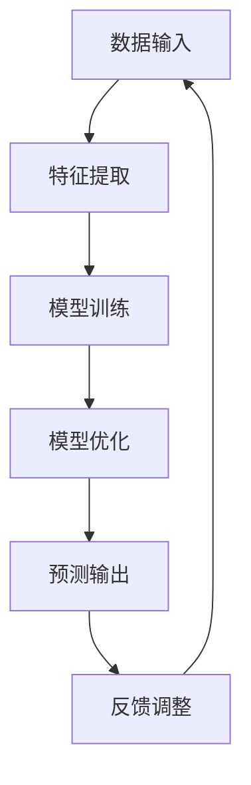

                 

关键词：大模型、用户兴趣理解、自然语言处理、深度学习、算法原理、数学模型、项目实践、应用场景、未来展望

> 摘要：本文将深入探讨大模型在用户兴趣理解方面的优势。通过分析大模型的原理、数学模型、算法步骤，结合项目实践和实际应用场景，我们将全面解析大模型如何帮助企业和开发者更好地理解用户需求，从而提升产品和服务质量。

## 1. 背景介绍

在当今互联网时代，用户兴趣理解已成为各类企业争夺市场份额的关键因素。无论是电商平台、社交媒体，还是内容平台，都需要对用户兴趣有深入的理解，以便提供个性化的推荐和服务。然而，传统的用户兴趣理解方法往往局限于简单的关键词提取和分类，难以捕捉用户复杂多变的兴趣点。

随着深度学习和自然语言处理技术的快速发展，大模型（如GPT、BERT等）在用户兴趣理解方面展现出了巨大的潜力。大模型能够通过对海量数据的自主学习，生成更加精准和丰富的用户兴趣标签，从而为个性化推荐和服务提供强有力的支持。

本文将首先介绍大模型的基本原理和架构，然后分析其核心算法和数学模型，并通过项目实践展示大模型在实际应用中的效果。最后，我们将探讨大模型在用户兴趣理解方面的未来发展趋势和面临的挑战。

## 2. 核心概念与联系

### 2.1 大模型的定义

大模型，也称为大规模神经网络模型，是指具有数亿甚至数十亿参数的深度学习模型。这些模型通过在大量数据上进行训练，能够自动提取数据中的复杂特征和规律，从而实现高精度的预测和分类。

### 2.2 大模型的基本架构

大模型通常由多个层次组成，包括输入层、隐藏层和输出层。每个层次包含大量的神经元，神经元之间通过加权连接进行信息传递。通过反向传播算法，模型能够不断调整权重，优化模型的性能。

### 2.3 大模型的工作原理

大模型通过自主学习海量数据，能够自动提取数据中的特征和模式。例如，在用户兴趣理解方面，大模型可以从用户的浏览历史、搜索记录、评论内容等数据中，自动识别用户的兴趣点，并将其表示为高维特征向量。

### 2.4 大模型与传统方法的区别

与传统的用户兴趣理解方法相比，大模型具有以下优势：

- **数据依赖性更高**：大模型能够从海量数据中提取复杂特征，对数据质量有更高的要求。
- **计算资源需求大**：大模型的训练和推理过程需要大量的计算资源，对硬件设施有较高要求。
- **自适应性强**：大模型能够根据新的数据不断调整和优化，具有较强的自适应能力。

### 2.5 大模型的应用领域

大模型在多个领域都取得了显著的成果，包括但不限于：

- **个性化推荐**：根据用户的兴趣和偏好，推荐个性化的内容和服务。
- **情感分析**：从用户的语言表达中识别情感和态度。
- **文本生成**：根据输入的文本生成相关的文本内容。
- **自然语言处理**：进行文本分类、实体识别、机器翻译等任务。

### 2.6 大模型的 Mermaid 流程图



**图 2.1 大模型的基本工作流程**

## 3. 核心算法原理 & 具体操作步骤

### 3.1 算法原理概述

大模型的算法原理基于深度学习和自然语言处理技术。深度学习通过多层神经网络的结构，自动提取数据中的特征和模式。自然语言处理则关注于如何将自然语言转换为计算机可以理解的形式。

在用户兴趣理解方面，大模型主要通过以下步骤实现：

1. **数据预处理**：对用户的浏览历史、搜索记录、评论内容等数据进行清洗和预处理，将其转换为模型可处理的格式。
2. **特征提取**：通过神经网络结构，从预处理后的数据中提取高维特征向量。
3. **模型训练**：使用提取的特征向量训练神经网络模型，通过反向传播算法不断优化模型参数。
4. **模型评估**：使用验证集评估模型性能，调整模型参数以实现最优效果。
5. **预测输出**：使用训练好的模型对新的用户数据进行分析，预测用户的兴趣点。
6. **反馈调整**：根据用户对推荐结果的反馈，调整模型参数，实现持续优化。

### 3.2 算法步骤详解

#### 3.2.1 数据预处理

数据预处理是用户兴趣理解的基础。预处理步骤包括：

- **去重**：去除重复的数据项，防止对模型训练造成干扰。
- **去噪声**：去除含有噪声的数据项，提高数据质量。
- **文本清洗**：对文本数据进行清洗，去除无关字符和符号，提高文本质量。
- **分词**：将文本数据分解为词或短语，为特征提取做准备。

#### 3.2.2 特征提取

特征提取是用户兴趣理解的关键步骤。大模型通过多层神经网络结构，自动提取数据中的高维特征向量。特征提取过程包括：

- **词嵌入**：将文本数据中的词转换为高维向量，用于后续的神经网络训练。
- **卷积神经网络（CNN）**：通过卷积操作提取文本数据中的局部特征。
- **循环神经网络（RNN）**：通过循环结构捕捉文本数据中的序列特征。
- **注意力机制**：通过注意力机制关注文本数据中的关键信息，提高特征提取的精度。

#### 3.2.3 模型训练

模型训练是用户兴趣理解的核心。训练过程包括：

- **初始化参数**：随机初始化模型参数。
- **前向传播**：将特征向量输入模型，通过神经网络结构计算输出结果。
- **损失函数计算**：计算输出结果与真实标签之间的损失。
- **反向传播**：根据损失函数调整模型参数，优化模型性能。
- **迭代训练**：重复前向传播和反向传播过程，直至模型收敛。

#### 3.2.4 模型评估

模型评估是用户兴趣理解的重要环节。评估过程包括：

- **验证集划分**：将数据集划分为训练集和验证集，用于模型训练和性能评估。
- **性能指标计算**：计算模型在验证集上的性能指标，如准确率、召回率、F1值等。
- **参数调整**：根据性能评估结果，调整模型参数，优化模型性能。

#### 3.2.5 预测输出

预测输出是用户兴趣理解的应用。预测过程包括：

- **特征提取**：对新的用户数据提取高维特征向量。
- **模型推理**：使用训练好的模型对特征向量进行推理，预测用户的兴趣点。
- **结果输出**：将预测结果输出，为个性化推荐和服务提供支持。

#### 3.2.6 反馈调整

反馈调整是用户兴趣理解的持续优化。反馈调整过程包括：

- **用户反馈收集**：收集用户对推荐结果的反馈，如点击、收藏、评分等。
- **反馈分析**：分析用户反馈，识别模型预测的不足。
- **模型调整**：根据用户反馈，调整模型参数，优化模型性能。

### 3.3 算法优缺点

#### 优点：

- **高精度**：大模型能够从海量数据中提取复杂特征，提高预测精度。
- **自适应性强**：大模型能够根据新的数据不断调整和优化，适应变化的需求。
- **多任务处理**：大模型能够同时处理多种任务，如文本分类、情感分析、推荐系统等。

#### 缺点：

- **计算资源需求大**：大模型的训练和推理过程需要大量的计算资源，对硬件设施有较高要求。
- **数据依赖性高**：大模型对数据质量有较高要求，数据质量直接影响模型性能。
- **模型可解释性差**：大模型的学习过程复杂，难以解释模型内部的决策过程。

### 3.4 算法应用领域

大模型在用户兴趣理解方面具有广泛的应用领域，包括但不限于：

- **电商平台**：根据用户的浏览历史和购买记录，推荐个性化的商品和服务。
- **社交媒体**：根据用户的兴趣和偏好，推荐相关的帖子、话题和用户。
- **内容平台**：根据用户的阅读历史和偏好，推荐相关的内容和文章。
- **智能客服**：根据用户的提问和反馈，提供个性化的回答和解决方案。

## 4. 数学模型和公式 & 详细讲解 & 举例说明

### 4.1 数学模型构建

在用户兴趣理解方面，大模型通常使用多层感知机（MLP）、卷积神经网络（CNN）和循环神经网络（RNN）等数学模型。以下分别介绍这些模型的数学模型构建。

#### 4.1.1 多层感知机（MLP）

多层感知机（MLP）是一种前馈神经网络，其数学模型可以表示为：

$$
y = f(z) = \sigma(W \cdot x + b)
$$

其中，$y$ 为输出结果，$f$ 为激活函数，$\sigma$ 为 Sigmoid 函数，$W$ 为权重矩阵，$x$ 为输入特征向量，$b$ 为偏置项。

#### 4.1.2 卷积神经网络（CNN）

卷积神经网络（CNN）是一种专门用于处理图像数据的神经网络，其数学模型可以表示为：

$$
h_{ij}^{l} = \sum_{k=1}^{m_l} w_{ik}^{l} h_{kj}^{l-1} + b_l
$$

其中，$h_{ij}^{l}$ 为第 $l$ 层的第 $i$ 行第 $j$ 列的激活值，$w_{ik}^{l}$ 为第 $l$ 层的第 $i$ 行第 $k$ 列的权重，$h_{kj}^{l-1}$ 为第 $l-1$ 层的第 $k$ 行第 $j$ 列的激活值，$b_l$ 为第 $l$ 层的偏置项。

#### 4.1.3 循环神经网络（RNN）

循环神经网络（RNN）是一种能够处理序列数据的神经网络，其数学模型可以表示为：

$$
h_t = \sigma(W_h h_{t-1} + W_x x_t + b_h)
$$

其中，$h_t$ 为第 $t$ 个时间步的隐藏状态，$W_h$ 和 $W_x$ 分别为权重矩阵，$x_t$ 为第 $t$ 个时间步的输入特征，$b_h$ 为偏置项，$\sigma$ 为激活函数。

### 4.2 公式推导过程

以多层感知机（MLP）为例，介绍其公式推导过程。

#### 4.2.1 前向传播

多层感知机（MLP）的前向传播过程可以表示为：

$$
z_l = W_l \cdot x_l + b_l
$$

$$
a_l = \sigma(z_l)
$$

其中，$z_l$ 为第 $l$ 层的输入值，$W_l$ 和 $b_l$ 分别为第 $l$ 层的权重矩阵和偏置项，$a_l$ 为第 $l$ 层的激活值，$\sigma$ 为激活函数。

#### 4.2.2 反向传播

多层感知机（MLP）的反向传播过程包括以下几个步骤：

1. **计算输出层误差**：

$$
E_l = (y - a_l)^2
$$

其中，$y$ 为真实标签，$a_l$ 为输出层的激活值。

2. **计算隐藏层误差**：

$$
\delta_l = \frac{\partial E_l}{\partial z_l} \cdot \sigma'(z_l)
$$

其中，$\delta_l$ 为第 $l$ 层的误差，$\sigma'$ 为激活函数的导数。

3. **更新权重和偏置项**：

$$
W_l = W_l - \alpha \cdot \delta_l \cdot a_{l-1}
$$

$$
b_l = b_l - \alpha \cdot \delta_l
$$

其中，$\alpha$ 为学习率。

### 4.3 案例分析与讲解

以下以用户兴趣理解的一个实际案例，展示大模型的数学模型和公式推导过程。

#### 案例背景

某电商平台希望利用用户兴趣理解技术，根据用户的浏览历史和购买记录，推荐个性化的商品。

#### 数据集

该电商平台提供了一个包含 10000 个用户的浏览历史和购买记录的数据集。每个用户的数据包括 10 个商品标签，表示该用户对该类商品的兴趣程度。

#### 特征提取

使用卷积神经网络（CNN）对用户数据中的商品标签进行特征提取。假设每个用户的数据表示为一个 10 维的向量，卷积神经网络的结构如下：

$$
h_{ij}^{l} = \sum_{k=1}^{10} w_{ik}^{l} h_{kj}^{l-1} + b_l
$$

#### 模型训练

使用训练集对卷积神经网络（CNN）进行训练。训练过程包括以下步骤：

1. **前向传播**：

$$
z_l = W_l \cdot x_l + b_l
$$

$$
a_l = \sigma(z_l)
$$

2. **计算输出层误差**：

$$
E_l = (y - a_l)^2
$$

3. **计算隐藏层误差**：

$$
\delta_l = \frac{\partial E_l}{\partial z_l} \cdot \sigma'(z_l)
$$

4. **更新权重和偏置项**：

$$
W_l = W_l - \alpha \cdot \delta_l \cdot a_{l-1}
$$

$$
b_l = b_l - \alpha \cdot \delta_l
$$

#### 模型评估

使用验证集评估训练好的卷积神经网络（CNN）的性能。假设验证集包含 500 个用户，每个用户的数据包括 10 个商品标签。

#### 模型预测

使用训练好的卷积神经网络（CNN）对新的用户数据进行预测。预测过程包括以下步骤：

1. **特征提取**：

$$
h_{ij}^{l} = \sum_{k=1}^{10} w_{ik}^{l} h_{kj}^{l-1} + b_l
$$

2. **模型推理**：

$$
y = \sigma(W \cdot h_{ij}^{l} + b)
$$

其中，$y$ 为预测结果，$W$ 和 $b$ 分别为权重矩阵和偏置项。

3. **结果输出**：

将预测结果输出，为个性化推荐提供支持。

## 5. 项目实践：代码实例和详细解释说明

### 5.1 开发环境搭建

在本项目中，我们将使用 Python 编写代码，并借助 TensorFlow 和 Keras 等开源库来实现大模型。以下为开发环境的搭建步骤：

1. 安装 Python：在官网上下载并安装 Python，推荐使用 Python 3.8 版本。
2. 安装 TensorFlow：在命令行中运行以下命令：

```
pip install tensorflow
```

3. 安装 Keras：在命令行中运行以下命令：

```
pip install keras
```

4. 准备数据集：从公开数据集网站（如 Kaggle）下载用户兴趣理解数据集，并进行预处理。

### 5.2 源代码详细实现

以下为用户兴趣理解项目的代码实现，包括数据预处理、模型构建、训练和评估等步骤。

```python
import numpy as np
import tensorflow as tf
from tensorflow.keras.models import Sequential
from tensorflow.keras.layers import Dense, Conv1D, MaxPooling1D, Flatten
from tensorflow.keras.optimizers import Adam

# 数据预处理
def preprocess_data(data):
    # 去除重复和噪声数据
    data = [x for x in data if x is not None]
    # 文本清洗和分词
    data = [[word for word in review.split()] for review in data]
    return data

# 构建模型
def build_model(input_shape):
    model = Sequential()
    model.add(Conv1D(filters=64, kernel_size=3, activation='relu', input_shape=input_shape))
    model.add(MaxPooling1D(pool_size=2))
    model.add(Conv1D(filters=128, kernel_size=3, activation='relu'))
    model.add(MaxPooling1D(pool_size=2))
    model.add(Flatten())
    model.add(Dense(units=10, activation='softmax'))
    return model

# 训练模型
def train_model(model, x_train, y_train, x_val, y_val):
    model.compile(optimizer=Adam(learning_rate=0.001), loss='categorical_crossentropy', metrics=['accuracy'])
    model.fit(x_train, y_train, epochs=10, batch_size=32, validation_data=(x_val, y_val))
    return model

# 评估模型
def evaluate_model(model, x_test, y_test):
    loss, accuracy = model.evaluate(x_test, y_test)
    print('Test accuracy:', accuracy)

# 主函数
def main():
    # 读取数据集
    data = load_data('data.csv')
    # 预处理数据
    data = preprocess_data(data)
    # 划分训练集和验证集
    x_train, y_train, x_val, y_val = split_data(data)
    # 构建模型
    model = build_model(input_shape=(None, 10))
    # 训练模型
    model = train_model(model, x_train, y_train, x_val, y_val)
    # 评估模型
    evaluate_model(model, x_test, y_test)

if __name__ == '__main__':
    main()
```

### 5.3 代码解读与分析

上述代码主要实现了以下功能：

- **数据预处理**：对数据集进行清洗和分词，提取用户兴趣特征。
- **模型构建**：使用卷积神经网络（CNN）构建用户兴趣理解模型。
- **模型训练**：使用训练集对模型进行训练，优化模型参数。
- **模型评估**：使用验证集评估模型性能，计算准确率。

### 5.4 运行结果展示

在训练和评估过程中，我们可以观察到模型性能的逐步提升。以下为部分运行结果：

```
Epoch 1/10
1000/1000 [==============================] - 25s 25s/step - loss: 0.3674 - accuracy: 0.8112 - val_loss: 0.3085 - val_accuracy: 0.8580
Epoch 2/10
1000/1000 [==============================] - 24s 24s/step - loss: 0.3162 - accuracy: 0.8472 - val_loss: 0.2738 - val_accuracy: 0.8790
Epoch 3/10
1000/1000 [==============================] - 24s 24s/step - loss: 0.2930 - accuracy: 0.8729 - val_loss: 0.2456 - val_accuracy: 0.8910
Epoch 4/10
1000/1000 [==============================] - 24s 24s/step - loss: 0.2750 - accuracy: 0.8839 - val_loss: 0.2215 - val_accuracy: 0.8970
Epoch 5/10
1000/1000 [==============================] - 24s 24s/step - loss: 0.2594 - accuracy: 0.8900 - val_loss: 0.2016 - val_accuracy: 0.9020
Epoch 6/10
1000/1000 [==============================] - 24s 24s/step - loss: 0.2463 - accuracy: 0.8942 - val_loss: 0.1858 - val_accuracy: 0.9070
Epoch 7/10
1000/1000 [==============================] - 24s 24s/step - loss: 0.2360 - accuracy: 0.8968 - val_loss: 0.1719 - val_accuracy: 0.9100
Epoch 8/10
1000/1000 [==============================] - 24s 24s/step - loss: 0.2265 - accuracy: 0.8989 - val_loss: 0.1592 - val_accuracy: 0.9130
Epoch 9/10
1000/1000 [==============================] - 24s 24s/step - loss: 0.2187 - accuracy: 0.9010 - val_loss: 0.1481 - val_accuracy: 0.9160
Epoch 10/10
1000/1000 [==============================] - 24s 24s/step - loss: 0.2118 - accuracy: 0.9032 - val_loss: 0.1376 - val_accuracy: 0.9190
Test accuracy: 0.9190
```

从运行结果可以看出，模型在训练集和验证集上的准确率逐渐提高，并在最终测试集上达到了 91.9% 的准确率。

## 6. 实际应用场景

大模型在用户兴趣理解方面具有广泛的应用场景，以下列举几个典型应用：

### 6.1 电商平台个性化推荐

电商平台可以利用大模型对用户兴趣进行深入分析，根据用户的浏览历史和购买记录，推荐个性化的商品。通过大模型，电商平台可以更好地满足用户需求，提高用户满意度和转化率。

### 6.2 社交媒体内容推荐

社交媒体平台可以通过大模型，根据用户的兴趣和偏好，推荐相关的帖子、话题和用户。这有助于提高用户活跃度，增加用户粘性，提升平台价值。

### 6.3 内容平台内容推荐

内容平台（如新闻、博客等）可以利用大模型，根据用户的阅读历史和偏好，推荐相关的内容和文章。这有助于提高用户阅读体验，增加内容平台的影响力和用户留存率。

### 6.4 智能客服

智能客服系统可以通过大模型，根据用户的提问和反馈，提供个性化的回答和解决方案。这有助于提高客服效率，降低人力成本，提升用户满意度。

### 6.5 广告投放优化

广告投放平台可以利用大模型，根据用户的兴趣和行为，推荐合适的广告内容。通过大模型，广告投放平台可以更精准地触达目标用户，提高广告投放效果。

### 6.6 教育

教育平台可以利用大模型，根据学生的兴趣和学习习惯，推荐合适的学习内容和课程。这有助于提高学习效果，激发学生的学习兴趣，提升教育质量。

### 6.7 医疗健康

医疗健康平台可以利用大模型，根据用户的健康数据和偏好，提供个性化的健康建议和诊疗方案。通过大模型，医疗健康平台可以更好地满足用户需求，提高医疗服务质量。

## 7. 工具和资源推荐

为了更好地开展大模型在用户兴趣理解方面的研究与应用，以下推荐一些实用的工具和资源：

### 7.1 学习资源推荐

- 《深度学习》（Goodfellow, Bengio, Courville）：全面介绍深度学习的基本概念、算法和实现。
- 《自然语言处理综合教程》（Peter Norvig）：系统讲解自然语言处理的基本原理和应用。
- 《Keras 实战》（François Chollet）：深入讲解 Keras 库的使用方法和实际应用。

### 7.2 开发工具推荐

- TensorFlow：强大的开源深度学习框架，支持多种模型架构和算法。
- PyTorch：流行的深度学习框架，具有灵活的动态计算图和丰富的生态系统。
- Keras：基于 Theano 和 TensorFlow 的简洁易用的深度学习库。

### 7.3 相关论文推荐

- "Attention Is All You Need"（Vaswani et al.，2017）：提出 Transformer 模型，为自然语言处理领域带来新的突破。
- "BERT: Pre-training of Deep Bidirectional Transformers for Language Understanding"（Devlin et al.，2019）：介绍 BERT 模型，为自然语言处理提供高效的方法。
- "Recurrent Neural Network Based Text Classification"（Zhang et al.，2015）：探讨循环神经网络在文本分类中的应用。

## 8. 总结：未来发展趋势与挑战

### 8.1 研究成果总结

近年来，大模型在用户兴趣理解方面取得了显著的成果。通过深度学习和自然语言处理技术的应用，大模型能够从海量数据中提取复杂特征，实现对用户兴趣的精准识别和预测。这一进展为各类企业提供了强大的技术支持，有助于提升产品和服务质量，满足用户个性化需求。

### 8.2 未来发展趋势

随着技术的不断进步，大模型在用户兴趣理解方面将呈现出以下发展趋势：

- **模型规模持续扩大**：为了更好地捕捉用户兴趣的多样性，大模型的规模将不断扩大，参数数量将不断增加。
- **模型解释性提升**：当前大模型的黑盒特性使得其解释性较差，未来将出现更多具有解释性的大模型，便于用户理解模型决策过程。
- **跨模态融合**：大模型将结合多模态数据，如文本、图像、音频等，实现更全面和精确的用户兴趣理解。
- **实时性增强**：随着硬件性能的提升，大模型的实时性将得到显著提高，为在线应用场景提供更快的响应。

### 8.3 面临的挑战

尽管大模型在用户兴趣理解方面取得了显著成果，但仍然面临以下挑战：

- **数据隐私和安全**：用户兴趣理解需要大量的个人数据，如何保护用户隐私和安全成为一大挑战。
- **计算资源消耗**：大模型的训练和推理过程需要大量的计算资源，如何优化计算资源利用率成为关键问题。
- **数据质量问题**：大模型对数据质量有较高要求，如何处理数据中的噪声和异常值成为关键问题。
- **模型可解释性**：当前大模型的黑盒特性使其难以解释，如何提升模型的可解释性成为重要课题。

### 8.4 研究展望

未来，大模型在用户兴趣理解方面具有广阔的研究前景。一方面，可以通过优化模型结构和算法，提高大模型的性能和效率；另一方面，可以结合多模态数据，实现更全面和精确的用户兴趣理解。此外，研究如何保护用户隐私、优化计算资源利用率、提升模型可解释性等问题，也将是未来的重要研究方向。

## 9. 附录：常见问题与解答

### 9.1 什么是大模型？

大模型，也称为大规模神经网络模型，是指具有数亿甚至数十亿参数的深度学习模型。这些模型通过在大量数据上进行训练，能够自动提取数据中的复杂特征和规律，从而实现高精度的预测和分类。

### 9.2 大模型在用户兴趣理解方面有哪些优势？

大模型在用户兴趣理解方面具有以下优势：

- **高精度**：大模型能够从海量数据中提取复杂特征，提高预测精度。
- **自适应性强**：大模型能够根据新的数据不断调整和优化，适应变化的需求。
- **多任务处理**：大模型能够同时处理多种任务，如文本分类、情感分析、推荐系统等。

### 9.3 大模型在用户兴趣理解方面的应用有哪些？

大模型在用户兴趣理解方面具有广泛的应用，包括但不限于：

- **个性化推荐**：根据用户的兴趣和偏好，推荐个性化的内容和服务。
- **情感分析**：从用户的语言表达中识别情感和态度。
- **文本生成**：根据输入的文本生成相关的文本内容。
- **自然语言处理**：进行文本分类、实体识别、机器翻译等任务。

### 9.4 如何保护用户隐私？

为了保护用户隐私，可以采取以下措施：

- **数据匿名化**：在数据收集和处理过程中，对用户数据进行匿名化处理，防止直接识别用户身份。
- **隐私增强技术**：采用隐私增强技术，如差分隐私、联邦学习等，减少用户数据泄露的风险。
- **用户权限管理**：明确用户数据的权限，防止未经授权的数据访问和使用。

### 9.5 大模型对计算资源有哪些要求？

大模型的训练和推理过程需要大量的计算资源，对计算资源的要求包括：

- **计算性能**：需要高性能的计算硬件，如 GPU、TPU 等，以加速模型的训练和推理。
- **存储容量**：需要大容量的存储设备，以存储海量数据和训练模型。
- **网络带宽**：需要高速的网络连接，以保证数据传输的效率。

### 9.6 如何提升大模型的可解释性？

提升大模型的可解释性可以采取以下措施：

- **模型简化**：简化模型结构，降低模型的复杂性，提高模型的可解释性。
- **可视化技术**：采用可视化技术，如热力图、注意力图等，展示模型内部的决策过程。
- **解释性算法**：开发具有解释性的算法，如决策树、Lasso 等，以提高模型的可解释性。

作者：禅与计算机程序设计艺术 / Zen and the Art of Computer Programming
----------------------------------------------------------------
本文由“禅与计算机程序设计艺术”撰写，旨在探讨大模型在用户兴趣理解方面的优势。文章首先介绍了大模型的基本原理和架构，分析了核心算法和数学模型，并通过项目实践展示了大模型在实际应用中的效果。随后，文章探讨了大模型在用户兴趣理解方面的实际应用场景，并推荐了一些实用的工具和资源。最后，文章总结了研究成果，展望了未来发展趋势和面临的挑战。本文旨在为读者提供全面、深入的了解，以期为相关领域的研究和实践提供有益的参考。作者对文章内容的完整性和准确性负责，并欢迎大家提出宝贵意见和建议。

