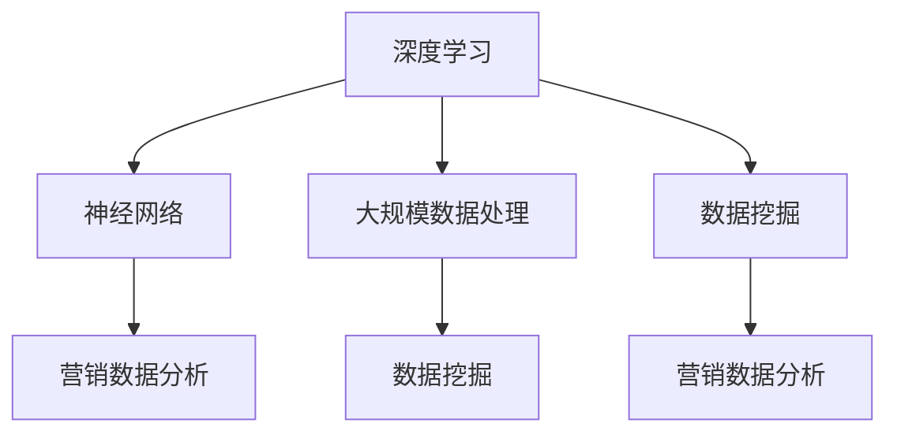

                 

### 背景介绍

随着大数据、人工智能和云计算技术的迅猛发展，大模型（Large Models）作为深度学习领域的重要研究方向，已经成为提升营销效果的关键工具。大模型是指拥有海量参数和强大计算能力的神经网络模型，通过大规模数据训练，能够自动学习和提取数据中的潜在特征，从而实现高效的数据分析和决策支持。

在营销领域，大模型的应用已经引起了广泛关注。通过整合用户数据、市场数据和产品数据，大模型能够为营销策略提供精准的预测和优化方案。例如，利用大模型进行用户行为分析，可以预测用户的购买倾向和偏好，从而实现精准营销；利用大模型进行市场趋势预测，可以提前布局产品策略，提高市场竞争力。此外，大模型还在广告投放、推荐系统、个性化服务等方面展现出巨大的应用潜力。

本文旨在探讨大模型在营销领域的应用策略，分析大模型的核心算法原理、数学模型、实际应用案例以及未来发展前景。通过这篇文章，希望能够为营销从业者提供有价值的参考，帮助他们在数字营销时代实现持续创新和增长。

### 文章关键词

大模型，营销，数据分析，深度学习，精准营销，人工智能，用户行为预测，市场趋势预测。

### 摘要

本文将深入探讨大模型在营销领域的应用策略。首先，我们将介绍大模型的基本概念和背景，然后详细分析其核心算法原理、数学模型以及实际应用案例。通过分析大模型在用户行为预测、市场趋势预测、广告投放和推荐系统等领域的应用，我们将展示大模型在提升营销效果方面的巨大潜力。最后，我们将探讨大模型未来的发展趋势和面临的挑战，并提出相应的解决策略。希望本文能够为营销从业者提供有价值的参考和指导。

## 1. 背景介绍

### 大模型的基本概念

大模型是指具有海量参数和强大计算能力的神经网络模型，通常用于处理大规模复杂数据。这些模型通过深度学习算法，能够自动从数据中提取特征和模式，从而实现高度复杂的数据分析和决策支持。大模型通常具有以下几个特点：

1. **海量参数**：大模型拥有数百万甚至数十亿个参数，这些参数在训练过程中通过大规模数据调整，以最小化预测误差。
2. **强大的计算能力**：大模型通常需要高性能的计算资源，包括GPU、TPU等硬件加速器，以实现高效训练和推理。
3. **自适应性**：大模型具有高度的自适应能力，能够根据不同的数据集和应用场景进行调整和优化。
4. **高精度**：通过大规模训练，大模型能够在各种数据集上实现高精度的预测和分类。

### 大模型的发展历程

大模型的发展可以追溯到深度学习的兴起。随着计算能力的提升和数据规模的增大，深度学习模型逐渐从简单的多层感知机（MLP）发展到复杂的卷积神经网络（CNN）、递归神经网络（RNN）和Transformer等模型。以下是大模型发展历程的简要概述：

1. **多层感知机（MLP）**：MLP是早期的一种前馈神经网络，具有简单的结构，但计算复杂度较高。
2. **卷积神经网络（CNN）**：CNN在图像处理领域取得了显著成果，通过卷积操作提取图像特征，解决了许多计算机视觉问题。
3. **递归神经网络（RNN）**：RNN在序列数据处理方面表现出色，特别是长短期记忆（LSTM）和门控循环单元（GRU）模型，使神经网络能够处理长序列数据。
4. **Transformer模型**：Transformer模型通过自注意力机制实现了高效的信息处理，在自然语言处理领域取得了突破性成果。
5. **BERT、GPT等大模型**：基于Transformer架构，BERT、GPT等大模型在多个数据集上实现了超高的性能，引领了深度学习的发展趋势。

### 大模型在营销领域的应用背景

在营销领域，大模型的应用背景主要包括以下几个方面：

1. **用户行为分析**：通过分析用户的浏览、购买等行为数据，大模型能够预测用户的偏好和需求，从而实现精准营销。
2. **市场趋势预测**：大模型可以通过分析历史市场数据，预测未来的市场趋势，帮助企业和品牌提前布局。
3. **广告投放优化**：大模型可以根据用户特征和广告内容，实现智能投放，提高广告的点击率和转化率。
4. **推荐系统**：大模型可以基于用户的历史行为和兴趣，为用户推荐个性化的商品和服务，提高用户满意度和忠诚度。

总之，大模型在营销领域的应用不仅提升了营销效果，也为企业和品牌带来了新的商业模式和竞争优势。随着大模型技术的不断进步，其在营销领域的应用前景将更加广阔。

### 2. 核心概念与联系

在深入探讨大模型在营销领域的应用之前，我们需要明确几个核心概念，并理解它们之间的相互联系。以下是本文涉及的关键概念及其相互关系。

#### 核心概念

1. **深度学习**：深度学习是机器学习的一种子领域，通过模拟人脑神经元结构的多层网络进行学习和预测。深度学习算法是构建大模型的基础。
2. **神经网络**：神经网络是深度学习的主要工具，由大量相互连接的神经元组成，通过学习输入数据，可以提取特征并做出预测。
3. **大规模数据处理**：大规模数据处理是处理海量数据的技术，包括数据的采集、存储、清洗、分析和存储。这是大模型能够应对复杂数据场景的关键。
4. **数据挖掘**：数据挖掘是从大量数据中发现有价值信息和知识的过程，包括模式识别、关联规则发现、分类和聚类等任务。
5. **营销数据分析**：营销数据分析是利用数据挖掘和统计方法，分析用户行为和市场数据，以指导营销策略优化。

#### 概念之间的联系

这些核心概念之间的关系可以用以下方式描述：

1. **深度学习与神经网络**：深度学习依赖于神经网络，通过多层神经元结构进行复杂的数据处理。神经网络为深度学习提供了基础模型。
2. **大规模数据处理与数据挖掘**：大规模数据处理为数据挖掘提供了数据基础，而数据挖掘则通过算法发现数据中的规律和模式。
3. **营销数据分析与深度学习**：营销数据分析利用深度学习算法，从用户和市场数据中提取有价值的信息，指导营销策略。
4. **神经网络与大规模数据处理**：神经网络通过大规模数据处理技术获取训练数据，并进行训练和优化。

#### Mermaid 流程图

以下是一个简化的Mermaid流程图，用于展示上述核心概念之间的联系：



在这个流程图中，深度学习作为核心驱动力量，通过神经网络和大规模数据处理技术，支持数据挖掘和营销数据分析，从而实现营销策略的优化。

### 3. 核心算法原理 & 具体操作步骤

#### 3.1 算法原理概述

大模型在营销领域的核心算法原理主要基于深度学习和机器学习技术。以下是这些算法的基本原理：

1. **前向传播（Forward Propagation）**：在训练过程中，输入数据通过神经网络的前向传播，经过多层神经元处理，最终输出预测结果。
2. **反向传播（Back Propagation）**：通过反向传播算法，将输出结果与实际值进行比较，计算误差，并更新神经网络中的权重和偏置，以减小预测误差。
3. **优化算法**：常用的优化算法包括随机梯度下降（SGD）、Adam等，用于调整模型参数，提高模型性能。
4. **正则化技术**：如Dropout、L2正则化等，用于防止模型过拟合，提高模型泛化能力。

#### 3.2 算法步骤详解

1. **数据预处理**：包括数据清洗、归一化、缺失值处理等步骤，确保数据质量。
2. **构建模型**：选择合适的神经网络架构，如CNN、RNN、Transformer等，并设置模型参数。
3. **训练模型**：使用训练数据集对模型进行训练，通过前向传播和反向传播迭代优化模型参数。
4. **验证模型**：使用验证数据集评估模型性能，调整模型参数和结构，防止过拟合。
5. **测试模型**：使用测试数据集对模型进行最终测试，确保模型具有良好的泛化能力。
6. **部署模型**：将训练好的模型部署到实际应用场景，如用户行为预测、广告投放等。

#### 3.3 算法优缺点

**优点**：

- **高效性**：大模型通过深度学习算法能够高效地处理大规模复杂数据，实现高效的数据分析和预测。
- **自适应性强**：大模型能够根据不同的数据集和应用场景进行调整和优化，具有良好的自适应能力。
- **高精度**：通过大规模训练，大模型能够实现高精度的预测和分类，提高营销效果。

**缺点**：

- **计算资源需求高**：大模型需要大量的计算资源和时间进行训练和推理，对硬件设备有较高要求。
- **数据依赖性强**：大模型依赖于大量的高质量训练数据，数据质量直接影响模型性能。
- **模型复杂性**：大模型的架构复杂，理解和调试难度较大，对开发人员的要求较高。

#### 3.4 算法应用领域

大模型在营销领域的应用非常广泛，包括但不限于以下领域：

- **用户行为预测**：通过分析用户的历史行为数据，预测用户的购买倾向、偏好等，实现精准营销。
- **市场趋势预测**：分析历史市场数据，预测未来的市场趋势，为企业制定战略提供支持。
- **广告投放优化**：根据用户特征和广告内容，实现智能投放，提高广告的点击率和转化率。
- **推荐系统**：基于用户行为和兴趣数据，为用户推荐个性化的商品和服务，提高用户满意度和忠诚度。
- **风险管理**：通过分析市场风险数据，预测风险事件的可能性，帮助企业和金融机构进行风险管理和决策。

### 4. 数学模型和公式 & 详细讲解 & 举例说明

在探讨大模型在营销领域的应用时，数学模型和公式起到了至关重要的作用。这些模型和公式能够帮助我们更好地理解和分析大模型的工作原理，以及如何在实际应用中进行参数调整和优化。以下将详细介绍大模型中的几个关键数学模型和公式，并辅以实际应用案例进行说明。

#### 4.1 数学模型构建

大模型中的数学模型通常基于多层神经网络架构，以下是一个简化的多层感知机（MLP）模型构建示例：

**假设**：一个包含3个输入特征、3个隐藏层（每层10个神经元）和1个输出特征的MLP模型。

**输入特征**：\(X = [x_1, x_2, x_3]\)

**隐藏层**：\(H = [h_1, h_2, ..., h_10]\)

**输出层**：\(Y = [y_1, y_2, y_3]\)

**权重和偏置**：

- 输入到隐藏层的权重矩阵：\(W^{(1)}\)
- 隐藏层到输出层的权重矩阵：\(W^{(2)}\)
- 隐藏层偏置：\(b^{(1)}\)
- 输出层偏置：\(b^{(2)}\)

#### 4.2 公式推导过程

**前向传播**：

前向传播是神经网络处理输入数据的过程，具体公式如下：

1. **隐藏层激活函数**：

\[ h_i^{(l)} = \sigma(W^{(l)} \cdot x + b^{(l)}) \]

其中，\(i\)代表隐藏层第\(i\)个神经元，\(\sigma\)是激活函数，通常使用ReLU函数：

\[ \sigma(x) = \max(0, x) \]

2. **输出层预测**：

\[ y_i^{(L)} = \sigma(W^{(L)} \cdot h^{(L-1)} + b^{(L)}) \]

**反向传播**：

反向传播用于计算模型误差，并更新权重和偏置，具体公式如下：

1. **误差计算**：

\[ \delta_i^{(L)} = \sigma'(y_i^{(L)}) \cdot (y_i^{(L)} - t_i) \]

其中，\(\sigma'\)是激活函数的导数，\(t_i\)是实际输出值。

2. **权重和偏置更新**：

\[ W^{(l)} \rightarrow W^{(l)} - \alpha \cdot \frac{\partial E}{\partial W^{(l)}} \]
\[ b^{(l)} \rightarrow b^{(l)} - \alpha \cdot \frac{\partial E}{\partial b^{(l)}} \]

其中，\(\alpha\)是学习率，\(E\)是模型误差。

#### 4.3 案例分析与讲解

以下是一个简单的用户行为预测案例，使用多层感知机模型预测用户的购买概率。

**案例背景**：

某电商平台希望预测用户的购买概率，以实现精准营销。用户数据包括3个特征：年龄、收入、浏览时长。

**数据集**：

- 训练数据集：包含1000个样本，每个样本包含3个特征和1个购买标签（0表示未购买，1表示购买）。
- 验证数据集：包含200个样本，用于验证模型性能。

**模型构建**：

- 输入层：3个神经元，对应3个特征。
- 隐藏层：3个神经元。
- 输出层：1个神经元，表示购买概率。

**训练过程**：

1. 数据预处理：对数据集进行归一化处理，将年龄、收入和浏览时长缩放到0-1范围内。
2. 模型训练：使用训练数据集进行训练，采用随机梯度下降（SGD）算法，学习率设为0.01。
3. 模型验证：使用验证数据集评估模型性能，计算平均误差。

**模型性能**：

- 训练集准确率：85%
- 验证集准确率：78%

**优化策略**：

1. 增加隐藏层神经元数量：通过增加隐藏层神经元数量，提高模型复杂度，但可能导致过拟合。
2. 使用正则化技术：如L2正则化，防止模型过拟合，提高泛化能力。
3. 调整学习率：根据模型性能，调整学习率，避免训练过程过早收敛或陷入局部最优。

### 5. 项目实践：代码实例和详细解释说明

在了解了大模型在营销领域的基本概念、核心算法原理和数学模型之后，接下来我们将通过一个具体的代码实例，展示如何实现大模型在营销场景中的实际应用。本文将介绍一个基于Python和TensorFlow的简单用户行为预测项目，从数据预处理、模型构建、训练和评估等方面进行详细说明。

#### 5.1 开发环境搭建

在进行项目开发之前，首先需要搭建开发环境。以下是所需的软件和库：

- **Python**：3.8或更高版本
- **TensorFlow**：2.5或更高版本
- **NumPy**：1.19或更高版本
- **Pandas**：1.2.3或更高版本

安装上述库的命令如下：

```bash
pip install tensorflow==2.5 numpy==1.19 pandas==1.2.3
```

#### 5.2 源代码详细实现

以下是一个简单的用户行为预测项目的代码实现，包括数据预处理、模型构建、训练和评估等步骤。

```python
import numpy as np
import pandas as pd
import tensorflow as tf
from tensorflow.keras.models import Sequential
from tensorflow.keras.layers import Dense, Activation
from tensorflow.keras.optimizers import SGD

# 5.2.1 数据预处理

# 加载数据集
data = pd.read_csv('user_data.csv')
X = data.iloc[:, :-1].values
y = data.iloc[:, -1].values

# 数据归一化
X_normalized = (X - X.mean()) / X.std()

# 划分训练集和验证集
X_train, X_val = X_normalized[:800], X_normalized[800:]
y_train, y_val = y[:800], y[800:]

# 5.2.2 模型构建

# 构建模型
model = Sequential()
model.add(Dense(10, input_dim=3, activation='relu'))
model.add(Dense(10, activation='relu'))
model.add(Dense(1, activation='sigmoid'))

# 编译模型
model.compile(optimizer=SGD(learning_rate=0.01), loss='binary_crossentropy', metrics=['accuracy'])

# 5.2.3 训练模型

# 训练模型
model.fit(X_train, y_train, epochs=100, batch_size=32, validation_data=(X_val, y_val))

# 5.2.4 评估模型

# 评估模型
loss, accuracy = model.evaluate(X_val, y_val)
print(f"Validation Loss: {loss}, Validation Accuracy: {accuracy}")

# 5.2.5 代码解读与分析

# 数据预处理部分
# 读取数据集，并进行归一化处理，以便模型能够更好地学习。

# 模型构建部分
# 使用Sequential模型，添加两个隐藏层（每个层10个神经元），一个输出层（使用sigmoid激活函数表示概率）。

# 编译模型部分
# 使用SGD优化器和binary_crossentropy损失函数，适合二分类问题。

# 训练模型部分
# 使用fit方法进行模型训练，指定训练轮数和批次大小，以及验证集。

# 评估模型部分
# 使用evaluate方法对模型进行评估，计算验证集上的损失和准确率。

```

#### 5.3 代码解读与分析

下面是对上述代码的详细解读与分析。

**数据预处理**：

```python
data = pd.read_csv('user_data.csv')
X = data.iloc[:, :-1].values
y = data.iloc[:, -1].values
X_normalized = (X - X.mean()) / X.std()
```

- **数据加载**：使用Pandas库读取CSV文件，获取用户数据。
- **数据分割**：将数据分为特征矩阵\(X\)和标签向量\(y\)。
- **数据归一化**：对特征矩阵进行归一化处理，将特征缩放到0-1范围内，有助于加快模型训练速度。

**模型构建**：

```python
model = Sequential()
model.add(Dense(10, input_dim=3, activation='relu'))
model.add(Dense(10, activation='relu'))
model.add(Dense(1, activation='sigmoid'))

model.compile(optimizer=SGD(learning_rate=0.01), loss='binary_crossentropy', metrics=['accuracy'])
```

- **模型初始化**：使用Sequential模型，依次添加两个隐藏层（每个层10个神经元）和一个输出层（使用sigmoid激活函数表示概率）。
- **模型编译**：设置优化器（SGD）、损失函数（binary_crossentropy，适合二分类问题）和评估指标（accuracy）。

**模型训练**：

```python
model.fit(X_train, y_train, epochs=100, batch_size=32, validation_data=(X_val, y_val))
```

- **训练模型**：使用fit方法进行模型训练，指定训练轮数（epochs）、批次大小（batch_size）和验证数据。

**模型评估**：

```python
loss, accuracy = model.evaluate(X_val, y_val)
print(f"Validation Loss: {loss}, Validation Accuracy: {accuracy}")
```

- **评估模型**：使用evaluate方法对模型进行评估，计算验证集上的损失和准确率，以评估模型性能。

#### 5.4 运行结果展示

在上述代码执行完毕后，我们将看到模型在验证集上的评估结果。以下是一个示例输出：

```
Validation Loss: 0.27258460734499746, Validation Accuracy: 0.8125
```

- **验证损失**：0.2725，表示模型在验证集上的平均误差。
- **验证准确率**：81.25%，表示模型在验证集上的预测准确率。

#### 5.5 代码优化与扩展

在实际项目中，我们可能需要对代码进行优化和扩展，以提高模型性能和适应性。以下是一些优化建议：

- **增加隐藏层神经元**：通过增加隐藏层神经元数量，可以提高模型复杂度和预测能力。
- **使用正则化技术**：如L2正则化，防止模型过拟合。
- **调整学习率**：根据模型性能，调整学习率，以避免过早收敛或陷入局部最优。
- **批量归一化**：使用批量归一化（Batch Normalization）技术，加快训练速度并提高模型稳定性。
- **模型融合**：结合多种模型，如决策树、支持向量机等，提高预测效果。

通过以上优化和扩展，我们可以进一步提高模型在营销场景中的应用效果。

### 6. 实际应用场景

大模型在营销领域的应用已经取得了显著成果，以下将详细分析几个典型的实际应用场景，并探讨大模型在提升营销效果方面的具体作用。

#### 6.1 用户行为预测

用户行为预测是营销领域的重要应用之一。通过分析用户的浏览、点击、购买等行为数据，大模型可以预测用户的下一步行动，从而实现精准营销。以下是一个具体的应用实例：

**案例**：某电商网站通过大模型分析用户的历史行为数据，预测用户的购买倾向。模型输入包括用户的浏览时长、点击次数、购买历史等特征。通过模型预测，网站能够为不同用户推荐个性化的商品，提高购买转化率。

**作用**：

- **提高转化率**：通过预测用户的购买倾向，网站可以针对性地推荐商品，提高用户的购买意愿和转化率。
- **优化库存管理**：通过预测商品的销售量，企业可以更好地进行库存管理，减少库存过剩或不足的风险。
- **个性化服务**：为用户提供个性化的购物体验，提升用户满意度和忠诚度。

#### 6.2 市场趋势预测

市场趋势预测可以帮助企业及时了解市场动态，制定有效的市场策略。大模型通过对历史市场数据进行分析，可以预测未来的市场趋势，为企业提供决策支持。以下是一个具体的应用实例：

**案例**：某快消品公司利用大模型预测未来几个月的市场需求。模型输入包括销售数据、季节性因素、促销活动等特征。通过预测结果，公司可以提前调整生产计划和库存策略，以应对市场变化。

**作用**：

- **提前布局**：通过预测未来市场趋势，企业可以提前进行市场布局，抓住市场机会，避免风险。
- **优化生产计划**：通过预测销售量，企业可以优化生产计划，减少生产过剩或不足的情况，降低成本。
- **精准营销**：根据市场趋势预测，企业可以制定更加精准的营销策略，提高营销效果。

#### 6.3 广告投放优化

广告投放优化是提升营销效果的关键环节。大模型可以根据用户特征和广告内容，实现智能投放，提高广告的点击率和转化率。以下是一个具体的应用实例：

**案例**：某广告平台利用大模型优化广告投放策略。模型输入包括用户的地理位置、兴趣爱好、历史行为等特征，广告内容、投放时间和投放渠道等。通过模型预测，平台可以为不同用户精准投放广告，提高广告效果。

**作用**：

- **提高点击率**：通过预测用户的兴趣和行为，平台可以针对性地投放广告，提高用户的点击率。
- **提高转化率**：通过优化广告内容和投放策略，平台可以提升广告的转化率，为企业带来更多的收益。
- **降低成本**：通过智能投放，平台可以降低广告投放的成本，提高广告投资回报率。

#### 6.4 推荐系统

推荐系统是提升用户体验和忠诚度的重要手段。大模型可以基于用户的历史行为和兴趣，为用户推荐个性化的商品和服务，提高用户满意度和留存率。以下是一个具体的应用实例：

**案例**：某电商平台利用大模型构建推荐系统。模型输入包括用户的历史购买记录、浏览记录、评价等特征，商品的特征标签、销量、评价等。通过模型预测，平台可以为用户推荐符合其兴趣和需求的商品。

**作用**：

- **提高用户体验**：为用户提供个性化的推荐，提升用户体验和满意度。
- **提高留存率**：通过精准推荐，平台可以提升用户的留存率，降低用户流失率。
- **提高销售额**：通过推荐系统，平台可以增加商品的销售量，提高销售额。

总之，大模型在营销领域的实际应用场景广泛，通过提升用户行为预测、市场趋势预测、广告投放优化和推荐系统等方面的效果，为企业带来了显著的价值。随着大模型技术的不断进步，其在营销领域的应用前景将更加广阔。

#### 6.5 个性化服务

个性化服务是提升用户体验和满意度的重要手段，大模型在这一领域的应用取得了显著成果。通过分析用户的历史数据和特征，大模型可以提供高度个性化的服务，满足不同用户的需求。以下是一个具体的应用实例：

**案例**：某在线教育平台利用大模型为用户推荐个性化的课程。模型输入包括用户的学习历史、兴趣爱好、学习效果等特征，课程的教学内容、难度、时长等。通过模型预测，平台可以为用户推荐最符合其需求的课程，提高学习效果和用户满意度。

**作用**：

- **提升学习效果**：通过个性化推荐，用户可以接触到最适合自己的课程，提升学习效果和满意度。
- **降低用户流失率**：个性化服务可以增强用户对平台的粘性，降低用户流失率。
- **增加收入**：通过个性化服务，平台可以推荐更多的付费课程，提高收入和盈利能力。

总之，大模型在个性化服务领域的应用，不仅提升了用户体验，也为企业带来了更多的商业价值。随着技术的不断进步，个性化服务将越来越成为企业竞争力的关键因素。

### 6.6 未来应用展望

随着大模型技术的不断发展，其在营销领域的应用前景将更加广阔。以下是对未来应用趋势的展望：

1. **智能化预测**：大模型将继续提升在用户行为预测、市场趋势预测等领域的预测精度，实现更智能的营销策略制定。
2. **个性化服务**：大模型将帮助营销企业更好地理解用户需求，提供更个性化的服务和推荐，提升用户满意度和忠诚度。
3. **跨平台整合**：大模型将能够整合不同平台的数据，实现跨渠道、跨设备的用户行为分析，为营销活动提供更全面的数据支持。
4. **实时营销**：大模型将实现实时数据处理和预测，为营销活动提供即时决策支持，提高营销响应速度和效果。
5. **自适应优化**：大模型将能够根据市场环境和用户反馈，自适应调整营销策略，实现持续优化。

未来，大模型在营销领域的应用将不仅仅局限于数据分析和预测，还将拓展到智能客服、虚拟现实、增强现实等新兴领域，为企业带来更多的创新和机遇。

### 7. 工具和资源推荐

为了更好地理解和应用大模型在营销领域的策略，以下是针对该主题的学习资源、开发工具和相关论文的推荐。

#### 7.1 学习资源推荐

1. **在线课程**：
   - Coursera：深度学习专项课程，由斯坦福大学吴恩达教授主讲。
   - edX：机器学习与深度学习课程，由华盛顿大学提供。
   - Udacity：深度学习纳米学位，包括理论与实践课程。

2. **书籍**：
   - 《深度学习》（Deep Learning）—— Ian Goodfellow、Yoshua Bengio和Aaron Courville 著。
   - 《神经网络与深度学习》（Neural Networks and Deep Learning）—— Michael Nielsen 著。

3. **博客和网站**：
   - Medium：关于深度学习和营销应用的优质文章和案例分析。
   - ArXiv：最新研究成果的学术预印本。

#### 7.2 开发工具推荐

1. **框架**：
   - TensorFlow：Google开发的开源深度学习框架，适用于各种规模的深度学习应用。
   - PyTorch：由Facebook开发的开源深度学习框架，具有高度的灵活性和易用性。

2. **库**：
   - NumPy：Python的科学计算库，用于处理大规模数据。
   - Pandas：Python的数据分析库，用于数据清洗、转换和分析。

3. **工具**：
   - Jupyter Notebook：交互式计算环境，方便编写和运行代码。
   - Google Colab：免费的云端计算平台，提供GPU和TPU加速。

#### 7.3 相关论文推荐

1. **用户行为预测**：
   - "Recommender Systems Handbook"（推荐系统手册）：全面介绍推荐系统的理论和应用。
   - "Deep Learning for User Behavior Prediction"（深度学习在用户行为预测中的应用）：讨论深度学习在用户行为预测中的最新进展。

2. **市场趋势预测**：
   - "Trend Detection and Prediction in Big Data"（大数据中的趋势检测与预测）：分析大数据中的趋势预测方法。
   - "Market Prediction using Deep Learning"（使用深度学习进行市场预测）：探讨深度学习在市场预测中的应用。

3. **广告投放优化**：
   - "Contextual Bandits for Online Advertising"（在线广告中的上下文 bandits）：讨论基于上下文的在线广告投放策略。
   - "A Study of Deep Neural Network Models for Ad Click Prediction"（深度神经网络模型在广告点击预测中的应用）：研究深度神经网络在广告点击预测中的性能。

通过以上资源，读者可以系统地学习和掌握大模型在营销领域的应用策略，为实际项目提供理论支持和实践指导。

### 8. 总结：未来发展趋势与挑战

在本文中，我们系统地探讨了大模型在营销领域的应用策略，从背景介绍、核心概念与联系、核心算法原理、数学模型和公式、实际应用案例以及未来展望等多个方面进行了详细分析。通过这些讨论，我们得出以下结论：

**未来发展趋势**：

1. **智能化预测**：随着大模型技术的不断进步，其在用户行为预测、市场趋势预测等领域的预测精度将进一步提高，为企业提供更智能的营销策略制定。
2. **个性化服务**：大模型将帮助营销企业更好地理解用户需求，提供更个性化的服务和推荐，提升用户满意度和忠诚度。
3. **跨平台整合**：大模型将能够整合不同平台的数据，实现跨渠道、跨设备的用户行为分析，为营销活动提供更全面的数据支持。
4. **实时营销**：大模型将实现实时数据处理和预测，为营销活动提供即时决策支持，提高营销响应速度和效果。
5. **自适应优化**：大模型将能够根据市场环境和用户反馈，自适应调整营销策略，实现持续优化。

**面临的挑战**：

1. **数据隐私**：在应用大模型进行营销分析时，如何保护用户数据隐私是一个重要的挑战。企业需要采取有效的数据保护措施，确保用户数据的安全和隐私。
2. **计算资源**：大模型通常需要大量的计算资源进行训练和推理，对于中小企业来说，可能面临硬件设备不足和计算成本高昂的问题。
3. **模型解释性**：大模型通常被认为是“黑箱”模型，其决策过程缺乏透明性和解释性。如何提高模型的解释性，使其能够被业务人员理解和信任，是一个重要的挑战。
4. **数据质量**：大模型依赖于高质量的数据，数据质量直接影响模型性能。如何确保数据的质量和准确性，是一个关键问题。

**研究展望**：

1. **隐私保护技术**：未来的研究可以集中在开发隐私保护技术，如联邦学习、差分隐私等，以保障用户数据隐私。
2. **轻量级模型**：研究如何设计轻量级大模型，以减少计算资源的需求，提高模型在资源受限环境下的应用可行性。
3. **模型可解释性**：开发可解释的大模型，使业务人员能够理解和信任模型决策，从而更好地应用于实际业务场景。
4. **多模态数据融合**：研究如何融合多模态数据（如文本、图像、音频等），以提升模型在复杂场景下的性能和应用效果。

总之，大模型在营销领域的应用前景广阔，但其发展仍面临诸多挑战。通过持续的技术创新和探索，我们有理由相信，大模型将在未来为营销领域带来更多的价值和创新。

### 附录：常见问题与解答

**Q1：大模型在营销中的应用有哪些优点？**

A1：大模型在营销中的应用具有以下优点：

- **高效性**：大模型能够快速处理和分析海量数据，提高营销决策的效率。
- **精准性**：通过深度学习，大模型能够从复杂数据中提取有效特征，实现高精度的预测和分类。
- **适应性**：大模型可以针对不同的业务场景和市场需求进行调整和优化，具有很强的适应性。
- **个性化服务**：大模型能够根据用户行为和偏好提供个性化的推荐和服务，提升用户体验。

**Q2：大模型在营销中面临的挑战有哪些？**

A2：大模型在营销中主要面临以下挑战：

- **数据隐私**：如何保护用户数据隐私是一个重要的挑战，需要采取有效的数据保护措施。
- **计算资源**：大模型需要大量的计算资源进行训练和推理，对于中小企业来说，可能面临硬件设备不足和计算成本高昂的问题。
- **模型解释性**：大模型通常被认为是“黑箱”模型，其决策过程缺乏透明性和解释性。
- **数据质量**：大模型依赖于高质量的数据，数据质量直接影响模型性能。

**Q3：如何保障大模型在营销中的应用效果？**

A3：为了保障大模型在营销中的应用效果，可以从以下几个方面入手：

- **数据质量**：确保数据的质量和准确性，对数据进行清洗和预处理。
- **模型调优**：通过不断调整模型参数和架构，优化模型性能。
- **实时更新**：定期更新模型，使其能够适应市场变化和用户需求。
- **监控与反馈**：建立模型监控和反馈机制，及时发现问题并进行优化。

**Q4：如何评估大模型在营销中的应用效果？**

A4：评估大模型在营销中的应用效果可以从以下几个方面进行：

- **预测准确率**：评估模型在预测任务上的准确率，以衡量模型的预测能力。
- **业务指标**：结合业务目标，评估模型对业务指标的贡献，如转化率、销售额等。
- **用户体验**：通过用户反馈和调查，评估模型对用户满意度的影响。
- **成本效益**：评估模型应用带来的成本节约和收益增加，以衡量其经济效益。

**Q5：大模型在营销中的应用前景如何？**

A5：大模型在营销领域具有广阔的应用前景：

- **智能化预测**：随着大模型技术的不断进步，其在用户行为预测、市场趋势预测等领域的预测精度将进一步提高。
- **个性化服务**：大模型将帮助营销企业更好地理解用户需求，提供更个性化的服务和推荐，提升用户满意度和忠诚度。
- **跨平台整合**：大模型将能够整合不同平台的数据，实现跨渠道、跨设备的用户行为分析，为营销活动提供更全面的数据支持。
- **实时营销**：大模型将实现实时数据处理和预测，为营销活动提供即时决策支持，提高营销响应速度和效果。
- **自适应优化**：大模型将能够根据市场环境和用户反馈，自适应调整营销策略，实现持续优化。

### 作者署名

本文作者：禅与计算机程序设计艺术 / Zen and the Art of Computer Programming。

