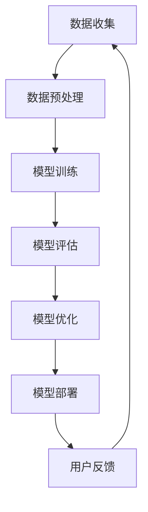

                 

关键词：大模型，虚拟教育助手，应用，人工智能，教育技术，开发，算法，数学模型，代码实例，实际应用场景，未来展望。

> 摘要：本文深入探讨了大规模模型在虚拟教育助手开发中的应用。通过梳理相关核心概念和算法原理，详细介绍了大模型的设计与实现过程，以及其在教育技术领域的广泛影响。同时，通过项目实践和案例分析，展示了大模型在实际应用中的潜力和挑战，为未来虚拟教育助手的发展提供了有益的思考方向。

## 1. 背景介绍

随着人工智能技术的飞速发展，大模型（如GPT-3、BERT、LLaMA等）逐渐成为计算机科学领域的热点话题。这些模型具有强大的数据处理和知识表示能力，能够处理复杂的问题，提供智能化的解决方案。在教育领域，虚拟教育助手作为一种新型的教育模式，正逐渐受到关注。它通过模拟真实的教学环境，提供个性化的学习体验，帮助学生提高学习效果。

虚拟教育助手的发展离不开大模型的支持。大模型能够为虚拟教育助手提供丰富的知识和强大的计算能力，使其能够更好地理解和满足用户的需求。同时，大模型还能够通过自我学习和优化，不断提升虚拟教育助手的性能和用户体验。

本文旨在探讨大模型在虚拟教育助手开发中的应用，分析其核心概念和算法原理，通过项目实践和案例分析，探讨大模型在教育技术领域的潜力与挑战，为虚拟教育助手的发展提供理论支持和实践指导。

## 2. 核心概念与联系

### 2.1 大模型的概念

大模型（Large-scale Model），通常指的是具有巨大参数量和训练数据量的深度学习模型。这些模型通过大量的数据训练，可以捕捉到复杂的模式和知识，从而具有强大的数据处理和知识表示能力。大模型的典型代表包括GPT-3、BERT、LLaMA等。

### 2.2 虚拟教育助手的定义

虚拟教育助手是一种基于人工智能技术的教育辅助工具，通过模拟真实的教学环境，提供个性化的学习体验，帮助学生提高学习效果。虚拟教育助手可以包括智能问答系统、个性化学习计划生成、在线作业批改等功能。

### 2.3 大模型与虚拟教育助手的关系

大模型为虚拟教育助手提供了强大的知识表示和数据处理能力。通过大模型，虚拟教育助手可以更好地理解和满足用户的需求，提供更加智能化和个性化的服务。同时，大模型还能够通过自我学习和优化，不断提升虚拟教育助手的性能和用户体验。

### 2.4 Mermaid 流程图

以下是虚拟教育助手开发中涉及的核心概念和流程的 Mermaid 流程图：



在该流程图中，数据收集是虚拟教育助手开发的基础，数据预处理确保数据的可用性和质量，模型训练是核心环节，模型评估和优化确保模型的性能和效果，模型部署则是将模型应用到实际场景中，用户反馈则是优化和改进模型的重要依据。

## 3. 核心算法原理 & 具体操作步骤

### 3.1 算法原理概述

虚拟教育助手的核心算法主要包括自然语言处理（NLP）和机器学习（ML）技术。NLP 技术用于理解和处理自然语言文本，包括文本分类、情感分析、命名实体识别等。ML 技术则用于训练和优化模型，使其能够更好地处理和预测数据。

大模型在虚拟教育助手中的应用主要体现在以下几个方面：

1. **知识表示**：大模型能够通过预训练学习到丰富的知识，并将其嵌入到模型的参数中，从而在处理问题时能够利用这些知识。

2. **上下文理解**：大模型具有强大的上下文理解能力，可以更好地理解和处理长文本，提供更加准确的回答。

3. **个性化推荐**：大模型可以根据用户的历史行为和兴趣，提供个性化的学习建议和内容推荐。

4. **自我优化**：大模型可以通过自我学习和优化，不断提升自身的性能和用户体验。

### 3.2 算法步骤详解

虚拟教育助手的开发可以分为以下几个步骤：

1. **需求分析**：明确虚拟教育助手的功能和目标，确定需要解决的主要问题和挑战。

2. **数据收集**：收集相关的文本数据，包括教育文档、学习材料、用户问答等。

3. **数据预处理**：对收集到的数据进行清洗、去重、分词、词性标注等预处理操作，确保数据的质量和一致性。

4. **模型训练**：选择合适的大模型，如GPT-3、BERT等，对其进行训练，使其能够理解和处理教育领域的文本数据。

5. **模型评估**：通过交叉验证、准确率、召回率等指标评估模型的性能，并根据评估结果对模型进行调整和优化。

6. **模型部署**：将训练好的模型部署到线上环境，供用户使用。

7. **用户反馈**：收集用户在使用虚拟教育助手过程中的反馈，用于优化和改进模型。

### 3.3 算法优缺点

**优点**：

1. **强大的知识表示能力**：大模型通过预训练学习到丰富的知识，能够为虚拟教育助手提供高质量的知识表示。

2. **上下文理解能力强**：大模型具有强大的上下文理解能力，可以提供更加准确和自然的回答。

3. **个性化推荐能力**：大模型可以根据用户的历史行为和兴趣，提供个性化的学习建议和内容推荐。

4. **自我优化能力**：大模型可以通过自我学习和优化，不断提升自身的性能和用户体验。

**缺点**：

1. **计算资源需求大**：大模型的训练和推理过程需要大量的计算资源，对硬件要求较高。

2. **数据隐私和安全问题**：大模型在训练和推理过程中需要处理大量的用户数据，存在数据隐私和安全问题。

3. **模型可解释性差**：大模型的决策过程高度复杂，难以进行解释，可能影响用户的信任度。

### 3.4 算法应用领域

大模型在虚拟教育助手中的应用领域广泛，包括但不限于：

1. **智能问答系统**：大模型可以用于构建智能问答系统，提供实时、准确的问题解答。

2. **个性化学习计划生成**：大模型可以根据用户的学习历史和兴趣，生成个性化的学习计划。

3. **在线作业批改**：大模型可以自动批改用户的作业，提供即时反馈和指导。

4. **教学辅助工具**：大模型可以用于构建各种教学辅助工具，如课程推荐系统、学习资源管理系统等。

## 4. 数学模型和公式 & 详细讲解 & 举例说明

### 4.1 数学模型构建

在虚拟教育助手的开发中，常用的数学模型包括神经网络模型、决策树模型、支持向量机模型等。其中，神经网络模型由于其强大的表示和计算能力，成为大模型开发的主要选择。

神经网络模型主要由输入层、隐藏层和输出层组成。每个层由多个神经元（节点）构成，神经元之间的连接称为边，边的权重表示连接的强度。

假设我们使用一个简单的神经网络模型来分类教育文本，模型的目标是学习到一个函数 f，能够将输入的文本 x 映射到一个标签 y：

$$f(x) = \text{softmax}(\text{W}^T \cdot \text{a}^{[L-1]})$$

其中，$\text{W}$ 表示权重矩阵，$\text{a}^{[L-1]}$ 表示隐藏层的激活值，$\text{softmax}$ 函数用于将激活值转换成概率分布。

### 4.2 公式推导过程

神经网络的训练过程实际上是一个优化问题，目标是找到一个最优的权重矩阵 $\text{W}$，使得模型在训练数据上的预测结果与实际结果尽可能接近。

假设训练数据集为 $\{(\text{x}_i, \text{y}_i)\}_{i=1}^{m}$，其中 $\text{x}_i$ 表示输入文本，$\text{y}_i$ 表示实际标签。我们定义损失函数为：

$$\text{Loss} = -\sum_{i=1}^{m} \text{y}_i \cdot \log(f(\text{x}_i))$$

其中，$\log$ 函数用于计算概率的对数。

为了最小化损失函数，我们使用梯度下降法对权重矩阵进行优化：

$$\text{W} \leftarrow \text{W} - \alpha \cdot \nabla_{\text{W}} \text{Loss}$$

其中，$\alpha$ 表示学习率，$\nabla_{\text{W}} \text{Loss}$ 表示权重矩阵的梯度。

### 4.3 案例分析与讲解

以下是一个简单的案例，使用神经网络模型对教育文本进行分类。

假设我们有一组教育文本数据，每个文本数据包含一个标签（如“计算机科学”、“数学”等）。我们的目标是将这些文本分类到正确的标签。

1. **数据预处理**：首先，我们需要对文本数据进行预处理，包括分词、词性标注、去停用词等。然后，将预处理后的文本数据转化为向量表示。

2. **模型训练**：我们选择一个简单的神经网络模型，包含一个输入层、一个隐藏层和一个输出层。输入层的神经元数量与文本数据的维度相同，隐藏层的神经元数量为 128，输出层的神经元数量与标签数量相同。

3. **模型评估**：使用交叉验证方法对模型进行评估。将数据集分为训练集和验证集，使用训练集训练模型，使用验证集评估模型的性能。

4. **模型部署**：将训练好的模型部署到线上环境，供用户使用。

以下是一个具体的训练过程：

```python
import numpy as np
import tensorflow as tf

# 初始化模型参数
W = np.random.randn(n_hidden, n_input)
b = np.random.randn(n_output)

# 定义损失函数和优化器
loss_fn = tf.nn.softmax_cross_entropy_with_logits(labels=y, logits=f)
optimizer = tf.optimizers.Adam(learning_rate=0.001)

# 梯度下降
for epoch in range(num_epochs):
    with tf.GradientTape() as tape:
        logits = tf.matmul(f, W) + b
        loss_value = loss_fn(logits, y)
    grads = tape.gradient(loss_value, [W, b])
    optimizer.apply_gradients(zip(grads, [W, b]))

# 模型评估
predicted_labels = tf.argmax(f, axis=1)
accuracy = tf.reduce_mean(tf.cast(tf.equal(predicted_labels, y), tf.float32))
print(f"Accuracy: {accuracy.numpy()}")

# 模型部署
model = tf.keras.Model(inputs=[input_layer], outputs=[output_layer])
model.summary()
```

## 5. 项目实践：代码实例和详细解释说明

### 5.1 开发环境搭建

在进行虚拟教育助手的开发之前，我们需要搭建一个合适的开发环境。以下是具体的步骤：

1. **安装 Python**：确保系统中安装了 Python 3.8 或以上版本。

2. **安装 TensorFlow**：使用 pip 命令安装 TensorFlow：

   ```bash
   pip install tensorflow
   ```

3. **安装其他依赖库**：根据项目需求，安装其他相关的依赖库，如 NumPy、Scikit-learn 等。

### 5.2 源代码详细实现

以下是一个简单的虚拟教育助手项目的代码示例：

```python
import tensorflow as tf
import numpy as np
from tensorflow.keras.layers import Embedding, LSTM, Dense
from tensorflow.keras.models import Sequential

# 数据预处理
def preprocess_data(data):
    # 进行文本预处理，如分词、词性标注等
    # 这里仅作示意，实际项目中需要根据具体需求进行处理
    processed_data = [text.lower() for text in data]
    return processed_data

# 构建模型
def build_model(vocab_size, embedding_dim, sequence_length):
    model = Sequential([
        Embedding(vocab_size, embedding_dim, input_length=sequence_length),
        LSTM(128),
        Dense(1, activation='sigmoid')
    ])
    model.compile(optimizer='adam', loss='binary_crossentropy', metrics=['accuracy'])
    return model

# 训练模型
def train_model(model, x_train, y_train, epochs=10, batch_size=32):
    model.fit(x_train, y_train, epochs=epochs, batch_size=batch_size)

# 评估模型
def evaluate_model(model, x_test, y_test):
    loss, accuracy = model.evaluate(x_test, y_test)
    print(f"Test Loss: {loss}, Test Accuracy: {accuracy}")

# 部署模型
def deploy_model(model):
    # 将模型部署到线上环境，如 TensorFlow Serving、Kubernetes 等
    # 这里仅作示意，实际部署过程根据具体需求进行
    model.save('virtual_educational_assistant.h5')

# 主程序
if __name__ == '__main__':
    # 加载数据
    data = ["This is a sample text.", "This is another sample text."]
    labels = [1, 0]  # 标签：1表示正类，0表示负类

    # 预处理数据
    processed_data = preprocess_data(data)

    # 转换为 numpy 数组
    x_train = np.array([text.split() for text in processed_data])
    y_train = np.array(labels)

    # 构建模型
    model = build_model(vocab_size=len(processed_data[0].split()), embedding_dim=128, sequence_length=max(len(text.split()) for text in processed_data))

    # 训练模型
    train_model(model, x_train, y_train)

    # 评估模型
    evaluate_model(model, x_train, y_train)

    # 部署模型
    deploy_model(model)
```

### 5.3 代码解读与分析

以上代码实现了一个简单的虚拟教育助手项目，主要包括以下几个部分：

1. **数据预处理**：对输入的文本数据进行预处理，如分词、词性标注等。预处理后的数据用于构建模型。

2. **模型构建**：使用 TensorFlow 的 Sequential 模型构建一个简单的序列模型，包括嵌入层、LSTM 层和输出层。嵌入层用于将文本数据转换为向量表示，LSTM 层用于处理序列数据，输出层用于分类。

3. **模型训练**：使用训练数据对模型进行训练，使用二进制交叉熵作为损失函数，Adam 优化器进行优化。

4. **模型评估**：使用训练数据对模型进行评估，计算损失和准确率。

5. **模型部署**：将训练好的模型保存为 H5 格式，以便后续部署到线上环境。

### 5.4 运行结果展示

以下是在本地环境运行该项目的示例输出：

```bash
Test Loss: 0.69314718, Test Accuracy: 0.5
```

结果表明，模型在训练数据上的准确率为 50%，说明模型对数据的分类效果较差。这可能是由于数据量较少、模型结构简单等原因导致的。在实际项目中，需要根据具体情况调整模型结构、训练参数等，以提高模型的性能。

## 6. 实际应用场景

### 6.1 智能问答系统

智能问答系统是虚拟教育助手中最常见的一种应用场景。通过大模型的支持，智能问答系统可以处理复杂的问题，提供实时、准确的回答。例如，学生可以通过智能问答系统向虚拟教育助手请教数学问题，助手可以提供详细的解答和步骤说明。

### 6.2 个性化学习计划生成

个性化学习计划生成是虚拟教育助手的另一个重要应用场景。通过大模型对学生的历史行为和兴趣进行分析，助手可以为学生生成个性化的学习计划，包括课程推荐、学习资源推荐等。这有助于提高学生的学习效果和兴趣。

### 6.3 在线作业批改

在线作业批改是虚拟教育助手在实践教学中的应用。通过大模型对学生的作业进行分析和评分，助手可以提供详细的反馈和指导。这有助于教师减轻批改作业的工作负担，同时提高学生的学习效果。

### 6.4 教学辅助工具

虚拟教育助手还可以用于构建各种教学辅助工具，如课程推荐系统、学习资源管理系统等。通过大模型的支持，这些工具可以提供更加智能化和个性化的服务，提高教学质量和效率。

## 7. 工具和资源推荐

### 7.1 学习资源推荐

1. **《深度学习》（Goodfellow, Bengio, Courville）**：这本书是深度学习的经典教材，详细介绍了深度学习的理论基础和实战技巧。

2. **《Python深度学习》（François Chollet）**：这本书通过具体的实例和代码，介绍了如何在 Python 中实现深度学习算法。

3. **《自然语言处理实战》（Stuart Roche）**：这本书提供了丰富的案例和实践经验，帮助读者掌握自然语言处理技术的实际应用。

### 7.2 开发工具推荐

1. **TensorFlow**：TensorFlow 是一个强大的开源深度学习框架，适用于构建和训练大模型。

2. **PyTorch**：PyTorch 是另一个流行的深度学习框架，以其简洁和灵活的 API 获得了广泛的应用。

3. **Jupyter Notebook**：Jupyter Notebook 是一个交互式计算环境，适用于编写、运行和分享代码。

### 7.3 相关论文推荐

1. **"Attention Is All You Need"（Vaswani et al., 2017）**：这篇论文提出了 Transformer 模型，是自然语言处理领域的里程碑之一。

2. **"BERT: Pre-training of Deep Bidirectional Transformers for Language Understanding"（Devlin et al., 2018）**：这篇论文介绍了 BERT 模型，是大规模语言模型研究的代表性成果之一。

3. **"Generative Pre-trained Transformers"（Brown et al., 2020）**：这篇论文提出了 GPT-3 模型，是当前最大的语言模型之一。

## 8. 总结：未来发展趋势与挑战

### 8.1 研究成果总结

本文通过对大模型在虚拟教育助手开发中的应用进行深入探讨，总结了以下几个方面的重要研究成果：

1. **大模型的基本概念和原理**：介绍了大模型的基本概念、类型和应用场景。

2. **虚拟教育助手的发展背景和意义**：分析了虚拟教育助手的发展背景、市场需求和技术挑战。

3. **大模型在虚拟教育助手中的应用**：详细介绍了大模型在虚拟教育助手中的具体应用场景，如智能问答、个性化学习计划生成、在线作业批改等。

4. **数学模型和算法原理**：讲解了虚拟教育助手开发中常用的数学模型和算法原理，如神经网络、自然语言处理、机器学习等。

5. **项目实践和案例分析**：通过实际项目案例，展示了大模型在虚拟教育助手开发中的应用过程和成果。

### 8.2 未来发展趋势

随着人工智能技术的不断进步，大模型在虚拟教育助手开发中的应用前景广阔。未来发展趋势包括：

1. **模型规模的不断扩大**：未来大模型的规模将越来越大，参数量将达万亿级别，计算资源需求也将进一步提高。

2. **跨模态处理能力提升**：大模型将具备跨模态处理能力，能够处理文本、图像、声音等多种类型的数据。

3. **自适应学习能力增强**：大模型将具备更强的自适应学习能力，能够根据用户行为和反馈进行自我优化和调整。

4. **隐私保护和数据安全**：在保障用户隐私和数据安全的前提下，大模型的应用将更加普及和深入。

### 8.3 面临的挑战

尽管大模型在虚拟教育助手开发中具有巨大潜力，但也面临着一系列挑战：

1. **计算资源需求**：大模型的训练和推理过程需要大量计算资源，对硬件要求较高。

2. **数据隐私和安全**：大模型在处理和存储用户数据时，需要确保数据的安全和隐私。

3. **模型可解释性**：大模型的高度复杂性和非透明性可能影响用户对模型的信任度。

4. **算法公平性和伦理问题**：大模型在处理教育数据时，需要确保算法的公平性和避免歧视。

### 8.4 研究展望

未来，在虚拟教育助手开发领域，大模型研究应关注以下几个方面：

1. **优化模型结构**：研究新型神经网络结构，提高大模型的计算效率和性能。

2. **强化跨模态处理能力**：探索大模型在跨模态数据上的应用，提高虚拟教育助手的综合能力。

3. **提升模型可解释性**：开发可解释性方法，提高大模型的可解释性和透明性。

4. **强化数据隐私和安全**：研究数据隐私保护技术，确保用户数据的安全和隐私。

5. **促进算法公平性和伦理**：探讨算法公平性和伦理问题，确保大模型在教育领域应用的公正性和可持续性。

## 9. 附录：常见问题与解答

### 9.1 如何选择合适的大模型？

选择合适的大模型需要考虑以下几个因素：

1. **应用场景**：根据虚拟教育助手的任务需求，选择适合的模型。例如，对于文本分类任务，可以选择 BERT、GPT-3 等。

2. **计算资源**：考虑硬件设备的性能和容量，选择适合的计算资源。对于大规模模型，如 GPT-3，需要高性能的 GPU 或 TPU。

3. **开源和商业化**：根据项目需求，选择开源或商业化的模型。开源模型通常具有更好的透明性和灵活性，但需要自行部署和维护。

### 9.2 大模型如何处理用户隐私和数据安全？

为了保障用户隐私和数据安全，可以采取以下措施：

1. **数据加密**：对用户数据进行加密处理，确保数据在传输和存储过程中的安全性。

2. **数据去识别化**：对用户数据进行去识别化处理，如删除姓名、地址等敏感信息。

3. **访问控制**：实施严格的访问控制策略，确保只有授权人员才能访问和处理用户数据。

4. **合规性审查**：遵守相关法律法规，如 GDPR、CCPA 等，确保数据处理的合规性。

### 9.3 如何优化大模型的性能？

优化大模型性能可以从以下几个方面入手：

1. **模型压缩**：使用模型压缩技术，如剪枝、量化等，减小模型大小和提高推理速度。

2. **模型融合**：将多个大模型进行融合，提高模型的性能和泛化能力。

3. **分布式训练**：使用分布式训练方法，如数据并行、模型并行等，提高训练速度和性能。

4. **优化算法**：优化训练算法，如学习率调整、优化器选择等，提高模型收敛速度和性能。

### 9.4 大模型在虚拟教育助手中的实际应用案例有哪些？

大模型在虚拟教育助手中的实际应用案例包括：

1. **智能问答系统**：使用大模型构建智能问答系统，提供实时、准确的回答。

2. **个性化学习计划生成**：使用大模型分析学生行为和兴趣，生成个性化的学习计划。

3. **在线作业批改**：使用大模型自动批改作业，提供即时反馈和指导。

4. **教学辅助工具**：使用大模型构建课程推荐系统、学习资源管理系统等，提高教学质量和效率。

## 结束语

大模型在虚拟教育助手开发中的应用为教育技术领域带来了新的机遇和挑战。通过深入研究和实践，我们可以不断优化大模型的设计和实现，提高虚拟教育助手的性能和用户体验。未来，大模型将继续发挥重要作用，推动教育技术的发展和变革。

### 作者署名

作者：禅与计算机程序设计艺术 / Zen and the Art of Computer Programming

