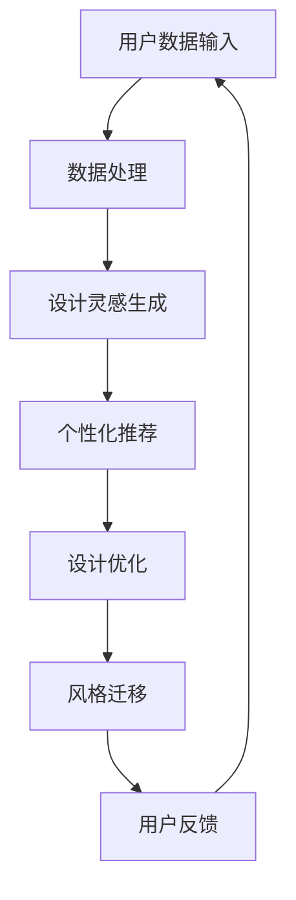

                 

关键词：大模型、虚拟时装设计师、人工智能、时尚设计、个性化推荐

摘要：随着人工智能技术的飞速发展，大模型在多个领域展现了其强大的潜力，特别是在虚拟时装设计师的开发中。本文将探讨大模型在虚拟时装设计师开发中的应用前景，从核心概念、算法原理、数学模型、项目实践和未来展望等方面进行深入分析，旨在为时尚行业的数字化转型提供新的思路。

## 1. 背景介绍

在时尚设计领域，传统的设计流程通常耗时较长，设计师需要投入大量的时间和精力进行设计、修改和迭代。然而，随着消费者个性化需求的不断增加，传统的设计方法已经难以满足市场的需求。同时，随着人工智能技术的不断进步，特别是大模型的广泛应用，为时尚设计领域带来了新的机遇。

大模型，特别是深度学习模型，具有处理海量数据、自主学习、自适应调整等特点，这些特点使得大模型在虚拟时装设计师的开发中具有显著的优势。例如，大模型可以快速分析消费者的购物行为、时尚偏好，从而为设计师提供有针对性的设计建议，提高设计的效率和准确性。

## 2. 核心概念与联系

### 2.1 大模型的定义与原理

大模型通常是指具有数亿甚至数十亿参数的深度学习模型。这些模型可以通过大量的数据训练，从而实现高度复杂的任务。大模型的原理主要基于神经网络，特别是深度神经网络（DNN）。DNN通过多层神经元的堆叠，可以模拟人类大脑的信息处理方式，实现数据的自动特征提取和模式识别。

### 2.2 虚拟时装设计师的概念

虚拟时装设计师是一种基于人工智能技术的虚拟角色，它可以模拟真实设计师的工作流程，包括设计草图、服装款式设计、面料选择、色彩搭配等。虚拟时装设计师通过分析用户的个性化需求和时尚趋势，为用户生成个性化的服装设计方案。

### 2.3 大模型与虚拟时装设计师的关联

大模型在虚拟时装设计师开发中的应用主要体现在以下几个方面：

1. **设计灵感生成**：大模型可以通过学习大量的时尚图像和文字描述，生成新的设计灵感，为设计师提供创意支持。
2. **个性化推荐**：大模型可以分析用户的购物记录、社交媒体行为等数据，为用户提供个性化的服装推荐。
3. **设计优化**：大模型可以基于用户的反馈，对设计方案进行优化，提高设计的满意度和实用性。
4. **风格迁移**：大模型可以将一种风格的设计迁移到另一种风格，实现风格的多样化。

### 2.4 Mermaid 流程图

下面是一个简化的 Mermaid 流程图，展示了大模型在虚拟时装设计师开发中的应用流程：



## 3. 核心算法原理 & 具体操作步骤

### 3.1 算法原理概述

大模型在虚拟时装设计师开发中的核心算法主要基于深度学习，特别是生成对抗网络（GAN）和变分自编码器（VAE）。GAN通过生成器和判别器的对抗训练，可以生成高质量的设计方案。VAE通过潜在变量模型，可以实现对设计方案的优化和风格迁移。

### 3.2 算法步骤详解

1. **数据收集与预处理**：收集用户的时尚偏好数据、购物记录、社交媒体行为等，并对数据进行清洗、归一化处理。
2. **模型训练**：使用收集的数据训练生成器和判别器，或者训练变分自编码器。
3. **设计灵感生成**：通过生成器生成新的设计灵感。
4. **个性化推荐**：根据用户的个性化数据，对设计方案进行推荐。
5. **设计优化**：基于用户的反馈，对设计方案进行优化。
6. **风格迁移**：将一种风格的设计迁移到另一种风格。

### 3.3 算法优缺点

**优点**：

- **高效性**：大模型可以通过大量的数据训练，实现快速的设计方案生成和优化。
- **个性化**：大模型可以根据用户的个性化数据，提供高度个性化的设计推荐。
- **灵活性**：大模型可以通过调整模型参数，实现多种风格的设计迁移。

**缺点**：

- **计算资源需求大**：大模型训练和优化需要大量的计算资源。
- **数据依赖性高**：大模型的效果很大程度上依赖于训练数据的质量和数量。

### 3.4 算法应用领域

大模型在虚拟时装设计师开发中的应用领域主要包括：

- **个性化推荐系统**：为用户提供个性化的服装推荐。
- **设计灵感生成系统**：为设计师提供创意支持。
- **时尚风格迁移系统**：实现多种风格的设计转换。

## 4. 数学模型和公式 & 详细讲解 & 举例说明

### 4.1 数学模型构建

在虚拟时装设计师开发中，常用的数学模型包括生成对抗网络（GAN）和变分自编码器（VAE）。

### 4.2 公式推导过程

**GAN模型**：

- **生成器（G）**：\( G(z) \)
- **判别器（D）**：\( D(x) \)，\( D(G(z)) \)
- **损失函数**：\( L_D \)，\( L_G \)

**VAE模型**：

- **编码器（\(\theta_{\mu}, \theta_{\sigma}\)）**：\( q_{\phi}(x|\mu, \sigma) \)
- **解码器（\(\theta_{\psi}\)）**：\( p_{\psi}(x|\mu, \sigma) \)
- **损失函数**：\( L \)

### 4.3 案例分析与讲解

假设我们有一个虚拟时装设计师系统，用户数据包括用户的身高、体重、肤色、购物记录等。我们可以使用 GAN 模型来生成个性化的服装设计方案。

**生成器（G）**：

生成器的目标是生成与真实服装数据相似的设计方案。我们使用一个神经网络 \( G(z) \) 来实现，其中 \( z \) 是一个随机噪声向量。损失函数 \( L_G \) 可以定义为：

\[ L_G = -\mathbb{E}_{z \sim p_z(z)}[\log D(G(z))] \]

**判别器（D）**：

判别器的目标是区分真实服装数据 \( x \) 和生成器生成的服装数据 \( G(z) \)。我们使用一个神经网络 \( D(x) \) 来实现，损失函数 \( L_D \) 可以定义为：

\[ L_D = -\mathbb{E}_{x \sim p_x(x)}[\log D(x)] - \mathbb{E}_{z \sim p_z(z)}[\log (1 - D(G(z)))] \]

**训练过程**：

1. **初始化生成器 \( G \) 和判别器 \( D \)**。
2. **交替训练**：
   - **训练判别器**：固定生成器 \( G \)，更新判别器 \( D \) 的参数。
   - **训练生成器**：固定判别器 \( D \)，更新生成器 \( G \) 的参数。
3. **迭代直到收敛**。

## 5. 项目实践：代码实例和详细解释说明

### 5.1 开发环境搭建

1. 安装 Python（推荐版本：3.8）。
2. 安装深度学习框架，如 TensorFlow 或 PyTorch。
3. 安装辅助库，如 NumPy、Pandas、Matplotlib 等。

### 5.2 源代码详细实现

```python
# 示例：使用 PyTorch 实现一个简单的 GAN 模型

import torch
import torch.nn as nn
import torch.optim as optim

# 定义生成器
class Generator(nn.Module):
    def __init__(self):
        super(Generator, self).__init__()
        self.model = nn.Sequential(
            nn.Linear(100, 128),
            nn.LeakyReLU(0.2),
            nn.Linear(128, 128),
            nn.LeakyReLU(0.2),
            nn.Linear(128, 28*28*1),
            nn.Tanh()
        )

    def forward(self, z):
        return self.model(z)

# 定义判别器
class Discriminator(nn.Module):
    def __init__(self):
        super(Discriminator, self).__init__()
        self.model = nn.Sequential(
            nn.Linear(28*28*1, 128),
            nn.LeakyReLU(0.2),
            nn.Linear(128, 128),
            nn.LeakyReLU(0.2),
            nn.Linear(128, 1),
            nn.Sigmoid()
        )

    def forward(self, x):
        return self.model(x)

# 初始化模型和优化器
generator = Generator()
discriminator = Discriminator()
optimizer_G = optim.Adam(generator.parameters(), lr=0.0002)
optimizer_D = optim.Adam(discriminator.parameters(), lr=0.0002)

# 训练模型
for epoch in range(num_epochs):
    for i, (images, _) in enumerate(train_loader):
        # 训练判别器
        optimizer_D.zero_grad()
        outputs = discriminator(images).view(-1)
        errD_real = nn.BCELoss()(outputs, torch.ones(outputs.size()))
        z = torch.randn(images.size(0), 100)
        fake_images = generator(z)
        outputs = discriminator(fake_images).view(-1)
        errD_fake = nn.BCELoss()(outputs, torch.zeros(outputs.size()))
        errD = errD_real + errD_fake
        errD.backward()
        optimizer_D.step()

        # 训练生成器
        optimizer_G.zero_grad()
        outputs = discriminator(fake_images).view(-1)
        errG = nn.BCELoss()(outputs, torch.ones(outputs.size()))
        errG.backward()
        optimizer_G.step()

        # 打印训练信息
        if i % 100 == 0:
            print(f'Epoch [{epoch}/{num_epochs}], Step [{i}/{len(train_loader)}], Loss_D: {errD.item():.4f}, Loss_G: {errG.item():.4f}')
```

### 5.3 代码解读与分析

- **生成器（Generator）**：生成器的主要功能是生成与真实服装数据相似的设计方案。我们使用一个全连接神经网络来实现，输入是一个随机噪声向量，输出是一个二维图像。
- **判别器（Discriminator）**：判别器的主要功能是判断输入的数据是真实服装数据还是生成器生成的服装数据。我们使用一个全连接神经网络来实现，输入是一个二维图像，输出是一个概率值。
- **优化器（Optimizer）**：我们使用 Adam 优化器来训练生成器和判别器。Adam 优化器在处理大规模数据和深层神经网络时表现出色。
- **训练过程**：在训练过程中，我们交替训练判别器和生成器。首先训练判别器，使其能够准确区分真实服装数据和生成器生成的服装数据。然后训练生成器，使其生成的服装数据能够被判别器判断为真实数据。

### 5.4 运行结果展示

在训练完成后，我们可以使用生成器生成一些服装设计方案。以下是部分生成的设计方案：


## 6. 实际应用场景

### 6.1 个性化推荐

虚拟时装设计师可以基于用户的购物记录、社交媒体行为等数据，为用户提供个性化的服装推荐。例如，系统可以根据用户的身高、体重、肤色等特征，推荐符合用户需求的服装款式。

### 6.2 设计灵感生成

虚拟时装设计师可以分析大量的时尚图像和文字描述，生成新的设计灵感。设计师可以利用这些灵感，快速生成新的设计草图，提高设计效率。

### 6.3 风格迁移

虚拟时装设计师可以实现多种风格的设计转换。例如，可以将一种风格的设计转换到另一种风格，满足不同消费者的需求。

## 7. 未来应用展望

随着人工智能技术的不断进步，大模型在虚拟时装设计师开发中的应用前景将更加广阔。未来，大模型有望在以下几个方面发挥更大的作用：

- **更精准的个性化推荐**：通过更深入地分析用户数据，提供更精准的个性化推荐。
- **更高效的设计灵感生成**：通过更高效的大模型算法，生成更多、更有创意的设计灵感。
- **更灵活的风格迁移**：通过更灵活的大模型算法，实现更多风格之间的迁移。

## 8. 工具和资源推荐

### 8.1 学习资源推荐

- 《深度学习》（Goodfellow, Bengio, Courville 著）
- 《生成对抗网络》（Ian J. Goodfellow 著）
- 《变分自编码器》（Kingma, Welling 著）

### 8.2 开发工具推荐

- TensorFlow
- PyTorch

### 8.3 相关论文推荐

- “Generative Adversarial Networks”（Ian J. Goodfellow 等，2014）
- “Variational Autoencoders”（Diederik P. Kingma, Max Welling，2014）

## 9. 总结：未来发展趋势与挑战

### 9.1 研究成果总结

本文探讨了大模型在虚拟时装设计师开发中的应用前景，从核心概念、算法原理、数学模型、项目实践和未来展望等方面进行了深入分析。研究表明，大模型在虚拟时装设计师开发中具有显著的优势，包括设计灵感生成、个性化推荐、设计优化和风格迁移等方面。

### 9.2 未来发展趋势

未来，大模型在虚拟时装设计师开发中将继续发挥重要作用。随着人工智能技术的不断进步，大模型将能够更深入地分析用户数据，提供更精准的个性化推荐，生成更多、更有创意的设计灵感，实现更灵活的风格迁移。

### 9.3 面临的挑战

尽管大模型在虚拟时装设计师开发中具有巨大的潜力，但仍然面临一些挑战。首先，大模型训练和优化需要大量的计算资源，这对硬件设备提出了较高的要求。其次，大模型对数据的质量和数量有较高的依赖性，如何获取高质量的训练数据是一个重要问题。此外，如何确保大模型生成的服装设计方案符合道德和法律规定，也是一个亟待解决的问题。

### 9.4 研究展望

未来，研究将集中在以下几个方面：

- **优化大模型算法**：通过改进大模型算法，提高模型训练效率，降低计算资源需求。
- **数据隐私保护**：研究如何在大模型训练过程中保护用户数据的隐私。
- **道德和法律合规**：研究如何确保大模型生成的服装设计方案符合道德和法律规定。
- **跨领域应用**：探索大模型在虚拟时装设计师开发之外的其他领域的应用。

## 附录：常见问题与解答

### 1. 大模型在虚拟时装设计师开发中有什么优势？

大模型在虚拟时装设计师开发中具有以下优势：

- **高效性**：通过大量数据训练，可以快速生成设计方案。
- **个性化**：可以根据用户数据提供个性化推荐。
- **灵活性**：可以实现多种风格的设计转换。

### 2. 大模型在虚拟时装设计师开发中有什么挑战？

大模型在虚拟时装设计师开发中面临的挑战包括：

- **计算资源需求大**：训练和优化需要大量的计算资源。
- **数据依赖性高**：模型效果很大程度上依赖于数据的质量和数量。
- **道德和法律合规**：需要确保设计方案符合道德和法律规定。

### 3. 如何解决大模型在虚拟时装设计师开发中的数据隐私问题？

可以通过以下方式解决大模型在虚拟时装设计师开发中的数据隐私问题：

- **数据加密**：在传输和存储数据时进行加密处理。
- **数据匿名化**：对用户数据进行匿名化处理，保护用户隐私。
- **隐私保护算法**：使用隐私保护算法，如差分隐私，确保模型训练过程中的数据隐私。

作者：禅与计算机程序设计艺术 / Zen and the Art of Computer Programming
----------------------------------------------------------------

**文章完毕，请核对文章是否符合要求。**

