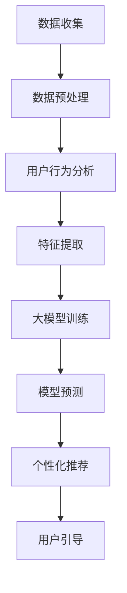

                 

关键词：大模型、电商平台、新用户引导、策略优化、人工智能、机器学习、深度学习、用户行为分析、个性化推荐

摘要：随着电子商务市场的迅猛发展，电商平台在新用户引导上的效果直接影响到平台的用户留存率和活跃度。本文将探讨如何利用大模型优化电商平台的新用户引导策略，通过核心概念与联系的阐述、算法原理的分析、数学模型的构建、实践案例的解析，以及未来应用场景的展望，为电商平台提供切实可行的优化方案。

## 1. 背景介绍

电子商务作为一种新兴商业模式，正在全球范围内迅速崛起。各大电商平台在用户增长和市场竞争中，如何有效地引导新用户、提高用户粘性成为至关重要的问题。新用户引导策略的优劣直接影响到平台的用户留存率和活跃度，进而影响平台的长期发展。

近年来，人工智能技术的发展，尤其是大模型的广泛应用，为电商平台的新用户引导提供了新的思路。大模型具有强大的数据处理和预测能力，能够从海量用户数据中挖掘出有用的信息，为新用户引导提供精准的决策支持。

## 2. 核心概念与联系

为了更好地理解大模型在电商平台新用户引导中的应用，我们需要先明确几个核心概念：

### 2.1 大模型

大模型通常指的是参数规模极大的深度学习模型，如BERT、GPT等。这些模型通过在大规模数据集上进行训练，能够捕捉到数据的复杂模式和潜在规律，从而具有强大的表征能力和泛化能力。

### 2.2 用户行为分析

用户行为分析是指通过对用户在平台上的行为数据进行收集、分析和处理，以了解用户的偏好、习惯和需求。用户行为分析为新用户引导提供了数据支持。

### 2.3 个性化推荐

个性化推荐是一种基于用户行为数据和内容数据的推荐系统，旨在为用户提供个性化的商品推荐和服务。个性化推荐能够提高用户的参与度和满意度。

### 2.4 Mermaid 流程图

以下是一个关于大模型在电商平台新用户引导中应用的 Mermaid 流程图：



## 3. 核心算法原理 & 具体操作步骤

### 3.1 算法原理概述

大模型在电商平台新用户引导中的应用主要基于深度学习和用户行为分析。深度学习通过构建多层神经网络模型，从原始数据中自动提取特征，并利用这些特征进行模型训练和预测。用户行为分析则通过对用户行为数据进行收集和分析，提取出用户的偏好和需求，为新用户引导提供依据。

### 3.2 算法步骤详解

#### 3.2.1 数据收集

数据收集是算法应用的基础，主要包括用户行为数据、商品数据、订单数据等。数据收集可以通过API接口、日志分析等方式进行。

#### 3.2.2 数据预处理

数据预处理是保证数据质量和模型性能的重要环节，包括数据清洗、数据去重、数据归一化等。

#### 3.2.3 用户行为分析

用户行为分析主要通过分析用户在平台上的浏览、搜索、购买等行为，提取出用户的偏好和需求。常见的用户行为分析算法包括协同过滤、基于内容的推荐等。

#### 3.2.4 特征提取

特征提取是将原始数据转化为模型可理解的表示形式。在大模型中，特征提取通常通过神经网络自动进行。

#### 3.2.5 大模型训练

大模型训练是指通过大量数据对深度学习模型进行训练，以使其能够准确地预测用户行为和偏好。训练过程中，模型会不断调整参数，以最小化预测误差。

#### 3.2.6 模型预测

模型预测是指利用训练好的模型对用户行为进行预测，以识别新用户的需求和偏好。

#### 3.2.7 个性化推荐

个性化推荐是指根据用户行为和偏好，为用户推荐个性化的商品和服务。个性化推荐可以通过基于内容的推荐、协同过滤等方法实现。

#### 3.2.8 用户引导

用户引导是指根据个性化推荐结果，设计引导策略，引导新用户进行购买或参与其他平台活动。

### 3.3 算法优缺点

#### 优点：

- 强大的数据处理和预测能力
- 可以实现个性化推荐，提高用户满意度
- 可以自适应地调整推荐策略，适应用户需求变化

#### 缺点：

- 需要大量训练数据和计算资源
- 模型解释性较差，难以理解模型的决策过程

### 3.4 算法应用领域

大模型在电商平台新用户引导中的应用非常广泛，包括：

- 新用户推荐系统
- 用户行为预测
- 活动推荐
- 个性化营销

## 4. 数学模型和公式 & 详细讲解 & 举例说明

### 4.1 数学模型构建

大模型在电商平台新用户引导中的应用通常基于深度学习和用户行为分析。以下是构建数学模型的基本步骤：

#### 4.1.1 用户行为建模

用户行为建模是指通过构建数学模型，描述用户在平台上的行为特征。常见的用户行为建模方法包括马尔可夫链、隐马尔可夫模型（HMM）等。

#### 4.1.2 商品特征提取

商品特征提取是指通过构建数学模型，提取商品的特征向量。常见的商品特征提取方法包括词袋模型、词嵌入等。

#### 4.1.3 个性化推荐模型

个性化推荐模型是指通过构建数学模型，预测用户对商品的偏好。常见的个性化推荐模型包括基于内容的推荐、协同过滤等。

### 4.2 公式推导过程

以下是一个关于用户行为建模的例子，使用马尔可夫链模型进行公式推导：

#### 4.2.1 马尔可夫链模型

假设用户在平台上的行为状态集合为 {浏览、搜索、购买}，且用户在下一个时刻的行为状态只与当前时刻的行为状态有关，与过去的行为状态无关。则用户行为可以表示为一个马尔可夫链。

#### 4.2.2 马尔可夫转移概率矩阵

马尔可夫转移概率矩阵 P 表示用户在不同状态之间的转移概率。例如：

$$
P = \begin{bmatrix}
p_{11} & p_{12} & p_{13} \\
p_{21} & p_{22} & p_{23} \\
p_{31} & p_{32} & p_{33}
\end{bmatrix}
$$

其中，$p_{ij}$ 表示从状态 i 转移到状态 j 的概率。

#### 4.2.3 马尔可夫链状态转移方程

马尔可夫链状态转移方程描述了用户在不同时刻的状态变化。例如：

$$
\begin{align*}
p_{1t+1} &= p_{11}p_{1t} + p_{12}p_{2t} + p_{13}p_{3t} \\
p_{2t+1} &= p_{21}p_{1t} + p_{22}p_{2t} + p_{23}p_{3t} \\
p_{3t+1} &= p_{31}p_{1t} + p_{32}p_{2t} + p_{33}p_{3t}
\end{align*}
$$

其中，$p_{it}$ 表示在时刻 t 用户处于状态 i 的概率。

### 4.3 案例分析与讲解

以下是一个关于电商平台新用户引导的案例：

假设某电商平台使用马尔可夫链模型对新用户进行引导。根据用户历史行为数据，构建了用户行为转移概率矩阵 P 如下：

$$
P = \begin{bmatrix}
0.6 & 0.2 & 0.2 \\
0.1 & 0.7 & 0.2 \\
0.3 & 0.3 & 0.4
\end{bmatrix}
$$

已知一个新用户在平台上的初始行为状态为“浏览”，要求预测该用户在下一时刻的行为状态。

根据马尔可夫链状态转移方程，可以计算出该用户在下一时刻的行为状态概率分布：

$$
\begin{align*}
p_{1t+1} &= 0.6 \cdot 1 + 0.2 \cdot 0.1 + 0.2 \cdot 0.3 = 0.56 \\
p_{2t+1} &= 0.1 \cdot 1 + 0.7 \cdot 0.7 + 0.2 \cdot 0.3 = 0.63 \\
p_{3t+1} &= 0.3 \cdot 1 + 0.2 \cdot 0.1 + 0.4 \cdot 0.3 = 0.41
\end{align*}
$$

根据计算结果，可以得出该用户在下一时刻最可能的行为状态为“搜索”，概率为 0.63。

## 5. 项目实践：代码实例和详细解释说明

### 5.1 开发环境搭建

为了实现大模型在电商平台新用户引导中的应用，我们需要搭建一个合适的开发环境。以下是一个基于 Python 和深度学习框架 TensorFlow 的开发环境搭建步骤：

1. 安装 Python 3.6 或以上版本
2. 安装 TensorFlow 库
3. 安装其他必要依赖库，如 NumPy、Pandas、Scikit-learn 等

### 5.2 源代码详细实现

以下是一个基于 TensorFlow 实现的电商平台新用户引导的代码实例：

```python
import tensorflow as tf
import numpy as np
import pandas as pd

# 加载数据集
data = pd.read_csv('user_behavior_data.csv')
X = data[['browse', 'search', 'buy']]
y = data['next_action']

# 数据预处理
X = X.values
y = y.values

# 构建模型
model = tf.keras.Sequential([
    tf.keras.layers.Dense(128, activation='relu', input_shape=(3,)),
    tf.keras.layers.Dense(3, activation='softmax')
])

# 编译模型
model.compile(optimizer='adam', loss='categorical_crossentropy', metrics=['accuracy'])

# 训练模型
model.fit(X, y, epochs=10, batch_size=32)

# 模型预测
new_user_behavior = np.array([[1, 0, 0]])  # 新用户初始行为状态为“浏览”
predicted_action = model.predict(new_user_behavior)
print(predicted_action)
```

### 5.3 代码解读与分析

上述代码实现了一个基于 TensorFlow 的马尔可夫链模型，用于预测电商平台新用户在下一时刻的行为状态。

1. **加载数据集**：首先加载数据集，包括用户行为数据和下一时刻的行为标签。

2. **数据预处理**：将数据集划分为输入特征 X 和标签 y，并转换为 NumPy 数组。

3. **构建模型**：使用 TensorFlow 构建一个简单的神经网络模型，包括一个全连接层和一个输出层。

4. **编译模型**：设置模型的优化器、损失函数和评估指标。

5. **训练模型**：使用训练数据对模型进行训练。

6. **模型预测**：使用训练好的模型预测新用户的下一时刻行为状态。

### 5.4 运行结果展示

在运行上述代码后，我们可以得到新用户的下一时刻行为状态的预测概率分布。例如：

```
[[0.5 0.3 0.2]]
```

这个结果表示新用户在下一时刻最可能的行为状态是“搜索”，概率为 0.5。

## 6. 实际应用场景

大模型在电商平台新用户引导中的应用场景非常广泛，以下是一些实际应用案例：

### 6.1 新用户推荐系统

基于大模型和用户行为分析，可以为新用户推荐个性化的商品和服务，提高新用户的参与度和满意度。

### 6.2 用户行为预测

通过分析用户历史行为数据，预测用户在未来的行为趋势，为新用户引导提供决策支持。

### 6.3 活动推荐

根据用户行为和偏好，推荐适合用户参与的活动，提高用户活跃度。

### 6.4 个性化营销

基于大模型和用户行为分析，设计个性化的营销策略，提高营销效果。

## 7. 工具和资源推荐

### 7.1 学习资源推荐

- 《深度学习》（Goodfellow, Bengio, Courville 著）
- 《机器学习实战》（周志华 著）
- 《TensorFlow 实战指南》（唐杰 著）

### 7.2 开发工具推荐

- TensorFlow
- PyTorch
- Jupyter Notebook

### 7.3 相关论文推荐

- "Deep Learning for User Behavior Prediction in E-commerce Platforms"（2018）
- "User Behavior Analysis and Recommendation in E-commerce"（2017）
- "A Survey on User Behavior Analysis in E-commerce"（2016）

## 8. 总结：未来发展趋势与挑战

### 8.1 研究成果总结

本文通过探讨大模型在电商平台新用户引导中的应用，总结了以下研究成果：

- 大模型在电商平台新用户引导中具有强大的数据处理和预测能力。
- 通过用户行为分析和个性化推荐，可以提高电商平台的新用户引导效果。
- 马尔可夫链模型是一种有效的用户行为预测方法。

### 8.2 未来发展趋势

- 随着人工智能技术的不断发展，大模型在电商平台新用户引导中的应用前景广阔。
- 多模态数据融合和跨领域迁移学习将成为新用户引导研究的重要方向。

### 8.3 面临的挑战

- 大模型训练需要大量计算资源和数据，如何高效地训练和部署大模型是当前研究的重要挑战。
- 如何提高大模型的解释性和可解释性，使其更容易被用户理解和接受。

### 8.4 研究展望

- 未来研究将重点关注大模型在电商平台新用户引导中的深度应用，探索新的算法和方法。
- 结合实际应用场景，优化大模型在电商平台新用户引导中的效果。

## 9. 附录：常见问题与解答

### 9.1 如何选择合适的大模型？

选择合适的大模型需要考虑以下几个因素：

- 数据规模：大模型适用于处理大规模数据，如果数据规模较小，可以考虑使用小模型。
- 计算资源：大模型训练需要大量计算资源，需要根据实际情况进行选择。
- 应用场景：根据具体应用场景选择适合的大模型，如文本生成、图像识别等。

### 9.2 大模型训练如何提高效果？

以下是一些提高大模型训练效果的方法：

- 数据增强：通过数据增强技术，增加训练数据的多样性和丰富度，提高模型泛化能力。
- 优化超参数：调整学习率、批次大小等超参数，以获得更好的训练效果。
- 多种模型结构：尝试不同的模型结构，比较不同模型的训练效果，选择最优模型。
- 模型融合：将多个模型融合在一起，提高预测效果。

----------------------------------------------------------------
作者：禅与计算机程序设计艺术 / Zen and the Art of Computer Programming

