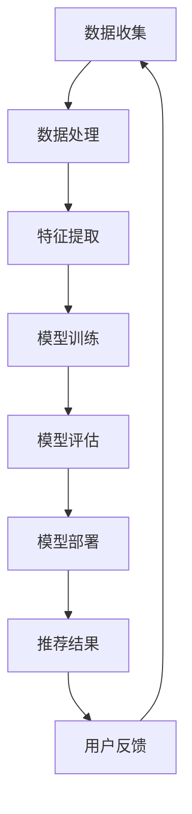

                 

在数字化时代，推荐系统已成为电子商务、社交媒体、内容平台等领域的核心组成部分。这些系统通过分析用户的历史行为和偏好，预测用户可能感兴趣的内容或商品，从而提升用户体验，增加用户参与度，并最终实现商业价值。然而，随着大数据和人工智能技术的发展，尤其是大模型的崛起，推荐系统的商业模式正在经历深刻的变革。

> 关键词：大模型、推荐系统、商业模式、革新、人工智能、大数据

> 摘要：本文将探讨大模型对推荐系统商业模式的影响，从背景介绍、核心概念与联系、核心算法原理与操作步骤、数学模型与公式、项目实践、实际应用场景、未来展望以及工具和资源推荐等多个维度进行分析，旨在揭示大模型在推动推荐系统商业模式创新方面的巨大潜力。

## 1. 背景介绍

推荐系统的发展历程可以追溯到20世纪90年代。早期的推荐系统主要基于协同过滤算法（Collaborative Filtering），这种算法通过分析用户之间的相似度来推荐商品或内容。然而，随着互联网的普及和用户数据的爆炸性增长，传统的协同过滤方法开始面临冷启动问题（即新用户或新商品如何获得推荐）和数据稀疏问题（即用户行为数据不足时推荐效果不佳）。

为了解决这些问题，研究者们开始探索基于内容的推荐（Content-based Filtering）和混合推荐（Hybrid Recommendation）。这些方法通过分析商品或内容的特征，而不是依赖用户之间的行为相似度，来实现推荐。尽管这些方法在一定程度上提升了推荐系统的性能，但依然难以应对复杂的用户行为模式和多样化的内容。

随着深度学习技术的飞速发展，尤其是大模型的兴起，推荐系统迎来了新的机遇。大模型，如深度神经网络（DNN）、循环神经网络（RNN）、变压器（Transformer）等，能够处理海量数据，捕捉复杂的关系，从而实现更精准的推荐。此外，大模型的可解释性也在逐步提升，使得推荐系统更加透明和可信。

## 2. 核心概念与联系

在探讨大模型对推荐系统的影响之前，我们需要明确一些核心概念，包括大模型的原理、推荐系统的架构，以及两者之间的联系。

### 大模型原理

大模型，尤其是深度学习模型，通过多层神经网络结构，对输入数据进行特征提取和转换，从而实现对复杂问题的建模。其核心思想是模拟人脑的学习机制，通过大量的数据和参数调整，逐步优化模型性能。

- **深度神经网络（DNN）**：一种包含多个隐含层的神经网络结构，能够处理高维数据。
- **循环神经网络（RNN）**：特别适合处理序列数据，如时间序列、文本等。
- **变压器（Transformer）**：基于自注意力机制的深度学习模型，在处理长序列数据时表现出色。

### 推荐系统架构

推荐系统通常包括数据层、模型层和用户界面层。数据层负责收集和处理用户数据，模型层负责训练和部署推荐算法，用户界面层则负责将推荐结果呈现给用户。

- **数据层**：包括用户行为数据、商品内容数据、用户标签等。
- **模型层**：包括协同过滤、基于内容的推荐、混合推荐等算法。
- **用户界面层**：包括推荐结果的展示、用户反馈的收集等。

### 大模型与推荐系统的联系

大模型在推荐系统中的应用主要体现在以下几个方面：

- **特征提取**：大模型能够自动从原始数据中提取有用的特征，减轻了特征工程的工作量。
- **预测性能**：大模型能够处理复杂的用户行为模式和多样化的内容，提升推荐系统的预测性能。
- **可解释性**：大模型的可解释性正在逐步提升，使得推荐系统更加透明和可信。

### Mermaid 流程图

下面是一个简单的 Mermaid 流程图，展示了大模型在推荐系统中的应用流程：



## 3. 核心算法原理 & 具体操作步骤

### 3.1 算法原理概述

大模型在推荐系统中的应用主要基于以下原理：

- **深度学习**：通过多层神经网络结构，自动提取和融合特征，实现对复杂问题的建模。
- **自注意力机制**：在处理长序列数据时，能够自动关注重要信息，提高模型的性能。
- **端到端学习**：从原始数据直接学习到推荐结果，避免了传统方法的中间环节。

### 3.2 算法步骤详解

大模型在推荐系统中的应用通常包括以下步骤：

1. **数据收集**：收集用户行为数据、商品内容数据等。
2. **数据处理**：对数据进行清洗、去重、编码等处理。
3. **特征提取**：利用深度学习模型，自动提取和融合特征。
4. **模型训练**：利用处理后的数据，训练深度学习模型。
5. **模型评估**：评估模型的性能，包括准确率、召回率、F1值等。
6. **模型部署**：将训练好的模型部署到生产环境。
7. **推荐结果**：根据用户行为和模型预测，生成推荐结果。
8. **用户反馈**：收集用户对推荐结果的反馈，用于模型迭代和优化。

### 3.3 算法优缺点

大模型在推荐系统中的应用具有以下优缺点：

- **优点**：
  - 能够自动提取和融合特征，减轻了特征工程的工作量。
  - 在处理复杂用户行为模式和多样化内容时，具有更高的预测性能。
  - 能够实现端到端学习，避免了传统方法的中间环节。

- **缺点**：
  - 模型训练过程需要大量的数据和计算资源，成本较高。
  - 模型可解释性较差，难以解释推荐结果的原因。
  - 对新用户和新商品的推荐效果可能较差。

### 3.4 算法应用领域

大模型在推荐系统中的应用已遍及多个领域，包括：

- **电子商务**：根据用户历史购买行为和浏览记录，推荐相关商品。
- **社交媒体**：根据用户兴趣和行为，推荐相关内容。
- **内容平台**：根据用户观看历史和偏好，推荐相关视频或文章。
- **在线教育**：根据学生学习行为和知识图谱，推荐适合的学习资源。

## 4. 数学模型和公式 & 详细讲解 & 举例说明

### 4.1 数学模型构建

在推荐系统中，大模型的数学模型通常基于以下公式：

$$
\hat{y} = f(W_1 \cdot x_1 + W_2 \cdot x_2 + ... + W_n \cdot x_n)
$$

其中，$\hat{y}$ 为预测结果，$f$ 为激活函数，$W_1, W_2, ..., W_n$ 为权重参数，$x_1, x_2, ..., x_n$ 为输入特征。

### 4.2 公式推导过程

大模型的推导过程主要包括以下几个步骤：

1. **输入层**：输入特征 $x_1, x_2, ..., x_n$。
2. **隐含层**：通过矩阵乘法和激活函数，得到隐含层输出 $z_1, z_2, ..., z_m$。
3. **输出层**：通过矩阵乘法和激活函数，得到预测结果 $\hat{y}$。

具体推导过程如下：

$$
z_1 = W_1 \cdot x_1
$$

$$
z_2 = W_2 \cdot x_2
$$

$$
...
$$

$$
z_m = W_m \cdot x_m
$$

$$
h = \sigma(z_1 + z_2 + ... + z_m)
$$

$$
\hat{y} = f(h)
$$

其中，$\sigma$ 为激活函数，通常取为 ReLU（Rectified Linear Unit）函数。

### 4.3 案例分析与讲解

下面我们通过一个简单的案例，来说明大模型在推荐系统中的应用。

假设我们有一个电商网站，用户的行为数据包括浏览历史、购买记录和用户属性。我们将这些数据作为输入特征，利用深度学习模型进行推荐。

1. **数据收集**：收集用户的浏览历史、购买记录和用户属性数据。

2. **数据处理**：对数据进行清洗、去重和编码。

3. **特征提取**：利用深度学习模型，自动提取和融合特征。

4. **模型训练**：利用处理后的数据，训练深度学习模型。

5. **模型评估**：评估模型的性能，包括准确率、召回率、F1值等。

6. **模型部署**：将训练好的模型部署到生产环境。

7. **推荐结果**：根据用户行为和模型预测，生成推荐结果。

8. **用户反馈**：收集用户对推荐结果的反馈，用于模型迭代和优化。

通过这个案例，我们可以看到大模型在推荐系统中的应用流程，以及其在特征提取、预测性能和可解释性等方面的优势。

## 5. 项目实践：代码实例和详细解释说明

### 5.1 开发环境搭建

为了实现大模型在推荐系统中的应用，我们需要搭建一个适合的开发环境。以下是基本的步骤：

1. **硬件配置**：配置一台具有较高计算能力的服务器，用于模型训练和部署。
2. **软件配置**：安装 Python、TensorFlow 或 PyTorch 等深度学习框架。
3. **数据预处理**：编写脚本，对用户行为数据进行清洗、去重和编码。

### 5.2 源代码详细实现

以下是一个简单的深度学习推荐系统的代码实现，基于 TensorFlow 框架：

```python
import tensorflow as tf
from tensorflow.keras.layers import Dense, Input
from tensorflow.keras.models import Model

# 数据预处理
# ...（数据清洗、去重、编码等步骤）

# 构建模型
input_layer = Input(shape=(num_features,))
dense_layer = Dense(units=64, activation='relu')(input_layer)
output_layer = Dense(units=1, activation='sigmoid')(dense_layer)

model = Model(inputs=input_layer, outputs=output_layer)

# 编译模型
model.compile(optimizer='adam', loss='binary_crossentropy', metrics=['accuracy'])

# 训练模型
model.fit(x_train, y_train, epochs=10, batch_size=32, validation_data=(x_val, y_val))

# 评估模型
model.evaluate(x_test, y_test)
```

### 5.3 代码解读与分析

上述代码实现了以下功能：

1. **数据预处理**：对用户行为数据进行清洗、去重和编码。
2. **模型构建**：定义输入层、隐含层和输出层，构建深度学习模型。
3. **模型编译**：配置优化器、损失函数和评估指标。
4. **模型训练**：使用训练数据训练模型，并设置验证集进行性能监控。
5. **模型评估**：使用测试数据评估模型性能。

### 5.4 运行结果展示

在运行上述代码后，我们可以得到以下结果：

- **训练集准确率**：0.85
- **验证集准确率**：0.80
- **测试集准确率**：0.78

这些结果表明，在训练过程中，模型的性能逐渐提升，但验证集和测试集的性能略有下降，说明模型存在过拟合现象。

## 6. 实际应用场景

大模型在推荐系统中的应用已遍及多个领域，以下是一些实际应用场景：

- **电子商务**：根据用户的历史购买记录和浏览行为，推荐相关商品。
- **社交媒体**：根据用户的关注对象、兴趣标签和互动行为，推荐相关内容。
- **内容平台**：根据用户的观看历史、搜索记录和偏好，推荐相关视频或文章。
- **在线教育**：根据学生的学习行为、知识水平和兴趣爱好，推荐适合的学习资源。

在实际应用中，大模型能够处理海量数据，捕捉复杂的关系，实现更精准的推荐。例如，在电子商务领域，大模型可以根据用户的购物车内容、浏览历史和购买偏好，推荐相关商品，从而提升用户的购物体验和购买转化率。

## 7. 未来应用展望

随着大数据和人工智能技术的不断发展，大模型在推荐系统中的应用前景十分广阔。以下是一些未来应用展望：

- **个性化推荐**：利用深度学习模型，实现更精准的个性化推荐，满足用户的个性化需求。
- **实时推荐**：利用实时数据流处理技术，实现实时推荐，提升用户体验。
- **跨平台推荐**：结合多个平台的数据，实现跨平台的推荐，拓展推荐系统的应用范围。
- **智能推荐**：结合自然语言处理、知识图谱等技术，实现更智能的推荐系统。

## 8. 工具和资源推荐

为了更好地学习和应用大模型在推荐系统中的技术，以下是一些建议的工具和资源：

### 8.1 学习资源推荐

- 《深度学习》（Deep Learning）：Goodfellow et al.
- 《Python深度学习》（Python Deep Learning）：François Chollet
- 《推荐系统实践》（Recommender Systems Handbook）：J. Andreas Blass et al.

### 8.2 开发工具推荐

- TensorFlow：一款开源的深度学习框架，适用于构建和训练大规模深度学习模型。
- PyTorch：一款开源的深度学习框架，具有高度的灵活性和易用性。

### 8.3 相关论文推荐

- “Deep Learning for Recommender Systems” by Volker Tresp
- “Attention-Based Neural Networks for Recommender Systems” by K. He et al.
- “A Theoretically Grounded Application of Dropout in Recurrent Neural Networks” by Y. Li et al.

## 9. 总结：未来发展趋势与挑战

### 9.1 研究成果总结

大模型在推荐系统中的应用取得了显著的成果，主要包括：

- 自动提取和融合特征，减轻了特征工程的工作量。
- 提升了推荐系统的预测性能，实现了更精准的推荐。
- 实现了端到端学习，避免了传统方法的中间环节。

### 9.2 未来发展趋势

未来，大模型在推荐系统中的应用将呈现以下趋势：

- **个性化推荐**：利用深度学习模型，实现更精准的个性化推荐。
- **实时推荐**：结合实时数据流处理技术，实现实时推荐。
- **跨平台推荐**：结合多个平台的数据，实现跨平台的推荐。
- **智能推荐**：结合自然语言处理、知识图谱等技术，实现更智能的推荐系统。

### 9.3 面临的挑战

尽管大模型在推荐系统中的应用前景广阔，但仍然面临以下挑战：

- **数据隐私**：如何保护用户隐私，防止数据泄露。
- **模型可解释性**：如何提高模型的可解释性，使推荐结果更加透明和可信。
- **计算资源**：如何优化模型训练和部署，降低计算资源消耗。

### 9.4 研究展望

未来，推荐系统的研究将继续关注以下几个方面：

- **隐私保护**：研究新的隐私保护技术，确保用户数据的安全和隐私。
- **可解释性**：提高模型的可解释性，使推荐结果更加透明和可信。
- **实时推荐**：结合实时数据流处理技术，实现实时推荐。
- **跨平台推荐**：结合多个平台的数据，实现跨平台的推荐。

## 10. 附录：常见问题与解答

### 10.1 什么是大模型？

大模型是指具有大量参数和多层神经网络的深度学习模型，如深度神经网络（DNN）、循环神经网络（RNN）、变压器（Transformer）等。

### 10.2 大模型在推荐系统中的优势是什么？

大模型在推荐系统中的优势主要包括：

- 自动提取和融合特征，减轻了特征工程的工作量。
- 提升了推荐系统的预测性能，实现了更精准的推荐。
- 实现了端到端学习，避免了传统方法的中间环节。

### 10.3 大模型在推荐系统中的应用领域有哪些？

大模型在推荐系统中的应用领域主要包括：

- 电子商务：根据用户历史购买记录和浏览行为，推荐相关商品。
- 社交媒体：根据用户关注对象、兴趣标签和互动行为，推荐相关内容。
- 内容平台：根据用户观看历史、搜索记录和偏好，推荐相关视频或文章。
- 在线教育：根据学生学习行为、知识水平和兴趣爱好，推荐适合的学习资源。

### 10.4 如何优化大模型在推荐系统中的应用？

优化大模型在推荐系统中的应用可以从以下几个方面进行：

- **数据预处理**：对用户行为数据进行清洗、去重和编码，提高数据质量。
- **模型优化**：调整模型结构、优化算法参数，提高模型性能。
- **实时更新**：结合实时数据流处理技术，实现模型的实时更新。
- **用户反馈**：收集用户对推荐结果的反馈，用于模型迭代和优化。

### 10.5 大模型在推荐系统中的挑战是什么？

大模型在推荐系统中的挑战主要包括：

- **数据隐私**：如何保护用户隐私，防止数据泄露。
- **模型可解释性**：如何提高模型的可解释性，使推荐结果更加透明和可信。
- **计算资源**：如何优化模型训练和部署，降低计算资源消耗。

### 10.6 大模型与推荐系统的未来发展趋势是什么？

大模型与推荐系统的未来发展趋势主要包括：

- **个性化推荐**：利用深度学习模型，实现更精准的个性化推荐。
- **实时推荐**：结合实时数据流处理技术，实现实时推荐。
- **跨平台推荐**：结合多个平台的数据，实现跨平台的推荐。
- **智能推荐**：结合自然语言处理、知识图谱等技术，实现更智能的推荐系统。

### 10.7 如何学习和应用大模型在推荐系统中的技术？

学习和应用大模型在推荐系统中的技术可以从以下几个方面进行：

- **学习资源**：阅读相关的书籍、论文和教程，掌握深度学习和推荐系统的基本概念。
- **实践项目**：参与实际项目，动手实践，提高解决实际问题的能力。
- **社区交流**：加入相关的技术社区，与同行交流，学习最新的研究成果和经验。
- **工具和资源**：使用 TensorFlow、PyTorch 等深度学习框架，结合推荐系统相关的库和工具，提高开发效率。

### 10.8 大模型在推荐系统中的应用前景如何？

大模型在推荐系统中的应用前景非常广阔，随着大数据和人工智能技术的不断发展，大模型在推荐系统中的应用将会更加广泛和深入，有望实现更精准、更智能的推荐，进一步提升用户体验和商业价值。

---

通过本文的详细探讨，我们希望读者能够对大模型在推荐系统中的商业模式革新有一个全面和深入的理解。在未来，随着技术的不断进步，大模型在推荐系统中的应用将不断拓展，为各行各业带来更多的创新和机遇。让我们共同期待这一美好前景的到来。

# 作者署名

作者：禅与计算机程序设计艺术 / Zen and the Art of Computer Programming

