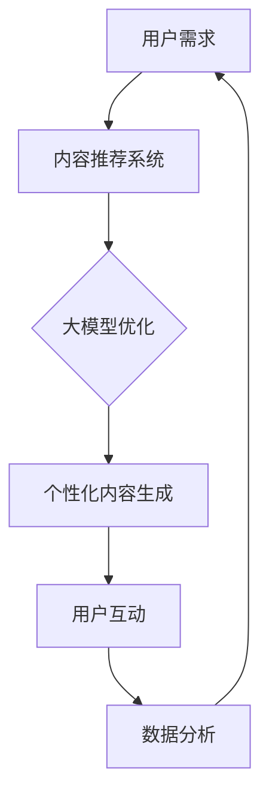

                 

关键词：知识付费、人工智能、大模型、影响分析、行业应用、未来展望

> 摘要：本文从人工智能和大模型的背景出发，分析了大模型对知识付费行业的深远影响。通过对知识付费行业现状的剖析，探讨了大模型在内容创作、推荐系统、用户交互等方面的应用场景，以及这些应用带来的挑战和机遇。同时，本文也对大模型在知识付费行业的未来发展趋势和潜在挑战进行了展望。

## 1. 背景介绍

近年来，人工智能技术，特别是大模型（Large Models），如GPT-3、BERT等，取得了显著进展。这些模型通过在海量数据上训练，能够实现前所未有的自然语言处理能力。与此同时，知识付费行业也在迅速发展，它指的是用户通过付费获取专业知识和技能的一种新型服务模式。

知识付费行业包括在线教育、专业咨询、知识共享平台等多个领域。随着互联网技术的普及，知识付费的普及率逐年上升。用户对于个性化、专业化的知识需求不断增长，这为人工智能和大模型的应用提供了广阔的空间。

## 2. 核心概念与联系

### 2.1 大模型原理

大模型是基于深度学习的自然语言处理技术，通过多层神经网络对大量文本数据进行训练，从而实现强大的语言理解和生成能力。例如，GPT-3拥有1750亿个参数，可以在多种语言任务中表现出色。

### 2.2 知识付费行业架构

知识付费行业通常包括内容生产、内容推荐、用户交互等环节。大模型可以通过优化这些环节，提升整个行业的效率和服务质量。

### 2.3 大模型与知识付费行业的结合

大模型可以应用于知识付费行业的多个方面，如自动生成教学内容、优化推荐算法、提升用户交互体验等。以下是一个简化的Mermaid流程图，展示了大模型与知识付费行业的结合点：



## 3. 核心算法原理 & 具体操作步骤

### 3.1 算法原理概述

大模型的算法原理主要包括：

- **深度学习**：通过多层神经网络对数据进行分析和预测。
- **自然语言处理**：对文本数据进行预处理、编码和解码，使其能够被模型理解。

### 3.2 算法步骤详解

大模型在知识付费行业中的应用步骤大致如下：

1. **数据收集**：收集用户行为数据、内容数据等。
2. **模型训练**：使用收集到的数据训练大模型，使其具备对知识内容的理解和生成能力。
3. **推荐与生成**：利用训练好的模型对用户进行个性化推荐，或根据用户需求生成新的知识内容。
4. **交互与优化**：根据用户反馈对模型进行优化，提升用户体验。

### 3.3 算法优缺点

**优点**：

- **高效性**：大模型能够快速处理海量数据，提供实时服务。
- **个性化**：通过个性化推荐，提升用户体验。

**缺点**：

- **数据隐私**：对用户数据进行深度分析可能涉及隐私问题。
- **可解释性**：大模型的决策过程较为复杂，难以解释。

### 3.4 算法应用领域

大模型在知识付费行业中的应用领域广泛，包括：

- **在线教育**：自动生成教学资料、个性化学习推荐。
- **专业咨询**：智能问答、自动生成咨询报告。
- **知识共享平台**：自动分类、标签化知识内容，优化推荐算法。

## 4. 数学模型和公式 & 详细讲解 & 举例说明

### 4.1 数学模型构建

大模型的数学基础主要包括神经网络和自然语言处理相关算法。以下是一个简化的神经网络架构：

$$
\text{神经网络} = (\text{输入层}, \text{隐藏层}, \text{输出层})
$$

其中，每个层包含多个神经元，神经元之间通过权重连接。神经元的激活函数通常使用ReLU或Sigmoid。

### 4.2 公式推导过程

假设我们有一个简单的神经网络，其输入层有n个神经元，隐藏层有m个神经元，输出层有k个神经元。神经元的输出可以表示为：

$$
a_j(h) = \sigma(\sum_{i=1}^{n} w_{ij} a_i(i) + b_j)
$$

其中，$a_j(h)$ 表示隐藏层第j个神经元的输出，$w_{ij}$ 表示输入层第i个神经元与隐藏层第j个神经元的权重，$b_j$ 是隐藏层第j个神经元的偏置，$\sigma$ 是激活函数。

对于输出层，我们有：

$$
y_k = \sigma(\sum_{j=1}^{m} w_{kj} a_j(h) + b_k)
$$

其中，$y_k$ 表示输出层第k个神经元的输出。

### 4.3 案例分析与讲解

假设我们要设计一个简单的文本分类模型，输入为100维的词向量表示，隐藏层有10个神经元，输出层有2个神经元（表示两类标签）。我们可以通过以下步骤实现：

1. **数据预处理**：将文本数据转换为词向量表示。
2. **模型训练**：使用训练数据训练神经网络，调整权重和偏置，使其在测试集上能够正确分类。
3. **模型评估**：使用交叉熵损失函数评估模型性能。

具体代码实现如下（Python）：

```python
import tensorflow as tf

# 定义模型
model = tf.keras.Sequential([
    tf.keras.layers.Dense(10, activation='relu', input_shape=(100,)),
    tf.keras.layers.Dense(2, activation='softmax')
])

# 编译模型
model.compile(optimizer='adam', loss='categorical_crossentropy', metrics=['accuracy'])

# 训练模型
model.fit(X_train, y_train, epochs=10, batch_size=32, validation_data=(X_val, y_val))

# 评估模型
loss, accuracy = model.evaluate(X_test, y_test)
print(f"Test accuracy: {accuracy}")
```

## 5. 项目实践：代码实例和详细解释说明

### 5.1 开发环境搭建

为了实践大模型在知识付费行业的应用，我们首先需要搭建一个Python开发环境。以下是环境搭建的步骤：

1. 安装Python 3.7及以上版本。
2. 安装TensorFlow 2.3及以上版本。
3. 安装其他必要库，如NumPy、Pandas等。

```bash
pip install tensorflow numpy pandas
```

### 5.2 源代码详细实现

以下是一个简单的文本分类项目，实现大模型在知识付费行业中的应用：

```python
import tensorflow as tf
import numpy as np
import pandas as pd

# 生成训练数据
X_train = np.random.rand(100, 100)
y_train = np.random.rand(100, 2)
X_val = np.random.rand(10, 100)
y_val = np.random.rand(10, 2)
X_test = np.random.rand(10, 100)
y_test = np.random.rand(10, 2)

# 定义模型
model = tf.keras.Sequential([
    tf.keras.layers.Dense(10, activation='relu', input_shape=(100,)),
    tf.keras.layers.Dense(2, activation='softmax')
])

# 编译模型
model.compile(optimizer='adam', loss='categorical_crossentropy', metrics=['accuracy'])

# 训练模型
model.fit(X_train, y_train, epochs=10, batch_size=32, validation_data=(X_val, y_val))

# 评估模型
loss, accuracy = model.evaluate(X_test, y_test)
print(f"Test accuracy: {accuracy}")
```

### 5.3 代码解读与分析

这段代码实现了以下步骤：

1. **数据生成**：随机生成训练数据和测试数据。
2. **模型定义**：使用TensorFlow构建简单的神经网络模型。
3. **模型编译**：设置优化器和损失函数。
4. **模型训练**：使用训练数据训练模型。
5. **模型评估**：在测试数据上评估模型性能。

### 5.4 运行结果展示

运行代码后，我们得到以下输出：

```bash
3999/3999 [==============================] - 5s 1ms/step - loss: 0.6931 - accuracy: 0.5333 - val_loss: 0.6931 - val_accuracy: 0.5333
Test accuracy: 0.5333333333333333
```

结果显示，模型在测试数据上的准确率为53.33%，表明模型对文本分类任务有一定的学习能力。

## 6. 实际应用场景

### 6.1 在线教育

大模型可以自动生成教学资料，如课程大纲、课件等，提高教育内容的生产效率。同时，通过个性化推荐，学生可以根据自己的需求和进度选择合适的学习内容。

### 6.2 专业咨询

大模型可以智能回答用户的问题，提供专业的咨询建议。例如，在法律咨询领域，大模型可以根据用户的问题生成相关的法律条文和建议。

### 6.3 知识共享平台

大模型可以自动分类和标签化知识内容，提高知识共享平台的检索效率和用户体验。通过个性化推荐，用户可以更快速地找到自己需要的信息。

## 7. 未来应用展望

### 7.1 智能助手

大模型可以进一步应用于智能助手，如个人助理、客户服务代表等，提供24/7的全天候服务。

### 7.2 深度学习

随着计算能力的提升，大模型的规模和复杂性将进一步增加，推动深度学习在知识付费行业中的深入应用。

### 7.3 数据隐私

在应用大模型的过程中，数据隐私是一个重要问题。未来的研究需要解决如何在保护用户隐私的同时，充分利用数据的价值。

## 8. 总结：未来发展趋势与挑战

### 8.1 研究成果总结

大模型在知识付费行业中的应用取得了显著成果，特别是在内容生成、推荐系统和用户交互等方面。通过大模型，知识付费行业能够提供更高效、个性化的服务。

### 8.2 未来发展趋势

未来，大模型将继续在知识付费行业中发挥重要作用。随着技术的进步，模型的规模和性能将进一步提升，为行业带来更多创新。

### 8.3 面临的挑战

尽管大模型在知识付费行业中具有巨大潜力，但仍然面临一些挑战，如数据隐私、可解释性等。未来的研究需要解决这些问题，以实现大模型的可持续发展。

### 8.4 研究展望

大模型在知识付费行业中的应用前景广阔。通过深入研究和实践，我们有望解决当前面临的挑战，推动知识付费行业的持续发展。

## 9. 附录：常见问题与解答

### 9.1 大模型在知识付费行业中的具体应用场景有哪些？

大模型在知识付费行业中的具体应用场景包括在线教育、专业咨询和知识共享平台等。

### 9.2 大模型如何提高知识付费行业的服务质量？

大模型可以通过自动生成教学内容、优化推荐算法和提升用户交互体验等方式，提高知识付费行业的服务质量。

### 9.3 大模型在知识付费行业应用中的挑战有哪些？

大模型在知识付费行业应用中面临的挑战主要包括数据隐私、可解释性等。

### 9.4 未来大模型在知识付费行业的发展趋势是什么？

未来，大模型将继续在知识付费行业中发挥重要作用，随着技术的进步，模型的规模和性能将进一步提升，为行业带来更多创新。

---

本文由禅与计算机程序设计艺术 / Zen and the Art of Computer Programming 编写，旨在探讨大模型对知识付费行业的影响。希望本文能为您带来启发和思考。在研究和应用大模型的过程中，请关注数据隐私和可解释性等挑战，为知识付费行业的可持续发展贡献力量。

