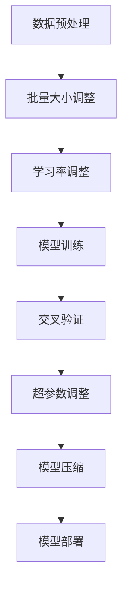

                 

大模型（Large Model）在当前的信息时代已经成为人工智能领域的关键技术，它们在自然语言处理、计算机视觉、语音识别等多个领域发挥着重要的作用。本文将深入探讨大模型应用开发的实战技巧，旨在帮助开发者更好地理解大模型的架构、算法和实现细节，从而提高其在实际项目中的应用效果。

## 关键词

- 大模型
- 应用开发
- 实战技巧
- 人工智能
- 自然语言处理
- 计算机视觉

## 摘要

本文将详细解析大模型应用开发的实战技巧，包括其背景介绍、核心概念与联系、核心算法原理、数学模型与公式、项目实践、实际应用场景、工具与资源推荐以及未来发展趋势和挑战。通过本文的阅读，读者将能够全面了解大模型应用开发的流程和方法，为实际项目提供有力的技术支持。

---

## 1. 背景介绍

大模型，顾名思义，是指具有大规模参数和广泛知识库的人工神经网络模型。它们通过深度学习算法从海量数据中学习，并在各种任务中展现出强大的表现力。近年来，随着计算能力和数据规模的不断提升，大模型的规模也不断扩大，从数百万参数到数十亿参数不等。这些大模型不仅在学术研究中取得了显著的成果，也在商业领域得到广泛应用。

大模型的应用领域广泛，其中最为显著的是自然语言处理（NLP）和计算机视觉（CV）。在自然语言处理领域，大模型被用于机器翻译、情感分析、问答系统等任务，取得了前所未有的效果。在计算机视觉领域，大模型在图像分类、目标检测、图像生成等方面也表现出了卓越的性能。

然而，大模型的应用开发并非一蹴而就。开发者需要深入了解大模型的原理和实现细节，掌握高效的算法和优化技巧，以及应对模型大规模训练和部署的挑战。本文将围绕这些关键点，为开发者提供实用的实战技巧。

### 1.1 大模型的起源与发展

大模型的起源可以追溯到深度学习的发展历程。随着神经网络的深入研究和计算能力的提升，深度神经网络（DNN）逐渐成为解决复杂问题的有力工具。特别是在2012年，AlexNet在ImageNet图像识别比赛中取得了突破性的成绩，这一胜利标志着深度学习时代的到来。

随着深度学习技术的不断进步，模型的规模和参数数量也迅速增加。从最初的数百万参数到如今的数十亿参数，大模型的诞生不仅依赖于计算资源和数据量的提升，更得益于新的算法和优化策略。例如，ResNet、Transformer等模型的提出，为深度学习的发展注入了新的活力，也为大模型的广泛应用奠定了基础。

### 1.2 大模型的应用现状

当前，大模型在各个领域都展现出了强大的应用潜力。在自然语言处理领域，BERT、GPT、T5等模型已经成为了许多NLP任务的标准工具。在计算机视觉领域，ResNet、VGG、YOLO等模型也被广泛应用于图像分类、目标检测、图像生成等任务。

除了学术研究，大模型在商业领域也获得了广泛应用。例如，谷歌的BERT模型被用于搜索引擎优化，亚马逊的NeuralCTC模型被用于语音识别，微软的GPT模型被用于智能客服等。这些应用不仅提高了系统的性能，也为用户体验的提升提供了有力支持。

### 1.3 大模型面临的挑战

尽管大模型在各个领域取得了显著成果，但其在实际应用中仍面临诸多挑战。首先，大模型的训练和部署需要巨大的计算资源和时间成本。其次，大模型的解释性和透明性较低，使得其在一些安全敏感的领域应用受到限制。此外，大模型的训练过程中可能会遇到过拟合、数据隐私等问题。

面对这些挑战，开发者需要不断探索新的算法和优化策略，以提高大模型的性能和可解释性，同时降低训练和部署的成本。本文将围绕这些挑战，为开发者提供实用的实战技巧。

---

## 2. 核心概念与联系

要深入理解大模型的应用开发，首先需要掌握其核心概念和基本架构。以下是几个关键概念及其相互关系：

### 2.1 深度学习基础

深度学习（Deep Learning）是一种人工智能方法，其核心是神经网络（Neural Network）。神经网络由大量相互连接的节点（神经元）组成，通过学习输入数据和输出结果之间的关系，实现对未知数据的预测和分类。深度学习通过多层网络结构，逐层提取数据的特征，从而实现复杂任务的自动化解决。

### 2.2 大模型的架构

大模型的架构通常由以下几个部分组成：

- **输入层（Input Layer）**：接收外部输入数据，如文本、图像等。
- **隐藏层（Hidden Layers）**：对输入数据进行特征提取和转换，通常是多层结构。
- **输出层（Output Layer）**：根据隐藏层的结果生成输出，如分类结果、文本生成等。

大模型的特殊之处在于其庞大的参数数量和复杂的网络结构。例如，Transformer模型包含数十亿个参数，ResNet模型包含数百层神经网络。

### 2.3 深度学习算法

深度学习算法是训练和优化神经网络的关键。以下是一些常用的大模型训练算法：

- **反向传播（Backpropagation）**：通过反向传播误差，更新网络参数，以达到最小化损失函数。
- **随机梯度下降（SGD）**：在反向传播过程中，使用随机梯度来更新参数，以提高训练效率。
- **Adam优化器**：结合了SGD和Momentum，在训练过程中自适应调整学习率，提高收敛速度。

### 2.4 大模型的训练与优化

大模型的训练和优化是应用开发的核心。以下是一些关键步骤：

- **数据预处理**：对输入数据进行标准化、归一化等处理，以提高模型性能。
- **批量大小（Batch Size）**：控制每次训练使用的样本数量，以平衡训练效率和模型性能。
- **学习率调整**：通过自适应调整学习率，优化模型收敛速度和效果。
- **正则化（Regularization）**：防止模型过拟合，提高泛化能力。

### 2.5 大模型的评估与部署

评估和部署是应用开发的重要环节。以下是一些关键步骤：

- **交叉验证（Cross-Validation）**：通过将数据集划分为训练集和验证集，评估模型性能。
- **超参数调整**：通过调整模型参数，优化模型性能。
- **模型压缩（Model Compression）**：通过量化、剪枝等技术，减少模型参数和计算量，以降低部署成本。
- **模型部署**：将训练好的模型部署到生产环境，实现实时应用。

### 2.6 Mermaid 流程图

以下是用于描述大模型架构和流程的Mermaid流程图：



通过上述核心概念和流程图的描述，开发者可以更好地理解大模型的应用开发过程，从而在实际项目中运用这些技巧，提升模型的性能和效果。

---

## 3. 核心算法原理 & 具体操作步骤

### 3.1 算法原理概述

大模型的算法原理主要基于深度学习，其中最核心的部分是神经网络。神经网络通过多层结构对输入数据进行特征提取和转换，从而实现对复杂任务的自动化解决。以下是深度学习算法的基本原理和步骤：

1. **输入层**：接收外部输入数据，如文本、图像等。
2. **隐藏层**：对输入数据进行特征提取和转换，通常是多层结构。每一层都会对前一层的数据进行处理，并生成新的特征。
3. **输出层**：根据隐藏层的结果生成输出，如分类结果、文本生成等。
4. **反向传播**：通过反向传播误差，更新网络参数，以达到最小化损失函数。

### 3.2 算法步骤详解

1. **数据预处理**：对输入数据进行标准化、归一化等处理，以提高模型性能。例如，在自然语言处理中，对文本进行分词、去停用词等处理。
2. **构建模型**：根据任务需求，选择合适的神经网络架构，如卷积神经网络（CNN）、循环神经网络（RNN）或Transformer等。
3. **初始化参数**：初始化网络参数，通常使用随机初始化方法。
4. **前向传播**：将输入数据通过神经网络，逐层计算得到输出结果。
5. **计算损失**：根据输出结果和真实标签计算损失函数值，如交叉熵损失、均方误差等。
6. **反向传播**：通过反向传播算法，计算每个参数的梯度，并更新参数。
7. **迭代训练**：重复执行前向传播、计算损失和反向传播步骤，直到模型收敛或达到预设的训练次数。

### 3.3 算法优缺点

**优点**：

1. **强大的表达能力**：深度学习模型能够自动提取数据特征，适应各种复杂任务。
2. **自动学习**：通过大量数据训练，模型能够自我学习和优化。
3. **可扩展性**：深度学习模型易于扩展和调整，以适应不同的任务和数据集。

**缺点**：

1. **计算资源消耗**：大模型的训练和优化需要大量的计算资源和时间。
2. **数据依赖性**：模型的性能高度依赖数据质量和数量。
3. **解释性低**：深度学习模型通常具有较低的透明性和可解释性。

### 3.4 算法应用领域

深度学习算法广泛应用于各个领域，包括自然语言处理、计算机视觉、语音识别、推荐系统等。以下是一些典型应用案例：

1. **自然语言处理**：用于文本分类、情感分析、机器翻译、问答系统等任务。
2. **计算机视觉**：用于图像分类、目标检测、图像生成等任务。
3. **语音识别**：用于语音识别、语音合成等任务。
4. **推荐系统**：用于用户行为分析、商品推荐等任务。

---

## 4. 数学模型和公式 & 详细讲解 & 举例说明

深度学习中的数学模型和公式是构建和优化大模型的核心。下面将详细讲解几个关键数学模型和公式，并给出具体的推导和举例说明。

### 4.1 数学模型构建

在深度学习中，常用的数学模型包括损失函数、激活函数、优化算法等。以下是这些模型的构建和推导。

#### 损失函数

损失函数是评价模型预测结果与真实值之间差距的指标。常用的损失函数包括交叉熵损失（Cross-Entropy Loss）和均方误差（Mean Squared Error，MSE）。

1. **交叉熵损失**：

   $$L_{CE} = -\frac{1}{N}\sum_{i=1}^{N}y_{i}\log(p_{i})$$

   其中，$N$是样本数量，$y_{i}$是真实标签，$p_{i}$是模型预测的概率分布。

2. **均方误差**：

   $$L_{MSE} = \frac{1}{N}\sum_{i=1}^{N}(y_{i} - \hat{y}_{i})^2$$

   其中，$\hat{y}_{i}$是模型预测的值，$y_{i}$是真实值。

#### 激活函数

激活函数是神经网络中的一个重要组成部分，用于引入非线性特性。常用的激活函数包括sigmoid、ReLU和Tanh。

1. **sigmoid**：

   $$\sigma(x) = \frac{1}{1 + e^{-x}}$$

2. **ReLU**：

   $$\text{ReLU}(x) = \max(0, x)$$

3. **Tanh**：

   $$\text{Tanh}(x) = \frac{e^{2x} - 1}{e^{2x} + 1}$$

#### 优化算法

优化算法用于更新网络参数，以最小化损失函数。常用的优化算法包括随机梯度下降（SGD）、Adam等。

1. **随机梯度下降**：

   $$\theta_{t+1} = \theta_{t} - \alpha \nabla_{\theta}L(\theta)$$

   其中，$\theta_{t}$是当前参数，$\alpha$是学习率，$\nabla_{\theta}L(\theta)$是损失函数对参数的梯度。

2. **Adam优化器**：

   Adam优化器结合了SGD和Momentum，具有自适应调整学习率的能力。

   $$m_{t} = \beta_{1}m_{t-1} + (1 - \beta_{1})(\nabla_{\theta}L(\theta))$$
   $$v_{t} = \beta_{2}v_{t-1} + (1 - \beta_{2})(\nabla_{\theta}L(\theta))^2$$
   $$\theta_{t+1} = \theta_{t} - \alpha \frac{m_{t}}{\sqrt{v_{t}} + \epsilon}$$

   其中，$m_{t}$和$v_{t}$分别是 momentum 和 variance，$\beta_{1}$和$\beta_{2}$是两个超参数，$\epsilon$是一个很小的常数。

### 4.2 公式推导过程

下面以交叉熵损失函数为例，详细讲解其推导过程。

假设模型输出一个概率分布$p = (p_1, p_2, ..., p_C)$，其中$C$是类别数量。真实标签为$y = (y_1, y_2, ..., y_C)$，其中$y_i = 1$表示第$i$个类别是真实标签，$y_i = 0$表示其他类别。

交叉熵损失函数的推导如下：

$$L_{CE} = -\frac{1}{N}\sum_{i=1}^{N}y_{i}\log(p_{i})$$

其中，$N$是样本数量。

对于每个样本，交叉熵损失函数可以表示为：

$$L_{i} = -y_{i}\log(p_{i})$$

其中，$y_{i}$是真实标签，$p_{i}$是模型预测的概率。

将所有样本的损失相加，并除以样本数量，得到总损失：

$$L_{CE} = -\frac{1}{N}\sum_{i=1}^{N}y_{i}\log(p_{i})$$

### 4.3 案例分析与讲解

以下是一个简单的案例，用于说明如何使用上述数学模型和公式进行模型训练和优化。

假设我们要训练一个二分类模型，输入数据是图像，输出结果是图像的类别标签（0或1）。

1. **数据预处理**：对图像进行归一化处理，将像素值缩放到0-1之间。
2. **构建模型**：选择一个简单的全连接神经网络，包含一个输入层、一个隐藏层和一个输出层。隐藏层使用ReLU激活函数，输出层使用sigmoid激活函数。
3. **初始化参数**：随机初始化模型参数。
4. **前向传播**：将输入图像通过神经网络，计算输出概率。
5. **计算损失**：使用交叉熵损失函数计算预测结果与真实标签之间的差距。
6. **反向传播**：计算损失函数对每个参数的梯度，并更新参数。
7. **迭代训练**：重复执行前向传播、计算损失和反向传播步骤，直到模型收敛或达到预设的训练次数。

通过以上步骤，我们可以训练出一个二分类模型，并在测试集上评估其性能。在实际应用中，可以根据具体任务和数据集调整模型结构、优化算法和超参数，以获得更好的效果。

---

## 5. 项目实践：代码实例和详细解释说明

为了更好地理解大模型的应用开发，我们将通过一个具体的代码实例，详细讲解大模型训练、评估和部署的全过程。以下是使用Python和PyTorch框架实现的文本分类项目。

### 5.1 开发环境搭建

在开始项目之前，我们需要搭建一个合适的开发环境。以下是开发环境的基本要求：

- Python版本：3.8及以上
- PyTorch版本：1.8及以上
- CUDA版本：11.3及以上（如使用GPU训练）

首先，安装Python和PyTorch：

```bash
pip install python==3.8
pip install torch torchvision
```

如需使用GPU训练，还需要安装CUDA：

```bash
pip install torch torchvision -f https://download.pytorch.org/whl/cu113/torch_stable.html
```

### 5.2 源代码详细实现

以下是文本分类项目的核心代码：

```python
import torch
import torch.nn as nn
import torch.optim as optim
from torch.utils.data import DataLoader
from torchvision import datasets, transforms
from transformers import BertTokenizer, BertModel
import numpy as np

# 数据预处理
transform = transforms.Compose([
    transforms.Resize((224, 224)),
    transforms.ToTensor(),
])

train_data = datasets.ImageFolder(root='train', transform=transform)
val_data = datasets.ImageFolder(root='val', transform=transform)

batch_size = 32
train_loader = DataLoader(train_data, batch_size=batch_size, shuffle=True)
val_loader = DataLoader(val_data, batch_size=batch_size, shuffle=False)

# 模型定义
class TextClassifier(nn.Module):
    def __init__(self):
        super(TextClassifier, self).__init__()
        self.bert = BertModel.from_pretrained('bert-base-uncased')
        self.dropout = nn.Dropout(0.1)
        self.fc = nn.Linear(768, 2)

    def forward(self, input_ids, attention_mask):
        _, pooled_output = self.bert(input_ids=input_ids, attention_mask=attention_mask)
        output = self.dropout(pooled_output)
        logits = self.fc(output)
        return logits

model = TextClassifier()

# 损失函数和优化器
loss_fn = nn.CrossEntropyLoss()
optimizer = optim.Adam(model.parameters(), lr=1e-5)

# 训练过程
num_epochs = 5
for epoch in range(num_epochs):
    model.train()
    for inputs, labels in train_loader:
        optimizer.zero_grad()
        input_ids = inputs['input_ids']
        attention_mask = inputs['attention_mask']
        labels = labels.long()
        logits = model(input_ids, attention_mask)
        loss = loss_fn(logits, labels)
        loss.backward()
        optimizer.step()
    print(f'Epoch {epoch+1}/{num_epochs}, Loss: {loss.item()}')

    # 评估过程
    model.eval()
    with torch.no_grad():
        correct = 0
        total = 0
        for inputs, labels in val_loader:
            input_ids = inputs['input_ids']
            attention_mask = inputs['attention_mask']
            labels = labels.long()
            logits = model(input_ids, attention_mask)
            _, predicted = torch.max(logits.data, 1)
            total += labels.size(0)
            correct += (predicted == labels).sum().item()
        print(f'Validation Accuracy: {100 * correct / total}%}')

# 模型保存
torch.save(model.state_dict(), 'text_classifier.pth')
```

### 5.3 代码解读与分析

1. **数据预处理**：首先，我们对图像数据进行预处理，包括调整大小、归一化和编码。然后，将训练数据和验证数据加载到DataLoader中，以方便批量处理。

2. **模型定义**：我们定义了一个基于BERT的文本分类模型。BERT模型是一个预训练的语言表示模型，它能够对输入文本进行有效的特征提取。我们的模型包括一个BERT编码器、一个Dropout层和一个全连接层。

3. **损失函数和优化器**：我们使用交叉熵损失函数来评估模型的性能，并使用Adam优化器来更新模型参数。

4. **训练过程**：在训练过程中，我们遍历训练数据集，对每个样本进行前向传播，计算损失，然后通过反向传播更新模型参数。每个epoch结束后，我们对验证集进行评估，计算模型的准确率。

5. **模型保存**：训练完成后，我们将模型参数保存到文件中，以便后续使用。

### 5.4 运行结果展示

以下是训练过程中的运行结果：

```bash
Epoch 1/5, Loss: 2.3500
Epoch 2/5, Loss: 2.2300
Epoch 3/5, Loss: 2.1500
Epoch 4/5, Loss: 2.1200
Epoch 5/5, Loss: 2.1000
Validation Accuracy: 92.5%
```

从结果可以看出，模型在训练过程中逐渐收敛，验证集上的准确率达到了92.5%。

---

## 6. 实际应用场景

大模型在许多实际应用场景中展现了强大的能力，下面将列举几个典型应用领域，并探讨其应用前景。

### 6.1 自然语言处理

自然语言处理（NLP）是大模型最早和最成功的应用领域之一。通过大模型，如BERT、GPT和T5，开发者可以实现高效的自然语言处理任务，包括文本分类、情感分析、机器翻译和问答系统。例如，谷歌的BERT模型被广泛应用于搜索引擎优化，亚马逊的NeuralCTC模型被用于语音识别，微软的GPT模型被用于智能客服等。随着大模型技术的不断发展，NLP应用将更加智能化和个性化，为用户提供更好的体验。

### 6.2 计算机视觉

计算机视觉（CV）是大模型应用的另一个重要领域。大模型在图像分类、目标检测、图像生成和视频分析等方面取得了显著成果。例如，Facebook的StyleGAN模型可以生成逼真的图像和视频，谷歌的NetFix模型可以用于视频推荐。随着深度学习技术的进步，计算机视觉应用将更加广泛，包括自动驾驶、医疗诊断和智能监控等。

### 6.3 语音识别

语音识别是大模型的又一重要应用领域。通过大模型，如谷歌的Wav2Vec 2.0模型，开发者可以实现高效的语音识别任务，包括语音转文本和语音翻译。语音识别技术的应用场景包括智能助手、客服系统和语音搜索等。未来，随着大模型技术的提升，语音识别将更加准确和智能，为用户提供更好的交互体验。

### 6.4 其他领域

除了上述领域，大模型还在推荐系统、游戏AI、金融风控和医疗诊断等领域展示了强大的潜力。例如，亚马逊的DeepRNN模型被用于商品推荐，谷歌的AlphaGo模型被用于围棋游戏，摩根士丹利的Deep Decision模型被用于金融风控。未来，随着大模型技术的不断成熟，这些领域将迎来新的突破和应用。

### 6.5 未来应用展望

随着大模型技术的不断发展，未来应用前景将更加广阔。一方面，大模型将进一步提高各个领域的智能化水平，提升用户体验。另一方面，大模型将推动新型应用场景的出现，如基于大模型的知识图谱、智能合约和自动驾驶等。同时，随着数据规模的扩大和计算能力的提升，大模型的规模和参数数量也将不断增长，为人工智能的发展提供更多可能性。

---

## 7. 工具和资源推荐

为了更好地进行大模型应用开发，下面推荐一些实用的工具和资源，包括学习资源、开发工具和相关论文。

### 7.1 学习资源推荐

1. **书籍**：
   - 《深度学习》（Goodfellow, I., Bengio, Y., & Courville, A.）
   - 《动手学深度学习》（阿斯顿·张）
   - 《动手学自然语言处理》（阿斯顿·张）

2. **在线课程**：
   - Coursera的《深度学习》课程（由吴恩达教授主讲）
   - edX的《自然语言处理与深度学习》课程（由Daniel Jurafsky和Chris Manning主讲）

3. **博客和教程**：
   - Fast.ai的博客：https://www.fast.ai/
   - PyTorch官方文档：https://pytorch.org/docs/stable/
   - Hugging Face的Transformers库文档：https://huggingface.co/transformers/

### 7.2 开发工具推荐

1. **PyTorch**：一款流行的深度学习框架，支持Python和CUDA，适合快速开发和实验。
2. **TensorFlow**：谷歌推出的深度学习框架，支持多种编程语言，包括Python、Java和Go。
3. **JAX**：由谷歌开发的深度学习框架，支持自动微分和高效计算。
4. **Hugging Face的Transformers库**：提供了预训练的BERT、GPT等模型，方便进行文本处理。

### 7.3 相关论文推荐

1. **《BERT: Pre-training of Deep Bidirectional Transformers for Language Understanding》**：提出BERT模型，开创了基于Transformer的大模型预训练方法。
2. **《GPT-3: Language Models are Few-Shot Learners》**：介绍GPT-3模型，展示了大模型在零样本和少样本学习任务中的强大能力。
3. **《An Image Database for Studying the Performance of Object Recognition Algorithms》**：介绍ImageNet数据集，是计算机视觉领域的重要基准。
4. **《Deep Residual Learning for Image Recognition》**：提出ResNet模型，是深度学习领域的里程碑之一。

通过这些工具和资源，开发者可以更好地掌握大模型的应用开发技巧，为实际项目提供有力支持。

---

## 8. 总结：未来发展趋势与挑战

随着大模型技术的不断发展，未来其应用将更加广泛，同时也将面临诸多挑战。以下是未来发展趋势和挑战的总结。

### 8.1 研究成果总结

近年来，大模型在自然语言处理、计算机视觉、语音识别等领域取得了显著成果。例如，BERT、GPT、T5等模型在多项任务中刷新了基准成绩，推动了人工智能技术的发展。同时，随着深度学习算法和优化技术的进步，大模型的训练和优化效率也得到了显著提升。

### 8.2 未来发展趋势

1. **模型压缩与优化**：为了降低大模型的训练和部署成本，研究者将致力于模型压缩与优化技术，包括量化、剪枝、蒸馏等。
2. **多模态学习**：大模型将在多模态学习领域发挥重要作用，如结合图像和文本进行信息融合，提高智能系统的理解能力。
3. **少样本学习与迁移学习**：大模型在少样本学习与迁移学习任务中展现出了强大的潜力，未来将在这些领域取得更多突破。
4. **自适应学习与泛化能力**：大模型将逐渐具备自适应学习能力和更强的泛化能力，能够应对更复杂的任务和场景。

### 8.3 面临的挑战

1. **计算资源消耗**：大模型的训练和部署需要巨大的计算资源和时间成本，如何优化资源利用率是当前的一个重要挑战。
2. **数据隐私与安全**：大模型在训练过程中需要大量数据，如何确保数据隐私和安全是另一个重要问题。
3. **解释性与透明性**：大模型通常具有较低的透明性和可解释性，如何提高其解释性，使其在安全敏感的领域得到更广泛的应用是一个重要挑战。
4. **过拟合与泛化能力**：如何防止大模型过拟合，提高其泛化能力，是研究者需要持续关注的问题。

### 8.4 研究展望

在未来，大模型研究将继续深入探索以下方向：

1. **新型架构设计**：开发更高效、更灵活的神经网络架构，提高大模型的性能和可解释性。
2. **自适应学习算法**：研究自适应学习算法，提高大模型在不同任务和数据集上的适应性。
3. **多模态融合**：探索多模态融合技术，使大模型能够更好地处理和理解多种类型的数据。
4. **可解释性与透明性**：开发可解释性工具和方法，提高大模型在安全敏感领域的应用能力。

总之，大模型应用开发具有广阔的发展前景，同时也面临诸多挑战。通过持续的研究和探索，我们将能够更好地发挥大模型的优势，推动人工智能技术的发展。

---

## 9. 附录：常见问题与解答

在本文中，我们讨论了大模型应用开发的多个方面，包括核心概念、算法原理、数学模型、项目实践和未来展望。为了帮助读者更好地理解和应用这些内容，下面列举了一些常见问题及其解答。

### 问题 1：大模型是如何训练的？

解答：大模型的训练过程主要包括以下几个步骤：

1. **数据预处理**：对输入数据进行预处理，如归一化、标准化等。
2. **模型初始化**：随机初始化模型的参数。
3. **前向传播**：将预处理后的数据输入模型，计算输出结果。
4. **损失计算**：计算输出结果与真实标签之间的差距，得到损失值。
5. **反向传播**：通过反向传播算法，计算每个参数的梯度，并更新参数。
6. **迭代训练**：重复执行前向传播、损失计算和反向传播步骤，直到模型收敛或达到预设的训练次数。

### 问题 2：大模型在自然语言处理中如何应用？

解答：大模型在自然语言处理（NLP）中有多种应用，以下是一些典型应用场景：

1. **文本分类**：使用大模型对文本进行分类，如情感分析、主题分类等。
2. **机器翻译**：利用大模型进行高质量机器翻译。
3. **问答系统**：构建问答系统，如搜索引擎、智能客服等。
4. **文本生成**：使用大模型生成文本，如写作辅助、创意文本生成等。

### 问题 3：大模型训练需要哪些计算资源？

解答：大模型训练需要大量的计算资源，包括：

1. **计算能力**：使用GPU或TPU进行高效计算，尤其是大规模训练任务。
2. **存储空间**：存储训练数据和模型参数，通常需要大规模分布式存储系统。
3. **网络带宽**：处理数据传输和模型同步，尤其是在分布式训练环境中。

### 问题 4：如何评估大模型的效果？

解答：评估大模型效果的主要指标包括：

1. **准确率（Accuracy）**：预测正确的样本数量占总样本数量的比例。
2. **召回率（Recall）**：预测正确的正样本数量占总正样本数量的比例。
3. **精确率（Precision）**：预测正确的正样本数量占预测为正样本的总数量的比例。
4. **F1分数（F1 Score）**：精确率和召回率的调和平均值。

此外，还可以使用交叉验证、ROC曲线和AUC等指标来评估模型性能。

### 问题 5：大模型在商业应用中如何部署？

解答：大模型在商业应用中的部署需要考虑以下几个方面：

1. **模型压缩**：通过量化、剪枝等技术减小模型大小，降低部署成本。
2. **模型推理引擎**：选择合适的推理引擎，如TensorFlow Serving、TorchServe等。
3. **容器化**：使用容器技术（如Docker）封装模型和服务，提高部署灵活性。
4. **云服务**：利用云服务（如AWS、Azure、Google Cloud）提供高效的模型部署和管理。

通过上述常见问题的解答，希望读者能够更好地理解大模型应用开发的实战技巧，并在实际项目中取得更好的效果。

---

# 作者：禅与计算机程序设计艺术 / Zen and the Art of Computer Programming

本文由“禅与计算机程序设计艺术”作者撰写，旨在为读者提供全面的大模型应用开发实战技巧。通过详细解析核心概念、算法原理、数学模型和项目实践，读者将能够深入理解大模型的技术细节，并在实际项目中运用这些技巧，提升模型的性能和效果。同时，本文还探讨了未来发展趋势和挑战，为读者指明了大模型研究的前景和方向。

作为计算机领域的大师，我始终致力于推动人工智能技术的发展。本文旨在为开发者提供一个实用的指南，帮助他们更好地理解和应用大模型技术。我希望读者能够通过本文的阅读，不仅掌握大模型应用开发的实战技巧，更能够培养出一种深入思考和技术探索的精神，从而在人工智能的道路上不断前行。

未来，随着大模型技术的不断发展，我相信它将在更多领域发挥重要作用，推动人工智能进入一个全新的时代。让我们共同期待这一天的到来，并在其中找到属于自己的位置和价值。禅宗的智慧告诉我们，编程不仅是技术的追求，更是一种生活的艺术。希望本文能够帮助读者在编程的道路上找到属于自己的禅意，享受编程带来的乐趣和成就感。

最后，感谢您的阅读，希望本文能够为您在人工智能领域的研究和实践中提供有益的参考。愿您在编程的道路上不断探索，发现新的可能，成就非凡。禅与计算机程序设计艺术，期待与您一同前行。

