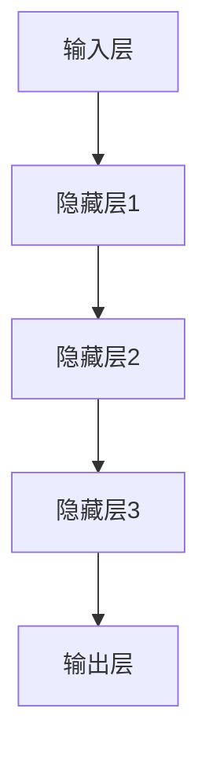

                 

作为人工智能领域中的重要一环，大规模模型（Large-scale Model）的研究和应用受到了广泛关注。这些模型以其卓越的表现力、适应性和推理能力，在自然语言处理、计算机视觉、推荐系统等多个领域取得了显著成果。然而，大规模模型的复杂性和高度非线性特性使得理解和优化它们的内部机制成为一大挑战。本文旨在对大规模模型的底层能力进行抽象化拆解，以揭示其内在的工作原理，从而为模型设计、优化和应用提供有益的指导。

本文将分为以下几个部分：

- **1. 背景介绍**：介绍大规模模型的发展背景和重要性。
- **2. 核心概念与联系**：阐述大规模模型中的核心概念，并使用 Mermaid 流程图展示其架构。
- **3. 核心算法原理 & 具体操作步骤**：深入探讨大规模模型的核心算法原理，详细描述其操作步骤。
- **4. 数学模型和公式 & 详细讲解 & 举例说明**：介绍大规模模型背后的数学模型和公式，并通过实例进行讲解。
- **5. 项目实践：代码实例和详细解释说明**：提供大规模模型的代码实现，并进行详细解释和分析。
- **6. 实际应用场景**：讨论大规模模型在不同应用领域的应用场景。
- **7. 工具和资源推荐**：推荐学习和开发大规模模型的工具和资源。
- **8. 总结：未来发展趋势与挑战**：总结研究成果，展望未来发展趋势和面临的挑战。
- **9. 附录：常见问题与解答**：回答关于大规模模型的常见问题。

接下来，我们将逐步深入探讨这些部分。

## 1. 背景介绍

### 大规模模型的发展背景

大规模模型的发展可以追溯到深度学习（Deep Learning）的兴起。随着计算能力的提升和数据量的激增，研究人员开始探索更深的神经网络结构，以期在各个领域中取得更好的性能。这一趋势催生了诸如GPT、BERT、ViT等代表性模型的出现，这些模型在图像识别、文本生成、机器翻译等方面展示了强大的能力。

### 大规模模型的重要性

大规模模型的重要性体现在以下几个方面：

- **1. 性能提升**：大规模模型能够通过更深的网络结构和更多的参数来捕捉复杂的数据特征，从而提升模型的性能。
- **2. 泛化能力**：大规模模型能够更好地泛化到未见过的数据上，提高模型的鲁棒性。
- **3. 应用范围**：大规模模型在自然语言处理、计算机视觉、推荐系统等领域都有广泛的应用，推动了人工智能技术的发展。

## 2. 核心概念与联系

### 大规模模型的架构

大规模模型通常由以下几个核心组件构成：

- **输入层**：接收外部数据输入，如文本、图像、音频等。
- **隐藏层**：包含多个隐藏层，每个隐藏层都能够对输入数据进行特征提取和变换。
- **输出层**：生成模型的输出结果，如分类标签、文本生成等。

### Mermaid 流程图展示

以下是一个简化的 Mermaid 流程图，用于展示大规模模型的架构：



### 核心概念与联系

- **1. 神经网络**：大规模模型是基于神经网络的结构，通过多个神经元（节点）的连接和激活函数来对输入数据进行处理。
- **2. 参数更新**：通过反向传播算法（Backpropagation）来更新模型参数，从而优化模型性能。
- **3. 特征提取**：隐藏层通过多次变换来提取输入数据的特征，这些特征用于生成最终的输出。

## 3. 核心算法原理 & 具体操作步骤

### 3.1 算法原理概述

大规模模型的核心算法基于深度学习，主要包括以下几个步骤：

- **1. 前向传播**：将输入数据通过多层神经网络进行传递，每个隐藏层都会对输入数据进行特征提取和变换。
- **2. 损失函数计算**：根据输出结果计算损失函数值，以评估模型的表现。
- **3. 反向传播**：通过反向传播算法，将损失函数的梯度反向传播到每个隐藏层，从而更新模型参数。

### 3.2 算法步骤详解

- **1. 初始化参数**：随机初始化模型的参数。
- **2. 前向传播**：
  - 将输入数据传递到第一个隐藏层。
  - 通过激活函数（如ReLU、Sigmoid等）对隐藏层输出进行非线性变换。
  - 将变换后的数据传递到下一个隐藏层，重复此过程，直到输出层。
- **3. 损失函数计算**：
  - 计算输出层与真实标签之间的差距。
  - 选择适当的损失函数（如交叉熵损失、均方误差等）来衡量模型的误差。
- **4. 反向传播**：
  - 计算损失函数关于模型参数的梯度。
  - 通过梯度下降（Gradient Descent）或其他优化算法来更新模型参数。
- **5. 迭代优化**：重复步骤2-4，直到模型达到预定的性能指标。

### 3.3 算法优缺点

- **优点**：
  - 高效的特征提取能力，能够自动学习输入数据的复杂特征。
  - 强大的泛化能力，能够在不同数据集上取得良好的表现。
- **缺点**：
  - 模型参数量大，训练时间较长。
  - 对数据质量和标注有较高的要求。

### 3.4 算法应用领域

大规模模型在以下领域有广泛的应用：

- **1. 自然语言处理**：文本分类、情感分析、机器翻译等。
- **2. 计算机视觉**：图像分类、目标检测、图像生成等。
- **3. 推荐系统**：基于内容的推荐、协同过滤等。

## 4. 数学模型和公式 & 详细讲解 & 举例说明

### 4.1 数学模型构建

大规模模型的数学模型主要包括以下几个部分：

- **1. 神经元激活函数**：
  $$ f(x) = \max(0, x) $$
  其中，\( f(x) \) 是ReLU激活函数，用于神经元输出。

- **2. 前向传播**：
  $$ z^{(l)} = W^{(l)} \cdot a^{(l-1)} + b^{(l)} $$
  其中，\( z^{(l)} \) 是第\( l \)层的输入，\( W^{(l)} \) 是第\( l \)层的权重矩阵，\( a^{(l-1)} \) 是第\( l-1 \)层的输出，\( b^{(l)} \) 是第\( l \)层的偏置向量。

- **3. 损失函数**：
  $$ J = \frac{1}{m} \sum_{i=1}^{m} \sum_{j=1}^{K} y_j^{(i)} \log a_j^{(L)} + (1 - y_j^{(i)}) \log (1 - a_j^{(L)}) $$
  其中，\( J \) 是损失函数，\( m \) 是样本数量，\( K \) 是类别数量，\( y_j^{(i)} \) 是第\( i \)个样本的第\( j \)个类别的真实标签，\( a_j^{(L)} \) 是第\( L \)层的输出。

### 4.2 公式推导过程

以下简要介绍前向传播和反向传播的推导过程：

#### 前向传播

- **1. 初始化**：设置输入数据\( x \)，初始化权重矩阵\( W \)和偏置向量\( b \)。
- **2. 计算输入**：\( z = W \cdot x + b \)。
- **3. 应用激活函数**：\( a = f(z) \)。
- **4. 重复步骤2和3**：对于每一层，重复上述步骤，直到输出层。

#### 反向传播

- **1. 计算输出误差**：\( \delta = (a - y) \odot f'(z) \)。
- **2. 反向传播误差**：\( \delta^{(l)} = \delta \cdot W^{(l+1)} \odot f'(z^{(l)}) \)。
- **3. 更新参数**：\( W^{(l)} = W^{(l)} - \alpha \cdot \delta^{(l+1)} \cdot a^{(l-1)}^T \)，\( b^{(l)} = b^{(l)} - \alpha \cdot \delta^{(l+1)} \)。

### 4.3 案例分析与讲解

#### 案例一：图像分类

假设我们有一个包含1000个类别的图像分类任务。输入图像的大小为\( 28 \times 28 \)像素，我们需要构建一个基于卷积神经网络（CNN）的模型。

- **1. 数据预处理**：将图像数据归一化，并转换为\( (28, 28, 1) \)的格式。
- **2. 构建模型**：
  - 输入层：接收\( (28, 28, 1) \)的图像数据。
  - 卷积层1：使用\( 3 \times 3 \)的卷积核进行特征提取，激活函数使用ReLU。
  - 池化层1：使用2x2的最大池化。
  - 卷积层2：使用\( 3 \times 3 \)的卷积核进行特征提取，激活函数使用ReLU。
  - 池化层2：使用2x2的最大池化。
  - 全连接层：将卷积层的输出展平为一维向量，输入到全连接层中进行分类，使用softmax激活函数。
- **3. 训练模型**：使用训练集进行训练，优化模型参数。
- **4. 测试模型**：使用测试集对模型进行评估。

#### 案例二：文本生成

假设我们有一个文本生成任务，输入为一段文本，输出为续写的文本。

- **1. 数据预处理**：将文本数据转换为单词或字符的序列，并转换为索引序列。
- **2. 构建模型**：
  - 输入层：接收文本输入。
  - 隐藏层：使用循环神经网络（RNN）或长短期记忆网络（LSTM）进行特征提取。
  - 输出层：使用softmax激活函数生成文本输出。
- **3. 训练模型**：使用训练集进行训练，优化模型参数。
- **4. 文本生成**：使用训练好的模型生成新的文本。

## 5. 项目实践：代码实例和详细解释说明

### 5.1 开发环境搭建

在开始大规模模型的实践之前，我们需要搭建一个合适的开发环境。以下是一个简单的搭建过程：

- **1. 安装Python**：确保安装了Python 3.7或更高版本。
- **2. 安装TensorFlow**：使用pip命令安装TensorFlow。
  ```bash
  pip install tensorflow
  ```
- **3. 安装其他依赖库**：根据具体任务的需求安装其他依赖库。

### 5.2 源代码详细实现

以下是一个简单的图像分类任务的代码实现：

```python
import tensorflow as tf
from tensorflow.keras import layers

# 数据预处理
def preprocess_data(x_train, x_test):
    # 归一化
    x_train = x_train / 255.0
    x_test = x_test / 255.0
    # 转换为批次形式
    x_train = x_train.reshape(-1, 28, 28, 1)
    x_test = x_test.reshape(-1, 28, 28, 1)
    return x_train, x_test

# 构建模型
def build_model():
    model = tf.keras.Sequential([
        layers.Conv2D(32, (3, 3), activation='relu', input_shape=(28, 28, 1)),
        layers.MaxPooling2D((2, 2)),
        layers.Conv2D(64, (3, 3), activation='relu'),
        layers.MaxPooling2D((2, 2)),
        layers.Flatten(),
        layers.Dense(128, activation='relu'),
        layers.Dense(10, activation='softmax')
    ])
    return model

# 训练模型
def train_model(model, x_train, y_train):
    model.compile(optimizer='adam', loss='sparse_categorical_crossentropy', metrics=['accuracy'])
    model.fit(x_train, y_train, epochs=5)

# 测试模型
def test_model(model, x_test, y_test):
    test_loss, test_acc = model.evaluate(x_test, y_test)
    print(f"Test accuracy: {test_acc}")

# 主函数
def main():
    # 加载数据
    (x_train, y_train), (x_test, y_test) = tf.keras.datasets.mnist.load_data()
    x_train, x_test = preprocess_data(x_train, x_test)

    # 构建模型
    model = build_model()

    # 训练模型
    train_model(model, x_train, y_train)

    # 测试模型
    test_model(model, x_test, y_test)

if __name__ == "__main__":
    main()
```

### 5.3 代码解读与分析

以上代码实现了基于卷积神经网络（CNN）的图像分类任务。以下是代码的详细解读：

- **1. 数据预处理**：将图像数据进行归一化和重塑，以便输入到模型中。
- **2. 构建模型**：使用TensorFlow的Keras API构建CNN模型，包括卷积层、池化层和全连接层。
- **3. 训练模型**：使用Adam优化器和交叉熵损失函数训练模型，共训练5个epoch。
- **4. 测试模型**：在测试集上评估模型的性能。

## 6. 实际应用场景

大规模模型在以下实际应用场景中展示了强大的能力：

- **自然语言处理**：在文本分类、情感分析、机器翻译等任务中，大规模模型能够自动学习文本的复杂特征，实现高效的语义理解和生成。
- **计算机视觉**：在图像分类、目标检测、图像生成等任务中，大规模模型能够捕捉图像的深层特征，实现高精度的图像理解和生成。
- **推荐系统**：在基于内容的推荐、协同过滤等任务中，大规模模型能够自动学习用户和商品的潜在特征，实现个性化的推荐。

## 7. 工具和资源推荐

### 7.1 学习资源推荐

- **书籍**：
  - 《深度学习》（Goodfellow, Bengio, Courville）  
  - 《神经网络与深度学习》（邱锡鹏）
- **在线课程**：
  - 吴恩达的《深度学习》课程
  - Andrew Ng的《机器学习》课程
- **博客和教程**：
  - [TensorFlow官网文档](https://www.tensorflow.org/tutorials)
  - [PyTorch官网文档](https://pytorch.org/tutorials)

### 7.2 开发工具推荐

- **框架**：
  - TensorFlow
  - PyTorch
- **可视化工具**：
  - TensorBoard
  - Visdom
- **数据集**：
  - ImageNet
  - MS COCO

### 7.3 相关论文推荐

- **2012**：AlexNet
- **2014**：VGGNet
- **2015**：GoogLeNet
- **2017**：ResNet
- **2018**：BERT

## 8. 总结：未来发展趋势与挑战

### 8.1 研究成果总结

大规模模型在过去几年中取得了显著的成果，主要体现在以下几个方面：

- **性能提升**：通过更深的网络结构和更多的参数，大规模模型在各个任务中取得了前所未有的性能。
- **应用范围扩展**：大规模模型在自然语言处理、计算机视觉、推荐系统等领域都有广泛的应用。
- **高效训练**：通过优化算法和硬件加速，大规模模型的训练时间大大缩短。

### 8.2 未来发展趋势

未来大规模模型的发展趋势主要包括以下几个方面：

- **模型压缩**：为了降低计算资源和存储成本，模型压缩成为重要研究方向。
- **多模态学习**：将图像、文本、音频等多种模态数据进行联合建模，以实现更强大的表现能力。
- **无监督学习**：开发能够从无监督数据中学习的模型，减少对大规模标注数据的依赖。

### 8.3 面临的挑战

尽管大规模模型取得了显著成果，但仍面临以下挑战：

- **计算资源消耗**：大规模模型对计算资源和存储资源的需求极高，这对硬件设备和数据中心的部署提出了挑战。
- **数据隐私保护**：大规模模型对训练数据的需求可能导致数据隐私泄露的风险。
- **模型解释性**：大规模模型的内部机制高度复杂，提高模型的解释性成为一项重要任务。

### 8.4 研究展望

未来研究应关注以下几个方面：

- **算法优化**：开发更高效、更鲁棒的算法，降低大规模模型的训练时间和计算成本。
- **多模态学习**：探索图像、文本、音频等多模态数据的联合建模方法。
- **模型解释性**：提高大规模模型的透明性和可解释性，增强模型的可信度和可靠性。

## 9. 附录：常见问题与解答

### 9.1 大规模模型如何处理过拟合？

**解答**：大规模模型可以通过以下方法处理过拟合：

- **正则化**：在模型训练过程中加入正则化项，如L1正则化、L2正则化，以降低模型的复杂度。
- **数据增强**：通过旋转、翻转、缩放等方式增加训练数据的多样性，提高模型的泛化能力。
- **交叉验证**：使用交叉验证方法评估模型的性能，避免过拟合。

### 9.2 大规模模型训练速度慢怎么办？

**解答**：为了提高大规模模型的训练速度，可以尝试以下方法：

- **分布式训练**：将模型训练任务分布到多台机器上，利用并行计算提高训练速度。
- **模型压缩**：通过模型剪枝、量化、压缩等技术降低模型的参数数量和计算量。
- **GPU加速**：使用GPU进行计算加速，提高模型的训练速度。

### 9.3 大规模模型如何应对数据隐私问题？

**解答**：为了应对大规模模型中的数据隐私问题，可以采取以下措施：

- **差分隐私**：在数据处理和模型训练过程中引入差分隐私机制，保护用户隐私。
- **联邦学习**：通过联邦学习技术，将模型训练任务分布到多个数据源上，降低数据泄露的风险。
- **加密技术**：使用加密技术对数据进行加密，确保数据在传输和存储过程中的安全性。

通过以上方法，可以有效地应对大规模模型中面临的数据隐私问题。

本文旨在对大规模模型的底层能力进行抽象化拆解，以揭示其内在的工作原理，并探讨其在实际应用中的挑战和发展趋势。希望本文能为读者在研究和应用大规模模型过程中提供有益的参考。

