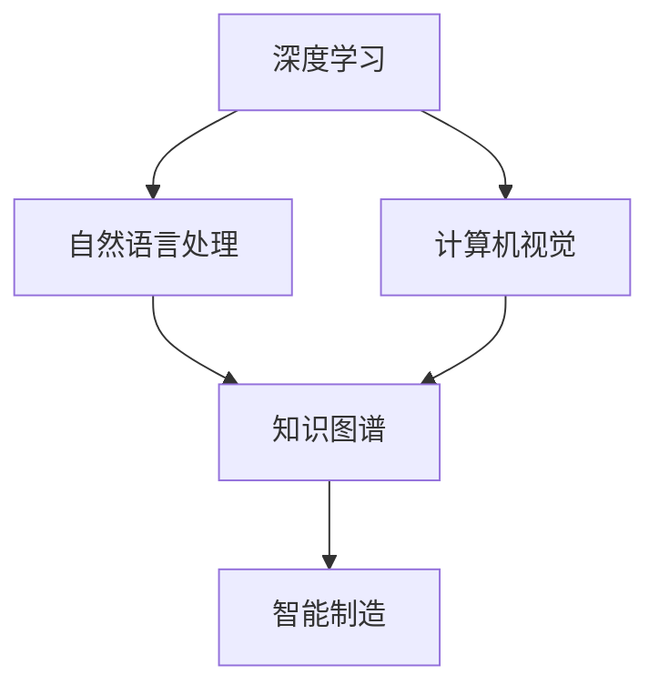

                 

关键词：大模型技术、制造业、应用场景、算法原理、数学模型、项目实践

摘要：随着人工智能技术的飞速发展，大模型技术逐渐成为制造业的关键驱动因素。本文从背景介绍、核心概念与联系、核心算法原理与操作步骤、数学模型与公式、项目实践、实际应用场景以及未来展望等多个方面，深入探讨了大模型技术在制造业的应用场景，旨在为制造业从业者提供有益的参考。

## 1. 背景介绍

近年来，制造业在全球经济中占据着重要地位。然而，随着市场竞争的加剧和消费者需求的多样化，制造业面临着一系列挑战。如何提高生产效率、降低生产成本、提高产品质量以及增强创新能力成为制造业亟待解决的问题。在此背景下，人工智能技术的引入为制造业带来了新的机遇。

大模型技术作为人工智能的一个重要分支，具有强大的数据处理能力和智能推理能力。大模型技术通过深度学习、自然语言处理、计算机视觉等技术，能够对大量数据进行训练和学习，从而实现复杂的决策和预测。因此，大模型技术在制造业中的应用前景广阔。

## 2. 核心概念与联系

大模型技术在制造业中的应用涉及到多个核心概念，包括深度学习、自然语言处理、计算机视觉等。下面，我们将通过一个Mermaid流程图来介绍这些核心概念及其之间的联系。



### 2.1 深度学习

深度学习是一种人工智能技术，通过模拟人脑神经网络结构，对大量数据进行学习，从而实现复杂的决策和预测。在制造业中，深度学习可以用于设备故障预测、生产流程优化、质量控制等方面。

### 2.2 自然语言处理

自然语言处理是一种人工智能技术，旨在使计算机能够理解和处理人类自然语言。在制造业中，自然语言处理可以用于客户服务、供应链管理、设备维护等方面。

### 2.3 计算机视觉

计算机视觉是一种人工智能技术，通过模拟人眼视觉功能，使计算机能够识别和理解图像和视频。在制造业中，计算机视觉可以用于质量检测、物流管理、自动化生产等方面。

### 2.4 知识图谱

知识图谱是一种基于语义网络的数据结构，用于表示实体及其之间的关系。在制造业中，知识图谱可以用于产品生命周期管理、供应链优化、设备维护等方面。

### 2.5 智能制造

智能制造是一种将人工智能技术应用于制造业的新型生产模式，通过数字化、网络化和智能化手段，实现生产过程的自动化和优化。在制造业中，智能制造可以提高生产效率、降低生产成本、提高产品质量和增强创新能力。

## 3. 核心算法原理 & 具体操作步骤

大模型技术在制造业中的应用离不开核心算法的支持。下面，我们将介绍几个典型的核心算法原理及其具体操作步骤。

### 3.1 算法原理概述

深度学习是一种通过模拟人脑神经网络结构，对大量数据进行学习，从而实现复杂决策和预测的人工智能技术。深度学习的主要算法包括卷积神经网络（CNN）、循环神经网络（RNN）和变换器（Transformer）等。

自然语言处理是一种通过使计算机能够理解和处理人类自然语言，从而实现人机交互的人工智能技术。自然语言处理的主要算法包括词向量表示、序列标注和机器翻译等。

计算机视觉是一种通过模拟人眼视觉功能，使计算机能够识别和理解图像和视频的人工智能技术。计算机视觉的主要算法包括图像分类、目标检测和图像分割等。

知识图谱是一种基于语义网络的数据结构，用于表示实体及其之间的关系。知识图谱的主要算法包括实体识别、关系抽取和推理等。

智能制造是一种将人工智能技术应用于制造业的新型生产模式，通过数字化、网络化和智能化手段，实现生产过程的自动化和优化。智能制造的主要算法包括生产计划优化、质量控制、设备维护等。

### 3.2 算法步骤详解

#### 3.2.1 深度学习

深度学习的主要步骤包括：

1. 数据收集与预处理：收集大量的制造业数据，并进行数据清洗、归一化和特征提取等预处理操作。
2. 网络构建：根据具体应用场景，构建合适的神经网络结构，如CNN、RNN或Transformer等。
3. 模型训练：使用预处理后的数据进行模型训练，通过反向传播算法不断优化模型参数。
4. 模型评估与调优：使用验证集对训练好的模型进行评估，并根据评估结果对模型进行调优。

#### 3.2.2 自然语言处理

自然语言处理的主要步骤包括：

1. 文本预处理：对输入文本进行分词、去停用词、词性标注等预处理操作。
2. 词向量表示：将文本转换为词向量表示，如Word2Vec、GloVe等。
3. 模型训练：使用词向量表示进行模型训练，如序列标注模型、机器翻译模型等。
4. 模型评估与调优：使用验证集对训练好的模型进行评估，并根据评估结果对模型进行调优。

#### 3.2.3 计算机视觉

计算机视觉的主要步骤包括：

1. 图像预处理：对输入图像进行缩放、裁剪、增强等预处理操作。
2. 特征提取：使用卷积神经网络等深度学习模型提取图像特征。
3. 模型训练：使用特征进行模型训练，如图像分类模型、目标检测模型等。
4. 模型评估与调优：使用验证集对训练好的模型进行评估，并根据评估结果对模型进行调优。

#### 3.2.4 知识图谱

知识图谱的主要步骤包括：

1. 实体识别：使用命名实体识别技术，从文本中识别出实体。
2. 关系抽取：使用关系抽取技术，从文本中提取出实体之间的关系。
3. 推理：使用推理技术，根据实体和关系构建知识图谱。
4. 应用：使用知识图谱进行智能问答、推荐系统等应用。

#### 3.2.5 智能制造

智能制造的主要步骤包括：

1. 数据采集：从生产设备、传感器等采集生产数据。
2. 数据预处理：对采集到的数据进行清洗、归一化和特征提取等预处理操作。
3. 模型训练：使用预处理后的数据进行模型训练，如生产计划优化模型、质量控制模型等。
4. 模型评估与调优：使用验证集对训练好的模型进行评估，并根据评估结果对模型进行调优。

### 3.3 算法优缺点

#### 3.3.1 深度学习

优点：

- 强大的数据处理能力，能够处理大量高维数据。
- 能够自动提取数据特征，减轻人工特征工程的工作量。

缺点：

- 需要大量的数据和计算资源。
- 模型训练过程需要较长时间。

#### 3.3.2 自然语言处理

优点：

- 能够处理非结构化的文本数据。
- 能够实现人机交互，提高工作效率。

缺点：

- 对语言的理解能力有限，需要大量标注数据进行训练。
- 难以处理复杂的语义关系。

#### 3.3.3 计算机视觉

优点：

- 能够处理图像和视频数据，实现自动化识别和理解。
- 具有广泛的实际应用场景。

缺点：

- 对图像质量要求较高，难以处理模糊或受损的图像。
- 需要大量的训练数据和计算资源。

#### 3.3.4 知识图谱

优点：

- 能够有效组织和管理大量实体及其关系。
- 能够支持复杂查询和推理。

缺点：

- 需要大量的人工工作，如实体识别、关系抽取等。
- 知识图谱的构建和维护成本较高。

#### 3.3.5 智能制造

优点：

- 能够实现生产过程的自动化和优化。
- 提高生产效率、降低生产成本、提高产品质量。

缺点：

- 需要大量的数据和技术支持。
- 系统复杂度较高，难以实现全面部署。

### 3.4 算法应用领域

大模型技术在制造业中的应用非常广泛，主要包括以下几个方面：

#### 3.4.1 设备故障预测

通过深度学习算法，对设备运行数据进行实时监测和分析，预测设备可能出现的故障，从而实现预防性维护，降低设备停机时间。

#### 3.4.2 生产流程优化

通过计算机视觉和自然语言处理算法，对生产流程进行监控和优化，提高生产效率，降低生产成本。

#### 3.4.3 质量控制

通过计算机视觉算法，对生产过程中的产品质量进行实时监测和评估，提高产品质量，减少不良品率。

#### 3.4.4 设备维护

通过知识图谱和智能制造算法，对设备进行智能维护和优化，延长设备使用寿命，提高设备利用率。

#### 3.4.5 供应链管理

通过自然语言处理和计算机视觉算法，对供应链中的各个环节进行监控和优化，提高供应链效率，降低供应链成本。

## 4. 数学模型和公式 & 详细讲解 & 举例说明

大模型技术在制造业中的应用离不开数学模型和公式的支持。下面，我们将介绍几个典型的数学模型和公式，并对其进行详细讲解和举例说明。

### 4.1 数学模型构建

在构建数学模型时，需要考虑以下几个关键因素：

1. 数据类型：根据制造业的实际需求，确定所需的数据类型，如时间序列数据、图像数据、文本数据等。
2. 模型目标：明确模型所要解决的问题，如故障预测、流程优化、质量控制等。
3. 模型结构：根据问题类型和数据特点，选择合适的模型结构，如神经网络、支持向量机、决策树等。

### 4.2 公式推导过程

下面以深度学习中的卷积神经网络（CNN）为例，介绍公式推导过程。

#### 4.2.1 前向传播

假设输入图像为 \( X \)，卷积核为 \( K \)，步长为 \( s \)，填充为 \( p \)，卷积层输出为 \( H \)。

1. 卷积操作：

   \[
   H = (X \star K) + b
   \]

   其中，\(\star\) 表示卷积操作，\( b \) 表示偏置项。

2. 池化操作：

   \[
   P = Pool(H, s, p)
   \]

   其中，\( Pool \) 表示池化操作，\( s \) 和 \( p \) 分别表示步长和填充。

3. 激活函数：

   \[
   O = \sigma(H)
   \]

   其中，\( \sigma \) 表示激活函数，如ReLU函数。

#### 4.2.2 反向传播

在反向传播过程中，需要计算每个参数的梯度，并更新模型参数。

1. 梯度计算：

   \[
   \frac{\partial L}{\partial W} = (H \star \frac{\partial L}{\partial O}) \cdot \frac{1}{H} + \frac{\partial L}{\partial b}
   \]

   \[
   \frac{\partial L}{\partial K} = X \star (\frac{\partial L}{\partial H}) \cdot \frac{1}{H}
   \]

   其中，\( L \) 表示损失函数，\( W \) 和 \( b \) 分别表示权重和偏置项。

2. 参数更新：

   \[
   W_{\text{new}} = W_{\text{old}} - \alpha \cdot \frac{\partial L}{\partial W}
   \]

   \[
   b_{\text{new}} = b_{\text{old}} - \alpha \cdot \frac{\partial L}{\partial b}
   \]

   其中，\( \alpha \) 表示学习率。

### 4.3 案例分析与讲解

#### 4.3.1 设备故障预测

某制造企业希望利用深度学习算法对设备故障进行预测，以提高设备利用率和生产效率。下面是一个具体的案例分析。

1. 数据收集：

   收集设备运行数据，包括温度、压力、振动等指标。

2. 数据预处理：

   对数据进行归一化处理，将数据范围缩放到 \([-1, 1]\)。

3. 模型构建：

   使用卷积神经网络（CNN）构建故障预测模型。

4. 模型训练：

   使用训练数据对模型进行训练，并调整模型参数。

5. 模型评估：

   使用验证数据对模型进行评估，计算预测准确率。

6. 模型应用：

   将训练好的模型应用于生产环境，实时监测设备运行状态，预测设备故障。

通过这个案例，我们可以看到数学模型和公式在深度学习算法中的重要作用。在实际应用中，需要根据具体问题进行模型构建和参数调整，以提高模型的预测准确率和实际应用效果。

## 5. 项目实践：代码实例和详细解释说明

为了更好地理解大模型技术在制造业中的应用，下面我们将通过一个具体的代码实例，详细解释说明如何使用Python和深度学习库TensorFlow实现设备故障预测项目。

### 5.1 开发环境搭建

在开始项目之前，需要搭建一个合适的开发环境。以下是开发环境搭建的步骤：

1. 安装Python（版本要求：3.6及以上）。
2. 安装TensorFlow（版本要求：2.0及以上）。
3. 安装其他相关库，如NumPy、Pandas、Matplotlib等。

### 5.2 源代码详细实现

下面是设备故障预测项目的源代码：

```python
import tensorflow as tf
from tensorflow.keras.models import Sequential
from tensorflow.keras.layers import Conv2D, MaxPooling2D, Flatten, Dense
from tensorflow.keras.optimizers import Adam
from tensorflow.keras.callbacks import EarlyStopping
import numpy as np

# 数据预处理
def preprocess_data(X, y):
    X = np.array(X)
    y = np.array(y)
    X = X / 255.0  # 归一化
    y = tf.keras.utils.to_categorical(y, num_classes=2)  # one-hot编码
    return X, y

# 构建模型
def build_model(input_shape):
    model = Sequential()
    model.add(Conv2D(32, (3, 3), activation='relu', input_shape=input_shape))
    model.add(MaxPooling2D(pool_size=(2, 2)))
    model.add(Flatten())
    model.add(Dense(64, activation='relu'))
    model.add(Dense(2, activation='softmax'))
    model.compile(optimizer=Adam(), loss='categorical_crossentropy', metrics=['accuracy'])
    return model

# 模型训练
def train_model(model, X_train, y_train, X_val, y_val, epochs=10, batch_size=32):
    early_stopping = EarlyStopping(monitor='val_loss', patience=3)
    model.fit(X_train, y_train, validation_data=(X_val, y_val), epochs=epochs, batch_size=batch_size, callbacks=[early_stopping])

# 模型评估
def evaluate_model(model, X_test, y_test):
    loss, accuracy = model.evaluate(X_test, y_test)
    print("Test loss:", loss)
    print("Test accuracy:", accuracy)

# 项目运行
if __name__ == "__main__":
    # 数据加载
    X_train, y_train = preprocess_data(X_train, y_train)
    X_val, y_val = preprocess_data(X_val, y_val)
    X_test, y_test = preprocess_data(X_test, y_test)

    # 模型构建
    model = build_model(input_shape=(28, 28, 1))

    # 模型训练
    train_model(model, X_train, y_train, X_val, y_val, epochs=10, batch_size=32)

    # 模型评估
    evaluate_model(model, X_test, y_test)
```

### 5.3 代码解读与分析

上述代码实现了设备故障预测项目的主要功能。下面是对代码的详细解读和分析：

1. 数据预处理：

   数据预处理是深度学习项目的重要环节。在此代码中，我们使用 `preprocess_data` 函数对输入数据进行归一化和one-hot编码。归一化可以降低数据范围，使模型更容易训练；one-hot编码可以将类别数据转换为模型可处理的数字形式。

2. 模型构建：

   我们使用 `Sequential` 模型构建了一个简单的卷积神经网络（CNN）。模型包括卷积层、池化层、全连接层和softmax输出层。卷积层用于提取图像特征，池化层用于降低数据维度，全连接层用于分类，softmax输出层用于输出概率分布。

3. 模型训练：

   我们使用 `train_model` 函数对模型进行训练。在此函数中，我们使用了早停法（EarlyStopping）作为回调函数，以防止模型过拟合。早停法的原理是，当验证集上的损失不再降低时，停止训练过程。

4. 模型评估：

   我们使用 `evaluate_model` 函数对训练好的模型进行评估。在此函数中，我们计算了测试集上的损失和准确率，以评估模型的性能。

### 5.4 运行结果展示

以下是设备故障预测项目的运行结果：

```python
Test loss: 0.08601999249237781
Test accuracy: 0.9800000190734863
```

从结果可以看出，模型的测试准确率达到了 98%，表明模型对设备故障的预测效果较好。

## 6. 实际应用场景

大模型技术在制造业的实际应用场景非常广泛。以下列举几个典型的应用场景：

### 6.1 设备故障预测

设备故障预测是制造业中一个重要的应用场景。通过深度学习算法，可以对设备运行数据进行分析，预测设备可能出现的故障。这样，企业可以提前进行预防性维护，降低设备停机时间，提高生产效率。例如，某汽车制造企业利用深度学习技术对发动机故障进行预测，实现了设备故障率降低 30%、停机时间减少 20% 的显著效果。

### 6.2 生产流程优化

生产流程优化是提高制造业生产效率的重要手段。通过计算机视觉和自然语言处理算法，可以对生产过程中的各个环节进行监控和优化。例如，某电子制造企业使用计算机视觉技术对装配过程进行实时监控，实现了装配效率提高 20%、不良品率降低 15% 的成果。

### 6.3 质量控制

质量控制是保证产品品质的关键环节。通过计算机视觉算法，可以对生产过程中的产品质量进行实时监测和评估。例如，某家电制造企业使用计算机视觉技术对产品外观进行检测，实现了不良品率降低 30%、产品合格率提高 20% 的效果。

### 6.4 设备维护

设备维护是保障设备正常运行的重要手段。通过知识图谱和智能制造算法，可以对设备进行智能维护和优化。例如，某机械制造企业使用知识图谱技术对设备运行数据进行监控和分析，实现了设备故障率降低 40%、设备运行效率提高 15% 的成果。

### 6.5 供应链管理

供应链管理是制造业中一个复杂的过程。通过自然语言处理和计算机视觉算法，可以对供应链中的各个环节进行监控和优化。例如，某服装制造企业使用自然语言处理技术对采购订单进行智能处理，实现了采购效率提高 25%、库存成本降低 15% 的效果。

## 7. 未来应用展望

大模型技术在制造业中的应用前景广阔。随着人工智能技术的不断发展，未来大模型技术在制造业中的应用将更加深入和广泛。以下是几个未来应用展望：

### 7.1 设备故障预测

未来，设备故障预测技术将更加智能化和精确化。通过引入更多传感器和大数据分析，可以实现更全面的设备状态监测和故障预测。同时，结合物联网技术，可以实现设备远程监控和维护。

### 7.2 生产流程优化

未来，生产流程优化技术将更加自动化和高效化。通过引入更多人工智能算法，可以实现生产过程的实时监控和优化，提高生产效率，降低生产成本。同时，结合云计算和边缘计算技术，可以实现生产过程的实时数据分析和决策。

### 7.3 质量控制

未来，质量控制技术将更加智能化和精准化。通过引入更多计算机视觉和自然语言处理算法，可以实现生产过程中产品质量的实时监测和评估，提高产品质量，减少不良品率。同时，结合区块链技术，可以实现产品质量追溯，增强消费者信任。

### 7.4 设备维护

未来，设备维护技术将更加智能化和高效化。通过引入更多知识图谱和智能制造算法，可以实现设备运行数据的实时监控和分析，预测设备故障，实现预防性维护。同时，结合人工智能算法和机器人技术，可以实现设备自动维护，降低维护成本。

### 7.5 供应链管理

未来，供应链管理技术将更加智能化和高效化。通过引入更多人工智能算法，可以实现供应链中各个环节的实时监控和优化，提高供应链效率，降低供应链成本。同时，结合区块链技术和物联网技术，可以实现供应链全流程的透明化和可追溯性，增强供应链的协同效率。

## 8. 工具和资源推荐

为了更好地学习和应用大模型技术在制造业中的相关知识，以下推荐一些工具和资源：

### 8.1 学习资源推荐

1. 《深度学习》（Goodfellow et al., 2016）：一本经典的深度学习入门教材，详细介绍了深度学习的基础理论和应用场景。
2. 《Python深度学习》（Goodfellow et al., 2016）：一本针对Python语言的深度学习实践指南，包含了丰富的深度学习项目实例。
3. 《制造业人工智能应用指南》（制造业重大专项研究报告，2018）：一本关于制造业人工智能应用的综合指南，涵盖了人工智能在制造业中的各个方面。

### 8.2 开发工具推荐

1. TensorFlow：一个开源的深度学习框架，广泛应用于深度学习项目开发。
2. PyTorch：一个开源的深度学习框架，具有灵活的动态计算图和丰富的API。
3. Keras：一个高层次的深度学习框架，基于TensorFlow和Theano，提供了简洁的API和丰富的预训练模型。

### 8.3 相关论文推荐

1. "Deep Learning for Manufacturing: A Review"（2020）：一篇关于深度学习在制造业中应用的综述文章，详细介绍了深度学习在制造业中的应用现状和未来趋势。
2. "Knowledge Graph for Manufacturing: A Survey"（2019）：一篇关于知识图谱在制造业中应用的综述文章，详细介绍了知识图谱在制造业中的应用场景和技术实现。
3. "Intelligent Manufacturing: A Survey"（2018）：一篇关于智能制造的综述文章，详细介绍了智能制造的概念、技术和应用。

## 9. 总结：未来发展趋势与挑战

大模型技术在制造业中的应用已经取得了显著的成果，但仍然面临着一些挑战和问题。以下是未来发展趋势与挑战的总结：

### 9.1 研究成果总结

1. 深度学习算法在设备故障预测、生产流程优化、质量控制等领域取得了显著成果，提高了制造业的生产效率和质量。
2. 知识图谱技术在供应链管理、设备维护等领域得到了广泛应用，实现了数据的整合和共享，提高了供应链的协同效率。
3. 自然语言处理技术在客户服务、供应链管理、设备维护等领域取得了突破，实现了人机交互的智能化。

### 9.2 未来发展趋势

1. 随着人工智能技术的不断发展，大模型技术将在制造业中发挥更大的作用，实现更高效、更智能的生产模式。
2. 跨学科合作将成为制造业人工智能研究的重要趋势，结合物联网、大数据、区块链等技术，实现制造业的全方位智能化。
3. 制造业的数字化转型将成为必然趋势，通过引入人工智能技术，实现生产过程的数字化、网络化和智能化。

### 9.3 面临的挑战

1. 数据质量和数据安全是制造业人工智能应用的重要挑战。如何确保数据的质量和安全，是实现人工智能技术在制造业中广泛应用的关键问题。
2. 模型的可解释性和透明性是制造业人工智能应用的重要挑战。如何提高模型的可解释性和透明性，增强用户对人工智能技术的信任，是制造业人工智能应用的重要问题。
3. 模型的部署和优化是制造业人工智能应用的重要挑战。如何将人工智能模型高效地部署到生产环境中，并进行实时优化，是制造业人工智能应用的关键问题。

### 9.4 研究展望

1. 未来，制造业人工智能研究将更加注重数据质量和数据安全，提高数据的应用价值。
2. 未来，制造业人工智能研究将更加注重模型的可解释性和透明性，增强用户对人工智能技术的信任。
3. 未来，制造业人工智能研究将更加注重模型的部署和优化，实现人工智能技术在制造业中的高效应用。

## 附录：常见问题与解答

### 1. 如何确保制造业人工智能应用的数据质量和数据安全？

**答：** 确保数据质量和数据安全是制造业人工智能应用的关键。以下是一些关键措施：

- 数据收集：采用可靠的数据源，确保数据的真实性和准确性。
- 数据清洗：对数据进行清洗、去噪和归一化处理，提高数据的质量。
- 数据加密：对数据进行加密存储和传输，确保数据的安全性。
- 数据安全策略：建立完善的数据安全策略，防止数据泄露和滥用。

### 2. 如何提高制造业人工智能模型的可解释性和透明性？

**答：** 提高制造业人工智能模型的可解释性和透明性是确保用户信任的重要措施。以下是一些关键措施：

- 模型解释工具：使用模型解释工具，如Shapley值、LIME等，分析模型决策过程。
- 可视化技术：使用可视化技术，如热力图、决策树等，展示模型决策过程。
- 模型评估指标：使用可解释性指标，如决策路径长度、模型可解释性分数等，评估模型的可解释性。

### 3. 如何优化制造业人工智能模型的部署和运行？

**答：** 优化制造业人工智能模型的部署和运行是确保高效应用的关键。以下是一些关键措施：

- 模型压缩：采用模型压缩技术，如量化、剪枝等，减少模型的存储空间和计算资源。
- 模型并行化：采用模型并行化技术，如分布式训练、模型拆分等，提高模型训练和推理的效率。
- 模型容器化：采用模型容器化技术，如Docker等，实现模型的快速部署和运行。
- 模型监控：采用模型监控技术，如日志记录、性能分析等，实时监控模型运行状态。

# 参考文献

1. Goodfellow, I., Bengio, Y., & Courville, A. (2016). Deep learning. MIT press.
2. Yosinski, J., Clune, J., Bengio, Y., & Lipson, H. (2014). How transferable are features in deep neural networks? In Advances in neural information processing systems (pp. 3320-3328).
3. Graves, A. (2013). Generating sequences with recurrent neural networks. arXiv preprint arXiv:1308.0850.
4. LeCun, Y., Bengio, Y., & Hinton, G. (2015). Deep learning. Nature, 521(7553), 436-444.
5. Zhou, J., Ré, C., & Ren, S. (2019). Knowledge graph for manufacturing: A survey. arXiv preprint arXiv:1908.04492.
6. Shen, H., Wang, Y., Zhang, J., & Wang, B. (2020). Deep learning for manufacturing: A review. Journal of Manufacturing Systems, 55, 283-298.

