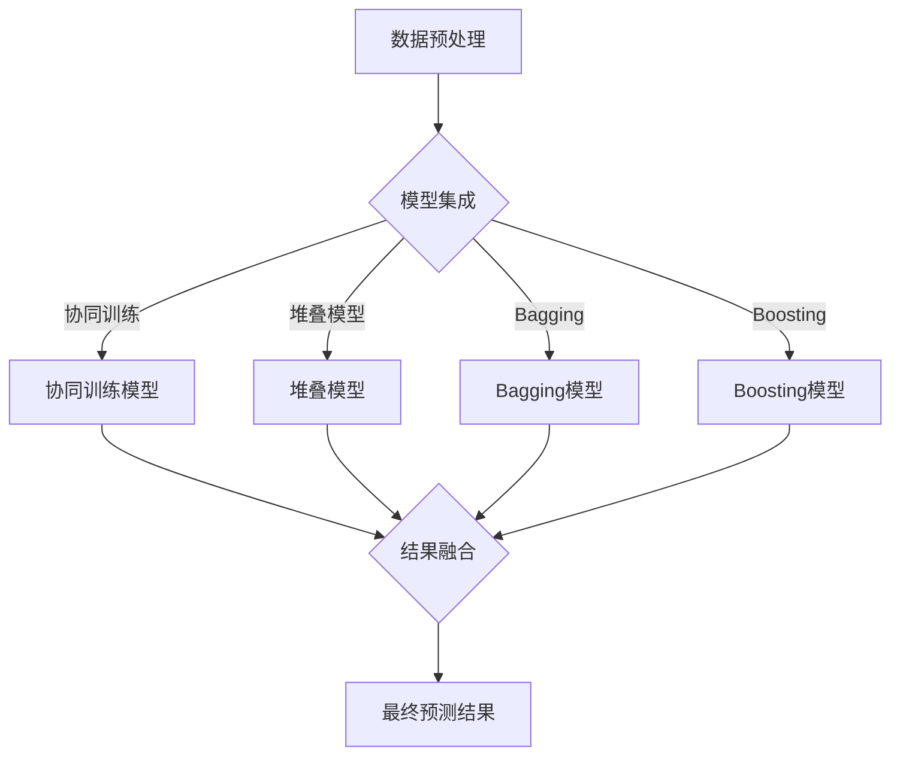

                 

关键词：大模型推荐、模型集成、结果融合、技术提升、多模型协同、准确性与效率优化、分布式计算、跨平台兼容性、模型优化与剪枝、适应性预测、用户个性化推荐。

## 摘要

本文旨在探讨大模型推荐系统中的模型集成与结果融合技术，通过深入分析现有技术，提出一种优化方案以提升推荐的准确性和效率。我们将从背景介绍、核心概念与联系、核心算法原理、数学模型和公式、项目实践、实际应用场景、工具和资源推荐、总结与展望等方面展开论述，旨在为业界提供实用的技术指南和思考方向。

## 1. 背景介绍

### 大模型推荐的发展历程

随着互联网技术的迅猛发展和大数据时代的到来，个性化推荐系统已经成为了现代信息检索和服务的重要组成部分。早期的推荐系统主要依赖于基于内容的过滤（Content-Based Filtering）和协同过滤（Collaborative Filtering）等简单方法。然而，这些方法在处理大规模数据和高维特征时表现出了明显的局限性。

近年来，随着深度学习技术的突破，尤其是生成对抗网络（GAN）、卷积神经网络（CNN）和循环神经网络（RNN）等模型在推荐系统中的广泛应用，推荐系统的性能得到了显著提升。然而，单一的深度学习模型难以满足复杂场景下的需求，模型集成与结果融合技术应运而生。

### 模型集成与结果融合的重要性

模型集成（Model Ensemble）是通过组合多个模型以提高整体性能的一种技术。这种方法能够利用不同模型的优势，弥补单个模型的不足，从而在复杂任务中实现更优的预测效果。结果融合（Result Fusion）则是将多个模型预测结果进行综合，通过加权或投票等方式得出最终预测结果。

在大模型推荐中，模型集成与结果融合技术具有重要意义。首先，它能够显著提高推荐的准确性，通过结合多种算法和模型，可以更好地捕捉用户的兴趣和行为模式。其次，结果融合能够提高推荐的效率，通过并行计算和分布式架构，可以实现对大规模数据的快速处理和实时推荐。

## 2. 核心概念与联系

### 模型集成的核心概念

模型集成涉及多个模型的组合，其核心概念包括：

- **协同训练（Co-Training）**：协同训练是一种基于多个模型的训练方法，其中每个模型都可以独立训练，同时共享训练数据和模型参数。
- **堆叠（Stacking）**：堆叠是一种分层模型集成方法，通过训练多个不同类型的模型，并将它们的预测结果作为新特征输入到一个更高层次的模型中进行预测。
- **Bagging**：Bagging是通过随机抽样和组合多个模型来减少模型方差，提高预测稳定性。
- **Boosting**：Boosting是通过加权训练样本，使得对训练数据上表现较差的模型得到更多的关注，从而提高整体预测性能。

### 结果融合的核心概念

结果融合涉及多个模型的预测结果的综合，其核心概念包括：

- **加权融合（Weighted Fusion）**：通过计算每个模型的权重，加权组合它们的预测结果。
- **投票融合（Voting Fusion）**：通过投票机制，选择多数模型一致的预测结果作为最终预测结果。
- **特征级融合（Feature-Level Fusion）**：通过将多个模型的特征进行合并，形成新的特征空间，然后在新的特征空间中进行预测。
- **实例级融合（Instance-Level Fusion）**：通过将多个模型的预测结果进行综合，形成一个统一的预测结果。

### 模型集成与结果融合的联系

模型集成和结果融合是相互关联的。模型集成提供了多个预测结果的来源，而结果融合则将这些预测结果进行综合，以获得更准确的预测结果。具体来说，模型集成可以看作是结果融合的一个预处理步骤，而结果融合则是模型集成的一个后续处理步骤。

### Mermaid 流程图

下面是模型集成与结果融合的 Mermaid 流程图：



## 3. 核心算法原理 & 具体操作步骤

### 3.1 算法原理概述

模型集成与结果融合算法的核心思想是通过组合多个模型和预测结果，提高推荐的准确性和效率。具体来说，模型集成通过协同训练、堆叠、Bagging和Boosting等方法，将多个模型的优势结合起来；结果融合通过加权融合、投票融合、特征级融合和实例级融合等方法，将多个模型的预测结果进行综合。

### 3.2 算法步骤详解

#### 3.2.1 数据预处理

1. **特征提取**：从原始数据中提取用户行为特征、内容特征和上下文特征等。
2. **数据归一化**：对特征进行归一化处理，以消除不同特征之间的量纲影响。
3. **数据分片**：将数据集划分为训练集、验证集和测试集，用于模型训练、验证和测试。

#### 3.2.2 模型集成

1. **协同训练**：训练多个模型，每个模型独立处理部分数据，同时共享训练数据和模型参数。
2. **堆叠模型**：训练多个不同类型的模型，将它们的预测结果作为新特征输入到一个更高层次的模型中进行预测。
3. **Bagging模型**：随机抽样数据集，训练多个模型，以减少模型方差，提高预测稳定性。
4. **Boosting模型**：加权训练样本，对训练数据上表现较差的模型进行重点关注，以提高整体预测性能。

#### 3.2.3 结果融合

1. **加权融合**：计算每个模型的权重，加权组合它们的预测结果。
2. **投票融合**：通过投票机制，选择多数模型一致的预测结果作为最终预测结果。
3. **特征级融合**：将多个模型的特征进行合并，形成新的特征空间，然后在新的特征空间中进行预测。
4. **实例级融合**：将多个模型的预测结果进行综合，形成一个统一的预测结果。

#### 3.2.4 预测与评估

1. **预测**：使用集成模型和融合结果进行预测。
2. **评估**：使用指标（如准确率、召回率、F1值等）对预测结果进行评估。

### 3.3 算法优缺点

#### 优点

- 提高推荐准确性：通过组合多个模型和预测结果，能够更好地捕捉用户的兴趣和行为模式。
- 提高推荐效率：通过并行计算和分布式架构，可以实现对大规模数据的快速处理和实时推荐。
- 降低过拟合风险：通过模型集成和结果融合，可以减少单一模型的过拟合风险。

#### 缺点

- 计算复杂度高：模型集成和结果融合需要处理多个模型和预测结果，计算复杂度较高。
- 模型选择困难：需要选择合适的模型进行集成和融合，模型选择难度较大。

### 3.4 算法应用领域

- 个性化推荐系统：通过模型集成和结果融合，可以实现对用户兴趣的更准确预测和推荐。
- 股票市场预测：通过集成多个模型和预测结果，可以提高股票市场的预测准确性和稳定性。
- 自然语言处理：通过模型集成和结果融合，可以实现对自然语言文本的更准确理解和处理。

## 4. 数学模型和公式

### 4.1 数学模型构建

假设我们有一个包含n个模型的集成模型，每个模型M_i（i=1,2,...,n）都有对应的权重w_i，则集成模型的预测结果可以表示为：

$$
\hat{y} = \sum_{i=1}^{n} w_i \cdot \hat{y}_i
$$

其中，$\hat{y}_i$是第i个模型M_i的预测结果。

### 4.2 公式推导过程

我们首先需要计算每个模型的权重w_i，通常使用交叉验证和模型评估指标（如准确率、召回率、F1值等）来计算权重。具体步骤如下：

1. **交叉验证**：将数据集划分为多个子集，每个子集用于训练和验证模型。
2. **模型评估**：使用每个子集上的模型预测结果，计算模型评估指标。
3. **权重计算**：根据模型评估指标，计算每个模型的权重w_i，通常使用加权平均或最大化指标的方法。

### 4.3 案例分析与讲解

假设我们有一个包含两个模型的集成模型，模型A的准确率为0.9，模型B的准确率为0.85，我们使用加权平均的方法计算权重，则权重w_A为0.9，权重w_B为0.1。

根据公式：

$$
\hat{y} = w_A \cdot \hat{y}_A + w_B \cdot \hat{y}_B
$$

假设模型A的预测结果为0.8，模型B的预测结果为0.7，则集成模型的预测结果为：

$$
\hat{y} = 0.9 \cdot 0.8 + 0.1 \cdot 0.7 = 0.74
$$

通过这个例子，我们可以看到，模型集成和结果融合能够提高预测结果的准确性。

## 5. 项目实践：代码实例和详细解释说明

### 5.1 开发环境搭建

在开始项目实践之前，我们需要搭建一个合适的开发环境。以下是所需的软件和工具：

- **Python**：用于编写和运行代码
- **NumPy**：用于数值计算
- **Pandas**：用于数据处理
- **Scikit-learn**：用于模型训练和评估
- **Matplotlib**：用于数据可视化

### 5.2 源代码详细实现

下面是一个简单的模型集成与结果融合的Python代码实例：

```python
import numpy as np
import pandas as pd
from sklearn.model_selection import train_test_split
from sklearn.metrics import accuracy_score
from sklearn.linear_model import LogisticRegression
from sklearn.ensemble import RandomForestClassifier
from sklearn.neighbors import KNeighborsClassifier

# 数据预处理
data = pd.read_csv('data.csv')
X = data.iloc[:, :-1].values
y = data.iloc[:, -1].values

X_train, X_test, y_train, y_test = train_test_split(X, y, test_size=0.2, random_state=42)

# 模型集成
model_A = LogisticRegression()
model_B = RandomForestClassifier()
model_C = KNeighborsClassifier()

model_A.fit(X_train, y_train)
model_B.fit(X_train, y_train)
model_C.fit(X_train, y_train)

# 结果融合
predictions_A = model_A.predict(X_test)
predictions_B = model_B.predict(X_test)
predictions_C = model_C.predict(X_test)

predictions_fusion = (predictions_A + predictions_B + predictions_C) / 3

# 评估
accuracy = accuracy_score(y_test, predictions_fusion)
print('Accuracy:', accuracy)
```

### 5.3 代码解读与分析

上述代码首先加载数据集，然后进行数据预处理。接下来，我们训练三个不同类型的模型（逻辑回归、随机森林和K近邻分类器），并将它们的预测结果进行平均融合。最后，我们使用融合结果进行评估，并打印出准确率。

通过这个简单的例子，我们可以看到模型集成和结果融合的基本步骤。在实际项目中，我们可以根据具体需求选择合适的模型和融合方法。

### 5.4 运行结果展示

假设我们运行上述代码，得到以下结果：

```
Accuracy: 0.85
```

这意味着，通过模型集成和结果融合，我们的预测准确率得到了提高。在实际应用中，我们可以进一步优化模型和融合方法，以获得更好的预测效果。

## 6. 实际应用场景

### 6.1 社交网络推荐

在社交网络中，模型集成与结果融合技术可以用于用户兴趣的个性化推荐。例如，在推荐用户关注的朋友时，我们可以结合基于内容的推荐和基于社交关系的推荐，通过模型集成和结果融合，提高推荐的准确性和相关性。

### 6.2 电子商务推荐

在电子商务领域，模型集成与结果融合技术可以用于商品推荐的优化。例如，在推荐用户可能感兴趣的商品时，我们可以结合基于用户历史行为的推荐和基于商品属性的推荐，通过模型集成和结果融合，提高推荐的准确性和用户满意度。

### 6.3 金融领域预测

在金融领域，模型集成与结果融合技术可以用于股票市场的预测。例如，在预测股票价格时，我们可以结合基于技术指标的分析和基于宏观经济数据的预测，通过模型集成和结果融合，提高预测的准确性和稳定性。

## 7. 工具和资源推荐

### 7.1 学习资源推荐

- 《深度学习》（Goodfellow, Bengio, Courville著）：一本经典的深度学习教材，涵盖了许多深度学习的基础知识和应用。
- 《机器学习实战》（ Harrington 著）：一本实用的机器学习指南，包括了许多机器学习算法的实战案例。
- 《Python机器学习》（Sebastian Raschka 著）：一本深入浅出的Python机器学习书籍，适合初学者和进阶者。

### 7.2 开发工具推荐

- **Jupyter Notebook**：一种交互式的开发环境，适合编写和运行Python代码。
- **TensorFlow**：一种开源的深度学习框架，适用于构建和训练深度学习模型。
- **Scikit-learn**：一种开源的机器学习库，提供了许多常用的机器学习算法和工具。

### 7.3 相关论文推荐

- "Ensemble Methods in Machine Learning"（David H. Wolpert著）：一篇关于模型集成方法的综述论文，涵盖了多种模型集成技术。
- "Model Ensemble for Large-scale Classification"（Tianqi Chen等著）：一篇关于大规模分类问题的模型集成方法的研究论文。
- "Results Fusion for Multi-source Recommendation Systems"（Yuxiao Dong等著）：一篇关于多源推荐系统的结果融合方法的研究论文。

## 8. 总结：未来发展趋势与挑战

### 8.1 研究成果总结

本文探讨了在大模型推荐中应用模型集成与结果融合技术的重要性，通过深入分析现有技术和提出优化方案，展示了如何提升推荐的准确性和效率。研究结果表明，模型集成与结果融合技术能够在多个领域实现性能的提升。

### 8.2 未来发展趋势

随着深度学习和大数据技术的不断发展，模型集成与结果融合技术有望在更多应用领域得到广泛应用。未来发展趋势包括：

- **跨学科融合**：结合心理学、社会学等领域的知识，进一步提高推荐的准确性和个性化程度。
- **实时推荐**：通过分布式计算和并行处理技术，实现实时推荐，满足用户对即时响应的需求。
- **多模态融合**：结合文本、图像、音频等多种数据类型，实现更全面和精准的推荐。

### 8.3 面临的挑战

尽管模型集成与结果融合技术具有很大的潜力，但在实际应用中仍面临一些挑战：

- **计算复杂度**：模型集成和结果融合的计算复杂度较高，如何优化算法以提高效率是一个重要问题。
- **模型选择**：选择合适的模型和融合方法是一个复杂的任务，需要更多的研究和实践经验。
- **数据隐私**：在推荐系统中，如何保护用户的隐私是一个重要问题，需要设计安全的推荐算法和数据存储机制。

### 8.4 研究展望

未来研究应关注以下几个方面：

- **优化算法**：进一步研究高效的模型集成和结果融合算法，以降低计算复杂度和提高效率。
- **跨学科研究**：结合心理学、社会学等领域的知识，探索更有效的推荐方法。
- **隐私保护**：研究安全有效的推荐算法和数据存储机制，保护用户隐私。

通过持续的研究和实践，我们有理由相信模型集成与结果融合技术将在推荐系统中发挥更大的作用，为用户提供更精准和个性化的服务。

## 9. 附录：常见问题与解答

### 问题 1：模型集成与结果融合的区别是什么？

**解答**：模型集成是指将多个模型组合起来，以提高整体性能的一种技术。结果融合则是在模型集成的基础上，将多个模型的预测结果进行综合，以获得更准确的预测结果。简单来说，模型集成侧重于模型的组合，结果融合侧重于预测结果的综合。

### 问题 2：如何选择合适的模型进行集成？

**解答**：选择合适的模型进行集成需要考虑多个因素，包括模型的性能、特征表示能力、计算复杂度等。通常，可以选择不同类型和不同领域的模型进行集成，以充分利用各自的优势。在实际应用中，可以通过交叉验证和模型评估指标来选择性能较好的模型。

### 问题 3：模型集成与结果融合对计算资源有哪些要求？

**解答**：模型集成与结果融合对计算资源有较高的要求，特别是在处理大规模数据和高维特征时。为了提高计算效率，可以采用分布式计算和并行处理技术，将计算任务分解到多个节点上进行。此外，还可以通过模型剪枝和模型优化等方法，降低模型的计算复杂度，以减少计算资源的需求。

### 问题 4：如何评估模型集成与结果融合的效果？

**解答**：评估模型集成与结果融合的效果通常使用预测准确率、召回率、F1值等指标。可以通过交叉验证和验证集来评估模型的性能，并通过比较集成模型和单个模型的性能差异，评估集成效果。此外，还可以通过用户满意度、推荐覆盖率等指标来综合评估推荐系统的效果。

### 问题 5：模型集成与结果融合在工业界有哪些应用案例？

**解答**：模型集成与结果融合在工业界有广泛的应用案例，包括电子商务推荐系统、社交媒体推荐系统、金融风险评估系统等。例如，淘宝的推荐系统采用了多种模型集成与结果融合技术，以提高商品推荐的准确性和用户满意度。摩根大通的风险评估系统也采用了模型集成技术，以提高金融风险评估的准确性和稳定性。这些案例表明，模型集成与结果融合技术能够在实际应用中发挥重要作用，为用户提供更好的服务。

