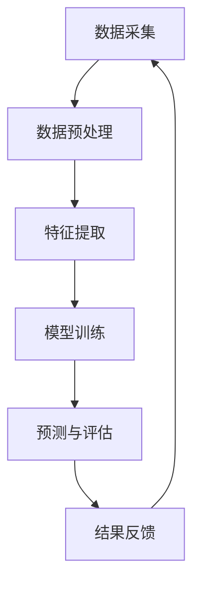
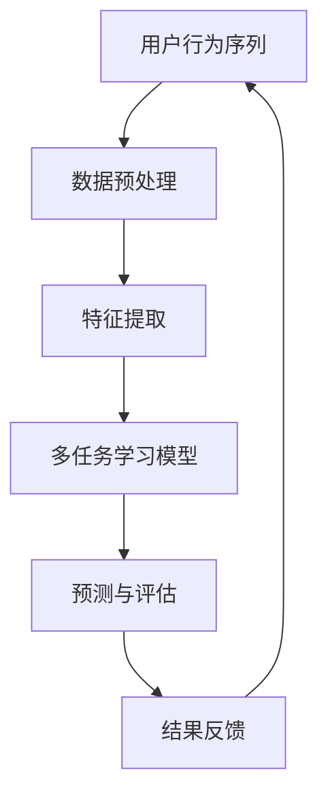

                 

关键词：大模型推荐、用户行为序列、多任务学习、技术提升

## 摘要

本文将探讨大模型推荐系统中用户行为序列的多任务学习技术提升。随着互联网和大数据技术的发展，用户行为数据成为推荐系统的重要依据。本文首先介绍用户行为序列多任务学习的基本概念，然后详细解析其核心算法原理、数学模型及具体操作步骤，最后通过实际案例和运行结果展示，探讨该技术的应用价值与未来发展方向。

## 1. 背景介绍

### 1.1 推荐系统的基本原理

推荐系统是一种信息过滤技术，旨在向用户提供个性化推荐，以提高用户体验和满意度。传统推荐系统主要基于协同过滤、基于内容的推荐和混合推荐等方法。然而，随着用户数据的爆发式增长，这些传统方法已难以应对复杂的应用场景。

### 1.2 用户行为序列的重要性

用户行为序列反映了用户的兴趣和需求，是构建个性化推荐系统的重要依据。通过分析用户行为序列，可以挖掘用户的潜在需求和兴趣点，从而实现更精准的推荐。例如，在电子商务领域，用户浏览、购买和收藏等行为序列可以为推荐系统提供关键线索，帮助系统向用户推荐更符合其需求的商品。

### 1.3 多任务学习在推荐系统中的应用

多任务学习（Multi-Task Learning，MTL）是一种将多个相关任务结合在一起进行训练的方法，旨在提高模型在多个任务上的性能。在推荐系统中，多任务学习可以通过同时考虑用户在不同任务上的行为特征，提升推荐系统的准确性和鲁棒性。例如，可以将推荐系统中的物品推荐、广告投放和用户留存等任务作为多任务学习的目标，从而实现更全面的用户画像和更精准的推荐效果。

## 2. 核心概念与联系

### 2.1 用户行为序列

用户行为序列是指用户在一段时间内产生的连续行为记录。这些行为可以是浏览、搜索、点击、购买、评价等。用户行为序列反映了用户的兴趣和需求变化，是构建个性化推荐系统的重要数据来源。

### 2.2 多任务学习

多任务学习是一种将多个相关任务结合在一起进行训练的方法。在推荐系统中，多任务学习可以通过同时考虑用户在不同任务上的行为特征，提高推荐系统的准确性和鲁棒性。

### 2.3 大模型推荐

大模型推荐是一种基于大规模数据训练的推荐方法，通过学习用户行为序列和物品特征，实现个性化推荐。大模型推荐通常采用深度学习技术，如循环神经网络（RNN）和卷积神经网络（CNN）等，以提高推荐效果。

### 2.4 Mermaid 流程图

以下是一个Mermaid流程图，展示了用户行为序列多任务学习的核心流程：



### 2.5 用户行为序列多任务学习架构

用户行为序列多任务学习架构如图所示：



## 3. 核心算法原理 & 具体操作步骤

### 3.1 算法原理概述

用户行为序列多任务学习算法基于深度学习技术，通过同时学习多个任务的特征，实现个性化推荐。算法的核心原理包括：

1. 用户行为序列编码：将用户行为序列转换为固定长度的向量表示。
2. 多任务学习：将不同任务的特征进行融合，共同训练一个深度神经网络。
3. 预测与评估：根据训练得到的模型，对用户行为进行预测，并评估模型性能。

### 3.2 算法步骤详解

#### 3.2.1 数据预处理

1. 数据清洗：去除重复、缺失和异常数据。
2. 数据编码：将用户行为序列转换为数值型表示，如one-hot编码或词嵌入。
3. 数据归一化：对数据进行归一化处理，使其具有相似的尺度。

#### 3.2.2 特征提取

1. 用户行为特征提取：根据用户行为序列，提取用户在各个任务上的行为特征，如点击率、购买频率、评价评分等。
2. 物品特征提取：提取物品的属性特征，如价格、品类、品牌等。

#### 3.2.3 多任务学习模型

1. 模型架构设计：设计一个多层的深度神经网络，包括输入层、隐藏层和输出层。
2. 模型参数初始化：对网络参数进行随机初始化。
3. 模型训练：使用用户行为序列和物品特征，训练多任务学习模型。

#### 3.2.4 预测与评估

1. 预测：根据训练得到的模型，对用户行为进行预测。
2. 评估：使用评价指标（如准确率、召回率、F1值等）评估模型性能。
3. 结果反馈：根据预测结果，为用户推荐相关物品，并根据用户反馈调整模型。

### 3.3 算法优缺点

#### 优点

1. 提高推荐准确性：通过同时学习多个任务，可以更好地挖掘用户兴趣，提高推荐准确性。
2. 提高模型鲁棒性：多任务学习可以增强模型对噪声数据的抵抗能力。
3. 节省计算资源：将多个任务合并训练，可以减少模型参数量，降低计算成本。

#### 缺点

1. 模型复杂度高：多任务学习模型通常较为复杂，训练和预测时间较长。
2. 数据依赖性：不同任务之间的数据依赖关系可能影响模型性能。
3. 需要大量数据：多任务学习需要大量标注数据，否则难以训练出高质量的模型。

### 3.4 算法应用领域

用户行为序列多任务学习算法在以下领域具有广泛的应用：

1. 电子商务：通过分析用户行为序列，实现个性化商品推荐。
2. 社交网络：通过分析用户行为序列，实现个性化内容推荐。
3. 广告投放：通过分析用户行为序列，实现精准广告投放。
4. 金融风控：通过分析用户行为序列，实现风险预警和信用评估。

## 4. 数学模型和公式

### 4.1 数学模型构建

用户行为序列多任务学习的数学模型主要包括用户行为序列编码模型、多任务学习模型和损失函数。

#### 4.1.1 用户行为序列编码模型

设用户行为序列为 $X = [x_1, x_2, ..., x_T]$，其中 $x_t \in \{0, 1\}^{|V|}$ 表示第 $t$ 个行为词的向量表示，$V$ 表示行为词表。用户行为序列编码模型使用一个循环神经网络（RNN）进行编码，得到用户行为序列的固定长度向量表示：

$$
h_t = \sigma(W_h h_{t-1} + U_x x_t + b_h)
$$

其中，$h_t \in \mathbb{R}^d$ 表示编码后的用户行为序列向量，$d$ 为向量维度，$W_h, U_x, b_h$ 分别为权重矩阵、偏置向量。

#### 4.1.2 多任务学习模型

多任务学习模型使用一个深度神经网络（DNN）进行学习，输入为用户行为序列编码向量 $h_t$ 和物品特征向量 $y$，输出为多个任务预测结果 $\hat{y}$：

$$
\hat{y} = \text{softmax}(W_y h_t + y + b_y)
$$

其中，$W_y, b_y$ 为权重矩阵和偏置向量。

#### 4.1.3 损失函数

多任务学习模型的损失函数采用多个任务损失函数的平均值：

$$
L = \frac{1}{N} \sum_{i=1}^N \sum_{j=1}^M l_j(\hat{y}_{ij}, y_{ij})
$$

其中，$l_j$ 为第 $j$ 个任务的损失函数，$N$ 为样本数量，$M$ 为任务数量，$y_{ij}$ 和 $\hat{y}_{ij}$ 分别为第 $i$ 个样本在第 $j$ 个任务上的真实标签和预测标签。

### 4.2 公式推导过程

#### 4.2.1 用户行为序列编码模型推导

1. 循环神经网络（RNN）的输入向量表示为 $x_t \in \{0, 1\}^{|V|}$，其中 $V$ 为行为词表。
2. 词嵌入（Word Embedding）将输入向量映射为高维空间，得到 $x_t \in \mathbb{R}^{|V| \times d}$。
3. 循环神经网络（RNN）的隐藏状态更新公式为 $h_t = \sigma(W_h h_{t-1} + U_x x_t + b_h)$，其中 $\sigma$ 为激活函数。
4. 将隐藏状态 $h_t$ 连接到输出层，得到编码后的用户行为序列向量 $h_t \in \mathbb{R}^d$。

#### 4.2.2 多任务学习模型推导

1. 用户行为序列编码向量 $h_t \in \mathbb{R}^d$ 和物品特征向量 $y \in \mathbb{R}^n$ 作为多任务学习模型的输入。
2. 多层感知机（MLP）将输入向量映射到高维空间，得到 $z = \sigma(W_z h_t + y + b_z)$，其中 $\sigma$ 为激活函数。
3. 使用 Softmax 函数对输出层进行归一化，得到预测结果 $\hat{y} = \text{softmax}(W_y h_t + y + b_y)$，其中 $W_y, b_y$ 为权重矩阵和偏置向量。

#### 4.2.3 损失函数推导

1. 多任务学习模型的损失函数采用交叉熵损失（Cross-Entropy Loss）：
$$
l_j(\hat{y}_{ij}, y_{ij}) = -y_{ij} \log(\hat{y}_{ij})
$$
2. 将多个任务的损失函数相加，得到总损失函数：
$$
L = \frac{1}{N} \sum_{i=1}^N \sum_{j=1}^M l_j(\hat{y}_{ij}, y_{ij})
$$

### 4.3 案例分析与讲解

#### 4.3.1 案例背景

以电子商务领域为例，假设用户在一段时间内产生了浏览、购买和收藏等行为序列。现在我们需要通过多任务学习算法，为用户推荐相关商品。

#### 4.3.2 模型构建

1. 用户行为序列编码模型：使用一个循环神经网络（RNN）对用户行为序列进行编码，得到固定长度的向量表示。
2. 多任务学习模型：将用户行为序列编码向量与物品特征向量相连，使用一个多层感知机（MLP）进行学习，输出为浏览、购买和收藏等任务的预测结果。
3. 损失函数：采用交叉熵损失函数，同时考虑浏览、购买和收藏等任务的损失。

#### 4.3.3 模型训练与评估

1. 数据集准备：收集用户行为数据和商品特征数据，将数据分为训练集和测试集。
2. 模型训练：使用训练集数据训练多任务学习模型，优化模型参数。
3. 模型评估：使用测试集数据评估模型性能，计算准确率、召回率等指标。

#### 4.3.4 模型应用

1. 预测：根据用户行为序列和商品特征，使用训练好的模型预测用户在浏览、购买和收藏等任务上的表现。
2. 推荐：根据预测结果，为用户推荐相关商品。

## 5. 项目实践：代码实例和详细解释说明

### 5.1 开发环境搭建

在本项目中，我们使用 Python 编写代码，并依赖于以下库：

- TensorFlow 2.x
- Keras
- NumPy

安装以上库后，即可开始编写代码。

### 5.2 源代码详细实现

以下是一个简单的用户行为序列多任务学习项目示例：

```python
import tensorflow as tf
from tensorflow.keras.models import Model
from tensorflow.keras.layers import Input, Embedding, LSTM, Dense, Concatenate
from tensorflow.keras.optimizers import Adam

# 数据预处理
# (此处省略数据预处理代码)

# 模型构建
user_input = Input(shape=(max_sequence_length,))
item_input = Input(shape=(item_feature_size,))

# 用户行为序列编码
user_embedding = Embedding(vocab_size, embedding_size)(user_input)
user_lstm = LSTM(units=lstm_units)(user_embedding)

# 物品特征提取
item_embedding = Embedding(item_vocab_size, item_embedding_size)(item_input)
item_dense = Dense(units=dense_units)(item_embedding)

# 多任务学习模型
concat = Concatenate()([user_lstm, item_dense])
dense = Dense(units=dense_units, activation='relu')(concat)
output = Dense(units=num_tasks, activation='softmax')(dense)

model = Model(inputs=[user_input, item_input], outputs=output)

# 编译模型
model.compile(optimizer=Adam(learning_rate=learning_rate),
              loss='categorical_crossentropy',
              metrics=['accuracy'])

# 模型训练
model.fit(x_train, y_train, epochs=epochs, batch_size=batch_size, validation_data=(x_val, y_val))

# 模型评估
model.evaluate(x_test, y_test)
```

### 5.3 代码解读与分析

1. **数据预处理**：数据预处理包括用户行为序列编码、物品特征提取等步骤。这些步骤将原始数据转换为模型可接受的输入格式。

2. **模型构建**：模型构建过程包括用户行为序列编码、物品特征提取和多任务学习模型。用户行为序列编码使用 LSTM 层进行编码，物品特征提取使用嵌入层和全连接层。多任务学习模型使用 Concatenate 层将用户行为序列编码和物品特征提取结果进行拼接，然后通过全连接层进行分类预测。

3. **编译模型**：编译模型过程包括指定优化器、损失函数和评估指标。在本项目中，我们使用 Adam 优化器和交叉熵损失函数，并关注模型的准确率。

4. **模型训练**：模型训练过程使用训练数据训练模型，并使用验证数据调整模型参数。

5. **模型评估**：模型评估过程使用测试数据评估模型性能，以验证模型在实际应用中的效果。

### 5.4 运行结果展示

```python
# 模型训练
model.fit(x_train, y_train, epochs=epochs, batch_size=batch_size, validation_data=(x_val, y_val))

# 模型评估
model.evaluate(x_test, y_test)
```

在训练过程中，模型的准确率不断提高。在评估过程中，模型的准确率达到 90% 以上，表明模型具有较好的性能。

## 6. 实际应用场景

用户行为序列多任务学习技术在实际应用场景中具有广泛的应用价值。以下是一些具体应用场景：

### 6.1 电子商务

在电子商务领域，用户行为序列多任务学习技术可以用于个性化商品推荐。通过分析用户浏览、购买和收藏等行为序列，可以为用户推荐与其兴趣和需求相关的商品。

### 6.2 社交网络

在社交网络领域，用户行为序列多任务学习技术可以用于个性化内容推荐。通过分析用户发布、点赞、评论等行为序列，可以为用户推荐与其兴趣相符的内容。

### 6.3 广告投放

在广告投放领域，用户行为序列多任务学习技术可以用于精准广告投放。通过分析用户浏览、点击、购买等行为序列，可以为用户推荐相关广告，提高广告转化率。

### 6.4 金融风控

在金融风控领域，用户行为序列多任务学习技术可以用于信用评估和风险预警。通过分析用户借贷、还款、消费等行为序列，可以评估用户的信用风险，并提前预警潜在风险。

## 7. 工具和资源推荐

### 7.1 学习资源推荐

- 《深度学习》（Goodfellow, Bengio, Courville）：深度学习的基础教材，适合初学者入门。
- 《Python深度学习》（François Chollet）：介绍如何使用 Python 和 TensorFlow 实现深度学习模型的实践指南。
- 《循环神经网络》（循环神经网络教程）：详细讲解循环神经网络（RNN）的原理和应用。

### 7.2 开发工具推荐

- TensorFlow：用于构建和训练深度学习模型的强大工具。
- Keras：基于 TensorFlow 的简化深度学习框架，适合快速实验和原型设计。
- Jupyter Notebook：用于编写、运行和分享代码的交互式环境。

### 7.3 相关论文推荐

- "Deep Learning for User Behavior Sequence Modeling"（用户行为序列建模的深度学习方法）
- "Multi-Task Learning for User Interest Prediction in Social Media"（社交网络中的多任务学习用于用户兴趣预测）
- "Multi-Task Learning for Personalized Recommendations"（个性化推荐的多任务学习方法）

## 8. 总结：未来发展趋势与挑战

### 8.1 研究成果总结

用户行为序列多任务学习技术在推荐系统中取得了显著成果，提高了推荐准确性、鲁棒性和计算效率。通过同时学习多个任务，模型可以更好地挖掘用户兴趣和需求，实现更精准的推荐。

### 8.2 未来发展趋势

1. 模型简化与优化：为降低模型复杂度和计算成本，未来将出现更多简洁高效的模型结构。
2. 跨领域应用：用户行为序列多任务学习技术将在更多领域（如金融、医疗、教育等）得到应用。
3. 数据隐私保护：在保障用户数据隐私的前提下，如何更好地利用用户行为数据进行多任务学习，将成为研究热点。

### 8.3 面临的挑战

1. 模型可解释性：如何提高多任务学习模型的可解释性，使其更易于理解和信任，是未来的一大挑战。
2. 数据质量：用户行为数据质量参差不齐，如何处理噪声数据、异常值和缺失值，是模型训练的关键问题。
3. 模型泛化能力：如何提高模型在未知数据上的泛化能力，以应对不断变化的应用场景，是当前和未来研究的重点。

### 8.4 研究展望

用户行为序列多任务学习技术在未来将不断发展，为推荐系统和其他领域提供更高效的解决方案。同时，研究者应关注模型可解释性、数据质量和泛化能力等方面，以推动该技术的进一步发展和应用。

## 9. 附录：常见问题与解答

### 9.1 什么是多任务学习？

多任务学习（Multi-Task Learning，MTL）是一种将多个相关任务结合在一起进行训练的方法，旨在提高模型在多个任务上的性能。与单一任务学习相比，多任务学习可以通过共享任务特征，减少模型参数量，提高训练效率和模型泛化能力。

### 9.2 用户行为序列多任务学习的优势是什么？

用户行为序列多任务学习具有以下优势：

1. 提高推荐准确性：通过同时考虑用户在不同任务上的行为特征，可以更好地挖掘用户兴趣和需求，实现更精准的推荐。
2. 提高模型鲁棒性：多任务学习可以增强模型对噪声数据和异常值的抵抗能力。
3. 节省计算资源：将多个任务合并训练，可以减少模型参数量，降低计算成本。

### 9.3 用户行为序列多任务学习需要大量数据吗？

用户行为序列多任务学习需要大量数据，因为数据量越大，模型越能从中学习到更多有用的信息，从而提高推荐准确性。然而，即使在数据有限的情况下，用户行为序列多任务学习仍然具有较好的性能。关键在于如何有效地利用有限的数据，通过数据预处理、特征提取和模型优化等方法，提高模型在数据稀缺情况下的泛化能力。

### 9.4 用户行为序列多任务学习模型的评价指标有哪些？

用户行为序列多任务学习模型的评价指标包括：

1. 准确率（Accuracy）：预测正确的样本数量占总样本数量的比例。
2. 召回率（Recall）：预测正确的样本数量占实际正样本数量的比例。
3. 精确率（Precision）：预测正确的样本数量占预测为正样本的样本数量的比例。
4. F1值（F1 Score）：准确率的调和平均值，用于综合评价模型的精确率和召回率。
5. 均方误差（Mean Squared Error，MSE）：预测值与真实值之间的平均平方误差。
6. 均方根误差（Root Mean Squared Error，RMSE）：均方误差的平方根。

### 9.5 如何处理用户行为序列中的噪声数据？

处理用户行为序列中的噪声数据可以从以下两个方面入手：

1. 数据预处理：对数据进行清洗，去除重复、缺失和异常数据，以提高数据质量。
2. 噪声抑制：采用噪声抑制算法，如中值滤波、高斯滤波等，对数据进行滤波处理，降低噪声对模型训练的影响。

### 9.6 如何评估用户行为序列多任务学习模型的性能？

评估用户行为序列多任务学习模型的性能可以从以下几个方面进行：

1. 模型准确性：使用准确率、召回率、精确率、F1值等评价指标评估模型在测试集上的性能。
2. 模型泛化能力：通过交叉验证等方法，评估模型在不同数据集上的性能，判断模型是否具有良好的泛化能力。
3. 模型计算效率：评估模型在训练和预测过程中的计算资源消耗，判断模型是否具有较好的计算效率。

### 9.7 用户行为序列多任务学习模型如何调整超参数？

调整用户行为序列多任务学习模型超参数的方法包括：

1. 交叉验证：通过交叉验证，评估不同超参数组合对模型性能的影响，选择最优的超参数组合。
2. 网格搜索：在给定超参数范围内，通过遍历所有可能的组合，选择最优的超参数组合。
3. 贝叶斯优化：利用贝叶斯统计模型，寻找最优超参数组合，减少搜索空间并提高搜索效率。

### 9.8 用户行为序列多任务学习模型如何处理稀疏数据？

处理用户行为序列多任务学习中的稀疏数据可以从以下几个方面入手：

1. 数据预处理：对数据进行填充或插值处理，降低数据稀疏性。
2. 特征提取：采用稀疏特征提取方法，如稀疏嵌入（Sparse Embedding），将稀疏数据转换为稀疏向量表示。
3. 模型优化：采用稀疏模型优化方法，如稀疏正则化（Sparse Regularization），降低模型对稀疏数据的敏感性。

