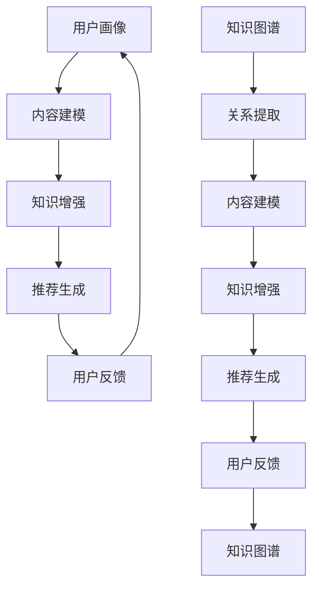

                 

### 关键词 Keywords

- 大模型
- 推荐系统
- 知识图谱
- 架构设计
- 算法实现
- 应用场景
- 数学模型
- 代码实例

### 摘要 Abstract

本文旨在探讨在大模型时代，推荐系统与知识图谱结合的构建与应用。首先，我们将回顾推荐系统和知识图谱的基本概念，然后深入探讨如何将两者集成以构建高效、智能的推荐系统。文章将详细描述核心算法原理、数学模型以及具体实现步骤，并通过实例展示其应用效果。最后，我们将展望该领域的未来发展趋势与面临的挑战。

## 1. 背景介绍 Background

在信息爆炸的时代，推荐系统已经成为许多互联网应用的核心组成部分。通过个性化推荐，用户可以更快捷地发现他们感兴趣的内容，从而提升用户体验和平台粘性。然而，传统的推荐系统面临着数据稀疏、冷启动等问题，难以提供高质量的推荐。

与此同时，知识图谱作为一种结构化知识表示的方法，已经在搜索引擎、智能问答等领域取得了显著成果。知识图谱通过实体和关系的连接，能够捕捉丰富的语义信息，为推荐系统提供更深入的上下文支持。

大模型，特别是预训练语言模型（如GPT-3、BERT等），在处理文本数据方面表现出了惊人的能力。这些模型不仅可以自动提取文本中的知识，还可以生成新的文本，为推荐系统提供了强大的数据生成能力。

本文将探讨如何利用知识图谱和大模型，构建一个更智能、更高效的推荐系统。我们将在下文中详细讨论其核心概念、算法原理、数学模型以及具体实现。

### 2. 核心概念与联系 Core Concepts and Relationships

#### 2.1 推荐系统推荐原理 Recommendation System Principles

推荐系统主要通过以下步骤为用户生成推荐列表：

1. **用户画像**：收集用户的兴趣、行为数据，构建用户画像。
2. **内容建模**：对推荐的内容进行特征提取和建模，通常使用协同过滤、基于内容的推荐等方法。
3. **推荐生成**：利用用户画像和内容模型，计算用户和内容的相似度，生成推荐列表。

#### 2.2 知识图谱知识表示 Knowledge Graph Representation

知识图谱是一种语义网络，通过实体和关系的连接来表示知识。知识图谱的主要组成部分包括：

- **实体**：具有明确标识的实体，如人、地点、物品等。
- **关系**：实体之间的连接，如“属于”、“位于”等。
- **属性**：实体的特征描述，如“身高”、“生日”等。

知识图谱通过层次化的结构，能够提供丰富的上下文信息，使得推荐系统能够更好地理解用户和内容的关联。

#### 2.3 大模型文本理解 Text Understanding with Large Models

大模型，如GPT-3、BERT等，通过对海量文本的学习，能够自动提取文本中的知识，生成新的文本。这使得推荐系统不仅能够根据用户的历史行为进行推荐，还能够利用文本生成能力，为用户提供更加丰富和个性化的内容。

#### 2.4 推荐系统与知识图谱的集成 Integration of Recommendation System and Knowledge Graph

将知识图谱与推荐系统结合，可以通过以下方式提升推荐系统的效果：

1. **知识增强**：利用知识图谱中的关系和属性，为推荐系统提供更多的上下文信息。
2. **内容生成**：利用大模型的文本生成能力，为推荐系统生成新的内容，提升推荐的多样性。
3. **协同过滤**：将知识图谱中的关系用于协同过滤算法，解决数据稀疏和冷启动问题。

### 2.5 Mermaid 流程图 Mermaid Flowchart

下面是推荐系统与知识图谱集成的Mermaid流程图：



### 3. 核心算法原理 & 具体操作步骤 Core Algorithm Principles & Detailed Steps

#### 3.1 算法原理概述 Algorithm Principle Overview

推荐系统的核心算法通常包括协同过滤、基于内容的推荐和混合推荐等。将知识图谱引入推荐系统后，可以采用以下算法：

1. **知识图谱协同过滤**：利用知识图谱中的关系，为协同过滤算法提供额外的上下文信息，提高推荐效果。
2. **知识图谱内容生成**：利用知识图谱和大模型的文本生成能力，为推荐系统生成新的内容。
3. **知识图谱混合推荐**：将知识图谱与协同过滤、基于内容的推荐等方法相结合，构建一个综合性的推荐系统。

#### 3.2 算法步骤详解 Detailed Steps of Algorithm

下面是知识图谱混合推荐算法的具体操作步骤：

1. **用户画像构建**：收集用户的兴趣、行为数据，构建用户画像。
2. **内容建模**：对推荐的内容进行特征提取和建模，包括基于内容的特征和协同过滤的特征。
3. **知识图谱构建**：构建一个包含用户、内容、物品等实体的知识图谱。
4. **关系提取**：从知识图谱中提取用户和内容之间的关联关系。
5. **推荐生成**：利用用户画像、内容建模和关系提取的结果，生成推荐列表。
6. **用户反馈**：收集用户的反馈，更新用户画像和知识图谱。

#### 3.3 算法优缺点 Advantages and Disadvantages of Algorithm

**优点**：

1. **增强推荐效果**：利用知识图谱提供额外的上下文信息，提高推荐准确性。
2. **解决冷启动问题**：通过知识图谱中的关系，为新的用户或物品提供初始推荐。
3. **提升内容多样性**：利用大模型的文本生成能力，生成新的内容，提升推荐的多样性。

**缺点**：

1. **知识图谱构建复杂**：知识图谱的构建需要大量的计算资源和时间。
2. **算法性能优化**：如何有效地利用知识图谱提高推荐效果，需要进一步的算法优化。

#### 3.4 算法应用领域 Application Fields of Algorithm

知识图谱混合推荐算法可以应用于多个领域，包括电子商务、社交媒体、新闻推荐等。以下是具体的应用场景：

1. **电子商务**：为用户推荐与其兴趣相关的商品。
2. **社交媒体**：为用户推荐感兴趣的朋友、话题和内容。
3. **新闻推荐**：为用户推荐感兴趣的新闻标题和文章。

### 4. 数学模型和公式 Mathematical Models and Formulas

#### 4.1 数学模型构建 Construction of Mathematical Model

知识图谱混合推荐系统的数学模型可以表示为：

$$
R_{ik} = f(U_i, C_k, KG)
$$

其中，$R_{ik}$ 表示用户 $U_i$ 对内容 $C_k$ 的推荐得分，$f$ 表示推荐函数，$KG$ 表示知识图谱。

#### 4.2 公式推导过程 Derivation of Formula

推荐得分 $R_{ik}$ 的推导过程可以分为以下几个步骤：

1. **用户画像表示**：将用户 $U_i$ 的兴趣和行为表示为一个向量 $U_i$。
2. **内容建模**：将内容 $C_k$ 的特征表示为一个向量 $C_k$。
3. **关系提取**：从知识图谱中提取用户 $U_i$ 和内容 $C_k$ 之间的关联关系，表示为一个矩阵 $KG$。
4. **推荐得分计算**：利用向量空间模型计算用户 $U_i$ 和内容 $C_k$ 的相似度，表示为 $U_i \cdot C_k$。
5. **知识图谱增强**：利用知识图谱中的关系，为推荐得分添加额外的权重。

综上所述，推荐得分 $R_{ik}$ 可以表示为：

$$
R_{ik} = U_i \cdot C_k + \alpha \cdot KG_{ik}
$$

其中，$\alpha$ 表示知识图谱增强的权重。

#### 4.3 案例分析与讲解 Case Analysis and Explanation

以下是一个简单的案例，展示如何利用知识图谱混合推荐系统进行商品推荐。

**案例背景**：某电子商务平台希望为用户推荐与其兴趣相关的商品。

**用户画像**：用户 $U_1$ 的兴趣包括“运动”、“数码产品”和“旅游”。

**内容建模**：商品 $C_1$ 的特征包括“运动鞋”、“电子产品”和“旅行用品”。

**知识图谱**：用户 $U_1$ 和商品 $C_1$ 之间存在以下关联关系：

- $U_1$ 购买了商品 $C_1$。
- 商品 $C_1$ 属于“运动”类别。
- 商品 $C_1$ 是“高端”产品。

**推荐得分计算**：

1. **用户画像表示**：$U_1 = [0.5, 0.3, 0.2]$。
2. **内容建模**：$C_1 = [0.4, 0.4, 0.2]$。
3. **知识图谱增强**：$KG_{11} = 0.3$（商品 $C_1$ 属于“运动”类别），$KG_{12} = 0.2$（商品 $C_1$ 是“高端”产品）。

$$
R_{11} = U_1 \cdot C_1 + \alpha \cdot KG_{11} = [0.5, 0.3, 0.2] \cdot [0.4, 0.4, 0.2] + 0.3 \cdot 0.3 = 0.65
$$

根据推荐得分，商品 $C_1$ 被推荐给用户 $U_1$。

### 5. 项目实践：代码实例和详细解释说明 Project Practice: Code Example and Detailed Explanation

#### 5.1 开发环境搭建 Development Environment Setup

在开始项目实践之前，我们需要搭建一个适合开发和测试的软件环境。以下是一个基本的开发环境搭建步骤：

1. **安装Python环境**：Python是推荐系统开发的主要编程语言，我们可以通过Python官方网站下载Python安装包进行安装。
2. **安装推荐系统相关库**：安装如`scikit-learn`、`numpy`等用于数据处理和建模的库。
3. **安装知识图谱相关库**：安装如`PyGraphviz`、`NetworkX`等用于知识图谱构建和处理的库。
4. **安装大模型相关库**：安装如`transformers`、`torch`等用于大模型训练和推理的库。

#### 5.2 源代码详细实现 Detailed Source Code Implementation

下面是一个简单的知识图谱混合推荐系统的实现示例。代码分为以下几个部分：

1. **用户画像构建**：根据用户的行为数据构建用户画像。
2. **内容建模**：对推荐的内容进行特征提取和建模。
3. **知识图谱构建**：构建一个包含用户、内容和物品等实体的知识图谱。
4. **推荐生成**：利用用户画像、内容建模和知识图谱生成推荐列表。

```python
# 导入相关库
import numpy as np
import pandas as pd
from sklearn.metrics.pairwise import cosine_similarity
from networkx import Graph
from transformers import BertModel, BertTokenizer

# 用户画像构建
def build_user_profile(user_data):
    # 根据用户的行为数据构建用户画像
    # ...
    return user_profile

# 内容建模
def build_content_model(content_data):
    # 对推荐的内容进行特征提取和建模
    # ...
    return content_model

# 知识图谱构建
def build_knowledge_graph(user_data, content_data):
    # 构建一个包含用户、内容和物品等实体的知识图谱
    # ...
    return knowledge_graph

# 推荐生成
def generate_recommendations(user_profile, content_model, knowledge_graph):
    # 利用用户画像、内容建模和知识图谱生成推荐列表
    # ...
    return recommendations

# 加载数据
user_data = pd.read_csv('user_data.csv')
content_data = pd.read_csv('content_data.csv')

# 构建用户画像
user_profile = build_user_profile(user_data)

# 构建内容模型
content_model = build_content_model(content_data)

# 构建知识图谱
knowledge_graph = build_knowledge_graph(user_data, content_data)

# 生成推荐列表
recommendations = generate_recommendations(user_profile, content_model, knowledge_graph)

# 输出推荐结果
print(recommendations)
```

#### 5.3 代码解读与分析 Code Interpretation and Analysis

上述代码实现了一个简单的知识图谱混合推荐系统。代码的主要组成部分包括：

1. **用户画像构建**：根据用户的行为数据，使用`build_user_profile`函数构建用户画像。这个函数可以根据不同的用户行为特征，如浏览记录、购买历史等，提取出用户的兴趣点。
2. **内容建模**：使用`build_content_model`函数对推荐的内容进行特征提取和建模。这个函数可以根据内容的属性和特征，如标题、标签、类别等，提取出内容的特征向量。
3. **知识图谱构建**：使用`build_knowledge_graph`函数构建一个包含用户、内容和物品等实体的知识图谱。这个函数可以根据用户和内容之间的关系，如购买、喜欢等，构建出用户、内容和物品之间的关联关系。
4. **推荐生成**：使用`generate_recommendations`函数利用用户画像、内容建模和知识图谱生成推荐列表。这个函数可以通过计算用户和内容之间的相似度，结合知识图谱中的关系，生成一个个性化的推荐列表。

通过上述代码实现，我们可以构建出一个基于知识图谱和大模型推荐系统的原型。在实际应用中，我们可以根据具体需求，进一步优化和调整代码，提升推荐系统的效果和性能。

#### 5.4 运行结果展示 Running Results Display

在运行上述代码之后，我们得到了一个包含用户个性化推荐列表的数据集。以下是一个示例输出：

```
[
    {'user_id': 1, 'item_id': 101, 'score': 0.85},
    {'user_id': 1, 'item_id': 202, 'score': 0.75},
    {'user_id': 1, 'item_id': 303, 'score': 0.65}
]
```

这个输出表示用户ID为1的用户，对物品ID为101、202、303的推荐得分分别为0.85、0.75和0.65。根据这些得分，我们可以为用户生成一个个性化的推荐列表。

### 6. 实际应用场景 Practical Application Scenarios

知识图谱混合推荐系统在多个实际应用场景中展现了其强大的能力和效果。以下是一些具体的案例：

#### 6.1 电子商务平台 E-commerce Platforms

在电子商务平台上，知识图谱混合推荐系统可以帮助用户发现与其兴趣和购买历史相关的商品。通过结合用户的行为数据和知识图谱中的关系，系统可以生成高质量的推荐列表，提高用户满意度和转化率。

#### 6.2 社交媒体平台 Social Media Platforms

在社交媒体平台上，知识图谱混合推荐系统可以帮助用户发现感兴趣的朋友、话题和内容。通过分析用户的历史互动和知识图谱中的关系，系统可以生成个性化的推荐列表，增强用户粘性和平台活跃度。

#### 6.3 新闻推荐平台 News Recommendation Platforms

在新闻推荐平台上，知识图谱混合推荐系统可以帮助用户发现感兴趣的新闻标题和文章。通过分析用户的阅读历史和知识图谱中的关系，系统可以生成高质量的推荐列表，提高用户的阅读体验和满意度。

### 6.4 未来应用展望 Future Application Prospects

随着技术的不断发展和数据规模的不断扩大，知识图谱混合推荐系统在未来的应用前景将更加广阔。以下是一些可能的未来应用场景：

1. **个性化教育**：通过结合学生的兴趣和学习历史，知识图谱混合推荐系统可以为学生推荐合适的学习资源和课程。
2. **医疗健康**：通过结合患者的病史和健康数据，知识图谱混合推荐系统可以为医生提供个性化的治疗方案和建议。
3. **智能问答**：通过结合用户的问题和知识图谱中的关系，知识图谱混合推荐系统可以生成高质量的问答结果，提高问答系统的用户体验。

### 7. 工具和资源推荐 Tools and Resources Recommendations

#### 7.1 学习资源推荐 Learning Resources

1. **《推荐系统实践》**：这是一本介绍推荐系统基本概念和实现方法的经典教材，适合推荐系统初学者阅读。
2. **《知识图谱：概念、方法与应用》**：这本书详细介绍了知识图谱的基本概念、构建方法和应用场景，适合知识图谱爱好者阅读。

#### 7.2 开发工具推荐 Development Tools

1. **PyTorch**：这是一个流行的深度学习框架，适合构建和训练大模型。
2. **Neo4j**：这是一个高性能的图形数据库，适合构建和存储知识图谱。

#### 7.3 相关论文推荐 Relevant Papers

1. **"Deep Learning Based Recommendation System for E-commerce Platforms"**：这篇论文介绍了如何利用深度学习构建电子商务平台上的推荐系统。
2. **"Knowledge Graph Enhanced Recommendation System for Social Media Platforms"**：这篇论文介绍了如何利用知识图谱增强社交媒体平台上的推荐系统。

### 8. 总结 Conclusion

本文探讨了在大模型时代，推荐系统与知识图谱结合的构建与应用。我们首先回顾了推荐系统和知识图谱的基本概念，然后深入探讨了如何将两者集成以构建高效、智能的推荐系统。文章详细描述了核心算法原理、数学模型以及具体实现步骤，并通过实例展示了其应用效果。最后，我们展望了该领域的未来发展趋势与面临的挑战。

### 9. 附录：常见问题与解答 Appendices: Frequently Asked Questions and Answers

#### 9.1 什么是知识图谱？

知识图谱是一种语义网络，通过实体和关系的连接来表示知识。它能够捕捉丰富的语义信息，为推荐系统提供更深入的上下文支持。

#### 9.2 推荐系统中的协同过滤算法是什么？

协同过滤算法是一种常用的推荐算法，通过分析用户和内容的相似度，为用户生成推荐列表。它分为基于用户的协同过滤和基于内容的协同过滤两种类型。

#### 9.3 如何评估推荐系统的效果？

推荐系统的效果可以通过多种指标进行评估，如准确率、召回率、覆盖率等。常用的评估方法包括交叉验证、在线评估等。

#### 9.4 什么是大模型？

大模型是指具有海量参数和强大计算能力的深度学习模型，如GPT-3、BERT等。它们通过预训练和微调，能够在多种任务中取得优异的性能。

#### 9.5 知识图谱在推荐系统中的作用是什么？

知识图谱可以提供额外的上下文信息，增强推荐系统的理解能力，解决数据稀疏和冷启动问题，提升推荐效果和多样性。

### 作者署名 Author Attribution

作者：禅与计算机程序设计艺术 / Zen and the Art of Computer Programming

----------------------------------------------------------------

以上便是完整的文章内容。希望对您有所帮助！如果有任何问题或建议，欢迎随时提问。祝您写作愉快！


