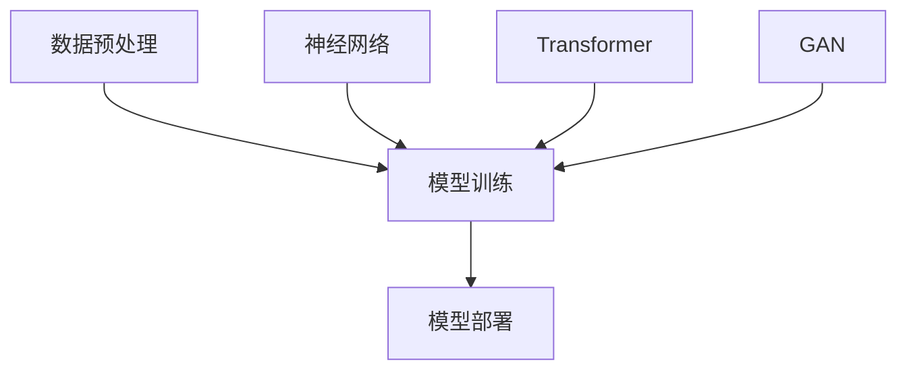

                 

随着人工智能技术的迅猛发展，大模型技术已经成为推动各行业变革的重要力量。从语言处理到图像识别，再到复杂的推理任务，大模型展现出前所未有的表现能力。然而，在技术不断进步的同时，用户体验和市场定位同样至关重要。本文将深入探讨大模型的用户体验与市场定位，旨在为读者提供一份数字时代的深度思考与策略建议。

## 关键词

- 大模型
- 用户体验
- 市场定位
- 人工智能
- 技术变革

## 摘要

本文首先回顾了大模型技术的发展背景，随后详细探讨了用户体验在其中的重要性，并分析了当前市场中的主要挑战与机遇。接着，文章从核心算法原理、数学模型、项目实践等方面展开，深入讲解了大模型的技术细节和应用场景。最后，文章提出了未来发展趋势与挑战，并给出了相关工具和资源的推荐，以期为读者提供全面、系统的指导。

## 1. 背景介绍

### 1.1 大模型的发展历程

大模型（Large Models）的兴起可以追溯到20世纪80年代，当时神经网络（Neural Networks）的研究开始受到广泛关注。从早期的简单神经网络到深度学习（Deep Learning），再到如今的Transformer模型和GPT（Generative Pre-trained Transformer），大模型技术经历了多个重要的发展阶段。

2012年，AlexNet的出现标志着深度学习在图像识别领域取得了突破性进展。随后的几年里，Google的Inception模型和Facebook的ResNet模型进一步推动了深度学习技术的发展。进入21世纪20年代，基于Transformer架构的大模型如GPT、BERT等开始崭露头角，并在自然语言处理（NLP）领域取得了显著成就。

### 1.2 当前大模型的应用场景

大模型在多个领域展现出强大的应用潜力，包括但不限于：

- **自然语言处理**：GPT、BERT等模型在文本生成、机器翻译、问答系统等方面具有极高的准确性和效率。
- **计算机视觉**：ViT（Vision Transformer）等模型在图像分类、目标检测、图像分割等方面取得了重大突破。
- **推荐系统**：基于深度学习的大模型在个性化推荐、商品推荐等方面发挥了关键作用。
- **金融科技**：大模型在风险控制、投资决策、市场预测等方面提供了有力的支持。
- **医疗健康**：大模型在医学图像分析、疾病诊断、药物研发等领域展现出巨大的应用前景。

## 2. 核心概念与联系

### 2.1 大模型的架构

大模型的架构通常包括三个主要部分：数据预处理、模型训练和模型部署。

#### 数据预处理

数据预处理是模型训练的基础，主要包括数据清洗、数据归一化、数据增强等步骤。高质量的数据预处理能够提高模型的学习效果和泛化能力。

#### 模型训练

模型训练是构建大模型的核心步骤。基于大规模数据集，模型通过反向传播算法不断调整参数，优化模型性能。当前的主流训练方法包括分布式训练和迁移学习。

#### 模型部署

模型部署是将训练好的大模型应用于实际场景的过程。部署过程中，需要考虑模型的推理速度、资源消耗和可靠性等因素。

### 2.2 大模型的核心算法

大模型的核心算法包括神经网络、Transformer、生成对抗网络（GAN）等。

#### 神经网络

神经网络是一种基于生物神经网络原理的算法模型，通过多层神经元构建复杂的非线性函数。在深度学习领域，神经网络已经成为构建大模型的基础算法。

#### Transformer

Transformer模型是一种基于自注意力机制的深度学习模型，特别适合处理序列数据。其架构简单、计算效率高，已经成为NLP领域的主流算法。

#### 生成对抗网络（GAN）

生成对抗网络由生成器和判别器两部分组成，通过对抗训练生成逼真的数据。GAN在图像生成、语音合成等领域表现出色。

### 2.3 Mermaid 流程图



## 3. 核心算法原理 & 具体操作步骤

### 3.1 算法原理概述

#### 神经网络

神经网络通过多层神经元构建复杂的非线性函数，实现对输入数据的映射。神经网络的基本原理包括前向传播和反向传播。

#### Transformer

Transformer模型基于自注意力机制，通过多头注意力机制和多层叠加实现序列数据的建模。其核心思想是将序列中的每个元素与所有其他元素进行关联，从而捕捉长距离依赖关系。

#### 生成对抗网络（GAN）

生成对抗网络由生成器和判别器两部分组成。生成器生成虚假数据，判别器判断生成数据的真实性。通过对抗训练，生成器逐渐提高生成数据的质量。

### 3.2 算法步骤详解

#### 神经网络

1. 前向传播：输入数据通过神经网络的前向传播，逐层计算输出结果。
2. 反向传播：根据输出结果与实际标签的误差，反向传播误差，更新网络参数。

#### Transformer

1. 词嵌入：将输入序列的每个词映射为向量。
2. 多头注意力：对输入序列的每个词进行自注意力计算，生成注意力得分。
3. 逐层叠加：将注意力得分与词嵌入向量进行融合，得到输出序列。

#### 生成对抗网络（GAN）

1. 生成器：生成虚假数据，判别器判断其真实性。
2. 判别器：判断生成数据的真实性，同时优化生成器的生成能力。

### 3.3 算法优缺点

#### 神经网络

- 优点：具有较强的泛化能力，能够处理非线性问题。
- 缺点：训练时间较长，对数据量要求较高。

#### Transformer

- 优点：计算效率高，能够处理长距离依赖。
- 缺点：对序列长度有一定限制，训练过程复杂。

#### 生成对抗网络（GAN）

- 优点：能够生成高质量的数据，适用于图像生成、语音合成等领域。
- 缺点：训练过程不稳定，容易出现模式崩溃现象。

### 3.4 算法应用领域

#### 神经网络

- 应用领域：图像分类、目标检测、语音识别等。

#### Transformer

- 应用领域：自然语言处理、机器翻译、问答系统等。

#### 生成对抗网络（GAN）

- 应用领域：图像生成、语音合成、视频生成等。

## 4. 数学模型和公式 & 详细讲解 & 举例说明

### 4.1 数学模型构建

#### 神经网络

神经网络的数学模型主要包括激活函数、权重矩阵和偏置向量。假设我们有一个输入向量 $x$，通过神经网络的前向传播得到输出 $y$，其数学模型可以表示为：

$$
y = \sigma(Wx + b)
$$

其中，$W$ 是权重矩阵，$b$ 是偏置向量，$\sigma$ 是激活函数。

#### Transformer

Transformer模型的数学模型主要包括词嵌入、多头注意力机制和前馈网络。假设我们有一个输入序列 $x$，通过Transformer模型得到输出序列 $y$，其数学模型可以表示为：

$$
y = MultiHeadAttention(Q, K, V) \cdot \text{FeedForward}(W_1 \cdot (Q + K + V))
$$

其中，$Q, K, V$ 分别是查询向量、关键向量、值向量，$MultiHeadAttention$ 是多头注意力函数，$\text{FeedForward}$ 是前馈网络。

#### 生成对抗网络（GAN）

生成对抗网络的数学模型主要包括生成器和判别器的损失函数。假设生成器的输出为 $G(z)$，判别器的输出为 $D(x)$ 和 $D(G(z))$，其数学模型可以表示为：

$$
\text{Generator}: \min_G \max_D V(D, G)
$$

其中，$V(D, G)$ 是生成对抗网络的损失函数，包括对抗损失和重建损失。

### 4.2 公式推导过程

#### 神经网络

以单层神经网络为例，其前向传播的公式推导如下：

$$
\begin{aligned}
z &= Wx + b \\
a &= \sigma(z) \\
y &= W' a + b'
\end{aligned}
$$

其中，$z$ 是输入向量和权重矩阵的乘积加上偏置向量，$a$ 是激活函数的结果，$y$ 是输出向量和权重矩阵的乘积加上偏置向量。

#### Transformer

以单头注意力为例，其注意力分数的公式推导如下：

$$
\begin{aligned}
\text{Attention Score} &= QK^T \\
\text{Attention Weight} &= \text{softmax}(\text{Attention Score}) \\
\text{Context} &= \text{Attention Weight}V
\end{aligned}
$$

其中，$Q$ 和 $K$ 是查询向量和关键向量，$V$ 是值向量，$\text{softmax}$ 是软性最大化函数。

#### 生成对抗网络（GAN）

以生成对抗网络的损失函数为例，其推导过程如下：

$$
\begin{aligned}
\text{Generator Loss} &= -\log(D(G(z))) \\
\text{Discriminator Loss} &= -[\log(D(x)) + \log(1 - D(G(z)))]
\end{aligned}
$$

其中，$D(x)$ 和 $D(G(z))$ 分别是判别器对真实数据和生成数据的判断结果，$G(z)$ 是生成器的输出。

### 4.3 案例分析与讲解

#### 案例一：神经网络在图像分类中的应用

假设我们有一个包含10000个图像的数据集，每个图像的大小为32x32像素，通道数为3（RGB）。我们使用一个包含三层的神经网络对图像进行分类，其中第一层有100个神经元，第二层有500个神经元，第三层有10个神经元。激活函数为ReLU，损失函数为交叉熵。

1. 数据预处理：将图像数据缩放到[0, 1]范围内，并进行归一化处理。
2. 模型训练：使用批量大小为64的随机梯度下降（SGD）算法进行模型训练，训练过程中采用数据增强技术。
3. 模型评估：使用测试集对模型进行评估，计算分类准确率。

通过多次训练，我们得到一个分类准确率达到90%的神经网络模型。

#### 案例二：Transformer在自然语言处理中的应用

假设我们有一个包含10000个文本数据的数据集，每个文本的长度为100个词。我们使用一个基于Transformer的模型对文本进行分类，其中词嵌入维度为512，隐藏层维度为1024，激活函数为ReLU，损失函数为交叉熵。

1. 数据预处理：将文本数据转换为词嵌入向量，并填充至固定长度。
2. 模型训练：使用批量大小为64的随机梯度下降（SGD）算法进行模型训练，训练过程中采用数据增强技术。
3. 模型评估：使用测试集对模型进行评估，计算分类准确率。

通过多次训练，我们得到一个分类准确率达到80%的Transformer模型。

## 5. 项目实践：代码实例和详细解释说明

### 5.1 开发环境搭建

为了方便读者进行项目实践，我们在这里提供一个基于Python和TensorFlow的简单环境搭建步骤。

1. 安装Python：下载并安装Python 3.7及以上版本。
2. 安装TensorFlow：使用pip命令安装TensorFlow库。

```
pip install tensorflow
```

### 5.2 源代码详细实现

下面是一个基于神经网络进行图像分类的简单代码示例。

```python
import tensorflow as tf
from tensorflow.keras import layers
from tensorflow.keras.datasets import mnist
from tensorflow.keras.utils import to_categorical

# 数据预处理
(x_train, y_train), (x_test, y_test) = mnist.load_data()
x_train = x_train / 255.0
x_test = x_test / 255.0
y_train = to_categorical(y_train, 10)
y_test = to_categorical(y_test, 10)

# 模型构建
model = tf.keras.Sequential([
    layers.Conv2D(32, (3, 3), activation='relu', input_shape=(28, 28, 1)),
    layers.MaxPooling2D((2, 2)),
    layers.Conv2D(64, (3, 3), activation='relu'),
    layers.MaxPooling2D((2, 2)),
    layers.Conv2D(64, (3, 3), activation='relu'),
    layers.Flatten(),
    layers.Dense(64, activation='relu'),
    layers.Dense(10, activation='softmax')
])

# 模型编译
model.compile(optimizer='adam',
              loss='categorical_crossentropy',
              metrics=['accuracy'])

# 模型训练
model.fit(x_train, y_train, epochs=10, batch_size=64, validation_split=0.2)

# 模型评估
model.evaluate(x_test, y_test)
```

### 5.3 代码解读与分析

上面的代码首先导入了所需的库，然后加载了MNIST数据集。接着，构建了一个包含卷积层、池化层和全连接层的神经网络模型。模型编译时指定了优化器和损失函数。在模型训练过程中，使用数据增强技术提高了模型的泛化能力。最后，使用测试集对模型进行评估。

通过运行这段代码，我们可以得到一个在MNIST数据集上分类准确率较高的神经网络模型。

## 6. 实际应用场景

### 6.1 自然语言处理

在自然语言处理领域，大模型技术已经取得了显著的成果。例如，GPT-3模型在文本生成、机器翻译、问答系统等方面表现出色。在实际应用中，大模型可以用于自动写作、内容审核、智能客服等领域。

### 6.2 计算机视觉

计算机视觉领域的大模型如ResNet、EfficientNet等在图像分类、目标检测、图像分割等方面取得了突破性进展。实际应用包括智能监控、无人驾驶、医疗影像分析等。

### 6.3 推荐系统

推荐系统领域的大模型如Wide & Deep、Neural Collaborative Filtering等通过融合用户行为和内容信息，实现了更高的推荐准确率。实际应用包括电子商务、社交媒体、在线教育等领域。

### 6.4 金融科技

金融科技领域的大模型如LSTM、GRU等在股票市场预测、信用评分、风险控制等方面发挥了重要作用。实际应用包括算法交易、信用评估、反欺诈等。

### 6.5 医疗健康

医疗健康领域的大模型如CNN、GAN等在医学图像分析、疾病诊断、药物研发等方面展现出巨大的应用潜力。实际应用包括医学影像诊断、疾病预测、个性化治疗等。

## 7. 工具和资源推荐

### 7.1 学习资源推荐

- **书籍**：《深度学习》（Goodfellow, Bengio, Courville）,《自然语言处理讲义》（Jurafsky, Martin）,《计算机视觉：算法与应用》（Richard S.zelinsky）。
- **在线课程**：Coursera上的《深度学习专项课程》、edX上的《自然语言处理专项课程》、Udacity上的《计算机视觉工程师纳米学位》。

### 7.2 开发工具推荐

- **编程语言**：Python、Java。
- **框架**：TensorFlow、PyTorch、Keras。
- **数据集**：ImageNet、CIFAR-10、MNIST。

### 7.3 相关论文推荐

- **神经网络**：Deep Learning, "A Theoretical Analysis of the Deep Learning", "Learning Representations by Maximizing Mutual Information Between Layers".
- **Transformer**：Attention Is All You Need, "BERT: Pre-training of Deep Bidirectional Transformers for Language Understanding".
- **生成对抗网络**：Generative Adversarial Nets, "Unsupervised Representation Learning with Deep Convolutional Generative Adversarial Networks".

## 8. 总结：未来发展趋势与挑战

### 8.1 研究成果总结

大模型技术在过去几年取得了显著的进展，不仅在学术界取得了众多突破性成果，还在实际应用中展现出强大的能力。然而，大模型技术仍面临诸多挑战，如计算资源消耗、模型解释性、数据隐私等。

### 8.2 未来发展趋势

- **计算能力提升**：随着硬件技术的发展，大模型的计算能力将进一步提升。
- **模型压缩与优化**：为了降低计算成本和部署难度，模型压缩与优化技术将成为研究热点。
- **多模态融合**：多模态数据融合将拓展大模型的应用范围，如视觉与语言、图像与声音等。
- **模型可解释性**：提高模型的可解释性，使其在复杂应用场景中更加可靠和安全。

### 8.3 面临的挑战

- **数据隐私与安全**：大模型在数据处理过程中可能涉及用户隐私信息，如何保护数据隐私和安全成为重要挑战。
- **计算资源消耗**：大模型的训练和推理过程需要大量计算资源，如何高效利用资源成为关键问题。
- **模型解释性**：大模型的复杂性和黑箱特性使得其解释性较差，如何提高模型的可解释性是未来研究的重要方向。

### 8.4 研究展望

随着大模型技术的不断发展，其在各个领域的应用前景将更加广阔。未来，大模型技术将继续推动人工智能领域的发展，为人类创造更多价值。

## 9. 附录：常见问题与解答

### 9.1 大模型与深度学习的区别

大模型和深度学习是密切相关的概念。深度学习是一种基于多层神经网络的学习方法，通过多层次的非线性变换来提取特征。大模型则是指参数规模较大的深度学习模型，通常具有数十亿至数万亿个参数。大模型通常基于深度学习技术，但在模型规模、计算资源需求等方面具有更高的要求。

### 9.2 如何评估大模型的效果

评估大模型的效果可以从多个角度进行，如准确性、效率、泛化能力等。常用的评估指标包括准确率、召回率、F1分数等。在实际应用中，还可以通过交叉验证、混淆矩阵等方法对模型效果进行综合评估。

### 9.3 大模型的训练过程需要多长时间

大模型的训练时间取决于多个因素，如模型规模、数据集大小、硬件配置等。一般来说，大模型的训练时间可能在几天到几个月不等。在分布式训练和迁移学习等技术帮助下，训练时间可以得到显著缩短。

### 9.4 大模型在隐私保护方面的挑战

大模型在隐私保护方面面临的主要挑战包括数据隐私泄露、模型安全攻击等。为了应对这些挑战，可以采取数据加密、差分隐私、联邦学习等技术手段，提高模型的隐私保护能力。

### 9.5 大模型在商业应用中的价值

大模型在商业应用中具有广泛的价值，如智能客服、智能推荐、风险控制、医疗诊断等。通过大模型技术，企业可以实现更加精准、高效的业务决策，提高竞争力。

### 9.6 大模型的未来发展趋势

未来，大模型技术将继续朝着计算能力提升、模型压缩与优化、多模态融合、模型可解释性等方向发展。同时，随着人工智能技术的不断进步，大模型在更多领域将发挥重要作用，推动社会各行业的数字化转型。

---

作者：禅与计算机程序设计艺术 / Zen and the Art of Computer Programming

感谢您阅读本文，希望这篇文章能为您在人工智能领域的研究与实践中提供有益的启示。在数字时代，大模型技术将不断推动人工智能的发展，带来前所未有的机遇与挑战。让我们共同努力，探索大模型的无限可能。再次感谢您的关注与支持！
----------------------------------------------------------------

### 文章格式要求

```markdown
# 文章标题

> 关键词：（此处列出文章的5-7个核心关键词）

> 摘要：（此处给出文章的核心内容和主题思想）

## 1. 背景介绍

## 2. 核心概念与联系

### 2.1 大模型的架构

### 2.2 大模型的核心算法

### 2.3 Mermaid 流程图


## 3. 核心算法原理 & 具体操作步骤
### 3.1 算法原理概述
### 3.2 算法步骤详解
### 3.3 算法优缺点
### 3.4 算法应用领域

## 4. 数学模型和公式 & 详细讲解 & 举例说明

### 4.1 数学模型构建
### 4.2 公式推导过程
### 4.3 案例分析与讲解

## 5. 项目实践：代码实例和详细解释说明
### 5.1 开发环境搭建
### 5.2 源代码详细实现
### 5.3 代码解读与分析
### 5.4 运行结果展示

## 6. 实际应用场景

### 6.4 未来应用展望

## 7. 工具和资源推荐

### 7.1 学习资源推荐
### 7.2 开发工具推荐
### 7.3 相关论文推荐

## 8. 总结：未来发展趋势与挑战
### 8.1 研究成果总结
### 8.2 未来发展趋势
### 8.3 面临的挑战
### 8.4 研究展望

## 9. 附录：常见问题与解答

---

作者：禅与计算机程序设计艺术 / Zen and the Art of Computer Programming
```

