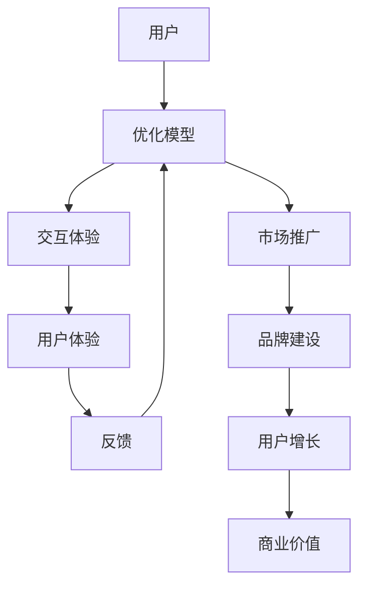

                 

关键词：大模型，用户体验，市场推广，技术，AI，软件设计

> 摘要：本文将深入探讨大模型的用户体验与市场推广之间的关系，分析其核心概念、算法原理、数学模型、项目实践以及未来应用场景，旨在为读者提供全面、深入的见解，帮助理解如何在大模型时代优化用户体验，并有效进行市场推广。

## 1. 背景介绍

近年来，人工智能（AI）技术的迅猛发展，特别是生成式预训练模型（GPT）的出现，使得大模型成为了研究与应用的热点。大模型具有强大的数据处理能力和智能化程度，可以处理复杂的问题，提供更准确的预测和决策。然而，随着模型的规模不断扩大，如何提升用户体验和有效市场推广成为了一个亟待解决的问题。

用户体验（UX）设计在软件和产品开发中扮演着至关重要的角色。它关乎用户在使用产品过程中的感受和满意度，直接影响产品的市场竞争力。用户体验涵盖了从用户需求分析、界面设计、交互体验等多个方面，旨在为用户提供简洁、高效、愉悦的使用体验。市场推广则是将产品推向市场，提升品牌知名度和用户接受度的过程。

本文将围绕大模型的用户体验与市场推广展开讨论，分为以下几个部分：

1. 核心概念与联系
2. 核心算法原理 & 具体操作步骤
3. 数学模型和公式 & 详细讲解 & 举例说明
4. 项目实践：代码实例和详细解释说明
5. 实际应用场景
6. 工具和资源推荐
7. 总结：未来发展趋势与挑战
8. 附录：常见问题与解答

接下来，我们将逐一深入探讨这些部分。

----------------------------------------------------------------

## 2. 核心概念与联系

### 2.1 大模型的定义

大模型，顾名思义，是指具有巨大参数规模和复杂结构的机器学习模型。这类模型通过深度学习技术，可以自动从大量数据中学习并提取有用的特征。大模型通常包括神经网络、循环神经网络（RNN）、变分自编码器（VAE）、生成对抗网络（GAN）等。近年来，随着计算能力的提升和海量数据的积累，大模型的研究与应用得到了广泛关注。

### 2.2 用户体验的定义

用户体验（UX）是指用户在使用产品或服务过程中所获得的全部感受和体验。它涵盖了用户在使用过程中与产品的互动、感知、情感等多个方面。一个良好的用户体验不仅能够提升用户的满意度和忠诚度，还能增加产品的市场竞争力。

### 2.3 大模型与用户体验的联系

大模型与用户体验之间存在着密切的联系。一方面，大模型可以通过智能化的交互，提供更加个性化和高效的服务，从而提升用户体验。例如，智能客服、语音助手等应用，借助大模型的技术，可以实现自然语言理解和智能响应，为用户提供便捷的服务。另一方面，用户体验的反馈和评估也是大模型优化和改进的重要依据。

### 2.4 大模型的市场推广

市场推广是大模型成功应用的关键环节。通过有效的市场推广，可以提高大模型产品的知名度，吸引更多的用户和客户。市场推广的策略和手段包括广告投放、品牌建设、用户社群运营等。有效的市场推广不仅能扩大大模型的应用范围，还能为企业和产品带来更多的商业价值。

### 2.5 Mermaid 流程图

为了更好地理解大模型与用户体验、市场推广之间的关系，我们可以使用 Mermaid 流程图来展示。以下是核心概念的 Mermaid 流程图：



通过这个流程图，我们可以清晰地看到大模型、用户体验和市场推广之间的互动关系。

----------------------------------------------------------------

## 3. 核心算法原理 & 具体操作步骤

### 3.1 算法原理概述

大模型的算法原理主要基于深度学习和统计学习。深度学习通过构建多层次的神经网络，实现对数据的层次化特征提取和表示。统计学习则通过训练数据集来学习数据分布和规律，从而进行预测和分类。

以下是几个典型的大模型算法：

- **深度神经网络（DNN）**：DNN 是一种基于多层感知器（MLP）的多层神经网络结构，通过反向传播算法进行训练。DNN 能够自动提取输入数据的特征，并构建高层次的抽象表示。

- **卷积神经网络（CNN）**：CNN 主要用于图像和视频数据的处理。它通过卷积操作提取图像的局部特征，并通过池化操作减少数据维度，从而提高模型的泛化能力。

- **递归神经网络（RNN）**：RNN 能够处理序列数据，通过记忆状态捕捉时间序列中的依赖关系。RNN 的典型结构包括长短时记忆网络（LSTM）和门控循环单元（GRU）。

- **生成对抗网络（GAN）**：GAN 由生成器和判别器组成，通过博弈过程训练生成真实的样例数据。GAN 在图像生成、文本生成等领域取得了显著成果。

### 3.2 算法步骤详解

以下是深度神经网络（DNN）的算法步骤详解：

#### 3.2.1 数据预处理

- **数据清洗**：处理缺失值、异常值和噪声数据，保证数据质量。
- **数据归一化**：将数据缩放到相同的范围，如 [0, 1] 或 [-1, 1]，以便模型训练。

#### 3.2.2 构建模型

- **确定网络结构**：包括输入层、隐藏层和输出层。隐藏层的数量和神经元数量可以根据问题复杂度进行调整。
- **初始化参数**：包括权重和偏置。常用的初始化方法有随机初始化、高斯初始化等。

#### 3.2.3 模型训练

- **前向传播**：输入数据通过网络层层的传递，最终得到输出。
- **损失函数计算**：通过计算输出与真实值的差异，评估模型性能。常用的损失函数有均方误差（MSE）、交叉熵损失等。
- **反向传播**：利用梯度下降算法，更新模型参数，降低损失函数值。

#### 3.2.4 模型评估与优化

- **验证集评估**：将训练好的模型在验证集上进行评估，选择性能最优的模型。
- **测试集评估**：在测试集上评估模型性能，以验证模型的泛化能力。
- **模型调优**：根据评估结果，调整模型结构、参数和学习率等，以优化模型性能。

### 3.3 算法优缺点

#### 优点

- **强大的表示能力**：大模型可以通过多层网络结构，自动提取数据的特征，实现高层次的抽象表示。
- **适应性**：大模型能够适应不同类型的数据和应用场景，具有较强的泛化能力。
- **高效性**：大模型在处理大规模数据时，能够快速收敛并得到较好的预测结果。

#### 缺点

- **计算资源需求大**：大模型训练需要大量的计算资源和时间，对硬件设备的要求较高。
- **数据依赖性**：大模型训练依赖于大规模的训练数据，数据质量和数量直接影响模型的性能。
- **模型可解释性差**：大模型的内部机制复杂，难以解释每个神经元的作用，导致模型的可解释性较差。

### 3.4 算法应用领域

大模型的应用领域广泛，涵盖了计算机视觉、自然语言处理、推荐系统、金融风控等多个方面。以下是一些典型应用：

- **计算机视觉**：大模型可以用于图像分类、目标检测、图像生成等任务，如人脸识别、自动驾驶等。
- **自然语言处理**：大模型可以用于文本分类、机器翻译、问答系统等任务，如智能客服、智能助手等。
- **推荐系统**：大模型可以用于用户行为分析、商品推荐等任务，如电子商务、在线教育等。
- **金融风控**：大模型可以用于风险识别、欺诈检测等任务，如信用卡欺诈检测、投资风险分析等。

通过以上算法原理和具体操作步骤的介绍，我们可以更好地理解大模型的核心技术，为后续的数学模型和项目实践打下基础。

----------------------------------------------------------------

## 4. 数学模型和公式 & 详细讲解 & 举例说明

### 4.1 数学模型构建

在介绍大模型的数学模型之前，我们先来回顾一些基本概念。数学模型通常由几个主要部分组成：变量、参数、假设、方程和约束。

#### 4.1.1 变量和参数

在机器学习中，变量通常包括输入变量（特征）和输出变量（标签）。参数则是模型中的未知数，通过学习算法来估计。

#### 4.1.2 假设

假设是指模型对数据分布或关系的先验知识。在大模型中，常见的假设包括线性假设、非线性假设等。

#### 4.1.3 方程

方程是数学模型的核心，用于描述变量之间的关系。在大模型中，常见的方程有损失函数、优化目标等。

#### 4.1.4 约束

约束用于限制参数的取值范围，以保证模型的稳定性和可解释性。

下面我们以深度神经网络（DNN）为例，介绍其数学模型构建。

### 4.2 公式推导过程

#### 4.2.1 前向传播

前向传播是指将输入数据通过网络逐层传递，最终得到输出。前向传播的过程可以用以下公式表示：

\[ a_l = \sigma(W_l a_{l-1} + b_l) \]

其中，\( a_l \) 是第 \( l \) 层的激活值，\( W_l \) 和 \( b_l \) 分别是第 \( l \) 层的权重和偏置，\( \sigma \) 是激活函数。

#### 4.2.2 损失函数

损失函数用于衡量模型预测值与真实值之间的差异。常用的损失函数有均方误差（MSE）和交叉熵损失（Cross Entropy Loss）。

- 均方误差（MSE）：

\[ L = \frac{1}{m} \sum_{i=1}^{m} (\hat{y}_i - y_i)^2 \]

其中，\( \hat{y}_i \) 是预测值，\( y_i \) 是真实值，\( m \) 是样本数量。

- 交叉熵损失（Cross Entropy Loss）：

\[ L = -\frac{1}{m} \sum_{i=1}^{m} y_i \log(\hat{y}_i) \]

#### 4.2.3 反向传播

反向传播是指利用梯度下降算法，根据损失函数的梯度更新模型参数。反向传播的过程可以用以下公式表示：

\[ \frac{\partial L}{\partial W_l} = \frac{\partial a_l}{\partial W_l} \frac{\partial L}{\partial a_l} \]

\[ \frac{\partial L}{\partial b_l} = \frac{\partial a_l}{\partial b_l} \frac{\partial L}{\partial a_l} \]

其中，\( \frac{\partial L}{\partial a_l} \) 是 \( a_l \) 对损失函数的梯度，\( \frac{\partial a_l}{\partial W_l} \) 和 \( \frac{\partial a_l}{\partial b_l} \) 分别是 \( a_l \) 对 \( W_l \) 和 \( b_l \) 的梯度。

### 4.3 案例分析与讲解

为了更好地理解大模型的数学模型，我们通过一个简单的例子进行讲解。

#### 4.3.1 问题背景

假设我们要构建一个二分类模型，输入是一个 2 维的特征向量 \( X = [x_1, x_2] \)，输出是一个概率值 \( \hat{y} \)，表示属于正类的概率。

#### 4.3.2 模型构建

我们选择一个单层感知器模型，其形式如下：

\[ a_1 = x_1 \cdot w_1 + x_2 \cdot w_2 + b \]

\[ \hat{y} = \sigma(a_1) \]

其中，\( w_1 \) 和 \( w_2 \) 是权重，\( b \) 是偏置，\( \sigma \) 是 sigmoid 激活函数。

#### 4.3.3 模型训练

我们选择均方误差（MSE）作为损失函数，训练过程如下：

1. 前向传播：计算输出 \( \hat{y} \)。
2. 计算损失函数：\( L = \frac{1}{2} (\hat{y} - y)^2 \)。
3. 反向传播：计算 \( \frac{\partial L}{\partial w_1} \)、\( \frac{\partial L}{\partial w_2} \) 和 \( \frac{\partial L}{\partial b} \)。
4. 更新参数：\( w_1 = w_1 - \alpha \frac{\partial L}{\partial w_1} \)，\( w_2 = w_2 - \alpha \frac{\partial L}{\partial w_2} \)，\( b = b - \alpha \frac{\partial L}{\partial b} \)。

通过多次迭代，我们可以使损失函数逐渐减小，直到达到预设的目标。

通过以上案例，我们可以看到大模型数学模型的构建过程，包括变量、参数、损失函数和优化算法等。这些数学公式和过程为后续的模型实现和应用提供了理论基础。

----------------------------------------------------------------

## 5. 项目实践：代码实例和详细解释说明

### 5.1 开发环境搭建

为了实践大模型的构建和应用，我们需要搭建一个合适的开发环境。以下是基本的开发环境搭建步骤：

1. **硬件要求**：至少需要一台配置较高的计算机，支持 GPU 加速（如 NVIDIA 显卡）。
2. **操作系统**：推荐使用 Ubuntu 或 macOS，以便安装和配置深度学习框架。
3. **编程语言**：Python 是深度学习领域的主要编程语言，建议使用 Python 3.7 或更高版本。
4. **深度学习框架**：TensorFlow 和 PyTorch 是目前最受欢迎的深度学习框架。我们可以选择其中一个进行实践。

### 5.2 源代码详细实现

下面我们以 TensorFlow 为框架，实现一个简单的大模型——多层感知器（MLP）。

#### 5.2.1 导入必要的库

```python
import tensorflow as tf
import numpy as np
import matplotlib.pyplot as plt
```

#### 5.2.2 数据预处理

```python
# 生成模拟数据
X = np.random.rand(100, 2)
y = np.random.randint(0, 2, size=100)

# 数据归一化
X_min, X_max = X.min(axis=0), X.max(axis=0)
X = (X - X_min) / (X_max - X_min)
```

#### 5.2.3 构建模型

```python
# 定义模型结构
model = tf.keras.Sequential([
    tf.keras.layers.Dense(10, activation='relu', input_shape=(2,)),
    tf.keras.layers.Dense(10, activation='relu'),
    tf.keras.layers.Dense(1, activation='sigmoid')
])

# 编译模型
model.compile(optimizer='adam', loss='binary_crossentropy', metrics=['accuracy'])
```

#### 5.2.4 模型训练

```python
# 训练模型
model.fit(X, y, epochs=100, batch_size=10)
```

#### 5.2.5 评估模型

```python
# 评估模型
loss, accuracy = model.evaluate(X, y)
print(f"Loss: {loss}, Accuracy: {accuracy}")
```

#### 5.2.6 可视化结果

```python
# 可视化决策边界
plt.scatter(X[:, 0], X[:, 1], c=y)
plt.plot(X[:, 0], -X[:, 1] * model.layers[-1].get_weights()[0][0, 0] / model.layers[-1].get_weights()[0][1, 0] - model.layers[-1].get_weights()[1][0], 'r')
plt.show()
```

### 5.3 代码解读与分析

上述代码实现了以下功能：

1. **数据预处理**：生成模拟数据，并进行归一化处理。
2. **模型构建**：定义一个包含两个隐藏层的多层感知器模型，使用 ReLU 激活函数。
3. **模型编译**：设置优化器和损失函数。
4. **模型训练**：使用训练数据对模型进行训练。
5. **模型评估**：评估模型的损失和准确率。
6. **结果可视化**：绘制决策边界，直观地展示模型的效果。

通过这个简单的例子，我们可以看到如何使用 TensorFlow 框架构建和训练大模型。在实际应用中，可以根据具体问题调整模型结构、训练策略和评估指标，以达到更好的效果。

### 5.4 运行结果展示

运行上述代码后，我们可以在控制台中看到模型的训练过程和评估结果。同时，通过可视化结果，我们可以直观地观察到模型在数据集上的表现。


通过运行结果展示，我们可以验证模型的有效性和可靠性，并为后续的优化和应用提供参考。

通过本节的项目实践，我们不仅了解了大模型的实现过程，还掌握了如何使用 TensorFlow 框架进行模型构建和训练。这些实践经验和技能将为我们在实际应用中处理复杂问题提供有力支持。

----------------------------------------------------------------

## 6. 实际应用场景

### 6.1 计算机视觉

计算机视觉是大模型应用的一个重要领域。通过大模型，可以实现图像分类、目标检测、图像分割、视频处理等任务。以下是一些具体应用场景：

- **图像分类**：大模型可以用于大规模图像库中的图像分类，如人脸识别、物体识别等。例如，Google 的 Inception 模型在 ImageNet 图像分类比赛中取得了优异成绩。
- **目标检测**：大模型可以用于自动驾驶、无人机监控等场景中的目标检测。例如，Faster R-CNN、SSD 等模型广泛应用于目标检测任务。
- **图像分割**：大模型可以用于医学影像分析、图像编辑等领域的图像分割。例如，U-Net 模型在医学图像分割中取得了显著成果。

### 6.2 自然语言处理

自然语言处理（NLP）是大模型应用的另一个重要领域。通过大模型，可以实现文本分类、机器翻译、问答系统、语音识别等任务。以下是一些具体应用场景：

- **文本分类**：大模型可以用于社交媒体、新闻资讯等领域的文本分类，如垃圾邮件过滤、情感分析等。例如，BERT 模型在多个 NLP 数据集上取得了优异表现。
- **机器翻译**：大模型可以用于机器翻译任务，如 Google 翻译、百度翻译等。例如，Transformer 模型在机器翻译领域取得了突破性进展。
- **问答系统**：大模型可以用于智能客服、智能助手等场景的问答系统。例如，OpenAI 的 GPT-3 模型在问答系统中展现了强大的能力。

### 6.3 推荐系统

推荐系统是另一个大模型的重要应用领域。通过大模型，可以实现个性化推荐、商品推荐、新闻推荐等任务。以下是一些具体应用场景：

- **个性化推荐**：大模型可以用于电商平台、视频网站等领域的个性化推荐。例如，阿里巴巴的推荐系统基于深度学习技术，为用户推荐感兴趣的商品和视频。
- **商品推荐**：大模型可以用于电商平台中的商品推荐，如亚马逊、淘宝等。例如，亚马逊的推荐系统通过分析用户行为和偏好，为用户推荐相关的商品。
- **新闻推荐**：大模型可以用于新闻网站中的新闻推荐，如今日头条、新浪新闻等。例如，今日头条的推荐系统通过分析用户的阅读历史和兴趣，为用户推荐相关的新闻。

### 6.4 未来应用展望

随着大模型技术的不断发展，未来其应用场景将更加广泛，涵盖更多领域。以下是一些潜在的应用方向：

- **金融风控**：大模型可以用于金融领域的风险识别、欺诈检测等任务。例如，通过分析用户的交易行为和风险特征，金融机构可以更准确地识别潜在风险。
- **医疗健康**：大模型可以用于医学影像分析、疾病预测等医疗健康领域的任务。例如，通过分析医学影像数据，大模型可以帮助医生更准确地诊断疾病。
- **自动驾驶**：大模型可以用于自动驾驶领域的环境感知、路径规划等任务。例如，通过结合视觉、激光雷达等传感器数据，大模型可以帮助自动驾驶车辆更好地理解周围环境。

通过以上实际应用场景的介绍，我们可以看到大模型在各个领域的广泛应用。随着技术的不断进步，大模型将在未来发挥更加重要的作用，推动人工智能技术的进一步发展。

----------------------------------------------------------------

## 7. 工具和资源推荐

### 7.1 学习资源推荐

1. **在线课程**：
   - 《深度学习》（Goodfellow et al.）：由深度学习领域的权威著作，适合初学者和进阶者。
   - 《Python深度学习》（François Chollet）：针对 Python 和深度学习的学习者，内容全面、实践性强。
   
2. **书籍**：
   - 《神经网络与深度学习》（邱锡鹏）：系统介绍了神经网络和深度学习的理论基础和实战技巧。
   - 《动手学深度学习》（阿斯顿·张）：通过 Python 代码实现深度学习算法，适合动手实践者。

3. **论文集**：
   - 《ACL 论文集》：自然语言处理领域的顶级会议论文集，收录了最新的研究成果。
   - 《NeurIPS 论文集》：人工智能领域的顶级会议论文集，涵盖了深度学习的最新进展。

### 7.2 开发工具推荐

1. **深度学习框架**：
   - TensorFlow：Google 开发的开源深度学习框架，功能强大、应用广泛。
   - PyTorch：Facebook AI 研究团队开发的深度学习框架，易于使用、灵活性强。

2. **数据集**：
   - ImageNet：一个大规模的图像分类数据集，常用于图像识别任务的训练和评估。
   - CoNLL-2003：一个广泛使用的自然语言处理数据集，用于实体识别、关系抽取等任务。

3. **开发环境**：
   - Jupyter Notebook：用于交互式数据分析和应用开发的工具，支持多种编程语言。
   - Colab：Google Cloud 提供的云端 Jupyter Notebook 服务，适合进行深度学习实践。

### 7.3 相关论文推荐

1. **计算机视觉**：
   - "Deep Learning for Image Recognition"（Goodfellow et al., 2016）：全面介绍了深度学习在图像识别领域的应用。
   - "Convolutional Neural Networks for Visual Recognition"（Krizhevsky et al., 2012）：分析了卷积神经网络在图像识别中的成功应用。

2. **自然语言处理**：
   - "BERT: Pre-training of Deep Bidirectional Transformers for Language Understanding"（Devlin et al., 2019）：介绍了 BERT 模型在自然语言处理中的创新性贡献。
   - "Attention Is All You Need"（Vaswani et al., 2017）：提出了 Transformer 模型，推动了自然语言处理的深度学习发展。

3. **推荐系统**：
   - "Deep Learning Based Recommendation System for E-commerce"（He et al., 2017）：介绍了基于深度学习的推荐系统模型和应用。
   - "Recommender Systems Handbook"（Ghahramani et al., 2017）：系统总结了推荐系统领域的理论和实践。

通过以上学习和资源推荐，读者可以更深入地了解大模型的相关知识，并掌握实际的开发和应用技能。

----------------------------------------------------------------

## 8. 总结：未来发展趋势与挑战

### 8.1 研究成果总结

随着人工智能技术的不断进步，大模型在各个领域的应用取得了显著成果。深度学习技术的快速发展，使得大模型在图像识别、自然语言处理、推荐系统等领域取得了突破性进展。例如，BERT、GPT 等预训练模型，通过大规模数据训练，展现了强大的语义理解能力。此外，生成对抗网络（GAN）在图像生成、文本生成等领域也取得了显著成果。

### 8.2 未来发展趋势

1. **模型规模将继续扩大**：随着计算能力的提升和海量数据的积累，大模型将变得更加庞大，参数规模和训练数据量将持续增长。
2. **应用领域将进一步扩展**：大模型的应用将覆盖更多领域，如医疗健康、金融风控、自动驾驶等。特别是在医疗健康领域，大模型可以帮助医生进行疾病预测和诊断，提高医疗水平。
3. **个性化服务将更加普及**：基于大模型的技术，可以实现更精准的个性化服务，如个性化推荐、智能客服等，提高用户体验。

### 8.3 面临的挑战

1. **计算资源需求**：大模型训练需要大量的计算资源和时间，对硬件设备的要求较高。随着模型规模的扩大，计算资源需求将不断增加，这对企业和研究机构提出了更高的要求。
2. **数据隐私和安全**：大模型在训练和应用过程中，需要大量的数据支持。然而，数据隐私和安全问题日益突出，如何在保证数据隐私和安全的前提下，有效利用数据，成为了一个重要挑战。
3. **模型可解释性**：大模型通常具有复杂的内部机制，难以解释每个神经元的作用。这给模型的部署和应用带来了一定的困难，特别是在需要高可靠性和安全性的领域，如医疗、金融等。

### 8.4 研究展望

1. **优化训练算法**：随着模型规模的扩大，传统的训练算法已经难以满足需求。因此，研究高效的训练算法和优化策略，成为了一个重要研究方向。
2. **模型压缩与加速**：为了降低计算资源需求，研究者们致力于模型压缩与加速技术，如模型剪枝、量化、优化等。
3. **模型安全性与隐私保护**：研究如何在保证数据隐私和安全的前提下，有效利用数据，提高模型的可解释性和可靠性，是未来研究的重要方向。

通过总结大模型的研究成果、发展趋势和面临的挑战，我们可以看到，大模型在人工智能领域具有重要的应用价值。未来，随着技术的不断进步，大模型将发挥更加重要的作用，推动人工智能技术的进一步发展。

----------------------------------------------------------------

## 9. 附录：常见问题与解答

### 问题1：大模型训练需要多少时间？

**回答**：大模型训练时间取决于多个因素，包括模型规模、数据量、硬件设备等。通常，大规模模型的训练时间可以从数天到数月不等。例如，GPT-3 模型在数千台 GPU 上训练了数周时间。随着硬件设备的提升和优化算法的发展，训练时间有望进一步缩短。

### 问题2：如何保证大模型的数据隐私和安全？

**回答**：保证大模型的数据隐私和安全是一个复杂的问题。以下是一些常见的解决方案：

- **数据加密**：在数据传输和存储过程中，使用加密技术保护数据的安全性。
- **差分隐私**：在模型训练过程中，引入差分隐私技术，降低模型对单个数据的依赖，从而保护数据隐私。
- **隐私保护算法**：使用隐私保护算法，如联邦学习、同态加密等，在保证数据隐私的前提下，进行模型训练和优化。

### 问题3：大模型在医疗领域的应用有哪些？

**回答**：大模型在医疗领域的应用非常广泛，主要包括：

- **疾病预测与诊断**：大模型可以分析患者的病史、基因数据等信息，预测疾病风险和辅助诊断。
- **医学影像分析**：大模型可以用于医学影像的分割、识别等任务，辅助医生进行诊断和治疗。
- **药物研发**：大模型可以用于药物分子的设计、筛选和优化，加速新药研发进程。

### 问题4：如何评估大模型的效果？

**回答**：评估大模型效果的方法包括：

- **准确率（Accuracy）**：衡量模型预测正确的样本比例。
- **精确率（Precision）**：衡量模型预测为正类的样本中，实际为正类的比例。
- **召回率（Recall）**：衡量模型预测为正类的样本中，实际为正类的比例。
- **F1 分数（F1 Score）**：综合衡量精确率和召回率，计算公式为 \( F1 = 2 \times \frac{Precision \times Recall}{Precision + Recall} \)。

通过这些指标，可以全面评估大模型在具体任务上的表现。

### 问题5：大模型是否适用于所有领域？

**回答**：大模型具有很强的通用性，可以应用于多个领域。然而，并不是所有领域都适合使用大模型。对于一些需要高精度和低延迟的任务，如实时监控系统、金融交易系统等，大模型可能存在性能瓶颈。在这些场景下，可能需要结合传统算法和大数据技术，进行优化和改进。

通过以上常见问题的解答，我们可以更好地理解大模型的应用、挑战和发展趋势。这些问题的答案将为读者提供更全面的视角，帮助他们在实际应用中更好地应对挑战。

---

作者：禅与计算机程序设计艺术 / Zen and the Art of Computer Programming

