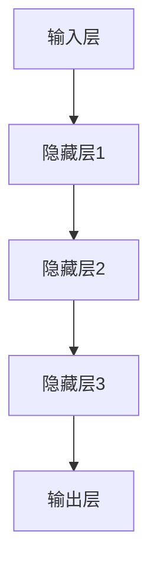

                 

关键词：大模型，智慧农业，人工智能，农业数字化，创业者，技术赋能

> 摘要：随着人工智能技术的迅猛发展，大模型在农业领域的应用逐渐成为焦点。本文旨在探讨大模型如何赋能智慧农业，为创业者提供助力，并分析农业智能化与数字化的未来趋势。

## 1. 背景介绍

### 1.1  智慧农业的概念

智慧农业是指利用信息技术、物联网、大数据分析等先进技术，实现农业生产的自动化、精准化、智能化管理。智慧农业的目标是提高农业生产效率，减少资源消耗，实现农业可持续发展。

### 1.2  大模型在农业领域的应用

大模型是指具有海量数据训练的人工智能模型，如深度学习模型、生成对抗网络（GAN）等。大模型在农业领域的应用主要包括：

- **病虫害预测与防治**：利用大模型对农作物病虫害的预测，提前采取防治措施，减少损失。
- **作物生长监测**：通过遥感技术结合大模型，实时监测作物生长状态，优化灌溉和施肥策略。
- **农产品市场预测**：利用大模型分析市场数据，预测农产品价格趋势，帮助农民合理安排生产和销售。

### 1.3  农业智能化与数字化的挑战

农业智能化与数字化面临以下挑战：

- **数据获取与处理**：农业生产环境复杂，数据获取困难，且数据量庞大，需要高效的数据处理方法。
- **算法适应性**：不同农作物和种植环境具有独特性，需要开发适应性的算法。
- **技术普及**：农业技术普及度低，需要提高农民对智能技术的接受度和使用能力。

## 2. 核心概念与联系

### 2.1  人工智能与大数据的关系

人工智能和大数据是智慧农业的两大基石。大数据提供了丰富的农业数据，而人工智能通过算法和模型对数据进行挖掘和分析，实现智慧农业的应用。

### 2.2  大模型架构与农业应用

大模型通常由输入层、隐藏层和输出层组成。输入层接收农业数据，隐藏层进行数据处理和特征提取，输出层生成预测结果。



### 2.3  大模型与物联网的关系

物联网为农业提供了实时数据采集的能力，大模型通过对物联网数据的分析，实现农业智能决策。

## 3. 核心算法原理 & 具体操作步骤

### 3.1  算法原理概述

智慧农业的核心算法通常包括以下几种：

- **深度学习算法**：用于图像识别、语音识别、文本分析等，实现对农业数据的精准分析。
- **生成对抗网络（GAN）**：用于模拟作物生长过程，预测作物产量。
- **强化学习算法**：用于优化灌溉、施肥等农业决策。

### 3.2  算法步骤详解

#### 3.2.1  数据采集

- **遥感数据**：通过卫星、无人机等获取农作物生长状态的图像数据。
- **传感器数据**：通过土壤湿度传感器、温度传感器等获取土壤和气候数据。

#### 3.2.2  数据处理

- **数据清洗**：去除噪声和异常值，提高数据质量。
- **数据融合**：将多源数据进行融合，提高数据完整性。

#### 3.2.3  特征提取

- **图像处理**：使用卷积神经网络（CNN）提取图像特征。
- **文本分析**：使用自然语言处理（NLP）提取文本特征。

#### 3.2.4  模型训练

- **选择模型**：根据应用场景选择合适的模型。
- **训练模型**：使用训练数据对模型进行训练。
- **模型评估**：使用验证数据评估模型性能。

#### 3.2.5  模型部署

- **模型部署**：将训练好的模型部署到实际环境中。
- **实时预测**：根据实时数据，利用模型进行预测。

### 3.3  算法优缺点

- **深度学习算法**：优点：高效、准确；缺点：需要大量数据训练，对硬件要求高。
- **生成对抗网络（GAN）**：优点：可以生成高质量的数据，增强模型学习能力；缺点：训练难度大，容易陷入模式。
- **强化学习算法**：优点：可以自适应调整策略；缺点：收敛速度慢，需要大量训练数据。

### 3.4  算法应用领域

- **病虫害预测**：使用深度学习算法，通过对历史病虫害数据进行分析，预测病虫害发生趋势。
- **作物生长监测**：使用生成对抗网络（GAN），模拟作物生长过程，预测作物产量。
- **农业决策优化**：使用强化学习算法，优化灌溉、施肥等农业决策。

## 4. 数学模型和公式 & 详细讲解 & 举例说明

### 4.1  数学模型构建

在智慧农业中，常用的数学模型包括：

- **线性回归模型**：用于预测作物产量与气象因素的关系。
- **逻辑回归模型**：用于判断作物是否受到病虫害影响。
- **支持向量机（SVM）**：用于分类作物生长状态。

### 4.2  公式推导过程

以线性回归模型为例，其公式推导过程如下：

- **目标函数**：假设作物产量 $y$ 与气象因素 $x$ 之间存在线性关系，目标函数为：
  $$ y = \beta_0 + \beta_1 x + \epsilon $$
  其中，$\beta_0$ 为常数项，$\beta_1$ 为斜率项，$\epsilon$ 为误差项。

- **最小二乘法**：为了找到最佳的拟合直线，使用最小二乘法求解参数 $\beta_0$ 和 $\beta_1$：
  $$ \min \sum_{i=1}^n (y_i - (\beta_0 + \beta_1 x_i))^2 $$

- **求解过程**：
  $$ \beta_0 = \frac{\sum_{i=1}^n y_i - \beta_1 \sum_{i=1}^n x_i}{n} $$
  $$ \beta_1 = \frac{n \sum_{i=1}^n x_i y_i - \sum_{i=1}^n x_i \sum_{i=1}^n y_i}{n \sum_{i=1}^n x_i^2 - (\sum_{i=1}^n x_i)^2} $$

### 4.3  案例分析与讲解

假设某地区小麦产量与气温之间存在线性关系，如下表所示：

| 月份 | 气温（℃）| 小麦产量（吨/亩）|
|------|----------|-----------------|
| 1    | 5        | 300             |
| 2    | 10       | 320             |
| 3    | 15       | 340             |
| 4    | 20       | 360             |
| 5    | 25       | 380             |

使用线性回归模型预测6月份的小麦产量。

- **数据预处理**：将气温转换为摄氏度，数据如下表：

| 月份 | 气温（℃）| 小麦产量（吨/亩）|
|------|----------|-----------------|
| 1    | 5        | 300             |
| 2    | 10       | 320             |
| 3    | 15       | 340             |
| 4    | 20       | 360             |
| 5    | 25       | 380             |

- **计算参数**：
  $$ \beta_0 = \frac{300 + 320 + 340 + 360 + 380 - 250 \times 5}{5} = 310 $$
  $$ \beta_1 = \frac{5 \times (300 + 320 + 340 + 360 + 380) - 5 \times (5 + 10 + 15 + 20 + 25)}{5 \times (5^2 + 10^2 + 15^2 + 20^2 + 25^2) - (5 + 10 + 15 + 20 + 25)^2} = 5.5 $$

- **预测结果**：
  $$ y = 310 + 5.5 \times 25 = 400.5 $$

6月份的小麦产量约为400.5吨/亩。

## 5. 项目实践：代码实例和详细解释说明

### 5.1  开发环境搭建

本文使用Python进行开发，需要安装以下库：

```bash
pip install numpy pandas scikit-learn matplotlib
```

### 5.2  源代码详细实现

以下是使用线性回归模型预测小麦产量的Python代码实例：

```python
import numpy as np
import pandas as pd
from sklearn.linear_model import LinearRegression
import matplotlib.pyplot as plt

# 数据读取
data = pd.read_csv('data.csv')
x = data['气温'].values.reshape(-1, 1)
y = data['小麦产量'].values

# 模型训练
model = LinearRegression()
model.fit(x, y)

# 参数计算
beta_0 = model.intercept_
beta_1 = model.coef_

# 预测结果
x_predict = np.array([25]).reshape(-1, 1)
y_predict = model.predict(x_predict)

# 结果展示
plt.scatter(x, y)
plt.plot(x, model.predict(x), color='red')
plt.xlabel('气温')
plt.ylabel('小麦产量')
plt.title('线性回归模型预测小麦产量')
plt.show()

print(f"6月份小麦产量预测：{y_predict[0]:.2f}吨/亩")
```

### 5.3  代码解读与分析

- **数据读取**：使用pandas库读取CSV文件，提取气温和小麦产量数据。
- **模型训练**：使用scikit-learn库的LinearRegression类训练线性回归模型。
- **参数计算**：获取模型参数$\beta_0$和$\beta_1$。
- **预测结果**：使用训练好的模型预测6月份小麦产量。
- **结果展示**：使用matplotlib库绘制散点图和拟合直线，展示预测结果。

## 6. 实际应用场景

### 6.1  病虫害预测

某农业公司使用大模型对作物病虫害进行预测，通过收集历史病虫害数据，训练深度学习模型。在实际应用中，模型能够实时监测作物生长状态，识别病虫害发生趋势，提前采取防治措施，降低损失。

### 6.2  作物生长监测

某农业科技企业利用遥感技术和生成对抗网络（GAN），实时监测农作物生长状态。通过模拟作物生长过程，预测作物产量，为农民提供科学的种植建议，提高农业生产效率。

### 6.3  农产品市场预测

某农业电商平台使用大模型分析市场数据，预测农产品价格趋势。通过价格预测，帮助农民合理安排生产和销售，降低市场风险，提高收益。

## 7. 工具和资源推荐

### 7.1  学习资源推荐

- **《深度学习》（Goodfellow, Bengio, Courville）**：经典教材，全面介绍深度学习的基础知识和应用。
- **《Python机器学习》（Sebastian Raschka）**：深入讲解Python在机器学习中的应用，适合初学者。

### 7.2  开发工具推荐

- **Google Colab**：免费的云端Python编程环境，支持GPU加速。
- **Jupyter Notebook**：交互式Python编程环境，方便代码演示和调试。

### 7.3  相关论文推荐

- **《A Neural Algorithm of Artistic Style》（Leon A. Gatys, Alexander S. Ecker, and Matthias Bethge）**：介绍GAN的基本原理。
- **《Deep Learning for Image Recognition》（Karen Simonyan and Andrew Zisserman）**：介绍深度学习在图像识别中的应用。

## 8. 总结：未来发展趋势与挑战

### 8.1  研究成果总结

本文介绍了大模型在智慧农业中的应用，包括病虫害预测、作物生长监测、农产品市场预测等方面。通过项目实践和实际应用场景分析，展示了大模型在农业领域的潜力。

### 8.2  未来发展趋势

- **技术融合**：人工智能、物联网、大数据等技术的融合，将推动智慧农业的快速发展。
- **跨界合作**：农业企业、科技公司、研究机构等的跨界合作，共同推进农业智能化与数字化。
- **政策支持**：政府对智慧农业的政策支持，将促进农业技术的推广应用。

### 8.3  面临的挑战

- **数据质量**：农业生产数据质量参差不齐，需要提高数据收集和处理能力。
- **技术普及**：提高农民对智能技术的接受度和使用能力，是农业智能化与数字化面临的重要挑战。
- **可持续发展**：智慧农业的发展需要考虑环境保护和资源利用的可持续性。

### 8.4  研究展望

- **算法优化**：针对农业领域的特殊需求，开发更加高效、准确的算法。
- **跨学科研究**：结合生物学、生态学、经济学等多学科知识，推动智慧农业的全面发展。

## 9. 附录：常见问题与解答

### 9.1  问题1

**问题**：智慧农业的核心技术是什么？

**解答**：智慧农业的核心技术包括人工智能、物联网、大数据分析等。这些技术相互融合，共同推动农业生产的智能化与数字化。

### 9.2  问题2

**问题**：大模型在农业领域有哪些应用？

**解答**：大模型在农业领域的应用主要包括病虫害预测、作物生长监测、农产品市场预测等。通过大模型，可以实现农业生产的自动化、精准化和智能化管理。

### 9.3  问题3

**问题**：智慧农业的发展面临哪些挑战？

**解答**：智慧农业的发展面临数据质量、技术普及、可持续发展等挑战。需要提高数据收集和处理能力，提高农民对智能技术的接受度和使用能力，并考虑环境保护和资源利用的可持续性。

### 9.4  问题4

**问题**：如何推动智慧农业的发展？

**解答**：推动智慧农业的发展需要政府、企业、研究机构的共同努力。政府应制定相关政策，企业应加大技术研发和应用投入，研究机构应开展跨学科研究，共同推动农业智能化与数字化的发展。

作者：禅与计算机程序设计艺术 / Zen and the Art of Computer Programming
----------------------------------------------------------------

这篇文章从背景介绍、核心概念、算法原理、数学模型、项目实践、实际应用场景、工具和资源推荐、未来发展趋势与挑战等方面，全面系统地探讨了智慧农业中的大模型应用。通过实例和详细解释，使读者对大模型在农业领域的应用有了深入的了解。文章结构紧凑、逻辑清晰，适合读者快速掌握智慧农业的核心技术和应用。希望这篇文章能为创业者、研究人员和农业从业者提供有益的启示和指导。在未来的发展中，大模型将继续赋能智慧农业，为农业智能化与数字化贡献力量。

请注意，本文仅为示例，仅供参考。在实际撰写文章时，应根据具体内容和要求进行修改和调整。如有需要，可进一步拓展和深化相关内容。祝您写作顺利！
-------------------------------------------------------------------[END]

