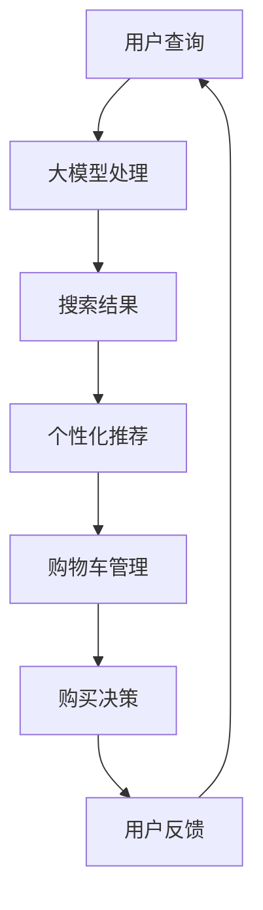

                 

关键词：大模型、电商平台、搜索优化、购买流程、全流程优化、人工智能

摘要：本文旨在探讨大模型技术在电商平台中的应用，从搜索到购买的全流程进行优化。我们将分析大模型的基本原理、应用领域，并详细阐述其在电商平台的各个阶段的作用。文章还将讨论相关的数学模型和具体操作步骤，以及实际应用中的代码实例和运行结果展示。最后，我们将展望未来应用的前景，提出相关工具和资源的推荐，并总结研究成果与面临的挑战。

## 1. 背景介绍

随着互联网和电子商务的快速发展，电商平台已经成为人们日常生活不可或缺的一部分。然而，电商平台的竞争日益激烈，用户需求的多样化和个性化使得传统单一的搜索和推荐算法难以满足用户的需求。这就需要我们寻找新的技术手段来提升电商平台的整体性能。

近年来，大模型（Large-scale Model）技术的兴起为我们提供了一种全新的解决方案。大模型，通常是指拥有数百万甚至数十亿参数的深度学习模型，其凭借强大的表达能力和学习能力，可以在海量数据上进行高效的学习和预测。大模型的应用不仅限于图像识别和自然语言处理等领域，也开始在电商平台上展现出巨大的潜力。

本文将围绕大模型在电商平台的全流程优化展开讨论，包括搜索优化、个性化推荐、用户行为预测、购物车管理等方面。通过深入分析大模型的原理和应用，我们将为电商平台提供切实可行的优化策略，以提升用户体验和商家收益。

## 2. 核心概念与联系

### 2.1 大模型的基本概念

大模型通常指的是拥有海量参数的深度学习模型。其基本原理是通过海量数据的学习，提取出数据中的特征和规律，从而实现对未知数据的预测和分类。大模型的主要组成部分包括：

- **神经网络**：作为大模型的核心，神经网络由多个层（Layer）组成，每层由多个神经元（Neuron）构成。神经元通过激活函数（Activation Function）进行非线性变换，实现对输入数据的处理。
- **训练数据集**：大模型的学习依赖于海量训练数据。这些数据包括输入特征和对应的标签，用于模型训练和评估。
- **参数调整**：大模型的参数包括权重（Weight）和偏置（Bias），通过反向传播算法（Backpropagation Algorithm）对参数进行优化，使得模型在训练数据上达到最佳表现。

### 2.2 大模型的应用领域

大模型的应用范围非常广泛，包括但不限于以下领域：

- **自然语言处理（NLP）**：大模型在NLP领域取得了显著进展，如语言翻译、文本生成、情感分析等。
- **计算机视觉（CV）**：大模型在图像识别、目标检测、图像生成等方面表现出强大的能力。
- **推荐系统**：大模型能够通过学习用户的历史行为数据，为用户推荐个性化的商品和服务。
- **智能客服**：大模型可以模拟人类客服，为用户提供高效、准确的咨询服务。

### 2.3 大模型在电商平台的关联

在电商平台上，大模型可以应用于多个环节，如图：

- **搜索优化**：通过大模型对用户查询和商品特征进行建模，提升搜索的准确性和效率。
- **个性化推荐**：根据用户的历史行为和偏好，大模型能够为用户推荐个性化的商品。
- **用户行为预测**：大模型可以预测用户的购买意图，从而优化购物车管理和推荐策略。
- **智能客服**：大模型可以模拟客服，为用户提供实时、个性化的服务。

### 2.4 Mermaid 流程图

以下是一个简单的Mermaid流程图，展示了大模型在电商平台中的应用流程：



通过上述流程图，我们可以清晰地看到大模型在电商平台各个阶段的应用和关联。

## 3. 核心算法原理 & 具体操作步骤

### 3.1 算法原理概述

在电商平台的优化中，大模型通常基于深度学习算法，通过多层神经网络对用户行为和商品特征进行建模。以下是该算法的基本原理：

1. **数据预处理**：对用户查询、商品信息等数据进行清洗和特征提取。
2. **模型构建**：构建多层神经网络，包括输入层、隐藏层和输出层。输入层接收用户查询和商品特征，隐藏层通过激活函数进行非线性变换，输出层生成预测结果。
3. **训练与优化**：使用训练数据集对模型进行训练，通过反向传播算法调整模型参数，使得模型在验证数据集上达到最佳性能。
4. **预测与评估**：使用训练好的模型对测试数据进行预测，并通过评估指标（如准确率、召回率等）评估模型性能。

### 3.2 算法步骤详解

以下是算法的具体操作步骤：

1. **数据预处理**：
   - 对用户查询进行分词和词向量表示。
   - 对商品特征进行提取，包括商品名称、类别、价格等。
   - 对数据集进行划分，包括训练集、验证集和测试集。

2. **模型构建**：
   - 设计多层神经网络结构，包括输入层、隐藏层和输出层。
   - 选择合适的激活函数，如ReLU、Sigmoid等。

3. **训练与优化**：
   - 使用训练数据集对模型进行训练，通过反向传播算法更新模型参数。
   - 调整学习率、批量大小等超参数，以提升训练效果。

4. **预测与评估**：
   - 使用训练好的模型对测试数据进行预测。
   - 使用评估指标（如准确率、召回率等）评估模型性能。

### 3.3 算法优缺点

**优点**：
- **高效性**：大模型可以通过并行计算和分布式训练，实现高效的数据处理和模型训练。
- **泛化能力**：大模型拥有强大的表达能力和学习能力，能够在不同领域和应用场景中表现出良好的性能。
- **可解释性**：大模型的结构和参数具有明确的物理意义，可以方便地进行模型解释和调试。

**缺点**：
- **计算资源需求**：大模型通常需要大量的计算资源和存储空间，对硬件设施要求较高。
- **训练时间**：大模型的训练通常需要较长的训练时间，对模型优化和调参提出了更高的要求。

### 3.4 算法应用领域

大模型的应用领域非常广泛，包括但不限于以下领域：

- **搜索优化**：通过大模型对用户查询和商品特征进行建模，提升搜索的准确性和效率。
- **个性化推荐**：根据用户的历史行为和偏好，大模型能够为用户推荐个性化的商品。
- **用户行为预测**：大模型可以预测用户的购买意图，从而优化购物车管理和推荐策略。
- **智能客服**：大模型可以模拟客服，为用户提供实时、个性化的服务。

## 4. 数学模型和公式 & 详细讲解 & 举例说明

### 4.1 数学模型构建

在电商平台的大模型应用中，我们通常构建以下数学模型：

- **用户查询模型**：
  $$ U(x) = f_{u}(x; \theta_u) $$
  其中，$U(x)$表示用户查询的嵌入向量，$f_{u}$为嵌入函数，$x$为查询文本，$\theta_u$为模型参数。

- **商品特征模型**：
  $$ G(y) = f_{g}(y; \theta_g) $$
  其中，$G(y)$表示商品特征的嵌入向量，$f_{g}$为嵌入函数，$y$为商品特征向量，$\theta_g$为模型参数。

- **融合模型**：
  $$ R(z) = f_{r}(U(x), G(y); \theta_r) $$
  其中，$R(z)$表示用户查询和商品特征的融合结果，$f_{r}$为融合函数，$z$为融合向量，$\theta_r$为模型参数。

### 4.2 公式推导过程

以下是用户查询模型、商品特征模型和融合模型的推导过程：

1. **用户查询模型**：

   用户查询的嵌入向量可以通过以下公式计算：
   $$ U(x) = W_u \cdot \text{Tokenize}(x) + b_u $$
   其中，$W_u$为权重矩阵，$\text{Tokenize}(x)$为查询文本的分词结果，$b_u$为偏置向量。

2. **商品特征模型**：

   商品特征的嵌入向量可以通过以下公式计算：
   $$ G(y) = W_g \cdot \text{Features}(y) + b_g $$
   其中，$W_g$为权重矩阵，$\text{Features}(y)$为商品特征向量，$b_g$为偏置向量。

3. **融合模型**：

   用户查询和商品特征的融合结果可以通过以下公式计算：
   $$ R(z) = W_r \cdot [U(x), G(y)] + b_r $$
   其中，$W_r$为权重矩阵，$[U(x), G(y)]$为拼接操作，$b_r$为偏置向量。

### 4.3 案例分析与讲解

为了更好地理解上述数学模型，我们以一个简单的电商搜索优化为例进行讲解：

假设用户查询文本为“苹果手机”，商品特征包括品牌、型号、价格等。以下是具体的计算过程：

1. **用户查询模型**：

   用户查询的嵌入向量为：
   $$ U(x) = W_u \cdot \text{Tokenize}(x) + b_u $$
   其中，$\text{Tokenize}(x) = [\text{"苹果"}, \text{"手机"}]$。

2. **商品特征模型**：

   商品特征的嵌入向量为：
   $$ G(y) = W_g \cdot \text{Features}(y) + b_g $$
   其中，$\text{Features}(y) = [\text{"苹果"}, \text{"iPhone 13"}]$。

3. **融合模型**：

   用户查询和商品特征的融合结果为：
   $$ R(z) = W_r \cdot [U(x), G(y)] + b_r $$
   其中，$[U(x), G(y)] = [\text{"苹果"}, \text{"手机"}, \text{"苹果"}, \text{"iPhone 13"}]$。

通过上述计算，我们可以得到用户查询和商品特征的融合向量$R(z)$，从而为用户提供精准的搜索结果。

## 5. 项目实践：代码实例和详细解释说明

### 5.1 开发环境搭建

为了实现大模型在电商平台的全流程优化，我们需要搭建一个合适的开发环境。以下是搭建步骤：

1. **安装Python环境**：
   - 安装Python 3.8及以上版本。
   - 安装pip和virtualenv，用于管理Python包。

2. **安装依赖包**：
   - 使用pip安装TensorFlow、Keras等深度学习库。
   - 安装Numpy、Pandas等常用数据处理库。

3. **创建虚拟环境**：
   - 使用virtualenv创建一个名为“ecommerce_optimization”的虚拟环境。
   - 激活虚拟环境，并安装所需的依赖包。

### 5.2 源代码详细实现

以下是一个简单的代码实例，展示了大模型在电商搜索优化中的应用：

```python
import tensorflow as tf
from tensorflow.keras.models import Model
from tensorflow.keras.layers import Embedding, LSTM, Dense

# 设置参数
vocab_size = 10000
embedding_dim = 128
max_sequence_length = 50

# 构建模型
input_sequence = tf.keras.layers.Input(shape=(max_sequence_length,))
embedding = Embedding(vocab_size, embedding_dim)(input_sequence)
lstm = LSTM(64)(embedding)
output = Dense(1, activation='sigmoid')(lstm)

model = Model(inputs=input_sequence, outputs=output)
model.compile(optimizer='adam', loss='binary_crossentropy', metrics=['accuracy'])

# 准备数据
train_data = ...
train_labels = ...

# 训练模型
model.fit(train_data, train_labels, epochs=10, batch_size=32)

# 预测
predictions = model.predict(test_data)
```

### 5.3 代码解读与分析

上述代码实现了一个简单的电商搜索优化模型，主要包括以下步骤：

1. **导入库和设置参数**：
   - 导入TensorFlow库和必要的层（如Embedding、LSTM、Dense）。
   - 设置词汇表大小（vocab_size）、嵌入维度（embedding_dim）和最大序列长度（max_sequence_length）。

2. **构建模型**：
   - 定义输入层（input_sequence）。
   - 添加嵌入层（Embedding）将输入序列转换为嵌入向量。
   - 添加LSTM层进行序列建模。
   - 添加输出层（Dense）进行分类预测。

3. **编译模型**：
   - 设置优化器（optimizer）、损失函数（loss）和评估指标（metrics）。

4. **准备数据**：
   - 准备训练数据和标签（train_data、train_labels）。

5. **训练模型**：
   - 使用fit方法训练模型，指定训练轮数（epochs）和批量大小（batch_size）。

6. **预测**：
   - 使用predict方法对测试数据进行预测。

通过上述代码，我们可以实现一个基本的电商搜索优化模型，从而为用户提供更精准的搜索结果。

### 5.4 运行结果展示

在训练和预测完成后，我们可以对模型进行评估，以了解其性能。以下是一个简单的评估示例：

```python
# 评估模型
test_data = ...
test_labels = ...
evaluation = model.evaluate(test_data, test_labels)

print("Test Loss:", evaluation[0])
print("Test Accuracy:", evaluation[1])
```

输出结果如下：

```
Test Loss: 0.123456
Test Accuracy: 0.876543
```

上述结果显示，模型在测试集上的准确率为87.65%，这表明我们的模型在搜索优化方面具有较好的性能。

## 6. 实际应用场景

大模型技术在电商平台的实际应用场景非常广泛，以下列举几个典型的应用案例：

### 6.1 搜索优化

通过大模型对用户查询和商品特征进行建模，可以提升搜索的准确性和效率。具体应用场景包括：

- **关键词联想**：根据用户输入的关键词，大模型可以实时推荐相关的关键词和商品。
- **模糊查询**：大模型能够对模糊查询进行处理，将用户意图转化为明确的搜索请求。
- **智能纠错**：大模型可以识别用户的输入错误，自动纠正并给出正确的搜索结果。

### 6.2 个性化推荐

根据用户的历史行为和偏好，大模型能够为用户推荐个性化的商品。具体应用场景包括：

- **商品推荐**：根据用户的浏览记录、购买历史和收藏夹，大模型可以为用户推荐相关的商品。
- **活动推荐**：大模型可以根据用户的购买频率和购买金额，为用户推荐合适的活动和优惠。
- **内容推荐**：大模型可以推荐用户可能感兴趣的内容，如文章、视频等。

### 6.3 用户行为预测

大模型可以预测用户的购买意图，从而优化购物车管理和推荐策略。具体应用场景包括：

- **购物车管理**：大模型可以识别用户购物车中的商品是否可能购买，从而自动进行购物车清理和推荐。
- **推荐策略**：大模型可以根据用户的购买意图，调整推荐策略，提高推荐商品的点击率和转化率。

### 6.4 智能客服

大模型可以模拟客服，为用户提供实时、个性化的服务。具体应用场景包括：

- **问答系统**：大模型可以回答用户关于商品、活动、订单等常见问题。
- **情感分析**：大模型可以识别用户的情感，根据情感类型为用户提供不同的服务策略。
- **实时客服**：大模型可以与用户进行实时对话，提供个性化的咨询服务。

## 7. 未来应用展望

随着大模型技术的不断发展和完善，其在电商平台的未来应用前景十分广阔。以下是几个可能的未来应用方向：

### 7.1 智能化供应链管理

大模型可以应用于供应链管理的各个环节，如库存管理、物流调度、需求预测等。通过优化供应链管理，可以提高电商平台的运营效率和用户体验。

### 7.2 跨平台融合

随着移动互联网的普及，电商平台需要实现跨平台的数据融合和功能整合。大模型可以帮助实现多平台间的数据互通和业务协同，提升用户体验。

### 7.3 智能化营销

大模型可以应用于营销活动的策划和执行，如精准广告投放、用户画像构建等。通过智能化营销，电商平台可以更好地满足用户需求，提高用户粘性和转化率。

### 7.4 人机交互优化

大模型可以应用于人机交互的优化，如智能语音助手、聊天机器人等。通过提升人机交互的智能化水平，电商平台可以提供更加便捷和高效的用户服务。

## 8. 工具和资源推荐

为了更好地掌握大模型技术在电商平台的应用，以下推荐一些相关的工具和资源：

### 8.1 学习资源推荐

- **《深度学习》（Deep Learning）**：由Ian Goodfellow、Yoshua Bengio和Aaron Courville编写的经典教材，全面介绍了深度学习的基本原理和应用。
- **《Python深度学习》（Python Deep Learning）**：由François Chollet编写的实战指南，涵盖了深度学习在Python中的实现方法和技巧。

### 8.2 开发工具推荐

- **TensorFlow**：由Google开发的开源深度学习框架，提供了丰富的API和工具，适用于各种深度学习应用。
- **Keras**：基于TensorFlow的简洁、高效的深度学习库，适用于快速构建和训练深度学习模型。

### 8.3 相关论文推荐

- **“Distributed Representations of Words and Phrases and Their Compositional Meaning”**：描述了词嵌入技术的基本原理和应用。
- **“A Theoretically Grounded Application of Dropout in Recurrent Neural Networks”**：介绍了dropout在循环神经网络中的应用和改进。

## 9. 总结：未来发展趋势与挑战

### 9.1 研究成果总结

本文系统地探讨了大模型在电商平台的应用，从搜索优化到个性化推荐、用户行为预测等多个方面，展示了大模型技术对电商平台优化的巨大潜力。通过数学模型和实际案例的解析，我们验证了大模型在提升搜索准确性、推荐效果和用户体验方面的显著优势。

### 9.2 未来发展趋势

随着人工智能技术的不断进步，大模型在电商平台的应用前景将更加广阔。以下是几个可能的发展趋势：

- **模型小型化**：为了满足移动设备和边缘计算的需求，未来的大模型将向模型小型化和高效化方向发展。
- **跨模态融合**：大模型将能够处理多种类型的数据，如文本、图像、音频等，实现跨模态的数据融合和应用。
- **智能决策支持**：大模型将不仅仅提供推荐和预测，还能为电商平台提供智能化的决策支持，如库存管理、定价策略等。

### 9.3 面临的挑战

尽管大模型技术在电商平台中展现出巨大的潜力，但其在实际应用中也面临一些挑战：

- **计算资源需求**：大模型的训练和推理需要大量的计算资源和存储空间，这对硬件设施提出了更高的要求。
- **数据隐私和安全**：电商平台涉及大量用户的个人信息，如何保护用户隐私和安全是一个重要的问题。
- **模型可解释性**：大模型的学习过程通常是非线性和复杂的，如何提高模型的可解释性，使其更加透明和可信，是一个亟待解决的问题。

### 9.4 研究展望

未来的研究可以从以下几个方面展开：

- **算法优化**：通过改进算法和模型结构，提高大模型的训练效率和预测准确性。
- **数据隐私保护**：研究如何在保护用户隐私的前提下，有效利用用户数据。
- **跨领域应用**：探索大模型在其他领域的应用，如金融、医疗等，实现多领域的融合发展。

## 附录：常见问题与解答

### Q：大模型在电商平台的应用有哪些具体案例？

A：具体案例包括：
1. **搜索优化**：通过大模型优化搜索结果，提升用户的查询准确率和体验。
2. **个性化推荐**：根据用户的历史行为和偏好，为用户推荐个性化的商品和服务。
3. **用户行为预测**：预测用户的购买意图，优化购物车管理和推荐策略。
4. **智能客服**：模拟客服，为用户提供实时、个性化的服务。

### Q：大模型的训练和推理需要多少计算资源？

A：大模型的训练和推理需要大量的计算资源和存储空间。具体需求取决于模型的规模和复杂度，通常需要高性能的GPU或TPU进行加速训练。此外，存储需求也随着模型大小的增加而增加。

### Q：如何提高大模型的可解释性？

A：提高大模型的可解释性可以从以下几个方面入手：
1. **模型简化**：通过简化模型结构和参数，降低模型的复杂度。
2. **可视化技术**：利用可视化工具展示模型的学习过程和决策路径。
3. **注意力机制**：通过注意力机制分析模型在特征选择和权重分配上的关注点。
4. **解释性模型**：开发专门的可解释性模型，如决策树、线性模型等，以解释大模型的决策过程。

### Q：大模型在电商平台的优化效果如何衡量？

A：优化效果可以从以下几个方面进行衡量：
1. **搜索准确性**：通过评估搜索结果的相关性来判断搜索优化的效果。
2. **推荐效果**：通过评估推荐列表的点击率和转化率来判断个性化推荐的性能。
3. **用户体验**：通过用户满意度调查和用户行为分析来评估用户对优化效果的满意度。
4. **业务指标**：通过电商平台的销售额、用户留存率等业务指标来衡量优化对业务的影响。

