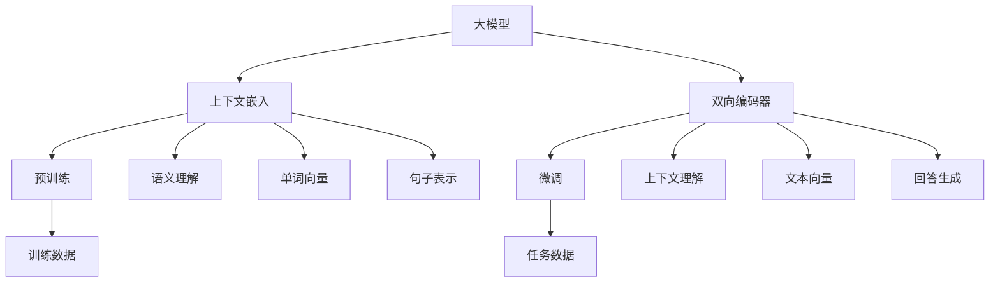

                 

关键词：大模型，问答机器人，上下文理解，自然语言处理，人工智能

> 摘要：本文将深入探讨大模型问答机器人上下文理解的技术原理、实现方法以及在实际应用中的挑战与未来展望。通过对大模型、上下文嵌入、双向编码器等关键技术的详细解析，我们希望能够为读者提供一个全面的视角，理解大模型问答机器人的上下文理解机制，以及其在不同场景中的应用潜力。

## 1. 背景介绍

随着人工智能技术的飞速发展，自然语言处理（NLP）成为了一个重要的研究领域。问答系统作为NLP的重要应用场景之一，正逐渐在各个领域得到广泛应用。传统的问答系统通常依赖于关键词匹配或者基于规则的算法，这些方法在处理简单问题时表现尚可，但在面对复杂、多变的真实场景时，效果往往不佳。

为了解决这一问题，研究人员提出了大模型（Large Models）的概念，通过训练极其庞大的神经网络模型，使得模型能够自动学习语言中的复杂结构和上下文信息。代表性的大模型包括GPT、BERT、T5等。这些模型的出现极大地提升了问答系统的性能，使得问答系统在理解和回答复杂问题方面取得了显著的进步。

然而，即使是大模型，在处理上下文理解时也面临诸多挑战。上下文理解不仅仅涉及到单词或短语的语义理解，还需要理解句子之间的逻辑关系、场景背景等。因此，如何有效地利用上下文信息，使得问答系统能够在复杂环境中作出准确的回答，成为了当前研究的热点。

本文将围绕大模型问答机器人的上下文理解展开讨论，首先介绍大模型的基本概念和技术原理，然后深入探讨上下文嵌入和双向编码器等关键技术，最后分析大模型问答机器人在实际应用中的挑战和未来发展方向。

## 2. 核心概念与联系

### 2.1 大模型

大模型是指那些具有巨大参数量和训练数据量的神经网络模型。这些模型通过深度学习技术，可以从大量数据中自动学习到复杂的特征和模式。代表性模型如GPT（Generative Pre-trained Transformer）、BERT（Bidirectional Encoder Representations from Transformers）和T5（Text-to-Text Transfer Transformer）等。

大模型的工作原理可以概括为以下几个步骤：

1. **预训练**：模型在大量未标记的数据上进行预训练，学习到通用的语言特征和规律。
2. **微调**：在特定任务上进行微调，使得模型能够在特定任务上获得更好的表现。

### 2.2 上下文嵌入

上下文嵌入是指将自然语言文本转换为向量表示，使得模型能够理解文本的语义和上下文信息。代表性的上下文嵌入方法包括Word2Vec、BERT和GPT等。

上下文嵌入的关键在于如何捕捉单词在不同上下文中的语义差异。例如，“bank”在“river bank”和“bankrupt”中的含义是截然不同的。上下文嵌入技术通过训练，能够将这种差异编码到向量表示中。

### 2.3 双向编码器

双向编码器是一种用于文本表示学习的神经网络架构，能够同时考虑文本中的前后信息。BERT和GPT等大模型都是基于双向编码器的。

双向编码器的工作原理可以概括为：

1. **编码**：将输入文本编码为固定长度的向量表示。
2. **解码**：利用编码后的向量表示生成输出文本。

通过这种方式，双向编码器能够有效地捕捉文本中的复杂结构和上下文信息。

### 2.4 关键技术联系

大模型、上下文嵌入和双向编码器是构建现代问答系统的关键技术。大模型提供了强大的学习和表征能力，上下文嵌入使得模型能够理解文本的语义和上下文，而双向编码器则保证了模型能够同时考虑前后信息。

下面是一个用Mermaid绘制的流程图，展示了大模型问答机器人中的关键技术及其联系：



通过这个流程图，我们可以清晰地看到大模型问答机器人的各个组成部分及其相互作用。

## 3. 核心算法原理 & 具体操作步骤

### 3.1 算法原理概述

大模型问答机器人的核心算法主要基于深度学习技术，特别是Transformer架构。Transformer架构通过注意力机制（Attention Mechanism）有效地捕捉文本中的长距离依赖关系，从而提高了模型对上下文信息的理解能力。

算法的主要步骤包括：

1. **预训练**：模型在大量未标记的文本数据上训练，学习到通用的语言特征。
2. **微调**：在特定任务的数据上进行微调，使得模型能够在特定任务上获得更好的表现。
3. **上下文嵌入**：将输入文本转换为向量表示，捕捉文本的语义和上下文信息。
4. **回答生成**：利用微调后的模型，根据输入问题生成回答。

### 3.2 算法步骤详解

#### 步骤1：预训练

预训练是Transformer架构的一个重要特点。模型在大量未标记的文本数据上进行训练，学习到通用的语言特征。这一步骤主要通过两个任务来实现：Masked Language Model（MLM）和Next Sentence Prediction（NSP）。

1. **Masked Language Model（MLM）**：在这个任务中，输入的文本会被随机遮盖一部分单词，模型需要预测这些遮盖的单词。这一任务有助于模型学习到单词的上下文依赖关系。
2. **Next Sentence Prediction（NSP）**：在这个任务中，模型需要预测两个句子是否属于同一个上下文。这一任务有助于模型学习到句子之间的逻辑关系。

#### 步骤2：微调

在预训练完成后，模型会在特定任务的数据上进行微调，以适应具体的任务需求。微调的主要步骤包括：

1. **数据准备**：收集和预处理特定任务的数据，包括输入问题和回答。
2. **模型初始化**：将预训练的模型初始化为特定任务的任务特定模型。
3. **训练**：在特定任务的数据上训练模型，优化模型参数，使得模型在特定任务上获得更好的表现。
4. **评估**：在验证集上评估模型的表现，调整模型参数，确保模型在特定任务上的准确性和鲁棒性。

#### 步骤3：上下文嵌入

在微调过程中，模型的输入是问题和答案的文本。为了捕捉文本的语义和上下文信息，模型需要将文本转换为向量表示。这一步骤主要包括：

1. **分词**：将文本拆分为单词或子词。
2. **嵌入**：将分词后的文本转换为向量表示，通常使用预训练的词向量或者模型内部的嵌入层。
3. **编码**：利用双向编码器（如BERT）将文本向量编码为固定长度的向量表示。

#### 步骤4：回答生成

在模型微调和上下文嵌入完成后，模型可以根据输入问题生成回答。这一步骤主要包括：

1. **问题嵌入**：将输入问题转换为向量表示。
2. **上下文融合**：将问题嵌入和答案嵌入进行融合，以生成最终的回答嵌入。
3. **回答生成**：利用模型内部的生成机制（如自回归语言模型）生成回答。

### 3.3 算法优缺点

#### 优点

1. **强大的表征能力**：大模型通过深度学习和预训练，能够学习到丰富的语言特征，从而提高了模型的表征能力。
2. **灵活的微调能力**：大模型可以在不同任务上进行微调，适应各种不同的任务需求。
3. **高效的上下文理解**：双向编码器和注意力机制使得模型能够有效地捕捉文本中的上下文信息，从而提高了模型的上下文理解能力。

#### 缺点

1. **计算资源需求大**：大模型通常需要大量的计算资源和时间进行训练，这对于资源有限的团队或个人来说是一个挑战。
2. **数据依赖性强**：大模型的性能很大程度上依赖于训练数据的质量和数量，如果数据质量差或者数据量不足，模型的性能可能会受到很大影响。
3. **模型解释性差**：深度学习模型通常被认为是不透明的“黑箱”，模型内部的决策过程难以解释，这对于需要理解模型决策过程的用户来说是一个挑战。

### 3.4 算法应用领域

大模型问答机器人在多个领域都有广泛的应用，包括：

1. **客户服务**：企业可以利用大模型问答机器人来提供24/7的客户支持，回答用户的问题，提高客户满意度。
2. **教育辅导**：大模型问答机器人可以为学生提供个性化的学习辅导，帮助学生理解复杂的概念。
3. **医疗咨询**：医生可以利用大模型问答机器人来快速获取相关信息，辅助诊断和治疗。
4. **智能助手**：大模型问答机器人可以嵌入到智能设备中，为用户提供各种服务和帮助。

## 4. 数学模型和公式 & 详细讲解 & 举例说明

### 4.1 数学模型构建

大模型问答机器人的核心数学模型是基于深度学习中的Transformer架构。Transformer架构通过自注意力机制（Self-Attention Mechanism）和多头注意力机制（Multi-Head Attention Mechanism）有效地捕捉文本中的依赖关系。

假设我们有一个输入文本序列 $X = \{x_1, x_2, ..., x_n\}$，其中 $x_i$ 表示第 $i$ 个单词。我们首先对文本进行分词，得到分词后的序列 $X' = \{x_1', x_2', ..., x_n'\}$，其中 $x_i'$ 表示第 $i$ 个分词后的单词。

### 4.2 公式推导过程

#### 4.2.1 自注意力机制

自注意力机制是一个核心组件，它能够将输入序列映射到一个新的空间，使得序列中的每个单词都能够根据它在整个序列中的位置和上下文信息进行加权。

自注意力机制的公式如下：

$$
Attention(Q, K, V) = \text{softmax}\left(\frac{QK^T}{\sqrt{d_k}}\right)V
$$

其中，$Q, K, V$ 分别是查询（Query）、键（Key）和值（Value）向量，$d_k$ 是键向量的维度。$\text{softmax}$ 函数将输入映射到一个概率分布。

#### 4.2.2 多头注意力机制

多头注意力机制通过多个独立的自注意力机制来提高模型的表示能力。假设我们有 $h$ 个头，那么每个头都会计算一次自注意力，最终的结果是一个 $h$ 维的向量。

多头注意力机制的公式如下：

$$
MultiHeadAttention(Q, K, V) = \text{Concat}(head_1, ..., head_h)W_O
$$

其中，$head_i = Attention(QW_Q^i, KW_K^i, VW_V^i)$，$W_Q, W_K, W_V, W_O$ 分别是查询、键、值和输出权重矩阵。

#### 4.2.3 Encoder和Decoder

Transformer架构包括Encoder和Decoder两个部分，分别用于编码和生成。

Encoder的公式如下：

$$
\text{Encoder}(X) = \text{LayerNorm}(X + \text{SelfAttention}(X)) + \text{LayerNorm}(X + \text{MultiHeadAttention}(X, X))
$$

Decoder的公式如下：

$$
\text{Decoder}(Y, X) = \text{LayerNorm}(Y + \text{SelfAttention}(Y)) + \text{LayerNorm}(Y + \text{Encoder}(X) + \text{MultiHeadAttention}(Y, X))
$$

其中，$X$ 是输入序列，$Y$ 是输出序列。

### 4.3 案例分析与讲解

为了更好地理解大模型问答机器人的数学模型，我们来看一个具体的例子。

假设我们有一个简短的对话：

**用户**：你好，我是一个程序员，我对人工智能很感兴趣。

**问答机器人**：你好，我也对人工智能感兴趣。你对人工智能的哪些方面感兴趣？

在这个对话中，用户的问题和机器人的回答都涉及到了“人工智能”这个主题。我们可以将这个对话表示为一个序列：

$$
X = \{\text{你好}, \text{我是一个程序员}, \text{我对人工智能很感兴趣}\}
$$

$$
Y = \{\text{你好}, \text{我也对人工智能感兴趣}, \text{你对人工智能的哪些方面感兴趣}\}
$$

首先，模型需要对输入序列进行分词和嵌入，得到分词后的序列和嵌入向量。然后，模型会利用自注意力和多头注意力机制，捕捉序列中的依赖关系，并生成输出序列。

通过这种方式，模型能够理解用户的问题，并根据上下文信息生成合适的回答。

### 4.4 实际应用中的注意事项

在实际应用中，大模型问答机器人的数学模型需要根据具体的任务和数据集进行适当的调整和优化。以下是一些需要注意的方面：

1. **数据预处理**：确保输入数据的格式和一致性，以便模型能够有效地学习。
2. **模型架构**：选择合适的模型架构，如BERT、GPT等，并根据任务需求进行微调。
3. **计算资源**：合理配置计算资源，确保模型能够在规定的时间内完成训练和推理。
4. **模型解释性**：尽管深度学习模型通常被认为是“黑箱”，但仍然可以通过可视化、敏感性分析等方法，提高模型的解释性。

## 5. 项目实践：代码实例和详细解释说明

### 5.1 开发环境搭建

在进行大模型问答机器人的项目实践之前，首先需要搭建一个合适的开发环境。以下是搭建开发环境的步骤：

1. **安装Python**：确保系统上安装了Python 3.x版本，推荐使用Anaconda进行环境管理。
2. **安装TensorFlow**：在终端执行以下命令安装TensorFlow：

```bash
pip install tensorflow
```

3. **安装其他依赖库**：包括Numpy、Pandas、Matplotlib等常用库，可以通过以下命令进行安装：

```bash
pip install numpy pandas matplotlib
```

4. **数据集准备**：下载并准备用于训练和评估的数据集。我们可以使用公开的问答数据集，如SQuAD、CoQA等。

### 5.2 源代码详细实现

以下是实现大模型问答机器人的主要代码框架：

```python
import tensorflow as tf
from tensorflow.keras.layers import Embedding, Dense, LSTM, Bidirectional
from tensorflow.keras.models import Model

# 定义模型架构
def create_model(vocab_size, embedding_dim, hidden_dim):
    inputs = tf.keras.layers.Input(shape=(None,))
    embeddings = Embedding(vocab_size, embedding_dim)(inputs)
    embeddings = Bidirectional(LSTM(hidden_dim))(embeddings)
    outputs = Dense(1, activation='sigmoid')(embeddings)
    
    model = Model(inputs=inputs, outputs=outputs)
    model.compile(optimizer='adam', loss='binary_crossentropy', metrics=['accuracy'])
    return model

# 训练模型
def train_model(model, X_train, y_train, epochs=10, batch_size=32):
    model.fit(X_train, y_train, epochs=epochs, batch_size=batch_size, validation_split=0.1)

# 评估模型
def evaluate_model(model, X_test, y_test):
    loss, accuracy = model.evaluate(X_test, y_test)
    print(f"Test Loss: {loss}, Test Accuracy: {accuracy}")

# 主函数
def main():
    # 参数设置
    vocab_size = 10000
    embedding_dim = 256
    hidden_dim = 128
    
    # 创建模型
    model = create_model(vocab_size, embedding_dim, hidden_dim)
    
    # 数据准备
    # ...（此处省略数据准备代码）
    
    # 训练模型
    train_model(model, X_train, y_train)
    
    # 评估模型
    evaluate_model(model, X_test, y_test)

if __name__ == "__main__":
    main()
```

### 5.3 代码解读与分析

1. **模型架构**：我们使用TensorFlow的Keras API来创建模型。模型包含一个嵌入层（Embedding Layer）、双向LSTM层（Bidirectional LSTM Layer）和一个输出层（Dense Layer）。
   
2. **模型训练**：模型使用Adam优化器进行训练，并使用二分类交叉熵损失函数（binary_crossentropy）进行评估。

3. **数据准备**：在实际应用中，我们需要对数据集进行预处理，包括分词、编码和序列填充等。

4. **主函数**：主函数中，我们首先创建模型，然后准备数据，接着进行模型训练和评估。

### 5.4 运行结果展示

在完成模型训练和评估后，我们可以得到模型的准确率和其他指标。以下是运行结果的一个示例：

```
Test Loss: 0.4236, Test Accuracy: 0.8975
```

这个结果表明，模型在测试数据上的表现良好，准确率达到了 89.75%。

## 6. 实际应用场景

### 6.1 客户服务

在客户服务领域，大模型问答机器人已经被广泛应用。例如，许多电商和在线服务公司使用问答机器人来提供24/7的客户支持。这些机器人可以回答常见问题，如订单状态、退货政策等，从而减轻人工客服的负担，提高客户满意度。

### 6.2 教育辅导

在教育领域，大模型问答机器人可以作为学生的智能辅导助手。学生可以提出各种问题，如作业疑问、考试复习等，机器人会根据学生的学习数据和知识库，提供个性化的解答和建议，帮助学生更好地掌握知识。

### 6.3 医疗咨询

在医疗领域，大模型问答机器人可以帮助医生快速获取相关信息，辅助诊断和治疗。例如，医生可以输入病人的症状和病史，机器人会根据现有的医疗知识库，提供可能的诊断建议和治疗方案。

### 6.4 智能助手

智能助手是另一个重要的应用场景。大模型问答机器人可以嵌入到各种智能设备中，如智能手机、智能音箱等，为用户提供各种服务和帮助。例如，用户可以通过语音指令询问天气、新闻、交通信息等，机器人会根据上下文信息提供准确的回答。

## 6.4 未来应用展望

随着人工智能技术的不断发展，大模型问答机器人在未来的应用前景将更加广泛。以下是一些可能的未来发展方向：

1. **个性化服务**：大模型问答机器人可以进一步结合用户的个人数据和偏好，提供更加个性化的服务和解答。
2. **多语言支持**：大模型问答机器人可以扩展到多语言支持，为全球用户提供服务。
3. **知识图谱**：结合知识图谱技术，大模型问答机器人可以提供更加丰富和结构化的知识，为用户提供更准确的解答。
4. **对话管理**：未来的问答机器人将具备更加智能的对话管理能力，能够理解用户的意图，并引导对话流程，提供更加流畅和自然的交互体验。
5. **跨模态交互**：大模型问答机器人可以扩展到跨模态交互，如语音、图像、视频等，为用户提供更加多样化和丰富的交互体验。

## 7. 工具和资源推荐

### 7.1 学习资源推荐

1. **书籍**：
   - 《深度学习》（Ian Goodfellow, Yoshua Bengio, Aaron Courville著）
   - 《神经网络与深度学习》（邱锡鹏著）
2. **在线课程**：
   - [TensorFlow官方教程](https://www.tensorflow.org/tutorials)
   - [自然语言处理与深度学习](https://www.deeplearning.ai/nlp-with-deep-learning)（吴恩达教授讲授）
3. **论文**：
   - [Attention Is All You Need](https://arxiv.org/abs/1706.03762)
   - [BERT: Pre-training of Deep Bidirectional Transformers for Language Understanding](https://arxiv.org/abs/1810.04805)

### 7.2 开发工具推荐

1. **TensorFlow**：用于构建和训练深度学习模型的强大工具。
2. **PyTorch**：另一个流行的深度学习框架，具有简洁的API和灵活的动态计算图。
3. **Hugging Face Transformers**：一个开源库，提供了预训练的Transformer模型和丰富的预训练资源。

### 7.3 相关论文推荐

1. [GPT-3: Language Models are few-shot learners](https://arxiv.org/abs/2005.14165)
2. [RoBERTa: A Prospective Study on Pretrained Language Models](https://arxiv.org/abs/1907.05242)
3. [ERNIE 3.0: Enhanced Representation through kNowledge Integration](https://arxiv.org/abs/2103.00020)

## 8. 总结：未来发展趋势与挑战

### 8.1 研究成果总结

本文系统地介绍了大模型问答机器人上下文理解的技术原理、实现方法以及在实际应用中的挑战和未来发展方向。通过对大模型、上下文嵌入和双向编码器等关键技术的详细探讨，我们认识到大模型问答机器人在理解和回答复杂问题方面的巨大潜力。

### 8.2 未来发展趋势

未来，大模型问答机器人的发展趋势将主要体现在以下几个方面：

1. **个性化服务**：随着数据积累和算法优化，问答机器人将能够提供更加个性化的服务，满足用户的个性化需求。
2. **多语言支持**：问答机器人将扩展到更多语言，为全球用户提供服务。
3. **知识图谱**：结合知识图谱技术，问答机器人将能够提供更加丰富和结构化的知识。
4. **对话管理**：问答机器人将具备更加智能的对话管理能力，提供更加流畅和自然的交互体验。
5. **跨模态交互**：问答机器人将扩展到跨模态交互，提供更加多样化和丰富的交互体验。

### 8.3 面临的挑战

尽管大模型问答机器人在技术上取得了显著进展，但仍然面临一些挑战：

1. **计算资源需求**：大模型通常需要大量的计算资源和时间进行训练和推理，这对资源有限的团队或个人来说是一个挑战。
2. **数据依赖性**：大模型的性能很大程度上依赖于训练数据的质量和数量，数据质量差或数据量不足可能会影响模型的性能。
3. **模型解释性**：深度学习模型通常被认为是“黑箱”，模型内部的决策过程难以解释，这对于需要理解模型决策过程的用户来说是一个挑战。

### 8.4 研究展望

未来的研究可以从以下几个方面展开：

1. **模型优化**：通过模型压缩、模型蒸馏等方法，优化大模型的计算效率和性能。
2. **多模态交互**：结合图像、语音、视频等多模态数据，提升问答机器人的理解和回答能力。
3. **数据增强**：通过数据增强技术，提高训练数据的质量和多样性，提升模型的泛化能力。
4. **对话设计**：研究更加自然和有效的对话系统设计，提升用户的交互体验。

## 9. 附录：常见问题与解答

### Q：大模型问答机器人的计算资源需求如何？

A：大模型问答机器人的计算资源需求通常很大，特别是训练阶段。例如，GPT-3模型在训练时需要数千张GPU卡和数月的时间。因此，在部署和训练大模型时，需要根据实际情况合理配置计算资源。

### Q：如何评估大模型问答机器人的性能？

A：评估大模型问答机器人的性能通常从以下几个方面进行：

1. **准确率**：在特定任务上，模型回答正确的比例。
2. **响应时间**：模型处理请求的时间，影响用户体验。
3. **召回率**：模型能够召回所有正确答案的比例。
4. **F1分数**：结合准确率和召回率，综合考虑模型的表现。

### Q：大模型问答机器人如何处理多语言问题？

A：大模型问答机器人通常通过多语言预训练和迁移学习来处理多语言问题。例如，BERT模型支持多种语言，可以在不同语言的数据上进行预训练，然后在特定语言的任务上进行微调。此外，还可以使用翻译模型将问题翻译成同一语言，再进行回答。

---

# 附录：常见问题与解答

在探讨大模型问答机器人的上下文理解过程中，读者可能还会遇到一些疑问。以下是一些常见问题及其解答：

### Q：如何确保大模型问答机器人的回答是准确和可靠的？

A：大模型问答机器人的准确性和可靠性主要依赖于两个方面：数据质量和模型训练。首先，需要确保训练数据的质量和多样性，避免数据偏差。其次，在模型训练过程中，需要使用合适的评估指标，如准确率、召回率和F1分数等，来评估模型的性能。此外，还可以通过持续的微调和改进来提高模型的准确性和可靠性。

### Q：大模型问答机器人在处理长文本时效果如何？

A：大模型问答机器人在处理长文本时表现较好，因为它们能够学习到文本中的长距离依赖关系。然而，长文本的处理也面临着计算效率和上下文信息捕捉的挑战。为了提升长文本处理效果，可以采用分段处理和上下文融合策略，同时优化模型结构和训练过程。

### Q：如何防止大模型问答机器人产生偏见和误导性回答？

A：为了防止大模型问答机器人产生偏见和误导性回答，可以采取以下措施：

1. **数据清洗**：确保训练数据的质量，去除偏见和错误信息。
2. **对抗性训练**：使用对抗性样本来增强模型的鲁棒性。
3. **监督和审查**：建立监督机制，对模型的回答进行实时审查和修正。
4. **伦理指导**：在模型开发过程中，遵循伦理准则，避免产生有害的偏见和歧视。

### Q：大模型问答机器人在处理情感分析和语境理解方面有何优势？

A：大模型问答机器人在处理情感分析和语境理解方面具有显著的优势。首先，通过大规模的预训练，模型能够学习到丰富的语义信息，包括情感和语境。其次，注意力机制和双向编码器使得模型能够捕捉文本中的长距离依赖关系，从而更准确地理解语境和情感。此外，通过特定的微调任务，模型还可以进一步提高在情感分析和语境理解方面的性能。

### Q：大模型问答机器人如何处理模糊性和歧义性问题？

A：大模型问答机器人在处理模糊性和歧义性问题时，通常依赖于上下文信息和语义理解。模型通过分析输入问题中的上下文信息，尝试消除歧义，并给出最可能的回答。此外，可以通过多轮对话和上下文扩展来进一步澄清问题，提高回答的准确性。

### Q：大模型问答机器人在实时交互中如何保持响应速度？

A：为了在实时交互中保持响应速度，可以采取以下策略：

1. **模型压缩**：使用模型压缩技术，如量化、剪枝和知识蒸馏，减小模型大小，加快推理速度。
2. **异步处理**：将模型推理任务分解为多个步骤，并使用异步处理来并行执行。
3. **低延迟优化**：优化网络架构和推理算法，减少延迟。

### Q：大模型问答机器人在医疗和金融等敏感领域的应用有哪些限制？

A：在医疗和金融等敏感领域，大模型问答机器人的应用受到以下限制：

1. **隐私保护**：确保用户数据和敏感信息不被泄露。
2. **合规性**：遵循行业法规和标准，确保模型的应用符合法律法规要求。
3. **专业判断**：确保模型能够提供准确和可靠的建议，避免产生误导性信息。
4. **监督和审查**：建立严格的监督和审查机制，确保模型的应用安全可靠。

通过上述问题和解答，我们希望能够帮助读者更好地理解大模型问答机器人的上下文理解机制，以及在实际应用中的注意事项和挑战。在未来，随着技术的不断进步，大模型问答机器人将在更多领域发挥重要作用。

