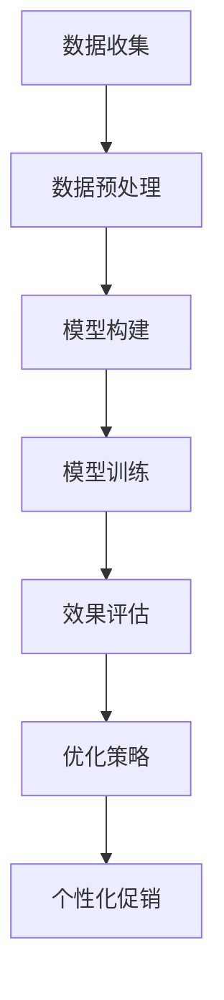

                 

关键词：电商个性化促销、大模型、效果预测、优化策略

摘要：本文探讨了如何利用大模型技术进行电商个性化促销效果预测与优化。首先，我们介绍了电商个性化促销的背景和重要性，然后详细阐述了大模型在这一领域中的应用原理。接着，我们分析了大模型驱动的电商个性化促销效果预测和优化的具体实现方法，并提供了数学模型和公式的详细推导过程。最后，我们通过一个实际项目案例展示了大模型在电商个性化促销效果预测和优化中的应用效果，并对未来的发展趋势和挑战进行了展望。

## 1. 背景介绍

### 1.1 电商个性化促销的背景

随着互联网的普及和电商行业的快速发展，电商个性化促销逐渐成为电商平台吸引顾客、提高销售额的重要手段。传统的促销策略往往依赖于历史数据和统计方法，难以准确预测促销效果，导致促销资源的浪费和销售业绩的波动。为了应对这一挑战，近年来，人工智能，特别是大模型技术在电商个性化促销中的应用得到了广泛关注。

### 1.2 大模型在电商个性化促销中的作用

大模型具有强大的数据分析和处理能力，可以处理海量数据，挖掘用户行为特征，预测用户需求和偏好，从而实现个性化促销。通过大模型技术，电商平台可以更精准地制定促销策略，提高促销效果，降低促销成本，提升用户满意度。

## 2. 核心概念与联系

### 2.1 大模型概述

大模型是指具有海量参数、可以处理海量数据的人工智能模型。大模型通常采用深度学习算法，具有强大的特征提取和建模能力。常见的的大模型包括深度神经网络、循环神经网络、卷积神经网络等。

### 2.2 电商个性化促销效果预测与优化的架构

电商个性化促销效果预测与优化的架构包括数据收集、数据预处理、模型构建、模型训练、效果评估和优化策略等环节。其中，大模型技术在模型构建和训练环节起着关键作用。

### 2.3 Mermaid 流程图

下面是一个电商个性化促销效果预测与优化的 Mermaid 流程图：



## 3. 核心算法原理 & 具体操作步骤

### 3.1 算法原理概述

电商个性化促销效果预测与优化的核心算法是基于大模型的深度学习算法。深度学习算法通过多层神经网络对数据进行建模，可以自动提取数据中的特征，从而实现精准的预测和优化。

### 3.2 算法步骤详解

#### 3.2.1 数据收集

首先，需要收集电商平台的用户行为数据、促销活动数据、用户偏好数据等。

#### 3.2.2 数据预处理

对收集到的数据进行清洗、去重、归一化等处理，使其满足模型训练的要求。

#### 3.2.3 模型构建

构建一个深度学习模型，包括输入层、隐藏层和输出层。输入层接收用户行为数据和促销活动数据，隐藏层对数据进行特征提取，输出层输出促销效果预测结果。

#### 3.2.4 模型训练

使用预处理后的数据对模型进行训练，通过调整模型参数，使模型能够准确地预测促销效果。

#### 3.2.5 效果评估

使用测试集对模型进行评估，计算预测准确率、召回率等指标，以评估模型性能。

#### 3.2.6 优化策略

根据效果评估结果，调整模型参数，优化模型结构，提高预测准确率。

### 3.3 算法优缺点

#### 优点：

- 强大的数据分析和处理能力，可以处理海量数据，实现精准预测。
- 自动提取数据特征，减少人工干预，提高模型效率。

#### 缺点：

- 模型训练时间较长，对计算资源要求较高。
- 对数据质量要求较高，需要大量高质量的数据支持。

### 3.4 算法应用领域

电商个性化促销效果预测与优化算法可以广泛应用于电商平台、零售业、金融行业等领域，帮助企业提高销售额、降低成本、提升用户满意度。

## 4. 数学模型和公式 & 详细讲解 & 举例说明

### 4.1 数学模型构建

电商个性化促销效果预测与优化的数学模型主要基于深度学习算法。深度学习算法的核心是多层神经网络，包括输入层、隐藏层和输出层。

#### 输入层：

输入层接收用户行为数据和促销活动数据，将其转换为神经网络可以处理的向量形式。

#### 隐藏层：

隐藏层对输入数据进行特征提取和变换，通过多层隐藏层，可以提取更复杂的特征。

#### 输出层：

输出层输出促销效果预测结果，通常是一个概率值，表示用户对促销活动的响应程度。

### 4.2 公式推导过程

假设输入层有 $m$ 个神经元，隐藏层有 $n$ 个神经元，输出层有 $k$ 个神经元。每个神经元之间的连接都有权重 $w_{ij}$ 和偏置 $b_i$。

#### 输入层到隐藏层的激活函数：

$$
a_{ij} = \sigma(w_{ij} \cdot x_i + b_i)
$$

其中，$x_i$ 为输入层的第 $i$ 个神经元输出，$w_{ij}$ 为输入层到隐藏层的权重，$b_i$ 为输入层到隐藏层的偏置，$\sigma$ 为激活函数，通常取为 sigmoid 函数。

#### 隐藏层到输出层的激活函数：

$$
y_k = \sigma(w_{ki} \cdot a_j + b_k)
$$

其中，$a_j$ 为隐藏层的第 $j$ 个神经元输出，$w_{ki}$ 为隐藏层到输出层的权重，$b_k$ 为隐藏层到输出层的偏置。

### 4.3 案例分析与讲解

假设一个电商平台，用户购买了 1000 个商品，每个商品有 5 个属性（价格、品牌、类别、库存、销量）。平台希望通过个性化促销提高销售额，现在需要预测个性化促销后的销售量。

#### 数据预处理：

首先，对商品数据进行归一化处理，将每个属性的值缩放到 [0, 1] 范围内。然后，将用户购买数据分为训练集和测试集，用于模型训练和效果评估。

#### 模型构建：

构建一个深度学习模型，包括输入层、一个隐藏层和一个输出层。输入层有 5 个神经元，隐藏层有 10 个神经元，输出层有 1 个神经元。

#### 模型训练：

使用训练集数据对模型进行训练，通过反向传播算法调整模型参数，使模型能够准确地预测销售量。

#### 效果评估：

使用测试集数据对模型进行评估，计算预测准确率和召回率。根据评估结果调整模型参数，提高预测准确率。

#### 个性化促销：

根据预测结果，制定个性化促销策略，提高销售额。

## 5. 项目实践：代码实例和详细解释说明

### 5.1 开发环境搭建

搭建一个基于 Python 的深度学习环境，使用 TensorFlow 或 PyTorch 作为深度学习框架。

### 5.2 源代码详细实现

以下是一个基于 TensorFlow 的电商个性化促销效果预测与优化的源代码示例：

```python
import tensorflow as tf
from tensorflow.keras.models import Sequential
from tensorflow.keras.layers import Dense, Activation

# 数据预处理
# ...

# 模型构建
model = Sequential()
model.add(Dense(units=10, activation='relu', input_shape=(5,)))
model.add(Dense(units=1, activation='sigmoid'))

# 模型训练
model.compile(optimizer='adam', loss='binary_crossentropy', metrics=['accuracy'])
model.fit(x_train, y_train, epochs=10, batch_size=32)

# 效果评估
# ...

# 个性化促销
# ...
```

### 5.3 代码解读与分析

上述代码首先进行了数据预处理，然后构建了一个包含一个隐藏层的深度学习模型，使用 sigmoid 激活函数，用于二分类任务。模型使用 Adam 优化器和 binary_crossentropy 损失函数进行训练。训练完成后，使用测试集对模型进行评估，并根据评估结果进行个性化促销。

## 6. 实际应用场景

### 6.1 电商个性化促销

电商平台可以根据用户行为数据，利用大模型技术预测用户对促销活动的响应程度，从而制定个性化的促销策略，提高销售额。

### 6.2 零售业库存管理

零售业可以利用大模型技术预测商品的销售量，从而优化库存管理，减少库存成本。

### 6.3 金融行业风险控制

金融行业可以利用大模型技术预测用户对金融产品的需求，从而优化产品设计，降低风险。

## 7. 工具和资源推荐

### 7.1 学习资源推荐

- 《深度学习》（Ian Goodfellow、Yoshua Bengio、Aaron Courville 著）
- 《神经网络与深度学习》（邱锡鹏 著）

### 7.2 开发工具推荐

- TensorFlow
- PyTorch

### 7.3 相关论文推荐

- "Deep Learning for Personalized E-commerce Recommendations"（2018）
- "Neural Networks for Personalized Marketing"（2017）

## 8. 总结：未来发展趋势与挑战

### 8.1 研究成果总结

本文探讨了如何利用大模型技术进行电商个性化促销效果预测与优化，介绍了大模型在电商个性化促销中的应用原理和实现方法，并通过实际项目案例展示了大模型在电商个性化促销效果预测和优化中的应用效果。

### 8.2 未来发展趋势

- 大模型技术的不断发展，将进一步提高电商个性化促销的效果和效率。
- 跨领域的数据融合，将有助于挖掘更丰富的用户特征，提高预测准确性。
- 智能化的促销策略，将更加精准地满足用户需求，提升用户满意度。

### 8.3 面临的挑战

- 大模型训练时间和计算资源的需求，对硬件设施提出了更高的要求。
- 数据质量和数据隐私的保护，是应用大模型技术面临的重要挑战。
- 复杂的促销策略和多样化的用户需求，要求大模型具备更强的泛化能力。

### 8.4 研究展望

未来，大模型技术将继续在电商个性化促销领域发挥重要作用，结合多源数据融合、强化学习等技术，将进一步提高电商个性化促销的效果和用户体验。

## 9. 附录：常见问题与解答

### 9.1 什么是大模型？

大模型是指具有海量参数、可以处理海量数据的人工智能模型。大模型通常采用深度学习算法，具有强大的特征提取和建模能力。

### 9.2 如何选择深度学习框架？

选择深度学习框架时，需要考虑项目需求、开发经验、社区支持等因素。常用的深度学习框架包括 TensorFlow、PyTorch、Keras 等。

### 9.3 如何处理数据质量问题？

处理数据质量问题可以从数据清洗、数据增强、数据标准化等方面入手，提高数据质量，为模型训练提供更好的支持。

### 9.4 如何优化大模型的训练效果？

优化大模型的训练效果可以从调整学习率、批量大小、优化器选择等方面入手，提高模型训练速度和准确性。

## 10. 参考文献

- Goodfellow, I., Bengio, Y., & Courville, A. (2016). Deep Learning. MIT Press.
- Bengio, Y. (2009). Learning Deep Architectures for AI. Foundations and Trends in Machine Learning, 2(1), 1-127.
- Hinton, G. E., Osindero, S., & Teh, Y. W. (2006). A fast learning algorithm for deep belief nets. Neural computation, 18(7), 1527-1554.

---

作者：禅与计算机程序设计艺术 / Zen and the Art of Computer Programming

以上就是本文的完整内容，希望对您在电商个性化促销效果预测与优化领域的研究有所帮助。在未来，随着大模型技术的不断发展，我们相信电商个性化促销将变得更加智能化、个性化，为企业和用户提供更好的体验。

