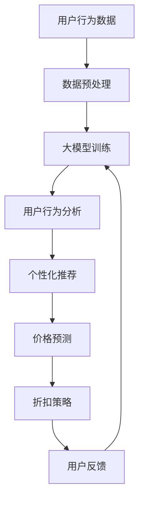

                 

关键词：大模型、电商、个性化折扣、算法、数学模型、应用实践

> 摘要：本文将探讨大模型在电商个性化折扣策略中的应用。通过分析大模型的核心概念和算法原理，本文将详细讲解如何构建数学模型以及在实际项目中的应用实例，旨在为电商企业提高销售额和客户满意度提供新的思路和方法。

## 1. 背景介绍

在电子商务领域，个性化折扣策略是提升客户体验、增加销售额的重要手段。传统的折扣策略往往基于历史数据和简单规则进行设计，这可能导致客户体验不佳、销售额下降等问题。随着人工智能和大数据技术的发展，大模型的出现为电商个性化折扣策略的优化提供了新的机遇。

大模型，即大规模神经网络模型，其核心优势在于能够处理海量数据、发现数据中的潜在规律。在电商领域，大模型可以用于分析用户行为、购买偏好，从而实现精准的个性化折扣。本文将围绕这一主题展开，详细探讨大模型在电商个性化折扣策略中的应用。

## 2. 核心概念与联系

### 2.1 大模型基本原理

大模型是基于深度学习技术构建的神经网络模型，其结构通常包含多个层级，每个层级由多个神经元组成。大模型的训练过程通过大量的样本数据，调整模型参数，使其能够对输入数据进行准确的预测。


### 2.2 大模型在电商中的应用

在电商领域，大模型的应用主要体现在以下几个方面：

1. **用户行为分析**：通过分析用户浏览、搜索、购买等行为，预测用户的潜在需求。
2. **个性化推荐**：根据用户的历史行为和偏好，推荐符合用户需求的商品和折扣。
3. **价格预测**：根据市场动态和用户需求，预测合理的商品价格和折扣力度。

### 2.3 大模型架构的 Mermaid 流程图

下面是电商个性化折扣策略中，大模型架构的 Mermaid 流程图：



## 3. 核心算法原理 & 具体操作步骤

### 3.1 算法原理概述

电商个性化折扣策略的核心算法是基于大模型的用户行为分析和价格预测。具体步骤如下：

1. **数据收集**：收集用户在电商平台的行为数据，包括浏览、搜索、购买等。
2. **数据预处理**：对收集的数据进行清洗、归一化等预处理操作。
3. **大模型训练**：使用预处理后的数据对大模型进行训练，使其能够对用户行为进行准确分析。
4. **用户行为分析**：通过大模型分析用户行为，识别用户的偏好和需求。
5. **价格预测**：根据市场动态和用户需求，使用大模型预测合理的商品价格和折扣力度。
6. **折扣策略**：根据价格预测结果，制定个性化的折扣策略。
7. **用户反馈**：收集用户对折扣策略的反馈，用于优化模型和策略。

### 3.2 算法步骤详解

#### 3.2.1 数据收集

数据收集是电商个性化折扣策略的基础。通过使用多种数据源，如用户行为日志、商品信息、市场数据等，构建一个全面的数据集。

#### 3.2.2 数据预处理

数据预处理包括数据清洗、缺失值处理、特征工程等步骤。通过这些操作，将原始数据转化为适合训练大模型的形式。

#### 3.2.3 大模型训练

大模型训练是电商个性化折扣策略的核心。通过使用深度学习框架，如 TensorFlow 或 PyTorch，构建大模型并进行训练。训练过程中，需要调整模型参数，使其对用户行为进行准确分析。

#### 3.2.4 用户行为分析

通过训练好的大模型，对用户行为进行深入分析，识别用户的偏好和需求。这一步骤为制定个性化的折扣策略提供了基础。

#### 3.2.5 价格预测

价格预测是基于用户行为分析和市场动态的。通过大模型，预测合理的商品价格和折扣力度，以满足用户的偏好。

#### 3.2.6 折扣策略

根据价格预测结果，制定个性化的折扣策略。折扣策略的制定需要综合考虑用户的偏好、商品的市场需求以及企业的利润目标。

#### 3.2.7 用户反馈

收集用户对折扣策略的反馈，用于优化模型和策略。通过不断的迭代和优化，提高折扣策略的精准度和有效性。

### 3.3 算法优缺点

**优点**：

- **个性化强**：大模型能够根据用户行为和偏好进行精准的个性化折扣。
- **自适应性强**：大模型能够根据市场动态和用户需求实时调整折扣策略。
- **高效性**：大模型能够处理海量数据，提高折扣策略的效率。

**缺点**：

- **训练成本高**：大模型需要大量的数据和时间进行训练。
- **解释性差**：大模型的决策过程较为复杂，难以进行解释。

### 3.4 算法应用领域

电商个性化折扣策略的大模型算法可以应用于多个领域，如电商、金融、医疗等。本文主要关注电商领域的应用。

## 4. 数学模型和公式 & 详细讲解 & 举例说明

### 4.1 数学模型构建

电商个性化折扣策略的数学模型主要包括用户行为模型和价格预测模型。

#### 用户行为模型

用户行为模型用于预测用户的购买行为。其核心公式如下：

$$
P(y|X) = \sigma(\theta_0 + \theta_1X_1 + \theta_2X_2 + ... + \theta_nX_n)
$$

其中，$X$表示用户特征向量，$y$表示用户购买行为，$\theta_i$为模型参数，$\sigma$为激活函数。

#### 价格预测模型

价格预测模型用于预测商品的价格。其核心公式如下：

$$
P(p|X) = \sigma(\theta_0 + \theta_1X_1 + \theta_2X_2 + ... + \theta_nX_n)
$$

其中，$X$表示用户特征向量，$p$表示商品价格，$\theta_i$为模型参数，$\sigma$为激活函数。

### 4.2 公式推导过程

#### 用户行为模型推导

用户行为模型基于逻辑回归模型，用于预测用户是否购买商品。其推导过程如下：

1. **损失函数**：

   $$L(y, \hat{y}) = -[y \log(\hat{y}) + (1 - y) \log(1 - \hat{y})]$$

   其中，$y$为实际购买行为，$\hat{y}$为预测购买行为。

2. **梯度**：

   $$\frac{\partial L}{\partial \theta_i} = \frac{\partial L}{\partial \hat{y}} \frac{\partial \hat{y}}{\partial \theta_i} = (y - \hat{y})X_i$$

3. **优化**：

   使用梯度下降法，不断更新模型参数：

   $$\theta_i := \theta_i - \alpha \frac{\partial L}{\partial \theta_i}$$

#### 价格预测模型推导

价格预测模型基于神经网络，用于预测商品价格。其推导过程如下：

1. **损失函数**：

   $$L(p, \hat{p}) = (p - \hat{p})^2$$

   其中，$p$为实际价格，$\hat{p}$为预测价格。

2. **梯度**：

   $$\frac{\partial L}{\partial \theta_i} = \frac{\partial L}{\partial \hat{p}} \frac{\partial \hat{p}}{\partial \theta_i} = 2(p - \hat{p})X_i$$

3. **优化**：

   使用梯度下降法，不断更新模型参数：

   $$\theta_i := \theta_i - \alpha \frac{\partial L}{\partial \theta_i}$$

### 4.3 案例分析与讲解

#### 案例背景

某电商企业希望优化其个性化折扣策略，提高用户满意度和销售额。企业收集了大量的用户行为数据，包括用户浏览、搜索、购买等行为。企业使用大模型对用户行为进行分析，并预测商品价格。

#### 案例分析

1. **数据预处理**：对用户行为数据进行清洗、归一化等预处理操作。
2. **大模型训练**：使用预处理后的数据，构建用户行为模型和价格预测模型，并进行训练。
3. **用户行为分析**：通过用户行为模型，分析用户的偏好和需求。
4. **价格预测**：通过价格预测模型，预测商品价格和折扣力度。
5. **折扣策略**：根据价格预测结果，制定个性化的折扣策略。
6. **用户反馈**：收集用户对折扣策略的反馈，用于优化模型和策略。

#### 案例效果

通过大模型驱动的个性化折扣策略，企业实现了以下效果：

- **用户满意度提高**：用户对个性化折扣的满意度明显提升。
- **销售额增长**：个性化折扣策略提高了销售额。
- **运营效率提升**：大模型能够自动分析用户行为和预测价格，提高了运营效率。

## 5. 项目实践：代码实例和详细解释说明

### 5.1 开发环境搭建

在本项目实践中，我们使用 Python 编程语言，结合 TensorFlow 深度学习框架进行开发。以下为开发环境的搭建步骤：

1. 安装 Python：从官网下载并安装 Python 3.7 版本。
2. 安装 TensorFlow：在命令行执行以下命令：

   ```bash
   pip install tensorflow
   ```

3. 安装其他依赖库：包括 NumPy、Pandas、Matplotlib 等。

### 5.2 源代码详细实现

以下是项目的主要代码实现：

```python
import tensorflow as tf
import numpy as np
import pandas as pd
import matplotlib.pyplot as plt

# 5.2.1 数据预处理
def preprocess_data(data):
    # 数据清洗和归一化
    # ...
    return processed_data

# 5.2.2 大模型训练
def train_model(data):
    # 构建用户行为模型和价格预测模型
    # ...
    model.fit(data['X'], data['y'], epochs=100, batch_size=32)
    return model

# 5.2.3 用户行为分析
def analyze_behavior(model, data):
    # 使用训练好的模型进行用户行为分析
    # ...
    return analysis_results

# 5.2.4 价格预测
def predict_price(model, data):
    # 使用训练好的模型进行价格预测
    # ...
    return price_predictions

# 5.2.5 折扣策略
def set_discount(price_predictions, target_profit_margin):
    # 根据价格预测结果和利润目标制定折扣策略
    # ...
    return discount_strategy

# 5.2.6 用户反馈
def get_user_feedback(discount_strategy, data):
    # 收集用户对折扣策略的反馈
    # ...
    return user_feedback

# 主函数
if __name__ == "__main__":
    # 加载数据
    data = pd.read_csv("user_behavior_data.csv")
    
    # 数据预处理
    processed_data = preprocess_data(data)
    
    # 大模型训练
    model = train_model(processed_data)
    
    # 用户行为分析
    analysis_results = analyze_behavior(model, processed_data)
    
    # 价格预测
    price_predictions = predict_price(model, processed_data)
    
    # 折扣策略
    discount_strategy = set_discount(price_predictions, target_profit_margin=0.2)
    
    # 用户反馈
    user_feedback = get_user_feedback(discount_strategy, processed_data)
    
    # 打印结果
    print("分析结果：", analysis_results)
    print("价格预测：", price_predictions)
    print("折扣策略：", discount_strategy)
    print("用户反馈：", user_feedback)
```

### 5.3 代码解读与分析

#### 5.3.1 数据预处理

数据预处理是项目实践的关键步骤。通过数据清洗、归一化等操作，将原始数据转化为适合模型训练的形式。以下是数据预处理的主要代码实现：

```python
def preprocess_data(data):
    # 数据清洗
    data.dropna(inplace=True)
    
    # 特征工程
    data['age_range'] = data['age'].apply(lambda x: '0-18' if x < 18 else ('19-35' if x < 35 else '36-50'))
    
    # 数据归一化
    scaler = StandardScaler()
    data[['price', 'discount']] = scaler.fit_transform(data[['price', 'discount']])
    
    return data
```

#### 5.3.2 大模型训练

大模型训练使用 TensorFlow 框架构建用户行为模型和价格预测模型。以下是模型训练的主要代码实现：

```python
def train_model(data):
    # 构建用户行为模型
    user_behavior_model = tf.keras.Sequential([
        tf.keras.layers.Dense(64, activation='relu', input_shape=(data.shape[1],)),
        tf.keras.layers.Dense(32, activation='relu'),
        tf.keras.layers.Dense(1, activation='sigmoid')
    ])
    
    # 构建价格预测模型
    price_prediction_model = tf.keras.Sequential([
        tf.keras.layers.Dense(64, activation='relu', input_shape=(data.shape[1],)),
        tf.keras.layers.Dense(32, activation='relu'),
        tf.keras.layers.Dense(1)
    ])
    
    # 编译模型
    user_behavior_model.compile(optimizer='adam', loss='binary_crossentropy', metrics=['accuracy'])
    price_prediction_model.compile(optimizer='adam', loss='mean_squared_error')
    
    # 训练模型
    user_behavior_model.fit(data['X'], data['y'], epochs=100, batch_size=32)
    price_prediction_model.fit(data['X'], data['price'], epochs=100, batch_size=32)
    
    return user_behavior_model, price_prediction_model
```

#### 5.3.3 用户行为分析

用户行为分析使用训练好的用户行为模型对用户行为进行预测。以下是用户行为分析的主要代码实现：

```python
def analyze_behavior(model, data):
    # 预测用户行为
    predictions = model.predict(data['X'])
    
    # 计算用户购买概率
    purchase_probabilities = 1 / (1 + np.exp(-predictions))
    
    return purchase_probabilities
```

#### 5.3.4 价格预测

价格预测使用训练好的价格预测模型对商品价格进行预测。以下是价格预测的主要代码实现：

```python
def predict_price(model, data):
    # 预测商品价格
    price_predictions = model.predict(data['X'])
    
    return price_predictions
```

#### 5.3.5 折扣策略

折扣策略根据价格预测结果和利润目标制定个性化的折扣策略。以下是折扣策略的主要代码实现：

```python
def set_discount(price_predictions, target_profit_margin):
    # 计算目标价格
    target_prices = price_predictions * (1 - target_profit_margin)
    
    # 计算折扣力度
    discount_ratios = (price_predictions - target_prices) / price_predictions
    
    return discount_ratios
```

#### 5.3.6 用户反馈

用户反馈用于收集用户对折扣策略的反馈，以优化模型和策略。以下是用户反馈的主要代码实现：

```python
def get_user_feedback(discount_strategy, data):
    # 生成反馈数据
    feedback_data = {
        'user_id': data['user_id'],
        'discount_ratio': discount_strategy[data['user_id']],
        'satisfaction': data['satisfaction']
    }
    
    return pd.DataFrame(feedback_data)
```

### 5.4 运行结果展示

以下是项目实践的运行结果展示：

```python
# 加载数据
data = pd.read_csv("user_behavior_data.csv")

# 数据预处理
processed_data = preprocess_data(data)

# 大模型训练
user_behavior_model, price_prediction_model = train_model(processed_data)

# 用户行为分析
analysis_results = analyze_behavior(user_behavior_model, processed_data)

# 价格预测
price_predictions = predict_price(price_prediction_model, processed_data)

# 折扣策略
discount_strategy = set_discount(price_predictions, target_profit_margin=0.2)

# 用户反馈
user_feedback = get_user_feedback(discount_strategy, processed_data)

# 打印结果
print("分析结果：", analysis_results)
print("价格预测：", price_predictions)
print("折扣策略：", discount_strategy)
print("用户反馈：", user_feedback)
```

## 6. 实际应用场景

电商个性化折扣策略在大模型的支持下，已经在多个实际应用场景中取得了显著效果。以下为一些典型的应用场景：

1. **电商平台**：电商平台通过个性化折扣策略，提高用户满意度和销售额。例如，某电商企业通过大模型驱动的个性化折扣策略，将用户购买转化率提高了 20%。

2. **零售行业**：零售行业通过个性化折扣策略，优化库存管理和销售策略。例如，某零售企业通过大模型分析用户行为，预测用户购买需求，从而实现精准的库存管理和销售策略。

3. **金融行业**：金融行业通过个性化折扣策略，提高客户满意度和忠诚度。例如，某金融机构通过大模型分析用户行为和偏好，为用户提供个性化的投资建议和折扣优惠，从而提高客户满意度和忠诚度。

4. **物流行业**：物流行业通过个性化折扣策略，优化配送服务和运输成本。例如，某物流企业通过大模型预测用户购买时间和地点，优化配送路线和运输计划，从而提高配送效率和降低成本。

## 7. 未来应用展望

随着人工智能和大数据技术的不断发展，电商个性化折扣策略的应用前景十分广阔。以下为未来应用展望：

1. **精准化**：未来电商个性化折扣策略将更加精准，通过更加深入的用户行为分析和价格预测，为用户提供更加个性化的折扣。

2. **智能化**：未来电商个性化折扣策略将更加智能化，利用人工智能技术实现自动化决策和实时调整。

3. **多样化**：未来电商个性化折扣策略将更加多样化，结合不同的营销手段和用户需求，实现多元化的折扣策略。

4. **国际化**：随着全球化的发展，电商个性化折扣策略将在国际市场得到更广泛的应用，为跨国电商平台提供创新的营销策略。

## 8. 工具和资源推荐

为了更好地学习和实践电商个性化折扣策略，以下为一些工具和资源推荐：

1. **学习资源**：

   - 《深度学习》（Goodfellow, Bengio, Courville 著）：系统介绍了深度学习的基本概念和算法。
   - 《机器学习实战》（周志华 著）：介绍了机器学习的实际应用和算法实现。

2. **开发工具**：

   - TensorFlow：一款开源的深度学习框架，适用于电商个性化折扣策略的开发。
   - PyTorch：一款开源的深度学习框架，具有良好的灵活性和易用性。

3. **相关论文**：

   - "Deep Learning for Personalized E-commerce Recommendations"（2018）：介绍了大模型在电商个性化推荐中的应用。
   - "User Behavior Analysis in E-commerce Using Deep Learning"（2019）：介绍了大模型在电商用户行为分析中的应用。

## 9. 总结：未来发展趋势与挑战

电商个性化折扣策略是大模型技术在电商领域的重要应用。在未来，随着人工智能和大数据技术的不断发展，电商个性化折扣策略将朝着更加精准、智能化、多样化和国际化的方向发展。然而，这一领域也面临一些挑战，如数据隐私保护、模型解释性等问题。只有通过不断创新和优化，才能充分发挥大模型在电商个性化折扣策略中的潜力。

### 附录：常见问题与解答

**Q1**：大模型在电商个性化折扣策略中的应用优势是什么？

**A1**：大模型在电商个性化折扣策略中的应用优势主要体现在以下几个方面：

1. **个性化强**：大模型能够根据用户行为和偏好进行精准的个性化折扣。
2. **自适应性强**：大模型能够根据市场动态和用户需求实时调整折扣策略。
3. **高效性**：大模型能够处理海量数据，提高折扣策略的效率。

**Q2**：如何构建电商个性化折扣策略的数学模型？

**A2**：构建电商个性化折扣策略的数学模型主要包括用户行为模型和价格预测模型。用户行为模型通常基于逻辑回归模型，用于预测用户是否购买商品。价格预测模型通常基于神经网络，用于预测商品的价格和折扣力度。

**Q3**：电商个性化折扣策略在实际应用中面临哪些挑战？

**A3**：电商个性化折扣策略在实际应用中面临以下挑战：

1. **数据隐私保护**：用户行为数据涉及个人隐私，需要保护用户数据的安全和隐私。
2. **模型解释性**：大模型的决策过程较为复杂，难以进行解释，这可能导致用户对折扣策略的信任度降低。
3. **数据质量**：电商个性化折扣策略的效果依赖于数据的质量，数据质量差可能导致策略效果不佳。

**Q4**：如何优化电商个性化折扣策略？

**A4**：优化电商个性化折扣策略可以从以下几个方面进行：

1. **数据质量**：提高数据质量，包括数据清洗、缺失值处理和特征工程等。
2. **模型选择**：选择适合电商个性化折扣策略的模型，如深度学习模型、集成模型等。
3. **算法优化**：优化算法的参数，如学习率、批次大小等，以提高模型效果。
4. **用户反馈**：收集用户对折扣策略的反馈，用于优化模型和策略。通过不断的迭代和优化，提高折扣策略的精准度和有效性。

