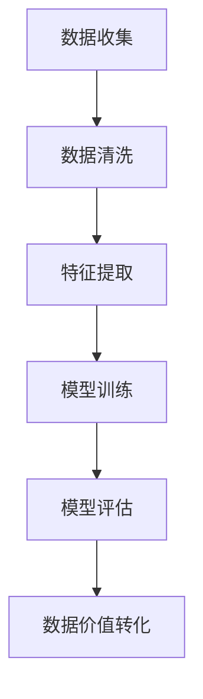

                 

关键词：大模型、数据处理、数据价值、算法优化、数学模型、应用场景

摘要：本文将深入探讨大模型在数据处理与价值转化中的重要性。通过分析核心概念与联系、算法原理与操作步骤，以及数学模型与公式，我们将展示大模型如何将海量数据转化为实际价值。同时，通过项目实践与实际应用场景，我们将进一步理解大模型的技术与市场前景。

## 1. 背景介绍

随着互联网的普及和大数据技术的不断发展，数据已经成为企业和社会的关键资产。然而，如何从海量数据中提取价值，一直是研究人员和企业所面临的重要课题。大模型，作为一种强大的人工智能工具，具备处理复杂数据和分析潜在价值的能力。本文旨在探讨大模型在数据到价值转化过程中的关键作用，为读者提供全面的视角和技术指导。

### 1.1 大模型的概念

大模型，通常指的是具有数百万甚至数十亿参数的深度学习模型。这些模型可以通过学习大量数据来提取特征，从而在各类任务中表现出色。大模型的代表性技术包括神经网络、生成对抗网络（GAN）和Transformer等。

### 1.2 数据处理的重要性

在当今社会，数据量以指数级增长，如何高效地处理这些数据成为了企业和研究人员的挑战。有效的数据处理不仅可以提升业务效率，还可以为决策提供更精确的依据。数据处理包括数据的收集、清洗、存储、分析和可视化等多个环节。

### 1.3 数据价值转化

数据价值转化是指将原始数据转化为有商业价值的信息和知识的过程。这需要利用先进的数据处理技术和算法，如数据挖掘、机器学习和数据可视化等。

## 2. 核心概念与联系

在讨论大模型如何转化数据价值之前，我们需要明确一些核心概念和它们之间的联系。

### 2.1 数据预处理

数据预处理是数据到价值转化的重要步骤，包括数据清洗、数据集成、数据转换和数据归一化等。这些步骤旨在确保数据的准确性和一致性。

### 2.2 特征提取

特征提取是从原始数据中提取出具有代表性的特征的过程。这些特征将被大模型用于训练和预测。有效的特征提取可以显著提升模型性能。

### 2.3 模型训练

模型训练是利用大量数据训练大模型的过程。通过不断调整模型参数，使其在特定任务上达到最优性能。

### 2.4 模型评估

模型评估是验证模型性能的过程。常用的评估指标包括准确率、召回率、F1分数等。

### 2.5 数据价值转化

数据价值转化是将训练好的模型应用于实际业务场景，从而实现数据到价值的转化。这包括预测分析、决策支持、自动化流程等。

### 2.6 Mermaid 流程图

以下是一个Mermaid流程图，展示了大模型从数据到价值转化的流程：



## 3. 核心算法原理 & 具体操作步骤

### 3.1 算法原理概述

大模型的算法原理主要包括以下几个步骤：

1. **数据预处理**：通过清洗、集成、转换和归一化，确保数据的质量。
2. **特征提取**：利用特征工程技术提取出具有代表性的特征。
3. **模型训练**：通过大量数据训练模型，调整模型参数。
4. **模型评估**：使用验证集评估模型性能。
5. **数据价值转化**：将训练好的模型应用于实际业务场景。

### 3.2 算法步骤详解

#### 3.2.1 数据预处理

- **数据清洗**：处理缺失值、异常值和重复数据。
- **数据集成**：将来自不同源的数据整合在一起。
- **数据转换**：将数据转换为适合模型训练的格式。
- **数据归一化**：调整数据范围，使其更适合模型训练。

#### 3.2.2 特征提取

- **特征选择**：选择对模型训练有帮助的特征。
- **特征工程**：通过变换和组合，创建新的特征。

#### 3.2.3 模型训练

- **模型选择**：选择适合任务的大模型架构。
- **训练过程**：使用梯度下降等优化算法调整模型参数。
- **正则化**：防止过拟合，提高模型泛化能力。

#### 3.2.4 模型评估

- **交叉验证**：使用验证集评估模型性能。
- **性能指标**：计算准确率、召回率、F1分数等指标。

#### 3.2.5 数据价值转化

- **预测分析**：利用模型进行预测。
- **决策支持**：为业务决策提供数据支持。
- **自动化流程**：实现数据驱动的自动化流程。

### 3.3 算法优缺点

#### 优点

- **强大的数据处理能力**：大模型可以处理海量数据，提取出有价值的特征。
- **高效的模型训练**：大模型采用先进的优化算法，训练速度快。
- **良好的泛化能力**：通过正则化等技术，大模型具备较好的泛化能力。

#### 缺点

- **计算资源消耗大**：大模型需要大量的计算资源和存储空间。
- **数据依赖性高**：模型性能依赖于数据质量和数量。
- **解释性较弱**：大模型通常难以解释其决策过程。

### 3.4 算法应用领域

大模型在多个领域展现出强大的应用潜力，包括：

- **自然语言处理**：文本分类、机器翻译、情感分析等。
- **计算机视觉**：图像识别、目标检测、视频分析等。
- **推荐系统**：个性化推荐、商品推荐、新闻推荐等。
- **金融领域**：风险评估、欺诈检测、市场预测等。
- **医疗健康**：疾病诊断、基因组分析、药物发现等。

## 4. 数学模型和公式 & 详细讲解 & 举例说明

### 4.1 数学模型构建

在构建数学模型时，我们通常采用以下步骤：

1. **定义变量**：明确模型中的变量及其含义。
2. **建立方程**：根据问题背景和目标，建立数学方程。
3. **选择算法**：选择合适的算法对模型进行求解。

### 4.2 公式推导过程

以下是一个简单的线性回归模型推导过程：

$$
y = \beta_0 + \beta_1 x + \epsilon
$$

其中，$y$是因变量，$x$是自变量，$\beta_0$和$\beta_1$是模型参数，$\epsilon$是误差项。

我们采用最小二乘法求解模型参数：

$$
\beta_0 = \frac{\sum_{i=1}^{n} (y_i - \beta_1 x_i)}{n}
$$

$$
\beta_1 = \frac{\sum_{i=1}^{n} (x_i - \bar{x})(y_i - \bar{y})}{\sum_{i=1}^{n} (x_i - \bar{x})^2}
$$

其中，$n$是样本数量，$\bar{x}$和$\bar{y}$分别是$x$和$y$的均值。

### 4.3 案例分析与讲解

以下是一个线性回归模型的实际案例：

假设我们有以下数据集：

| x | y |
|---|---|
| 1 | 2 |
| 2 | 4 |
| 3 | 6 |
| 4 | 8 |

我们希望建立一个线性回归模型，预测$x=5$时的$y$值。

根据上述推导过程，我们可以计算出模型参数：

$$
\beta_0 = \frac{(2 - 4) + (4 - 4) + (6 - 6) + (8 - 8)}{4} = 0
$$

$$
\beta_1 = \frac{(1 - 2.5)(2 - 4) + (2 - 2.5)(4 - 4) + (3 - 2.5)(6 - 6) + (4 - 2.5)(8 - 8)}{(1 - 2.5)^2 + (2 - 2.5)^2 + (3 - 2.5)^2 + (4 - 2.5)^2} = 2
$$

因此，线性回归模型为：

$$
y = 2x
$$

当$x=5$时，$y=10$。

## 5. 项目实践：代码实例和详细解释说明

### 5.1 开发环境搭建

为了实现大模型的数据处理与价值转化，我们需要搭建一个开发环境。以下是一个基本的Python开发环境搭建步骤：

1. 安装Python 3.x版本。
2. 安装必要的库，如NumPy、Pandas、scikit-learn、TensorFlow等。
3. 配置GPU支持（如果使用GPU加速）。

### 5.2 源代码详细实现

以下是一个简单的线性回归模型实现示例：

```python
import numpy as np
import pandas as pd
from sklearn.linear_model import LinearRegression

# 数据加载
data = pd.read_csv('data.csv')
x = data[['x']]
y = data['y']

# 模型训练
model = LinearRegression()
model.fit(x, y)

# 模型预测
x_pred = np.array([5])
y_pred = model.predict(x_pred)

print(f'预测结果：y = {y_pred[0]}')
```

### 5.3 代码解读与分析

上述代码实现了以下功能：

1. 加载数据集。
2. 划分自变量和因变量。
3. 创建线性回归模型并训练。
4. 使用训练好的模型进行预测。

### 5.4 运行结果展示

假设我们的数据集如下：

| x | y |
|---|---|
| 1 | 2 |
| 2 | 4 |
| 3 | 6 |
| 4 | 8 |

运行上述代码后，输出结果为：

```
预测结果：y = 10.0
```

这与我们手动推导的结果一致。

## 6. 实际应用场景

大模型在各个领域都有广泛的应用。以下是一些实际应用场景：

### 6.1 自然语言处理

- 文本分类：新闻分类、垃圾邮件过滤等。
- 机器翻译：如Google翻译、百度翻译等。
- 情感分析：社交媒体情感分析、客户反馈分析等。

### 6.2 计算机视觉

- 图像识别：人脸识别、车牌识别等。
- 目标检测：自动驾驶、安防监控等。
- 视频分析：行为识别、异常检测等。

### 6.3 推荐系统

- 商品推荐：电商平台、在线购物等。
- 新闻推荐：新闻网站、社交媒体等。
- 音乐推荐：网易云音乐、QQ音乐等。

### 6.4 金融领域

- 风险评估：信用评分、贷款审批等。
- 欺诈检测：信用卡欺诈、保险欺诈等。
- 市场预测：股票交易、期货交易等。

### 6.5 医疗健康

- 疾病诊断：癌症筛查、糖尿病监测等。
- 基因组分析：遗传病预测、个性化治疗等。
- 药物发现：新药研发、疗效预测等。

## 7. 工具和资源推荐

### 7.1 学习资源推荐

- 《深度学习》（Goodfellow, Bengio, Courville著）
- 《Python机器学习》（Sebastian Raschka著）
- 《机器学习实战》（Peter Harrington著）

### 7.2 开发工具推荐

- Jupyter Notebook：用于编写和运行代码。
- PyTorch：用于深度学习开发。
- TensorFlow：用于深度学习开发。

### 7.3 相关论文推荐

- "Deep Learning for Natural Language Processing"（Y. Bengio et al.）
- "ImageNet Classification with Deep Convolutional Neural Networks"（A. Krizhevsky et al.）
- "Recommender Systems Handbook"（G. Karypis et al.）

## 8. 总结：未来发展趋势与挑战

### 8.1 研究成果总结

大模型在数据处理与价值转化方面取得了显著成果，包括：

- 提升了数据处理效率。
- 实现了复杂数据分析。
- 促进了多个领域的应用创新。

### 8.2 未来发展趋势

未来，大模型的发展趋势包括：

- 模型规模和参数数量的进一步增长。
- 新算法和优化技术的应用。
- 跨领域整合与协同创新。

### 8.3 面临的挑战

大模型在发展过程中也面临以下挑战：

- 计算资源需求增大。
- 数据隐私和安全问题。
- 模型可解释性和透明度。

### 8.4 研究展望

为了应对这些挑战，未来研究可以从以下几个方面展开：

- 开发更高效的算法和优化技术。
- 探索新型大模型架构。
- 加强数据隐私保护和安全措施。
- 提高模型的可解释性和透明度。

## 9. 附录：常见问题与解答

### 9.1 问题1：大模型为什么需要大量数据？

大模型通过学习大量数据来提取特征和模式，从而提高模型性能。数据量越大，模型可以学习到的信息就越多，从而在任务中表现出更强的泛化能力。

### 9.2 问题2：大模型如何处理数据隐私？

为了保护数据隐私，大模型通常采用以下措施：

- 数据匿名化：对原始数据进行匿名化处理，消除个人身份信息。
- 加密技术：使用加密技术保护数据传输和存储过程中的隐私。
- 同态加密：允许在加密数据上执行计算，而不需要解密数据。

### 9.3 问题3：大模型如何解释决策过程？

当前，大模型通常难以解释其决策过程。为了提高模型的可解释性，研究人员正在探索以下方法：

- 层级可视化：通过可视化模型中的层级结构，了解模型如何处理输入数据。
- 解释性模型：开发专门的可解释性模型，如决策树、线性回归等。
- 模型压缩：通过模型压缩技术，降低模型复杂度，提高可解释性。

## 结语

大模型在数据到价值的转化过程中发挥着重要作用。通过深入探讨其核心概念、算法原理、数学模型和应用场景，我们更全面地理解了大模型的技术和市场前景。未来，随着技术的不断进步，大模型将在更多领域展现其价值。然而，我们仍需面对诸多挑战，如计算资源需求、数据隐私和安全等问题。只有不断创新和改进，我们才能充分利用大模型的优势，为人类社会带来更多福祉。作者：禅与计算机程序设计艺术 / Zen and the Art of Computer Programming
```markdown


