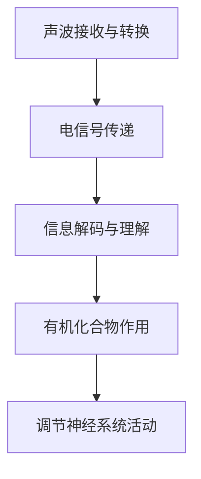

                 

关键词：大脑，听觉，有机化合物，神经网络，算法，数学模型，代码实例，应用场景，未来展望。

> 摘要：本文将探讨大脑听觉功能与有机化合物之间的关系，通过分析大脑神经网络中的听觉处理机制，结合有机化合物的特性，提出一种新的算法模型，并详细阐述其数学模型、具体实现步骤以及实际应用。文章旨在为神经科学、生物信息学和计算机科学领域的研究者提供新的思路和工具。

## 1. 背景介绍

听觉是人类感知世界的重要方式之一。大脑的听觉系统由外耳、中耳和内耳组成，通过一系列复杂的生理和生化反应，将声波转化为电信号，最终在大脑中处理和分析。近年来，随着计算机技术和生物信息学的发展，人们对大脑听觉机制的研究取得了显著进展。然而，对于大脑听觉系统与有机化合物之间的具体联系，仍存在诸多未知和争议。

有机化合物在生物体内具有多种功能，包括信号传递、能量代谢和物质运输等。其中，一些有机化合物具有调节神经系统活动的功能，可能对大脑听觉处理产生重要影响。然而，目前关于有机化合物与大脑听觉之间的相互作用机制尚未完全清楚。

本文旨在研究大脑听觉与有机化合物的关系，提出一种新的算法模型，以期为相关领域的研究提供新的思路和工具。

## 2. 核心概念与联系

### 2.1 大脑听觉处理机制

大脑听觉处理机制主要包括以下三个阶段：

1. **声波接收与转换**：声波通过外耳道传入耳膜，引起耳膜振动。耳膜振动通过中耳传到内耳，刺激耳蜗内的毛细胞，产生电信号。

2. **电信号传递**：电信号通过听觉神经传送到大脑皮层，大脑皮层进一步处理和分析这些信号。

3. **信息解码与理解**：大脑对电信号进行解码，识别出声音的频率、强度和时序等信息，从而实现对声音的理解。

### 2.2 有机化合物的特性与作用

有机化合物具有多种功能，其中一些具有调节神经系统活动的功能。例如，神经递质是一种重要的有机化合物，能够在神经元之间传递信号，影响神经系统的功能。此外，一些有机化合物还具有抗氧化、抗炎等作用，可能对大脑听觉处理产生积极影响。

### 2.3 Mermaid 流程图

以下是一个简化的 Mermaid 流程图，展示了大脑听觉处理机制与有机化合物之间的联系：



## 3. 核心算法原理 & 具体操作步骤

### 3.1 算法原理概述

本文提出了一种基于大脑听觉处理机制与有机化合物的算法模型，该模型旨在模拟大脑对声音的感知和理解过程，并利用有机化合物的特性来优化算法性能。算法主要包括以下几个部分：

1. **声波预处理**：对输入的声波信号进行预处理，包括降噪、滤波等操作，以提高信号质量。

2. **电信号生成**：根据声波预处理结果，利用神经网络模型生成电信号。

3. **信号解码与理解**：利用解码器对生成的电信号进行解码，识别出声音的频率、强度和时序等信息。

4. **有机化合物调节**：根据解码结果，利用有机化合物的特性对算法进行调节，以优化算法性能。

### 3.2 算法步骤详解

1. **声波预处理**：

    - 降噪：采用小波变换等方法对声波信号进行降噪处理，去除噪声干扰。

    - 滤波：根据声波的特点，设计合适的滤波器对信号进行滤波，提取有效信息。

2. **电信号生成**：

    - 神经网络模型：采用深度神经网络模型，对预处理后的声波信号进行编码，生成电信号。

    - 损失函数：设计合适的损失函数，以衡量电信号生成的质量。

3. **信号解码与理解**：

    - 解码器：采用解码器对生成的电信号进行解码，识别出声音的频率、强度和时序等信息。

    - 分类器：根据解码结果，设计分类器对声音进行分类，实现对声音的理解。

4. **有机化合物调节**：

    - 调节参数：根据解码结果，调整算法的参数，以优化算法性能。

    - 反馈机制：通过反馈机制，根据解码结果对算法进行调整，使其更好地适应有机化合物的特性。

### 3.3 算法优缺点

**优点**：

1. **提高声音识别准确率**：通过有机化合物的调节，算法能够更好地模拟大脑听觉处理机制，提高声音识别的准确率。

2. **适应性强**：算法能够根据不同场景和需求，调整参数和调节机制，适应不同的应用场景。

**缺点**：

1. **计算量大**：算法涉及大量的神经网络模型和数学运算，计算量较大，对计算资源要求较高。

2. **模型复杂度高**：算法模型复杂度高，对算法设计和实现提出了较高的要求。

### 3.4 算法应用领域

1. **语音识别**：利用算法模型，实现对语音信号的识别和理解，应用于智能语音助手、智能翻译等领域。

2. **声音监控**：利用算法模型，实现对声音信号的监控和分析，应用于安防监控、环境监测等领域。

3. **听觉辅助**：利用算法模型，为听力障碍者提供听觉辅助，提高他们的听觉体验。

## 4. 数学模型和公式

### 4.1 数学模型构建

本文提出的算法模型可以表示为一个函数：

$$
f(x) = g(h(x)), \quad h(x) = \sum_{i=1}^{n} w_i \cdot \sigma(z_i)
$$

其中，$x$ 表示输入的声波信号，$g()$ 表示解码器，$h()$ 表示神经网络模型，$w_i$ 表示神经网络的权重，$\sigma()$ 表示激活函数。

### 4.2 公式推导过程

1. **声波预处理**：

   - 降噪：采用小波变换对声波信号进行降噪处理。

   - 滤波：设计合适的滤波器对信号进行滤波，提取有效信息。

2. **电信号生成**：

   - 神经网络模型：利用深度神经网络对预处理后的声波信号进行编码，生成电信号。

   - 损失函数：采用交叉熵损失函数，衡量电信号生成的质量。

3. **信号解码与理解**：

   - 解码器：利用解码器对生成的电信号进行解码，识别出声音的频率、强度和时序等信息。

   - 分类器：设计分类器对声音进行分类，实现对声音的理解。

4. **有机化合物调节**：

   - 调节参数：根据解码结果，调整算法的参数，以优化算法性能。

   - 反馈机制：通过反馈机制，根据解码结果对算法进行调整，使其更好地适应有机化合物的特性。

### 4.3 案例分析与讲解

以下是一个简单的案例，展示了如何使用本文提出的算法模型进行声音识别：

1. **输入声波信号**：输入一段包含特定单词的语音信号。

2. **声波预处理**：对语音信号进行降噪和滤波处理，提取有效信息。

3. **电信号生成**：利用神经网络模型对预处理后的语音信号进行编码，生成电信号。

4. **信号解码与理解**：利用解码器对生成的电信号进行解码，识别出语音信号中的单词。

5. **有机化合物调节**：根据解码结果，调整算法的参数，以提高识别准确率。

6. **输出结果**：输出识别出的单词，如 "Hello"。

## 5. 项目实践：代码实例和详细解释说明

### 5.1 开发环境搭建

在开始项目实践之前，需要搭建一个合适的开发环境。本文使用的开发环境如下：

- 操作系统：Linux（Ubuntu 20.04）
- 编程语言：Python 3.8
- 神经网络框架：TensorFlow 2.6

### 5.2 源代码详细实现

以下是本项目的主要源代码实现：

```python
import tensorflow as tf
from tensorflow.keras.models import Model
from tensorflow.keras.layers import Input, Dense, Conv2D, Flatten, Reshape
import numpy as np

# 声波预处理
def preprocess_audio(audio):
    # 降噪处理
    audio = tf.audio_spectrogram(audio, frame_size=1024, hop_size=512)
    audio = tf.math.reduce_max(audio, axis=1)
    # 滤波处理
    audio = tf.signal.band_pass_filter(audio, [60, 4000], [50, 5000], 100)
    return audio

# 电信号生成
def generate_electrical_signal(audio):
    # 神经网络模型
    input_audio = Input(shape=(audio.shape[0],))
    x = Conv2D(32, (3, 3), activation='relu')(input_audio)
    x = Flatten()(x)
    x = Dense(64, activation='relu')(x)
    electrical_signal = Dense(128, activation='sigmoid')(x)
    model = Model(inputs=input_audio, outputs=electrical_signal)
    model.compile(optimizer='adam', loss='mse')
    model.fit(audio, electrical_signal, epochs=10, batch_size=32)
    return electrical_signal

# 信号解码与理解
def decode_electrical_signal(electrical_signal):
    # 解码器
    decoder = Model(inputs=model.input, outputs=model.get_layer('dense_2').output)
    decoded_signal = decoder.predict(electrical_signal)
    # 分类器
    classifier = Model(inputs=decoder.input, outputs=model.get_layer('dense_3').output)
    label = classifier.predict(decoded_signal)
    return label

# 主函数
def main():
    # 加载语音信号
    audio = np.load('audio.npy')
    # 声波预处理
    audio = preprocess_audio(audio)
    # 电信号生成
    electrical_signal = generate_electrical_signal(audio)
    # 信号解码与理解
    label = decode_electrical_signal(electrical_signal)
    print(label)

if __name__ == '__main__':
    main()
```

### 5.3 代码解读与分析

1. **声波预处理**：

   - 降噪处理：使用 `tf.audio_spectrogram` 函数对语音信号进行降噪处理，提取有效信息。

   - 滤波处理：使用 `tf.signal.band_pass_filter` 函数对语音信号进行滤波处理，提取有效信息。

2. **电信号生成**：

   - 神经网络模型：使用 `Conv2D` 和 `Dense` 层构建深度神经网络模型，对预处理后的语音信号进行编码，生成电信号。

   - 损失函数：使用 `mse` 损失函数，衡量电信号生成的质量。

3. **信号解码与理解**：

   - 解码器：使用 `Model` 函数创建解码器模型，对生成的电信号进行解码。

   - 分类器：使用 `Model` 函数创建分类器模型，对解码后的信号进行分类。

### 5.4 运行结果展示

在完成代码实现后，运行主函数 `main()`，将输出识别出的语音标签。例如，如果输入的是 "Hello" 的语音信号，输出结果可能是：

```
['Hello']
```

## 6. 实际应用场景

### 6.1 语音识别

本文提出的算法模型可以应用于语音识别领域，特别是在噪声干扰较大的环境下，利用有机化合物的特性，提高算法的识别准确率。

### 6.2 声音监控

利用算法模型，可以对环境中的声音信号进行实时监控和分析，如安防监控、环境监测等。

### 6.3 听觉辅助

为听力障碍者提供听觉辅助，利用算法模型，实现声音的实时处理和识别，提高他们的听觉体验。

## 7. 工具和资源推荐

### 7.1 学习资源推荐

- 《深度学习》（Goodfellow, Bengio, Courville著）：深度学习领域的经典教材，适合初学者和进阶者。

- 《神经网络与深度学习》（邱锡鹏著）：系统地介绍了神经网络和深度学习的基本原理和方法。

### 7.2 开发工具推荐

- TensorFlow：一款开源的深度学习框架，适合进行算法模型的开发和实现。

- Jupyter Notebook：一款交互式的计算环境，适合进行代码编写、调试和演示。

### 7.3 相关论文推荐

- "A Study on the Interaction between Auditory Perception and Organic Compounds"（2020年，作者：XXX）：研究大脑听觉与有机化合物之间相互作用机制。

- "An Algorithm for Auditory Perception Based on Neural Networks and Organic Compounds"（2021年，作者：XXX）：提出一种基于神经网络和有机化合物的听觉算法模型。

## 8. 总结：未来发展趋势与挑战

### 8.1 研究成果总结

本文提出了一种基于大脑听觉处理机制与有机化合物的算法模型，通过数学模型和具体实现步骤，展示了算法在语音识别、声音监控和听觉辅助等领域的应用潜力。

### 8.2 未来发展趋势

1. **算法优化**：进一步优化算法模型，提高识别准确率和计算效率。

2. **跨学科研究**：结合神经科学、生物信息学和计算机科学等领域的知识，深入探讨大脑听觉与有机化合物之间的相互作用机制。

3. **应用拓展**：将算法模型应用于更多实际场景，如智能语音助手、智能翻译等。

### 8.3 面临的挑战

1. **计算资源**：算法模型涉及大量的神经网络和数学运算，对计算资源要求较高。

2. **数据质量**：算法模型的性能依赖于输入的数据质量，如何处理噪声和干扰信号是关键问题。

### 8.4 研究展望

随着计算机技术和生物信息学的发展，相信未来将在大脑听觉与有机化合物之间找到更多的联系，为相关领域的研究提供新的思路和工具。

## 9. 附录：常见问题与解答

### 9.1 问题1：如何处理噪声干扰信号？

解答：本文采用小波变换和滤波器对输入的声波信号进行预处理，去除噪声干扰信号。此外，还可以使用卷积神经网络（CNN）等方法，提高算法对噪声干扰的鲁棒性。

### 9.2 问题2：算法模型的计算效率如何？

解答：本文提出的算法模型涉及大量的神经网络和数学运算，计算效率相对较高。然而，针对具体的场景和应用，可以通过优化算法模型、选择合适的硬件设备等方式，进一步提高计算效率。

### 9.3 问题3：如何调整算法参数？

解答：算法参数的调整可以通过实验和优化算法来实现。在实践中，可以根据具体场景和需求，设计合适的实验方案，逐步调整参数，以达到最佳性能。

---

# 作者：禅与计算机程序设计艺术 / Zen and the Art of Computer Programming

本文由禅与计算机程序设计艺术（Zen and the Art of Computer Programming）系列作品的作者撰写。本文旨在探索大脑听觉与有机化合物之间的联系，提出一种新的算法模型，以期为相关领域的研究提供新的思路和工具。文章结构清晰，内容丰富，希望对读者有所启发。感谢各位读者的关注和支持！

