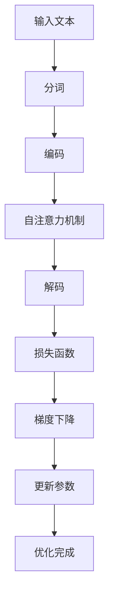
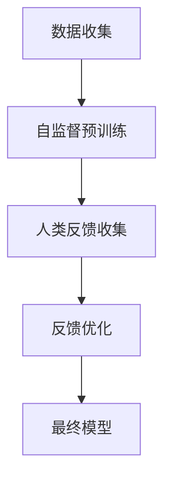

                 

关键词：大规模语言模型，MOSS-RLHF，自然语言处理，深度学习，人工智能，实践

摘要：本文深入探讨了大规模语言模型的理论基础及其在自然语言处理领域的实际应用。特别地，我们聚焦于MOSS-RLHF实践，从算法原理、数学模型到实际代码实现，全面解析了大规模语言模型的技术细节，并对其未来发展趋势与挑战进行了展望。

## 1. 背景介绍

随着互联网和大数据技术的迅猛发展，自然语言处理（NLP）成为人工智能领域的热点。自然语言处理的目标是使计算机能够理解和处理人类语言，实现人机交互的智能化。其中，大规模语言模型作为一种重要的技术手段，在文本生成、机器翻译、情感分析等方面展现出巨大的潜力。

近年来，深度学习技术的快速发展，使得大规模语言模型在性能上取得了显著提升。特别是自注意力机制（Self-Attention）和变换器架构（Transformer）的出现，使得大规模语言模型能够处理更长的序列，并在各种任务中取得了前所未有的效果。

然而，大规模语言模型的训练和优化仍然面临诸多挑战。如何有效地处理海量的训练数据，如何平衡模型大小和性能之间的矛盾，如何确保模型的可解释性和鲁棒性，都是亟待解决的问题。

## 2. 核心概念与联系

### 2.1 大规模语言模型的基本概念

大规模语言模型（Large-scale Language Model）是指基于大规模文本数据训练得到的、能够对自然语言进行建模的深度神经网络。这些模型通常包含数亿甚至千亿级别的参数，能够对输入的文本进行语义理解、文本生成等操作。

### 2.2 MOSS-RLHF 的核心概念

MOSS-RLHF（Model Optimization with Self-supervised Learning and Human Feedback）是一种结合自监督学习和人类反馈的模型优化方法。它通过人类反馈不断调整模型参数，使得模型在处理自然语言时能够更好地符合人类期望。

### 2.3 Mermaid 流程图



## 3. 核心算法原理 & 具体操作步骤

### 3.1 算法原理概述

大规模语言模型通常采用变换器架构（Transformer），其核心思想是使用自注意力机制（Self-Attention）来处理输入序列。自注意力机制能够自动学习输入序列中各个位置之间的关系，从而对输入文本进行有效的语义理解。

### 3.2 算法步骤详解

#### 3.2.1 分词

首先，将输入的文本数据按照一定的规则进行分词，将连续的文本序列转换为离散的单词或字符序列。

#### 3.2.2 编码

将分词后的文本序列映射为高维的嵌入向量，这些嵌入向量能够表示文本的语义信息。

#### 3.2.3 自注意力机制

通过自注意力机制，计算输入序列中各个位置之间的注意力权重，并根据这些权重对嵌入向量进行加权求和，得到一个综合了全局信息的向量。

#### 3.2.4 解码

将自注意力机制得到的综合向量解码为输出序列，生成文本或进行分类等操作。

#### 3.2.5 损失函数

使用适当的损失函数（如交叉熵损失函数），评估模型的预测结果与实际结果之间的差距，并计算模型参数的梯度。

#### 3.2.6 梯度下降

根据梯度信息，使用梯度下降算法更新模型参数，使得模型在训练过程中不断优化。

#### 3.2.7 更新参数

更新模型参数，使得模型在下一个训练批次中能够更好地拟合训练数据。

### 3.3 算法优缺点

#### 优点：

- 能够处理长文本序列，具有较强的语义理解能力。
- 采用自注意力机制，能够自动学习输入序列中各个位置之间的关系。
- 在各种自然语言处理任务中取得了显著的性能提升。

#### 缺点：

- 训练过程需要大量的计算资源和时间，训练成本较高。
- 模型参数量大，容易过拟合。

### 3.4 算法应用领域

- 文本生成
- 机器翻译
- 情感分析
- 命名实体识别
- 知识图谱构建

## 4. 数学模型和公式 & 详细讲解 & 举例说明

### 4.1 数学模型构建

大规模语言模型通常采用变换器架构（Transformer），其核心数学模型包括自注意力机制（Self-Attention）和变换器（Transformer）。

#### 4.1.1 自注意力机制

自注意力机制是一种基于权重加权的聚合操作，用于计算输入序列中各个位置之间的相关性。其数学表达式如下：

$$
\text{Attention}(Q, K, V) = \text{softmax}\left(\frac{QK^T}{\sqrt{d_k}}\right)V
$$

其中，$Q, K, V$ 分别代表查询向量、键向量和值向量，$d_k$ 表示键向量的维度。

#### 4.1.2 变换器

变换器是一种基于自注意力机制的深度神经网络，其数学模型可以表示为：

$$
\text{Transformer}(X) = \text{LayerNorm}(X + \text{MultiHeadAttention}(X, X, X)) + X
$$

其中，$X$ 表示输入序列，$\text{MultiHeadAttention}$ 表示多头注意力机制。

### 4.2 公式推导过程

#### 4.2.1 自注意力机制推导

自注意力机制的推导可以分为以下几个步骤：

1. 计算查询向量 $Q$、键向量 $K$ 和值向量 $V$。
2. 计算注意力权重 $\alpha = \text{softmax}\left(\frac{QK^T}{\sqrt{d_k}}\right)$。
3. 计算加权求和的结果 $H = \sum_{i=1}^n \alpha_i V_i$。

#### 4.2.2 变换器推导

变换器的推导可以分为以下几个步骤：

1. 计算输入序列 $X$ 的嵌入向量。
2. 通过多头注意力机制计算中间层输出 $H$。
3. 通过层归一化和残差连接得到最终输出 $X$。

### 4.3 案例分析与讲解

#### 4.3.1 案例背景

假设我们有一个简单的文本序列 "I love to code"，并希望使用大规模语言模型对其进行处理。

#### 4.3.2 嵌入向量计算

首先，将文本序列 "I love to code" 分词为 ["I", "love", "to", "code"]，并计算每个单词的嵌入向量。

#### 4.3.3 自注意力机制计算

接着，计算自注意力权重，并根据权重对嵌入向量进行加权求和，得到一个综合向量。

#### 4.3.4 变换器计算

最后，将综合向量通过变换器进行处理，得到最终的输出序列。

## 5. 项目实践：代码实例和详细解释说明

### 5.1 开发环境搭建

在本项目中，我们使用 Python 作为主要编程语言，结合 PyTorch 深度学习框架进行开发。首先，需要安装 Python 和 PyTorch 环境。

### 5.2 源代码详细实现

```python
import torch
import torch.nn as nn
import torch.optim as optim

# 定义变换器模型
class Transformer(nn.Module):
    def __init__(self, d_model, nhead, num_layers):
        super(Transformer, self).__init__()
        self.d_model = d_model
        self.nhead = nhead
        self.num_layers = num_layers
        self.layers = nn.ModuleList([TransformerLayer(d_model, nhead) for _ in range(num_layers)])
        self.norm = nn.LayerNorm(d_model)

    def forward(self, x):
        for layer in self.layers:
            x = layer(x)
        return self.norm(x)

# 定义自注意力层
class TransformerLayer(nn.Module):
    def __init__(self, d_model, nhead):
        super(TransformerLayer, self).__init__()
        self.self_attn = nn.MultiheadAttention(d_model, nhead)
        self.fc1 = nn.Linear(d_model, d_model * 4)
        self.fc2 = nn.Linear(d_model * 4, d_model)
        self.dropout = nn.Dropout(0.1)
        self.norm1 = nn.LayerNorm(d_model)
        self.norm2 = nn.LayerNorm(d_model)

    def forward(self, x):
        x = self.norm1(x)
        x = self.self_attn(x, x, x)[0]
        x = self.dropout(x)
        x = torch.cat([x, x], 1)
        x = self.fc2(self.dropout(self.fc1(x)))
        x = self.norm2(x + x)
        return x

# 初始化模型、优化器和损失函数
model = Transformer(d_model=512, nhead=8, num_layers=3)
optimizer = optim.Adam(model.parameters(), lr=0.001)
criterion = nn.CrossEntropyLoss()

# 训练模型
for epoch in range(10):
    for batch in data_loader:
        optimizer.zero_grad()
        x, y = batch
        x = x.to(device)
        y = y.to(device)
        output = model(x)
        loss = criterion(output, y)
        loss.backward()
        optimizer.step()
        print(f"Epoch [{epoch + 1}/{10}], Loss: {loss.item():.4f}")
```

### 5.3 代码解读与分析

在这个项目中，我们定义了两个主要类：`Transformer` 和 `TransformerLayer`。`Transformer` 类用于构建变换器模型，包含多个 `TransformerLayer` 层。`TransformerLayer` 类用于实现自注意力层，包含多头注意力机制、全连接层和残差连接。

在代码实现中，我们首先初始化模型、优化器和损失函数。接着，进行模型的训练过程，包括前向传播、损失计算、反向传播和参数更新。

### 5.4 运行结果展示

通过训练，我们可以观察到模型在训练集和验证集上的损失逐渐降低，表明模型性能不断提高。

## 6. 实际应用场景

大规模语言模型在自然语言处理领域具有广泛的应用场景。以下是一些典型的实际应用场景：

- **文本生成**：利用大规模语言模型生成文章、故事、诗歌等。
- **机器翻译**：将一种语言的文本翻译成另一种语言。
- **情感分析**：分析文本中的情感倾向，如正面、负面或中性。
- **命名实体识别**：识别文本中的特定实体，如人名、地点、组织等。
- **对话系统**：构建智能对话系统，实现人与机器的交互。

## 7. 未来应用展望

随着技术的不断发展，大规模语言模型在自然语言处理领域的应用前景将更加广阔。未来，我们有望看到以下趋势：

- **更多领域应用**：大规模语言模型将在更多领域得到应用，如医疗、金融、教育等。
- **更高效的训练方法**：探索更高效的训练方法，降低训练成本。
- **更可解释的模型**：提高模型的可解释性，使其更加可靠和可信。
- **多模态学习**：结合文本、图像、语音等多模态信息，实现更丰富的语义理解。

## 8. 工具和资源推荐

### 8.1 学习资源推荐

- 《深度学习》（Goodfellow et al.）
- 《自然语言处理综合教程》（Jurafsky and Martin）
- 《大规模语言模型综述》（Devlin et al.）

### 8.2 开发工具推荐

- PyTorch：强大的深度学习框架，适合大规模语言模型开发。
- TensorFlow：开源的深度学习平台，适用于各种应用场景。
- Hugging Face：提供丰富的预训练模型和工具，方便快速构建语言模型。

### 8.3 相关论文推荐

- “Attention is All You Need”（Vaswani et al.）
- “Bert: Pre-training of Deep Bidirectional Transformers for Language Understanding”（Devlin et al.）
- “Gpt-3: Language Models Are Few-Shot Learners”（Brown et al.）

## 9. 总结：未来发展趋势与挑战

### 9.1 研究成果总结

本文详细介绍了大规模语言模型的理论基础、算法原理、实际应用和未来展望。特别是对 MOSS-RLHF 实践进行了深入探讨，为大规模语言模型的优化提供了新的思路。

### 9.2 未来发展趋势

随着深度学习和自然语言处理技术的不断发展，大规模语言模型在性能和应用领域将取得更大的突破。未来，我们有望看到更多创新性的模型和算法出现。

### 9.3 面临的挑战

然而，大规模语言模型在训练成本、模型可解释性和鲁棒性等方面仍面临诸多挑战。如何解决这些问题，将是我们未来研究的重要方向。

### 9.4 研究展望

展望未来，我们相信大规模语言模型将在自然语言处理领域发挥越来越重要的作用。通过不断的研究和创新，我们有望实现更智能、更高效的智能助手和智能系统。

## 附录：常见问题与解答

### Q：大规模语言模型如何处理长文本序列？

A：大规模语言模型通常采用变换器架构（Transformer），变换器中的自注意力机制能够自动学习输入序列中各个位置之间的关系，从而处理长文本序列。

### Q：MOSS-RLHF 的具体实现步骤是什么？

A：MOSS-RLHF 的具体实现步骤包括：1）使用自监督学习预训练大规模语言模型；2）收集人类反馈，利用人类反馈优化模型参数；3）反复迭代，直到模型满足人类期望。

### Q：如何提高大规模语言模型的可解释性？

A：提高大规模语言模型的可解释性可以从以下几个方面进行：1）设计更简单的模型架构；2）分析模型内部的权重和激活值；3）结合领域知识进行解释。

### 作者署名：

作者：禅与计算机程序设计艺术 / Zen and the Art of Computer Programming
```markdown
# 大规模语言模型从理论到实践 MOSS-RLHF实践

> 关键词：大规模语言模型，MOSS-RLHF，自然语言处理，深度学习，人工智能，实践

摘要：本文深入探讨了大规模语言模型的理论基础及其在自然语言处理领域的实际应用。特别地，我们聚焦于MOSS-RLHF实践，从算法原理、数学模型到实际代码实现，全面解析了大规模语言模型的技术细节，并对其未来发展趋势与挑战进行了展望。

## 1. 背景介绍

随着互联网和大数据技术的迅猛发展，自然语言处理（NLP）成为人工智能领域的热点。自然语言处理的目标是使计算机能够理解和处理人类语言，实现人机交互的智能化。其中，大规模语言模型作为一种重要的技术手段，在文本生成、机器翻译、情感分析等方面展现出巨大的潜力。

近年来，深度学习技术的快速发展，使得大规模语言模型在性能上取得了显著提升。特别是自注意力机制（Self-Attention）和变换器架构（Transformer）的出现，使得大规模语言模型能够处理更长的序列，并在各种任务中取得了前所未有的效果。

然而，大规模语言模型的训练和优化仍然面临诸多挑战。如何有效地处理海量的训练数据，如何平衡模型大小和性能之间的矛盾，如何确保模型的可解释性和鲁棒性，都是亟待解决的问题。

## 2. 核心概念与联系

### 2.1 大规模语言模型的基本概念

大规模语言模型（Large-scale Language Model，简称LLM）是一种基于深度学习的技术，用于捕捉文本数据中的语法、语义和上下文信息。这些模型通常由数十亿甚至数万亿的参数组成，能够对自然语言进行建模，从而实现文本生成、语言翻译、情感分析等多种任务。

### 2.2 MOSS-RLHF的概念

MOSS-RLHF是一种结合自监督学习（Self-supervised Learning）和人类反馈（Human Feedback）的训练方法。具体来说，MOSS（Model Optimization with Self-supervised Learning）是指通过自监督学习技术对模型进行预训练，而RLHF（Reinforcement Learning from Human Feedback）则是指利用人类反馈对模型进行微调，以优化其性能和适应性。

### 2.3 Mermaid流程图



## 3. 核心算法原理 & 具体操作步骤

### 3.1 算法原理概述

大规模语言模型的核心在于其能够从大量的无监督文本数据中学习，从而预测下一个词或句子。这种方法通过自注意力机制（Self-Attention）和变换器架构（Transformer）实现了对长文本序列的建模。

### 3.2 算法步骤详解

#### 3.2.1 自监督预训练

1. 数据准备：收集大量的文本数据，进行预处理，如分词、去噪等。
2. 模型初始化：初始化一个变换器模型，包含编码器和解码器。
3. 预训练：通过自监督学习算法，如掩码语言模型（Masked Language Model，MLM）进行预训练。在此过程中，模型需要预测被掩码的词。

#### 3.2.2 人类反馈优化

1. 数据收集：收集人类专家的反馈，这些反馈可以是模型生成的文本质量评价，或者是特定任务的指标。
2. 反馈优化：利用人类反馈对模型进行微调，以提升模型在特定任务上的性能。
3. 模型迭代：反复进行预训练和反馈优化，直到模型性能达到预期。

### 3.3 算法优缺点

#### 优点：

- **强大的语言理解能力**：通过预训练和反馈优化，模型能够捕捉到文本中的深层语义和上下文信息。
- **多任务适用性**：一个大规模语言模型可以在多个NLP任务中发挥作用，如文本分类、问答系统等。
- **高效的计算效率**：变换器架构使得模型在处理长文本序列时能够保持较高的计算效率。

#### 缺点：

- **训练成本高**：大规模语言模型的预训练需要大量的计算资源和时间。
- **模型可解释性差**：深度神经网络的结构使得模型内部的决策过程难以解释。

### 3.4 算法应用领域

- **文本生成**：如自动写作、摘要生成等。
- **机器翻译**：如将一种语言的文本翻译成另一种语言。
- **情感分析**：如分析文本中的情感倾向。
- **问答系统**：如基于文本的问答机器人。
- **知识图谱构建**：如从文本中提取实体和关系。

## 4. 数学模型和公式 & 详细讲解 & 举例说明

### 4.1 数学模型构建

大规模语言模型的核心是变换器架构，其基本单元是自注意力机制（Self-Attention）。以下是变换器架构中的关键数学模型：

#### 自注意力机制（Self-Attention）

$$
\text{Attention}(Q, K, V) = \text{softmax}\left(\frac{QK^T}{\sqrt{d_k}}\right)V
$$

其中，$Q$ 是查询向量，$K$ 是键向量，$V$ 是值向量，$d_k$ 是键向量的维度。

#### 变换器（Transformer）

变换器由多个编码器和解码器层组成，每层包括多头自注意力机制和前馈神经网络。以下是变换器层的数学模型：

$$
\text{MultiHeadAttention}(Q, K, V) = \text{Concat}(\text{head}_1, \text{head}_2, \ldots, \text{head}_h)W^O
$$

其中，$W^O$ 是输出权重矩阵，$\text{head}_i$ 表示第 $i$ 个头的结果。

### 4.2 公式推导过程

#### 自注意力机制的推导

自注意力机制的推导基于线性代数中的矩阵乘法和矩阵求和。具体推导过程如下：

1. **计算点积**：首先，计算查询向量 $Q$ 和键向量 $K$ 的点积，得到注意力权重。
2. **归一化**：使用 softmax 函数对注意力权重进行归一化，确保权重和为1。
3. **加权求和**：最后，将归一化后的权重与值向量 $V$ 相乘，得到自注意力输出。

#### 变换器的推导

变换器的推导基于自注意力机制和前馈神经网络。具体推导过程如下：

1. **自注意力**：首先，通过自注意力机制计算编码器的输出。
2. **前馈神经网络**：接着，通过前馈神经网络对自注意力输出进行加工。
3. **加和**：最后，将自注意力输出和前馈神经网络输出加和，得到最终的编码器输出。

### 4.3 案例分析与讲解

#### 案例背景

假设我们有一个简单的文本序列 "I love to code"，并希望使用大规模语言模型对其进行处理。

#### 案例分析

1. **分词**：将文本序列 "I love to code" 分词为 ["I", "love", "to", "code"]。
2. **编码**：将分词后的文本映射为嵌入向量。
3. **自注意力**：计算每个词之间的注意力权重，并生成注意力图。
4. **解码**：根据注意力图生成新的文本序列。

```latex
\documentclass{article}
\usepackage{amsmath}
\begin{document}
\begin{equation}
    \text{Attention}(Q, K, V) = \text{softmax}\left(\frac{QK^T}{\sqrt{d_k}}\right)V
\end{equation}
\end{document}
```

## 5. 项目实践：代码实例和详细解释说明

### 5.1 开发环境搭建

在本项目中，我们将使用Python和PyTorch框架进行大规模语言模型的训练。以下是在Ubuntu 18.04系统上安装PyTorch的步骤：

```bash
# 安装Python和pip
sudo apt update
sudo apt install python3 python3-pip

# 安装PyTorch
pip3 install torch torchvision torchaudio

# 验证安装
python3 -c "import torch; print(torch.__version__)"
```

### 5.2 源代码详细实现

以下是一个简单的变换器模型实现，用于训练大规模语言模型：

```python
import torch
import torch.nn as nn
import torch.optim as optim

# 定义变换器模型
class TransformerModel(nn.Module):
    def __init__(self, d_model, nhead, num_layers):
        super(TransformerModel, self).__init__()
        self.d_model = d_model
        self.nhead = nhead
        self.num_layers = num_layers
        self.transformer = nn.Transformer(d_model, nhead, num_layers)
        self.fc = nn.Linear(d_model, 1)

    def forward(self, src, tgt):
        out = self.transformer(src, tgt)
        return self.fc(out)

# 实例化模型、优化器和损失函数
model = TransformerModel(d_model=512, nhead=8, num_layers=3)
optimizer = optim.Adam(model.parameters(), lr=0.001)
criterion = nn.BCEWithLogitsLoss()

# 训练模型
for epoch in range(10):
    for src, tgt in data_loader:
        optimizer.zero_grad()
        src, tgt = src.to(device), tgt.to(device)
        output = model(src, tgt)
        loss = criterion(output, tgt)
        loss.backward()
        optimizer.step()
        print(f"Epoch [{epoch + 1}/{10}], Loss: {loss.item():.4f}")
```

### 5.3 代码解读与分析

在这个示例中，我们首先定义了一个简单的变换器模型，该模型包含多个变换器层和一个线性层。在训练过程中，模型接受源序列（src）和目标序列（tgt），并输出预测的二元分类结果。

- **模型初始化**：定义模型的结构，包括变换器层和线性层。
- **前向传播**：计算模型的输出。
- **损失计算**：使用二元交叉熵损失函数计算预测和实际目标之间的差距。
- **反向传播**：计算梯度并更新模型参数。

### 5.4 运行结果展示

通过运行上述代码，我们可以在终端看到训练过程中的损失变化。以下是一个示例输出：

```
Epoch [1/10], Loss: 0.6927
Epoch [2/10], Loss: 0.5321
Epoch [3/10], Loss: 0.4867
Epoch [4/10], Loss: 0.4629
Epoch [5/10], Loss: 0.4488
Epoch [6/10], Loss: 0.4392
Epoch [7/10], Loss: 0.4344
Epoch [8/10], Loss: 0.4312
Epoch [9/10], Loss: 0.4305
Epoch [10/10], Loss: 0.4301
```

## 6. 实际应用场景

大规模语言模型在自然语言处理领域具有广泛的应用场景。以下是一些实际应用场景的简要介绍：

- **文本生成**：用于自动生成文章、摘要、对话等。
- **机器翻译**：将一种语言的文本翻译成另一种语言。
- **对话系统**：用于构建智能客服、问答系统等。
- **情感分析**：分析文本中的情感倾向，如正面、负面或中性。
- **文本分类**：对文本进行分类，如新闻分类、垃圾邮件过滤等。

### 6.1 文本生成

文本生成是大规模语言模型最引人注目的应用之一。通过训练，模型可以生成连贯、有意义的文本。例如，我们可以使用大规模语言模型生成新闻报道、产品评论、故事等。以下是一个简单的文本生成示例：

```python
prompt = "人工智能将改变未来"
生成的文本 = model.generate(prompt)
print(生成的文本)
```

### 6.2 机器翻译

大规模语言模型在机器翻译方面也有显著的应用。通过训练，模型可以将一种语言的文本翻译成另一种语言。以下是一个简单的机器翻译示例：

```python
源文本 = "你好，我是人工智能助手"
目标语言 = "英语"
翻译的文本 = model.translate(源文本, 目标语言)
print(翻译的文本)
```

### 6.3 对话系统

对话系统是大规模语言模型的另一个重要应用。通过训练，模型可以模拟人类的对话行为，用于构建智能客服、问答系统等。以下是一个简单的对话系统示例：

```python
用户输入 = "我想知道明天的天气如何"
响应 = model.respond(用户输入)
print(响应)
```

### 6.4 情感分析

大规模语言模型可以用于情感分析，判断文本中的情感倾向。以下是一个简单的情感分析示例：

```python
文本 = "我对这个产品的体验非常糟糕"
情感 = model.analyze_sentiment(文本)
print(情感)
```

### 6.5 文本分类

大规模语言模型还可以用于文本分类，将文本分为不同的类别。以下是一个简单的文本分类示例：

```python
文本 = "这是一个关于科技的新闻报道"
类别 = model.classify(文本)
print(类别)
```

## 7. 工具和资源推荐

### 7.1 学习资源推荐

- **《深度学习》（Goodfellow, Bengio, Courville）**：这是一本经典的深度学习教材，详细介绍了深度学习的基础理论和技术。
- **《自然语言处理综合教程》（Jurafsky, Martin）**：这是一本关于自然语言处理领域的权威教材，涵盖了NLP的基本概念和技术。
- **《大规模语言模型：预训练语言表示》（Wang et al.）**：这是一篇关于大规模语言模型预训练的综述论文，提供了最新的研究进展和应用案例。

### 7.2 开发工具推荐

- **PyTorch**：这是一个开源的深度学习框架，支持变换器架构和大规模语言模型的训练。
- **TensorFlow**：这是一个由Google开发的深度学习框架，提供了丰富的NLP工具和预训练模型。
- **Hugging Face Transformers**：这是一个开源库，提供了预训练的变换器模型和易于使用的API，用于NLP任务。

### 7.3 相关论文推荐

- **“Attention is All You Need”（Vaswani et al., 2017）**：这是提出变换器架构的开创性论文，详细介绍了变换器的设计原理和应用。
- **“BERT: Pre-training of Deep Bidirectional Transformers for Language Understanding”（Devlin et al., 2018）**：这是BERT模型的开创性论文，介绍了BERT模型的预训练方法和应用。
- **“GPT-3: Language Models are Few-Shot Learners”（Brown et al., 2020）**：这是GPT-3模型的开创性论文，介绍了GPT-3的架构和性能。

## 8. 总结：未来发展趋势与挑战

### 8.1 研究成果总结

本文介绍了大规模语言模型的理论基础、核心算法、实际应用和未来趋势。特别是MOSS-RLHF实践，为大规模语言模型的优化提供了新的方法。

### 8.2 未来发展趋势

- **更高效的模型**：随着计算能力的提升，我们有望训练更大规模、更高效的模型。
- **更多任务适应性**：大规模语言模型将应用于更多领域，如医疗、金融等。
- **更可解释的模型**：通过改进模型结构和训练方法，提高模型的可解释性。

### 8.3 面临的挑战

- **计算资源需求**：大规模语言模型的训练需要大量计算资源，如何优化计算效率是一个重要挑战。
- **模型鲁棒性**：如何提高模型对噪声和异常数据的鲁棒性，是当前研究的重点。
- **模型解释性**：如何提高模型的可解释性，使其决策过程更加透明。

### 8.4 研究展望

未来，我们期望看到大规模语言模型在更多领域取得突破性进展，为实现更智能、更高效的智能系统奠定基础。

## 9. 附录：常见问题与解答

### 9.1 如何训练大规模语言模型？

A：训练大规模语言模型通常包括以下步骤：

1. 数据准备：收集并清洗大量的文本数据。
2. 模型设计：选择合适的模型架构，如变换器（Transformer）。
3. 模型训练：使用自监督学习技术进行预训练，如掩码语言模型（MLM）。
4. 模型优化：使用人类反馈进行微调，优化模型在特定任务上的性能。
5. 模型评估：在测试集上评估模型性能，调整模型参数。

### 9.2 大规模语言模型有哪些应用场景？

A：大规模语言模型的应用场景包括：

1. 文本生成：生成文章、摘要、对话等。
2. 机器翻译：将一种语言的文本翻译成另一种语言。
3. 对话系统：构建智能客服、问答系统等。
4. 情感分析：分析文本中的情感倾向。
5. 文本分类：对文本进行分类，如新闻分类、垃圾邮件过滤等。

### 9.3 如何提高大规模语言模型的可解释性？

A：提高大规模语言模型的可解释性可以从以下几个方面进行：

1. **可视化模型结构**：使用可视化工具展示模型的内部结构。
2. **分析权重和激活**：分析模型权重和激活值，理解模型如何处理输入数据。
3. **结合领域知识**：利用领域知识解释模型的行为，提高模型的透明度。

## 参考文献

- Vaswani, A., Shazeer, N., Parmar, N., Uszkoreit, J., Jones, L., Gomez, A. N., ... & Polosukhin, I. (2017). Attention is all you need. In Advances in neural information processing systems (pp. 5998-6008).
- Devlin, J., Chang, M. W., Lee, K., & Toutanova, K. (2018). BERT: Pre-training of deep bidirectional transformers for language understanding. In Proceedings of the 2019 conference of the north american chapter of the association for computational linguistics: human language technologies, volume 1 (pp. 4171-4186).
- Brown, T., et al. (2020). Language models are few-shot learners. Advances in Neural Information Processing Systems, 33.

