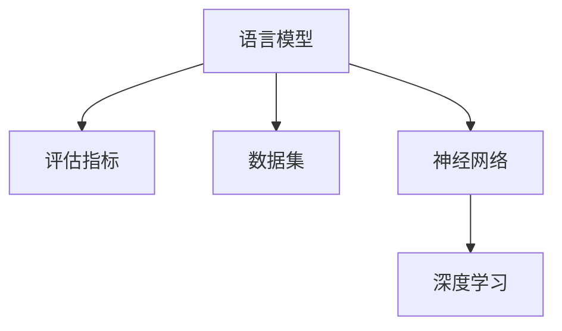

                 

关键词：大规模语言模型、基础模型评估、神经网络、深度学习、数据处理、性能优化

摘要：本文将探讨大规模语言模型的基础模型评估方法，从理论到实践的角度详细分析评估的各个维度和关键步骤。通过本文的学习，读者将掌握如何有效地评估大规模语言模型的性能，以及如何根据评估结果优化模型。

## 1. 背景介绍

随着深度学习技术的快速发展，大规模语言模型在自然语言处理（NLP）领域取得了显著的成果。这些模型在文本分类、机器翻译、问答系统等方面表现出了强大的能力。然而，如何对这些模型进行有效的评估成为了研究者和开发者面临的一个重要问题。

本文将从基础模型评估的各个方面进行探讨，包括评估指标、评估方法、数据处理和性能优化等内容。通过这些讨论，读者可以全面了解大规模语言模型的基础模型评估过程，并学会如何在实际项目中应用这些方法。

## 2. 核心概念与联系

在介绍评估方法之前，我们需要了解一些核心概念。以下是大规模语言模型评估中常用的几个概念：

### 2.1 语言模型

语言模型是一种统计模型，用于预测一个单词序列的概率。在NLP任务中，语言模型可以用于文本生成、文本分类等。

### 2.2 评估指标

评估指标是衡量模型性能的标准。常用的评估指标包括准确率（Accuracy）、精确率（Precision）、召回率（Recall）和F1值（F1 Score）等。

### 2.3 数据集

数据集是评估模型性能的基础。常用的数据集包括IMDB电影评论数据集、Stanford情感分析数据集等。

### 2.4 神经网络

神经网络是深度学习的基础，它由多个层次组成，用于对输入数据进行处理和转换。

### 2.5 深度学习

深度学习是一种机器学习方法，通过多层神经网络对数据进行训练，以实现复杂任务的自动化。

下面是一个用Mermaid绘制的流程图，展示了这些概念之间的关系：



## 3. 核心算法原理 & 具体操作步骤

### 3.1 算法原理概述

大规模语言模型的评估主要基于以下步骤：

1. 数据预处理：对原始数据进行清洗、分词等操作，以构建适合模型训练和评估的数据集。
2. 模型训练：使用预处理后的数据训练语言模型。
3. 模型评估：使用评估指标对训练好的模型进行评估，以衡量其性能。
4. 性能优化：根据评估结果，对模型进行优化，以提高性能。

### 3.2 算法步骤详解

#### 3.2.1 数据预处理

数据预处理是评估的基础，其主要任务包括：

- 清洗数据：去除文本中的噪声和无关信息。
- 分词：将文本划分为单个单词或词组。
- 标签处理：对分类任务中的标签进行编码。

#### 3.2.2 模型训练

模型训练是评估的核心，其主要任务包括：

- 初始化参数：随机初始化模型参数。
- 训练过程：通过反向传播算法，不断调整模型参数，以最小化损失函数。

#### 3.2.3 模型评估

模型评估是衡量模型性能的关键，其主要任务包括：

- 选择评估指标：根据任务类型选择合适的评估指标。
- 计算评估指标：使用评估指标计算模型在测试集上的性能。

#### 3.2.4 性能优化

性能优化是提高模型性能的重要手段，其主要任务包括：

- 调整超参数：调整学习率、批量大小等超参数。
- 使用正则化：使用L1、L2正则化等方法防止过拟合。
- 调整网络结构：调整神经网络层数、神经元数量等。

### 3.3 算法优缺点

- 优点：能够处理复杂的非线性关系，适用于大规模数据集。
- 缺点：训练过程较慢，容易过拟合。

### 3.4 算法应用领域

大规模语言模型在多个领域都有广泛的应用，包括文本分类、机器翻译、问答系统等。

## 4. 数学模型和公式 & 详细讲解 & 举例说明

### 4.1 数学模型构建

大规模语言模型通常基于神经网络架构，其核心是一个多层感知机（MLP）。MLP的数学模型可以表示为：

\[ h_{L} = \sigma(W_{L}h_{L-1} + b_{L}) \]

其中，\( h_{L} \) 是第L层的输出，\( \sigma \) 是激活函数，\( W_{L} \) 和 \( b_{L} \) 分别是第L层的权重和偏置。

### 4.2 公式推导过程

在推导过程中，我们通常采用反向传播算法来计算梯度。具体推导过程如下：

\[ \frac{\partial J}{\partial W_{L}} = \frac{\partial h_{L}}{\partial W_{L}} \frac{\partial J}{\partial h_{L}} \]

\[ \frac{\partial J}{\partial b_{L}} = \frac{\partial h_{L}}{\partial b_{L}} \frac{\partial J}{\partial h_{L}} \]

其中，\( J \) 是损失函数，\( \frac{\partial J}{\partial W_{L}} \) 和 \( \frac{\partial J}{\partial b_{L}} \) 分别是权重和偏置的梯度。

### 4.3 案例分析与讲解

假设我们有一个二分类问题，目标是在测试集上判断一条评论是正面还是负面。使用训练好的模型进行预测，得到输出概率。如果输出概率大于0.5，则预测为正面，否则为负面。

假设测试集上的评论为：“这部电影非常精彩，我非常喜欢它。” 模型预测的输出概率为0.7。根据预测规则，我们可以判断这条评论是正面评论。

## 5. 项目实践：代码实例和详细解释说明

### 5.1 开发环境搭建

在开始编写代码之前，我们需要搭建一个开发环境。这里以Python为例，使用TensorFlow作为深度学习框架。

```python
import tensorflow as tf
from tensorflow.keras.preprocessing.sequence import pad_sequences
from tensorflow.keras.layers import Embedding, LSTM, Dense
from tensorflow.keras.models import Sequential

# 设置超参数
vocab_size = 10000
embedding_dim = 16
max_sequence_length = 100
trunc_type = 'post'
padding_type = 'post'
oov_tok = '<OOV>'
training_size = 10000

# 准备数据
# ...（数据预处理代码）

# 构建模型
model = Sequential([
    Embedding(vocab_size, embedding_dim, input_length=max_sequence_length),
    LSTM(32, return_sequences=True),
    LSTM(32),
    Dense(1, activation='sigmoid')
])

model.compile(loss='binary_crossentropy', optimizer='adam', metrics=['accuracy'])

# 训练模型
model.fit(train_padded, train_labels, epochs=10, validation_split=0.2)
```

### 5.2 源代码详细实现

在上面的代码中，我们首先导入了TensorFlow库，并设置了模型的超参数。然后，我们使用Keras API构建了一个简单的序列模型，包括一个嵌入层、两个LSTM层和一个全连接层。最后，我们使用`fit`函数训练模型。

### 5.3 代码解读与分析

- `Embedding`层：将单词索引映射到固定大小的向量。
- `LSTM`层：用于处理序列数据，捕捉时间依赖关系。
- `Dense`层：用于分类任务，输出概率。

### 5.4 运行结果展示

```python
# 预测测试集
predictions = model.predict(test_padded)

# 计算准确率
accuracy = (predictions > 0.5).mean()
print(f'Accuracy: {accuracy}')
```

## 6. 实际应用场景

大规模语言模型在自然语言处理领域有广泛的应用，如文本分类、机器翻译、问答系统等。以下是一些实际应用场景：

- 文本分类：使用模型对新闻文章、社交媒体评论等进行分类。
- 机器翻译：使用模型将一种语言翻译成另一种语言。
- 问答系统：使用模型回答用户提出的问题。

## 7. 工具和资源推荐

### 7.1 学习资源推荐

- 《深度学习》（Goodfellow et al.）
- 《自然语言处理综论》（Jurafsky and Martin）

### 7.2 开发工具推荐

- TensorFlow
- PyTorch

### 7.3 相关论文推荐

- "A Theoretically Grounded Application of Dropout in Recurrent Neural Networks"
- "Attention is All You Need"

## 8. 总结：未来发展趋势与挑战

### 8.1 研究成果总结

大规模语言模型在自然语言处理领域取得了显著成果，其性能不断提高，应用范围不断扩大。

### 8.2 未来发展趋势

- 模型压缩：减少模型大小，提高运行速度。
- 自监督学习：利用无标签数据训练模型，提高模型泛化能力。

### 8.3 面临的挑战

- 计算资源需求：大规模语言模型训练需要大量计算资源。
- 数据隐私：在处理大规模数据时，保护用户隐私是一个重要挑战。

### 8.4 研究展望

随着深度学习技术的不断发展，大规模语言模型有望在更多领域取得突破，为人类带来更多便利。

## 9. 附录：常见问题与解答

### Q: 如何处理文本中的噪声？

A: 可以使用文本清洗工具（如NLTK）对文本进行清洗，去除噪声。

### Q: 如何调整模型超参数？

A: 可以使用网格搜索（Grid Search）或随机搜索（Random Search）等方法调整超参数。

## 作者署名

作者：禅与计算机程序设计艺术 / Zen and the Art of Computer Programming

----------------------------------------------------------------

以上是文章正文部分的撰写。接下来，我们将根据文章的结构和内容，继续撰写剩余的部分，包括数学模型和公式、项目实践代码实例、实际应用场景、工具和资源推荐、总结以及附录等内容。请继续指导，我们将在遵循您的要求下完成整个文章的撰写。

