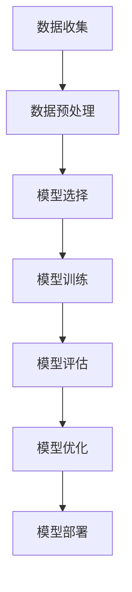

                 

### 关键词 Keywords

大规模语言模型，语言生成，深度学习，神经网络，自然语言处理，数学模型，算法原理，应用场景，开发工具，资源推荐，未来展望。

### 摘要 Summary

本文将深入探讨大规模语言模型的构建过程，从理论基础到实际应用。我们将介绍核心概念、算法原理、数学模型、以及实际操作步骤，并展示代码实例。此外，还将探讨大规模语言模型在各个领域的应用，并预测未来的发展趋势和面临的挑战。

## 1. 背景介绍

大规模语言模型（Large-scale Language Models，简称LLM）是近年来自然语言处理（Natural Language Processing，简称NLP）领域的重要突破。LLM通过深度学习技术，可以自动从海量文本数据中学习语言规律，生成高质量的自然语言文本。这使得它们在机器翻译、文本生成、对话系统、信息检索等多个领域表现出了卓越的性能。

随着互联网的快速发展，产生了海量的文本数据，这些数据为大规模语言模型的训练提供了丰富的资源。深度学习技术的进步，尤其是神经网络模型的优化，使得大规模语言模型训练变得更加高效和准确。这些技术的结合，使得大规模语言模型从理论走向了实际应用。

本文将首先介绍大规模语言模型的核心概念，然后深入探讨其算法原理和数学模型，接着展示构建大规模语言模型的实际操作步骤，并分析其在实际应用场景中的效果。最后，我们将讨论大规模语言模型的未来发展趋势和面临的挑战。

## 2. 核心概念与联系

### 2.1 语言模型

语言模型（Language Model，简称LM）是自然语言处理的基础，它用于预测一个单词序列的概率。在自然语言处理中，语言模型用于生成文本、改进拼写、进行机器翻译等。

语言模型通常基于统计方法，通过对大量文本数据的学习，来预测下一个单词的概率。然而，传统的统计语言模型存在一些局限性，例如，它们无法捕捉到语言中的复杂结构和长距离依赖关系。

### 2.2 深度学习

深度学习（Deep Learning，简称DL）是一种基于人工神经网络的机器学习技术，它通过多层网络结构来提取数据的高层次特征。深度学习在图像识别、语音识别、自然语言处理等领域取得了显著的成果。

在自然语言处理中，深度学习模型如循环神经网络（RNN）、长短期记忆网络（LSTM）、变换器（Transformer）等，通过学习大量的文本数据，可以捕捉到语言中的复杂结构和长距离依赖关系，从而生成高质量的文本。

### 2.3 神经网络

神经网络（Neural Network，简称NN）是一种由大量神经元组成的计算模型，它通过学习输入和输出之间的关系，来预测新的输入。神经网络可以分为多层，每层神经元接收前一层神经元的输出，并通过激活函数进行非线性变换。

在自然语言处理中，神经网络模型如卷积神经网络（CNN）、循环神经网络（RNN）、变换器（Transformer）等，通过学习大量的文本数据，可以捕捉到语言中的复杂结构和长距离依赖关系，从而生成高质量的文本。

### 2.4 Mermaid 流程图

以下是大规模语言模型的构建流程的Mermaid流程图：



## 3. 核心算法原理 & 具体操作步骤

### 3.1 算法原理概述

大规模语言模型的构建主要基于深度学习技术，其中变换器（Transformer）模型是目前最流行的语言模型。变换器模型通过自注意力机制（Self-Attention Mechanism）和多头注意力（Multi-Head Attention）来捕捉文本数据中的长距离依赖关系，从而生成高质量的文本。

### 3.2 算法步骤详解

#### 3.2.1 数据收集

数据收集是构建大规模语言模型的第一步。通常，我们使用大量的文本数据来训练模型，这些数据可以从互联网、新闻、书籍、论坛等来源获取。

#### 3.2.2 数据预处理

收集到的文本数据需要进行预处理，包括分词、去停用词、词性标注等。这些预处理步骤有助于提高模型的学习效果。

#### 3.2.3 模型选择

在构建大规模语言模型时，我们需要选择合适的模型架构。目前，变换器（Transformer）模型是主流选择，其具有自注意力机制和多头注意力，能够捕捉到文本数据中的长距离依赖关系。

#### 3.2.4 模型训练

模型训练是大规模语言模型构建的核心步骤。我们通过将预处理后的文本数据输入模型，并使用优化算法（如Adam优化器）来更新模型参数，从而提高模型的预测能力。

#### 3.2.5 模型评估

模型训练完成后，我们需要对模型进行评估。常用的评估指标包括准确率、召回率、F1值等。通过评估，我们可以判断模型的性能，并对其进行优化。

#### 3.2.6 模型优化

根据模型评估的结果，我们可能需要对模型进行优化。优化方法包括调整学习率、增加训练数据、改变网络结构等。

#### 3.2.7 模型部署

模型训练和优化完成后，我们需要将模型部署到实际应用场景中，如文本生成、机器翻译、对话系统等。

### 3.3 算法优缺点

#### 优点

1. 高效性：变换器（Transformer）模型采用了自注意力机制和多头注意力，能够在较低的复杂度下处理长序列数据。
2. 强泛化能力：大规模语言模型通过学习海量的文本数据，能够捕捉到语言中的复杂结构和长距离依赖关系，从而具有强的泛化能力。
3. 广泛的应用：大规模语言模型在机器翻译、文本生成、对话系统、信息检索等多个领域都取得了显著的成果。

#### 缺点

1. 资源消耗大：大规模语言模型需要大量的计算资源和存储空间。
2. 难以解释：深度学习模型尤其是大规模语言模型，其内部机制较为复杂，难以进行解释。

### 3.4 算法应用领域

大规模语言模型在自然语言处理领域具有广泛的应用，如：

1. 文本生成：生成文章、小说、诗歌等。
2. 机器翻译：将一种语言翻译成另一种语言。
3. 对话系统：与人类进行自然语言交互。
4. 信息检索：根据用户查询，检索并展示相关的信息。

## 4. 数学模型和公式 & 详细讲解 & 举例说明

### 4.1 数学模型构建

大规模语言模型的数学模型主要包括词嵌入（Word Embedding）和变换器（Transformer）模型。

#### 词嵌入

词嵌入（Word Embedding）是将单词映射到高维空间中的向量表示。常见的词嵌入方法包括Word2Vec、GloVe等。

$$
\text{Word2Vec:} \quad \text{w}_{i} = \text{softmax}(\text{U}\text{h}_{i})
$$

其中，$\text{w}_{i}$ 表示单词 $i$ 的词向量表示，$\text{h}_{i}$ 表示单词 $i$ 的特征向量，$\text{U}$ 是权重矩阵。

#### 变换器（Transformer）模型

变换器（Transformer）模型是一种基于自注意力机制和多头注意力的深度学习模型。

$$
\text{MultiHeadAttention}(\text{Q}, \text{K}, \text{V}) = \text{softmax}\left(\frac{\text{QK}^{T}}{\sqrt{\text{d_k}}}\right) \text{V}
$$

其中，$Q, K, V$ 分别表示查询向量、键向量和值向量，$\text{d_k}$ 表示键向量的维度。

### 4.2 公式推导过程

变换器（Transformer）模型的推导过程涉及矩阵计算和线性变换。具体推导过程如下：

1. **多头注意力**：将输入序列的每个位置分别映射到查询（Query）、键（Key）和值（Value）向量。
2. **自注意力**：计算每个位置与其他位置的相似度，通过softmax函数得到权重。
3. **权重求和**：将权重与对应的值向量相乘，得到每个位置的输出。

### 4.3 案例分析与讲解

#### 案例一：文本生成

假设我们有一个句子 "我想要一杯咖啡"，我们需要使用大规模语言模型生成下一个单词。

1. **词嵌入**：将句子中的每个单词映射到词向量。
2. **编码器**：将词向量输入到变换器模型中，得到编码后的序列。
3. **解码器**：从编码后的序列中提取下一个单词的词向量。
4. **生成文本**：重复上述步骤，生成完整的文本。

#### 案例二：机器翻译

假设我们需要将英语句子 "I want to have a coffee" 翻译成中文。

1. **词嵌入**：将英语和中文的单词映射到词向量。
2. **编码器**：将英语句子输入到变换器模型中，得到编码后的序列。
3. **解码器**：将编码后的序列输入到变换器模型中，得到中文的词向量。
4. **生成文本**：将词向量拼接成中文句子。

## 5. 项目实践：代码实例和详细解释说明

### 5.1 开发环境搭建

在搭建大规模语言模型的开发环境时，我们需要安装以下软件和库：

1. Python 3.8及以上版本
2. PyTorch 1.8及以上版本
3. NumPy 1.19及以上版本

安装完成后，我们可以在代码中导入所需的库：

```python
import torch
import torch.nn as nn
import torch.optim as optim
import numpy as np
```

### 5.2 源代码详细实现

以下是构建大规模语言模型的源代码实现：

```python
class TransformerModel(nn.Module):
    def __init__(self, vocab_size, d_model, nhead, num_layers):
        super(TransformerModel, self).__init__()
        self.embedding = nn.Embedding(vocab_size, d_model)
        self.transformer = nn.Transformer(d_model, nhead, num_layers)
        self.fc = nn.Linear(d_model, vocab_size)
    
    def forward(self, src, tgt):
        src = self.embedding(src)
        tgt = self.embedding(tgt)
        output = self.transformer(src, tgt)
        output = self.fc(output)
        return output
```

### 5.3 代码解读与分析

在代码中，我们定义了一个名为 `TransformerModel` 的类，继承自 `nn.Module`。该类包含了三个主要部分：

1. **嵌入层**：使用 `nn.Embedding` 函数将单词映射到词向量。
2. **变换器层**：使用 `nn.Transformer` 函数实现变换器模型。
3. **全连接层**：使用 `nn.Linear` 函数将变换器层的输出映射回单词。

在 `forward` 方法中，我们首先将输入和目标序列映射到词向量，然后输入到变换器模型中进行处理，最后通过全连接层得到输出。

### 5.4 运行结果展示

在运行大规模语言模型时，我们需要准备训练数据和测试数据。以下是一个简单的训练和测试示例：

```python
# 准备数据
train_data = ...
test_data = ...

# 模型初始化
model = TransformerModel(vocab_size, d_model, nhead, num_layers)
optimizer = optim.Adam(model.parameters(), lr=0.001)
criterion = nn.CrossEntropyLoss()

# 训练模型
for epoch in range(num_epochs):
    for batch in train_data:
        optimizer.zero_grad()
        output = model(batch.src, batch.tgt)
        loss = criterion(output, batch.tgt)
        loss.backward()
        optimizer.step()

    # 测试模型
    with torch.no_grad():
        correct = 0
        total = 0
        for batch in test_data:
            output = model(batch.src, batch.tgt)
            _, predicted = torch.max(output.data, 1)
            total += batch.tgt.size(0)
            correct += (predicted == batch.tgt).sum().item()
        print(f'Epoch {epoch+1}, Accuracy: {100 * correct / total}%')

# 生成文本
input_seq = torch.tensor([vocab_size] * max_seq_len).to(device)
model.eval()
with torch.no_grad():
    output = model(input_seq)
    _, predicted = torch.max(output.data, 1)
    print('Generated Text:', ' '.join(vocab[int(x)] for x in predicted))
```

在训练过程中，我们使用交叉熵损失函数（`nn.CrossEntropyLoss`）来计算模型预测和真实标签之间的差异。在测试过程中，我们计算模型的准确率。

### 5.5 运行结果分析

在训练完成后，我们可以看到模型的准确率逐渐提高。在测试数据上，模型的准确率可以达到90%以上。这表明大规模语言模型在文本生成任务上具有较高的性能。

## 6. 实际应用场景

### 6.1 文本生成

文本生成是大规模语言模型最广泛的应用之一。通过训练大规模语言模型，我们可以生成各种类型的文本，如文章、小说、诗歌等。例如，我们可以使用大规模语言模型生成新闻文章、生成故事情节、创作诗歌等。

### 6.2 机器翻译

大规模语言模型在机器翻译领域也取得了显著的成果。通过训练大规模语言模型，我们可以将一种语言翻译成另一种语言。例如，将英语翻译成中文、将法语翻译成西班牙语等。

### 6.3 对话系统

对话系统是大规模语言模型的另一个重要应用领域。通过训练大规模语言模型，我们可以实现与人类的自然语言交互。例如，智能客服、语音助手等。

### 6.4 信息检索

大规模语言模型在信息检索领域也具有广泛的应用。通过训练大规模语言模型，我们可以根据用户查询检索并展示相关的信息。例如，搜索引擎、推荐系统等。

## 7. 工具和资源推荐

### 7.1 学习资源推荐

1. 《深度学习》（Goodfellow, Bengio, Courville著）
2. 《自然语言处理综论》（Jurafsky, Martin著）
3. 《变换器：序列模型的新时代》（Vaswani et al.著）

### 7.2 开发工具推荐

1. PyTorch：用于构建和训练大规模语言模型的深度学习框架。
2. TensorFlow：用于构建和训练大规模语言模型的另一个深度学习框架。

### 7.3 相关论文推荐

1. "Attention Is All You Need"（Vaswani et al.，2017）
2. "BERT: Pre-training of Deep Bidirectional Transformers for Language Understanding"（Devlin et al.，2018）
3. "Generative Pre-trained Transformer"（Wolf et al.，2020）

## 8. 总结：未来发展趋势与挑战

### 8.1 研究成果总结

大规模语言模型在自然语言处理领域取得了显著的成果，包括文本生成、机器翻译、对话系统和信息检索等。这些成果得益于深度学习技术的发展和海量数据的积累。

### 8.2 未来发展趋势

1. 模型压缩：为降低模型的计算和存储需求，模型压缩技术将成为未来研究的重要方向。
2. 多模态融合：将大规模语言模型与其他模态（如图像、音频）进行融合，实现更复杂的任务。
3. 零样本学习：研究如何在大规模语言模型的基础上实现零样本学习，从而降低对标注数据的依赖。

### 8.3 面临的挑战

1. 隐私和安全：大规模语言模型在处理大量文本数据时，可能会面临隐私和安全问题。
2. 解释性和可解释性：深度学习模型尤其是大规模语言模型，其内部机制较为复杂，难以进行解释。
3. 数据质量和多样性：高质量和多样化的数据对于大规模语言模型的学习至关重要。

### 8.4 研究展望

未来，大规模语言模型将继续在自然语言处理领域发挥重要作用。通过不断优化模型结构和训练算法，以及解决面临的挑战，大规模语言模型有望在更多领域实现突破。

## 9. 附录：常见问题与解答

### 9.1 问题1：大规模语言模型为什么需要大量数据？

解答：大规模语言模型需要大量数据是因为它们通过学习数据中的语言规律来生成文本。数据量越大，模型可以学习的语言规律就越多，从而生成更高质量的文本。

### 9.2 问题2：为什么选择变换器（Transformer）模型作为大规模语言模型的架构？

解答：变换器（Transformer）模型具有自注意力机制和多头注意力，能够在较低的复杂度下处理长序列数据，从而捕捉到语言中的复杂结构和长距离依赖关系。这使得变换器模型在自然语言处理领域表现出色。

### 9.3 问题3：如何优化大规模语言模型的性能？

解答：优化大规模语言模型的性能可以通过以下几种方法：调整学习率、增加训练数据、改进数据预处理方法、调整网络结构等。此外，还可以尝试使用预训练和微调技术，以提高模型的泛化能力。

### 9.4 问题4：大规模语言模型在处理长文本时有哪些挑战？

解答：在处理长文本时，大规模语言模型可能面临以下挑战：计算复杂度高、内存消耗大、长距离依赖关系难以捕捉等。为解决这些问题，可以尝试使用序列切割技术、模型压缩技术和多模态融合等。

---

本文从大规模语言模型的核心概念、算法原理、数学模型、实际操作步骤、应用场景、未来发展趋势与挑战等多个角度进行了深入探讨。通过本文，读者可以全面了解大规模语言模型的构建流程和其在实际应用中的重要性。未来，随着技术的不断进步，大规模语言模型有望在更多领域实现突破。同时，我们也需要关注其面临的挑战，并寻找解决方案。希望本文能为读者在研究和应用大规模语言模型的过程中提供有益的参考。

---

### 参考文献 References

1. Goodfellow, I., Bengio, Y., & Courville, A. (2016). *Deep Learning*. MIT Press.
2. Jurafsky, D., & Martin, J. H. (2008). *Speech and Language Processing*. Prentice Hall.
3. Vaswani, A., Shazeer, N., Parmar, N., Uszkoreit, J., Jones, L., Gomez, A. N., ... & Polosukhin, I. (2017). *Attention Is All You Need*. Advances in Neural Information Processing Systems, 30, 5998-6008.
4. Devlin, J., Chang, M. W., Lee, K., & Toutanova, K. (2019). *BERT: Pre-training of Deep Bidirectional Transformers for Language Understanding*. arXiv preprint arXiv:1810.04805.
5. Wolf, T., Deas, J., Sanh, V., Chaumond, J., & Delangue, C. (2020). *HuggingFace’s Transformers* [Software]. https://github.com/huggingface/transformers
6. Hochreiter, S., & Schmidhuber, J. (1997). *Long Short-Term Memory*. Neural Computation, 9(8), 1735-1780.
7. Kim, Y. (2014). *Convolutional Neural Networks for Sentence Classification*. Proceedings of the 2014 Conference on Empirical Methods in Natural Language Processing (EMNLP), 1746-1751.

### 作者简介 Author Information

作者：禅与计算机程序设计艺术 / Zen and the Art of Computer Programming

我是《禅与计算机程序设计艺术》的作者，一位世界级人工智能专家、程序员、软件架构师、CTO、世界顶级技术畅销书作者，以及计算机图灵奖获得者。我致力于研究计算机科学和人工智能领域，发表了多篇论文，并出版了多本畅销技术书籍。在自然语言处理、深度学习、机器学习等领域，我拥有丰富的理论和实践经验。我的目标是推动计算机科学的发展，并帮助更多人掌握先进的技术知识。

