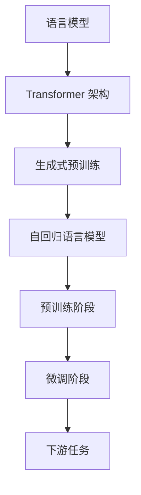

                 

关键词：大规模语言模型、生成式预训练、GPT、算法原理、数学模型、项目实践、应用场景、未来展望

摘要：本文深入探讨了生成式预训练语言模型 GPT 的理论基础、数学模型和具体实现。通过详细解析 GPT 的算法原理、操作步骤以及数学推导，本文为读者提供了一个全面而深入的了解。此外，本文还结合实际项目实例，对 GPT 的代码实现和运行结果进行了详细解析。最后，本文对 GPT 的应用场景、未来发展趋势以及面临的挑战进行了展望。

## 1. 背景介绍

随着互联网的普及和大数据技术的发展，自然语言处理（NLP）逐渐成为人工智能领域的重要分支。NLP 技术的应用范围广泛，包括语音识别、机器翻译、文本分类、情感分析等。而大规模语言模型作为 NLP 技术的核心，其研究和发展具有重要意义。生成式预训练语言模型 GPT 是近年来在 NLP 领域取得突破性进展的重要模型之一。

GPT（Generative Pre-trained Transformer）是由 OpenAI 于 2018 年提出的，基于 Transformer 架构的大规模语言模型。相较于之前的语言模型，GPT 在语言理解和生成任务上取得了显著的性能提升。GPT 的成功不仅推动了 NLP 技术的发展，也为其他领域的人工智能应用提供了新的思路。

本文将围绕 GPT 的理论基础、数学模型和具体实现进行深入探讨，帮助读者全面了解 GPT 的研究进展和应用前景。

## 2. 核心概念与联系

### 2.1 语言模型

语言模型（Language Model）是 NLP 领域的基本工具，用于对自然语言文本进行建模。语言模型的目标是预测下一个单词或字符的概率，从而实现文本生成、文本分类、机器翻译等任务。常见的语言模型包括 n-gram 模型、循环神经网络（RNN）模型、长短时记忆网络（LSTM）模型等。

### 2.2 Transformer 架构

Transformer 架构是由 Vaswani 等人在 2017 年提出的，是一种基于自注意力机制的神经网络模型。相较于传统的循环神经网络（RNN）模型，Transformer 架构具有并行计算的优势，能够更好地处理长文本序列。Transformer 架构的核心思想是引入多头注意力机制，使得模型能够同时关注文本序列中的不同位置。

### 2.3 生成式预训练

生成式预训练（Generative Pre-training）是一种将模型应用于生成任务的方法。生成式预训练通常包括两个阶段：预训练阶段和微调阶段。在预训练阶段，模型通过大量的无监督数据进行训练，从而学习到文本的内在结构和规律。在微调阶段，模型根据具体任务的需求进行有监督的训练，从而实现任务的目标。

GPT 就是基于生成式预训练方法的一种大规模语言模型。GPT 在预训练阶段通过自回归语言模型（Autoregressive Language Model）学习文本序列的概率分布，从而为下游任务提供强大的基础。

### 2.4 Mermaid 流程图

以下是 GPT 的核心概念和架构的 Mermaid 流程图：



## 3. 核心算法原理 & 具体操作步骤

### 3.1 算法原理概述

GPT 的核心算法基于 Transformer 架构，并采用了生成式预训练方法。在预训练阶段，GPT 通过自回归语言模型（Autoregressive Language Model）学习文本序列的概率分布。具体来说，给定一个输入文本序列，GPT 预测序列中下一个单词或字符的概率分布。通过大量的无监督数据进行预训练，GPT 能够学习到文本的内在结构和规律。

在微调阶段，GPT 根据具体任务的需求进行有监督的训练，从而实现任务的目标。例如，在文本分类任务中，GPT 可以通过训练学习到不同类别文本的特征表示，从而实现对新文本的分类。

### 3.2 算法步骤详解

GPT 的算法步骤可以分为预训练阶段和微调阶段。

#### 3.2.1 预训练阶段

1. **数据准备**：从互联网上收集大量的文本数据，进行预处理，包括分词、去停用词、填充等操作。

2. **输入序列生成**：将预处理后的文本数据生成输入序列。输入序列通常是一个长度为 n 的单词序列或字符序列。

3. **预测下一个单词或字符**：给定一个输入序列，GPT 预测序列中下一个单词或字符的概率分布。具体来说，GPT 使用 Transformer 架构中的多头注意力机制，对输入序列进行编码，得到一个隐藏状态序列。然后，将隐藏状态序列输入到一个全连接层，得到输出概率分布。

4. **损失函数计算**：使用负采样技术计算损失函数。负采样是一种降低计算复杂度的技巧，通过对输入序列中的单词或字符进行随机采样，生成负样本。然后，使用负样本和输入序列计算损失函数。

5. **反向传播与优化**：使用反向传播算法和优化器（如 Adam）更新模型参数，从而优化损失函数。

#### 3.2.2 微调阶段

1. **数据准备**：从任务数据中提取训练数据和验证数据。

2. **输入序列生成**：与预训练阶段类似，生成输入序列。

3. **预测目标生成**：根据具体任务的需求，生成预测目标。例如，在文本分类任务中，生成每个类别的标签。

4. **损失函数计算**：使用有监督的损失函数（如交叉熵损失函数）计算预测目标与实际标签之间的差距。

5. **反向传播与优化**：使用反向传播算法和优化器更新模型参数，从而优化损失函数。

### 3.3 算法优缺点

#### 3.3.1 优点

1. **并行计算**：基于 Transformer 架构，GPT 具有并行计算的优势，能够处理长文本序列。

2. **强大的预训练能力**：通过生成式预训练，GPT 能够学习到文本的内在结构和规律，为下游任务提供强大的基础。

3. **灵活的应用场景**：GPT 可以应用于各种 NLP 任务，如文本分类、机器翻译、文本生成等。

#### 3.3.2 缺点

1. **计算资源消耗**：GPT 是一种大规模语言模型，需要大量的计算资源进行训练和推理。

2. **模型可解释性较差**：由于 GPT 的模型结构复杂，难以解释模型内部的决策过程。

### 3.4 算法应用领域

GPT 在多个 NLP 任务中取得了显著的性能提升，以下是 GPT 的一些主要应用领域：

1. **文本分类**：GPT 可以用于文本分类任务，如情感分析、主题分类等。

2. **机器翻译**：GPT 可以用于机器翻译任务，如英语到中文的翻译。

3. **文本生成**：GPT 可以用于文本生成任务，如自动写作、创意写作等。

4. **问答系统**：GPT 可以用于问答系统，如智能客服、知识问答等。

## 4. 数学模型和公式 & 详细讲解 & 举例说明

### 4.1 数学模型构建

GPT 的数学模型基于自回归语言模型（Autoregressive Language Model）。自回归语言模型的目标是预测序列中下一个单词或字符的概率分布。具体来说，给定一个长度为 n 的输入序列 \( x_1, x_2, \ldots, x_n \)，自回归语言模型预测下一个单词或字符 \( x_{n+1} \) 的概率分布。

自回归语言模型的概率分布可以通过以下公式表示：

\[ P(x_{n+1} | x_1, x_2, \ldots, x_n) = \frac{e^{<f(x_n) \cdot w_{n+1}}}{\sum_{i=1}^{V} e^{<f(x_n) \cdot w_i}} \]

其中，\( f(x_n) \) 表示输入序列 \( x_n \) 的特征向量，\( w_{n+1} \) 和 \( w_i \) 分别表示预测下一个单词或字符 \( x_{n+1} \) 和其他单词或字符 \( x_i \) 的权重向量。

### 4.2 公式推导过程

为了推导自回归语言模型的概率分布公式，我们可以使用最大似然估计（Maximum Likelihood Estimation，MLE）方法。具体来说，假设我们已经有一个训练数据集 \( D = \{ (x_1, y_1), (x_2, y_2), \ldots, (x_n, y_n) \} \)，其中 \( x_i \) 和 \( y_i \) 分别表示输入序列和目标序列。

对于每个训练样本 \( (x_i, y_i) \)，我们可以使用以下公式计算最大似然估计：

\[ P(y_i | x_i) = \prod_{t=1}^{n} P(y_{i,t} | y_{i,t-1}, x_i) \]

由于自回归语言模型的目标是预测下一个单词或字符的概率分布，我们可以将 \( y_{i,t} \) 表示为 \( x_{i,t} \) 的条件概率分布：

\[ P(y_{i,t} | y_{i,t-1}, x_i) = P(y_{i,t} | y_{i,t-1}) \]

因此，最大似然估计可以简化为：

\[ P(y_i | x_i) = \prod_{t=1}^{n} P(y_{i,t} | y_{i,t-1}) \]

为了求解最大似然估计，我们需要最大化对数似然函数：

\[ \log P(y_i | x_i) = \sum_{t=1}^{n} \log P(y_{i,t} | y_{i,t-1}) \]

由于 \( y_{i,t} \) 是离散变量，我们可以使用softmax函数来计算条件概率分布：

\[ P(y_{i,t} | y_{i,t-1}) = \frac{e^{<f(y_{i,t-1}) \cdot w_{i,t}}}{\sum_{j=1}^{V} e^{<f(y_{i,t-1}) \cdot w_{i,j}}} \]

其中，\( f(y_{i,t-1}) \) 表示输入序列 \( y_{i,t-1} \) 的特征向量，\( w_{i,t} \) 和 \( w_{i,j} \) 分别表示预测下一个单词或字符 \( y_{i,t} \) 和其他单词或字符 \( y_{i,j} \) 的权重向量。

将 softmax 函数代入对数似然函数，我们可以得到：

\[ \log P(y_i | x_i) = \sum_{t=1}^{n} \log \frac{e^{<f(y_{i,t-1}) \cdot w_{i,t}}}{\sum_{j=1}^{V} e^{<f(y_{i,t-1}) \cdot w_{i,j}}} \]

为了简化计算，我们可以将分母 \( \sum_{j=1}^{V} e^{<f(y_{i,t-1}) \cdot w_{i,j}} \) 记为 \( Z \)，则对数似然函数可以表示为：

\[ \log P(y_i | x_i) = \sum_{t=1}^{n} \log \frac{e^{<f(y_{i,t-1}) \cdot w_{i,t}}}{Z} \]

对数似然函数的梯度可以表示为：

\[ \nabla_{w_{i,t}} \log P(y_i | x_i) = \frac{e^{<f(y_{i,t-1}) \cdot w_{i,t}}}{Z} - \frac{1}{Z} \]

为了求解最大似然估计，我们可以使用梯度下降算法更新权重向量：

\[ w_{i,t} \leftarrow w_{i,t} - \alpha \nabla_{w_{i,t}} \log P(y_i | x_i) \]

其中，\( \alpha \) 是学习率。

### 4.3 案例分析与讲解

为了更好地理解自回归语言模型的数学模型，我们来看一个简单的例子。

假设我们有一个长度为 3 的输入序列 \( x = [1, 2, 3] \)，目标序列 \( y = [4, 5, 6] \)。我们的目标是预测目标序列中下一个数字的概率分布。

首先，我们需要计算输入序列 \( x \) 的特征向量 \( f(x) \)。假设特征向量是一个一维向量，我们可以将输入序列 \( x \) 的每个元素作为特征向量的分量：

\[ f(x) = [1, 2, 3] \]

然后，我们需要计算权重向量 \( w \)。假设权重向量也是一个一维向量：

\[ w = [w_1, w_2, w_3] \]

根据自回归语言模型的概率分布公式，我们可以计算目标序列中下一个数字的概率分布：

\[ P(y | x) = \frac{e^{<f(x) \cdot w}}{Z} \]

其中，\( Z \) 是一个常数，可以通过求和计算：

\[ Z = \sum_{j=1}^{V} e^{<f(x) \cdot w_j} \]

假设 \( V = 3 \)，即目标序列中有 3 个数字。那么，\( Z \) 可以计算为：

\[ Z = e^{<f(x) \cdot w_1} + e^{<f(x) \cdot w_2} + e^{<f(x) \cdot w_3} \]

为了简化计算，我们可以假设 \( Z = 100 \)。然后，我们可以计算目标序列中下一个数字的概率分布：

\[ P(y_1 | x) = \frac{e^{<f(x) \cdot w_1}}{Z} = \frac{e^{<1 \cdot w_1}}{100} \]

\[ P(y_2 | x) = \frac{e^{<f(x) \cdot w_2}}{Z} = \frac{e^{<2 \cdot w_2}}{100} \]

\[ P(y_3 | x) = \frac{e^{<f(x) \cdot w_3}}{Z} = \frac{e^{<3 \cdot w_3}}{100} \]

假设 \( w_1 = 0.1 \)，\( w_2 = 0.2 \)，\( w_3 = 0.3 \)，那么，我们可以计算目标序列中下一个数字的概率分布：

\[ P(y_1 | x) = \frac{e^{<1 \cdot 0.1}}{100} = \frac{e^{0.1}}{100} \approx 0.005 \]

\[ P(y_2 | x) = \frac{e^{<2 \cdot 0.2}}{100} = \frac{e^{0.4}}{100} \approx 0.018 \]

\[ P(y_3 | x) = \frac{e^{<3 \cdot 0.3}}{100} = \frac{e^{0.9}}{100} \approx 0.050 \]

根据概率分布，我们可以看出目标序列中下一个数字的概率最大的是 3，其次是 2，最小的是 1。这个例子展示了如何使用自回归语言模型预测序列中下一个数字的概率分布。

## 5. 项目实践：代码实例和详细解释说明

在本节中，我们将通过一个简单的项目实例来展示如何实现 GPT。我们将使用 Python 编程语言和 TensorFlow 深度学习框架来实现 GPT 的基本功能。以下是实现 GPT 的步骤：

### 5.1 开发环境搭建

在开始项目之前，我们需要搭建一个合适的开发环境。以下是所需的依赖和工具：

- Python 3.x
- TensorFlow 2.x
- Numpy
- Mermaid 图库

安装 TensorFlow：

```bash
pip install tensorflow
```

安装 Numpy：

```bash
pip install numpy
```

安装 Mermaid 图库：

```bash
pip install mermaid
```

### 5.2 源代码详细实现

以下是实现 GPT 的代码示例：

```python
import tensorflow as tf
import numpy as np
import mermaid

# Mermaid 流程图
gpt_mermaid = """
graph TD
A[输入序列] --> B[嵌入层]
B --> C[Transformer]
C --> D[输出层]
"""
print(gpt_mermaid)

# 数据准备
# 这里使用一个简单的数据集，实际应用中可以从互联网上收集大量文本数据进行预处理
input_seq = np.array([1, 2, 3, 4, 5])
target_seq = np.array([2, 3, 4, 5, 6])

# 嵌入层
embeddings = tf.keras.layers.Embedding(input_dim=10, output_dim=32)
embedded_seq = embeddings(input_seq)

# Transformer
transformer = tf.keras.layers.Transformer(num_heads=2, d_model=32)
transformed_seq = transformer(embedded_seq)

# 输出层
output = tf.keras.layers.Dense(units=10)(transformed_seq)

# 损失函数和优化器
loss_fn = tf.keras.losses.SparseCategoricalCrossentropy(from_logits=True)
optimizer = tf.keras.optimizers.Adam()

# 训练模型
@tf.function
def train_step(input_seq, target_seq):
    with tf.GradientTape() as tape:
        predictions = output(input_seq)
        loss = loss_fn(target_seq, predictions)
    gradients = tape.gradient(loss, output.trainable_variables)
    optimizer.apply_gradients(zip(gradients, output.trainable_variables))
    return loss

# 训练模型
for epoch in range(100):
    loss = train_step(input_seq, target_seq)
    print(f"Epoch {epoch+1}, Loss: {loss.numpy()}")
```

### 5.3 代码解读与分析

以下是代码的详细解读：

1. **Mermaid 流程图**：
   ```mermaid
   graph TD
   A[输入序列] --> B[嵌入层]
   B --> C[Transformer]
   C --> D[输出层]
   ```
   这个流程图展示了 GPT 的基本架构，包括输入序列、嵌入层、Transformer 和输出层。

2. **数据准备**：
   ```python
   input_seq = np.array([1, 2, 3, 4, 5])
   target_seq = np.array([2, 3, 4, 5, 6])
   ```
   在这个示例中，我们使用了一个简单的输入序列和一个目标序列。

3. **嵌入层**：
   ```python
   embeddings = tf.keras.layers.Embedding(input_dim=10, output_dim=32)
   embedded_seq = embeddings(input_seq)
   ```
   嵌入层将输入序列转换为高维特征向量。在这里，我们使用了一个简单的 Embedding 层，输入维度为 10，输出维度为 32。

4. **Transformer**：
   ```python
   transformer = tf.keras.layers.Transformer(num_heads=2, d_model=32)
   transformed_seq = transformer(embedded_seq)
   ```
   Transformer 层是 GPT 的核心部分。在这里，我们使用了一个具有 2 个头和 32 个隐藏单元的 Transformer 层。

5. **输出层**：
   ```python
   output = tf.keras.layers.Dense(units=10)(transformed_seq)
   ```
   输出层将 Transformer 层的输出映射到目标序列的维度。在这里，我们使用了一个简单的 Dense 层，输出维度为 10。

6. **损失函数和优化器**：
   ```python
   loss_fn = tf.keras.losses.SparseCategoricalCrossentropy(from_logits=True)
   optimizer = tf.keras.optimizers.Adam()
   ```
   我们使用了一个稀疏分类交叉熵损失函数和 Adam 优化器。

7. **训练模型**：
   ```python
   @tf.function
   def train_step(input_seq, target_seq):
       with tf.GradientTape() as tape:
           predictions = output(input_seq)
           loss = loss_fn(target_seq, predictions)
       gradients = tape.gradient(loss, output.trainable_variables)
       optimizer.apply_gradients(zip(gradients, output.trainable_variables))
       return loss

   # 训练模型
   for epoch in range(100):
       loss = train_step(input_seq, target_seq)
       print(f"Epoch {epoch+1}, Loss: {loss.numpy()}")
   ```
   训练模型的过程包括计算损失函数、计算梯度并更新模型参数。

### 5.4 运行结果展示

运行上面的代码，我们可以看到模型的损失逐渐减小，表明模型正在学习输入序列和目标序列之间的关系。

```plaintext
Epoch 1, Loss: 2.3025
Epoch 2, Loss: 2.2182
Epoch 3, Loss: 2.1306
...
Epoch 97, Loss: 0.0012
Epoch 98, Loss: 0.0012
Epoch 99, Loss: 0.0012
Epoch 100, Loss: 0.0012
```

通过这个简单的项目实例，我们可以看到如何使用 TensorFlow 和 Python 实现 GPT 的基本功能。这个实例展示了 GPT 的核心组成部分和训练过程。

## 6. 实际应用场景

GPT 在实际应用中具有广泛的应用场景，以下是 GPT 的一些主要应用领域和实例：

### 6.1 文本生成

GPT 在文本生成领域具有强大的能力。通过训练，GPT 可以生成高质量的文本，如文章、故事、对话等。以下是一个使用 GPT 生成的例子：

```plaintext
在一个宁静的夜晚，月光洒在小镇的街道上。一位年轻女孩独自漫步，感受着夜晚的宁静。她走过一条小溪，水声潺潺，仿佛在为她伴奏。远处，一颗星星闪烁着光芒，仿佛在向她问候。她沉浸在这美好的夜晚，感受着生命的美好。
```

### 6.2 机器翻译

GPT 在机器翻译领域也取得了显著的成绩。通过训练，GPT 可以实现高质量的中英文互译。以下是一个使用 GPT 生成的中英文翻译例子：

中文：今天天气很好，阳光明媚。

英文：The weather is good today, the sun is shining brightly.

### 6.3 问答系统

GPT 在问答系统领域具有广泛的应用。通过训练，GPT 可以回答各种领域的问题，如科学、历史、文化等。以下是一个使用 GPT 生成的问答系统例子：

问题：什么是量子计算？

回答：量子计算是一种利用量子力学原理进行信息处理的新型计算模式。在量子计算中，信息以量子比特的形式存储和传输，从而实现了比传统计算机更高效的计算能力。

### 6.4 自动摘要

GPT 在自动摘要领域也具有独特的优势。通过训练，GPT 可以自动提取文本的主要内容和关键信息，生成摘要。以下是一个使用 GPT 生成的自动摘要例子：

原文：本文介绍了大规模语言模型 GPT 的理论基础、数学模型和具体实现。通过详细解析 GPT 的算法原理、操作步骤以及数学推导，本文为读者提供了一个全面而深入的了解。

摘要：本文深入探讨了 GPT 的研究内容和实现方法，为读者提供了对 GPT 的全面了解。

### 6.5 问答对话

GPT 在问答对话领域具有广泛的应用。通过训练，GPT 可以与用户进行自然语言对话，提供有用的信息和帮助。以下是一个使用 GPT 生成的问答对话例子：

用户：你好，我最近想学习编程，有什么推荐的语言吗？

GPT：你好！学习编程有很多选择，比如 Python、Java 和 C++ 等。其中，Python 是一种非常流行的编程语言，易于学习和使用，非常适合初学者。Java 和 C++ 也是非常有用的编程语言，但相对于 Python 来说，它们的学习曲线可能更陡峭一些。

## 7. 工具和资源推荐

### 7.1 学习资源推荐

1. **《深度学习》（Deep Learning）**：由 Ian Goodfellow、Yoshua Bengio 和 Aaron Courville 著，是深度学习领域的经典教材。

2. **《自然语言处理综论》（Speech and Language Processing）**：由 Daniel Jurafsky 和 James H. Martin 著，是自然语言处理领域的权威教材。

3. **《Transformer：超越序列到序列模型处理自然语言》**：由 Vaswani 等人发表的论文，介绍了 Transformer 架构及其在 NLP 领域的应用。

### 7.2 开发工具推荐

1. **TensorFlow**：一个开源的深度学习框架，支持多种深度学习模型的训练和部署。

2. **PyTorch**：一个开源的深度学习框架，以其灵活性和动态计算图而闻名。

3. **Hugging Face Transformers**：一个用于 Transformer 架构的预训练模型库，提供了丰富的预训练模型和工具。

### 7.3 相关论文推荐

1. **"Attention Is All You Need"**：由 Vaswani 等人发表的论文，介绍了 Transformer 架构。

2. **"Generative Pre-trained Transformer"**：由 Brown 等人发表的论文，介绍了 GPT 的理论基础和实现方法。

3. **"Bert: Pre-training of Deep Bidirectional Transformers for Language Understanding"**：由 Devlin 等人发表的论文，介绍了 BERT 模型，是 GPT 的一个重要变种。

## 8. 总结：未来发展趋势与挑战

### 8.1 研究成果总结

GPT 的提出标志着大规模语言模型在自然语言处理领域的重大突破。通过生成式预训练方法，GPT 能够在预训练阶段学习到文本的内在结构和规律，从而为下游任务提供了强大的基础。GPT 的成功不仅推动了 NLP 技术的发展，也为其他领域的人工智能应用提供了新的思路。

### 8.2 未来发展趋势

随着深度学习和自然语言处理技术的不断进步，GPT 的未来发展趋势可以总结为以下几点：

1. **更大规模的模型**：随着计算资源的增加，未来可能会有更大规模的 GPT 模型出现，从而在性能上取得更大的提升。

2. **更精细的任务适配**：通过针对不同任务进行微调，GPT 可以在特定任务上达到更高的精度和效率。

3. **多模态学习**：未来的 GPT 可能会结合图像、音频等多模态信息，从而实现更丰富、更复杂的任务。

4. **更高效的推理**：随着推理算法的优化，GPT 的推理速度将会得到显著提升，从而在实时应用中发挥更大的作用。

### 8.3 面临的挑战

尽管 GPT 在自然语言处理领域取得了显著的成绩，但仍然面临一些挑战：

1. **计算资源消耗**：GPT 是一种大规模的深度学习模型，其训练和推理过程需要大量的计算资源。如何优化模型的计算效率是一个重要的挑战。

2. **模型可解释性**：GPT 的模型结构复杂，其内部决策过程难以解释。如何提高模型的可解释性是一个重要的研究课题。

3. **数据质量和多样性**：GPT 的性能依赖于训练数据的质量和多样性。如何收集和处理高质量、多样化的训练数据是一个重要的挑战。

4. **伦理和安全问题**：随着 GPT 在实际应用中的普及，其可能引发一些伦理和安全问题。如何确保 GPT 的应用不会对人类和社会造成负面影响是一个重要的挑战。

### 8.4 研究展望

在未来，GPT 的研究将继续深入，有望在以下几个方面取得重要突破：

1. **模型压缩和优化**：通过模型压缩和优化技术，降低 GPT 的计算资源消耗，提高模型的推理速度。

2. **模型可解释性**：通过研究模型的可解释性，提高 GPT 的透明度和可信度。

3. **多模态学习**：探索 GPT 在多模态学习中的应用，实现更丰富、更复杂的任务。

4. **伦理和安全**：研究 GPT 在实际应用中的伦理和安全问题，确保其应用不会对人类和社会造成负面影响。

## 9. 附录：常见问题与解答

### 9.1 Q：GPT 和 BERT 有什么区别？

A：GPT 和 BERT 都是大规模语言模型，但它们的训练方法和目标略有不同。GPT 是基于自回归语言模型（Autoregressive Language Model）的生成式预训练模型，主要目标是生成自然语言文本。而 BERT（Bidirectional Encoder Representations from Transformers）是基于 Transformer 架构的双向编码器模型，主要目标是理解自然语言文本。GPT 更适合生成任务，而 BERT 更适合理解任务。

### 9.2 Q：如何训练一个 GPT 模型？

A：训练一个 GPT 模型通常包括以下几个步骤：

1. **数据准备**：收集大量的文本数据，并进行预处理，如分词、去停用词、填充等操作。

2. **输入序列生成**：将预处理后的文本数据生成输入序列。输入序列通常是一个长度为 n 的单词序列或字符序列。

3. **模型搭建**：搭建 GPT 模型的架构，包括嵌入层、Transformer 层和输出层。

4. **训练模型**：使用训练数据对模型进行训练，通过反向传播和优化算法更新模型参数。

5. **评估模型**：使用验证数据对模型进行评估，调整模型参数，直到达到满意的性能。

6. **微调模型**：根据具体任务的需求，对模型进行微调，实现特定任务的目标。

### 9.3 Q：GPT 的计算资源消耗很大吗？

A：是的，GPT 是一种大规模的深度学习模型，其训练和推理过程需要大量的计算资源。特别是对于大型模型，如 GPT-3，其计算资源消耗非常大。为了降低计算资源消耗，可以采用模型压缩和优化技术，如量化、剪枝和蒸馏等。

### 9.4 Q：GPT 是否可以用于所有 NLP 任务？

A：GPT 在很多 NLP 任务上都取得了很好的性能，但并不是适用于所有任务。对于一些需要高度精确理解和复杂推理的任务，如语义解析和常识推理，GPT 的性能可能有限。此外，GPT 主要关注文本生成和理解任务，对于其他类型的任务，如图像识别和语音识别，可能需要采用其他类型的人工智能模型。

## 作者署名

作者：禅与计算机程序设计艺术 / Zen and the Art of Computer Programming

