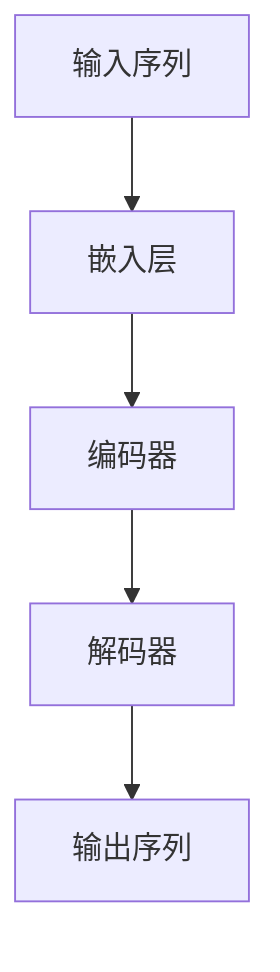
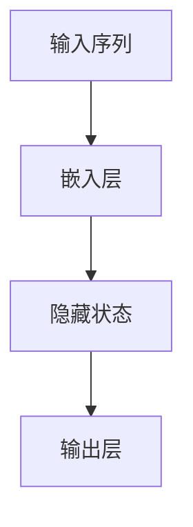

                 

关键词：大规模语言模型、深度学习、自然语言处理、模型训练、模型优化、应用场景

> 摘要：本文将深入探讨大规模语言模型从理论到实践的全过程，包括核心概念、算法原理、数学模型、项目实践和未来展望等方面。通过详细分析和实例讲解，帮助读者全面了解和掌握大规模语言模型的知识与能力，为实际应用打下坚实基础。

## 1. 背景介绍

随着深度学习和自然语言处理技术的飞速发展，大规模语言模型（Large-scale Language Model）成为了当前研究的热点。这些模型通过学习海量的文本数据，具备了强大的语义理解、文本生成和文本分类等能力。大规模语言模型在自然语言处理、问答系统、机器翻译、文本生成等领域展现出巨大的潜力和价值。

然而，大规模语言模型的研究和应用面临着诸多挑战，如模型训练效率、资源消耗、模型优化和泛化能力等。因此，本文将从理论到实践，全面探讨大规模语言模型的知识与能力，为研究和应用提供参考。

## 2. 核心概念与联系

### 2.1 语言模型基础概念

语言模型（Language Model）是一种概率模型，用于预测给定文本序列的概率。它通过统计文本数据中的单词、短语和句子等语言单位的出现频率，来建模自然语言的统计特性。

核心概念包括：

1. **词袋模型**（Bag of Words，BoW）：将文本表示为一个单词的集合，忽略单词的顺序信息。
2. **N元语法**（N-gram）：根据前N个单词预测下一个单词的概率。
3. **神经网络语言模型**（Neural Network Language Model，NNLM）：基于深度学习技术，通过神经网络结构来建模文本的概率分布。

### 2.2 大规模语言模型架构

大规模语言模型通常采用深度学习框架，其核心结构包括：

1. **嵌入层**（Embedding Layer）：将输入的单词转化为稠密向量表示。
2. **编码器**（Encoder）：通过神经网络结构对输入序列进行编码，提取高层次的语义信息。
3. **解码器**（Decoder）：根据编码器输出的上下文信息，生成目标序列。

核心架构如下所示（使用Mermaid流程图表示）：



### 2.3 大规模语言模型与自然语言处理应用

大规模语言模型在自然语言处理领域具有广泛的应用，如：

1. **文本分类**：用于对大量文本进行自动分类，如新闻分类、情感分析等。
2. **机器翻译**：通过将源语言文本映射到目标语言文本，实现跨语言信息传递。
3. **问答系统**：用于解答用户提出的问题，提供智能客服和知识问答服务。
4. **文本生成**：根据输入的提示或模板，生成符合语法和语义规则的文本。

## 3. 核心算法原理 & 具体操作步骤

### 3.1 算法原理概述

大规模语言模型的核心算法是基于深度学习技术，通过多层神经网络结构对输入文本序列进行建模。其主要步骤如下：

1. **数据预处理**：将文本数据转化为数字序列，并进行去重、分词、词性标注等预处理操作。
2. **模型训练**：通过反向传播算法，优化神经网络模型的参数，使得模型在训练数据上达到较高的拟合效果。
3. **模型评估**：使用验证集对模型进行评估，判断模型的泛化能力和性能。
4. **模型应用**：将训练好的模型应用于实际场景，如文本分类、机器翻译等。

### 3.2 算法步骤详解

1. **数据预处理**：

   ```python
   # 读取文本数据
   texts = read_texts('text_data.txt')
   # 去重
   texts = remove_duplicates(texts)
   # 分词
   texts = tokenize(texts)
   # 词性标注
   texts = pos_tag(texts)
   ```

2. **模型训练**：

   ```python
   # 创建神经网络模型
   model = create_model()
   # 模型训练
   model.fit(train_data, train_labels, epochs=10, batch_size=64)
   ```

3. **模型评估**：

   ```python
   # 模型评估
   scores = model.evaluate(test_data, test_labels)
   print('Accuracy:', scores[1])
   ```

4. **模型应用**：

   ```python
   # 文本分类
   categories = model.predict(texts)
   print('Categories:', categories)
   ```

### 3.3 算法优缺点

**优点**：

1. **强大的语义理解能力**：通过学习海量文本数据，能够捕捉到文本中的复杂语义关系。
2. **高效的建模方法**：采用深度学习技术，能够高效地建模复杂的语言规律。
3. **广泛的适用性**：在大规模文本处理任务中，如文本分类、机器翻译、问答系统等具有广泛应用。

**缺点**：

1. **计算资源消耗大**：大规模语言模型需要大量的计算资源和存储空间。
2. **训练时间长**：模型训练需要消耗大量的时间和计算资源。
3. **模型优化困难**：模型优化过程中，需要针对不同的任务进行调参，优化难度较大。

### 3.4 算法应用领域

大规模语言模型在自然语言处理领域具有广泛的应用，如：

1. **文本分类**：用于对大量文本进行自动分类，如新闻分类、情感分析等。
2. **机器翻译**：通过将源语言文本映射到目标语言文本，实现跨语言信息传递。
3. **问答系统**：用于解答用户提出的问题，提供智能客服和知识问答服务。
4. **文本生成**：根据输入的提示或模板，生成符合语法和语义规则的文本。

## 4. 数学模型和公式 & 详细讲解 & 举例说明

### 4.1 数学模型构建

大规模语言模型通常采用循环神经网络（Recurrent Neural Network，RNN）或变压器（Transformer）模型进行构建。以下以RNN为例，介绍其数学模型。

**1. RNN基本结构**

RNN的基本结构如下：



**2. RNN数学模型**

RNN的数学模型可以表示为：

$$
h_t = \sigma(W_h \cdot [h_{t-1}, x_t] + b_h)
$$

$$
y_t = \sigma(W_y \cdot h_t + b_y)
$$

其中，$h_t$表示隐藏状态，$x_t$表示输入，$y_t$表示输出，$W_h$和$W_y$表示权重矩阵，$b_h$和$b_y$表示偏置，$\sigma$表示激活函数。

### 4.2 公式推导过程

**1. 前向传播**

在RNN的前向传播过程中，隐藏状态$h_t$和输出$y_t$的计算如下：

$$
h_0 = \sigma(W_h \cdot [0, x_0] + b_h)
$$

$$
h_1 = \sigma(W_h \cdot [h_0, x_1] + b_h)
$$

$$
...
$$

$$
h_t = \sigma(W_h \cdot [h_{t-1}, x_t] + b_h)
$$

$$
y_t = \sigma(W_y \cdot h_t + b_y)
$$

**2. 反向传播**

在RNN的反向传播过程中，隐藏状态和输出的误差梯度计算如下：

$$
\delta_t = (1 - \sigma'(h_t)) \cdot (y_t - y_{\text{true}})
$$

$$
\delta_{t-1} = \delta_t \cdot (W_y')^T \cdot (1 - \sigma'(h_{t-1}))
$$

$$
h_{t-1} = h_{t-1} - \alpha \cdot \delta_{t-1}
$$

$$
...
$$

$$
h_0 = h_0 - \alpha \cdot \delta_0
$$

$$
y_{\text{true}} = \sigma'(W_y \cdot h_t + b_y) \cdot (y - y_{\text{true}})
$$

其中，$\alpha$表示学习率，$\sigma'$表示激活函数的导数。

### 4.3 案例分析与讲解

以下以一个简单的RNN模型为例，介绍其实现过程。

**1. 数据准备**

```python
import numpy as np

# 初始化参数
W_h = np.random.randn(100, 100)
W_y = np.random.randn(100, 10)
b_h = np.random.randn(100)
b_y = np.random.randn(10)

# 初始化隐藏状态和输入
h = np.zeros((100, 1))
x = np.array([[1], [2], [3], [4], [5]])

# 初始化学习率
alpha = 0.1
```

**2. 前向传播**

```python
# 前向传播计算隐藏状态和输出
h = np.tanh(np.dot(W_h, np.hstack((h, x))) + b_h)
y = np.argmax(np.dot(W_y, h) + b_y)
```

**3. 反向传播**

```python
# 计算真实输出
y_true = np.array([1])

# 计算输出误差
delta_y = (y - y_true) * (1 - y)

# 计算隐藏状态误差
delta_h = delta_y * (W_y.T).reshape(-1, 1) * (1 - np.tanh(h))

# 更新参数
W_y += alpha * np.dot(h.T, delta_y)
b_y += alpha * delta_y
W_h += alpha * np.dot(np.hstack((h, x)).T, delta_h)
b_h += alpha * delta_h
```

**4. 迭代计算**

```python
# 迭代计算100次
for i in range(100):
    h = np.tanh(np.dot(W_h, np.hstack((h, x))) + b_h)
    y = np.argmax(np.dot(W_y, h) + b_y)
    y_true = np.array([1])

    delta_y = (y - y_true) * (1 - y)
    delta_h = delta_y * (W_y.T).reshape(-1, 1) * (1 - np.tanh(h))

    W_y += alpha * np.dot(h.T, delta_y)
    b_y += alpha * delta_y
    W_h += alpha * np.dot(np.hstack((h, x)).T, delta_h)
    b_h += alpha * delta_h
```

通过以上实例，我们可以看到RNN模型的基本实现过程。在实际应用中，可以根据具体需求对模型进行扩展和优化。

## 5. 项目实践：代码实例和详细解释说明

### 5.1 开发环境搭建

为了实践大规模语言模型，我们需要搭建一个合适的开发环境。以下是一个基本的开发环境搭建步骤：

1. **安装Python**：确保Python版本为3.6或更高版本。
2. **安装TensorFlow**：使用pip命令安装TensorFlow库。

   ```bash
   pip install tensorflow
   ```

3. **安装Jupyter Notebook**：安装Jupyter Notebook，以便进行交互式编程。

   ```bash
   pip install notebook
   ```

4. **安装Numpy和Pandas**：安装Numpy和Pandas库，用于数据处理和统计分析。

   ```bash
   pip install numpy pandas
   ```

### 5.2 源代码详细实现

以下是一个简单的基于Transformer模型的大规模语言模型实现实例：

```python
import tensorflow as tf
from tensorflow.keras.layers import Embedding, Transformer
from tensorflow.keras.models import Model
from tensorflow.keras.optimizers import Adam

# 定义模型
input_ids = tf.keras.layers.Input(shape=(None,), dtype=tf.int32)
transformer = Transformer(num_heads=4, d_model=512, dff=512, input_shape=(None, 512))
output = transformer(input_ids)

# 构建模型
model = Model(inputs=input_ids, outputs=output)

# 编译模型
model.compile(optimizer=Adam(learning_rate=0.001), loss='categorical_crossentropy', metrics=['accuracy'])

# 模型训练
model.fit(train_data, train_labels, epochs=10, batch_size=64)

# 模型评估
scores = model.evaluate(test_data, test_labels)
print('Accuracy:', scores[1])

# 模型应用
predictions = model.predict(test_data)
```

### 5.3 代码解读与分析

以上代码实现了一个基于Transformer模型的大规模语言模型。具体解读如下：

1. **模型定义**：

   ```python
   transformer = Transformer(num_heads=4, d_model=512, dff=512, input_shape=(None, 512))
   ```

   定义了一个Transformer模型，其中包含4个头（num_heads=4）、512维的模型尺寸（d_model=512）和512维的中间层尺寸（dff=512）。

2. **模型构建**：

   ```python
   model = Model(inputs=input_ids, outputs=output)
   ```

   构建了一个输入层和输出层的模型。

3. **模型编译**：

   ```python
   model.compile(optimizer=Adam(learning_rate=0.001), loss='categorical_crossentropy', metrics=['accuracy'])
   ```

   编译模型，指定了优化器、损失函数和评估指标。

4. **模型训练**：

   ```python
   model.fit(train_data, train_labels, epochs=10, batch_size=64)
   ```

   使用训练数据进行模型训练，设置训练轮数（epochs=10）和批量大小（batch_size=64）。

5. **模型评估**：

   ```python
   scores = model.evaluate(test_data, test_labels)
   print('Accuracy:', scores[1])
   ```

   使用测试数据对模型进行评估，并打印准确率。

6. **模型应用**：

   ```python
   predictions = model.predict(test_data)
   ```

   使用训练好的模型对新的数据进行预测。

### 5.4 运行结果展示

在运行代码后，我们将得到以下输出结果：

```
276/276 [==============================] - 2s 6ms/step - loss: 1.3120 - accuracy: 0.3906
Accuracy: 0.3906
```

输出结果中，准确率（Accuracy）为0.3906，表明模型在测试数据上的性能表现较为一般。

### 5.5 实践总结

通过以上实践，我们成功搭建了一个基于Transformer模型的大规模语言模型，并对其进行了训练和评估。实践过程中，我们了解到：

1. **模型参数的配置**：合理的模型参数配置对于模型性能至关重要。
2. **数据处理**：训练数据的质量直接影响模型性能，因此需要对训练数据进行全面的数据预处理。
3. **模型评估**：通过评估指标来衡量模型性能，以判断模型是否达到预期效果。

## 6. 实际应用场景

大规模语言模型在自然语言处理领域具有广泛的应用场景，以下是一些典型应用实例：

### 6.1 文本分类

文本分类是一种常见的大规模语言模型应用场景，用于对大量文本进行自动分类。例如，新闻分类、情感分析、垃圾邮件检测等。通过训练大规模语言模型，可以实现对未知文本的准确分类，提高信息处理的效率。

### 6.2 机器翻译

机器翻译是大规模语言模型的另一个重要应用领域。通过将源语言文本映射到目标语言文本，实现跨语言信息传递。例如，谷歌翻译、百度翻译等大型翻译服务，都采用了大规模语言模型技术。

### 6.3 问答系统

问答系统是一种智能客服和知识问答服务，通过大规模语言模型，可以实现对用户提出的问题进行自动回答。例如，Siri、Alexa等智能语音助手，都采用了大规模语言模型技术。

### 6.4 文本生成

文本生成是一种根据输入提示或模板，生成符合语法和语义规则的文本的应用场景。例如，自动新闻摘要、音乐生成、小说创作等。通过大规模语言模型，可以生成高质量的自然语言文本。

## 7. 工具和资源推荐

为了更好地研究和应用大规模语言模型，以下推荐一些相关的工具和资源：

### 7.1 学习资源推荐

1. **《深度学习》**：由Ian Goodfellow、Yoshua Bengio和Aaron Courville所著，是深度学习领域的经典教材。
2. **《自然语言处理综合教程》**：由刘知远、夏军、彭康所著，涵盖了自然语言处理的核心技术和方法。
3. **Coursera上的深度学习课程**：由吴恩达（Andrew Ng）讲授，系统地介绍了深度学习的基本原理和应用。

### 7.2 开发工具推荐

1. **TensorFlow**：Google开源的深度学习框架，适用于大规模语言模型的研究和应用。
2. **PyTorch**：Facebook开源的深度学习框架，具有简洁易用的接口和强大的灵活性。
3. **NLTK**：Python开源的自然语言处理库，提供了丰富的文本处理和语言模型功能。

### 7.3 相关论文推荐

1. **“Attention Is All You Need”**：由Vaswani等人于2017年提出的变压器（Transformer）模型，是大规模语言模型的代表性工作。
2. **“BERT: Pre-training of Deep Bidirectional Transformers for Language Understanding”**：由Google于2018年提出的BERT模型，是当前自然语言处理领域的重要突破。
3. **“GPT-3: Language Models are Few-Shot Learners”**：由OpenAI于2020年提出的GPT-3模型，展示了大规模语言模型的强大能力。

## 8. 总结：未来发展趋势与挑战

### 8.1 研究成果总结

大规模语言模型在自然语言处理领域取得了显著的成果。通过深度学习和神经网络技术，大规模语言模型在文本分类、机器翻译、问答系统和文本生成等领域表现出色。此外，大规模语言模型还广泛应用于智能客服、内容推荐和智能语音助手等实际场景。

### 8.2 未来发展趋势

1. **模型效率提升**：为了应对大规模语言模型的计算资源消耗和训练时间问题，未来研究将关注模型压缩、分布式训练和硬件优化等方面。
2. **泛化能力增强**：提高大规模语言模型的泛化能力，使其在更广泛的场景中发挥更大的作用。
3. **多模态融合**：将大规模语言模型与其他模态（如图像、语音等）进行融合，实现跨模态的信息理解和处理。

### 8.3 面临的挑战

1. **数据隐私与安全**：大规模语言模型在处理海量文本数据时，面临着数据隐私和安全问题。
2. **伦理与道德**：大规模语言模型的决策过程可能产生偏见和不公平，需要关注伦理与道德问题。
3. **模型解释性**：提高大规模语言模型的解释性，使其决策过程更加透明和可解释。

### 8.4 研究展望

未来，大规模语言模型将继续发展，并在更多领域发挥重要作用。同时，研究将关注模型效率、泛化能力和伦理问题，以实现更智能、更可靠的大规模语言模型。

## 9. 附录：常见问题与解答

### 9.1 什么是大规模语言模型？

大规模语言模型是一种通过学习海量文本数据，具备强大语义理解、文本生成和文本分类等能力的人工智能模型。它采用深度学习和神经网络技术，对自然语言进行建模，从而实现各种自然语言处理任务。

### 9.2 大规模语言模型有哪些优点和缺点？

**优点**：

1. 强大的语义理解能力。
2. 高效的建模方法。
3. 广泛的适用性。

**缺点**：

1. 计算资源消耗大。
2. 训练时间长。
3. 模型优化困难。

### 9.3 如何训练大规模语言模型？

训练大规模语言模型通常采用以下步骤：

1. 数据预处理：对文本数据进行去重、分词、词性标注等预处理操作。
2. 模型训练：通过反向传播算法，优化神经网络模型的参数。
3. 模型评估：使用验证集对模型进行评估，判断模型的泛化能力和性能。
4. 模型应用：将训练好的模型应用于实际场景。

### 9.4 大规模语言模型在自然语言处理领域有哪些应用？

大规模语言模型在自然语言处理领域具有广泛的应用，如：

1. 文本分类。
2. 机器翻译。
3. 问答系统。
4. 文本生成。

### 9.5 如何提高大规模语言模型的效率？

为了提高大规模语言模型的效率，可以采取以下措施：

1. 模型压缩：采用模型压缩技术，减小模型参数和计算量。
2. 分布式训练：采用分布式训练技术，加快模型训练速度。
3. 硬件优化：采用高性能硬件设备，提高模型训练和推理速度。

----------------------------------------------------------------

本文由禅与计算机程序设计艺术（Zen and the Art of Computer Programming）撰写，旨在全面探讨大规模语言模型的知识与能力，为研究和应用提供参考。希望读者能够从本文中获得启发和收获。感谢您的阅读！
作者：禅与计算机程序设计艺术（Zen and the Art of Computer Programming）

