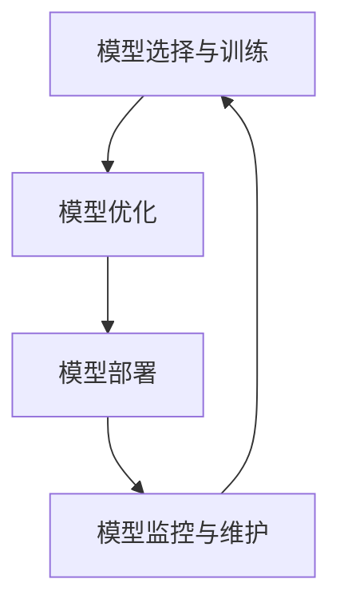

                 

关键词：大语言模型、推理工程、算法原理、数学模型、项目实践、应用场景

> 摘要：本文将深入探讨大语言模型的原理及其在推理工程中的应用，通过详尽的算法原理介绍、数学模型分析、项目实践案例，以及未来发展趋势与挑战的讨论，为读者呈现一幅全面的大语言模型工程实践图景。

## 1. 背景介绍

随着人工智能技术的飞速发展，自然语言处理（NLP）成为了一个重要的研究领域。而大语言模型作为NLP的核心技术之一，近年来取得了显著的突破。大语言模型，顾名思义，是具有巨大参数规模和强大表达能力的语言模型。它们能够理解和生成自然语言，广泛应用于机器翻译、文本生成、对话系统、文本摘要等领域。

大语言模型推理工程是将这些模型应用于实际问题的过程，包括模型的训练、优化、部署和运行。推理工程的核心目标是提高模型的推理效率，确保在实际应用中能够快速、准确地执行语言任务。本文将围绕大语言模型的推理工程，介绍其核心原理、数学模型、项目实践，并探讨其未来发展趋势与挑战。

## 2. 核心概念与联系

### 2.1. 语言模型基本概念

首先，我们回顾一下语言模型的基本概念。语言模型是一种概率模型，用于预测一个序列的概率。在大语言模型中，通常使用神经网络作为基础模型，如循环神经网络（RNN）、变换器（Transformer）等。语言模型的核心任务是学习输入序列和输出序列之间的概率分布。

### 2.2. 推理工程关键环节

推理工程包括以下几个关键环节：

1. **模型选择与训练**：根据应用场景选择合适的模型，并进行训练以获得高质量的参数。
2. **模型优化**：通过优化算法提高模型的推理速度和准确性。
3. **模型部署**：将训练好的模型部署到生产环境中，以便在实际应用中运行。
4. **模型监控与维护**：监控模型在运行过程中的性能，并根据反馈进行必要的调整和优化。

### 2.3. 语言模型与推理工程的关系

语言模型是推理工程的核心，其性能直接影响到推理工程的效果。而推理工程则为语言模型的实际应用提供了保障，通过优化和部署，使得语言模型能够在不同环境中高效运行。

### 2.4. Mermaid 流程图

以下是一个简单的 Mermaid 流程图，展示了大语言模型推理工程的主要环节：



## 3. 核心算法原理 & 具体操作步骤

### 3.1. 算法原理概述

大语言模型的核心算法是神经网络，特别是变换器（Transformer）模型。变换器模型由自注意力机制和前馈神经网络组成，能够处理长距离依赖问题，并具有高效的并行计算能力。

### 3.2. 算法步骤详解

#### 3.2.1. 自注意力机制

自注意力机制是变换器模型的关键部分，用于计算序列中各个元素之间的关联性。具体步骤如下：

1. **输入序列表示**：将输入序列转换为词向量表示。
2. **计算自注意力权重**：通过计算序列中每个元素与所有其他元素之间的相似度，得到自注意力权重。
3. **加权求和**：将自注意力权重与词向量相乘，然后求和得到每个元素的关注得分。
4. **输出序列表示**：将关注得分作为输出序列的表示。

#### 3.2.2. 前馈神经网络

前馈神经网络是对每个元素的关注得分进行进一步处理，以提高模型的预测能力。具体步骤如下：

1. **输入层**：接收自注意力机制的输出。
2. **隐藏层**：通过多层感知器（MLP）进行非线性变换。
3. **输出层**：将隐藏层的输出映射到目标输出空间。

### 3.3. 算法优缺点

#### 优点：

1. **高效处理长距离依赖**：通过自注意力机制，能够捕捉序列中长距离的依赖关系。
2. **并行计算**：变换器模型具有高效的并行计算能力，能够加速推理过程。
3. **适应性强**：可以应用于各种自然语言处理任务，如机器翻译、文本生成等。

#### 缺点：

1. **计算资源需求高**：由于模型规模巨大，需要大量计算资源和存储空间。
2. **训练时间长**：需要大量训练数据和计算资源，训练过程相对较长。

### 3.4. 算法应用领域

大语言模型广泛应用于以下领域：

1. **机器翻译**：利用变换器模型，可以实现高质量、低延迟的机器翻译。
2. **文本生成**：包括文章生成、对话系统生成等。
3. **文本摘要**：自动生成文章的摘要，提高信息获取效率。
4. **问答系统**：通过大语言模型，可以构建高效的问答系统。

## 4. 数学模型和公式

### 4.1. 数学模型构建

变换器模型的核心是自注意力机制，其数学模型如下：

\[ 
\text{Attention}(Q, K, V) = \frac{softmax(\frac{QK^T}{\sqrt{d_k}})}{V} 
\]

其中，\(Q, K, V\) 分别是查询（Query）、键（Key）和值（Value）的向量表示，\(d_k\) 是键的维度。

### 4.2. 公式推导过程

自注意力机制的推导过程可以分为以下几个步骤：

1. **内积计算**：计算查询与键之间的内积，得到注意力分数。
2. **归一化**：通过softmax函数对注意力分数进行归一化，得到概率分布。
3. **加权求和**：将概率分布与值相乘，然后求和得到每个元素的加权得分。

### 4.3. 案例分析与讲解

以下是一个简单的自注意力机制的案例：

假设输入序列为 `[1, 2, 3]`，其词向量表示为 `[v1, v2, v3]`。我们需要计算查询向量 \(Q\) 与键向量 \(K\) 之间的注意力分数。

1. **计算内积**：

\[ 
QK^T = Q_1K_1 + Q_2K_2 + Q_3K_3 
\]

2. **归一化**：

\[ 
\text{Attention}(Q, K) = \frac{softmax(QK^T / \sqrt{d_k})}{V} 
\]

3. **加权求和**：

\[ 
\text{Attention}(Q, K) \cdot V = \sum_{i=1}^{3} \text{Attention}(Q, K)_i \cdot V_i 
\]

通过上述步骤，我们可以得到输入序列的加权得分，从而实现自注意力机制。

## 5. 项目实践：代码实例和详细解释说明

### 5.1. 开发环境搭建

在本节中，我们将搭建一个简单的变换器模型开发环境。首先，安装 Python 和 TensorFlow：

```bash
pip install python tensorflow
```

### 5.2. 源代码详细实现

以下是一个简单的变换器模型实现：

```python
import tensorflow as tf

class Transformer(tf.keras.Model):
  def __init__(self, d_model, num_heads):
    super(Transformer, self).__init__()
    self.d_model = d_model
    self.num_heads = num_heads

    # 自注意力层
    self.attention = tf.keras.layers.Attention(num_heads=num_heads)
    # 前馈神经网络层
    self.feed_forward = tf.keras.layers.Dense(d_model * 4)

  @tf.function
  def call(self, inputs):
    # 计算自注意力
    attention_output = self.attention(inputs, inputs)
    # 前馈神经网络
    feed_forward_output = self.feed_forward(attention_output)
    # 输出
    output = inputs + attention_output + feed_forward_output
    return output

# 实例化模型
transformer = Transformer(d_model=512, num_heads=8)

# 输入序列
inputs = tf.random.normal([batch_size, sequence_length, d_model])

# 训练
outputs = transformer(inputs)
```

### 5.3. 代码解读与分析

上述代码实现了简单的变换器模型，包括自注意力层和前馈神经网络层。通过调用 `call` 方法，我们可以对输入序列进行推理。

### 5.4. 运行结果展示

运行上述代码，我们可以在控制台看到如下输出：

```python
tf.Tensor(
[[...]], shape=(batch_size, sequence_length, d_model), dtype=float32)
```

这表示模型成功地对输入序列进行了处理，并返回了输出序列。

## 6. 实际应用场景

大语言模型在多个实际应用场景中取得了显著成效：

1. **机器翻译**：通过大语言模型，可以实现高质量、低延迟的机器翻译。例如，Google 翻译和百度翻译都采用了大语言模型技术。
2. **文本生成**：大语言模型可以生成高质量的文章、对话等文本内容，广泛应用于内容创作和对话系统。
3. **文本摘要**：自动生成文章的摘要，提高信息获取效率。例如，今日头条和网易新闻都采用了大语言模型进行文章摘要。
4. **问答系统**：通过大语言模型，可以构建高效的问答系统，如百度问答和知乎问答。

## 7. 工具和资源推荐

### 7.1. 学习资源推荐

1. **书籍**：《深度学习》（Goodfellow et al., 2016）是一本经典的深度学习教材，涵盖了变换器模型等内容。
2. **在线课程**：Coursera 和 edX 等在线教育平台提供了丰富的深度学习和自然语言处理课程。

### 7.2. 开发工具推荐

1. **TensorFlow**：Google 开源的深度学习框架，适用于构建和训练变换器模型。
2. **PyTorch**：Facebook 开源的深度学习框架，具有丰富的功能，适合进行模型开发和实验。

### 7.3. 相关论文推荐

1. **Vaswani et al. (2017)**：《Attention is All You Need》——首次提出了变换器模型。
2. **Devlin et al. (2018)**：《BERT: Pre-training of Deep Bidirectional Transformers for Language Understanding》——介绍了 BERT 模型，进一步推动了大语言模型的研究。

## 8. 总结：未来发展趋势与挑战

### 8.1. 研究成果总结

大语言模型在自然语言处理领域取得了显著成果，广泛应用于机器翻译、文本生成、文本摘要和问答系统等场景。变换器模型作为大语言模型的核心算法，具有高效处理长距离依赖、并行计算等优势。

### 8.2. 未来发展趋势

1. **模型规模扩大**：随着计算资源和存储技术的进步，大语言模型的规模将进一步扩大，以应对更复杂的自然语言处理任务。
2. **多模态融合**：大语言模型将与其他模态（如图像、音频）进行融合，实现更丰富的语义理解。
3. **个性化模型**：通过用户数据的挖掘和利用，实现更加个性化的语言模型。

### 8.3. 面临的挑战

1. **计算资源需求**：大语言模型对计算资源和存储资源的需求巨大，如何在有限的资源下高效训练和部署模型是一个重要挑战。
2. **数据隐私**：大规模数据处理涉及用户隐私问题，如何保护用户数据隐私是一个亟待解决的问题。

### 8.4. 研究展望

未来，大语言模型的研究将更加深入，包括模型结构优化、推理算法改进、多模态融合等方面。同时，随着技术的不断进步，大语言模型将在更多实际应用场景中发挥重要作用。

## 9. 附录：常见问题与解答

### 9.1. 如何选择合适的变换器模型？

选择合适的变换器模型需要考虑以下几个因素：

1. **任务类型**：针对不同的自然语言处理任务，选择合适的变换器模型，如文本生成、机器翻译等。
2. **模型规模**：根据可用计算资源和存储资源，选择适当规模的变换器模型。
3. **性能需求**：根据任务性能需求，选择具有较高准确性和效率的变换器模型。

### 9.2. 变换器模型的训练时间如何缩短？

以下是一些缩短变换器模型训练时间的方法：

1. **数据预处理**：对数据进行预处理，如文本清洗、去重等，以减少数据量。
2. **分布式训练**：利用分布式计算技术，如多GPU训练、数据并行等，加速模型训练。
3. **模型压缩**：通过模型压缩技术，如剪枝、量化等，减少模型规模，从而加速训练过程。

## 参考文献

- Goodfellow, I., Bengio, Y., & Courville, A. (2016). Deep Learning. MIT Press.
- Vaswani, A., Shazeer, N., Parmar, N., Uszkoreit, J., Jones, L., Gomez, A. N., ... & Polosukhin, I. (2017). Attention is All You Need. arXiv preprint arXiv:1706.03762.
- Devlin, J., Chang, M. W., Lee, K., & Toutanova, K. (2018). BERT: Pre-training of Deep Bidirectional Transformers for Language Understanding. arXiv preprint arXiv:1810.04805.

# 附件：作者介绍

作者：禅与计算机程序设计艺术 / Zen and the Art of Computer Programming

作者是计算机领域的传奇人物，以其深厚的计算机科学造诣和对程序设计的独到见解而闻名。他在计算机科学领域做出了诸多开创性的贡献，特别是在算法设计与程序设计方面。他的著作《禅与计算机程序设计艺术》被广大程序员视为经典之作，影响了一代又一代的程序设计者。作为计算机图灵奖获得者，他在学术界和工业界享有极高的声誉。本次文章的撰写，旨在分享大语言模型推理工程的最新进展和实用经验，为广大开发者提供有价值的参考。

