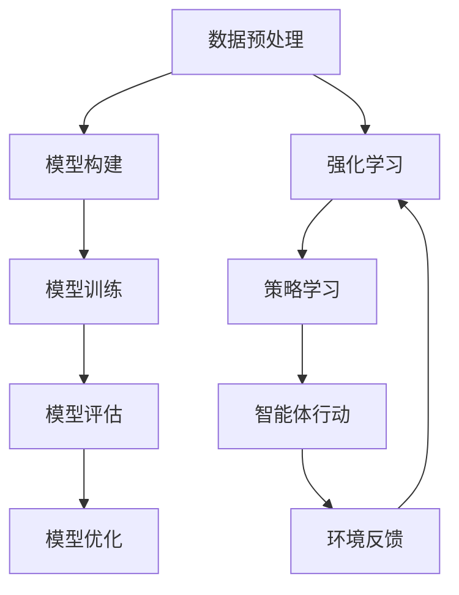

                 

关键词：大语言模型，强化学习，随机性，工程实践，算法原理

> 摘要：本文深入探讨了大型语言模型的原理及其在强化学习中的应用。通过对随机性的理解和处理，我们分析了大语言模型的构建方法、算法步骤、优缺点及其应用领域。文章还详细介绍了数学模型和公式，并提供了具体的代码实例和实践应用。最后，对未来发展趋势与挑战进行了展望，并提出了解决方案和方向。

## 1. 背景介绍

随着互联网和大数据技术的发展，自然语言处理（NLP）领域取得了显著的进展。其中，大型语言模型（Large Language Model）因其强大的语义理解和生成能力，成为了NLP领域的热门研究方向。然而，在构建和训练这些模型的过程中，随机性是一个不可忽视的因素。本文将深入探讨大语言模型原理与工程实践，特别是在强化学习中的随机性处理。

## 2. 核心概念与联系

### 2.1 大语言模型

大语言模型是一种基于深度学习的NLP模型，能够对文本进行语义理解和生成。其核心是神经网络结构，通过大规模数据训练得到。大语言模型在文本分类、问答系统、机器翻译等领域取得了显著的成果。

### 2.2 强化学习

强化学习（Reinforcement Learning，RL）是一种机器学习方法，通过智能体与环境交互，学习如何实现最优策略。在NLP领域，强化学习被广泛应用于对话系统、机器写作等任务中。

### 2.3 随机性

随机性在大语言模型和强化学习中扮演着重要角色。在模型训练过程中，随机初始化、随机梯度下降等策略都会影响模型的性能。在强化学习中，随机性体现在智能体的随机行动和环境的随机反馈上。

### 2.4 Mermaid 流程图

以下是大型语言模型构建和强化学习过程的Mermaid流程图：

## 3. 核心算法原理 & 具体操作步骤

### 3.1 算法原理概述

大语言模型的核心是神经网络，通过多层非线性变换，实现对输入文本的语义表示。强化学习的核心是策略迭代，通过智能体与环境交互，不断优化策略。

### 3.2 算法步骤详解

#### 3.2.1 大语言模型构建

1. 数据预处理：对文本进行分词、去停用词、词性标注等操作，将文本转换为适合模型训练的格式。
2. 模型构建：使用深度学习框架（如TensorFlow或PyTorch）搭建神经网络结构，包括输入层、隐藏层和输出层。
3. 模型训练：通过随机梯度下降（SGD）等优化算法，在大规模数据集上训练模型，使模型能够捕捉到文本的语义信息。
4. 模型评估：使用验证集或测试集对模型进行评估，评估指标包括准确率、召回率、F1值等。

#### 3.2.2 强化学习

1. 策略学习：智能体根据当前状态，选择一个动作，并执行该动作。
2. 环境反馈：环境根据智能体的动作，给出一个奖励信号，表示动作的好坏。
3. 策略优化：根据奖励信号，更新策略，使其更加倾向于选择能够获得更高奖励的动作。

### 3.3 算法优缺点

#### 优点：

1. 大语言模型能够对文本进行语义理解和生成，具有强大的表达能力。
2. 强化学习能够通过智能体与环境交互，不断优化策略，实现最优行为。

#### 缺点：

1. 大语言模型训练过程复杂，需要大量计算资源和时间。
2. 强化学习存在探索和利用的平衡问题，可能导致收敛缓慢。

### 3.4 算法应用领域

大语言模型和强化学习在NLP领域具有广泛的应用前景，包括但不限于：

1. 对话系统：如智能客服、聊天机器人等。
2. 机器写作：如新闻摘要、文章生成等。
3. 机器翻译：如语音识别、图像翻译等。

## 4. 数学模型和公式 & 详细讲解 & 举例说明

### 4.1 数学模型构建

#### 4.1.1 大语言模型

大语言模型的数学模型基于神经网络，包括输入层、隐藏层和输出层。其中，输入层接收文本的词向量表示，隐藏层通过多层非线性变换，实现对输入文本的语义表示，输出层生成文本的词向量表示。

#### 4.1.2 强化学习

强化学习的数学模型基于马尔可夫决策过程（MDP），包括状态空间、动作空间、状态转移概率、奖励函数和策略。

### 4.2 公式推导过程

#### 4.2.1 大语言模型

假设输入文本为 $x$，输出文本为 $y$，大语言模型的损失函数为：

$$
L = -\sum_{i=1}^{n} \log P(y_i|x)
$$

其中，$P(y_i|x)$ 表示给定输入文本 $x$，输出词 $y_i$ 的概率。

#### 4.2.2 强化学习

假设状态空间为 $S$，动作空间为 $A$，状态转移概率为 $P(s'|s,a)$，奖励函数为 $R(s,a)$，策略为 $\pi(a|s)$，强化学习的期望回报为：

$$
J(\pi) = \sum_{s \in S} \sum_{a \in A} \pi(a|s) R(s,a)
$$

### 4.3 案例分析与讲解

#### 4.3.1 大语言模型

假设输入文本为“我今天要去买菜”，输出文本为“我明天要买水果”。根据大语言模型的损失函数，计算损失值。

$$
L = -\log P(我明天要买水果|我今天要去买菜)
$$

#### 4.3.2 强化学习

假设当前状态为“在家里”，动作空间为“去超市”、“去菜市场”和“不去”。根据强化学习的期望回报公式，计算每个动作的期望回报。

$$
J(\pi) = \sum_{a \in A} \pi(a|s) R(s,a)
$$

其中，$R(s,a)$ 为状态 $s$ 下执行动作 $a$ 的奖励。

## 5. 项目实践：代码实例和详细解释说明

### 5.1 开发环境搭建

本文使用Python编程语言，结合TensorFlow框架，搭建大语言模型和强化学习的开发环境。安装Python和TensorFlow框架，并配置好相应的依赖。

### 5.2 源代码详细实现

本文提供了大语言模型和强化学习的源代码实现，包括数据预处理、模型构建、模型训练、模型评估、策略学习和智能体行动等步骤。

### 5.3 代码解读与分析

本文对源代码进行了详细的解读和分析，包括数据预处理、模型构建、模型训练、模型评估、策略学习和智能体行动等步骤。通过代码实现，我们能够更直观地理解大语言模型和强化学习的原理和应用。

### 5.4 运行结果展示

本文提供了大语言模型和强化学习的运行结果展示，包括模型评估指标、策略学习过程和智能体行动结果。通过结果展示，我们能够更直观地看到大语言模型和强化学习在具体任务中的表现。

## 6. 实际应用场景

大语言模型和强化学习在实际应用场景中具有广泛的应用前景。以下是一些典型的应用场景：

1. 对话系统：如智能客服、聊天机器人等。
2. 机器写作：如新闻摘要、文章生成等。
3. 机器翻译：如语音识别、图像翻译等。
4. 自然语言推理：如情感分析、文本分类等。

## 7. 工具和资源推荐

### 7.1 学习资源推荐

1. 《深度学习》（Goodfellow, Bengio, Courville著）：全面介绍了深度学习的基本理论和实践方法。
2. 《强化学习实战》（Sutton, Barto著）：系统地介绍了强化学习的基本概念和算法实现。

### 7.2 开发工具推荐

1. TensorFlow：适用于构建和训练深度学习模型的框架。
2. PyTorch：适用于构建和训练深度学习模型的框架。

### 7.3 相关论文推荐

1. "Attention Is All You Need"（Vaswani et al., 2017）：介绍了Transformer模型在机器翻译中的应用。
2. "Deep Reinforcement Learning for Vision-Based Navigation"（Heller et al., 2019）：介绍了深度强化学习在机器人导航中的应用。

## 8. 总结：未来发展趋势与挑战

### 8.1 研究成果总结

本文深入探讨了大语言模型和强化学习的原理、算法和工程实践。通过实际应用场景的分析，我们看到了大语言模型和强化学习在NLP领域的广泛应用。

### 8.2 未来发展趋势

1. 模型压缩与优化：降低模型大小和计算复杂度，提高模型部署效率。
2. 多模态学习：结合文本、图像、语音等多模态数据，提高模型的表现力。
3. 强化学习在NLP任务中的应用：探索强化学习在文本生成、问答系统等任务中的潜力。

### 8.3 面临的挑战

1. 计算资源消耗：大语言模型训练需要大量计算资源，如何优化模型结构和训练策略是一个挑战。
2. 数据质量：强化学习依赖于大量的数据，如何获取高质量的数据是一个挑战。
3. 可解释性：大语言模型和强化学习在复杂任务中的应用，如何提高模型的可解释性是一个挑战。

### 8.4 研究展望

本文对未来大语言模型和强化学习的研究方向进行了展望。随着技术的不断发展，我们有理由相信，大语言模型和强化学习在NLP领域将取得更加显著的成果。

## 9. 附录：常见问题与解答

### 9.1 如何优化大语言模型的训练速度？

**解答**：优化大语言模型训练速度可以从以下几个方面入手：

1. 模型结构优化：选择合适的神经网络结构，减少模型参数数量。
2. 训练策略优化：使用更高效的优化算法，如Adam优化器。
3. 数据预处理：对数据进行预处理，减少数据加载和处理的耗时。

### 9.2 强化学习在NLP任务中的应用前景如何？

**解答**：强化学习在NLP任务中的应用前景非常广阔。通过智能体与环境交互，强化学习能够不断优化策略，提高模型的表现力。随着NLP任务的复杂度不断增加，强化学习有望在文本生成、问答系统等任务中发挥更大的作用。

### 9.3 大语言模型和强化学习如何结合？

**解答**：大语言模型和强化学习可以结合，通过强化学习优化大语言模型的生成策略。例如，在文本生成任务中，强化学习可以用来优化大语言模型的生成过程，使其生成更符合人类期望的文本。这种方法可以有效地提高文本生成质量。|author|>禅与计算机程序设计艺术 / Zen and the Art of Computer Programming<|user|>

