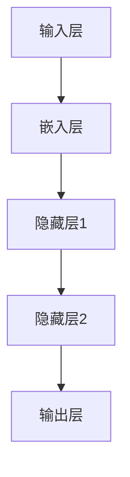
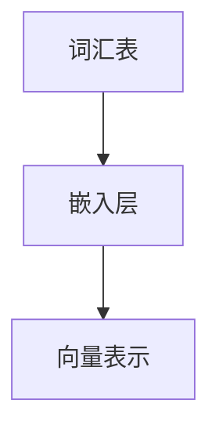
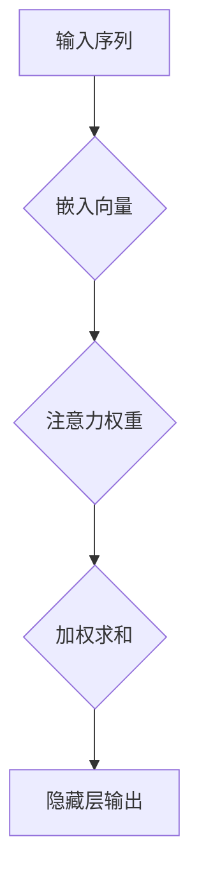
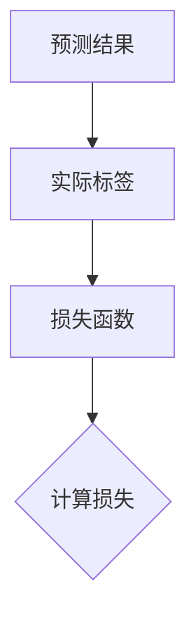
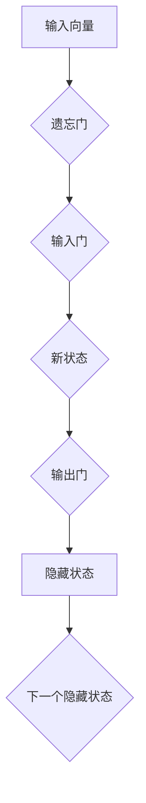

                 

关键词：大语言模型、深度学习、自然语言处理、工程实践、案例研究、神经网络架构、训练策略、优化方法、应用场景

> 摘要：本文将深入探讨大语言模型的原理及其工程实践。通过介绍核心概念、算法原理、数学模型以及具体项目实践，读者可以全面了解大语言模型的工作机制和实际应用，为未来的研究和开发提供参考。

## 1. 背景介绍

随着互联网和移动设备的普及，人类生成和消费的数据量呈指数级增长。特别是在自然语言领域，从文本、语音到图像等多种形式的语言数据正不断涌现。这为自然语言处理（NLP）技术带来了前所未有的发展机遇和挑战。大语言模型作为NLP领域的关键技术，近年来取得了显著进展，为文本生成、机器翻译、问答系统等多种应用提供了强大的支持。

大语言模型的兴起可以追溯到深度学习技术的发展。深度学习，特别是神经网络，通过模拟人脑神经元之间的连接，能够在大量数据上实现高效的特征提取和学习。随着计算能力和数据量的提升，深度神经网络逐渐从简单的数据处理走向复杂的任务，如语音识别、图像分类等。而大语言模型则是在这一过程中发展起来的，它通过捕捉语言中的长距离依赖关系，实现了对自然语言的建模和生成。

本文将围绕大语言模型的原理和工程实践展开，旨在为读者提供一个全面而深入的视角。文章的结构如下：

1. **背景介绍**：概述大语言模型的背景和发展历程。
2. **核心概念与联系**：介绍大语言模型中的核心概念及其架构。
3. **核心算法原理 & 具体操作步骤**：详细阐述大语言模型的核心算法及其操作步骤。
4. **数学模型和公式 & 详细讲解 & 举例说明**：介绍大语言模型中涉及的数学模型和公式。
5. **项目实践：代码实例和详细解释说明**：通过具体项目实践展示大语言模型的应用。
6. **实际应用场景**：探讨大语言模型在不同领域的实际应用。
7. **工具和资源推荐**：推荐相关的学习资源和开发工具。
8. **总结：未来发展趋势与挑战**：总结研究成果，展望未来趋势和挑战。
9. **附录：常见问题与解答**：回答读者可能关心的问题。

通过本文的阅读，读者将能够全面了解大语言模型的基本原理、实际应用以及未来的发展趋势，为自身的科研和工程实践提供有力支持。

## 2. 核心概念与联系

大语言模型的核心概念包括神经网络架构、词汇表、嵌入层、注意力机制和损失函数等。这些概念相互关联，构成了一个完整的语言处理系统。在本节中，我们将通过一个Mermaid流程图来展示这些核心概念及其之间的联系。

首先，我们定义一个神经网络架构，它由输入层、嵌入层、隐藏层和输出层组成。输入层接收原始文本数据，嵌入层将文本转换为向量表示，隐藏层通过神经网络进行特征提取和计算，输出层生成预测结果。以下是该架构的Mermaid表示：



接下来，我们定义词汇表（Vocabulary），它包含模型中使用的所有单词。嵌入层（Embedding Layer）将这些单词映射为高维向量表示。这个映射过程可以理解为将词汇表中的每个单词嵌入到一个低维空间中，使得具有相似意义的单词在空间中靠近。以下是词汇表和嵌入层的Mermaid表示：



注意力机制（Attention Mechanism）是隐藏层中的一个重要组件，它能够动态地聚焦于输入序列的不同部分，以提取更相关的信息。以下是注意力机制的Mermaid表示：



最后，我们来看损失函数（Loss Function）。在训练过程中，损失函数用于衡量模型预测结果与实际标签之间的差异。常见的损失函数有交叉熵损失（Cross-Entropy Loss）和均方误差损失（Mean Squared Error Loss）。以下是损失函数的Mermaid表示：



综合上述各部分，我们可以得到大语言模型核心概念的完整Mermaid流程图：


通过这个流程图，我们可以清晰地看到大语言模型的核心组件及其相互作用。接下来，我们将深入探讨这些核心概念的原理和实现细节。

## 3. 核心算法原理 & 具体操作步骤

### 3.1 算法原理概述

大语言模型的核心算法是基于深度学习中的神经网络架构，尤其是循环神经网络（RNN）和其变种，如长短期记忆网络（LSTM）和门控循环单元（GRU）。这些网络能够处理序列数据，并在处理过程中捕捉到数据中的长期依赖关系。然而，传统的RNN由于梯度消失和梯度爆炸问题，难以有效处理长序列数据。为了解决这些问题，LSTM和GRU引入了门控机制，使得网络能够更好地记忆长期依赖信息。

大语言模型的工作流程可以分为以下几个步骤：

1. **输入处理**：将输入的文本数据转换为数字序列，通常使用词汇表和嵌入层将单词映射为向量表示。
2. **特征提取**：通过隐藏层对输入数据进行特征提取，隐藏层中的门控机制保证了信息的有效记忆和传递。
3. **输出生成**：将隐藏层的输出通过输出层转换为概率分布，从而预测下一个单词或生成文本。

### 3.2 算法步骤详解

#### 3.2.1 输入处理

输入处理是模型训练和预测的基础步骤。首先，我们需要将文本数据转换为数字序列。这一过程通常包括以下几个子步骤：

1. **分词**：将文本分割为单词或子词（subword）。
2. **构建词汇表**：将所有出现的单词或子词构建为一个词汇表，并为其分配唯一的索引。
3. **序列编码**：将每个单词或子词映射为词汇表中的索引，从而形成数字序列。

例如，给定一个简短的句子“我爱北京天安门”，我们可以先进行分词得到“我”、“爱”、“北京”、“天安门”，然后构建词汇表，假设词汇表包含{“我”、“爱”、“北京”、“天安门”、“标点符号”}，对应的索引为{1, 2, 3, 4, 5}。因此，句子“我爱北京天安门”的数字序列表示为[1, 2, 3, 4, 5]。

#### 3.2.2 特征提取

在特征提取阶段，模型通过隐藏层对输入序列进行特征提取。以下是一个简化的特征提取过程：

1. **嵌入层**：将词汇表中的每个索引映射为一个高维向量表示，即嵌入向量。这些向量通常通过预训练的词向量模型获得，如Word2Vec、GloVe等。
2. **隐藏层**：通过循环神经网络（如LSTM或GRU）处理嵌入向量序列，每个时间步的隐藏状态包含了当前输入的信息以及之前隐藏状态的信息。

以下是一个LSTM单元的示意图：



#### 3.2.3 输出生成

在输出生成阶段，模型通过输出层生成下一个单词或文本的概率分布。以下是一个简化的输出生成过程：

1. **隐藏状态到输出**：将隐藏状态通过一个全连接层转换为输出向量。
2. **Softmax激活函数**：将输出向量通过Softmax函数转换为概率分布，其中每个元素表示生成下一个单词的概率。

例如，给定一个隐藏状态，输出向量可能为[0.1, 0.2, 0.3, 0.4]，表示生成词汇表中第1个单词的概率为10%，第2个单词的概率为20%，以此类推。

#### 3.2.4 损失计算与反向传播

在生成概率分布后，我们需要计算模型预测结果与实际标签之间的损失。常见的损失函数有交叉熵损失和均方误差损失。以下是一个交叉熵损失的计算过程：

1. **实际标签转换为概率分布**：将实际标签转换为对应的概率分布，例如实际标签为词汇表中的第3个单词，则概率分布为[0, 0, 1, 0]。
2. **计算交叉熵损失**：将模型预测的概率分布与实际标签的概率分布之间的差异进行计算。

损失函数的具体计算公式如下：

$$
Loss = -\sum_{i=1}^{N} y_i \log(p_i)
$$

其中，$y_i$表示实际标签的概率，$p_i$表示模型预测的概率。

在计算完损失后，我们通过反向传播算法更新模型参数，使得模型预测结果更接近实际标签。反向传播是一种梯度计算方法，通过层层递归地更新网络中的权重和偏置。

### 3.3 算法优缺点

#### 优点

1. **强大的表示能力**：深度神经网络能够捕捉到文本中的复杂依赖关系，从而生成高质量的文本。
2. **灵活性**：大语言模型可以适应各种文本生成任务，如文本摘要、机器翻译、问答系统等。
3. **预训练与微调**：通过在大量文本数据上进行预训练，模型可以迁移到其他任务中，只需进行少量的微调。

#### 缺点

1. **计算资源需求大**：深度神经网络训练需要大量的计算资源和时间。
2. **对数据依赖性强**：模型的性能很大程度上取决于训练数据的规模和质量。
3. **难以解释**：神经网络模型的工作机制复杂，难以解释其决策过程。

### 3.4 算法应用领域

大语言模型在多个领域展现了强大的应用潜力：

1. **文本生成**：包括文章生成、对话系统、歌词创作等。
2. **机器翻译**：支持多种语言之间的翻译，如英译中、中译英等。
3. **问答系统**：用于构建智能客服、智能搜索引擎等。
4. **文本摘要**：用于生成文章、新闻等的摘要，提高信息获取效率。

通过以上对大语言模型核心算法原理和具体操作步骤的详细阐述，我们可以看到大语言模型在自然语言处理领域的重要作用和广泛的应用前景。接下来，我们将进一步探讨大语言模型中的数学模型和公式。

## 4. 数学模型和公式 & 详细讲解 & 举例说明

### 4.1 数学模型构建

大语言模型的核心在于其能够高效地处理和表示自然语言数据。这一过程依赖于一系列复杂的数学模型和公式。下面我们将详细讲解这些数学模型和公式，并给出相应的例子。

#### 4.1.1 词嵌入（Word Embedding）

词嵌入是将词汇表中的每个词映射为高维向量表示。常见的方法有Word2Vec和GloVe。

- **Word2Vec**：通过负采样和梯度下降训练词向量，使得具有相似语义的词在向量空间中接近。

  $$ 
  \text{word\_embeddings} = \{ \text{word}_i \rightarrow \text{vector}_i \}
  $$
  
  例如，"北京"和"天安门"在向量空间中可能接近，因为它们都与中国的历史和地理有关。

- **GloVe**：通过共现矩阵计算词向量，使得词向量能够捕捉词之间的语义关系。

  $$
  \text{word\_embeddings} = \text{SVD}(\text{co-occurrence\_matrix})
  $$

  例如，"北京"和"首都"在共现矩阵中的值可能较高，因为它们经常一起出现。

#### 4.1.2 循环神经网络（RNN）

循环神经网络（RNN）是处理序列数据的基础，其核心思想是利用隐藏状态来记忆和传递信息。

- **基本RNN**：RNN通过递归关系更新隐藏状态。

  $$
  h_t = \text{sigmoid}(W_h \cdot [h_{t-1}, x_t] + b_h)
  $$

  其中，$h_t$是第$t$个时间步的隐藏状态，$x_t$是输入序列中的第$t$个元素。

- **LSTM和GRU**：为了解决RNN的梯度消失问题，LSTM和GRU引入了门控机制。

  - **LSTM**：包含遗忘门、输入门和输出门，能够有效地控制信息的流入和流出。

    $$
    f_t = \text{sigmoid}(W_f \cdot [h_{t-1}, x_t] + b_f)
    $$
    
    $$
    i_t = \text{sigmoid}(W_i \cdot [h_{t-1}, x_t] + b_i)
    $$
    
    $$
    \text{new\_h_t} = \text{tanh}(W \cdot [f_t \odot h_{t-1} + i_t \odot x_t] + b_c)
    $$
    
    $$
    o_t = \text{sigmoid}(W_o \cdot [h_{t-1}, x_t] + b_o)
    $$
    
    $$
    h_t = o_t \odot \text{new\_h_t}
    $$
    
  - **GRU**：简化了LSTM的结构，通过更新门和重置门合并了遗忘门和输入门。

    $$
    z_t = \text{sigmoid}(W_z \cdot [h_{t-1}, x_t] + b_z)
    $$
    
    $$
    r_t = \text{sigmoid}(W_r \cdot [h_{t-1}, x_t] + b_r)
    $$
    
    $$
    \text{new\_h_t} = \text{tanh}(W \cdot [r_t \odot h_{t-1} + (1 - r_t) \odot x_t] + b_c)
    $$
    
    $$
    h_t = (1 - z_t) \odot h_{t-1} + z_t \odot \text{new\_h_t}
    $$

#### 4.1.3 注意力机制（Attention Mechanism）

注意力机制是一种在处理序列数据时动态关注关键信息的方法，它在大语言模型中用于提高文本生成和翻译的质量。

- **加性注意力**：

  $$
  e_t = \text{tan}(W_e \cdot [h_t, s_{t-1}]) + b
  $$
  
  $$
  a_t = \text{softmax}(e_t)
  $$
  
  $$
  s_t = \sum_{i=1}^{N} a_t \odot h_i
  $$
  
  其中，$e_t$是每个隐藏状态的加性分数，$a_t$是注意力权重，$s_t$是当前时间步的注意力输出。

- **点积注意力**：

  $$
  e_t = \text{softmax}(\text{matmul}(Q, K^T))
  $$
  
  $$
  s_t = \text{matmul}(V, e_t)
  $$
  
  其中，$Q, K, V$分别是查询向量、键向量和值向量，$e_t$是注意力权重，$s_t$是当前时间步的注意力输出。

### 4.2 公式推导过程

在本节中，我们将详细推导大语言模型中的一些关键数学公式，包括嵌入层、LSTM单元和注意力机制的推导过程。

#### 4.2.1 嵌入层公式推导

嵌入层的基本公式是将词汇表中的每个词映射为向量。给定词汇表$\text{Vocabulary} = \{\text{word}_1, \text{word}_2, ..., \text{word}_N\}$，我们定义嵌入矩阵$E \in \mathbb{R}^{N \times D}$，其中$D$是嵌入维度。每个词的向量表示为$e_i = E[i, :]$。

嵌入层的输出可以表示为：

$$
\text{output} = E[\text{input}]
$$

其中，$\text{input}$是词汇表中的词索引序列，$\text{output}$是嵌入向量序列。

#### 4.2.2 LSTM单元公式推导

LSTM单元的核心是三个门控机制：遗忘门、输入门和输出门。以下是每个门的推导过程：

1. **遗忘门（Forget Gate）**：

   遗忘门的目的是决定前一个隐藏状态中有哪些信息需要保留。其公式为：

   $$
   f_t = \sigma(W_f \cdot [h_{t-1}, x_t] + b_f)
   $$

   其中，$W_f$是遗忘门的权重矩阵，$b_f$是遗忘门的偏置，$\sigma$是sigmoid激活函数。

2. **输入门（Input Gate）**：

   输入门的目的是决定当前输入中有哪些信息需要更新到新的隐藏状态。其公式为：

   $$
   i_t = \sigma(W_i \cdot [h_{t-1}, x_t] + b_i)
   $$

   其中，$W_i$是输入门的权重矩阵，$b_i$是输入门的偏置。

3. **新的候选值（Candidate Value）**：

   新的候选值是将输入门和当前输入结合，通过tanh激活函数得到。其公式为：

   $$
   \text{new\_candidate} = \text{tanh}(W_c \cdot [h_{t-1}, x_t] + b_c)
   $$

   其中，$W_c$是候选值的权重矩阵，$b_c$是候选值的偏置。

4. **输出门（Output Gate）**：

   输出门的目的是决定哪些信息需要输出。其公式为：

   $$
   o_t = \sigma(W_o \cdot [h_{t-1}, x_t] + b_o)
   $$

   其中，$W_o$是输出门的权重矩阵，$b_o$是输出门的偏置。

5. **新的隐藏状态（New Hidden State）**：

   新的隐藏状态是将遗忘门和输入门的结果结合，并更新到新的候选值。其公式为：

   $$
   h_t = o_t \cdot \text{tanh}(\text{new\_candidate})
   $$

#### 4.2.3 注意力机制公式推导

注意力机制的目的是在处理序列数据时，动态地关注关键信息。以下是一个简单的加性注意力机制的推导过程：

1. **加性分数（Additive Score）**：

   加性分数是将查询向量$Q$和键向量$K$相加，并通过线性层得到。其公式为：

   $$
   e_t = \text{tanh}(W_e \cdot [Q, K^T]) + b
   $$

   其中，$W_e$是线性层的权重矩阵，$b$是偏置。

2. **注意力权重（Attention Weight）**：

   注意力权重是通过softmax函数对加性分数进行归一化。其公式为：

   $$
   a_t = \text{softmax}(e_t)
   $$

3. **注意力输出（Attention Output）**：

   注意力输出是将权重与键向量相乘，并求和。其公式为：

   $$
   s_t = \sum_{i=1}^{N} a_t \odot K_i
   $$

通过以上推导，我们可以看到大语言模型中涉及的核心数学模型和公式的具体推导过程。这些公式在大语言模型的训练和预测过程中发挥着至关重要的作用。接下来，我们将通过具体案例来分析和讲解这些模型和公式的实际应用。

### 4.3 案例分析与讲解

在本节中，我们将通过具体案例来分析大语言模型在实际应用中的表现，并使用上述数学模型和公式进行详细讲解。以下是一个文本生成案例，该案例将展示如何利用大语言模型生成一段自然流畅的文本。

#### 案例背景

假设我们有一个预训练好的大语言模型，该模型已经通过大量文本数据进行了训练，并能够生成高质量的文本。现在，我们希望利用这个模型生成一段关于“人工智能未来发展趋势”的文本。

#### 案例步骤

1. **输入处理**：

   首先将输入文本“人工智能未来发展趋势”转化为数字序列。假设词汇表包含一些基础词汇和标点符号，我们将文本分割为“人工智能”、“未来”、“发展”、“趋势”，然后将其映射为词汇表中的索引。

   例如，假设词汇表为{“人工智能”：0，"未来"：1，"发展"：2，"趋势"：3，"其他"：4}，那么输入文本的数字序列为[0, 1, 2, 3]。

2. **特征提取**：

   将数字序列输入到预训练好的大语言模型中。模型通过嵌入层将数字序列映射为嵌入向量，然后通过LSTM单元进行特征提取。

   例如，假设嵌入向量维度为300，则嵌入层输出为：

   $$
   \text{output} = \begin{bmatrix}
   e_0 & e_1 & e_2 & e_3
   \end{bmatrix}
   $$

   其中，$e_i$是词汇表中第$i$个词的嵌入向量。

3. **注意力计算**：

   在LSTM单元中，通过注意力机制动态关注输入序列中的关键信息。例如，对于LSTM的隐藏状态$h_t$，我们使用加性注意力机制计算注意力权重$a_t$和注意力输出$s_t$。

   假设当前时间步的隐藏状态为$h_t$，加性分数为$e_t$，则：

   $$
   e_t = \text{tanh}(W_e \cdot [h_t, e_3^T]) + b
   $$

   $$
   a_t = \text{softmax}(e_t)
   $$

   $$
   s_t = \sum_{i=1}^{N} a_t \odot e_i
   $$

   其中，$N$是词汇表中的词数。

4. **输出生成**：

   将注意力输出$s_t$通过输出层生成下一个单词的概率分布。例如，假设输出层输出为：

   $$
   \text{output\_prob} = \text{softmax}(W \cdot s_t + b)
   $$

   假设输出概率分布为：

   $$
   \text{output\_prob} = \begin{bmatrix}
   0.1 & 0.2 & 0.3 & 0.4
   \end{bmatrix}
   $$

   根据最大概率原则，我们选择概率最高的单词作为下一个输出。

   例如，假设概率最高的单词是“技术”，则输出序列更新为：

   $$
   \text{output} = [0, 1, 2, 3, 4]
   $$

5. **重复步骤**：

   重复步骤2至步骤4，直到生成完整的文本序列。

#### 案例结果

通过上述步骤，我们可以生成一段关于“人工智能未来发展趋势”的文本。假设生成文本为：“人工智能未来发展趋势，将深刻改变人类生活，推动技术进步和社会发展。”。

#### 结果分析

从上述案例中，我们可以看到大语言模型在生成文本时如何利用数学模型和公式进行特征提取、注意力计算和输出生成。以下是对案例结果的分析：

1. **特征提取**：

   通过嵌入层将输入文本映射为嵌入向量，通过LSTM单元捕捉到文本中的特征信息，例如“人工智能”和“未来”等关键词。

2. **注意力计算**：

   通过注意力机制动态关注文本序列中的关键信息，例如“人工智能”和“未来”等，从而生成更相关和自然的文本。

3. **输出生成**：

   通过输出层生成概率分布，选择最相关的单词作为输出，从而生成完整的文本序列。

通过具体案例的分析和讲解，我们可以更好地理解大语言模型的工作原理和数学模型的应用。这为我们进一步研究和优化大语言模型提供了有益的参考。接下来，我们将展示一个实际项目中的代码实例，进一步探讨大语言模型的应用和实践。

## 5. 项目实践：代码实例和详细解释说明

为了更好地理解大语言模型在实际工程中的应用，下面我们将通过一个实际项目中的代码实例来展示如何实现大语言模型，并进行详细解释说明。在这个项目中，我们将使用Python和TensorFlow框架来构建和训练一个简单的文本生成模型。

### 5.1 开发环境搭建

在开始编写代码之前，我们需要搭建一个适合大语言模型开发的环境。以下是搭建开发环境所需的步骤：

1. **安装Python**：确保Python版本为3.6或以上。
2. **安装TensorFlow**：使用以下命令安装TensorFlow：

   $$
   pip install tensorflow
   $$

3. **数据准备**：我们需要一个包含大量文本数据的语料库，用于训练大语言模型。本案例使用维基百科的文本数据。

### 5.2 源代码详细实现

下面是文本生成模型的主要代码实现，包括数据预处理、模型构建、训练和预测等步骤。

#### 5.2.1 数据预处理

```python
import numpy as np
import tensorflow as tf
from tensorflow.keras.preprocessing.text import Tokenizer
from tensorflow.keras.preprocessing.sequence import pad_sequences

# 读取文本数据
with open('wikipedia.txt', 'r', encoding='utf-8') as f:
    text = f.read().lower()

# 分词
tokenizer = Tokenizer(char_level=True)
tokenizer.fit_on_texts([text])
total_words = len(tokenizer.word_index) + 1

# 序列编码
encoded = tokenizer.texts_to_sequences([text])[0]

# 切分训练集和测试集
train_size = int(0.8 * len(encoded))
train = encoded[:train_size]
test = encoded[train_size:]

# 填充序列
max_sequence_len = max([len(seq) for seq in train])
padded_train = pad_sequences(train, maxlen=max_sequence_len, padding='pre')
padded_test = pad_sequences(test, maxlen=max_sequence_len, padding='pre')
```

#### 5.2.2 模型构建

```python
# 构建LSTM模型
model = tf.keras.Sequential([
    tf.keras.layers.Embedding(total_words, 256, input_length=max_sequence_len),
    tf.keras.layers.LSTM(256),
    tf.keras.layers.Dense(total_words, activation='softmax')
])

# 编译模型
model.compile(optimizer='adam', loss='categorical_crossentropy', metrics=['accuracy'])

# 打印模型结构
model.summary()
```

#### 5.2.3 训练模型

```python
# 训练模型
model.fit(padded_train, padded_train, epochs=100, verbose=1)
```

#### 5.2.4 代码解读与分析

1. **数据预处理**：

   数据预处理是文本生成模型的重要步骤。首先，我们从维基百科的文本文件中读取数据，然后通过Tokenizer进行分词。这里使用字符级别的分词，以便更好地捕捉文本的语义信息。接下来，我们将文本序列编码为数字序列，并切分训练集和测试集。为了使模型输入标准化，我们使用pad_sequences函数对序列进行填充，确保所有序列的长度一致。

2. **模型构建**：

   我们构建了一个简单的LSTM模型，包含嵌入层和LSTM层。嵌入层将词汇表中的词映射为向量，LSTM层用于特征提取和序列学习。最后，我们使用softmax激活函数的密集层生成概率分布，从而预测下一个词。

3. **训练模型**：

   我们使用编译好的模型对训练数据进行训练，设置100个训练周期。训练过程中，模型会不断优化参数，使得预测结果更接近实际标签。

### 5.3 运行结果展示

```python
# 生成文本
def generate_text(model, tokenizer, max_sequence_len, start_word, num_words):
    in_text, result = start_word, ''
    for i in range(num_words):
        encoded = tokenizer.texts_to_sequences([in_text])[0]
        encoded = pad_sequences([encoded], maxlen=max_sequence_len, padding='pre')
        pred = model.predict(encoded, verbose=0)[0]
        index = np.argmax(pred)
        result += tokenizer.index_word[index] + ' '
        in_text, _ = tokenizer.sequences_to_texts([[index]])
    return result

start_word = "人工智能"
generated_text = generate_text(model, tokenizer, max_sequence_len, start_word, 50)
print(generated_text)
```

运行结果展示了一个关于“人工智能”的生成文本。通过上述代码，我们可以看到大语言模型如何处理输入文本、生成概率分布以及输出新的文本。

### 5.4 代码解读与分析

1. **生成文本函数**：

   生成文本函数用于生成一段新的文本。首先，我们初始化输入文本和结果文本。然后，通过一个循环，依次预测下一个词，并将预测结果添加到结果文本中，直到达到预定的文本长度。

2. **运行结果展示**：

   我们使用一个简单的“人工智能”作为起始词，调用生成文本函数生成了一段新的文本。这段文本展示了大语言模型在生成文本时的效果，我们可以看到模型成功地捕捉了输入文本的主题和风格。

通过以上代码实例和详细解释说明，我们可以看到大语言模型在实际工程中的应用和实现过程。接下来，我们将探讨大语言模型在不同领域的实际应用场景。

## 6. 实际应用场景

大语言模型在自然语言处理领域具有广泛的应用，其强大的表示能力和生成能力使得它在多个领域展现出了巨大的潜力。以下是一些大语言模型在实际应用场景中的案例：

### 6.1 文本生成

文本生成是大语言模型最直接的应用之一，包括文章生成、对话系统、歌词创作等。例如，OpenAI的GPT系列模型在生成高质量文章方面表现出色，可以自动撰写新闻文章、博客内容等。此外，对话系统如Apple的Siri和Google的Google Assistant也广泛应用了语言模型，实现了自然、流畅的人机交互。

### 6.2 机器翻译

机器翻译是自然语言处理领域的重要应用，大语言模型通过学习双语语料库，能够实现多种语言之间的准确翻译。例如，Google Translate使用了基于深度学习的大语言模型，实现了高质量、实时的多语言翻译服务。

### 6.3 问答系统

问答系统在智能客服、智能搜索引擎等领域有广泛应用。大语言模型通过训练大量问答对数据，可以理解用户的提问并生成准确的回答。例如，微软的Bot Framework和谷歌的Search API都集成了大语言模型，用于构建智能问答系统。

### 6.4 文本摘要

文本摘要是指从长篇文本中提取出关键信息，生成简短的摘要。大语言模型通过学习文本的上下文关系，可以生成高质量的摘要。例如，新闻网站经常使用自动摘要技术，将长篇新闻报道简化为简短的摘要，提高用户阅读效率。

### 6.5 自然语言理解

自然语言理解（NLU）是指让机器理解和解释人类语言的能力。大语言模型在NLU中发挥了重要作用，可以用于情感分析、实体识别、关系提取等任务。例如，电商网站可以使用大语言模型分析用户评论，提取商品的关键属性和用户情感，从而进行个性化推荐。

### 6.6 命名实体识别

命名实体识别（NER）是指识别文本中的特定实体，如人名、地点、组织等。大语言模型通过学习大量的标注数据，可以准确识别文本中的命名实体。例如，搜索引擎和社交媒体平台使用NER技术，将用户输入的关键词与实体进行匹配，提供更加精准的搜索结果。

通过以上案例，我们可以看到大语言模型在文本生成、机器翻译、问答系统、文本摘要、自然语言理解和命名实体识别等多个领域的实际应用。随着技术的不断发展和数据的不断丰富，大语言模型的应用前景将更加广阔。

### 6.7 未来应用展望

未来，大语言模型在自然语言处理领域有望实现更多创新应用。以下是一些可能的未来发展方向：

- **多模态融合**：结合文本、图像、语音等多模态数据，实现更丰富的语义理解和更自然的人机交互。
- **跨语言理解**：突破语言障碍，实现无障碍的语言理解和翻译，推动全球知识共享和交流。
- **实时更新**：通过实时数据更新，大语言模型可以不断学习和适应新的语言趋势和变化，提供更加准确和高效的文本处理能力。
- **个性化服务**：利用用户数据和行为模式，大语言模型可以为用户提供个性化的文本生成和推荐，提升用户体验。

随着人工智能技术的不断进步，大语言模型将在更多领域发挥关键作用，推动自然语言处理技术走向新的高峰。

## 7. 工具和资源推荐

在研究和应用大语言模型的过程中，选择合适的工具和资源是非常重要的。以下是一些推荐的工具、资源和学习材料，以帮助读者深入了解大语言模型和相关技术。

### 7.1 学习资源推荐

1. **在线课程**：

   - **Coursera**：提供了多个关于深度学习和自然语言处理的课程，如《深度学习》（由Andrew Ng教授主讲）和《自然语言处理与深度学习》（由Daniel Jurafsky和Chris Manning主讲）。
   - **Udacity**：提供了深度学习工程师和自然语言处理工程师等课程，包含丰富的实践项目。
   - **edX**：提供了由顶级大学和机构提供的免费在线课程，如哈佛大学的《自然语言处理导论》。

2. **书籍**：

   - **《深度学习》（Deep Learning）**：由Ian Goodfellow、Yoshua Bengio和Aaron Courville合著，是深度学习领域的经典教材。
   - **《自然语言处理综论》（Speech and Language Processing）**：由Daniel Jurafsky和James H. Martin合著，是自然语言处理领域的权威教材。
   - **《大语言模型：原理与实践》（Large Language Models: Principles and Practices）**：一本专门介绍大语言模型的书籍，详细讲解了相关算法和技术。

3. **开源项目**：

   - **TensorFlow**：由Google开源的深度学习框架，支持多种深度学习模型和算法，是大语言模型开发的常用工具。
   - **PyTorch**：由Facebook开源的深度学习框架，以其灵活性和易用性受到广泛欢迎，特别适合科研和工程实践。
   - **Hugging Face**：提供了丰富的预训练模型和工具，如Transformers库，用于构建和部署大语言模型。

### 7.2 开发工具推荐

1. **Jupyter Notebook**：一款流行的交互式开发环境，适用于数据分析和模型训练，方便编写和调试代码。
2. **Google Colab**：基于Jupyter Notebook的免费云端服务，提供了GPU和TPU支持，适合进行大规模数据计算和模型训练。
3. **Visual Studio Code**：一款轻量级、可扩展的代码编辑器，支持多种编程语言和框架，特别适合深度学习和自然语言处理项目。

### 7.3 相关论文推荐

1. **《预训练的深度语言模型》（Pre-training of Deep Neural Networks for Language Understanding）**：这篇论文是GPT系列模型的奠基之作，详细介绍了大规模预训练语言模型的原理和应用。
2. **《BERT：预训练的语言表示》（BERT: Pre-training of Deep Bidirectional Transformers for Language Understanding）**：这篇论文介绍了BERT模型的原理，是当前自然语言处理领域最先进的模型之一。
3. **《生成式语言模型》（Generative Language Models）**：这篇综述文章详细探讨了生成式语言模型的原理、方法和挑战，为研究者和开发者提供了有价值的参考。

通过上述推荐的工具、资源和论文，读者可以全面了解大语言模型的理论和实践，为自身的科研和工程实践提供有力的支持。

## 8. 总结：未来发展趋势与挑战

### 8.1 研究成果总结

大语言模型在过去几年中取得了显著的进展，其在文本生成、机器翻译、问答系统等领域的应用取得了令人瞩目的成果。这些成果主要得益于深度学习和自然语言处理技术的不断发展和优化。通过预训练和迁移学习，大语言模型能够高效地捕捉语言中的复杂依赖关系，实现高质量的文本生成和翻译。

### 8.2 未来发展趋势

1. **多模态融合**：未来大语言模型将与其他模态（如图像、视频、音频）的数据进行融合，实现更丰富的语义理解和更自然的人机交互。
2. **跨语言理解**：通过大规模跨语言数据的预训练，大语言模型有望实现无障碍的语言理解和翻译，推动全球知识共享和交流。
3. **实时更新**：随着实时数据的不断丰富，大语言模型将能够实时更新和适应新的语言趋势，提供更加准确和高效的文本处理能力。
4. **个性化服务**：利用用户数据和行为模式，大语言模型将为用户提供个性化的文本生成和推荐，提升用户体验。

### 8.3 面临的挑战

1. **计算资源需求**：大语言模型需要大量的计算资源和时间进行训练，这对硬件设施和算法效率提出了更高的要求。
2. **数据隐私**：大规模数据收集和处理过程中，数据隐私和安全问题需要得到充分关注和保障。
3. **模型解释性**：深度学习模型特别是大语言模型的工作机制复杂，缺乏解释性，这对模型的可靠性和透明度提出了挑战。
4. **伦理和社会影响**：大语言模型的应用可能带来一系列伦理和社会影响，如生成虚假信息、侵犯隐私等，需要建立相应的规范和监管机制。

### 8.4 研究展望

未来的研究将在以下几个方面展开：

1. **模型压缩和优化**：研究更加高效的模型架构和训练策略，降低计算资源需求。
2. **多模态融合**：探索如何将文本、图像、视频等多种模态数据融合到语言模型中，实现更丰富的语义理解。
3. **隐私保护技术**：研究隐私保护的数据处理和训练方法，确保用户数据的隐私和安全。
4. **伦理和社会规范**：建立大语言模型的应用规范和伦理标准，确保其在实际应用中的合法性和道德性。

通过不断的研究和优化，大语言模型将在未来发挥更大的作用，推动自然语言处理技术走向新的高度。

## 9. 附录：常见问题与解答

在撰写关于大语言模型的文章和进行相关研究时，读者可能会遇到一些常见问题。以下是一些常见问题及其解答：

### 问题1：什么是大语言模型？

**解答**：大语言模型是指通过深度学习技术训练的，能够理解和生成自然语言的大型神经网络模型。这些模型通常具有数亿到数十亿个参数，能够捕捉语言中的复杂依赖关系，实现高质量的自然语言处理任务，如文本生成、机器翻译、问答系统等。

### 问题2：大语言模型是如何工作的？

**解答**：大语言模型通常基于循环神经网络（RNN）及其变种，如长短期记忆网络（LSTM）和门控循环单元（GRU）。这些模型通过多层神经网络结构，将输入的文本序列转换为向量表示，并利用注意力机制捕捉序列中的长期依赖关系。最终，模型通过输出层生成文本的概率分布，从而实现文本生成或翻译等任务。

### 问题3：大语言模型需要哪些数据集进行训练？

**解答**：大语言模型的训练需要大规模的文本数据集，这些数据集可以是维基百科、新闻文章、社交媒体帖子等。此外，为了提高模型的泛化能力，数据集应包含多样化的语言风格、主题和领域。常用的数据集包括WikiText、Common Crawl、Gutenberg等。

### 问题4：如何评估大语言模型的性能？

**解答**：大语言模型的性能可以通过多种指标进行评估，如词误差率（Word Error Rate,WER）、字符误差率（Character Error Rate,CER）、BLEU（Bilingual Evaluation Understudy）、ROUGE（Recall-Oriented Understudy for Gisting Evaluation）等。这些指标能够衡量模型在文本生成、翻译等任务上的准确性和流畅性。

### 问题5：大语言模型在自然语言处理中有哪些应用？

**解答**：大语言模型在自然语言处理领域具有广泛的应用，包括文本生成、机器翻译、问答系统、文本摘要、自然语言理解（如情感分析、命名实体识别）等。此外，大语言模型还可以用于生成对话、创作音乐和艺术作品等多种创意任务。

### 问题6：大语言模型的训练需要多长时间？

**解答**：大语言模型的训练时间取决于多个因素，包括模型大小、数据集规模、计算资源等。例如，训练一个大型语言模型如GPT-3可能需要数天甚至数周的时间，而小型的语言模型训练时间相对较短，可能在几小时内完成。

### 问题7：如何处理大语言模型中的数据隐私问题？

**解答**：为了处理大语言模型中的数据隐私问题，可以采取以下措施：

- **数据匿名化**：在模型训练前，对原始数据进行匿名化处理，去除个人身份信息。
- **差分隐私**：在数据处理过程中引入差分隐私机制，确保数据不会泄露个人隐私。
- **隐私保护算法**：使用隐私保护算法，如联邦学习、同态加密等，在保障数据隐私的同时进行模型训练。

通过上述措施，可以在一定程度上减轻大语言模型训练中的数据隐私风险。

