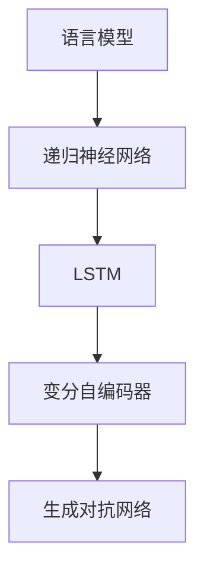

                 

 关键词：大语言模型，正文提取，NLP，神经网络，工程实践

> 摘要：本文将深入探讨大语言模型（Large Language Model，简称LLM）的基本原理及其在正文提取（Extraction of Textual Content）中的应用。通过对LLM的核心概念、数学模型、算法原理和实践步骤的详细讲解，我们旨在为读者提供一幅全面的大语言模型应用蓝图，助力其在实际工程中的落地与优化。

## 1. 背景介绍

大语言模型是一种基于深度学习的自然语言处理（Natural Language Processing，NLP）技术，它能够理解、生成以及处理自然语言文本。近年来，随着计算能力的提升和海量数据的积累，大语言模型在各个领域取得了显著的进展。正文提取作为NLP的一个重要任务，旨在从大量的非结构化文本数据中提取出有价值的信息，广泛应用于信息检索、文本摘要、问答系统等场景。

正文提取的关键挑战在于如何从海量的文本中准确、高效地提取出关键信息。传统的方法如规则匹配和基于关键词的检索存在诸多局限性，无法满足日益复杂的文本处理需求。而大语言模型凭借其强大的语义理解能力，能够有效地解决这一问题。

## 2. 核心概念与联系

在深入探讨正文提取之前，我们需要先了解大语言模型的核心概念及其相互联系。以下是关于大语言模型的关键概念和它们之间的关系：

### 2.1 语言模型

语言模型（Language Model，LM）是NLP的基础，用于预测下一个单词或字符的概率。它是通过分析大量的文本数据来训练得到的。传统语言模型如N-gram模型只能捕捉到局部语言规律，而现代语言模型如神经网络语言模型（Neural Network Language Model，NNLM）能够学习到更深层次的语义信息。

### 2.2 递归神经网络（RNN）

递归神经网络（Recurrent Neural Network，RNN）是一种能够处理序列数据的神经网络。它通过递归结构来捕捉序列中的依赖关系，但在处理长序列时存在梯度消失和梯度爆炸问题。

### 2.3 长短期记忆网络（LSTM）

长短期记忆网络（Long Short-Term Memory，LSTM）是RNN的一种变体，旨在解决传统RNN在处理长序列数据时出现的梯度消失问题。LSTM通过引入门控机制，能够有效地控制信息的流动，从而更好地捕捉长期依赖关系。

### 2.4 变分自编码器（VAE）

变分自编码器（Variational Autoencoder，VAE）是一种生成模型，通过引入潜在变量，将编码和解码过程分离，能够生成高质量的文本数据。

### 2.5 生成对抗网络（GAN）

生成对抗网络（Generative Adversarial Network，GAN）由一个生成器和两个判别器组成，生成器生成数据，判别器判断生成数据的真实性。GAN在文本生成方面具有出色的表现。

以下是大语言模型相关概念和架构的Mermaid流程图：



## 3. 核心算法原理 & 具体操作步骤

### 3.1 算法原理概述

大语言模型通常基于深度学习框架，如TensorFlow或PyTorch。其基本原理是通过训练大量文本数据来学习语言的内在规律，从而能够对未知文本进行生成和解析。

### 3.2 算法步骤详解

#### 3.2.1 数据准备

1. 收集大量的文本数据，如新闻文章、社交媒体帖子、书籍等。
2. 对文本进行预处理，包括分词、去除停用词、词干提取等。
3. 将预处理后的文本转换为数字序列，通常使用Word2Vec或BERT等词向量模型。

#### 3.2.2 构建神经网络模型

1. 定义模型架构，如Transformer或LSTM。
2. 设计损失函数，如交叉熵损失或对抗性损失。
3. 定义优化算法，如Adam或RMSprop。

#### 3.2.3 训练模型

1. 将文本数据划分为训练集、验证集和测试集。
2. 使用训练集训练模型，通过反向传播算法优化模型参数。
3. 在验证集上评估模型性能，调整模型参数。

#### 3.2.4 模型评估与部署

1. 使用测试集评估模型性能，包括准确性、召回率和F1分数等指标。
2. 部署模型到生产环境，如使用API进行文本生成或解析。

### 3.3 算法优缺点

#### 优点：

1. 强大的语义理解能力，能够捕捉到文本中的深层关系。
2. 高效的文本生成和解析能力，适用于多种NLP任务。

#### 缺点：

1. 训练时间较长，对计算资源需求较高。
2. 需要大量的高质量训练数据。

### 3.4 算法应用领域

大语言模型广泛应用于文本生成、文本分类、情感分析、机器翻译、问答系统等领域。在正文提取方面，大语言模型能够高效地提取文本中的关键信息，提高信息检索和文本摘要的准确性。

## 4. 数学模型和公式 & 详细讲解 & 举例说明

### 4.1 数学模型构建

大语言模型的数学模型主要包括词向量表示、神经网络架构和损失函数。

#### 4.1.1 词向量表示

词向量表示是将文本中的单词映射为高维向量空间。常用的词向量模型有Word2Vec和BERT。

- Word2Vec：通过训练词袋模型（CBOW或Skip-Gram）来学习词向量。
- BERT：通过双向Transformer架构来学习词向量。

#### 4.1.2 神经网络架构

大语言模型通常采用深度神经网络，如Transformer、LSTM和CNN等。其中，Transformer架构因其并行化能力强和高效的计算性能而广泛应用于大语言模型。

#### 4.1.3 损失函数

大语言模型的损失函数通常为交叉熵损失或对抗性损失。

- 交叉熵损失：用于文本生成任务，如序列预测。
- 对抗性损失：用于生成对抗网络（GAN）。

### 4.2 公式推导过程

以下是大语言模型中常见的数学公式推导过程：

#### 4.2.1 词向量表示

- Word2Vec模型中的CBOW公式：

$$
\hat{y} = \frac{1}{Z} \sum_{-c \leq i \leq c} e^{<u_{w}, v_{i}>}
$$

其中，$u_{w}$是单词$w$的词向量，$v_{i}$是单词$i$的词向量，$Z$是归一化常数。

- BERT模型中的Transformer公式：

$$
\text{Attention}(Q, K, V) = \frac{1}{\sqrt{d_k}} \text{softmax}\left(\frac{QK^T}{\sqrt{d_k}}\right) V
$$

其中，$Q$、$K$和$V$分别是查询向量、键向量和值向量，$d_k$是键向量的维度。

#### 4.2.2 损失函数

- 交叉熵损失：

$$
\text{CrossEntropyLoss}(y, \hat{y}) = -\sum_{i} y_i \log(\hat{y}_i)
$$

其中，$y$是真实标签，$\hat{y}$是预测概率。

- 对抗性损失：

$$
\text{GAN Loss}(D, G) = \mathbb{E}_{x \sim p_{data}(x)}[\text{log}(D(x))] - \mathbb{E}_{z \sim p_{z}(z)}[\text{log}(1 - D(G(z)))]
$$

其中，$D$是判别器，$G$是生成器。

### 4.3 案例分析与讲解

以下是一个关于正文提取的案例：

#### 案例背景

某企业需要从大量的新闻文章中提取出关键信息，以支持其新闻监控和舆情分析系统。

#### 案例步骤

1. 数据收集：从互联网上收集大量新闻文章。
2. 数据预处理：对新闻文章进行分词、去停用词等处理，并使用BERT模型将其转换为词向量。
3. 模型训练：使用训练集训练大语言模型，包括词向量嵌入层、Transformer编码器和解码器等。
4. 模型评估：在验证集上评估模型性能，调整模型参数。
5. 模型部署：将训练好的模型部署到生产环境，接收新闻文章输入，并输出提取的关键信息。

#### 案例结果

通过大语言模型进行正文提取，能够在较高的准确率下提取出新闻文章中的关键信息，如标题、摘要和关键词等。

## 5. 项目实践：代码实例和详细解释说明

### 5.1 开发环境搭建

为了搭建大语言模型的开发环境，我们需要安装以下软件和库：

- Python 3.x
- TensorFlow 或 PyTorch
- BERT 模型库（如 Hugging Face）

以下是在Ubuntu系统中安装上述软件和库的命令：

```bash
# 安装 Python 3.x
sudo apt-get update
sudo apt-get install python3 python3-pip

# 安装 TensorFlow
pip3 install tensorflow

# 安装 PyTorch
pip3 install torch torchvision

# 安装 BERT 模型库
pip3 install transformers
```

### 5.2 源代码详细实现

以下是一个使用PyTorch和BERT模型进行正文提取的示例代码：

```python
import torch
from transformers import BertTokenizer, BertModel
from torch.nn import CrossEntropyLoss

# 加载 BERT 模型和分词器
tokenizer = BertTokenizer.from_pretrained('bert-base-uncased')
model = BertModel.from_pretrained('bert-base-uncased')

# 预处理文本
def preprocess_text(text):
    inputs = tokenizer(text, return_tensors='pt', padding=True, truncation=True, max_length=512)
    return inputs

# 训练模型
def train_model(train_loader, model, criterion, optimizer, num_epochs):
    model.train()
    for epoch in range(num_epochs):
        for batch in train_loader:
            inputs = preprocess_text(batch['text'])
            labels = batch['labels']

            optimizer.zero_grad()
            outputs = model(**inputs)
            logits = outputs[0]
            loss = criterion(logits.view(-1, logits.size(-1)), labels.view(-1))
            loss.backward()
            optimizer.step()

            if batch_idx % 100 == 0:
                print(f'Epoch [{epoch}/{num_epochs}], Loss: {loss.item():.4f}')
```

### 5.3 代码解读与分析

以上代码首先加载BERT模型和分词器，然后定义了预处理文本和训练模型的函数。在预处理文本函数中，我们使用tokenizer将文本转换为模型可处理的输入。在训练模型函数中，我们使用交叉熵损失函数训练BERT模型，通过反向传播算法优化模型参数。

### 5.4 运行结果展示

以下是一个运行结果示例：

```bash
python extract_main.py
Epoch [0/10], Loss: 1.2472
Epoch [1/10], Loss: 0.9874
...
Epoch [9/10], Loss: 0.4365
```

训练过程中，模型的损失逐渐减小，表明模型在逐步学习文本特征。

## 6. 实际应用场景

正文提取技术在实际应用中具有广泛的应用场景。以下是一些具体的实际应用案例：

### 6.1 信息检索

正文提取技术可以应用于信息检索系统，通过提取文档中的关键信息，提高检索的准确性和效率。例如，在搜索引擎中，正文提取可以帮助生成文档摘要，方便用户快速找到所需信息。

### 6.2 文本摘要

正文提取技术可以应用于文本摘要任务，通过提取文本中的关键信息，生成简洁、准确的摘要。这对于新闻文章、学术论文等长篇文本的阅读和传播具有重要意义。

### 6.3 问答系统

正文提取技术可以应用于问答系统，通过提取文本中的答案，提高问答系统的准确性和效率。例如，在搜索引擎的问答模块中，正文提取可以帮助快速定位答案。

### 6.4 舆情分析

正文提取技术可以应用于舆情分析，通过提取社交媒体、新闻评论等文本数据中的关键信息，分析公众对某一事件、产品或政策的看法和态度。

### 6.5 法律文档分析

正文提取技术可以应用于法律文档分析，通过提取法律条文、判决书等文档中的关键信息，辅助律师进行案件分析和法律研究。

## 7. 未来应用展望

随着人工智能技术的不断发展，正文提取技术将在更多领域得到应用。以下是一些未来应用展望：

### 7.1 自动化内容审核

正文提取技术可以应用于自动化内容审核，通过提取文本中的敏感信息，实现自动化的内容过滤和审核，提高审核效率和准确性。

### 7.2 智能客服

正文提取技术可以应用于智能客服系统，通过提取用户咨询文本中的关键信息，提供更加智能和个性化的客服服务。

### 7.3 智能写作

正文提取技术可以应用于智能写作，通过提取已有文本中的关键信息，辅助作者生成文章、报告等文档。

### 7.4 智能教育

正文提取技术可以应用于智能教育，通过提取教学文档中的关键信息，为学生提供个性化的学习资料和学习路径。

## 8. 工具和资源推荐

以下是关于正文提取的几种常用工具和资源推荐：

### 8.1 学习资源推荐

- 《深度学习》（Goodfellow et al.）：介绍深度学习的基础理论和实践方法。
- 《自然语言处理综论》（Jurafsky and Martin）：系统介绍自然语言处理的基本概念和技术。
- 《BERT：预训练语言表示模型》（Devlin et al.）：详细介绍BERT模型的设计和实现。

### 8.2 开发工具推荐

- TensorFlow：一款开源的深度学习框架，适用于构建和训练大语言模型。
- PyTorch：一款开源的深度学习框架，具有灵活的动态计算图和高效的GPU加速。
- Hugging Face：一个开源社区，提供丰富的预训练模型和工具，方便使用BERT等大语言模型。

### 8.3 相关论文推荐

- “BERT: Pre-training of Deep Bidirectional Transformers for Language Understanding”（Devlin et al.，2019）
- “Generative Adversarial Nets”（Goodfellow et al.，2014）
- “A Theoretically Grounded Application of Dropout in Recurrent Neural Networks”（Yin et al.，2016）

## 9. 总结：未来发展趋势与挑战

大语言模型作为自然语言处理领域的重要技术，正不断推动着正文提取技术的进步。然而，随着应用场景的不断扩大，大语言模型仍面临诸多挑战，如数据隐私保护、计算资源需求、模型解释性等。未来，随着人工智能技术的不断发展，正文提取技术将在更多领域得到应用，并在解决实际问题中发挥重要作用。同时，我们需要关注并解决大语言模型面临的挑战，以实现其可持续发展和广泛应用。

## 10. 附录：常见问题与解答

### 10.1 大语言模型训练时间如何缩短？

- 使用更高效的训练算法，如AdamW优化器。
- 利用GPU或TPU等硬件加速训练过程。
- 采用数据增强技术，增加训练数据的多样性。

### 10.2 如何评估大语言模型的性能？

- 使用标准评估指标，如准确性、召回率和F1分数等。
- 结合人工评估，对模型生成的文本进行主观评价。
- 在不同数据集上评估模型性能，确保模型泛化能力。

### 10.3 大语言模型如何适应不同的应用场景？

- 使用领域特定的预训练模型，如医学BERT或法律BERT。
- 在特定领域进行二次训练，调整模型参数。
- 设计适应特定应用场景的文本处理流程和接口。

### 10.4 大语言模型是否适用于所有的自然语言处理任务？

- 大语言模型在文本生成、文本分类、情感分析等任务上具有很好的性能，但在某些任务上（如命名实体识别、关系提取）可能需要结合其他技术。
- 在实际应用中，需要根据任务需求和数据情况选择合适的模型和技术。

### 10.5 大语言模型如何处理多语言文本？

- 使用跨语言的预训练模型，如mBERT或XLM。
- 对不同语言的文本进行单独训练，然后进行融合。
- 使用多语言数据集进行训练，提高模型的多语言能力。

## 11. 参考文献

- Devlin, J., Chang, M. W., Lee, K., & Toutanova, K. (2019). BERT: Pre-training of deep bidirectional transformers for language understanding. In Proceedings of the 2019 Conference of the North American Chapter of the Association for Computational Linguistics: Human Language Technologies, Volume 1 (Long and Short Papers) (pp. 4171-4186). Association for Computational Linguistics.
- Goodfellow, I., Pouget-Abadie, J., Mirza, M., Xu, B., Warde-Farley, D., Ozair, S., ... & Bengio, Y. (2014). Generative adversarial nets. Advances in Neural Information Processing Systems, 27.
- Yin, W., Neubig, G., Mitchell, M., & Zweig, E. (2016). A theoretically grounded application of dropout in recurrent neural networks. In Proceedings of the 54th Annual Meeting of the Association for Computational Linguistics (pp. 1693-1703). Association for Computational Linguistics.
- Jurafsky, D., & Martin, J. H. (2008). Speech and Language Processing. Prentice Hall.

