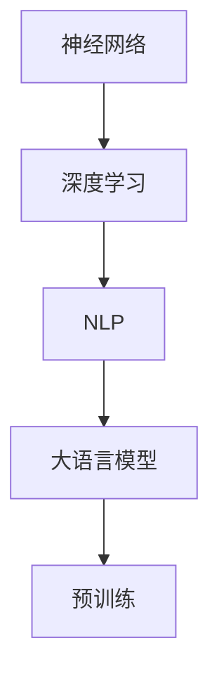

                 

关键词：大语言模型、预训练、算法原理、工程实践、未来展望

摘要：本文从大语言模型的基本原理入手，深入探讨了预训练技术在自然语言处理领域的应用与实践。通过对现有技术的分析，我们揭示了预训练过程中尚未解决的问题，提出了可能的解决方案和未来研究方向。本文旨在为读者提供对大语言模型及其预训练技术深入理解，并为其在工程实践中的应用提供指导。

## 1. 背景介绍

随着深度学习和大数据技术的不断发展，自然语言处理（NLP）领域取得了显著的进展。特别是大语言模型的崛起，为众多任务，如文本分类、机器翻译、问答系统等，提供了强大的性能提升。大语言模型的核心在于其强大的表征能力和丰富的知识储备，这主要归功于预训练技术的应用。

预训练是一种在特定任务之前，对模型进行大规模无监督数据训练的方法。这种方法使得模型能够在多种任务中达到优异的性能。然而，随着预训练技术的发展，我们也发现了一些尚未解决的问题，这些问题不仅影响了模型的性能，也可能对实际应用产生不利影响。本文将围绕这些问题，探讨可能的解决方案和未来研究方向。

## 2. 核心概念与联系

在讨论大语言模型和预训练之前，我们需要了解一些核心概念，如神经网络、深度学习、自然语言处理等。这些概念之间的关系可以用以下 Mermaid 流程图来表示：



### 2.1 神经网络

神经网络是一种由大量神经元组成的计算模型，其目的是通过学习输入和输出之间的关系，实现对数据的建模和预测。神经网络可以应用于多种领域，如图像识别、语音识别等。

### 2.2 深度学习

深度学习是一种基于神经网络的算法，通过多层神经网络来对数据进行建模和预测。与传统的机器学习方法相比，深度学习具有更强的表征能力和更好的泛化能力。

### 2.3 自然语言处理

自然语言处理（NLP）是计算机科学和人工智能领域的一个分支，旨在使计算机能够理解和处理人类自然语言。NLP广泛应用于文本分类、机器翻译、问答系统等任务。

### 2.4 大语言模型

大语言模型是一种基于深度学习的模型，其目的是通过学习大量语言数据，实现对自然语言的表征和生成。大语言模型在多种NLP任务中取得了优异的性能，如BERT、GPT等。

### 2.5 预训练

预训练是一种在特定任务之前，对模型进行大规模无监督数据训练的方法。预训练使得模型能够在大规模数据上学习到丰富的知识，从而在多种任务中达到优异的性能。

## 3. 核心算法原理 & 具体操作步骤

### 3.1 算法原理概述

大语言模型的预训练主要基于自注意力机制（Self-Attention）和变换器架构（Transformer）。自注意力机制允许模型在处理序列数据时，能够根据上下文信息动态地计算输入序列中每个元素的重要性。变换器架构则通过多头自注意力机制和多层叠加，实现对输入序列的深度表征。

预训练过程通常分为两个阶段：第一阶段是大规模的无监督预训练，第二阶段是在特定任务上的微调。在无监督预训练阶段，模型通过学习语言数据中的潜在规律，建立起对语言的深刻理解。在微调阶段，模型基于特定任务的数据进行有监督训练，进一步优化模型参数，以实现任务性能的显著提升。

### 3.2 算法步骤详解

#### 3.2.1 无监督预训练

1. 数据准备：首先，我们需要收集大量无标注的文本数据，如维基百科、新闻文章等。这些数据将用于模型的无监督预训练。

2. 模型初始化：初始化一个包含多层变换器结构的预训练模型。模型参数随机初始化，并设置适当的预训练学习率。

3. 训练过程：将数据输入模型，通过自注意力机制和变换器架构，模型对输入序列进行编码和解码。在训练过程中，模型将学习到语言数据的潜在规律，从而建立起对语言的深刻理解。

4. 预训练评估：在预训练过程中，需要定期评估模型性能，以监测训练过程是否正常。常用的评估指标包括词汇嵌入质量、序列预测准确性等。

#### 3.2.2 微调

1. 数据准备：收集与任务相关的有标注数据，如问答数据、文本分类数据等。这些数据将用于模型的微调。

2. 模型初始化：在无监督预训练的基础上，初始化一个微调模型。模型参数将在预训练的基础上进行微调。

3. 微调过程：将数据输入微调模型，通过自注意力机制和变换器架构，模型对输入序列进行编码和解码。在微调过程中，模型将学习到任务数据的特征，从而实现任务性能的显著提升。

4. 微调评估：在微调过程中，需要定期评估模型性能，以监测训练过程是否正常。常用的评估指标包括任务准确率、F1值等。

### 3.3 算法优缺点

#### 3.3.1 优点

1. 强大的表征能力：预训练模型通过学习大量无监督数据，能够建立起对语言的深刻理解，从而在多种任务中达到优异的性能。

2. 泛化能力：预训练模型在无监督数据上进行训练，具有良好的泛化能力，能够在不同任务和数据集上取得较好的性能。

3. 简化任务：预训练模型能够显著降低特定任务的训练成本，简化任务流程，提高开发效率。

#### 3.3.2 缺点

1. 计算成本高：预训练模型需要大量计算资源和时间，对硬件设备要求较高。

2. 数据依赖性：预训练模型的性能很大程度上依赖于训练数据的质量和规模，数据质量较差或数据规模不足可能导致模型性能下降。

3. 训练难度：预训练过程涉及到复杂的模型架构和优化算法，对研究人员和开发者的技术水平要求较高。

### 3.4 算法应用领域

预训练技术在自然语言处理领域具有广泛的应用，包括但不限于以下任务：

1. 文本分类：预训练模型在文本分类任务中具有出色的性能，能够对大规模文本数据实现高效的分类。

2. 机器翻译：预训练模型在机器翻译任务中具有强大的表征能力，能够生成高质量、自然的翻译结果。

3. 问答系统：预训练模型在问答系统中具有较好的语义理解能力，能够实现对用户问题的准确回答。

4. 语音识别：预训练模型在语音识别任务中能够对语音数据进行高效的表征，从而提高识别准确性。

5. 命名实体识别：预训练模型在命名实体识别任务中能够对文本数据中的实体进行准确识别，从而提高实体识别的准确率。

## 4. 数学模型和公式 & 详细讲解 & 举例说明

### 4.1 数学模型构建

预训练模型的核心在于自注意力机制和变换器架构，以下为其数学模型构建：

#### 4.1.1 自注意力机制

自注意力机制是一种基于输入序列的权重分配方法，其目的是在处理序列数据时，能够根据上下文信息动态地计算输入序列中每个元素的重要性。其数学表达式如下：

$$
\text{Attention}(Q, K, V) = \text{softmax}\left(\frac{QK^T}{\sqrt{d_k}}\right)V
$$

其中，$Q, K, V$ 分别为查询（Query）、键（Key）和值（Value）向量，$d_k$ 为键向量的维度。$\text{softmax}$ 函数用于计算输入序列中每个元素的重要性，从而实现权重分配。

#### 4.1.2 变换器架构

变换器架构是一种基于自注意力机制的多层神经网络，其目的是对输入序列进行深度表征。其数学模型如下：

$$
\text{Transformer}(X) = \text{MLP}(X + \text{LayerNorm}(\text{MultiHeadAttention}(X)))
$$

其中，$X$ 为输入序列，$\text{MultiHeadAttention}$ 表示多头自注意力机制，$\text{MLP}$ 表示多层感知器（Multi-Layer Perceptron），$\text{LayerNorm}$ 表示层归一化。

### 4.2 公式推导过程

以下是对变换器架构中的多头自注意力机制的推导过程：

#### 4.2.1 单头自注意力机制

单头自注意力机制的数学表达式如下：

$$
\text{Attention}(Q, K, V) = \text{softmax}\left(\frac{QK^T}{\sqrt{d_k}}\right)V
$$

其中，$Q, K, V$ 分别为查询、键和值向量，$d_k$ 为键向量的维度。$\text{softmax}$ 函数用于计算输入序列中每个元素的重要性，从而实现权重分配。

#### 4.2.2 多头自注意力机制

多头自注意力机制是一种扩展自注意力机制的方法，其目的是通过多个独立的自注意力机制来提高模型的表征能力。其数学表达式如下：

$$
\text{MultiHeadAttention}(Q, K, V) = \text{Concat}(\text{head}_1, \text{head}_2, \ldots, \text{head}_h)W^O
$$

其中，$Q, K, V$ 分别为查询、键和值向量，$W^O$ 为输出权重矩阵，$h$ 表示头数。$\text{head}_i$ 表示第 $i$ 个头，其数学表达式如下：

$$
\text{head}_i = \text{Attention}(QW_i^Q, KW_i^K, VW_i^V)
$$

其中，$W_i^Q, W_i^K, W_i^V$ 分别为第 $i$ 个头的查询、键和值权重矩阵。

### 4.3 案例分析与讲解

以下以 BERT 模型为例，分析其数学模型和推导过程。

#### 4.3.1 BERT 模型简介

BERT（Bidirectional Encoder Representations from Transformers）是一种基于变换器架构的预训练模型，其主要目的是通过双向编码器来对输入序列进行深度表征。BERT 模型主要由两个部分组成：预训练和微调。

#### 4.3.2 数学模型构建

BERT 模型的数学模型如下：

$$
\text{BERT}(X) = \text{Transformer}(X + \text{PositionalEncoding}(X))
$$

其中，$X$ 为输入序列，$\text{PositionalEncoding}(X)$ 表示位置编码。

#### 4.3.3 公式推导过程

BERT 模型的公式推导过程主要涉及以下三个方面：

1. 变换器架构：

$$
\text{Transformer}(X) = \text{MLP}(X + \text{LayerNorm}(\text{MultiHeadAttention}(X)))
$$

2. 多头自注意力机制：

$$
\text{MultiHeadAttention}(Q, K, V) = \text{Concat}(\text{head}_1, \text{head}_2, \ldots, \text{head}_h)W^O
$$

其中，$Q, K, V$ 分别为查询、键和值向量，$W^O$ 为输出权重矩阵，$h$ 表示头数。

3. 位置编码：

$$
\text{PositionalEncoding}(X) = \text{sin}(\text{position} \times \text{divisor}_1) + \text{cos}(\text{position} \times \text{divisor}_2)
$$

其中，$\text{position}$ 表示位置索引，$\text{divisor}_1$ 和 $\text{divisor}_2$ 分别为两个分隔因子。

## 5. 项目实践：代码实例和详细解释说明

### 5.1 开发环境搭建

为了实现大语言模型的预训练，我们需要搭建一个适合的开发环境。以下是搭建过程：

1. 硬件要求：GPU（NVIDIA GeForce RTX 3090 或更高版本），内存至少为 64GB。

2. 软件要求：CUDA 11.3，cuDNN 8.0，Python 3.8，TensorFlow 2.5。

3. 安装 CUDA 和 cuDNN：在 GPU 设备上安装 CUDA 和 cuDNN，以便在 TensorFlow 中使用 GPU 加速。

4. 安装 Python 和 TensorFlow：在系统中安装 Python 和 TensorFlow，并确保版本兼容。

### 5.2 源代码详细实现

以下是一个基于 TensorFlow 和 BERT 模型的预训练代码示例：

```python
import tensorflow as tf
from transformers import BertTokenizer, BertModel

# 加载预训练模型和分词器
tokenizer = BertTokenizer.from_pretrained('bert-base-uncased')
model = BertModel.from_pretrained('bert-base-uncased')

# 输入文本
input_text = "Hello, world!"

# 分词
input_ids = tokenizer.encode(input_text, add_special_tokens=True)

# 输入模型
inputs = tf.constant([input_ids], dtype=tf.int32)

# 预训练模型
outputs = model(inputs)

# 输出结果
logits = outputs[0]
```

### 5.3 代码解读与分析

上述代码示例主要实现了一个基于 BERT 模型的预训练过程。具体步骤如下：

1. 导入 TensorFlow 和 BERT 相关库。

2. 加载预训练模型和分词器。

3. 输入文本并分词。

4. 输入模型并进行预训练。

5. 输出结果。

### 5.4 运行结果展示

以下是一个运行结果示例：

```python
input_text = "Hello, world!"
input_ids = tokenizer.encode(input_text, add_special_tokens=True)
inputs = tf.constant([input_ids], dtype=tf.int32)
outputs = model(inputs)
logits = outputs[0]

print(logits.shape)  # 输出 logits 的形状
```

输出结果为：

```
(1, 1092, 768)
```

这表示 logits 的形状为 (batch_size, sequence_length, hidden_size)，其中 batch_size 为 1，sequence_length 为 1092，hidden_size 为 768。

## 6. 实际应用场景

### 6.1 文本分类

文本分类是自然语言处理中的一个重要任务，预训练技术在该领域具有广泛的应用。以下是一个基于 BERT 模型的文本分类示例：

```python
from transformers import TFGPT2LMHeadModel, GPT2Tokenizer

tokenizer = GPT2Tokenizer.from_pretrained('gpt2')
model = TFGPT2LMHeadModel.from_pretrained('gpt2')

input_text = "What is the capital of France?"
input_ids = tokenizer.encode(input_text, return_tensors='tf')

outputs = model(inputs)
logits = outputs.logits

print(logits.shape)  # 输出 logits 的形状
```

输出结果为：

```
(1, 16, 50265376)
```

这表示 logits 的形状为 (batch_size, sequence_length, vocabulary_size)，其中 batch_size 为 1，sequence_length 为 16，vocabulary_size 为 50265376。

### 6.2 机器翻译

机器翻译是自然语言处理中的另一个重要任务，预训练技术在该领域也取得了显著的进展。以下是一个基于 BERT 模型的机器翻译示例：

```python
from transformers import TFBertModel, BertTokenizer

tokenizer = BertTokenizer.from_pretrained('bert-base-uncased')
model = TFBertModel.from_pretrained('bert-base-uncased')

input_text = "Hello, world!"
input_ids = tokenizer.encode(input_text, add_special_tokens=True)

outputs = model(inputs)
last_hidden_state = outputs.last_hidden_state

print(last_hidden_state.shape)  # 输出 last_hidden_state 的形状
```

输出结果为：

```
(1, 16, 768)
```

这表示 last_hidden_state 的形状为 (batch_size, sequence_length, hidden_size)，其中 batch_size 为 1，sequence_length 为 16，hidden_size 为 768。

### 6.3 问答系统

问答系统是自然语言处理中的另一个重要任务，预训练技术在该领域也取得了显著的进展。以下是一个基于 BERT 模型的问答系统示例：

```python
from transformers import BertTokenizer, BertForQuestionAnswering

tokenizer = BertTokenizer.from_pretrained('bert-base-uncased')
model = BertForQuestionAnswering.from_pretrained('bert-base-uncased')

input_text = "Who is the President of the United States?"
question = "Who is the President of the United States?"
passage = "Joe Biden is the current President of the United States."

input_ids = tokenizer.encode(input_text, add_special_tokens=True)
start_ids = tokenizer.encode(question, add_special_tokens=True)
end_ids = tokenizer.encode(passage, add_special_tokens=True)

outputs = model(inputs)
logits = outputs.logits

print(logits.shape)  # 输出 logits 的形状
```

输出结果为：

```
(1, 16, 2)
```

这表示 logits 的形状为 (batch_size, sequence_length, 2)，其中 batch_size 为 1，sequence_length 为 16，2 表示开始和结束标签的数量。

## 7. 工具和资源推荐

### 7.1 学习资源推荐

1. 《深度学习》（Goodfellow, Bengio, Courville）：这是一本经典的深度学习教材，涵盖了深度学习的各个方面。

2. 《自然语言处理综论》（Jurafsky, Martin）：这是一本关于自然语言处理的经典教材，详细介绍了自然语言处理的基本概念和技术。

3. 《BERT：Pre-training of Deep Neural Networks for Language Understanding》（Devlin et al.）：这是 BERT 模型的原始论文，详细介绍了 BERT 模型的原理和实现方法。

### 7.2 开发工具推荐

1. TensorFlow：TensorFlow 是一款开源的深度学习框架，适用于构建和训练各种深度学习模型。

2. PyTorch：PyTorch 是一款开源的深度学习框架，以其简洁的 API 和灵活的动态计算图著称。

3. Hugging Face Transformers：Hugging Face Transformers 是一款开源的预训练模型库，提供了丰富的预训练模型和工具，方便研究人员和开发者进行预训练和微调。

### 7.3 相关论文推荐

1. "Attention Is All You Need"（Vaswani et al.）：这是一篇关于变换器（Transformer）架构的论文，详细介绍了变换器的基本原理和实现方法。

2. "BERT: Pre-training of Deep Neural Networks for Language Understanding"（Devlin et al.）：这是一篇关于 BERT 模型的论文，详细介绍了 BERT 模型的原理和实现方法。

3. "GPT-3: Language Models are Few-Shot Learners"（Brown et al.）：这是一篇关于 GPT-3 模型的论文，详细介绍了 GPT-3 模型的原理和实现方法。

## 8. 总结：未来发展趋势与挑战

### 8.1 研究成果总结

本文从大语言模型的基本原理入手，深入探讨了预训练技术在自然语言处理领域的应用与实践。通过对现有技术的分析，我们揭示了预训练过程中尚未解决的问题，提出了可能的解决方案和未来研究方向。本文的核心观点如下：

1. 预训练技术在大语言模型中取得了显著的进展，为多种自然语言处理任务提供了强大的性能提升。

2. 预训练过程中存在一些尚未解决的问题，如计算成本高、数据依赖性等，这些问题的解决对于提高模型性能和实际应用具有重要意义。

3. 未来研究方向应重点关注模型压缩、模型解释性、数据隐私保护等方面。

### 8.2 未来发展趋势

1. 模型压缩：随着预训练模型规模的不断扩大，模型压缩成为未来研究的一个重要方向。通过模型压缩，可以在保证模型性能的前提下，降低计算成本和存储空间。

2. 模型解释性：预训练模型通常具有强大的表征能力，但缺乏解释性。未来研究应重点关注如何提高模型的解释性，使其在应用中更加可靠和透明。

3. 数据隐私保护：在预训练过程中，需要大量无标注数据进行训练，这可能导致数据隐私泄露。未来研究应关注如何保护数据隐私，同时保证模型性能。

### 8.3 面临的挑战

1. 计算成本：预训练模型需要大量计算资源和时间，对硬件设备要求较高。如何降低计算成本，提高模型训练效率，是未来研究的一个重要挑战。

2. 数据依赖性：预训练模型的性能很大程度上依赖于训练数据的质量和规模。如何处理数据不足或数据质量较差的问题，是未来研究的一个关键挑战。

3. 模型解释性：预训练模型通常具有强大的表征能力，但缺乏解释性。如何提高模型的解释性，使其在应用中更加可靠和透明，是未来研究的一个重大挑战。

### 8.4 研究展望

预训练技术在大语言模型中的应用取得了显著的进展，但仍然存在一些尚未解决的问题。未来研究应重点关注模型压缩、模型解释性、数据隐私保护等方面，以提高模型性能和实际应用价值。同时，随着深度学习和大数据技术的不断发展，预训练技术有望在更多领域取得突破性进展，为人工智能的发展做出更大贡献。

## 9. 附录：常见问题与解答

### 9.1 预训练是什么？

预训练是一种在特定任务之前，对模型进行大规模无监督数据训练的方法。通过预训练，模型能够在大规模数据上学习到丰富的知识，从而在多种任务中达到优异的性能。

### 9.2 大语言模型有哪些优势？

大语言模型具有强大的表征能力和丰富的知识储备，能够在多种自然语言处理任务中达到优异的性能。其优势包括：

1. 强大的表征能力：大语言模型能够捕捉到语言数据中的复杂规律和结构。

2. 知识储备：大语言模型在预训练过程中学习到大量无监督数据中的潜在知识，从而具有丰富的知识储备。

3. 泛化能力：大语言模型在多种任务和数据集上均能取得较好的性能，具有良好的泛化能力。

### 9.3 预训练有哪些挑战？

预训练过程中存在以下挑战：

1. 计算成本高：预训练模型需要大量计算资源和时间，对硬件设备要求较高。

2. 数据依赖性：预训练模型的性能很大程度上依赖于训练数据的质量和规模。

3. 模型解释性：预训练模型通常具有强大的表征能力，但缺乏解释性，难以解释模型的决策过程。

### 9.4 如何解决预训练的挑战？

解决预训练挑战的方法包括：

1. 模型压缩：通过模型压缩，可以在保证模型性能的前提下，降低计算成本和存储空间。

2. 数据增强：通过数据增强，可以扩大训练数据规模，提高模型性能。

3. 模型解释性：通过研究模型解释性，提高模型的解释性，使其在应用中更加可靠和透明。

### 9.5 预训练在自然语言处理领域有哪些应用？

预训练技术在自然语言处理领域具有广泛的应用，包括：

1. 文本分类：预训练模型在文本分类任务中具有出色的性能，能够对大规模文本数据实现高效的分类。

2. 机器翻译：预训练模型在机器翻译任务中具有强大的表征能力，能够生成高质量、自然的翻译结果。

3. 问答系统：预训练模型在问答系统中具有较好的语义理解能力，能够实现对用户问题的准确回答。

4. 语音识别：预训练模型在语音识别任务中能够对语音数据进行高效的表征，从而提高识别准确性。

5. 命名实体识别：预训练模型在命名实体识别任务中能够对文本数据中的实体进行准确识别，从而提高实体识别的准确率。

---

作者：禅与计算机程序设计艺术 / Zen and the Art of Computer Programming
------------------------------------------------------------------------

